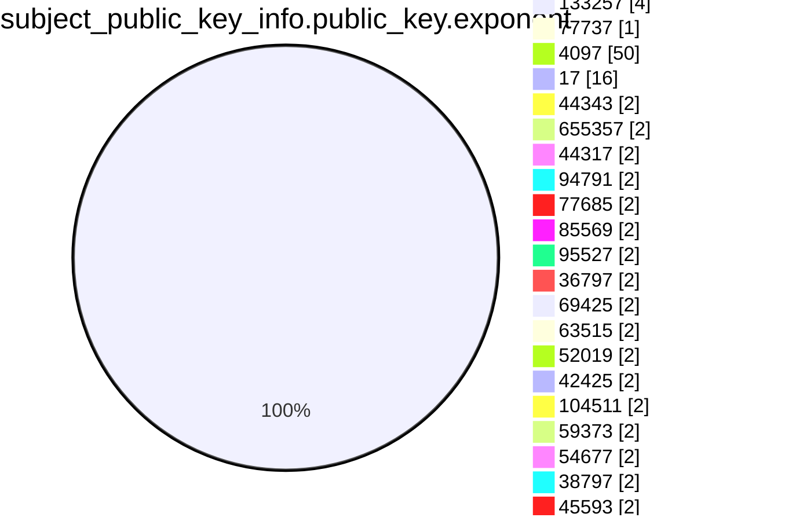
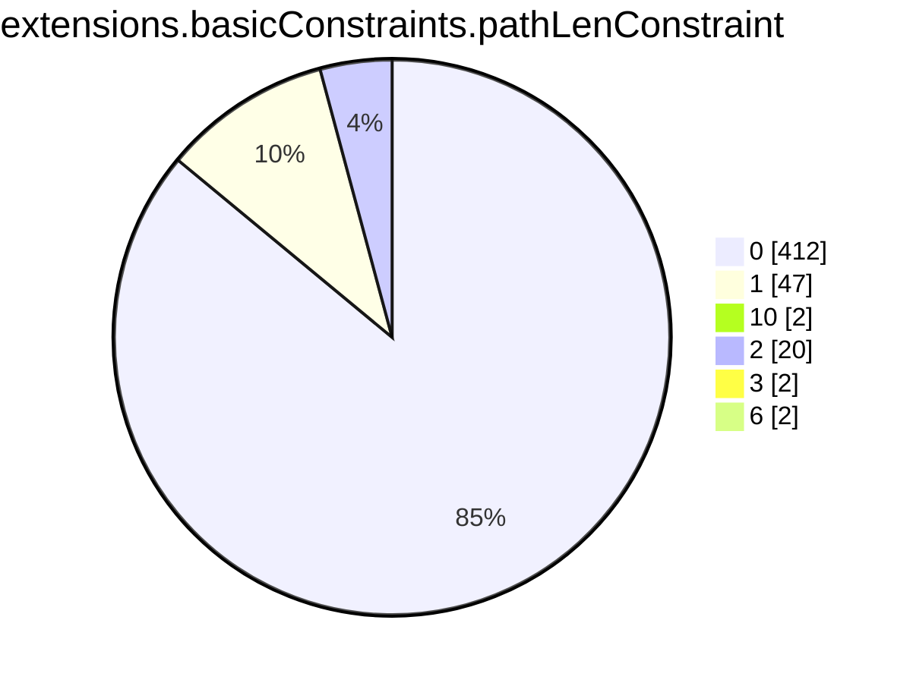

```mermaid
pie showData
title subject.cn.tld
"tw" :2692006
"si" :1398447
"com" :1276909683
"in" :16817918
"IN" :459
"at" :10516633
"ru" :48842407
"br" :43322523
"org" :74649050
"net" :112220413
"jp" :15238285
"uk" :55486926
"ph" :856798
"today" :538158
"nz" :5372370
"biz" :6609251
"studio" :1068089
"us" :9596659
"ca" :18582168
"solutions" :543421
"cc" :3831925
"au" :23679679
"online" :12788071
"shop" :8703955
"domains" :177114
"media" :705742
"kr" :3377732
"finance" :376890
"mx" :7003396
"directory" :69185
"life" :3529652
"bz" :233139
"xyz" :25738468
"co" :29306625
"info" :14969883
"estate" :57895
"club" :5078274
"my" :2092886
"pg" :20914
"site" :9178428
"me" :26425026
"eu" :17608978
"cn" :13146562
"live" :3166318
"io" :56250989
"de" :101100268
"ws" :451233
"press" :103280
"center" :437584
"store" :6154637
"education" :238776
"it" :20414311
"cl" :6303362
"rocks" :821407
"xn--p1ai" :3367871
"art" :1455562
"space" :4097175
"global" :312379
"asia" :1219976
"th" :829249
"care" :240870
"hk" :1187127
"sg" :1607244
"fr" :33691859
"beer" :79304
"cloud" :6870530
"tech" :6221030
"work" :2372690
"tr" :3386711
"wedding" :147773
"healthcare" :34334
"health" :170087
"ie" :1999278
"pro" :5026073
"ltd" :560713
"dk" :8096491
"id" :9242203
"es" :10276937
"consulting" :192950
"ro" :6336693
"nl" :37541940
"vn" :5027460
"pl" :21408698
"edu" :3235153
"no" :7476657
"dev" :16477293
"se" :12502735
"tv" :2304709
"mobi" :746437
"gov" :504278
"il" :2860020
"be" :12956223
"su" :1167800
"cz" :11878889
"world" :1071523
"click" :891532
"uno" :199907
"community" :140548
"faith" :29985
"pt" :3656584
"city" :427539
"za" :13571802
"aero" :205742
"lv" :1070794
"lu" :700316
"amsterdam" :186173
"company" :456153
"lundbeck" :10
"gs" :51749
"events" :224302
"gal" :44405
"wine" :84034
"army" :30731
"expert" :220816
"ch" :24335440
"bzh" :97184
"exchange" :99783
"farm" :159673
"coop" :156074
"app" :8567857
"support" :198845
"team" :753622
"uy" :524882
"london" :176219
"design" :1282096
"business" :195640
"gl" :49674
"sv" :61324
"lk" :479897
"xn--80asehdb" :18752
"hu" :8469566
"ai" :1740326
"ac" :118144
"cyou" :463993
"pet" :69231
"cy" :158502
"travel" :181644
"agency" :910305
"direct" :8645639
"int" :33577
"capital" :144993
"law" :90150
"ae" :821768
"py" :279744
"digital" :1503176
"bmw" :21319
"cards" :54791
"reit" :199
"church" :325554
"energy" :119442
"ar" :6207704
"la" :430061
"bet" :200305
"cr" :167818
"pub" :163095
"bank" :48536
"xn--80aswg" :13845
"pw" :1632612
"is" :905631
"tj" :38561
"moscow" :111795
"ag" :155710
"jobs" :67682
"COM" :40668
"marketing" :192143
"academy" :366664
"bm" :25517
"social" :231306
"ci" :127549
"solar" :64612
"ad" :14110
"love" :226703
"re" :340175
"ni" :24026
"school" :200038
"gr" :5130633
"systems" :542309
"software" :200562
"gt" :189584
"gg" :512933
"group" :760539
"fun" :2213442
"aw" :3702
"best" :379123
"land" :157373
"fit" :300320
"tokyo" :782674
"pe" :1285344
"ec" :468816
"photography" :379548
"games" :328088
"eco" :65022
"link" :3150187
"Nu" :4
"tools" :382239
"nyc" :316340
"je" :49734
"website" :2014283
"construction" :40618
"fi" :7103216
"rs" :1560641
"rip" :84392
"vision" :81289
"am" :273193
"mn" :193133
"kh" :39202
"plus" :394843
"kim" :59157
"bn" :7516
"coffee" :156515
"plumbing" :10163
"rentals" :58183
"cool" :275053
"guide" :94694
"BZ" :36
"blog" :1029234
"xn--p1acf" :113114
"om" :28951
"quebec" :30277
"kw" :25692
"cba" :1069
"jo" :27499
"sa" :520138
"network" :721229
"fitness" :79334
"bh" :18565
"icu" :882395
"sk" :3071217
"vip" :2679640
"gallery" :136374
"mo" :18405
"ua" :8082440
"email" :463549
"kpn" :276
"ke" :1106051
"gh" :66947
"management" :63011
"nu" :1573859
"fj" :17973
"Com" :682
"eg" :58581
"gi" :11431
"koeln" :75703
"saxo" :256
"video" :213488
"ee" :1908460
"bg" :933851
"pk" :1189899
"scot" :70619
"hr" :1162647
"green" :99275
"uz" :610528
"gmo" :127
"qa" :107322
"vegas" :36199
"ntt" :1454
"clinic" :88028
"kz" :1942267
"miami" :47627
"cymru" :31094
"st" :237173
"one" :1273447
"red" :188122
"ng" :1631678
"ma" :793718
"ve" :165585
"bo" :152623
"dog" :91628
"tz" :289641
"bd" :282637
"services" :436702
"DE" :615
"accountants" :6751
"mv" :41047
"photo" :207504
"mc" :29867
"delivery" :74284
"lt" :1537573
"mu" :79576
"hn" :48922
"tt" :21632
"canon" :1184
"repair" :31804
"news" :447815
"llc" :89291
"BR" :258
"fm" :190008
"training" :115449
"berlin" :177289
"theater" :8618
"do" :263246
"museum" :7443
"ao" :87421
"ps" :65186
"auction" :21924
"ooo" :105031
"legal" :93007
"to" :42217752
"vc" :317241
"graphics" :44010
"ist" :35694
"zone" :580978
"okinawa" :34052
"technology" :192785
"jewelry" :26800
"AU" :873
"black" :46658
"fund" :232034
"xn--3e0b707e" :5143
"top" :6211561
"bio" :155257
"inc" :27775
"JP" :522
"paris" :95178
"study" :64162
"bw" :61293
"ryukyu" :3064
"racing" :17994
"page" :2991744
"help" :165283
"taxi" :48492
"yokohama" :25496
"ge" :396894
"house" :170502
"villas" :7514
"by" :1551005
"ba" :274298
"eus" :114253
"clothing" :56355
"place" :68592
"trade" :136210
"va" :208
"supply" :38658
"cat" :727491
"yoga" :85605
"li" :496227
"HK" :186
"market" :192338
"hsbc" :139
"audio" :31167
"as" :102086
"mz" :86260
"az" :305485
"movie" :13587
"so" :253368
"bi" :32206
"zw" :228866
"earth" :145604
"cw" :6648
"xn--80adxhks" :43086
"ventures" :80315
"apple" :193
"al" :228534
"gmbh" :111853
"name" :662101
"MY" :62
"GOV" :2050
"tours" :58933
"express" :60437
"jll" :66
"works" :296854
"cab" :21611
"jm" :12465
"boutique" :113295
"guru" :396986
"band" :111278
"host" :672187
"dental" :44236
"tc" :39815
"build" :80613
"watch" :90834
"pa" :67487
"win" :744693
"mk" :282456
"ORG" :2622
"toys" :32104
"cd" :20812
"bayern" :89386
"onl" :76183
"menu" :62748
"ml" :2425213
"pics" :44629
"money" :112323
"yt" :37810
"foundation" :111546
"immo" :84371
"alsace" :12472
"enterprises" :26717
"ninja" :454679
"blue" :171686
"pizza" :64104
"tk" :3335555
"bar" :201601
"codes" :213219
"gift" :35739
"ga" :1541289
"markets" :9760
"woodside" :1243
"credit" :31622
"ceo" :130728
"wtf" :273448
"sh" :582882
"aws" :12052
"kg" :127268
"sarl" :9769
"holdings" :27006
"run" :2591846
"im" :438917
"report" :66987
"cm" :187615
"rugby" :2491
"fail" :26787
"fashion" :77345
"BIZ" :161
"cf" :1443127
"gy" :30909
"hamburg" :54281
"ovh" :1023836
"football" :24633
"beauty" :41543
"buzz" :845477
"kyoto" :10463
"statefarm" :24065
"et" :35727
"limited" :32664
"men" :80321
"vet" :70936
"cash" :138578
"science" :101873
"mm" :43911
"mt" :99887
"pictet" :712
"partners" :64617
"audi" :3982
"ms" :104164
"ly" :242914
"international" :93597
"engineering" :87662
"coach" :125721
"infiniti" :72
"gq" :752992
"film" :45089
"lol" :165074
"homes" :66263
"vlaanderen" :36236
"iq" :38492
"tax" :52340
"sx" :30825
"rest" :130014
"fyi" :137797
"man" :1756
"africa" :230378
"tn" :275758
"gold" :201280
"surf" :93583
"ink" :300791
"cam" :153208
"md" :439937
"pr" :10085
"xxx" :59690
"stream" :133088
"amazon" :84
"contact" :37803
"party" :156436
"lc" :35062
"ht" :25715
"careers" :40008
"lb" :25234
"archi" :25206
"dating" :29521
"ky" :36333
"lawyer" :21355
"wien" :71881
"xn--tckwe" :7363
"limo" :6982
"computer" :38219
"nagoya" :29875
"recipes" :19560
"reisen" :15667
"moe" :188434
"show" :150199
"monster" :399765
"lgbt" :21032
"mil" :13328
"realty" :312002
"sport" :6884
"casa" :1473838
"bj" :29547
"tienda" :15187
"np" :503422
"haus" :53986
"bt" :21179
"swiss" :151067
"brussels" :47744
"bbva" :58
"financial" :41656
"bike" :96040
"wales" :52542
"sb" :9472
"cx" :180237
"dance" :64041
"glass" :18622
"radio" :16105
"lat" :39441
"cooking" :11648
"wiki" :154130
"download" :59177
"tf" :57934
"tui" :560
"insure" :28239
"pink" :54375
"sc" :51093
"security" :6762
"deals" :48354
"style" :99832
"vg" :19764
"parts" :25677
"tube" :30635
"forum" :1812
"xn--90ais" :63641
"productions" :66443
"properties" :60267
"realestate" :37973
"reviews" :79650
"car" :2367
"chat" :202525
"shoes" :19266
"tel" :149233
"kpmg" :69
"vote" :24560
"rent" :40725
"fish" :42094
"quest" :143447
"melbourne" :29826
"wang" :105000
"mba" :27602
"sap" :58755
"ax" :52375
"camera" :17080
"kiwi" :60638
"ug" :95016
"loan" :29874
"investments" :20405
"bingo" :9971
"cpa" :15770
"ki" :4190
"INT" :18
"luxe" :6616
"sm" :15893
"family" :201399
"fan" :31231
"game" :28334
"attorney" :9248
"golf" :62779
"gd" :109822
"CL" :80
"bid" :100633
"sn" :67638
"NET" :3483
"dealer" :311
"fo" :59174
"schule" :40143
"holiday" :18904
"casino" :66232
"contractors" :10594
"sr" :17649
"town" :47504
"ruhr" :24561
"institute" :65694
"organic" :11415
"sale" :115204
"fox" :1768
"cafe" :178519
"adult" :4710
"corsica" :13036
"lighting" :22125
"tm" :18804
"voyage" :13919
"weir" :2783
"xn--fiqs8s" :12043
"ne" :6020
"salon" :33764
"hosting" :104039
"poker" :17349
"xn--mgbaam7a8h" :81
"tips" :98744
"pf" :19415
"xin" :42129
"auspost" :503
"na" :91382
"auto" :6834
"moda" :48025
"af" :44350
"nrw" :58925
"PRO" :4
"QA" :84
"NO" :44
"fans" :33613
"UK" :755
"garden" :28031
"pictures" :64871
"bs" :7715
"SE" :125
"flowers" :8955
"zm" :36469
"loans" :17995
"mortgage" :14715
"frl" :60249
"accountant" :6604
"Org" :83
"nc" :80134
"pm" :92365
"xn--ses554g" :739
"restaurant" :38952
"university" :42869
"srl" :75081
"gifts" :35666
"charity" :11735
"dz" :127686
"vi" :2732
"abbott" :2946
"ikano" :680
"photos" :146561
"rw" :95306
"tirol" :52205
"brother" :182
"sz" :10869
"camp" :61294
"clubmed" :1408
"saarland" :16347
"nr" :551
"ngo" :32006
"dentist" :9487
"irish" :20318
"krd" :9560
"promo" :52778
"discount" :9267
"EDU" :1265
"CA" :1624
"actor" :12969
"baby" :24266
"toyota" :338
"tl" :19799
"viajes" :6526
"boston" :9456
"tatar" :4679
"kitchen" :47560
"vin" :33348
"christmas" :6385
"trading" :10633
"review" :96548
"ski" :33910
"navy" :9810
"pharmacy" :1653
"xn--j1amh" :32297
"autos" :16487
"teva" :417
"gives" :13507
"vacations" :11435
"florist" :44244
"tg" :23202
"cleaning" :16711
"doctor" :43531
"suzuki" :197
"porn" :13901
"new" :19552
"gay" :169335
"webcam" :13934
"SA" :191
"KW" :34
"xn--kpry57d" :1697
"ricoh" :549
"afl" :331
"sbi" :586
"sky" :2033
"mw" :14282
"xn--d1acj3b" :4679
"AR" :70
"CN" :57
"NL" :246
"wf" :35886
"bot" :17210
"sexy" :22726
"mg" :65306
"ren" :48051
"physio" :9848
"vu" :157202
"mp" :7955
"cg" :9087
"ls" :16383
"bb" :6621
"hair" :15150
"IT" :205
"Gov" :112
"sncf" :547
"neustar" :1008
"builders" :39584
"cricket" :8971
"pfizer" :136
"sydney" :26085
"associates" :18030
"college" :17806
"US" :411
"fk" :629
"godaddy" :198
"jcb" :85
"abb" :2350
"gn" :3468
"soccer" :12295
"ck" :3457
"globo" :2250
"nissan" :81
"horse" :26841
"xn--mgberp4a5d4ar" :705
"soy" :11405
"xn--c1avg" :2852
"how" :24858
"dm" :4399
"cbs" :51
"date" :43169
"kn" :2819
"diamonds" :9454
"shopping" :40931
"nikon" :4
"rehab" :11862
"temasek" :48
"barcelona" :18035
"skin" :14527
"observer" :8695
"lamborghini" :457
"tickets" :1669
"sony" :99
"gm" :10638
"immobilien" :16986
"jetzt" :62151
"reise" :2964
"kaufen" :15394
"tennis" :8279
"singles" :12324
"xn--mk1bu44c" :2868
"tatamotors" :94
"itau" :159
"SG" :401
"hiphop" :1752
"gp" :9379
"tires" :5553
"ye" :5522
"total" :989
"EU" :186
"barclaycard" :268
"barclays" :1085
"property" :11292
"bnpparibas" :2156
"surgery" :10123
"cv" :23933
"engineer" :38225
"exposed" :11800
"xn--90ae" :6649
"catering" :14048
"MX" :74
"vodka" :6369
"hermes" :400
"taipei" :8179
"ong" :10095
"cologne" :12976
"km" :941
"gratis" :20745
"JM" :4
"claims" :11749
"gucci" :152
"bridgestone" :305
"versicherung" :3332
"istanbul" :16499
"playstation" :36
"goog" :324491
"xn--qxa6a" :235
"xn--e1a4c" :1867
"dj" :16373
"equipment" :13004
"fishing" :6817
"republican" :4221
"industries" :33072
"xn--q9jyb4c" :4284
"Lighting" :2
"SALE" :7
"condos" :8827
"nike" :843
"futbol" :10200
"gop" :6059
"honda" :120
"realtor" :92136
"hospital" :5831
"cfd" :93900
"gdn" :11418
"ONLINE" :12
"sl" :9521
"courses" :17872
"madrid" :7394
"xn--9dbq2a" :1920
"forsale" :21600
"mq" :2771
"AE" :138
"dvag" :11693
"RU" :82
"EMAIL" :7
"supplies" :14793
"apartments" :18893
"PH" :77
"compare" :1355
"xn--h2brj9c" :1652
"desi" :6872
"orange" :3307
"country" :5535
"cheap" :17066
"TR" :14
"dhl" :573
"hockey" :6288
"sex" :14466
"democrat" :4421
"blackfriday" :1425
"sucks" :1968
"diet" :3889
"degree" :3355
"xn--fiq228c5hs" :206
"lease" :10401
"osaka" :5835
"sakura" :30
"capetown" :21579
"bargains" :7195
"joburg" :12905
"xn--ngbc5azd" :630
"flights" :8728
"xn--6qq986b3xl" :9492
"durban" :8076
"sbs" :154536
"rodeo" :12992
"bond" :84387
"cruises" :4826
"mango" :123
"mom" :16105
"coupons" :9636
"abogado" :1553
"xn--qxam" :5469
"vanguard" :310
"tattoo" :38262
"xn--j6w193g" :5569
"airforce" :3511
"gf" :2625
"nf" :56349
"forex" :2337
"sd" :48623
"memorial" :5363
"creditcard" :4840
"broker" :6263
"crs" :3571
"jnj" :2192
"citic" :244
"boats" :3889
"PT" :20
"aeg" :5
"leclerc" :2947
"trust" :30
"ir" :5500205
"LONDON" :6
"lidl" :556
"ltda" :2520
"bf" :13697
"luxury" :5768
"Dk" :4
"insurance" :1887
"furniture" :17379
"yachts" :3247
"next" :981
"sandvik" :392
"Clinic" :2
"basketball" :3083
"Edu" :32
"hiv" :638
"genting" :28
"pioneer" :73
"DK" :277
"OM" :8
"post" :737
"CO" :66
"aquarelle" :91
"makeup" :8706
"Biz" :145
"FR" :151
"schwarz" :3225
"day" :26866
"mr" :9063
"bible" :23446
"NETWORK" :16
"monash" :312
"abudhabi" :1139
"RENTALS" :3
"gent" :50810
"shiksha" :2702
"ES" :318
"hm" :4208
"香港" :24
"maison" :6145
"moi" :460
"xn--6frz82g" :5684
"career" :4113
"jpmorgan" :4
"sy" :20669
"CBA" :48
"toray" :242
"xn--czrs0t" :184
"uol" :179
"td" :4726
"juegos" :944
"bradesco" :576
"storage" :2171
"williamhill" :22
"TH" :83
"scb" :134
"guitars" :2081
"Be" :4
"rich" :977
"xn--g2xx48c" :101
"Net" :75
"xn--mgbab2bd" :184
"xn--rhqv96g" :476
"select" :681
"erni" :103
"gripe" :1307
"sharp" :523
"CZ" :29
"schaeffler" :2199
"komatsu" :656
"anz" :338
"cars" :2472
"ZA" :120
"FI" :109
"BE" :106
"IE" :58
"philips" :15
"ismaili" :161
"schmidt" :214
"xn--o3cw4h" :1582
"KE" :23
"deloitte" :200
"IO" :35
"showtime" :7
"Co" :2
"nab" :8
"sener" :109
"BANK" :15
"abc" :100
"xn--czr694b" :291
"Za" :8
"HR" :54
"lotto" :176
"CM" :6
"theatre" :152
"uK" :15
"TW" :261
"praxi" :6
"xn--io0a7i" :860
"lr" :3910
"BH" :22
"MU" :10
"RE" :2
"xn--t60b56a" :360
"IL" :46
"DZ" :14
"EC" :12
"COMPANY" :9
"xn--vhquv" :92
"vig" :736
"cfa" :52
"CLOUD" :12
"voto" :1592
"pn" :1702
"aq" :1069
"ss" :1834
"lilly" :57
"azure" :190
"SI" :16
"jio" :48
"RO" :166
"GR" :113
"ID" :45
"voting" :246
"motorcycles" :2434
"axa" :237
"seat" :559
"rio" :9100
"sanofi" :242
"nico" :142
"ipiranga" :38
"xn--3ds443g" :318
"CAFE" :3
"xn--node" :653
"xn--vuq861b" :134
"kred" :1057521
"zuerich" :3015
"shell" :1605
"MD" :4
"NZ" :77
"microsoft" :52
"PY" :12
"xn--3hcrj9c" :81
"xn--90a3ac" :5210
"lego" :96
"goo" :47
"MIL" :51
"City" :18
"fresenius" :21
"xn--fiqz9s" :835
"ifm" :1033
"linde" :11
"cisco" :31
"aaa" :20
"TV" :12
"med" :202
"VN" :33
"smart" :44
"xn--y9a3aq" :2404
"mma" :74
"xn--otu796d" :70
"xn--czru2d" :100
"cuisinella" :46
"EG" :2
"PL" :17
"aig" :29
"panasonic" :48
"cu" :53416
"weber" :1360
"xn--55qx5d" :11744
"In" :8
"MO" :6
"ubs" :4
"NU" :2
"AG" :29
"xn--kput3i" :5663
"itv" :30
"flir" :47
"fage" :98
"mh" :71
"ET" :32
"yandex" :525
"protection" :106
"Zone" :8
"Asia" :8
"CH" :50
"LB" :39
"gw" :5891
"AO" :57
"stockholm" :64
"otsuka" :63
"SBI" :30
"MOBI" :23
"creditunion" :192
"Fr" :44
"ASIA" :24
"ericsson" :13
"kfh" :20
"amex" :4
"BRADESCO" :34
"xn--rvc1e0am3e" :63
"Live" :10
"hisamitsu" :433
"CI" :2
"natura" :13
"xn--54b7fta0cc" :690
"locus" :263
"LAW" :6
"xn--rovu88b" :6
"xn--1ck2e1b" :4
"xn--eckvdtc9d" :4
"qpon" :797
"imdb" :4
"free" :4
"read" :4
"tushu" :4
"xn--jlq480n2rg" :4
"silk" :4
"CD" :4
"LTD" :4
"BS" :2
"BM" :4
"bbc" :49
"edeka" :780
"airbus" :16
"chase" :10
"MADRID" :2
"call" :4
"audible" :4
"xn--unup4y" :96
"AT" :16
"COOP" :10
"NAME" :2
"bauhaus" :246
"WORLD" :4
"EUS" :6
"xn--5tzm5g" :859
"dubai" :59
"adac" :2
"INFO" :31
"arab" :4
"politie" :310
"NYC" :2
"jaguar" :5
"landrover" :5
"sew" :38
"lincoln" :4
"statebank" :66
"lanxess" :52
"TOP" :2
"nec" :57
"WS" :21
"rwe" :8
"DIGITAL" :20
"toshiba" :76
"xn--nqv7f" :198
"jprs" :41
"PE" :20
"frogans" :25
"SZ" :2
"Solutions" :6
"HU" :15
"LA" :14
"xn--fjq720a" :90
"ACADEMY" :8
"farmers" :8
"xfinity" :9
"comcast" :9
"ZM" :6
"TECH" :24
"FARM" :4
"XYZ" :84
"channel" :424
"Software" :4
"xn--2scrj9c" :150
"mutual" :9
"northwesternmutual" :4
"Tech" :3
"CLUB" :16
"JO" :36
"xn--xhq521b" :200
"bosch" :3
"samsung" :6
"nowruz" :80
"xn--hxt814e" :204
"xn--mgbca7dzdo" :6
"booking" :4
"dupont" :12
"CAT" :2
"extraspace" :62
"gu" :291
"MZ" :12
"aco" :1493
"redumbrella" :3
"travelers" :3
"travelersinsurance" :3
"trv" :3
"KR" :10
"BW" :4
"CR" :6
"Bid" :8
"mattel" :845
"HOUSE" :3
"bentley" :50
"xn--wgbh1c" :46
"guardian" :12
"APP" :4
"xn--zfr164b" :14
"xn--imr513n" :6
"LT" :8
"xn--s9brj9c" :103
"mini" :66
"xn--h2breg3eve" :107
"arpa" :12
"AERO" :7
"xn--xkc2dl3a5ee0h" :589
"analytics" :10
"Bank" :12
"Video" :4
"xn--gecrj9c" :98
"foo" :262
"KZ" :6
"Dog" :6
"gea" :134
"Info" :2
"GT" :2
"Uk" :12
"hyundai" :51
"Dev" :4
"xn--45brj9c" :351
"mit" :11
"amica" :4
"Land" :3
"AM" :6
"bms" :4
"xn--fpcrj9c3d" :100
"MT" :44
"RW" :6
"PF" :4
"broadway" :67
"WEIR" :2
"MA" :38
"Eu" :2
"ANZ" :12
"LIFE" :10
"UG" :5
"google" :52109
"ice" :10
"ZONE" :4
"xn--d1alf" :246
"Us" :2
"jmp" :10
"nra" :20
"accenture" :4
"FOX" :5
"bloomberg" :10
"msd" :2
"PK" :5
"icbc" :2
"GG" :16
"sas" :6
"mtr" :5
"UA" :4
"SINGLES" :4
"GL" :6
"KY" :2
"chintai" :24
"feedback" :1642
"zara" :18
"WORK" :4
"BN" :18
"RS" :4
"ME" :18
"DO" :13
"CC" :7
"SK" :6
"Mil" :2
"Store" :2
"COm" :2
"CY" :6
"tW" :2
"Ca" :4
"xbox" :8
"bing" :8
"windows" :8
"hotmail" :8
"skype" :8
"office" :8
"allfinanz" :408
"Social" :8
"GH" :4
"NG" :4
"NA" :2
"cern" :75
"HOST" :14
"ABUDHABI" :2
"VIP" :6
"crown" :3
"bR" :2
"SAP" :2
"bcn" :50
"IS" :2
"softbank" :94
"Global" :4
"STUDIO" :4
"SPACE" :8
"XN--P1AI" :28
"BO" :2
"coM" :4
"IQ" :4
"Health" :6
"EE" :2
"xn--fct429k" :2
"GAL" :2
"xn--ngbrx" :3
"La" :2
"cN" :2
"AI" :14
"xn--80ao21a" :632
"BG" :2
"kinder" :15
"walter" :4
"AF" :4
"SITE" :2
"GLOBAL" :5
"NTT" :6
"Online" :8
"hitachi" :71
"SL" :12
"QUEST" :4
"deV" :2
"ford" :4
"able" :8
"STORE" :2
"youtube" :476
"meet" :88
"ECO" :2
"beats" :6
"xn--mgbbh1a71e" :88
"xn--1qqw23a" :10897
"xn--i1b6b1a6a2e" :115
"ggee" :44
"tvs" :42
"xn--pgbs0dh" :24
"chrome" :21
"bugatti" :82
"bostik" :507
"firmdale" :1477
"maif" :237
"gle" :108
"TM" :2
"xn--mgbah1a3hjkrd" :44
"xn--gckr3f0f" :61
"vivo" :44
"xn--nqv7fs00ema" :27
"xn--mix891f" :24
"kosher" :16
"pru" :42
"stc" :43
"One" :3
"xn--ygbi2ammx" :23
"xn--mgbayh7gpa" :162
"mlb" :38
"vuelos" :15
"eurovision" :17
"alstom" :15
"TC" :2
"ieee" :14
"hoteles" :16
"Systems" :8
"wme" :16
"passagens" :17
"omega" :30
"ses" :2
"stada" :199
"SCOT" :8
"xn--4gbrim" :52
"netflix" :19
"CITY" :2
"Show" :2
"xn--mgba3a4f16a" :113
"redstone" :3
"lacaixa" :16
"swatch" :5
"whoswho" :35
"MR" :4
"epson" :44
"yodobashi" :42
"lixil" :30
"mitsubishi" :43
"Cloud" :6
"fujitsu" :47
"dnp" :42
"datsun" :46
"goldpoint" :43
"nhk" :43
"lotte" :45
"kddi" :41
"kia" :46
"arte" :111
"xn--fzc2c9e2c" :40
"dabur" :41
"fairwinds" :65
"firestone" :29
"lexus" :33
"INDUSTRIES" :3
"latrobe" :13
"citi" :13
"java" :52
"csc" :7
"cancerresearch" :16
"reliance" :29
"hdfc" :36
"ril" :30
"er" :47
"LU" :12
"Me" :4
"Space" :2
"oldnavy" :12
"rocher" :16
"athleta" :12
"helsinki" :33
"ferrero" :110
"LV" :2
"xn--45br5cyl" :13
"lplfinancial" :14
"lpl" :14
"ups" :10
"Market" :2
"GE" :3
"Academy" :18
"Jo" :2
"shia" :9
"pars" :9
"tci" :9
"TOKYO" :2
"abbvie" :54
"xn--mgbgu82a" :16
"xn--wgbl6a" :16
"gap" :10
"lancaster" :5
"xn--l1acc" :8
"bananarepublic" :9
"sandvikcoromant" :2
"xn--mgbbh1a" :4
"imamat" :2
"caravan" :2
"sfr" :1
"Photography" :2
"KH" :25
"рф" :1
"goV" :1
"xn--3bst00m" :2
"ally" :4
"TT" :1
"xerox" :2
"CRS" :1
"Pro" :2
"DEV" :1
"Loan" :4
"Healthcare" :1
"ML" :12
"Tk" :16
"watches" :4
"xn--ogbpf8fl" :130
"safety" :4
"grainger" :2
"TK" :34
"Ltd" :140
"xn--mgbpl2fh" :20
"xn--clchc0ea0b2g2a9gcd" :8
"xn--q7ce6a" :12
"xn--mgbcpq6gpa1a" :6
"xyZ" :4
"XN--5TZM5G" :8
"SCIENCE" :10
"xn--mgbai9azgqp6j" :4
"cLub" :4
"LI" :6
"goodyear" :2
"dunlop" :2
"Xyz" :2
"MONSTER" :10
"KG" :2
"CF" :10
"CLICK" :2
"SHOP" :2
```

```mermaid
pie showData
title issuer
"Google UK Ltd." :132309
"STRAC" :2
"Foundation for Trusted Identity" :2
"TSCP Inc." :3
"Cisco Systems" :2312
"行政院" :12
"KPN B.V." :2
"Actalis S.p.A.-03358520967" :2
"U.S. Government" :19
"CertiPath" :4
"WidePoint" :1
"A-Trust Ges. f. Sicherheitssysteme im elektr. Datenverkehr GmbH" :12
"AC Camerfirma S.A." :402
"ICP-Brasil" :6
"VeriSign, Inc." :19
"行政院" :44
"Baltimore" :32
"U.S. Government" :3
"Microsoft Corporation" :2
"VeriSign, Inc." :49
"A-Trust Ges. f. Sicherheitssysteme im elektr. Datenverkehr GmbH" :10
"FNMT-RCM" :8
"VeriSign, Inc." :6
"AC CAMERFIRMA S.A." :6
"VeriSign, Inc." :4
"Colegio de Registradores de la Propiedad y Mercantiles de España" :4
"thawte, Inc." :4
"行政院" :4
"DigiCert Inc" :10
"Hellenic Academic and Research Institutions Cert. Authority" :10
"Republika Slovenija" :4
"Elektronik Bilgi Guvenligi A.S." :4
"MULTICERT - Serviços de Certificação Electrónica S.A." :2
"E-Tuğra EBG Bilişim Teknolojileri ve Hizmetleri A.Ş." :10
"GeoTrust Inc." :4
"Hellenic Academic and Research Institutions Cert. Authority" :45
"Atos" :14
"Apple Inc." :117
"Apple Inc." :57
"SAFE-Biopharma" :2
"QuoVadis Limited" :10
"Apple Inc." :29
"POSTA" :6
"Secretaria de Economia" :6
"TÜRKTRUST Bilgi İletişim ve Bilişim Güvenliği Hizmetleri A.Ş." :4
"Elektronik Bilgi Guvenligi A.S." :2
"LAWtrust" :6
"AC Camerfirma SA" :2
"SwissSign AG" :2
"British Telecommunications plc" :12
"SAFE Identity" :2
"Certinomis" :2
"HydrantID (Avalanche Cloud Corporation)" :2
"QuoVadis Limited" :12
"GlobalSign" :2
"GlobalSign nv-sa" :5
"Institute for Development and Research in Banking Technology" :101
"U.S. Government" :3
"Actalis S.p.A." :6
"Symantec Corporation" :10
"Trustwave Holdings, Inc." :3
"Apple Inc." :49
"Sectigo Limited" :2
"GlobalSign nv-sa" :12
"WoSign CA Limited" :6
"VeriSign, Inc." :2
"Japanese Government" :2
"Unizeto Technologies S.A." :4
"ANF Autoridad de Certificacion" :4
"SwissSign AG" :2
"Google UK Ltd." :197103
"Hongkong Post" :10
"Vaestorekisterikeskus CA" :4
"QuoVadis Limited" :8
"certSIGN" :4
"DigiCert Inc" :4
"e-commerce monitoring GmbH" :10
"ICP-Brasil" :10
"DigiCert Inc" :4
"MINISTERE INTERIEUR" :2
"DigiCert Inc" :2
"Government Root Certification Authority" :2
"Open Access Technology International Inc" :2
"SECOM Trust Systems CO.,LTD." :10
"E-Tuğra EBG Bilişim Teknolojileri ve Hizmetleri A.Ş." :102
"Elektronik Bilgi Guvenligi A.S." :2
"行政院" :225
"ICP-Brasil" :2
"TÜRKTRUST Bilgi İletişim ve Bilişim Güvenliği Hizmetleri A.Ş." :4
"VeriSign, Inc." :8
"Apple Inc." :47
"Orion Health Inc." :4
"DigiCert Inc" :2
"ACNLB" :2
"QuoVadis Limited" :54177
"Apple Inc." :47
"The USERTRUST Network" :2
"GlobalSign nv-sa" :8
"GAD EG" :4
"VeriSign, Inc." :6
"NISZ Nemzeti Infokommunikációs Szolgáltató Zrt." :24
"QuoVadis Limited" :10
"SECOM Trust.net" :17
"Turkiye Bilimsel ve Teknolojik Arastirma Kurumu - TUBITAK" :2
"SwissSign AG" :5
"Verizon Business" :2
"ICP-Brasil" :2
"Symantec Corporation" :2
"SwissSign AG" :3
"Apple Inc." :2
"GoDaddy.com, Inc." :10246054
"GlobalSign nv-sa" :1195450
"GlobalSign nv-sa" :491296
"GlobalSign nv-sa" :1901423
"Starfield Technologies, Inc." :1162108
"GlobalSign nv-sa" :662695
"GlobalSign nv-sa" :76450
"GlobalSign nv-sa" :52893
"GlobalSign nv-sa" :87378
"Česká pošta, s.p." :3311
"Rede Nacional de Ensino e Pesquisa - RNP" :19522
"GlobalSign nv-sa" :400
"VALID CERTIFICADORA DIGITAL" :1490
"SOLUTI - SOLUCOES EM NEGOCIOS INTELIGENTES S-A" :96
"ATT Services Inc" :26739
"DigiCert Inc" :1757103
"Sectigo Limited" :94480628
"Internet2" :1333085
"SecureCore" :74335
"SECOM Trust Systems CO.,LTD." :85528
"DigiCert Inc" :7635286
"Network Solutions L.L.C." :323132
"DigiCert Inc" :547854
"GoGetSSL" :554432
"SSL Corporation" :292193
"The USERTRUST Network" :193088
"Sectigo Limited" :2479134
"Government of Korea" :2481
"DigiCert Inc" :25833
"DigiCert Inc" :627673
"DigiCert Inc" :2454398
"DigiCert Inc" :409493
"DigiCert Inc" :39472271
"SECOM Trust Systems CO.,LTD." :86030
"DigiCert Inc" :10848
"DigiCert Inc" :971
"DigiCert Inc" :51478
"DigiCert Inc" :89491
"DigiCert Inc" :114711
"UniTrust" :3122
"FUJIFILM" :872
"DigiCert Inc" :2255
"DigiCert Inc" :75212420
"Trust Provider B.V." :71694
"The Trustico Group Ltd" :35669
"DigiCert Inc" :285284
"DigiCert Inc" :7744
"GlobalSign nv-sa" :5152
"SecureCore" :3015
"Aetna Inc" :43327
"DigiCert Inc" :195045
"TrustAsia Technologies, Inc." :3399
"Technische Universitaet Dresden" :3416
"COMODO CA Limited" :763164
"Verein zur Foerderung eines Deutschen Forschungsnetzes e. V." :241910
"EUNETIC GmbH" :23151
"DigiCert Inc" :1180009
"Soluciones Corporativas IP, SL" :118243
"DigiCert Inc" :51491
"Fraunhofer" :19046
"Alpiro s.r.o." :29335
"DigiCert Inc" :680
"Sectigo Limited" :2104
"Network Solutions L.L.C." :91277
"DigiCert Inc" :8696
"DigiCert Inc" :1092
"DigiCert Inc" :8519
"Technische Universitaet Ilmenau" :1071
"DigiCert Inc" :665909
"Karlsruhe Institute of Technology" :5464
"DigiCert Inc" :25996
"Microsec Ltd." :1980
"Gandi" :1640776
"TBS INTERNET" :15870
"Siemens" :4
"Corporation Service Company" :141674
"EUNETIC GmbH" :483
"Max-Planck-Gesellschaft" :10374
"Nijimo K.K." :3138
"DigiCert Inc" :147191
"Sectigo Limited" :23321
"The USERTRUST Network" :6995
"DigiCert Inc" :101798
"Sectigo Limited" :8224524
"Internet2" :33884
"DigiCert Inc" :2955
"GoGetSSL" :962
"Trustwave Holdings, Inc." :34891
"DigiCert Inc" :128851
"Wells Fargo & Company" :13400
"Government of the District of Columbia" :1452
"DigiCert Inc" :2858
"K Software" :1594
"DigiCert Inc" :20673
"TrustAsia Technologies, Inc." :3768444
"WoTrus CA Limited" :32003
"Apple Inc." :7793
"Cybertrust Japan Co., Ltd." :73834
"BitCert" :1543
"CrowdStrike Inc." :324
"TAIWAN-CA" :777
"Cybertrust Japan Co., Ltd." :33923
"SSL Corp" :1483
"GoGetSSL" :3787
"DigiCert Inc" :977174
"DigiCert Inc" :3282
"Deutscher Bundestag" :378
"CentralNic Luxembourg Sàrl" :32572
"IZENPE S.A." :1642
"DigiCert Inc" :4730
"Chunghwa Telecom Co., Ltd." :9885
"SECOM Trust Systems CO.,LTD." :38153
"The Trustico Group Ltd" :411
"Corporation Service Company" :415
"MarketWare - Soluções para Mercados Digitais, Lda." :1187
"VALID CERTIFICADORA DIGITAL" :216
"CERTDATA SERVICOS DE INFORMACAO LTDA" :277
"Open Access Technology International Inc" :3517
"Apple Inc." :7753
"Internet2" :17291
"Amazon" :88292594
"WoTrus CA Limited" :6342
"Disig a.s." :965
"IZENPE S.A." :747
"DHIMYOTIS" :15075
"Aristotle University of Thessaloniki" :2323
"Buypass AS-983163327" :23219
"GEANT Vereniging" :13578
"GlobalSign nv-sa" :576
"Aetna Inc" :218
"SOLUTI - SOLUCOES EM NEGOCIOS INTELIGENTES S-A" :292
"Sectigo (Europe) SL" :13
"Fresenius Kabi AG" :338
"Apple Inc." :3394
"Trustwave Holdings, Inc." :580
"Apple Inc." :3214
"TrustAsia Technologies, Inc." :56974
"OpenTrust" :2
"GeoTrust Inc." :2
"Certinomis" :2
"Certinomis" :18
"SwissSign AG" :32138
"GeoTrust Inc." :2
"SwissSign AG" :2
"SwissSign AG" :8449
"SwissSign AG" :2
"DigiCert Inc" :840
"VI Registru centras - i.k. 124110246" :2
"Inera AB" :14
"Agence Nationale des Titres Sécurisés" :6
"CERTSIGN SA" :2
"CERTSIGN SA" :18
"China Financial Certification Authority" :5802
"China Financial Certification Authority" :1089
"China Financial Certification Authority" :2
"CERTSIGN SA" :2
"Netflix, Inc." :2
"Krajowa Izba Rozliczeniowa S.A." :2
"E-Tuğra EBG Bilişim Teknolojileri ve Hizmetleri A.Ş." :11033
"E-Tuğra EBG Bilişim Teknolojileri ve Hizmetleri A.Ş." :344
"Isimtescil Bilisim Anonim Sirketi" :2
"Isimtescil Bilisim Anonim Sirketi" :33673
"Krajowa Izba Rozliczeniowa S.A." :1927
"Vaestorekisterikeskus CA" :1725
"Vaestorekisterikeskus CA" :5
"Krajowa Izba Rozliczeniowa S.A." :2
"Vaestorekisterikeskus CA" :4
"E-Tuğra EBG Bilişim Teknolojileri ve Hizmetleri A.Ş." :2
"Vaestorekisterikeskus CA" :1764
"COMODO CA Limited" :18598
"Actalis S.p.A." :2465742
"RU-Center (ЗАО Региональный Сетевой Информационный Центр)" :2581
"QuoVadis Limited" :170097
"联通智慧安全科技有限公司" :90
"QuoVadis Trustlink B.V." :29529
"Buypass AS-983163327" :6499
"TeliaSonera" :24609
"CERTDATA SERVICOS DE INFORMACAO LTDA" :296
"MarketWare - Soluções para Mercados Digitais, Lda." :871
"HydrantID (Avalanche Cloud Corporation)" :1681665
"VTB BANK (PJSC)" :265
"sslTrus" :773
"Government of Korea" :332
"sslTrus" :2816
"DigiCert Inc" :802
"GlobalSign nv-sa" :10174
"DigiCert Inc" :36519
"Site Blindado S.A." :2146
"KICA" :12
"IdenTrust" :5955901
"IdenTrust" :12404
"DigiCert Inc" :220
"Corporation Service Company" :16214
"Actalis S.p.A." :24111
"SECOM Trust Systems CO.,LTD." :2257
"DigiCert Inc" :196
"Hongkong Post" :6896
"SSL.com" :769
"Microsec Ltd." :638
"TrustSign Certificadora Dig. & Soluções Segurança da Inf. Ltda." :4288
"Apple Inc." :500
"Apple Inc." :1399
"UniTrust" :2
"UniTrust" :2
"Open Access Technology International Inc" :1286
"Intesa Sanpaolo S.p.A." :9
"InfoCert S.p.A." :125
"InfoCert S.p.A." :58
"QuoVadis Limited" :6
"QuoVadis Limited" :6
"Turkiye Bilimsel ve Teknolojik Arastirma Kurumu - TUBITAK" :510
"HydrantID (Avalanche Cloud Corporation)" :2
"SwissSign AG" :44466
"NAVER BUSINESS PLATFORM Corp." :2
"SwissSign AG" :22854
"Japan Certification Services, Inc." :2
"ZETES SA (VATBE-0408425626)" :4
"QuoVadis Limited" :8
"TAIWAN-CA" :4
"TAIWAN-CA" :2
"SwissSign AG" :13898
"Baidu, Inc." :3186
"QuoVadis Trustlink B.V." :12312
"Turing Crypto GmbH" :366
"TAIWAN-CA" :124374
"Certinomis" :2
"Certinomis" :2
"SwissSign AG" :2
"Siemens" :2
"certSIGN" :2
"Vaestorekisterikeskus CA" :4
"certSIGN" :2
"Capricorn Identity Services Pvt Ltd." :2
"GAD EG" :2
"Abitab S.A." :2
"Disig a.s." :4
"Alpiro s.r.o." :128
"DigiCert Inc" :654
"SECOM Trust Systems CO.,LTD." :4641
"DigiCert Inc" :170582
"Entrust, Inc." :1384756
"WoTrus CA Limited" :234
"Sectigo Limited" :115777
"Turing Crypto GmbH" :16
"Telia Finland Oyj" :16914
"Trustwave Holdings, Inc." :2313
"TI Trust Technologies S.R.L." :6591
"SOLUTI - SOLUCOES EM NEGOCIOS INTELIGENTES S-A" :178
"VALID CERTIFICADORA DIGITAL" :326
"Trust Provider B.V." :2411
"Hellenic Academic and Research Institutions CA" :806
"Deutsche Telekom Security GmbH" :38
"Sectigo Limited" :136
"Hao Quang Viet Software Company Limited" :593
"GlobalSign nv-sa" :18108
"Digi- ja vaestotietovirasto CA" :2042
"GlobalSign nv-sa" :153
"Digi- ja vaestotietovirasto CA" :1524
"COMODO CA Limited" :4589
"Entrust, Inc." :109148
"Entrust, Inc." :5789
"DHIMYOTIS" :6193
"TBS INTERNET" :367
"DigiCert Inc" :450
"UniTrust" :396
"WoTrus CA Limited" :67
"DigiCert Inc" :52
"SECOM Trust Systems CO.,LTD." :343
"Nijimo K.K." :735
"eMudhra Technologies Limited" :13550
"DigiCert Inc" :342
"DigiCert Inc" :176
"Gandi" :2183
"Baidu, Inc." :345
"Beijing Xinchacha Credit Management Co., Ltd." :5629
"ITSO LTD" :247
"Domain The Net Technologies Ltd" :2678
"D-Trust GmbH" :42692
"DigiCert Inc" :519
"One Sign Pte. Ltd." :1741
"DigiCert Inc" :2038
"Microsoft Corporation" :4511830
"Microsoft Corporation" :4498107
"Global Digital Cybersecurity Authority Co., Ltd." :450
"Ziwit" :1156
"Entrust, Inc." :1271
"Staat der Nederlanden" :16
"T-Systems International GmbH" :42914
"DigiCert Inc" :119
"HydrantID (Avalanche Cloud Corporation)" :5016
"DigiCert Inc" :62
"DigiCert Inc" :58
"Ziwit" :38
"DigiCert Inc" :421608
"DigiCert Inc" :76
"Japan Registry Services Co., Ltd." :286787
"Cloudflare, Inc." :151253000
"Cisco Systems, Inc." :1044067
"Cloudflare, Inc." :40921171
"GEANT Vereniging" :947269
"cPanel, Inc." :113581773
"DigiCert Inc" :119402
"ZeroSSL" :15190296
"TrustCor Systems S. de R.L." :40103
"Japan Registry Services Co., Ltd." :6402
"NETLOCK Kft." :2522
"Genious Communications" :8457
"Unizeto Technologies S.A." :238415
"DOMENY.PL sp. z o.o" :35558
"swissns GmbH" :844
"McAfee, Inc." :4521
"GEANT Vereniging" :30033
"Hellenic Academic and Research Institutions Cert. Authority" :1189
"行政院" :38223
"ACCV" :3189
"WISeKey" :3578
"T-Systems International GmbH" :11227
"certSIGN" :2079
"WebSpace-Forum e.K." :62
"NetLock Kft." :1862
"Entrust Datacard Europe S.L." :239
"FNMT-RCM" :3710
"Atos" :6894
"TI Trust Technologies S.R.L." :1700
"Firmaprofesional S.A." :4528
"Financijska agencija" :1139
"LH.pl Sp. z o.o." :13345
"D-Trust GmbH" :3260
"Hellenic Academic and Research Institutions Cert. Authority" :158
"E-SAFER CONSULTORIA EM TECNOLOGIA DA INFORMACAO LTDA" :631
"cPanel, Inc." :564
"DNEncrypt, Inc" :901
"SECOM Trust Systems CO.,LTD." :15222
"SECOM Trust Systems CO.,LTD." :1486
"TrustAsia Technologies, Inc." :3275
"CerSign Technology Limited" :1186
"DigiCert Inc" :571
"eMudhra Technologies Limited" :1962
"Deutsche Post AG" :9312
"NetLock Kft." :1232
"Quantum CA Limited" :6038
"QuoVadis Trustlink B.V." :5509
"DOMENY.PL sp. z o.o" :1220
"cPanel, Inc." :693135
"Hellenic Academic and Research Institutions CA" :178
"Digital Trust L.L.C." :984
"Hellenic Academic and Research Institutions CA" :1218
"Agence Nationale de Certification Electronique" :156
"Quantum CA Limited" :50
"IdenTrust" :180
"WidePoint" :54
"Quantum CA Limited" :76
"Apple Inc." :69
"nazwa.pl sp. z o.o." :617411
"T-Systems International GmbH" :1176
"Comodo Japan, Inc." :3763
"sslTrus" :22
"Staclar, Inc." :298
"FNMT-RCM" :1739
"ICP-Brasil" :3080
"Sectigo Limited" :1242
"Microsoft Corporation" :7828107
"Microsoft Corporation" :7924457
"Anson Network Limited" :122
"Deutsche Kreditbank AG" :768
"DigiCert Inc" :754
"Netflix, Inc." :8
"home.pl S.A." :127645
"AffirmTrust" :230
"sslTrus" :3
"TrustOcean Limited" :439
"Vaestorekisterikeskus CA" :16
"DigiCert Inc" :76
"VISA" :195
"Actalis S.p.A." :2847
"Unizeto Technologies S.A." :2269
"DigiCert Inc" :158
"Hellenic Academic and Research Institutions CA" :496
"Hellenic Academic and Research Institutions CA" :98
"WoTrus CA Limited" :1012
"Hellenic Academic and Research Institutions CA" :88
"Hellenic Academic and Research Institutions CA" :46
"D-Trust GmbH" :344
"KICA" :188
"CertCloud Pte. Ltd." :46664
"eMudhra Technologies Limited" :539
"Alpiro s.r.o." :111
"TRUSTCUBES LIMITED" :28
"GlobalSign nv-sa" :57519
"certSIGN" :48
"GlobalSign nv-sa" :5522
"DigiCert Inc" :62
"GlobalSign nv-sa" :246
"ZeroSSL" :18819872
"Amazon" :6
"Amazon" :6
"Amazon" :6
"Amazon" :8
"Amazon" :7
"TrustAsia Technologies, Inc." :195
"Greek Universities Network (GUnet)" :58
"STCS" :2
"Sistema Nacional de Certificacion Electronica" :4
"Alibaba Cloud Computing Co., Ltd." :12
"A-Trust Ges. f. Sicherheitssysteme im elektr. Datenverkehr GmbH" :247
"NetLock Kft." :124
"Root Networks, LLC" :18207
"Dreamcommerce S.A." :34785
"Telia Finland Oyj" :74
"Telia Finland Oyj" :70
"Apple Inc." :228
"Microsoft Corporation" :9236248
"Microsoft Corporation" :9428767
"NETLOCK Ltd." :57
"FNMT-RCM" :332
"Microsec Ltd." :599
"TrustAsia Technologies, Inc." :30531
"TrustAsia Technologies, Inc." :2095972
"Quantum CA Limited" :1260
"Hellenic Academic and Research Institutions Cert. Authority" :114
"DigiCert, Inc." :173
"Hellenic Academic and Research Institutions CA" :222
"certSIGN" :4
"certSIGN" :4
"DigiCert, Inc." :38
"ZoTrus Technology Limited" :318
"DigiCert Inc" :12
"WebSpace-Forum e.K." :31
"Alibaba Cloud Computing Co., Ltd." :8
"Digi-Sign Limited" :486
"DigiCert, Inc." :12
"COMODO CA Limited" :45
"WISeKey" :4
"WISeKey" :4
"WISeKey" :4
"Hellenic Academic and Research Institutions CA" :92
"{'c': 'BE', 'cn': 'Citizen CA', 'serialnumber': '201409'}" :4
"{'c': 'BE', 'cn': 'Citizen CA', 'serialnumber': '201505'}" :5
"{'c': 'BE', 'cn': 'Citizen CA', 'serialnumber': '201511'}" :4
"{'c': 'BE', 'cn': 'Citizen CA', 'serialnumber': '201509'}" :4
"{'c': 'BE', 'cn': 'Citizen CA', 'serialnumber': '201503'}" :5
"{'c': 'BE', 'cn': 'Citizen CA', 'serialnumber': '201404'}" :4
"{'c': 'BE', 'cn': 'Citizen CA', 'serialnumber': '201507'}" :4
"{'c': 'BE', 'cn': 'Citizen CA', 'serialnumber': '201506'}" :4
"{'c': 'BE', 'cn': 'Citizen CA', 'serialnumber': '201632'}" :4
"{'c': 'BE', 'cn': 'Citizen CA', 'serialnumber': '201610'}" :4
"http:--repository.eid.belgium.be-" :7
"{'c': 'BE', 'cn': 'Citizen CA', 'serialnumber': '201512'}" :4
"{'c': 'BE', 'cn': 'Citizen CA', 'serialnumber': '201510'}" :4
"{'c': 'BE', 'cn': 'Citizen CA', 'serialnumber': '201606'}" :4
"{'c': 'BE', 'cn': 'Citizen CA', 'serialnumber': '201601'}" :4
"{'c': 'BE', 'cn': 'Citizen CA', 'serialnumber': '201625'}" :4
"http:--repository.eid.belgium.be-" :4
"{'c': 'BE', 'cn': 'Citizen CA', 'serialnumber': '201501'}" :5
"{'c': 'BE', 'cn': 'Citizen CA', 'serialnumber': '201406'}" :4
"http:--repository.eid.belgium.be-" :4
"{'c': 'BE', 'cn': 'Citizen CA', 'serialnumber': '201605'}" :4
"{'c': 'BE', 'cn': 'Citizen CA', 'serialnumber': '201602'}" :4
"{'c': 'BE', 'cn': 'Citizen CA', 'serialnumber': '201623'}" :4
"http:--repository.eid.belgium.be-" :4
"http:--repository.eid.belgium.be-" :4
"http:--repository.eid.belgium.be-" :4
"{'c': 'BE', 'cn': 'Citizen CA', 'serialnumber': '201628'}" :4
"{'c': 'BE', 'cn': 'Citizen CA', 'serialnumber': '201508'}" :4
"{'c': 'BE', 'cn': 'Citizen CA', 'serialnumber': '201624'}" :4
"http:--repository.eid.belgium.be-" :4
"{'c': 'BE', 'cn': 'Citizen CA', 'serialnumber': '201627'}" :4
"http:--repository.eid.belgium.be-" :4
"{'c': 'BE', 'cn': 'Foreigner CA', 'serialnumber': '201608'}" :4
"{'c': 'BE', 'cn': 'Citizen CA', 'serialnumber': '201626'}" :4
"{'c': 'BE', 'cn': 'Citizen CA', 'serialnumber': '201609'}" :4
"http:--repository.eid.belgium.be-" :4
"{'c': 'BE', 'cn': 'Citizen CA', 'serialnumber': '201403'}" :4
"{'c': 'BE', 'cn': 'Citizen CA', 'serialnumber': '201622'}" :4
"{'c': 'BE', 'cn': 'Foreigner CA', 'serialnumber': '201606'}" :5
"{'c': 'BE', 'cn': 'Citizen CA', 'serialnumber': '201604'}" :4
"{'c': 'BE', 'cn': 'Citizen CA', 'serialnumber': '201608'}" :4
"TERENA" :77090
"e-commerce monitoring GmbH" :73
"The Trustico Group Ltd" :36
"{'c': 'BE', 'cn': 'Citizen CA', 'serialnumber': '201405'}" :4
"{'c': 'BE', 'cn': 'Citizen CA', 'serialnumber': '201504'}" :4
"http:--repository.eid.belgium.be-" :4
"http:--repository.eid.belgium.be-" :4
"{'c': 'BE', 'cn': 'Citizen CA', 'serialnumber': '201408'}" :4
"{'c': 'BE', 'cn': 'Citizen CA', 'serialnumber': '201634'}" :4
"{'c': 'BE', 'cn': 'Citizen CA', 'serialnumber': '201629'}" :4
"{'c': 'BE', 'cn': 'Belgium Root CA4'}" :4
"{'c': 'BE', 'cn': 'Citizen CA', 'serialnumber': '201502'}" :4
"{'c': 'BE', 'cn': 'Citizen CA', 'serialnumber': '201621'}" :4
"{'c': 'BE', 'cn': 'Citizen CA', 'serialnumber': '201633'}" :4
"{'c': 'BE', 'cn': 'Citizen CA', 'serialnumber': '201631'}" :4
"{'c': 'BE', 'cn': 'Citizen CA', 'serialnumber': '201410'}" :4
"{'c': 'BE', 'cn': 'Citizen CA', 'serialnumber': '201603'}" :4
"TrustAsia Technologies, Inc." :1389
"Digi- ja vaestotietovirasto CA" :32
"{'c': 'BE', 'cn': 'Citizen CA', 'serialnumber': '201407'}" :4
"{'c': 'BE', 'cn': 'Citizen CA', 'serialnumber': '201607'}" :4
"{'c': 'BE', 'cn': 'Citizen CA', 'serialnumber': '201630'}" :4
"GEANT Vereniging" :16913
"GoGetSSL" :460
"GlobalSign nv-sa" :4
"TrustAsia Technologies, Inc." :87
"Global Digital Cybersecurity Authority Co., Ltd." :26
"Hellenic Academic and Research Institutions CA" :40
"QuoVadis Limited" :289
"Digital Trust L.L.C." :57
"TrustAsia Technologies, Inc." :94
"GlobalSign nv-sa" :847
"COMODO CA Limited" :13161
"Amazon" :207
"3CX" :44
"GlobalSign nv-sa" :2909
"GlobalSign nv-sa" :32
"DigiCert Inc" :3239
"DigiCert Inc" :150
"ICP-Brasil" :278
"Hellenic Academic and Research Institutions CA" :48
"Gehirn Inc." :11
"Hellenic Academic and Research Institutions CA" :6
"Hellenic Academic and Research Institutions CA" :6
"Siemens" :6
"SSL Corp" :64
"Global Digital Cybersecurity Authority Co., Ltd." :850
"DigiCert, Inc." :10
"DigiCert, Inc" :12
"DigiCert, Inc" :8
"DigiCert, Inc." :8
"DigiCert, Inc." :56
"DigiCert, Inc." :8
"DigiCert, Inc" :16
"Microsoft Corporation" :6350
"Hongkong Post" :22
"DigiCert Inc" :70
"Public Key Infrastructure Ltd" :14
"Unizeto Technologies S.A." :5102
"DigiCert, Inc." :2
"iTrusChina Co., Ltd." :3527
"DigiCert Inc" :16
"Globalsign nv-sa" :1080
"HydrantID (Avalanche Cloud Corporation)" :60503
"Microsoft Corporation" :6738
"Microsoft Corporation" :7050
"eMudhra Technologies Limited" :5
"TrustCor Systems S. de R.L." :18
"Beijing Xinchacha Credit Management Co., Ltd." :2750
"Beijing Xinchacha Credit Management Co., Ltd." :104
"iTrusChina Co., Ltd." :262
"United SSL Deutschland GmbH" :1547
"Entrust Datacard Deutschland GmbH" :15
"Hao Quang Viet Software Company Limited" :4
"DigiCert, Inc" :16
"EDICOM CAPITAL SL" :48
"Fuji Xerox" :1771
"Apple Inc." :215
"Network Solutions L.L.C." :1005
"Hellenic Academic and Research Institutions CA" :10
"Hellenic Academic and Research Institutions CA" :10
"VI Registru centras- i.k. 124110246" :2
"Firmaprofesional S.A." :192
"e-commerce monitoring GmbH" :4
"ARGE DATEN - Austrian Society for Data Protection" :4
"e-commerce monitoring GmbH" :4
"DocuSign France" :4
"Hellenic Academic and Research Institutions CA" :4
"Hellenic Academic and Research Institutions Cert. Authority" :8
"Hellenic Academic and Research Institutions CA" :4
"Firmaprofesional S.A. NIF A-62634068" :4
"{'c': 'ES', 'cn': 'Autoridad de Certificacion Firmaprofesional CIF A62634068'}" :8
"Hellenic Academic and Research Institutions Cert. Authority" :8
"Avalanche Cloud Corporation" :58
"Microsoft Corporation" :6417
"DigiCert Inc" :96
"JoySSL Limited" :2455
"CONSEJO GENERAL DE LA ABOGACIA" :4
"Consejo General de la Abogacia" :4
"Consejo General de la Abogacia" :4
"COMODO CA Limited" :35
"DigiCert Inc" :26
"eMudhra Technologies Limited" :14
"DigiCert Inc" :1933
"CrowdStrike, Inc." :191
"Sectigo Limited" :2559
"ZETES SA (VATBE-0408425626)" :6
"Global Digital Cybersecurity Authority Co., Ltd." :30
"DigiCert, Inc." :16
"DigiCert, Inc." :10
"DigiCert, Inc." :18
"DigiCert, Inc." :22
"Hellenic Academic and Research Institutions CA" :60
"E-TUGRA EBG BILISIM TEKNOLOJILERI VE HIZMETLERI ANONIM SIRKETI" :4143
"AffirmTrust" :295
"VALID CERTIFICADORA DIGITAL" :14
"UniTrust" :16
"DigiCert, Inc." :12
"Gehirn Inc." :190
"GlobalSign nv-sa" :210
"Entrust, Inc." :10
"PSW GROUP GmbH & Co. KG" :7
"AC CAMERFIRMA S.A." :4
"AC Camerfirma S.A." :4
"GoGetSSL" :12
"AC CAMERFIRMA S.A." :4
"Deutsche Telekom Security GmbH" :1988
"Isimtescil Bilisim A.S." :10640
"AC CAMERFIRMA S.A." :7
"Verokey" :6
"DigiCert, Inc." :12
"AC CAMERFIRMA S.A." :4
"AC CAMERFIRMA S.A." :4
"Global Digital Inc." :93
"Firmaprofesional S.A." :98
"E-TUGRA EBG BILISIM TEKNOLOJILERI VE HIZMETLERI ANONIM SIRKETI" :16
"MULTICERT - Serviços de Certificação Electrónica S.A." :1537
"CerSign Technology Limited" :12
"TrustAsia Technologies, Inc." :4
"Agencia Notarial de Certificacion S.L.U. - CIF B83395988" :5
"Agencia Notarial de Certificacion S.L.U. - CIF B83395988" :4
"Agencia Notarial de Certificacion S.L.U. - CIF B83395988" :4
"Agencia Notarial de Certificacion S.L.U. - CIF B83395988" :4
"Agencia Notarial de Certificacion S.L.U. - CIF B83395988" :4
"Agencia Notarial de Certificacion S.L.U. - CIF B83395988" :4
"D-Trust GmbH" :80
"GlobalSign nv-sa" :3
"Isimtescil Bilisim A.S." :2
"DigiCert, Inc." :22
"Digital Trust L.L.C." :107
"SECOM Trust Systems CO.,LTD." :38
"National Infrastructures for Research and Technology" :12
"DigiCert, Inc." :54
"První certifikační autorita, a.s." :454
"Hellenic Academic and Research Institutions CA" :12
"Hellenic Academic and Research Institutions CA" :14
"Hellenic Academic and Research Institutions CA" :12
"e-commerce monitoring GmbH" :67
"Hellenic Academic and Research Institutions CA" :14
"TrustSign Certificadora Dig. & Soluções Segurança da Inf. Ltda." :31
"Hellenic Academic and Research Institutions CA" :76
"Deutsche Telekom Security GmbH" :2
"ZoTrus Technology Limited" :20
"SafeToOpen Ltd" :930
"Digital Trust L.L.C." :438
"Globalsign nv-sa" :5661
"GlobalSign nv-sa" :62507
"AffirmTrust" :741
"GlobalSign nv-sa" :4875
"GlobalSign nv-sa" :263
"GlobalSign nv-sa" :5789
"DigiCert, Inc." :6
"eMudhra Technologies Limited" :14
"DNEncrypt, Inc" :5
"Sectigo Limited" :1426
"Microsoft Corporation" :5175
"ICP-Brasil" :196
"Nyatwork Communication Ltd" :264
"e-commerce monitoring GmbH" :32
"NAVER BUSINESS PLATFORM Corp." :93
"DNSPod, Inc." :1818
"DNSPod, Inc." :21
"Microsoft Corporation" :1264
"WoTrus CA Limited" :143
"ZoTrus Technology Limited" :6
"Network Solutions L.L.C." :6
"GEANT Vereniging" :329
"BitCert" :18
"GEANT Vereniging" :18
"Globalsign nv-sa" :61
"Global Digital Cybersecurity Authority Co., Ltd." :341
"DNSPod, Inc." :143
"TrustSign Certificadora Dig. & Soluções Segurança da Inf. Ltda." :87
"NETLOCK Ltd." :3
"E-SAFER CONSULTORIA EM TECNOLOGIA DA INFORMACAO LTDA" :77
"TrustAsia Technologies, Inc." :32
"Prodrive Technologies B.V." :415
"DigiCert, Inc." :389088
"DigiCert, Inc." :938680
"e-commerce monitoring GmbH" :28
"Genious Communications" :3
"Quantum CA Limited" :6
"Gehirn Inc." :17
"Hellenic Academic and Research Institutions CA" :20
"Hellenic Academic and Research Institutions CA" :139
"Hellenic Academic and Research Institutions CA" :551
"Certinomis" :82
"Hellenic Academic and Research Institutions CA" :163
"The USERTRUST Network" :9
"The USERTRUST Network" :12
"Hellenic Academic and Research Institutions CA" :68
"联通智慧安全科技有限公司" :24
"DigiCert Inc" :6
"Verokey" :10
"Siemens" :6
"Trustwave Holdings, Inc." :10
"Trustwave Holdings, Inc." :10
"Nijimo K.K." :456
"Chunghwa Telecom Co., Ltd." :226
"Verokey" :4
"Trustwave Holdings, Inc." :10
"Trustwave Holdings, Inc." :6
"Trustwave Holdings, Inc." :6
"cnWebTrust Inc" :6
"cnWebTrust Inc" :6
"北京中万网络科技有限责任公司" :42
"DigiCert  Inc" :4
"COMODO CA Limited" :94632
"COMODO CA Limited" :110749
"UniTrust" :14
"Shanghai Ping An Credit Reference Company Limited" :156
"TrustAsia Technologies, Inc." :3
"TK Elevator GmbH" :150
"ICP-Brasil" :6
"TrustCor Systems S. de R.L." :16
"Ziwit" :41
"北京中万网络科技有限责任公司" :12
"Nijimo K.K." :9
"Sectigo (Europe) SL" :65
"Corporation Service Company" :3
"Buypass AS-983163327" :306544
"Abitab S.A." :174
"SwissSign AG" :36
"SwissSign AG" :44
"SwissSign AG" :36
"E-TUGRA EBG BILISIM TEKNOLOJILERI VE HIZMETLERI ANONIM SIRKETI" :2
"Abitab S.A." :208
"Microsec Ltd." :560
"GlobalSign nv-sa" :3600
"GlobalSign nv-sa" :95549
"Globalsign nv-sa" :10327
"GlobalSign nv-sa" :399
"GlobalSign nv-sa" :124
"E-SAFER CONSULTORIA EM TECNOLOGIA DA INFORMACAO LTDA" :13
"Deutsche Telekom Security GmbH" :772
"SSL Corp" :18
"Hellenic Academic and Research Institutions CA" :16
"Beijing Xinchacha Credit Management Co., Ltd." :455
"Beijing Xinchacha Credit Management Co., Ltd." :950
"IdenTrust" :10
"SecureCore" :190
"DigiCert, Inc." :4
"Entrust, Inc." :10
"Shanghai Electronic Certificate Authority Center Co., Ltd." :4
"Shanghai Electronic Certificate Authority Center Co., Ltd." :2
"DigiCert Inc" :126
"Microsec Ltd." :665
"Deutsche Telekom Security GmbH" :18
"Deutsche Telekom Security GmbH" :20
"WoTrus CA Limited" :78
"AffirmTrust" :10
"AffirmTrust" :10
"AffirmTrust" :10
"Entrust EU, S.L." :17
"Kingnet Information Technology Co., Ltd." :61
"Alpiro s.r.o." :55
"Hellenic Academic and Research Institutions CA" :2
"NETLOCK Ltd." :3
"D-Trust GmbH" :2
"D-Trust GmbH" :2
"Xin Net Technology Corp." :22
"Xin Net Technology Corp." :9
"Positiwise Software LLC" :3
"Zhejiang Huluwa Digital Certification Co., Ltd." :4
"Zhejiang Huluwa Digital Certification Co., Ltd." :1
"GeoTrust Inc." :41
"QuoVadis Trustlink Schweiz AG" :6
"DigiCert Inc" :10
"U.S. Government" :12
"Cisco" :2
"MINISTERE INTERIEUR" :2
"U.S. Government" :456
"U.S. Government" :542
"Carillon Information Security Inc." :12
"COMODO CA Limited" :2
"Symantec Corporation" :13
"Starfield Technologies, Inc." :2
"Amazon" :2
"ComSign Ltd." :2
"GlobalSign nv-sa" :2
"U.S. Government" :8
"U.S. Government" :4
"U.S. Government" :10
"Entrust" :22
"D-Trust GmbH" :2
"Staat der Nederlanden" :7
"Symantec Corporation" :4
"Unizeto Technologies S.A." :7
"ICP-Brasil" :4
"GlobalSign nv-sa" :15
"StartCom Ltd." :17
"QuoVadis Trustlink B.V." :7
"ANSSI" :6
"MINISTERE DES AFFAIRES ETRANGERES" :2
"GlobalSign" :10
"QuoVadis Trustlink BVBA" :7
"MSC Trustgate.com Sdn. Bhd." :2
"Staat der Nederlanden" :20
"Symantec Corporation" :8
"GeoTrust Inc." :4
"ComSign Ltd." :2
"thawte, Inc." :2
"National Center for Digital Certification" :2
"D-Trust GmbH" :2
"Swisscom" :11
"QuoVadis Limited" :8
"VeriSign, Inc." :3
"Comodo CA Limited" :11
"QuoVadis Limited" :4
"QuoVadis Limited" :2
"JIPDEC" :5
"CertiSur S.A." :2
"VeriSign Japan K.K." :4
"IdenTrust" :4
"AC Camerfirma SA CIF A82743287" :4
"Symantec Corporation" :4
"Swisscom" :2
"Bechtel Corporation" :2
"OpenTrust" :3
"DigiCert Inc" :2
"IZENPE S.A." :6
"GlobalSign nv-sa" :2
"A-Trust Ges. f. Sicherheitssysteme im elektr. Datenverkehr GmbH" :2
"GlobalSign nv-sa" :4
"QuoVadis Limited" :2
"COMODO CA Limited" :8
"IZENPE S.A." :8
"Wells Fargo" :2
"Symantec Corporation" :2
"DigiCert Inc" :2
"SECOM Trust Systems CO.,LTD." :2
"Swisscom" :136
"SCEE - Sistema de Certificação Electrónica do Estado" :2
"IdenTrust" :4
"AC Camerfirma S.A." :4
"U.S. Government" :3
"Actalis S.p.A.-03358520967" :2
"Symantec Corporation" :1
"QuoVadis Limited" :3
"SCEE - Sistema de Certificação Electrónica do Estado" :2
"DATEV eG" :3
"GlobalSign nv-sa" :8863
"Symantec Corporation" :5
"IdenTrust" :51
"TERENA" :2827
"U.S. Government" :16
"Republika Slovenija" :7
"Symantec Corporation" :6
"Swiss Government PKI" :1
"Sectigo Limited" :1
"SCEE" :1
"Inera AB" :1533
"Deutsche Post AG" :2612
"Intesa Sanpaolo S.p.A." :185
"ATT Services Inc" :943
"GlobalSign nv-sa" :982
"U.S. Government" :13
"e-commerce monitoring GmbH" :20
"Institute for Development and Research in Banking Technology" :218
"Actalis S.p.A.-03358520967" :915
"Actalis S.p.A.-03358520967" :264
"A-Trust Ges. f. Sicherheitssysteme im elektr. Datenverkehr GmbH" :74
"TrustAsia Technologies, Inc." :560
"DigiCert, Inc." :12
"Microsoft Corporation" :462518
"Microsoft Corporation" :462736
"Microsoft Corporation" :462661
"Microsoft Corporation" :461891
"Japan Registry Services Co., Ltd." :10839
"DigiCert, Inc." :11
"National Institute of Informatics" :9090
"Globe Hosting, Inc." :1113
"Fresenius Kabi AG" :86
"WoTrus CA Limited" :530
"QuoVadis Trustlink BVBA" :338
"HydrantID (Avalanche Cloud Corporation)" :410
"Fiducia & GAD IT AG" :263
"QuoVadis Limited" :4874
"Rede Nacional de Ensino e Pesquisa - RNP" :2093
"QuoVadis Limited" :735
"Hellenic Academic and Research Institutions Cert. Authority" :15
"DigiCert, Inc." :8
"Actalis S.p.A.-03358520967" :53
"Hellenic Academic and Research Institutions Cert. Authority" :22
"Hellenic Academic and Research Institutions Cert. Authority" :10
"TRUSTCUBES LIMITED" :229
"Hellenic Academic and Research Institutions Cert. Authority" :70
"Japan Registry Services Co., Ltd." :361
"AC Camerfirma S.A." :537
"DigiCert, Inc." :8
"{'dc': 'ca', 'cn': 'Posta CA 1'}" :3
"TrustAsia Technologies, Inc." :20
"Institute of Accelerating Systems and Applications" :12
"SwissSign AG" :17367
"Firmaprofesional S.A." :226
"Hellenic Academic and Research Institutions Cert. Authority" :17
"Network Solutions L.L.C." :1153
"WISeKey" :40
"Hellenic Academic and Research Institutions Cert. Authority" :11
"Fuji Xerox" :66
"Dodo Sign Ltd" :9
"DigiCert Inc" :4
"DigiCert Inc" :41
"National Institute of Informatics" :66
"Agenzia per l'Italia Digitale" :34
"TrustCor Systems S. de R.L." :14
"Fiducia & GAD IT AG" :63
"DigiCert Inc" :25
"{'c': 'LV', 'ou': 'Sertifikacijas pakalpojumu dala', 'cn': 'E-ME PSI (PCA)'}" :2
"MarketWare - Soluções para Mercados Digitais, Lda." :279
"成都数证科技有限公司" :4
"NetLock Kft." :968
"Shanghai Ping An Credit Reference Company Limited" :152
"QuoVadis Trustlink B.V." :57
"DigiCert Inc" :6
"DigiCert, Inc." :8
"VALID CERTIFICADORA DIGITAL" :47
"UniTrust" :1171
"GlobalSign nv-sa" :38
"Prodrive Technologies B.V." :10
"Domain The Net Technologies Ltd" :18
"GlobalSign nv-sa" :5071
"VALID CERTIFICADORA DIGITAL" :20
"VALID CERTIFICADORA DIGITAL" :10
"EDICOM" :52
"Hellenic Academic and Research Institutions Cert. Authority" :10
"UniTrust" :146
"SERVICE-PUBLIC GOUV MINISTERE EN CHARGE DE L'AGRICULTURE" :2
"DigiCert Inc" :4
"Aetna Inc" :4
"Apple Inc." :1
"The Trustico Group Ltd" :286
"DigiCert Inc" :4
"Fiducia & GAD IT AG" :344
"Microsec Ltd." :653
"DigiCert, Inc." :189
"TrustAsia Technologies, Inc." :5
"Fiducia & GAD IT AG" :90
"CrowdStrike, Inc." :8
"SOLUTI - SOLUCOES EM NEGOCIOS INTELIGENTES S-A" :2
"VISA" :64
"TrustOcean Ltd." :209
"Root Networks, LLC" :35
"WebNIC" :223
"Entrust, Inc." :3
"SSLs.com" :13
"AC Camerfirma SA" :5
"GlobalSign nv-sa" :33871
"KPN B.V." :22403
"DigiCert Grid" :10
"QuoVadis Trustlink B.V." :16003
"Plex, Inc." :1913479
"FNMT-RCM" :1595
"D-Trust GmbH" :1
"DigiCert Inc" :14
"DigiCert, Inc." :4
"DigiCert, Inc." :4
"DigiCert, Inc." :4
"DigiCert, Inc." :4
"DigiCert, Inc." :4
"DigiCert, Inc." :6
"TrustAsia Technologies, Inc." :8
"Actalis S.p.A.-03358520967" :2
"Unizeto Technologies S.A." :4
"Apple Inc." :52
"DigiCert Inc" :6
"Microsoft Corporation" :77
"Microsoft Corporation" :68
"UniTrust" :10
"DigiCert, Inc." :4
"Quantum CA Limited" :6
"TrustOcean Limited" :2719
"TrustOcean Limited" :21227
"Omit Security, Inc" :9
"VTB BANK (PJSC)" :10
"VTB BANK (PJSC)" :12
"联通智慧安全科技有限公司" :16
"D-Trust GmbH" :4
"D-Trust GmbH" :4
"Hellenic Academic and Research Institutions CA" :10
"Yandex LLC" :2870
"Hellenic Academic and Research Institutions CA" :14
"Hellenic Academic and Research Institutions CA" :14
"Alibaba Cloud Computing Co., Ltd." :196
"ANF Autoridad de Certificacion" :4
"TrustOcean Ltd." :32
"DigiCert Inc" :2
"Microsoft Corporation" :62
"Prodrive Technologies B.V." :10
"eMudhra Inc" :6
"eMudhra Inc" :6
"eMudhra Inc" :6
"eMudhra Technologies Limited" :6
"eMudhra Inc" :7
"eMudhra Technologies Limited" :6
"GlobalSign nv-sa" :8
"GlobalSign nv-sa" :8
"GlobalSign nv-sa" :8
"Bloomberg LP" :4
"INTEGRITY Security Services LLC" :6
"PSW GROUP GmbH & Co. KG" :57
"BitCert" :5
"Google Trust Services LLC" :17549730
"Google Trust Services LLC" :8716110
"Let's Encrypt" :2187860793
"Google Trust Services LLC" :101296
"e-commerce monitoring GmbH" :10
"e-commerce monitoring GmbH" :10
"e-commerce monitoring GmbH" :12
"Let's Encrypt" :72089224
"SECOM Trust Systems CO.,LTD." :10
"SECOM Trust Systems CO.,LTD." :10
"INTEGRITY Security Services LLC" :3
"Alpiro s.r.o." :3
"Google Trust Services LLC" :6
"National Digital Certification Agency" :6
"U.S. Government" :11
"TrustOcean Limited" :30
"Google Trust Services LLC" :18
"Google Trust Services LLC" :10
"Google Trust Services LLC" :10
"Google Trust Services LLC" :8
"Google Trust Services LLC" :8
"CertCloud Pte. Ltd." :3
"Gehirn Inc." :9
"Apple Inc." :46
"ZoTrus Technology Limited" :3
"DigiCert, Inc." :1
"Agenzia per l'Italia Digitale" :35
"Abitab S.A." :16
"AS Sertifitseerimiskeskus" :8
"AS Sertifitseerimiskeskus" :8
"Staat der Nederlanden" :16
"DHIMYOTIS" :2
"Unizeto Technologies S.A." :7
"Asseco Data Systems S.A." :2
"Fuji Xerox" :6
"Asseco Data Systems S.A." :2
"KPN B.V." :8
"T-Systems Enterprise Services GmbH" :4
"DHIMYOTIS" :2
"Cybertrust Japan Co.,Ltd." :2
"Kingnet Information Technology Co., Ltd." :12
"Kingnet Information Technology Co., Ltd." :52
"LuxTrust S.A." :2
"Entrust" :4
"Hongkong Post" :4
"WoSign eCommerce Services Limited" :2
"WoSign CA Limited" :4
"WoSign CA Limited" :2
"Hongkong Post" :4
"GUANG DONG CERTIFICATE AUTHORITY CO.,LTD." :4
"GlobalSign" :4
"WoSign CA Limited" :2
"GlobalSign" :4
"WoSign CA Limited" :2
"ACCV" :2
"AffirmTrust" :2
"AffirmTrust" :2
"AffirmTrust" :2
"AffirmTrust" :2
"ANF Autoridad de Certificacion" :2
"Agence Nationale des Titres Sécurisés" :4
"WoSign CA Limited" :2
"Agence Nationale des Titres Sécurisés" :4
"ANF Autoridad de Certificacion" :2
"Apple Inc." :24
"Republika Slovenija" :4
"AC Camerfirma S.A." :2
"AC CAMERFIRMA S.A." :2
"AC Camerfirma S.A." :2
"DigitalSign Certificadora Digital" :2
"AC Camerfirma S.A." :2
"CONSORCI ADMINISTRACIO OBERTA DE CATALUNYA" :2
"Agencia Catalana de Certificacio (NIF Q-0801176-I)" :2
"GOV" :2
"U.S. Government" :2
"{'c': 'BE', 'cn': 'Foreigner CA', 'serialnumber': '201607'}" :2
"Entrust, Inc." :3
"eMudhra Consumer Services Limited" :2
"Entrust, Inc." :2
"Entrust, Inc." :2
"Entrust, Inc." :2
"eMudhra Inc" :2
"eMudhra Technologies Limited" :2
"eMudhra Inc" :2
"Financijska agencija" :2
"Entrust, Inc." :2
"eMudhra Technologies Limited" :2
"Entrust, Inc." :2
"Trustis Limited" :2
"MULTICERT - Serviços de Certificação Electrónica S.A." :2
"SECOM Trust Systems CO.,LTD." :6
"GlobalSign nv-sa" :4
"GlobalSign nv-sa" :4
"The Go Daddy Group, Inc." :2
"Buypass AS-983163327" :4
"GlobalSign nv-sa" :4
"FNMT-RCM" :2
"GlobalSign nv-sa" :6
"GlobalSign nv-sa" :4
"GlobalSign nv-sa" :4
"První certifikační autorita, a.s." :2
"Hellenic Academic and Research Institutions Cert. Authority" :9
"Hellenic Academic and Research Institutions Cert. Authority" :10
"Hellenic Academic and Research Institutions Cert. Authority" :11
"Hellenic Academic and Research Institutions Cert. Authority" :13
"Keynectis" :2
"GlobalSign nv-sa" :4
"Buypass AS-983163327" :4
"Siemens" :2
"MULTICERT - Serviços de Certificação Electrónica S.A." :2
"První certifikační autorita, a.s." :98
"Symantec Corporation" :4
"Entrust" :24
"Hellenic Academic and Research Institutions Cert. Authority" :10
"National Center for Digital Certification" :2
"Česká pošta, s.p." :4
"Electronic Transactions Development Agency (Public Organization)" :2
"GlobalSign nv-sa" :6
"Siemens" :2
"XRamp Security Services Inc" :2
"První certifikační autorita, a.s." :2
"Verein zur Foerderung eines Deutschen Forschungsnetzes e. V." :2
"Česká pošta, s.p. [IČ 47114983]" :2
"Trustwave Holdings, Inc." :2
"SSL Corporation" :6
"Sistema Nacional de Certificacion Electronica" :2
"SSL Corporation" :6
"Trustwave Holdings, Inc." :2
"Siemens" :2
"SSL Corporation" :6
"První certifikační autorita, a.s." :4
"První certifikační autorita, a.s." :2
"Siemens" :2
"Starfield Technologies, Inc." :2
"Hellenic Academic and Research Institutions Cert. Authority" :9
"FNMT-RCM" :2
"U.S. Government" :2
"SSL Corporation" :4
"Trustwave Holdings, Inc." :2
"Microsoft Corporation" :2
"TeliaSonera" :12
"Shenzhen Digital Certificate Authority Center Co., Ltd" :64
"QuoVadis Trustlink Deutschland GmbH" :2
"SecureTrust Corporation" :2
"Shanghai Ping An Credit Reference Company Limited" :4
"Starfield Technologies, Inc." :2
"SecureTrust Corporation" :2
"T-Systems Enterprise Services GmbH" :4
"Shenzhen Digital Certificate Authority Center Co., Ltd" :101
"Unizeto Sp. z o.o." :2
"Pardazeshgaran Shahr Hooshmand Yekta Co." :9
"Thai Digital ID Company Limited" :2
"thawte, Inc." :5
"thawte, Inc." :4
"DigiCert, Inc." :4
"SECOM Trust Systems CO.,LTD." :6
"Asseco Data Systems S.A." :2
"Shenzhen Digital Certificate Authority Center Co., Ltd" :2
"Telia Finland Oyj" :12
"Hellenic Academic and Research Institutions Cert. Authority" :15
"Asseco Data Systems S.A." :2
"Pardazeshgaran Shahr Hooshmand Yekta Co." :79
"GAD EG" :2
"WoSign CA Limited" :2
"WISeKey" :2
"WoSign CA Limited" :2
"Microsoft Corporation" :2
"QuoVadis Limited" :2
"CONSEJO GENERAL DE LA ABOGACIA" :2
"Cisco" :2
"Symantec Corporation" :4
"WoTrus CA Limited" :17
"DigiCert, Inc." :2
"U.S. Government" :2
"Unizeto Technologies S.A." :2
"U.S. Government" :8
"Google Trust Services LLC" :25410
"3S2N Sp. z o.o." :2
"AS Sertifitseerimiskeskus" :8
"Unizeto Technologies S.A." :2
"Unizeto Technologies S.A." :2
"CrossTrust" :6
"Unizeto Technologies S.A." :2
"CrossTrust" :6
"Japan Registry Services Co., Ltd." :6
"FreeBit Co.,Ltd." :6
"Unizeto Technologies S.A." :2
"FUJIFILM" :6
"FreeBit Co.,Ltd." :6
"Japan Registry Services Co., Ltd." :6
"Fuji Xerox" :6
"GAZINFORMSERVICE Company limited" :2
"EnVers Group SIA" :2
"KDDI Web Communications Inc." :6
"KDDI Web Communications Inc." :6
"INTEC INC." :12
"Nijimo, Inc." :6
"SECOM Trust Systems CO.,LTD." :6
"National Institute of Informatics" :6
"NetArt Spółka Akcyjna S.K.A." :2
"nazwa.pl S.A." :4
"Nijimo, Inc." :6
"Actalis S.p.A.-03358520967" :2
"WoSign CA Limited" :4
"WoSign CA Limited" :4
"Hongkong Post" :12
"WoSign CA Limited" :4
"WoSign CA Limited" :4
"WoSign CA Limited" :4
"Inera AB" :58
"WoSign CA Limited" :4
"WoSign CA Limited" :4
"WoSign CA Limited" :4
"WoSign CA Limited" :4
"WoSign CA Limited" :4
"WoSign CA Limited" :4
"WoSign CA Limited" :4
"WoSign CA Limited" :4
"WoSign CA Limited" :4
"WoSign CA Limited" :4
"WoSign CA Limited" :4
"WoSign CA Limited" :4
"WoSign CA Limited" :4
"WoSign CA Limited" :4
"WoSign CA Limited" :4
"Global Digital Cybersecurity Authority Co., Ltd." :4
"东方新诚信数字认证中心" :4
"WoSign CA Limited" :4
"WoSign CA Limited" :4
"Global Digital Cybersecurity Authority Co., Ltd." :4
"WoSign CA Limited" :4
"{'dc': 'va', 'ou': 'PKI', 'cn': 'Veterans Affairs User CA B1'}" :2
"WoSign CA Limited" :4
"WoSign CA Limited" :4
"WoSign CA Limited" :4
"WoSign CA Limited" :4
"WoSign CA Limited" :4
"WoSign CA Limited" :4
"WoSign CA Limited" :4
"WoSign CA Limited" :4
"Qihoo 360 Technology Limited" :4
"WoSign CA Limited" :4
"WoSign CA Limited" :4
"WoSign CA Limited" :4
"WoSign CA Limited" :4
"WoSign CA Limited" :4
"WoSign CA Limited" :4
"上海凭安征信服务有限公司" :4
"WoSign CA Limited" :4
"WoSign CA Limited" :4
"WoSign CA Limited" :4
"ICP-Brasil" :2
"WoSign CA Limited" :9
"ACCV" :2
"WoSign CA Limited" :4
"Global Digital Cybersecurity Authority Co., Ltd." :4
"广州市电子签名中心" :4
"ANF Autoridad de Certificacion" :2
"ANF Autoridad de Certificacion" :2
"WoSign CA Limited" :4
"AC CAMERFIRMA S.A." :2
"AC Camerfirma S.A." :2
"AC Camerfirma SA" :2
"CONSORCI ADMINISTRACIO OBERTA DE CATALUNYA" :2
"AC Camerfirma S.A." :2
"Unizeto Technologies S.A." :2
"Unizeto Technologies S.A." :2
"Unizeto Technologies S.A." :2
"GOV" :2
"U.S. Government" :10
"U.S. Government" :12
"Unizeto Technologies S.A." :2
"Government of Korea" :9
"Hellenic Academic and Research Institutions Cert. Authority" :8
"Hellenic Academic and Research Institutions Cert. Authority" :10
"Ionian University" :8
"Hellenic Academic and Research Institutions Cert. Authority" :8
"Hellenic Academic and Research Institutions Cert. Authority" :8
"Hellenic Academic and Research Institutions Cert. Authority" :8
"Greek Research and Technology Network" :4
"Hellenic Academic and Research Institutions Cert. Authority" :8
"Hellenic Academic and Research Institutions Cert. Authority" :8
"Hellenic Academic and Research Institutions Cert. Authority" :8
"Hellenic Academic and Research Institutions Cert. Authority" :8
"Hellenic Academic and Research Institutions Cert. Authority" :8
"Hellenic Academic and Research Institutions Cert. Authority" :8
"Hellenic Academic and Research Institutions Cert. Authority" :8
"Hellenic Academic and Research Institutions Cert. Authority" :8
"IZENPE S.A." :2
"IZENPE S.A." :2
"První certifikační autorita, a.s." :4
"První certifikační autorita, a.s." :4
"LAWtrust" :2
"Lawtrust" :2
"Digidentity B.V." :2
"Aristotle University of Thessaloniki" :8
"Unizeto Technologies S.A." :4
"FNMT-RCM" :2
"Digicert Sdn. Bhd." :2
"SeguriData Privada S.A. de C.V." :2
"Swisscom" :46
"AS Sertifitseerimiskeskus" :8
"Swisscom" :132
"Swisscom" :132
"Swisscom" :132
"TÜRKTRUST Bilgi İletişim ve Bilişim Güvenliği Hizmetleri A.Ş." :2
"Verasys Technologies Pvt Ltd." :2
"GAD EG" :2
"TÜRKTRUST Bilgi İletişim ve Bilişim Güvenliği Hizmetleri A.Ş." :2
"CrossTrust" :6
"WoSign eCommerce Services Limited" :9
"WoSign eCommerce Services Limited" :9
"WISeKey" :2
"TÜRKTRUST Bilgi İletişim ve Bilişim Güvenliği Hizmetleri A.Ş." :2
"FNMT-RCM" :4
"Carillon Federal Services Inc." :2
"TrustFactory(Pty)Ltd" :8
"Japan Registry Services Co., Ltd." :6
"SwissSign AG" :2
"WoSign eCommerce Services Limited" :9
"WoSign eCommerce Services Limited" :9
"Japan Registry Services Co., Ltd." :6
"CrossTrust" :6
"TÜRKTRUST Bilgi İletişim ve Bilişim Güvenliği Hizmetleri A.Ş." :2
"Suzhou Qiduo Information Technology Co., Ltd." :2
"Fuji Xerox" :6
"Carillon Federal Services Inc." :2
"WoSign eCommerce Services Limited" :9
"SwissSign AG" :2
"TrustAsia Technologies Inc." :2
"QiaoKr Corporation Limited" :2
"LuxTrust S.A." :2
"TrustAsia Technologies Inc." :2
"LuxTrust S.A." :2
"XiPS" :6
"TrustAsia Technologies Inc." :2
"Fuji Xerox" :6
"WoSign CA Limited" :2
"GUANG DONG CERTIFICATE AUTHORITY CO.,LTD." :4
"GUANG DONG CERTIFICATE AUTHORITY CO.,LTD." :4
"Hao Quang Viet Software Company Limited" :20
"e-commerce monitoring GmbH" :2
"e-commerce monitoring GmbH" :2
"e-commerce monitoring GmbH" :2
"e-commerce monitoring GmbH" :2
"e-commerce monitoring GmbH" :2
"e-commerce monitoring GmbH" :2
"GlobalSign nv-sa" :10
"Apple Inc." :45
"Apple Inc." :45
"Apple Inc." :45
"Apple Inc." :44
"Apple Inc." :45
"Genious Communications" :6
"Atos" :40
"Atos" :40
"Atos" :40
"Atos" :40
"Atos" :40
"VAS Latvijas valsts radio un televīzijas centrs" :14
"CertCloud Pte. Ltd." :41
"Swedish Social Insurance Agency" :25
"{'c': 'LV', 'ou': 'Sertifikacijas pakalpojumu dala', 'cn': 'E-ME SI (CA1)'}" :13
"GlobalSign nv-sa" :39
"GlobalSign nv-sa" :35
"TRUST2408" :90
"TRUST2408" :120
"Chunghwa Telecom Co., Ltd." :225
"Chunghwa Telecom Co., Ltd." :225
"Chunghwa Telecom Co., Ltd." :224
"Chunghwa Telecom Co., Ltd." :98
"NISZ Nemzeti Infokommunikációs Szolgáltató Zrt." :470
"NISZ Nemzeti Infokommunikációs Szolgáltató Zrt." :445
"NISZ Nemzeti Infokommunikációs Szolgáltató Zrt." :438
"Microsec Ltd." :243
"Microsec Ltd." :243
"NISZ Nemzeti Infokommunikációs Szolgáltató Zrt." :466
"NISZ Nemzeti Infokommunikációs Szolgáltató Zrt." :476
"Symantec Corporation" :2
"Microsec Ltd." :259
"Microsec Ltd." :261
"Microsec Ltd." :263
"Microsec Ltd." :587
"Microsec Ltd." :259
"Microsec Ltd." :256
"行政院" :31
"e-commerce monitoring GmbH" :4
"Apple Inc." :1
"RajCOMP Info Services Ltd" :2
"DATEV eG" :3
"Certainly" :1563
"Certainly" :1443
"KBC Group" :1
"GlobalSign" :2
"thawte, Inc." :1
"SSL.com" :26
"Global Digital Inc." :2
"ATHENS STOCK EXCHANGE" :1
"TrustOcean Limited" :8
"DigiCert Inc" :1
"Site Blindado S.A." :34
"Network Solutions L.L.C." :4
"Network Solutions L.L.C." :4
"DOMENY.PL sp. z o.o" :27
"One Sign Pte. Ltd." :13
"eMudhra Technologies Limited" :74
"South African Post Office Limited" :1
"上海锐成信息科技有限公司" :10
"Cisco" :2
"上海锐成信息科技有限公司" :20
"Alpiro s.r.o." :4
"The Trustico Group Ltd" :2
"上海锐成信息科技有限公司" :8
"EUNETIC GmbH" :26
"DigiCert, Inc." :2
"CertCloud Pte. Ltd." :2
"CertCloud Pte. Ltd." :2
"CERTDATA SERVICOS DE INFORMACAO LTDA" :50
"sslTrus (上海锐成信息科技有限公司)" :40
"CentralNic Luxembourg Sàrl" :56
"SSL.com" :8
"COMODO CA Limited" :14
"TrustAsia Technologies, Inc." :16
"Nijimo K.K." :8
"Gehirn Inc." :8
"TrustOcean Ltd." :2
"Digital Trust L.L.C." :2
"Telecom Italia Trust Technologies S.R.L." :10
"Halcom d.d." :1
"CRYPTAS it-Security GmbH" :27
"CRYPTAS it-Security GmbH" :3
"SOLUTI - SOLUCOES EM NEGOCIOS INTELIGENTES S-A" :1
"SwissSign AG" :1
"CerSign Technology Limited" :8
"Sectigo (Europe) SL" :4
"ZoTrus Technology Limited" :6
"Baidu, Inc." :12
"One Sign Pte. Ltd." :4
"GoGetSSL" :6
"ZoTrus Technology Limited" :8
"TrustAsia Technologies, Inc." :10
"TrustAsia Technologies, Inc." :6
"Genious Communications" :4
"北京中万网络科技有限责任公司" :4
"TrustAsia Technologies, Inc." :8
"DNSPod, Inc." :4
"National Agency for Information and Communication Technologies" :2
"Zhejiang Huluwa Digital Certification Co., Ltd." :2
```




```mermaid
pie showData
title validity_range
"1491" :71
"1407" :140
"1405" :117
"1678" :21
"1637" :35
"1661" :33
"1523" :62
"1623" :42
"1616" :70
"1350" :126
"1540" :74
"1324" :108
"1536" :61
"1644" :44
"1439" :109
"1585" :61
"1578" :62
"1456" :102
"1361" :128
"1337" :129
"1441" :76
"1357" :122
"1322" :127
"1428" :90
"1671" :14
"1438" :69
"1390" :113
"1488" :71
"1592" :42
"1365" :129
"1374" :114
"1485" :96
"1615" :43
"1386" :128
"1511" :79
"1569" :60
"1526" :55
"1602" :56
"1552" :72
"1351" :106
"1639" :30
"1510" :92
"1430" :82
"1524" :56
"1352" :87
"1519" :72
"1474" :100
"1506" :91
"1425" :109
"1504" :103
"1403" :103
"1452" :85
"1446" :112
"1517" :94
"1575" :59
"1378" :144
"1481" :75
"1522" :73
"1381" :135
"1420" :117
"1432" :102
"1684" :21
"1601" :54
"1680" :40
"1520" :86
"1611" :58
"1422" :76
"1370" :84
"1554" :54
"1634" :48
"1340" :133
"1512" :70
"1334" :115
"1571" :83
"1476" :73
"1573" :61
"1668" :23
"1610" :63
"1521" :50
"1466" :112
"1331" :120
"1343" :118
"1487" :98
"1603" :35
"1607" :61
"1686" :34
"1649" :54
"1609" :41
"1423" :118
"1348" :136
"1636" :39
"1345" :120
"1495" :81
"1360" :77
"1572" :57
"1414" :125
"1677" :23
"1576" :56
"1376" :109
"1442" :65
"1393" :128
"1646" :47
"1463" :107
"1707" :25
"1675" :29
"1394" :111
"1645" :38
"1539" :50
"1426" :114
"1555" :87
"1688" :21
"1436" :62
"1461" :90
"1608" :52
"1556" :91
"1696" :36
"1508" :78
"1358" :126
"1632" :26
"1468" :71
"1597" :52
"1663" :43
"1490" :86
"1396" :95
"1582" :69
"1418" :99
"1489" :84
"1545" :88
"1323" :132
"1363" :114
"1590" :56
"1469" :86
"1581" :44
"1500" :75
"1347" :110
"1453" :108
"1549" :77
"1570" :63
"1654" :56
"1395" :96
"1409" :102
"1372" :118
"1618" :62
"1579" :62
"1384" :110
"1533" :75
"1669" :33
"1516" :88
"1484" :82
"1497" :80
"1600" :54
"1388" :125
"1550" :39
"1427" :98
"1617" :43
"1440" :83
"1624" :46
"1664" :32
"1562" :70
"1557" :74
"1366" :116
"1354" :105
"1470" :85
"1355" :115
"1419" :103
"1325" :115
"1621" :30
"1503" :79
"1398" :99
"1658" :31
"1431" :121
"1483" :100
"1437" :85
"1633" :25
"1328" :99
"1650" :36
"1543" :62
"1391" :111
"1638" :44
"1606" :42
"1338" :84
"1509" :73
"1369" :91
"1692" :36
"1433" :117
"1400" :99
"1457" :76
"1694" :23
"1332" :120
"1685" :29
"1583" :67
"1591" :61
"1530" :59
"1640" :25
"1687" :31
"1538" :55
"1406" :94
"1544" :70
"1368" :111
"1435" :87
"1346" :119
"1665" :40
"1626" :42
"1619" :39
"1317" :113
"1514" :69
"1635" :42
"1448" :99
"1421" :96
"1531" :80
"1564" :62
"1541" :61
"1551" :76
"1377" :99
"1382" :111
"1653" :20
"1673" :42
"1679" :22
"1473" :103
"1695" :26
"1701" :31
"1380" :82
"1674" :25
"1528" :52
"1399" :94
"1666" :22
"1631" :19
"1598" :32
"1667" :32
"1642" :44
"1410" :103
"1655" :26
"1706" :17
"1434" :95
"1681" :23
"1709" :29
"1492" :81
"1542" :77
"1708" :37
"1387" :121
"1362" :108
"1657" :28
"1465" :87
"1547" :46
"1389" :112
"1641" :27
"1659" :32
"1690" :13
"1513" :65
"1691" :19
"1371" :108
"1648" :46
"1412" :89
"1627" :46
"1529" :74
"1507" :86
"1515" :76
"1612" :37
"1408" :94
"1560" :50
"1662" :37
"1604" :45
"1656" :25
"1486" :80
"1558" :72
"1532" :91
"1593" :45
"1459" :105
"1525" :61
"1449" :90
"1471" :74
"1546" :53
"1595" :56
"1587" :39
"1518" :69
"1455" :84
"1367" :103
"1383" :132
"1462" :89
"1353" :128
"1309" :127
"1359" :88
"1416" :107
"1589" :65
"1385" :99
"1596" :53
"1349" :116
"1464" :102
"1534" :62
"1364" :104
"1480" :77
"1505" :71
"1584" :49
"1629" :33
"1458" :94
"1588" :59
"1553" :65
"1445" :103
"1356" :76
"1580" :50
"1311" :81
"1451" :92
"1326" :112
"1305" :127
"1625" :47
"1499" :80
"1493" :102
"1336" :104
"1467" :69
"1574" :45
"1404" :100
"1454" :97
"1333" :107
"1501" :89
"1565" :72
"1316" :115
"1411" :105
"1295" :132
"1307" :117
"1313" :127
"1494" :79
"1548" :58
"1392" :122
"1429" :111
"1327" :117
"1450" :74
"1630" :38
"1294" :121
"1482" :68
"1321" :112
"1308" :118
"1373" :98
"1417" :89
"1628" :37
"1537" :78
"1563" :70
"1301" :94
"1339" :146
"1312" :135
"1342" :112
"1599" :43
"1293" :147
"1568" :55
"1415" :113
"1401" :104
"1559" :52
"1287" :118
"1314" :95
"1475" :80
"1289" :123
"1285" :138
"1566" :60
"1300" :126
"1341" :114
"1291" :106
"1283" :93
"1303" :95
"1561" :58
"1280" :109
"1478" :114
"1329" :110
"1567" :82
"1379" :96
"1263" :95
"1594" :32
"1296" :88
"1271" :144
"1614" :51
"1282" :130
"1586" :50
"1472" :79
"1306" :127
"1318" :104
"1397" :106
"1298" :122
"1286" :108
"1292" :139
"1273" :113
"1320" :111
"1284" :118
"1424" :92
"1299" :107
"1402" :104
"1269" :151
"1267" :107
"1479" :79
"1275" :106
"1259" :128
"1266" :125
"1577" :37
"1447" :84
"1261" :96
"1502" :79
"1304" :113
"1262" :144
"1272" :100
"1279" :95
"1498" :71
"1252" :118
"1443" :107
"1268" :123
"1444" :76
"1477" :83
"1248" :100
"1310" :131
"1235" :117
"1270" :140
"1460" :87
"1277" :103
"1254" :90
"1319" :126
"1258" :147
"1274" :105
"1247" :130
"1249" :142
"1413" :91
"1253" :95
"1535" :56
"1246" :109
"1232" :130
"1255" :105
"1281" :125
"1344" :95
"1251" :111
"1237" :105
"1228" :104
"1243" :118
"1265" :134
"1230" :137
"1238" :101
"1260" :98
"1226" :126
"1219" :110
"1244" :129
"1496" :67
"1278" :123
"1220" :102
"1218" :124
"1335" :107
"1221" :110
"1330" :100
"1236" :92
"1229" :96
"1227" :141
"1288" :107
"1210" :135
"1276" :102
"1257" :117
"1225" :126
"1206" :123
"1527" :70
"1217" :95
"1223" :120
"1234" :136
"1199" :150
"1241" :137
"1240" :109
"1302" :96
"1212" :128
"1222" :115
"1198" :120
"1191" :123
"1197" :114
"1187" :136
"1214" :138
"1189" :104
"1200" :110
"1192" :113
"1208" :112
"1184" :128
"1195" :129
"1242" :147
"1204" :143
"1315" :133
"1250" :112
"1216" :93
"1290" :106
"1190" :154
"1245" :124
"1264" :119
"1176" :130
"1256" :91
"1231" :102
"1202" :132
"1201" :117
"1224" :110
"1213" :118
"1174" :122
"1375" :114
"1177" :112
"1182" :119
"1211" :129
"1179" :122
"1239" :124
"1215" :104
"1168" :129
"1178" :115
"1166" :94
"1180" :134
"1171" :123
"1196" :153
"1169" :132
"1209" :152
"1233" :114
"1194" :123
"1170" :147
"1141" :145
"1205" :127
"1159" :136
"1186" :140
"1183" :108
"1193" :106
"1175" :111
"1158" :114
"1157" :146
"1161" :104
"1165" :125
"1181" :122
"1188" :133
"1143" :120
"1150" :118
"1140" :110
"1153" :111
"1207" :145
"1173" :118
"1147" :123
"1149" :124
"1144" :124
"1185" :119
"1152" :101
"1138" :116
"1142" :107
"1125" :125
"1154" :144
"1297" :115
"1123" :119
"1163" :109
"1134" :131
"1122" :113
"1160" :98
"1136" :138
"1145" :120
"1167" :115
"1130" :106
"1131" :134
"1112" :110
"1135" :137
"1128" :99
"1129" :129
"1101" :135
"1115" :116
"1121" :148
"1119" :124
"1172" :119
"1155" :106
"1137" :105
"1132" :95
"1203" :128
"1104" :118
"1108" :131
"1100" :113
"1156" :112
"1094" :130
"1162" :81
"1099" :106
"1114" :133
"1148" :111
"1146" :138
"1139" :110
"1133" :113
"1127" :118
"1109" :101
"1096" :1209
"1110" :115
"1095" :225
"1084" :119
"1107" :117
"1120" :121
"1113" :123
"1091" :99
"1079" :123
"1103" :117
"1090" :110
"1126" :138
"1082" :104
"1106" :139
"1151" :120
"1083" :117
"1102" :112
"1067" :123
"1105" :116
"1117" :126
"3652" :1989
"1118" :131
"1065" :120
"1062" :124
"1826" :76
"1080" :136
"2734" :2
"1078" :100
"1059" :142
"1063" :109
"1069" :124
"1116" :124
"1086" :95
"1098" :118
"1073" :107
"3648" :10
"1072" :101
"1076" :113
"1074" :108
"1075" :129
"1060" :117
"1047" :114
"3849" :2
"1041" :114
"1051" :108
"3651" :94
"1066" :106
"1085" :112
"1046" :94
"1068" :107
"1052" :130
"1053" :102
"1032" :116
"1040" :127
"1092" :125
"1045" :126
"1031" :125
"1035" :133
"1034" :117
"1050" :127
"1055" :117
"1042" :119
"1087" :132
"1039" :116
"1164" :92
"1048" :134
"1089" :120
"1025" :115
"1022" :117
"1026" :122
"1071" :127
"1020" :98
"1033" :106
"1017" :92
"1027" :130
"1093" :101
"1013" :120
"1124" :110
"1049" :101
"1000" :122
"997" :125
"1019" :133
"1014" :120
"1054" :137
"1038" :73
"1003" :116
"1097" :103
"5476" :2
"1002" :119
"1037" :110
"999" :147
"1015" :107
"992" :105
"1044" :112
"1061" :98
"1058" :91
"1021" :120
"1088" :88
"1029" :100
"1006" :121
"1043" :117
"7304" :2
"1016" :123
"4383" :18
"996" :110
"986" :111
"1030" :124
"985" :145
"1008" :121
"1009" :132
"987" :111
"1007" :133
"995" :122
"2191" :20
"1057" :127
"1070" :127
"998" :142
"982" :100
"991" :122
"1004" :112
"980" :114
"989" :103
"976" :120
"1012" :93
"1036" :96
"974" :112
"1018" :96
"988" :86
"1024" :111
"975" :105
"1081" :102
"967" :86
"981" :105
"966" :122
"977" :107
"968" :102
"970" :79
"2920" :40
"963" :148
"1005" :102
"959" :96
"965" :122
"983" :128
"984" :121
"1064" :115
"971" :103
"993" :115
"956" :126
"969" :106
"1011" :113
"2848" :2
"947" :117
"990" :97
"958" :122
"2370" :2
"979" :112
"1001" :106
"972" :95
"994" :114
"1028" :133
"946" :149
"1077" :102
"978" :96
"939" :100
"960" :103
"3638" :2
"936" :137
"962" :119
"938" :90
"950" :99
"1056" :123
"964" :106
"1010" :121
"948" :111
"940" :119
"943" :111
"937" :90
"954" :134
"949" :112
"920" :113
"944" :96
"916" :109
"912" :113
"933" :96
"3650" :19
"910" :97
"1827" :78
"932" :134
"2587" :2
"917" :109
"973" :104
"955" :121
"906" :115
"941" :116
"927" :140
"928" :127
"925" :91
"930" :106
"897" :114
"911" :98
"902" :94
"914" :95
"929" :106
"942" :124
"904" :114
"951" :105
"922" :97
"909" :109
"921" :105
"953" :113
"918" :113
"919" :100
"2567" :1
"907" :118
"1111" :87
"945" :102
"891" :106
"961" :118
"885" :118
"886" :93
"952" :117
"890" :108
"895" :70
"900" :105
"898" :100
"934" :100
"1023" :105
"913" :112
"888" :99
"896" :115
"875" :87
"935" :112
"899" :114
"865" :82
"903" :121
"926" :105
"957" :102
"931" :121
"880" :109
"887" :103
"879" :112
"868" :119
"894" :112
"924" :122
"889" :115
"923" :98
"872" :98
"871" :99
"874" :78
"893" :102
"905" :109
"858" :118
"869" :113
"867" :103
"857" :109
"884" :102
"3620" :4
"901" :101
"873" :82
"892" :102
"866" :112
"862" :88
"881" :101
"847" :70
"850" :94
"845" :120
"882" :106
"859" :100
"846" :83
"838" :106
"3612" :2
"3649" :4
"883" :130
"848" :72
"853" :98
"840" :98
"837" :88
"863" :106
"876" :98
"852" :117
"854" :87
"842" :115
"830" :93
"821" :36487
"828" :111
"829" :97
"841" :94
"825" :174437
"856" :101
"824" :226054
"915" :103
"844" :84
"823" :8059
"820" :103737
"836" :86
"851" :100
"7305" :4
"870" :103
"827" :98
"811" :2867
"855" :74
"908" :105
"831" :115
"5478" :10
"817" :4913
"861" :115
"833" :97
"843" :112
"807" :2902
"839" :93
"805" :3584
"849" :85
"819" :9999
"822" :15493
"810" :2544
"835" :90
"799" :4588
"801" :2256
"3036" :2
"3161" :6
"832" :107
"798" :4521
"815" :2574
"812" :3246
"2902" :2
"802" :1858
"809" :2115
"803" :2492
"808" :2289
"816" :2586
"787" :4835
"818" :31477
"792" :3744
"813" :3170
"814" :3335
"797" :3363
"834" :77
"795" :4007
"781" :4274
"778" :4815
"790" :142490
"788" :5006
"864" :89
"1711" :26
"789" :29462
"780" :3636
"782" :3981
"776" :4808
"779" :4856
"783" :5563
"764" :6161
"784" :5118
"786" :4934
"800" :3200
"878" :99
"785" :5955
"791" :10349
"806" :3238
"2289" :2
"757" :10330
"754" :8834
"804" :3083
"763" :7585
"749" :12564
"768" :4958
"771" :5624
"745" :9817
"877" :95
"746" :10370
"773" :4371
"775" :5213
"760" :99836
"777" :6276
"765" :7111
"736" :11856
"740" :12135
"766" :4769
"794" :2479
"767" :5260
"729" :56643
"762" :16048
"752" :7802
"728" :12166
"769" :6231
"774" :4003
"734" :47251
"739" :18134
"741" :17384
"737" :18608
"826" :98
"1825" :67
"4017" :2
"722" :3442
"761" :38517
"732" :16016
"747" :10896
"717" :2569
"753" :9224
"719" :2240
"726" :6032
"711" :1649
"750" :9628
"770" :5660
"707" :1324
"796" :2445
"708" :1526
"721" :2935
"793" :4953
"705" :1148
"758" :10259
"714" :1966
"706" :1312
"744" :11715
"713" :1969
"704" :1028
"715" :2288
"718" :2304
"709" :1684
"699" :1156
"772" :5039
"703" :1081
"755" :10143
"2556" :31
"735" :328792
"738" :24773
"742" :11608
"727" :7948
"2643" :2
"681" :919
"751" :9524
"687" :783
"710" :1407
"689" :719
"692" :879
"723" :4255
"743" :12937
"756" :9170
"733" :14599
"694" :965
"716" :2293
"672" :734
"695" :1080
"680" :867
"693" :900
"667" :615
"678" :711
"677" :610
"686" :1074
"673" :755
"683" :600
"691" :773
"731" :1285634
"690" :790
"2922" :9
"724" :4518
"684" :722
"664" :516
"685" :848
"668" :673
"663" :661
"697" :827
"661" :724
"656" :787
"655" :554
"720" :2853
"725" :4918
"669" :1437
"701" :1212
"712" :1865
"670" :562
"671" :643
"660" :603
"665" :563
"688" :879
"654" :517
"643" :535
"759" :23054
"674" :673
"652" :610
"642" :1251
"696" :857
"658" :659
"675" :678
"651" :669
"748" :10145
"666" :646
"700" :1518
"650" :842
"659" :680
"629" :391
"649" :1286
"657" :661
"624" :515
"648" :510
"625" :642
"653" :508
"645" :472
"613" :331
"623" :502
"630" :489
"612" :472
"638" :543
"610" :400
"622" :407
"644" :518
"615" :415
"627" :509
"730" :6773059
"637" :518
"626" :464
"634" :468
"646" :544
"605" :431
"618" :470
"606" :371
"636" :527
"608" :563
"600" :343
"640" :537
"4033" :6
"602" :405
"621" :440
"698" :952
"647" :393
"599" :283
"595" :697
"633" :442
"594" :415
"679" :665
"603" :440
"676" :529
"583" :331
"619" :556
"632" :496
"607" :393
"609" :446
"631" :459
"597" :391
"1" :218808
"593" :322
"587" :288
"682" :742
"591" :363
"576" :414
"1765" :16
"1613" :47
"581" :336
"604" :416
"620" :580
"1740" :16
"639" :478
"590" :530
"662" :665
"1868" :4
"588" :351
"596" :440
"1647" :33
"1652" :29
"1736" :18
"1705" :31
"702" :1219
"1683" :33
"1724" :16
"1789" :8
"1781" :6
"3088" :2
"1780" :6
"2933" :2
"1776" :14
"1807" :10
"1734" :28
"1735" :10
"3678" :2
"1713" :30
"1700" :16
"1767" :16
"1818" :6
"1742" :20
"1756" :14
"1605" :28
"1651" :46
"1886" :4
"1718" :20
"1670" :32
"1731" :14
"635" :480
"3613" :2
"1758" :10
"570" :184
"1660" :38
"1697" :30
"1831" :4
"1689" :18
"1800" :10
"1717" :16
"1848" :2
"1643" :41
"1741" :24
"1703" :28
"1793" :18
"574" :269
"616" :438
"585" :361
"860" :71
"1704" :18
"1843" :6
"567" :260
"598" :321
"1845" :8
"1729" :24
"1889" :2
"1816" :6
"1746" :14
"1760" :20
"1837" :14
"1720" :26
"3233" :2
"1771" :20
"586" :304
"1762" :12
"1802" :12
"2379" :2
"641" :451
"1750" :16
"1622" :45
"1620" :34
"1790" :12
"1778" :12
"1817" :8
"1784" :10
"1715" :30
"1754" :24
"1737" :20
"1710" :25
"1693" :31
"1676" :34
"617" :465
"1834" :12
"3562" :2
"5477" :6
"565" :252
"582" :343
"1833" :4
"1748" :8
"1861" :4
"1787" :14
"1773" :6
"1805" :8
"1727" :22
"1804" :12
"1702" :20
"1764" :10
"628" :558
"1744" :14
"1759" :16
"614" :373
"1745" :10
"1968" :2
"584" :275
"580" :270
"1840" :6
"1712" :22
"1757" :18
"1772" :10
"575" :278
"1770" :12
"1766" :10
"573" :255
"1795" :10
"1743" :14
"1819" :4
"1753" :8
"563" :275
"1879" :2
"1774" :16
"1752" :8
"1783" :10
"1866" :8
"1763" :12
"3637" :2
"1672" :23
"1699" :26
"561" :210
"1716" :18
"1842" :4
"1698" :23
"558" :265
"1841" :4
"1806" :10
"1836" :4
"1682" :23
"1870" :2
"1864" :4
"2153" :2
"1786" :4
"1732" :18
"1779" :6
"1858" :4
"1738" :16
"568" :230
"589" :551
"3504" :2
"1777" :18
"1747" :26
"2297" :2
"1810" :8
"1739" :18
"1863" :2
"578" :335
"1862" :4
"1846" :4
"1769" :10
"1730" :10
"557" :210
"571" :201
"547" :252
"1768" :14
"1749" :8
"1873" :2
"1828" :10
"1723" :20
"554" :237
"1811" :8
"1725" :10
"1857" :2
"3655" :2
"1878" :2
"611" :390
"556" :195
"546" :262
"592" :264
"564" :409
"1872" :2
"562" :181
"555" :201
"539" :173
"2872" :2
"543" :149
"579" :308
"552" :241
"1775" :8
"601" :424
"541" :265
"1829" :2
"545" :422
"540" :159
"2400" :2
"1788" :10
"1755" :10
"1714" :24
"1839" :2
"524" :116
"536" :311
"569" :239
"2987" :5
"1832" :6
"548" :236
"533" :155
"527" :121
"1823" :5
"566" :265
"1761" :12
"525" :125
"560" :323
"3644" :2
"538" :154
"1813" :6
"1796" :8
"3287" :4
"553" :263
"1799" :4
"526" :141
"534" :123
"535" :260
"577" :322
"4873" :2
"559" :506
"1859" :4
"509" :97
"514" :111
"551" :188
"572" :617
"1847" :4
"512" :160
"523" :127
"530" :136
"531" :233
"515" :103
"522" :103
"1883" :2
"1722" :10
"532" :166
"502" :90
"550" :195
"501" :94
"1721" :16
"508" :94
"549" :655
"495" :76
"1782" :10
"518" :110
"1751" :8
"1867" :2
"529" :122
"491" :77
"1726" :8
"499" :96
"1876" :2
"1733" :10
"488" :52
"1851" :2
"490" :69
"484" :62
"507" :86
"537" :161
"489" :64
"504" :77
"500" :185
"519" :117
"542" :269
"505" :111
"496" :121
"1860" :2
"477" :64
"1835" :6
"1803" :6
"506" :98
"497" :95
"3106" :2
"469" :60
"471" :63
"521" :161
"476" :71
"483" :77
"544" :220
"1824" :4
"458" :65
"528" :137
"513" :98
"473" :54
"461" :67
"482" :61
"459" :55
"1856" :2
"3653" :495
"492" :64
"465" :75
"472" :44
"1814" :2
"1849" :4
"516" :94
"1808" :2
"503" :87
"450" :68
"1877" :2
"498" :109
"452" :51
"464" :51
"1797" :10
"486" :68
"462" :79
"448" :54
"454" :58
"468" :61
"440" :54
"449" :61
"470" :60
"1791" :8
"485" :50
"438" :59
"474" :67
"481" :59
"493" :72
"436" :59
"510" :108
"1812" :6
"439" :57
"511" :99
"520" :251
"430" :53
"478" :72
"431" :55
"479" :64
"434" :69
"445" :55
"466" :52
"416" :62
"437" :50
"494" :68
"427" :58
"447" :48
"451" :51
"475" :64
"443" :74
"420" :64
"428" :61
"424" :63
"432" :60
"426" :52
"442" :66
"397" :6757040
"433" :60
"422" :43
"418" :54
"517" :101
"414" :44
"444" :61
"415" :170
"419" :42
"423" :63
"412" :37
"480" :64
"396" :9049025
"395" :13252017
"457" :59
"403" :58
"394" :77770039
"441" :50
"487" :52
"446" :58
"413" :47
"393" :2451695
"425" :61
"455" :61
"400" :69
"456" :65
"392" :434824
"407" :52
"391" :181522
"411" :58
"390" :194606
"389" :198884
"388" :179882
"3632" :4
"2299" :2
"402" :70
"387" :164423
"386" :243035
"406" :47
"421" :52
"385" :247393
"405" :76
"460" :66
"384" :198799
"383" :153783
"453" :64
"404" :47
"408" :49
"382" :145863
"364" :154716563
"381" :291118
"380" :1964841
"379" :754036
"399" :47
"378" :5042944
"398" :60
"377" :480178
"376" :280870
"375" :241320
"374" :274191
"373" :658039
"372" :701421
"435" :57
"371" :386229
"370" :1437362
"369" :1365713
"467" :79
"410" :60
"401" :50
"368" :925024
"367" :831232
"429" :59
"366" :8089908
"365" :204539399
"363" :511146
"362" :159197
"361" :90940
"360" :19645072
"359" :109036
"358" :64694
"357" :54361
"356" :45560
"355" :42572
"354" :39694
"463" :70
"353" :37170
"352" :38409
"351" :36395
"350" :35067
"349" :33763
"348" :41783
"347" :33721
"346" :30009
"345" :30902
"344" :31314
"343" :32017
"342" :28518
"341" :27963
"340" :28249
"339" :29206
"338" :30994
"337" :38908
"336" :45693
"335" :95815
"334" :105882
"333" :84197
"332" :30968
"331" :22955
"330" :19343
"329" :16132
"328" :13916
"327" :13564
"326" :13072
"417" :52
"324" :12702
"325" :12158
"323" :13627
"322" :12382
"321" :11222
"320" :11041
"409" :52
"319" :10309
"318" :10304
"317" :11033
"316" :10880
"314" :9316
"315" :9904
"313" :9080
"312" :9585
"311" :9204
"310" :9638
"309" :9909
"308" :12717
"307" :9979
"306" :8751
"304" :8094
"305" :8457
"303" :8874
"302" :9148
"300" :8982
"301" :8766
"299" :7575
"298" :7764
"297" :7889
"295" :7982
"296" :7772
"294" :7972
"293" :7060
"292" :7000
"291" :7315
"290" :7081
"289" :12347
"288" :7451
"287" :7506
"286" :6971
"285" :6902
"284" :6990
"283" :7070
"282" :7641
"281" :7440
"280" :6853
"279" :6664
"278" :6733
"277" :6727
"276" :7088
"275" :8220
"274" :8108
"272" :7285
"273" :7834
"271" :7214
"270" :9742
"269" :6350
"268" :6905
"267" :6444
"266" :6503
"265" :5926
"264" :5738
"262" :5751
"263" :5765
"261" :6530
"260" :7876
"259" :7175
"258" :6271
"257" :6391
"256" :5195
"255" :5377
"254" :6480
"253" :5695
"252" :5790
"251" :5664
"250" :5557
"248" :5411
"249" :5085
"247" :6377
"245" :6475
"246" :6246
"244" :5178
"243" :4996
"242" :4957
"241" :5496
"240" :5736
"239" :5542
"238" :5284
"236" :4779
"237" :4876
"235" :4564
"234" :4679
"233" :5178
"232" :5292
"231" :4917
"229" :4624
"230" :4601
"228" :4678
"227" :4415
"226" :4743
"225" :5091
"224" :4778
"223" :4612
"222" :4534
"220" :4427
"221" :4329
"219" :4690
"218" :4720
"217" :9986
"216" :5288
"215" :4655
"214" :7192
"213" :4364
"212" :4614
"211" :4546
"209" :4378
"210" :4884
"208" :4205
"207" :4522
"206" :4157
"205" :4315
"204" :4325
"203" :4425
"201" :4230
"200" :4007
"202" :4570
"199" :4058
"198" :4460
"197" :4225
"196" :4077
"195" :4188
"194" :4140
"193" :3782
"192" :3830
"190" :47497
"189" :9206
"191" :4443
"188" :3992
"187" :4652
"186" :4250
"184" :935835
"185" :4148
"183" :630105
"182" :649210
"181" :994002
"180" :11191369
"179" :421256
"177" :6755
"178" :13572
"176" :18448
"175" :5311
"174" :4455
"173" :3183
"172" :3146
"171" :3466
"170" :3462
"168" :6338
"169" :3546
"167" :3288
"166" :3092
"165" :2975
"164" :3128
"163" :3049
"162" :3209
"161" :3423
"160" :2979
"159" :2965
"158" :2858
"157" :2788
"156" :3163
"155" :3260
"154" :3211
"153" :7787
"152" :3554
"151" :3301
"150" :2732
"148" :2787
"149" :2964
"145" :2715
"146" :2956
"147" :2873
"144" :2713
"143" :2571
"142" :2763
"141" :2934
"140" :3320
"139" :2878
"138" :2716
"137" :2544
"136" :2549
"135" :2760
"132" :2521
"131" :2408
"134" :2903
"133" :2809
"130" :2409
"129" :2328
"128" :2610
"127" :2495
"126" :2703
"125" :2575
"124" :2575
"122" :3286
"123" :2664
"121" :2767
"120" :6921
"119" :3907
"118" :2565
"117" :2548
"116" :2158
"115" :2373
"114" :2535
"113" :2480
"112" :2505
"111" :2265
"110" :2591
"109" :1978
"108" :2318
"3118" :2
"5113" :4
"2190" :2
"3501" :2
"1809" :4
"1798" :8
"1830" :2
"1719" :12
"1801" :6
"1820" :6
"1822" :4
"1794" :2
"1785" :4
"1728" :4
"2832" :3
"2236" :2
"2974" :2
"2346" :2
"2741" :4
"4018" :19
"5479" :17
"2811" :6
"2082" :2
"2285" :2
"3204" :2
"8399" :2
"2821" :4
"4980" :2
"4381" :2
"2193" :2
"2468" :2
"3679" :3
"2183" :4
"4049" :4
"2533" :2
"3606" :4
"4380" :2
"2602" :2
"2655" :2
"3680" :2
"6574" :2
"3209" :2
"2577" :2
"2313" :2
"3641" :2
"2895" :3
"3112" :2
"4048" :2
"3640" :2
"4663" :2
"3443" :2
"4302" :2
"2252" :2
"3272" :2
"3825" :2
"4223" :2
"2192" :7
"3500" :1
"2311" :2
"1900" :2
"3014" :1
"4374" :2
"3271" :2
"107" :2177
"106" :2453
"105" :2494
"103" :80163
"104" :2169
"102" :2002
"101" :2092
"100" :2542
"99" :2803
"97" :2431
"96" :2728
"98" :2388
"95" :14197
"94" :13319
"93" :16552
"92" :65294
"91" :135080
"89" :2288005733
"90" :209291997
"88" :19883
"87" :15330
"86" :15811
"85" :15804
"84" :8241
"83" :61046
"82" :2488
"81" :2338
"79" :2505
"80" :2444
"78" :2418
"77" :2367
"76" :2370
"75" :2306
"74" :2275
"73" :2181
"72" :2295
"71" :2408
"70" :2319
"69" :7410
"68" :2203
"66" :2123
"67" :2232
"65" :2408
"64" :2738
"63" :2526
"61" :4389
"62" :3073
"60" :4853
"59" :4038
"58" :50657
"57" :3459
"56" :2835
"55" :2464
"54" :2354
"53" :2226
"52" :2163
"51" :2322
"50" :2231
"49" :2109
"48" :2241
"47" :2033
"46" :3520
"45" :9699
"44" :27588
"43" :4921
"42" :4894
"41" :4524
"40" :3439
"39" :7673
"38" :3020
"37" :72698
"36" :368825
"35" :335975
"34" :458333
"33" :536358
"32" :376939
"31" :1589233
"30" :1792206
"29" :58710
"28" :242427
"27" :2639
"26" :1845
"25" :2958
"24" :2668
"2550" :4
"23" :2551
"22" :3718
"21" :7752
"19" :17921
"20" :3820
"18" :4102
"17" :2907
"16" :2737
"15" :90866
"14" :57237
"13" :5523
"12" :28865
"11" :143026
"10" :12112
"9" :2491
"8" :1678
"6" :2583
"7" :15190
"4" :1695
"5" :1237
"3" :1934
"2" :5427
"0" :1032768
"3662" :1
"3645" :1
"2235" :1
"2186" :1
"1821" :2
"2184" :1
"2767" :1
```

