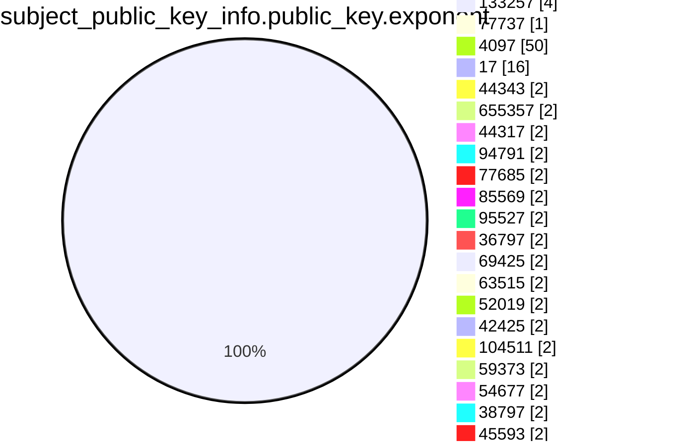
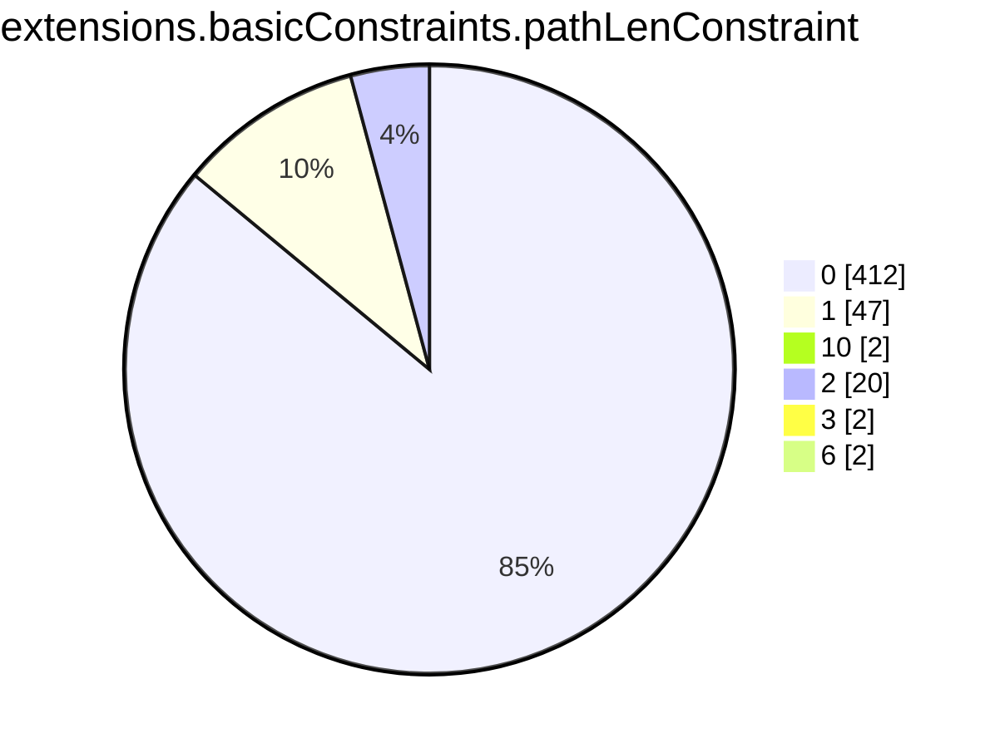
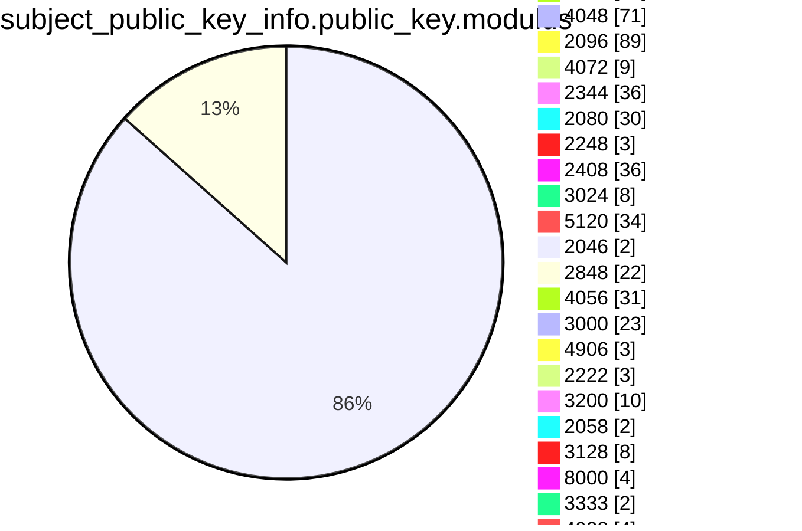
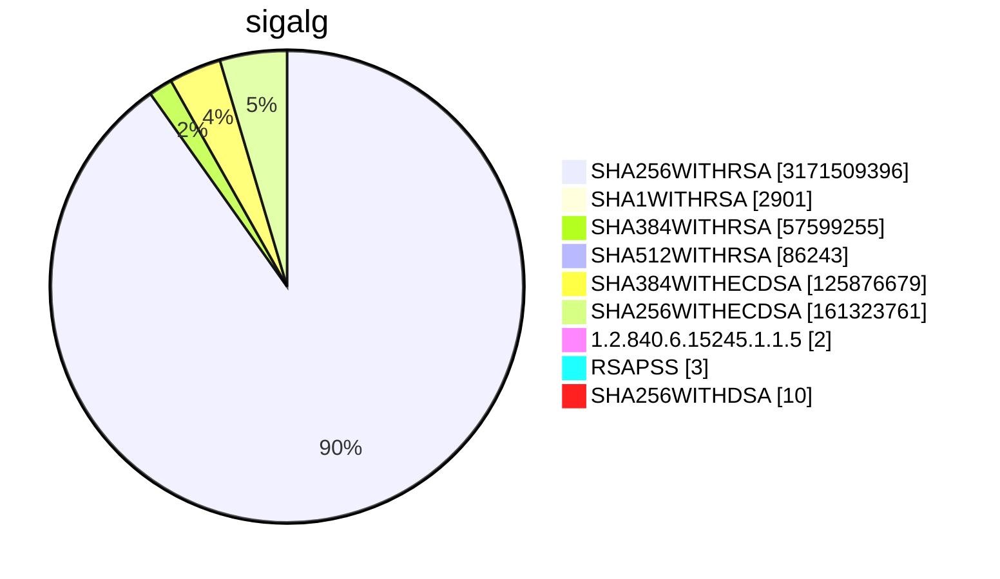

```mermaid
pie showData
title extensions.subjectAlternativeName
"1" :1496574163
"0" :17622
"2" :1523787523
"3" :231183112
"5" :25167299
"4" :46116147
"15" :1861611
"11" :15507579
"6" :18604354
"12" :3903876
"9" :41252419
"14" :1581982
"58" :30900
"8" :47637169
"26" :164335
"10" :13726259
"29" :90321
"89" :19539
"88" :21422
"21" :914958
"18" :1126225
"13" :6276500
"24" :4946473
"7" :14834018
"28" :128097
"16" :1106509
"20" :3935447
"66" :35207
"17" :896095
"38" :71947
"22" :5223445
"100" :691339
"19" :873994
"41" :95431
"25" :124757
"87" :18207
"96" :27370
"60" :62991
"64" :34771
"86" :21685
"125" :1349
"42" :81540
"79" :18202
"27" :119268
"30" :131293
"62" :37484
"697" :11
"314" :41
"101" :2938
"33" :69971
"23" :2977923
"76" :25708
"34" :95662
"56" :34644
"215" :260
"77" :18348
"31" :70590
"106" :1245
"49" :146989
"107" :1190
"97" :15208
"35" :68177
"93" :17275
"45" :73361
"116" :1465
"48" :116251
"47" :85112
"69" :25091
"55" :28648
"627" :14
"356" :46
"52" :139353
"153" :538
"99" :49593
"67" :29083
"98" :40691
"32" :243730
"83" :18758
"91" :15791
"78" :23233
"579" :24
"65" :26135
"85" :18060
"82" :21935
"180" :660
"61" :24306
"36" :110100
"81" :25283
"68" :29242
"80" :27213
"40" :94472
"94" :17987
"39" :54600
"43" :52591
"37" :54113
"74" :21852
"44" :68939
"46" :81484
"231" :155
"53" :206032
"51" :1051676
"50" :345639
"57" :25143
"59" :23827
"54" :84694
"75" :22166
"84" :26283
"95" :14562
"105" :1298
"70" :28809
"63" :22777
"184" :559
"263" :97
"182" :389
"186" :378
"183" :283
"90" :30938
"72" :25941
"136" :1066
"137" :1557
"104" :1502
"73" :26339
"160" :515
"357" :63
"176" :682
"110" :1294
"124" :1101
"313" :50
"119" :1240
"378" :57
"92" :20727
"71" :21781
"310" :55
"295" :57
"453" :21
"258" :171
"581" :10
"228" :253
"296" :96
"242" :191
"154" :498
"108" :1551
"139" :1643
"129" :1384
"134" :1067
"133" :1306
"631" :10
"122" :1120
"109" :1051
"147" :950
"102" :62491
"165" :397
"166" :355
"676" :10
"261" :503
"143" :1268
"217" :170
"287" :71
"616" :4
"617" :18
"503" :8
"199" :228
"144" :857
"146" :684
"123" :1349
"299" :76
"325" :48
"135" :1506
"103" :1176
"112" :1703
"246" :250
"118" :1223
"235" :234
"177" :342
"151" :543
"150" :675
"170" :394
"636" :12
"315" :181
"822" :26
"345" :54
"259" :98
"111" :1183
"128" :1335
"164" :480
"301" :58
"225" :220
"618" :52
"421" :22
"302" :93
"582" :37
"126" :1266
"131" :1276
"113" :1171
"114" :1428
"200" :2069
"149" :772
"243" :178
"167" :414
"234" :241
"115" :1206
"638" :8
"266" :89
"216" :239
"230" :172
"120" :1905
"196" :1089
"202" :292
"218" :208
"117" :1315
"214" :187
"155" :604
"316" :75
"366" :45
"162" :522
"223" :167
"174" :573
"161" :390
"252" :176
"141" :1495
"168" :690
"181" :240
"130" :1150
"178" :276
"238" :147
"173" :389
"250" :530
"145" :985
"188" :675
"156" :620
"219" :193
"206" :307
"175" :226
"195" :263
"264" :87
"222" :185
"248" :230
"158" :392
"309" :66
"367" :42
"204" :304
"265" :47
"140" :1102
"232" :184
"253" :90
"244" :133
"292" :68
"190" :222
"347" :43
"256" :118
"209" :460
"194" :258
"368" :39
"312" :108
"207" :297
"152" :555
"148" :636
"169" :379
"396" :106
"121" :1270
"269" :82
"127" :1450
"159" :353
"172" :553
"381" :47
"163" :316
"251" :284
"257" :96
"233" :201
"278" :73
"237" :184
"241" :172
"201" :234
"319" :72
"236" :136
"641" :6
"198" :348
"208" :359
"229" :121
"247" :151
"185" :337
"192" :779
"157" :269
"240" :200
"193" :210
"343" :45
"142" :731
"639" :2
"369" :102
"245" :163
"859" :2
"179" :331
"187" :270
"293" :115
"239" :146
"205" :191
"210" :610
"584" :83
"703" :8
"279" :83
"298" :85
"272" :56
"583" :23
"452" :22
"546" :37
"262" :61
"586" :50
"288" :140
"335" :66
"500" :23
"213" :209
"619" :4
"197" :201
"294" :89
"274" :53
"370" :28
"268" :65
"679" :6
"249" :289
"191" :211
"291" :109
"493" :17
"589" :9
"307" :54
"132" :1083
"138" :914
"171" :397
"189" :210
"203" :240
"211" :486
"212" :179
"220" :170
"221" :175
"224" :311
"226" :165
"227" :189
"445" :18
"371" :32
"422" :22
"320" :65
"306" :84
"707" :23
"387" :45
"681" :14
"593" :8
"348" :65
"336" :76
"322" :63
"682" :10
"359" :43
"361" :46
"414" :41
"805" :4
"825" :18
"365" :28
"297" :92
"415" :29
"455" :16
"303" :71
"622" :2
"323" :50
"814" :4
"285" :73
"870" :24
"457" :24
"623" :12
"595" :14
"594" :5
"337" :35
"543" :76
"484" :21
"585" :27
"816" :16
"254" :110
"392" :70
"290" :77
"270" :95
"372" :54
"458" :14
"390" :36
"400" :45
"374" :36
"393" :67
"363" :88
"304" :46
"459" :30
"352" :41
"380" :32
"391" :41
"683" :18
"321" :85
"684" :10
"462" :31
"395" :53
"625" :2
"389" :75
"489" :21
"394" :54
"317" :60
"401" :31
"384" :26
"385" :23
"281" :143
"405" :51
"300" :139
"283" :39
"461" :34
"277" :55
"501" :17
"255" :112
"420" :35
"271" :64
"430" :20
"373" :30
"408" :36
"326" :50
"267" :115
"874" :4
"463" :26
"628" :5
"690" :16
"342" :59
"481" :18
"464" :25
"435" :26
"629" :10
"340" :50
"260" :93
"334" :38
"750" :13
"468" :27
"466" :26
"276" :102
"397" :71
"375" :30
"587" :24
"327" :37
"467" :16
"344" :51
"339" :49
"308" :69
"417" :29
"282" :101
"280" :94
"1131" :2
"376" :27
"692" :16
"488" :36
"284" :67
"286" :61
"338" :52
"329" :61
"377" :38
"331" :29
"346" :38
"878" :16
"419" :41
"333" :60
"632" :10
"470" :19
"693" :16
"289" :45
"471" :22
"694" :11
"492" :11
"495" :109
"439" :22
"812" :2
"473" :19
"431" :37
"429" :20
"433" :20
"360" :34
"364" :35
"634" :4
"386" :36
"410" :34
"440" :32
"480" :48
"362" :32
"483" :14
"479" :14
"441" :48
"880" :5
"442" :19
"781" :7
"516" :18
"353" :49
"318" :103
"474" :12
"486" :20
"982" :5
"485" :17
"412" :40
"438" :49
"496" :6
"940" :2
"350" :49
"695" :13
"418" :22
"829" :6
"273" :94
"497" :19
"502" :14
"517" :11
"341" :65
"518" :18
"504" :25
"505" :51
"564" :61
"568" :75
"576" :129
"575" :51
"482" :16
"520" :22
"701" :21
"423" :32
"406" :137
"2228" :2
"2230" :2
"2231" :2
"2240" :2
"2241" :2
"2242" :2
"2243" :2
"540" :24
"2244" :2
"2252" :2
"555" :18
"2254" :2
"2255" :2
"358" :38
"542" :18
"556" :16
"2257" :2
"670" :6
"311" :49
"557" :12
"544" :12
"590" :12
"751" :4
"2260" :2
"704" :15
"424" :20
"753" :12
"2266" :2
"653" :6
"937" :4
"2267" :2
"2269" :2
"2270" :2
"399" :50
"2273" :2
"2275" :10
"1971" :6
"1972" :4
"426" :26
"407" :40
"788" :4
"1973" :2
"828" :18
"427" :16
"755" :6
"1974" :2
"721" :7
"953" :2
"785" :4
"671" :8
"472" :17
"565" :8
"672" :18
"791" :8
"567" :10
"571" :12
"444" :33
"563" :14
"743" :9
"475" :12
"324" :95
"906" :6
"665" :15
"477" :18
"605" :12
"275" :60
"330" :72
"793" :4
"675" :14
"712" :8
"572" :25
"398" :50
"382" :27
"574" :8
"884" :6
"714" :8
"383" :29
"949" :2
"449" :18
"566" :24
"630" :12
"451" :13
"795" :8
"469" :15
"450" :26
"332" :63
"796" :8
"596" :16
"513" :14
"789" :10
"515" :9
"606" :28
"507" :22
"799" :4
"454" :24
"699" :20
"977" :4
"577" :10
"643" :7
"648" :79
"305" :75
"456" :31
"569" :14
"570" :23
"661" :9
"772" :6
"801" :22
"941" :8
"519" :28
"685" :4
"821" :4
"652" :4
"790" :8
"656" :11
"797" :8
"942" :10
"657" :9
"659" :18
"525" :56
"460" :17
"803" :4
"667" :4
"673" :8
"531" :26
"573" :16
"689" :21
"669" :14
"535" :11
"534" :29
"800" :8
"702" :26
"802" :2
"536" :12
"637" :8
"804" :44
"509" :20
"550" :9
"539" :16
"650" :4
"846" :4
"521" :10
"662" :10
"1139" :2
"678" :12
"549" :12
"807" :10
"404" :38
"411" :37
"552" :11
"691" :4
"409" :33
"1800" :3
"995" :2
"1000" :1016
"696" :8
"823" :4
"837" :10
"526" :12
"510" :11
"554" :10
"854" :9
"511" :9
"416" :29
"813" :10
"558" :80
"478" :13
"402" :21
"354" :48
"843" :6
"1132" :3
"1133" :6
"1135" :6
"494" :15
"597" :13
"847" :2
"848" :4
"1136" :3
"1124" :3
"560" :22
"1123" :3
"1122" :3
"849" :2
"853" :4
"855" :14
"861" :14
"328" :27
"1116" :6
"864" :245
"713" :4
"865" :4
"562" :12
"866" :6
"824" :2
"1112" :6
"1097" :3
"1073" :3
"1071" :3
"872" :6
"1035" :3
"603" :17
"991" :5
"935" :7
"607" :18
"875" :6
"826" :6
"351" :41
"877" :6
"355" :30
"447" :32
"1004" :2
"403" :21
"886" :2
"889" :4
"890" :8
"379" :16
"810" :12
"388" :114
"1008" :2
"858" :2
"894" :6
"633" :52
"476" :22
"413" :38
"792" :54
"794" :6
"901" :4
"425" :20
"700" :3
"428" :32
"903" :14
"432" :47
"599" :12
"434" :20
"601" :8
"443" :26
"698" :13
"774" :10
"862" :6
"705" :23
"798" :14
"578" :10
"465" :32
"609" :88
"902" :6
"833" :6
"613" :2
"820" :2
"835" :2
"532" :8
"834" :26
"838" :2
"839" :6
"1013" :2
"818" :8
"612" :16
"614" :14
"1212" :2
"349" :29
"806" :6
"621" :4
"674" :8
"808" :2
"437" :24
"893" :8
"827" :2
"658" :8
"446" :14
"831" :82
"448" :6
"524" :16
"580" :14
"561" :10
"490" :12
"588" :19
"591" :14
"598" :4
"436" :6
"602" :16
"604" :4
"487" :4
"491" :15
"592" :6
"640" :11
"779" :3
"923" :13
"499" :3
"514" :4
"925" :5
"764" :5
"545" :5
"651" :25
"1127" :1
"615" :3
"529" :8
"624" :11
"933" :7
"547" :3
"709" :7
"522" :97
"717" :17
"723" :5
"527" :7
"530" :13
"782" :5
"727" :5
"553" :9
"533" :11
"537" :9
"538" :5
"664" :9
"1026" :1
"856" :2
"891" :4
"928" :6
"962" :2
"972" :4
"718" :2
"725" :6
"736" :6
"756" :20
"996" :10
"974" :4
"976" :2
"742" :6
"1249" :1
"1190" :2
"645" :10
"780" :10
"840" :2
"819" :12
"754" :2
"844" :2
"686" :16
"885" :30
"950" :4
"663" :12
"998" :8
"857" :4
"957" :24
"934" :2
"897" :6
"997" :6
"973" :2
"920" :6
"860" :6
"911" :14
"899" :6
"506" :8
"512" :10
"905" :6
"908" :14
"914" :4
"710" :4
"917" :6
"600" :92
"938" :4
"895" :2
"668" :10
"765" :4
"867" :8
"999" :36
"548" :14
"978" :4
"931" :2
"900" :8
"944" :4
"677" :8
"551" :8
"680" :6
"528" :18
"993" :2
"852" :8
"888" :20
"608" :6
"724" :2
"610" :10
"649" :6
"932" :4
"646" :2
"647" :6
"541" :2
"626" :16
"929" :4
"716" :4
"611" :22
"731" :6
"882" :18
"983" :6
"744" :8
"921" :10
"873" :8
"746" :4
"876" :6
"809" :6
"879" :14
"708" :8
"926" :8
"887" :2
"896" :2
"989" :2
"748" :2
"523" :6
"719" :2
"722" :2
"728" :4
"734" :6
"737" :6
"740" :4
"559" :12
"508" :4
"752" :2
"758" :2
"761" :2
"767" :6
"776" :4
"985" :8
"654" :6
"768" :20
"951" :14
"948" :10
"771" :14
"954" :22
"966" :92
"969" :6
"915" :62
"759" :6
"963" :50
"845" :4
"971" :2
"817" :2
"620" :2
"842" :6
"960" :26
"927" :16
"851" :4
"687" :8
"747" :12
"945" :6
"869" :8
"836" :2
"913" :2
"644" :2
"883" :2
"711" :6
"760" :4
"910" :2
"763" :2
"666" :8
"655" :2
"729" :16
"980" :2
"965" :2
"706" :2
"715" :2
"730" :2
"904" :2
"745" :2
"720" :12
"984" :2
"907" :2
"918" :18
"635" :6
"841" :2
"936" :4
"939" :12
"773" :2
"909" :4
"811" :4
"498" :15
"777" :2
"726" :8
"770" :2
"863" :4
"783" :10
"786" :6
"642" :4
"741" :12
"660" :12
"992" :4
"832" :2
"956" :4
"959" :6
"912" :6
"769" :2
"732" :4
"924" :2
"762" :2
"735" :4
"987" :2
"943" :2
"784" :2
```

```mermaid
pie showData
title subject.cn.tld
"tw" :3078003
"si" :1649298
"com" :1437931856
"in" :19502195
"IN" :462
"at" :12310909
"ru" :57225196
"br" :51118995
"org" :85899259
"net" :129366528
"jp" :17754138
"uk" :64134633
"ph" :990553
"today" :612976
"nz" :6265457
"biz" :7535651
"studio" :1245594
"us" :10859816
"ca" :21415398
"solutions" :627754
"cc" :4501670
"au" :27406573
"online" :14737236
"shop" :9889614
"domains" :205617
"media" :821545
"kr" :3932448
"finance" :431607
"mx" :8183787
"directory" :81190
"life" :3839558
"bz" :271066
"xyz" :29568518
"co" :34130140
"info" :17241791
"estate" :65890
"club" :5670028
"my" :2409352
"pg" :24039
"site" :10547349
"me" :31214124
"eu" :20344155
"cn" :15459091
"live" :3632043
"io" :66779005
"de" :116766491
"ws" :523181
"press" :117611
"center" :500664
"store" :7092142
"education" :271398
"it" :23673132
"cl" :7699184
"rocks" :954497
"xn--p1ai" :3972735
"art" :1711896
"space" :4692909
"global" :360321
"asia" :1376339
"th" :978014
"care" :279064
"hk" :1371573
"sg" :1862293
"fr" :39271946
"beer" :91173
"cloud" :8021873
"tech" :7065976
"work" :2719057
"tr" :3909673
"wedding" :168587
"healthcare" :39459
"health" :198559
"ie" :2306546
"pro" :5844795
"ltd" :639990
"dk" :9505372
"id" :11166052
"es" :11886726
"consulting" :223177
"ro" :7405495
"nl" :43671521
"vn" :5912714
"pl" :24538895
"edu" :3527400
"no" :8761271
"dev" :17710859
"se" :14505799
"tv" :2666234
"mobi" :845354
"gov" :549737
"il" :3328394
"be" :15082893
"su" :1388324
"cz" :13893769
"world" :1258409
"click" :1077813
"uno" :223031
"community" :162957
"faith" :34600
"pt" :4273456
"city" :495458
"za" :15797455
"aero" :231029
"lv" :1261857
"lu" :814079
"amsterdam" :211933
"company" :518168
"lundbeck" :10
"gs" :61500
"events" :260149
"gal" :52145
"wine" :96063
"army" :36337
"expert" :257713
"ch" :28555107
"bzh" :113352
"exchange" :113673
"farm" :182512
"coop" :182812
"app" :10226520
"support" :231090
"team" :869117
"uy" :614086
"london" :201030
"design" :1478932
"business" :224745
"gl" :57844
"sv" :71322
"lk" :556360
"xn--80asehdb" :21189
"hu" :9786672
"ai" :2038097
"ac" :136753
"cyou" :513186
"pet" :79132
"cy" :183930
"travel" :209162
"agency" :1057235
"direct" :9570103
"int" :37537
"capital" :171517
"law" :104502
"ae" :965571
"py" :325977
"digital" :1769342
"bmw" :25650
"cards" :63462
"reit" :215
"church" :385994
"energy" :138512
"ar" :7208956
"la" :510160
"bet" :229826
"cr" :192697
"pub" :184624
"bank" :55171
"xn--80aswg" :16126
"pw" :1831827
"is" :1045588
"tj" :45135
"moscow" :130863
"ag" :183106
"jobs" :78733
"COM" :40922
"marketing" :220991
"academy" :423979
"bm" :29012
"social" :264053
"ci" :149411
"solar" :74899
"ad" :16248
"love" :264353
"re" :397041
"ni" :27725
"school" :230895
"gr" :5991207
"systems" :626402
"software" :236783
"gt" :221963
"gg" :609132
"group" :878973
"fun" :2502137
"aw" :4258
"best" :417416
"land" :189189
"fit" :341753
"tokyo" :899684
"pe" :1495655
"ec" :548911
"photography" :438642
"games" :381120
"eco" :75858
"link" :3970594
"Nu" :4
"tools" :439000
"nyc" :369712
"je" :57654
"website" :2355360
"construction" :46786
"fi" :7981956
"rs" :1804190
"rip" :100246
"vision" :94125
"am" :319901
"mn" :226548
"kh" :45779
"plus" :443722
"kim" :68312
"bn" :8425
"coffee" :181873
"plumbing" :11514
"rentals" :68996
"cool" :313327
"guide" :109078
"BZ" :42
"blog" :1222023
"xn--p1acf" :132239
"om" :33334
"quebec" :35306
"kw" :29764
"cba" :1090
"jo" :31381
"sa" :593321
"network" :850377
"fitness" :91527
"bh" :21190
"icu" :951204
"sk" :3589200
"vip" :3230099
"gallery" :158385
"mo" :21048
"ua" :9364265
"email" :549002
"kpn" :282
"ke" :1299405
"gh" :75346
"management" :72659
"nu" :1832808
"fj" :20868
"Com" :682
"eg" :68022
"gi" :13124
"koeln" :87589
"saxo" :269
"video" :248743
"ee" :2292334
"bg" :1099448
"pk" :1372324
"scot" :81671
"hr" :1354423
"green" :105815
"uz" :725902
"gmo" :158
"qa" :124143
"vegas" :41094
"ntt" :1602
"clinic" :101661
"kz" :2297442
"miami" :54591
"cymru" :36012
"st" :281462
"one" :1486372
"red" :215727
"ng" :1867368
"ma" :923316
"ve" :191491
"bo" :177768
"dog" :105905
"tz" :338878
"bd" :327774
"services" :504550
"DE" :625
"accountants" :7589
"mv" :48563
"photo" :241984
"mc" :35063
"delivery" :85762
"lt" :1805819
"mu" :92066
"hn" :56598
"tt" :25871
"canon" :1263
"repair" :36381
"news" :506776
"llc" :107031
"BR" :262
"fm" :220415
"training" :133456
"berlin" :207320
"theater" :9813
"do" :307886
"museum" :8506
"ao" :104302
"ps" :76742
"auction" :24995
"ooo" :125617
"legal" :106382
"to" :51085808
"vc" :382676
"graphics" :50725
"ist" :40999
"zone" :679370
"okinawa" :40207
"technology" :217967
"jewelry" :31020
"AU" :876
"black" :53376
"fund" :265012
"xn--3e0b707e" :5887
"top" :7110701
"bio" :182765
"inc" :32738
"JP" :523
"paris" :109586
"study" :76371
"bw" :70652
"ryukyu" :3720
"racing" :20644
"page" :3623700
"help" :192110
"taxi" :55193
"yokohama" :29790
"ge" :465732
"house" :198185
"villas" :8680
"by" :1834698
"ba" :319088
"eus" :133350
"clothing" :64860
"place" :81419
"trade" :154559
"va" :211
"supply" :44722
"cat" :843685
"yoga" :98201
"li" :574279
"HK" :186
"market" :221184
"hsbc" :139
"audio" :36314
"as" :119475
"mz" :102205
"az" :361515
"movie" :15705
"so" :286783
"bi" :37487
"zw" :268247
"earth" :171025
"cw" :7751
"xn--80adxhks" :50634
"ventures" :93797
"apple" :193
"al" :267080
"gmbh" :130779
"name" :775636
"MY" :62
"GOV" :2050
"tours" :67550
"express" :68802
"jll" :73
"works" :346383
"cab" :24967
"jm" :14543
"boutique" :140312
"guru" :456965
"band" :129228
"host" :777472
"dental" :51716
"tc" :46705
"build" :93278
"watch" :104503
"pa" :77462
"win" :846170
"mk" :334041
"ORG" :2630
"toys" :36302
"cd" :24961
"bayern" :103941
"onl" :90598
"menu" :71812
"ml" :2892448
"pics" :57827
"money" :131840
"yt" :44360
"foundation" :131353
"immo" :97184
"alsace" :14496
"enterprises" :30947
"ninja" :519489
"blue" :198418
"pizza" :75618
"tk" :3958321
"bar" :232419
"codes" :244362
"gift" :40669
"ga" :1803484
"markets" :11287
"woodside" :1249
"credit" :37189
"ceo" :141397
"wtf" :329859
"sh" :670330
"aws" :12284
"kg" :149621
"sarl" :11590
"holdings" :31145
"run" :3068995
"im" :508762
"report" :76948
"cm" :212501
"rugby" :2894
"fail" :30812
"fashion" :87949
"BIZ" :161
"cf" :1726701
"gy" :36209
"hamburg" :62835
"ovh" :1199856
"football" :28088
"beauty" :59439
"buzz" :957797
"kyoto" :12360
"statefarm" :24136
"et" :42130
"limited" :37719
"men" :91212
"vet" :79396
"cash" :159801
"science" :115780
"mm" :53379
"mt" :115416
"pictet" :833
"partners" :74965
"audi" :4257
"ms" :119854
"ly" :281432
"international" :107273
"engineering" :99416
"coach" :145803
"infiniti" :80
"gq" :892844
"film" :52444
"lol" :212920
"homes" :82496
"vlaanderen" :42138
"iq" :44692
"tax" :60002
"sx" :35131
"rest" :150145
"fyi" :163919
"man" :1824
"africa" :323571
"tn" :324360
"gold" :226995
"surf" :103438
"ink" :349929
"cam" :168363
"md" :524158
"pr" :11771
"xxx" :67510
"stream" :152543
"amazon" :86
"contact" :42956
"party" :179178
"lc" :41662
"ht" :29945
"careers" :46158
"lb" :29716
"archi" :29256
"dating" :34465
"ky" :41824
"lawyer" :24446
"wien" :83154
"xn--tckwe" :8852
"limo" :8473
"computer" :44563
"nagoya" :34797
"recipes" :21746
"reisen" :17809
"moe" :221698
"show" :171559
"monster" :433528
"lgbt" :24882
"mil" :14756
"realty" :340007
"sport" :8163
"casa" :1734034
"bj" :34131
"tienda" :17418
"np" :592140
"haus" :63757
"bt" :24474
"swiss" :178969
"brussels" :55413
"bbva" :64
"financial" :48902
"bike" :110584
"wales" :60512
"sb" :10886
"cx" :212143
"dance" :72787
"glass" :21692
"radio" :19090
"lat" :47455
"cooking" :13450
"wiki" :180221
"download" :66038
"tf" :65127
"tui" :566
"insure" :35819
"pink" :62655
"sc" :59958
"security" :7913
"deals" :55320
"style" :116226
"vg" :23156
"parts" :30086
"tube" :35760
"forum" :1947
"xn--90ais" :75664
"productions" :76840
"properties" :67926
"realestate" :46374
"reviews" :88323
"car" :2651
"chat" :235266
"shoes" :21825
"tel" :161523
"kpmg" :75
"vote" :28174
"rent" :47462
"fish" :48792
"quest" :173570
"melbourne" :33024
"wang" :117051
"mba" :31365
"sap" :71244
"ax" :59090
"camera" :19603
"kiwi" :66841
"ug" :110248
"loan" :33372
"investments" :23893
"bingo" :11563
"cpa" :18870
"ki" :4770
"INT" :18
"luxe" :7584
"sm" :18513
"family" :236111
"fan" :36062
"game" :32748
"attorney" :10385
"golf" :71843
"gd" :124298
"CL" :80
"bid" :112112
"sn" :79648
"NET" :3510
"dealer" :337
"fo" :69347
"schule" :48168
"holiday" :21317
"casino" :76220
"contractors" :11915
"sr" :20728
"town" :54465
"ruhr" :28968
"institute" :75629
"organic" :12716
"sale" :131835
"fox" :1927
"cafe" :213944
"adult" :5248
"corsica" :15109
"lighting" :25723
"tm" :21373
"voyage" :15849
"weir" :2840
"xn--fiqs8s" :13667
"ne" :7096
"salon" :38931
"hosting" :119831
"poker" :19213
"xn--mgbaam7a8h" :92
"tips" :112445
"pf" :22771
"xin" :45830
"auspost" :503
"na" :110049
"auto" :7773
"moda" :56339
"af" :51235
"nrw" :69064
"PRO" :4
"QA" :84
"NO" :44
"fans" :38814
"UK" :757
"garden" :33099
"pictures" :74414
"bs" :8929
"SE" :125
"flowers" :9807
"zm" :42033
"loans" :20651
"mortgage" :16596
"frl" :68430
"accountant" :7256
"Org" :83
"nc" :93669
"pm" :110219
"xn--ses554g" :827
"restaurant" :44940
"university" :49054
"srl" :83586
"gifts" :39645
"charity" :13453
"dz" :146089
"vi" :3234
"abbott" :3030
"ikano" :704
"photos" :168610
"rw" :108256
"tirol" :61040
"brother" :193
"sz" :12544
"camp" :71788
"clubmed" :1427
"saarland" :19114
"nr" :687
"ngo" :37220
"dentist" :10801
"irish" :22028
"krd" :11470
"promo" :60695
"discount" :10746
"EDU" :1271
"CA" :1627
"actor" :14629
"baby" :27658
"toyota" :350
"tl" :23676
"viajes" :7076
"boston" :10832
"tatar" :5526
"kitchen" :54624
"vin" :37965
"christmas" :6961
"trading" :12450
"review" :114023
"ski" :40231
"navy" :11654
"pharmacy" :1949
"xn--j1amh" :37737
"autos" :26065
"teva" :443
"gives" :15111
"vacations" :12957
"florist" :53001
"tg" :27493
"cleaning" :18900
"doctor" :46772
"suzuki" :206
"porn" :16101
"new" :22858
"gay" :187977
"webcam" :15409
"SA" :194
"KW" :34
"xn--kpry57d" :1978
"ricoh" :619
"afl" :393
"sbi" :592
"sky" :2104
"mw" :16875
"xn--d1acj3b" :5568
"AR" :70
"CN" :59
"NL" :246
"wf" :42222
"bot" :19307
"sexy" :25851
"mg" :77081
"ren" :54294
"physio" :10926
"vu" :179236
"mp" :9469
"cg" :10896
"ls" :18811
"bb" :7697
"hair" :18951
"IT" :206
"Gov" :112
"sncf" :603
"neustar" :1066
"builders" :46125
"cricket" :9930
"pfizer" :136
"sydney" :29219
"associates" :20702
"college" :20385
"US" :411
"fk" :701
"godaddy" :214
"jcb" :94
"abb" :2681
"gn" :3885
"soccer" :14049
"ck" :3924
"globo" :2565
"nissan" :88
"horse" :30544
"xn--mgberp4a5d4ar" :753
"soy" :13505
"xn--c1avg" :3362
"how" :28643
"dm" :5125
"cbs" :56
"date" :48596
"kn" :3272
"diamonds" :10712
"shopping" :47177
"nikon" :4
"rehab" :13944
"temasek" :48
"barcelona" :20944
"skin" :19445
"observer" :11276
"lamborghini" :540
"tickets" :1922
"sony" :103
"gm" :12744
"immobilien" :19631
"jetzt" :72233
"reise" :3426
"kaufen" :17359
"tennis" :9482
"singles" :13937
"xn--mk1bu44c" :3404
"tatamotors" :94
"itau" :168
"SG" :401
"hiphop" :2145
"gp" :10867
"tires" :5956
"ye" :6410
"total" :1026
"EU" :188
"barclaycard" :279
"barclays" :1098
"property" :12923
"bnpparibas" :2261
"surgery" :11952
"cv" :27748
"engineer" :43948
"exposed" :13461
"xn--90ae" :7869
"catering" :16060
"MX" :75
"vodka" :7502
"hermes" :416
"taipei" :9274
"ong" :11327
"cologne" :15225
"km" :1106
"gratis" :23398
"JM" :4
"claims" :13404
"gucci" :162
"bridgestone" :343
"versicherung" :3769
"istanbul" :18826
"playstation" :41
"goog" :376793
"xn--qxa6a" :274
"xn--e1a4c" :2234
"dj" :18383
"equipment" :15080
"fishing" :7895
"republican" :4636
"industries" :38564
"xn--q9jyb4c" :4863
"Lighting" :2
"SALE" :7
"condos" :10488
"nike" :852
"futbol" :11213
"gop" :6877
"honda" :129
"realtor" :115322
"hospital" :6603
"cfd" :117602
"gdn" :13100
"ONLINE" :12
"sl" :10859
"courses" :20493
"madrid" :8482
"xn--9dbq2a" :2091
"forsale" :24321
"mq" :3227
"AE" :138
"dvag" :13646
"RU" :82
"EMAIL" :7
"supplies" :17066
"apartments" :21448
"PH" :77
"compare" :1424
"xn--h2brj9c" :1941
"desi" :7963
"orange" :3966
"country" :6327
"cheap" :19433
"TR" :14
"dhl" :648
"hockey" :7361
"sex" :16997
"democrat" :4851
"blackfriday" :1609
"sucks" :2320
"diet" :4677
"degree" :3858
"xn--fiq228c5hs" :228
"lease" :12154
"osaka" :6880
"sakura" :30
"capetown" :24799
"bargains" :7994
"joburg" :15111
"xn--ngbc5azd" :704
"flights" :9782
"xn--6qq986b3xl" :10885
"durban" :9386
"sbs" :188530
"rodeo" :14984
"bond" :96588
"cruises" :5525
"mango" :145
"mom" :22218
"coupons" :10627
"abogado" :1831
"xn--qxam" :6377
"vanguard" :330
"tattoo" :45911
"xn--j6w193g" :6613
"airforce" :3932
"gf" :3135
"nf" :64812
"forex" :2777
"sd" :59776
"memorial" :6055
"creditcard" :5725
"broker" :7506
"crs" :3589
"jnj" :2408
"citic" :250
"boats" :4980
"PT" :20
"aeg" :5
"leclerc" :3429
"trust" :30
"ir" :6414026
"LONDON" :6
"lidl" :557
"ltda" :2965
"bf" :16701
"luxury" :6918
"Dk" :4
"insurance" :2195
"furniture" :19818
"yachts" :4544
"next" :1024
"sandvik" :418
"Clinic" :2
"basketball" :3611
"Edu" :32
"hiv" :739
"genting" :32
"pioneer" :81
"DK" :277
"OM" :8
"post" :858
"CO" :66
"aquarelle" :94
"makeup" :12311
"Biz" :145
"FR" :151
"schwarz" :3459
"day" :34296
"mr" :10478
"bible" :26921
"NETWORK" :16
"monash" :338
"abudhabi" :1348
"RENTALS" :3
"gent" :59520
"shiksha" :2857
"ES" :320
"hm" :4853
"香港" :24
"maison" :7169
"moi" :523
"xn--6frz82g" :7105
"career" :4876
"jpmorgan" :4
"sy" :24451
"CBA" :48
"toray" :264
"xn--czrs0t" :207
"uol" :191
"td" :5652
"juegos" :1060
"bradesco" :589
"storage" :2674
"williamhill" :22
"TH" :83
"scb" :140
"guitars" :2390
"Be" :4
"rich" :1278
"xn--g2xx48c" :103
"Net" :75
"xn--mgbab2bd" :216
"xn--rhqv96g" :579
"select" :888
"erni" :123
"gripe" :1478
"sharp" :605
"CZ" :29
"schaeffler" :2646
"komatsu" :673
"anz" :345
"cars" :2855
"ZA" :120
"FI" :115
"BE" :108
"IE" :58
"philips" :15
"ismaili" :193
"schmidt" :253
"xn--o3cw4h" :1874
"KE" :23
"deloitte" :218
"IO" :35
"showtime" :7
"Co" :2
"nab" :8
"sener" :118
"BANK" :15
"abc" :107
"xn--czr694b" :292
"Za" :8
"HR" :54
"lotto" :270
"CM" :6
"theatre" :174
"uK" :15
"TW" :261
"praxi" :6
"xn--io0a7i" :1546
"lr" :4598
"BH" :22
"MU" :10
"RE" :2
"xn--t60b56a" :472
"IL" :46
"DZ" :14
"EC" :12
"COMPANY" :9
"xn--vhquv" :102
"vig" :851
"cfa" :58
"CLOUD" :12
"voto" :1798
"pn" :2000
"aq" :1228
"ss" :2208
"lilly" :60
"azure" :191
"SI" :16
"jio" :56
"RO" :166
"GR" :113
"ID" :45
"voting" :258
"motorcycles" :2844
"axa" :253
"seat" :606
"rio" :10827
"sanofi" :242
"nico" :156
"ipiranga" :41
"xn--3ds443g" :354
"CAFE" :3
"xn--node" :751
"xn--vuq861b" :158
"kred" :1307152
"zuerich" :3811
"shell" :2020
"MD" :4
"NZ" :77
"microsoft" :52
"PY" :12
"xn--3hcrj9c" :99
"xn--90a3ac" :5919
"lego" :102
"goo" :55
"MIL" :51
"City" :18
"fresenius" :24
"xn--fiqz9s" :991
"ifm" :1205
"linde" :11
"cisco" :31
"aaa" :24
"TV" :12
"med" :428
"VN" :35
"smart" :50
"xn--y9a3aq" :2978
"mma" :85
"xn--otu796d" :84
"xn--czru2d" :104
"cuisinella" :50
"EG" :2
"PL" :17
"aig" :29
"panasonic" :57
"cu" :61704
"weber" :1537
"xn--55qx5d" :12465
"In" :8
"MO" :6
"ubs" :4
"NU" :2
"AG" :29
"xn--kput3i" :6754
"itv" :30
"flir" :56
"fage" :110
"mh" :84
"ET" :32
"yandex" :587
"protection" :116
"Zone" :8
"Asia" :8
"CH" :50
"LB" :39
"gw" :6875
"AO" :57
"stockholm" :67
"otsuka" :72
"SBI" :30
"MOBI" :23
"creditunion" :215
"Fr" :44
"ASIA" :24
"ericsson" :16
"kfh" :22
"amex" :4
"BRADESCO" :34
"xn--rvc1e0am3e" :74
"Live" :10
"hisamitsu" :517
"CI" :2
"natura" :13
"xn--54b7fta0cc" :780
"locus" :289
"LAW" :6
"xn--rovu88b" :6
"xn--1ck2e1b" :4
"xn--eckvdtc9d" :4
"qpon" :929
"imdb" :4
"free" :4
"read" :4
"tushu" :4
"xn--jlq480n2rg" :4
"silk" :4
"CD" :4
"LTD" :4
"BS" :2
"BM" :4
"bbc" :62
"edeka" :925
"airbus" :16
"chase" :10
"MADRID" :2
"call" :4
"audible" :4
"xn--unup4y" :121
"AT" :16
"COOP" :10
"NAME" :2
"bauhaus" :297
"WORLD" :4
"EUS" :6
"xn--5tzm5g" :1005
"dubai" :67
"adac" :2
"INFO" :31
"arab" :4
"politie" :310
"NYC" :2
"jaguar" :5
"landrover" :5
"sew" :50
"lincoln" :4
"statebank" :75
"lanxess" :64
"TOP" :6
"nec" :73
"WS" :21
"rwe" :8
"DIGITAL" :20
"toshiba" :88
"xn--nqv7f" :229
"jprs" :41
"PE" :20
"frogans" :25
"SZ" :2
"Solutions" :6
"HU" :15
"LA" :14
"xn--fjq720a" :101
"ACADEMY" :8
"farmers" :8
"xfinity" :11
"comcast" :11
"ZM" :6
"TECH" :24
"FARM" :4
"XYZ" :90
"channel" :544
"Software" :4
"xn--2scrj9c" :164
"mutual" :9
"northwesternmutual" :4
"Tech" :3
"CLUB" :24
"JO" :36
"xn--xhq521b" :203
"bosch" :3
"samsung" :6
"nowruz" :92
"xn--hxt814e" :231
"xn--mgbca7dzdo" :6
"booking" :4
"dupont" :12
"CAT" :2
"extraspace" :67
"gu" :335
"MZ" :12
"aco" :1778
"redumbrella" :3
"travelers" :3
"travelersinsurance" :3
"trv" :3
"KR" :10
"BW" :4
"CR" :6
"Bid" :8
"mattel" :999
"HOUSE" :3
"bentley" :59
"xn--wgbh1c" :55
"guardian" :12
"APP" :4
"xn--zfr164b" :14
"xn--imr513n" :6
"LT" :8
"xn--s9brj9c" :115
"mini" :71
"xn--h2breg3eve" :154
"arpa" :12
"AERO" :7
"xn--xkc2dl3a5ee0h" :618
"analytics" :10
"Bank" :12
"Video" :4
"xn--gecrj9c" :114
"foo" :304
"KZ" :6
"Dog" :6
"gea" :159
"Info" :2
"GT" :2
"Uk" :12
"hyundai" :59
"Dev" :4
"xn--45brj9c" :422
"mit" :11
"amica" :4
"Land" :3
"AM" :6
"bms" :4
"xn--fpcrj9c3d" :112
"MT" :44
"RW" :6
"PF" :4
"broadway" :81
"WEIR" :2
"MA" :38
"Eu" :2
"ANZ" :12
"LIFE" :10
"UG" :5
"google" :57092
"ice" :10
"ZONE" :4
"xn--d1alf" :278
"Us" :2
"jmp" :10
"nra" :24
"accenture" :4
"FOX" :5
"bloomberg" :10
"msd" :2
"PK" :5
"icbc" :2
"GG" :16
"sas" :6
"mtr" :5
"UA" :4
"SINGLES" :4
"GL" :6
"KY" :2
"chintai" :29
"feedback" :1642
"zara" :20
"WORK" :4
"BN" :18
"RS" :4
"ME" :18
"DO" :14
"CC" :7
"SK" :7
"Mil" :2
"Store" :2
"COm" :2
"CY" :6
"tW" :2
"Ca" :4
"xbox" :8
"bing" :8
"windows" :8
"hotmail" :8
"skype" :8
"office" :8
"allfinanz" :443
"Social" :8
"GH" :4
"NG" :4
"NA" :2
"cern" :85
"HOST" :16
"ABUDHABI" :2
"VIP" :8
"crown" :3
"bR" :2
"SAP" :2
"bcn" :58
"IS" :2
"softbank" :114
"Global" :4
"STUDIO" :4
"SPACE" :8
"XN--P1AI" :30
"BO" :2
"coM" :4
"IQ" :4
"Health" :6
"EE" :2
"xn--fct429k" :2
"GAL" :2
"xn--ngbrx" :3
"La" :2
"cN" :2
"AI" :14
"xn--80ao21a" :730
"BG" :2
"kinder" :17
"walter" :4
"AF" :4
"SITE" :2
"GLOBAL" :5
"NTT" :6
"Online" :16
"hitachi" :80
"SL" :12
"QUEST" :4
"deV" :2
"ford" :4
"able" :8
"STORE" :2
"youtube" :568
"meet" :102
"ECO" :2
"beats" :6
"xn--mgbbh1a71e" :100
"xn--1qqw23a" :10897
"xn--i1b6b1a6a2e" :136
"ggee" :50
"tvs" :49
"xn--pgbs0dh" :24
"chrome" :25
"bugatti" :94
"bostik" :581
"firmdale" :1739
"maif" :265
"gle" :125
"TM" :2
"xn--mgbah1a3hjkrd" :47
"xn--gckr3f0f" :64
"vivo" :60
"xn--nqv7fs00ema" :30
"xn--mix891f" :31
"kosher" :20
"pru" :47
"stc" :50
"One" :3
"xn--ygbi2ammx" :24
"xn--mgbayh7gpa" :179
"mlb" :43
"vuelos" :19
"eurovision" :20
"alstom" :18
"TC" :2
"ieee" :16
"hoteles" :20
"Systems" :8
"wme" :19
"passagens" :20
"omega" :35
"ses" :2
"stada" :237
"SCOT" :8
"xn--4gbrim" :61
"netflix" :22
"CITY" :2
"Show" :2
"xn--mgba3a4f16a" :130
"redstone" :3
"lacaixa" :19
"swatch" :6
"whoswho" :47
"MR" :4
"epson" :51
"yodobashi" :50
"lixil" :30
"mitsubishi" :51
"Cloud" :6
"fujitsu" :54
"dnp" :51
"datsun" :53
"goldpoint" :50
"nhk" :52
"lotte" :53
"kddi" :48
"kia" :54
"arte" :133
"xn--fzc2c9e2c" :48
"dabur" :50
"fairwinds" :76
"firestone" :33
"lexus" :38
"INDUSTRIES" :3
"latrobe" :16
"citi" :17
"java" :56
"csc" :7
"cancerresearch" :18
"reliance" :35
"hdfc" :42
"ril" :36
"er" :53
"LU" :12
"Me" :4
"Space" :2
"oldnavy" :14
"rocher" :17
"athleta" :14
"helsinki" :35
"ferrero" :123
"LV" :2
"xn--45br5cyl" :13
"lplfinancial" :17
"lpl" :18
"ups" :12
"Market" :2
"GE" :3
"Academy" :22
"Jo" :2
"shia" :9
"pars" :9
"tci" :9
"TOKYO" :2
"abbvie" :59
"xn--mgbgu82a" :16
"xn--wgbl6a" :16
"gap" :12
"lancaster" :6
"xn--l1acc" :10
"bananarepublic" :11
"sandvikcoromant" :2
"xn--mgbbh1a" :4
"imamat" :3
"caravan" :8
"xn--kprw13d" :10
"xn--mgbpl2fh" :27
"sfr" :1
"Photography" :2
"KH" :25
"рф" :1
"goV" :1
"xn--3bst00m" :2
"ally" :4
"TT" :1
"xerox" :2
"CRS" :1
"Pro" :2
"DEV" :1
"Loan" :4
"Healthcare" :1
"ML" :14
"Tk" :16
"watches" :4
"xn--ogbpf8fl" :150
"safety" :4
"grainger" :2
"TK" :38
"Ltd" :140
"xn--clchc0ea0b2g2a9gcd" :8
"xn--q7ce6a" :12
"xn--mgbcpq6gpa1a" :8
"xyZ" :4
"XN--5TZM5G" :10
"SCIENCE" :12
"xn--mgbai9azgqp6j" :4
"cLub" :4
"LI" :6
"goodyear" :2
"dunlop" :2
"Xyz" :2
"MONSTER" :10
"KG" :2
"CF" :16
"CLICK" :2
"SHOP" :2
"akdn" :2
"tK" :8
"BUZZ" :2
"GA" :2
"WIN" :2
```

```mermaid
pie showData
title issuer
"Google UK Ltd." :133562
"STRAC" :2
"Foundation for Trusted Identity" :2
"TSCP Inc." :3
"Cisco Systems" :2312
"行政院" :12
"KPN B.V." :2
"Actalis S.p.A.-03358520967" :2
"U.S. Government" :19
"CertiPath" :4
"WidePoint" :1
"A-Trust Ges. f. Sicherheitssysteme im elektr. Datenverkehr GmbH" :12
"AC Camerfirma S.A." :402
"ICP-Brasil" :6
"VeriSign, Inc." :19
"行政院" :44
"Baltimore" :32
"U.S. Government" :3
"Microsoft Corporation" :2
"VeriSign, Inc." :49
"A-Trust Ges. f. Sicherheitssysteme im elektr. Datenverkehr GmbH" :10
"FNMT-RCM" :8
"VeriSign, Inc." :6
"AC CAMERFIRMA S.A." :6
"VeriSign, Inc." :4
"Colegio de Registradores de la Propiedad y Mercantiles de España" :4
"thawte, Inc." :4
"行政院" :4
"DigiCert Inc" :10
"Hellenic Academic and Research Institutions Cert. Authority" :10
"Republika Slovenija" :4
"Elektronik Bilgi Guvenligi A.S." :4
"MULTICERT - Serviços de Certificação Electrónica S.A." :2
"E-Tuğra EBG Bilişim Teknolojileri ve Hizmetleri A.Ş." :10
"GeoTrust Inc." :4
"Hellenic Academic and Research Institutions Cert. Authority" :45
"Atos" :14
"Apple Inc." :117
"Apple Inc." :57
"SAFE-Biopharma" :2
"QuoVadis Limited" :10
"Apple Inc." :29
"POSTA" :6
"Secretaria de Economia" :6
"TÜRKTRUST Bilgi İletişim ve Bilişim Güvenliği Hizmetleri A.Ş." :4
"Elektronik Bilgi Guvenligi A.S." :2
"LAWtrust" :6
"AC Camerfirma SA" :2
"SwissSign AG" :2
"British Telecommunications plc" :12
"SAFE Identity" :2
"Certinomis" :2
"HydrantID (Avalanche Cloud Corporation)" :2
"QuoVadis Limited" :12
"GlobalSign" :2
"GlobalSign nv-sa" :5
"Institute for Development and Research in Banking Technology" :103
"U.S. Government" :3
"Actalis S.p.A." :6
"Symantec Corporation" :10
"Trustwave Holdings, Inc." :3
"Apple Inc." :49
"Sectigo Limited" :2
"GlobalSign nv-sa" :12
"WoSign CA Limited" :6
"VeriSign, Inc." :2
"Japanese Government" :2
"Unizeto Technologies S.A." :4
"ANF Autoridad de Certificacion" :4
"SwissSign AG" :2
"Google UK Ltd." :197103
"Hongkong Post" :10
"Vaestorekisterikeskus CA" :4
"QuoVadis Limited" :8
"certSIGN" :4
"DigiCert Inc" :4
"e-commerce monitoring GmbH" :10
"ICP-Brasil" :10
"DigiCert Inc" :4
"MINISTERE INTERIEUR" :2
"DigiCert Inc" :2
"Government Root Certification Authority" :2
"Open Access Technology International Inc" :2
"SECOM Trust Systems CO.,LTD." :10
"E-Tuğra EBG Bilişim Teknolojileri ve Hizmetleri A.Ş." :102
"Elektronik Bilgi Guvenligi A.S." :2
"行政院" :225
"ICP-Brasil" :2
"TÜRKTRUST Bilgi İletişim ve Bilişim Güvenliği Hizmetleri A.Ş." :4
"VeriSign, Inc." :8
"Apple Inc." :47
"Orion Health Inc." :4
"DigiCert Inc" :2
"ACNLB" :2
"QuoVadis Limited" :54239
"Apple Inc." :47
"The USERTRUST Network" :2
"GlobalSign nv-sa" :8
"GAD EG" :4
"VeriSign, Inc." :6
"NISZ Nemzeti Infokommunikációs Szolgáltató Zrt." :24
"QuoVadis Limited" :10
"SECOM Trust.net" :17
"Turkiye Bilimsel ve Teknolojik Arastirma Kurumu - TUBITAK" :2
"SwissSign AG" :5
"Verizon Business" :2
"ICP-Brasil" :2
"Symantec Corporation" :2
"SwissSign AG" :3
"Apple Inc." :2
"GoDaddy.com, Inc." :10268262
"GlobalSign nv-sa" :1208607
"GlobalSign nv-sa" :491962
"GlobalSign nv-sa" :2020248
"Starfield Technologies, Inc." :1164179
"GlobalSign nv-sa" :664439
"GlobalSign nv-sa" :76840
"GlobalSign nv-sa" :53003
"GlobalSign nv-sa" :87378
"Česká pošta, s.p." :3313
"Rede Nacional de Ensino e Pesquisa - RNP" :19553
"GlobalSign nv-sa" :400
"VALID CERTIFICADORA DIGITAL" :1490
"SOLUTI - SOLUCOES EM NEGOCIOS INTELIGENTES S-A" :96
"ATT Services Inc" :29975
"DigiCert Inc" :1757138
"Sectigo Limited" :104598488
"Internet2" :1341289
"SecureCore" :74569
"SECOM Trust Systems CO.,LTD." :85574
"DigiCert Inc" :8008805
"Network Solutions L.L.C." :324358
"DigiCert Inc" :548935
"GoGetSSL" :580564
"SSL Corporation" :320695
"The USERTRUST Network" :193517
"Sectigo Limited" :2494619
"Government of Korea" :2490
"DigiCert Inc" :25895
"DigiCert Inc" :628933
"DigiCert Inc" :2454400
"DigiCert Inc" :410547
"DigiCert Inc" :39522801
"SECOM Trust Systems CO.,LTD." :86226
"DigiCert Inc" :10890
"DigiCert Inc" :974
"DigiCert Inc" :51624
"DigiCert Inc" :89541
"DigiCert Inc" :115030
"UniTrust" :3149
"FUJIFILM" :872
"DigiCert Inc" :2271
"DigiCert Inc" :75287661
"Trust Provider B.V." :71808
"The Trustico Group Ltd" :35718
"DigiCert Inc" :293690
"DigiCert Inc" :7771
"GlobalSign nv-sa" :5280
"SecureCore" :3023
"Aetna Inc" :43410
"DigiCert Inc" :195319
"TrustAsia Technologies, Inc." :3407
"Technische Universitaet Dresden" :3424
"COMODO CA Limited" :764696
"Verein zur Foerderung eines Deutschen Forschungsnetzes e. V." :242210
"EUNETIC GmbH" :23233
"DigiCert Inc" :1422797
"Soluciones Corporativas IP, SL" :119087
"DigiCert Inc" :51608
"Fraunhofer" :19073
"Alpiro s.r.o." :29491
"DigiCert Inc" :680
"Sectigo Limited" :2110
"Network Solutions L.L.C." :91581
"DigiCert Inc" :8720
"DigiCert Inc" :1094
"DigiCert Inc" :8544
"Technische Universitaet Ilmenau" :1076
"DigiCert Inc" :753661
"Karlsruhe Institute of Technology" :5476
"DigiCert Inc" :26066
"Microsec Ltd." :1981
"Gandi" :1645391
"TBS INTERNET" :15892
"Siemens" :4
"Corporation Service Company" :142085
"EUNETIC GmbH" :483
"Max-Planck-Gesellschaft" :10377
"Nijimo K.K." :3156
"DigiCert Inc" :147441
"Sectigo Limited" :23571
"The USERTRUST Network" :7017
"DigiCert Inc" :101937
"Sectigo Limited" :8342543
"Internet2" :33926
"DigiCert Inc" :2967
"GoGetSSL" :966
"Trustwave Holdings, Inc." :34968
"DigiCert Inc" :128896
"Wells Fargo & Company" :13550
"Government of the District of Columbia" :1453
"DigiCert Inc" :3113
"K Software" :1596
"DigiCert Inc" :20714
"TrustAsia Technologies, Inc." :3769179
"WoTrus CA Limited" :32060
"Apple Inc." :7812
"Cybertrust Japan Co., Ltd." :74022
"BitCert" :1581
"CrowdStrike Inc." :324
"TAIWAN-CA" :777
"Cybertrust Japan Co., Ltd." :34017
"SSL Corp" :1660
"GoGetSSL" :3811
"DigiCert Inc" :981797
"DigiCert Inc" :3290
"Deutscher Bundestag" :381
"CentralNic Luxembourg Sàrl" :32659
"IZENPE S.A." :1648
"DigiCert Inc" :4743
"Chunghwa Telecom Co., Ltd." :9921
"SECOM Trust Systems CO.,LTD." :38230
"The Trustico Group Ltd" :411
"Corporation Service Company" :415
"MarketWare - Soluções para Mercados Digitais, Lda." :1191
"VALID CERTIFICADORA DIGITAL" :216
"CERTDATA SERVICOS DE INFORMACAO LTDA" :279
"Open Access Technology International Inc" :3524
"Apple Inc." :7753
"Internet2" :17296
"Amazon" :88471772
"WoTrus CA Limited" :6374
"Disig a.s." :965
"IZENPE S.A." :747
"DHIMYOTIS" :15126
"Aristotle University of Thessaloniki" :2325
"Buypass AS-983163327" :23244
"GEANT Vereniging" :13601
"GlobalSign nv-sa" :577
"Aetna Inc" :218
"SOLUTI - SOLUCOES EM NEGOCIOS INTELIGENTES S-A" :292
"Sectigo (Europe) SL" :13
"Fresenius Kabi AG" :338
"Apple Inc." :3396
"Trustwave Holdings, Inc." :580
"Apple Inc." :3285
"TrustAsia Technologies, Inc." :56991
"OpenTrust" :2
"GeoTrust Inc." :2
"Certinomis" :2
"Certinomis" :18
"SwissSign AG" :32138
"GeoTrust Inc." :2
"SwissSign AG" :2
"SwissSign AG" :8449
"SwissSign AG" :2
"DigiCert Inc" :847
"VI Registru centras - i.k. 124110246" :2
"Inera AB" :14
"Agence Nationale des Titres Sécurisés" :6
"CERTSIGN SA" :2
"CERTSIGN SA" :18
"China Financial Certification Authority" :5843
"China Financial Certification Authority" :1110
"China Financial Certification Authority" :2
"CERTSIGN SA" :2
"Netflix, Inc." :2
"Krajowa Izba Rozliczeniowa S.A." :2
"E-Tuğra EBG Bilişim Teknolojileri ve Hizmetleri A.Ş." :11035
"E-Tuğra EBG Bilişim Teknolojileri ve Hizmetleri A.Ş." :344
"Isimtescil Bilisim Anonim Sirketi" :2
"Isimtescil Bilisim Anonim Sirketi" :33676
"Krajowa Izba Rozliczeniowa S.A." :1928
"Vaestorekisterikeskus CA" :1725
"Vaestorekisterikeskus CA" :5
"Krajowa Izba Rozliczeniowa S.A." :2
"Vaestorekisterikeskus CA" :4
"E-Tuğra EBG Bilişim Teknolojileri ve Hizmetleri A.Ş." :2
"Vaestorekisterikeskus CA" :1764
"COMODO CA Limited" :18620
"Actalis S.p.A." :2466741
"RU-Center (ЗАО Региональный Сетевой Информационный Центр)" :2581
"QuoVadis Limited" :170264
"联通智慧安全科技有限公司" :90
"QuoVadis Trustlink B.V." :29589
"Buypass AS-983163327" :6507
"TeliaSonera" :24656
"CERTDATA SERVICOS DE INFORMACAO LTDA" :296
"MarketWare - Soluções para Mercados Digitais, Lda." :873
"HydrantID (Avalanche Cloud Corporation)" :1682375
"VTB BANK (PJSC)" :265
"sslTrus" :777
"Government of Korea" :332
"sslTrus" :2874
"DigiCert Inc" :802
"GlobalSign nv-sa" :10174
"DigiCert Inc" :36721
"Site Blindado S.A." :2156
"KICA" :12
"IdenTrust" :6255142
"IdenTrust" :12429
"DigiCert Inc" :220
"Corporation Service Company" :16244
"Actalis S.p.A." :24148
"SECOM Trust Systems CO.,LTD." :2257
"DigiCert Inc" :196
"Hongkong Post" :6903
"SSL.com" :769
"Microsec Ltd." :640
"TrustSign Certificadora Dig. & Soluções Segurança da Inf. Ltda." :4304
"Apple Inc." :503
"Apple Inc." :1401
"UniTrust" :2
"UniTrust" :2
"Open Access Technology International Inc" :1286
"Intesa Sanpaolo S.p.A." :9
"InfoCert S.p.A." :125
"InfoCert S.p.A." :58
"QuoVadis Limited" :6
"QuoVadis Limited" :6
"Turkiye Bilimsel ve Teknolojik Arastirma Kurumu - TUBITAK" :519
"HydrantID (Avalanche Cloud Corporation)" :2
"SwissSign AG" :44592
"NAVER BUSINESS PLATFORM Corp." :2
"SwissSign AG" :22932
"Japan Certification Services, Inc." :2
"ZETES SA (VATBE-0408425626)" :4
"QuoVadis Limited" :8
"TAIWAN-CA" :4
"TAIWAN-CA" :2
"SwissSign AG" :13980
"Baidu, Inc." :3198
"QuoVadis Trustlink B.V." :12330
"Turing Crypto GmbH" :366
"TAIWAN-CA" :124885
"Certinomis" :2
"Certinomis" :2
"SwissSign AG" :2
"Siemens" :2
"certSIGN" :2
"Vaestorekisterikeskus CA" :4
"certSIGN" :2
"Capricorn Identity Services Pvt Ltd." :2
"GAD EG" :2
"Abitab S.A." :2
"Disig a.s." :4
"Alpiro s.r.o." :128
"DigiCert Inc" :654
"SECOM Trust Systems CO.,LTD." :4651
"DigiCert Inc" :171844
"Entrust, Inc." :1432044
"WoTrus CA Limited" :236
"Sectigo Limited" :116277
"Turing Crypto GmbH" :16
"Telia Finland Oyj" :16986
"Trustwave Holdings, Inc." :2320
"TI Trust Technologies S.R.L." :6614
"SOLUTI - SOLUCOES EM NEGOCIOS INTELIGENTES S-A" :178
"VALID CERTIFICADORA DIGITAL" :326
"Trust Provider B.V." :2430
"Hellenic Academic and Research Institutions CA" :806
"Deutsche Telekom Security GmbH" :38
"Sectigo Limited" :136
"Hao Quang Viet Software Company Limited" :598
"GlobalSign nv-sa" :18112
"Digi- ja vaestotietovirasto CA" :2054
"GlobalSign nv-sa" :153
"Digi- ja vaestotietovirasto CA" :1528
"COMODO CA Limited" :4593
"Entrust, Inc." :109625
"Entrust, Inc." :5835
"DHIMYOTIS" :6200
"TBS INTERNET" :369
"DigiCert Inc" :450
"UniTrust" :405
"WoTrus CA Limited" :67
"DigiCert Inc" :52
"SECOM Trust Systems CO.,LTD." :344
"Nijimo K.K." :737
"eMudhra Technologies Limited" :13560
"DigiCert Inc" :344
"DigiCert Inc" :176
"Gandi" :2189
"Baidu, Inc." :347
"Beijing Xinchacha Credit Management Co., Ltd." :5629
"ITSO LTD" :247
"Domain The Net Technologies Ltd" :2682
"D-Trust GmbH" :42725
"DigiCert Inc" :520
"One Sign Pte. Ltd." :1825
"DigiCert Inc" :2042
"Microsoft Corporation" :4580073
"Microsoft Corporation" :4566538
"Global Digital Cybersecurity Authority Co., Ltd." :452
"Ziwit" :1222
"Entrust, Inc." :1275
"Staat der Nederlanden" :16
"T-Systems International GmbH" :42985
"DigiCert Inc" :120
"HydrantID (Avalanche Cloud Corporation)" :5016
"DigiCert Inc" :62
"DigiCert Inc" :58
"Ziwit" :38
"DigiCert Inc" :422326
"DigiCert Inc" :76
"Japan Registry Services Co., Ltd." :287445
"Cloudflare, Inc." :151688146
"Cisco Systems, Inc." :1047127
"Cloudflare, Inc." :41037950
"GEANT Vereniging" :949998
"cPanel, Inc." :130058459
"DigiCert Inc" :119506
"ZeroSSL" :18671149
"TrustCor Systems S. de R.L." :40383
"Japan Registry Services Co., Ltd." :6410
"NETLOCK Kft." :2522
"Genious Communications" :8516
"Unizeto Technologies S.A." :239290
"DOMENY.PL sp. z o.o" :35808
"swissns GmbH" :844
"McAfee, Inc." :4523
"GEANT Vereniging" :30092
"Hellenic Academic and Research Institutions Cert. Authority" :1189
"行政院" :38317
"ACCV" :3189
"WISeKey" :3581
"T-Systems International GmbH" :11227
"certSIGN" :2107
"WebSpace-Forum e.K." :62
"NetLock Kft." :1862
"Entrust Datacard Europe S.L." :239
"FNMT-RCM" :3716
"Atos" :6990
"TI Trust Technologies S.R.L." :1700
"Firmaprofesional S.A." :4528
"Financijska agencija" :1139
"LH.pl Sp. z o.o." :13375
"D-Trust GmbH" :3263
"Hellenic Academic and Research Institutions Cert. Authority" :158
"E-SAFER CONSULTORIA EM TECNOLOGIA DA INFORMACAO LTDA" :637
"cPanel, Inc." :566
"DNEncrypt, Inc" :903
"SECOM Trust Systems CO.,LTD." :15223
"SECOM Trust Systems CO.,LTD." :1488
"TrustAsia Technologies, Inc." :3275
"CerSign Technology Limited" :1510
"DigiCert Inc" :572
"eMudhra Technologies Limited" :1962
"Deutsche Post AG" :9322
"NetLock Kft." :1232
"Quantum CA Limited" :6338
"QuoVadis Trustlink B.V." :5516
"DOMENY.PL sp. z o.o" :1222
"cPanel, Inc." :816845
"Hellenic Academic and Research Institutions CA" :178
"Digital Trust L.L.C." :984
"Hellenic Academic and Research Institutions CA" :1218
"Agence Nationale de Certification Electronique" :156
"Quantum CA Limited" :50
"IdenTrust" :180
"WidePoint" :54
"Quantum CA Limited" :76
"Apple Inc." :69
"nazwa.pl sp. z o.o." :622320
"T-Systems International GmbH" :1176
"Comodo Japan, Inc." :3799
"sslTrus" :22
"Staclar, Inc." :298
"FNMT-RCM" :1740
"ICP-Brasil" :3086
"Sectigo Limited" :1244
"Microsoft Corporation" :8067688
"Microsoft Corporation" :8162614
"Anson Network Limited" :122
"Deutsche Kreditbank AG" :768
"DigiCert Inc" :756
"Netflix, Inc." :8
"home.pl S.A." :128002
"AffirmTrust" :230
"sslTrus" :3
"TrustOcean Limited" :439
"Vaestorekisterikeskus CA" :16
"DigiCert Inc" :76
"VISA" :196
"Actalis S.p.A." :2849
"Unizeto Technologies S.A." :2274
"DigiCert Inc" :158
"Hellenic Academic and Research Institutions CA" :496
"Hellenic Academic and Research Institutions CA" :98
"WoTrus CA Limited" :1016
"Hellenic Academic and Research Institutions CA" :88
"Hellenic Academic and Research Institutions CA" :46
"D-Trust GmbH" :344
"KICA" :196
"CertCloud Pte. Ltd." :51806
"eMudhra Technologies Limited" :541
"Alpiro s.r.o." :111
"TRUSTCUBES LIMITED" :28
"GlobalSign nv-sa" :57519
"certSIGN" :48
"GlobalSign nv-sa" :5522
"DigiCert Inc" :62
"GlobalSign nv-sa" :246
"ZeroSSL" :22426743
"Amazon" :6
"Amazon" :6
"Amazon" :6
"Amazon" :8
"Amazon" :7
"TrustAsia Technologies, Inc." :210
"Greek Universities Network (GUnet)" :58
"STCS" :2
"Sistema Nacional de Certificacion Electronica" :4
"Alibaba Cloud Computing Co., Ltd." :12
"A-Trust Ges. f. Sicherheitssysteme im elektr. Datenverkehr GmbH" :247
"NetLock Kft." :124
"Root Networks, LLC" :18290
"Dreamcommerce S.A." :34883
"Telia Finland Oyj" :75
"Telia Finland Oyj" :70
"Apple Inc." :228
"Microsoft Corporation" :9651528
"Microsoft Corporation" :9844176
"NETLOCK Ltd." :57
"FNMT-RCM" :332
"Microsec Ltd." :600
"TrustAsia Technologies, Inc." :30901
"TrustAsia Technologies, Inc." :2151577
"Quantum CA Limited" :1264
"Hellenic Academic and Research Institutions Cert. Authority" :114
"DigiCert, Inc." :176
"Hellenic Academic and Research Institutions CA" :222
"certSIGN" :4
"certSIGN" :4
"DigiCert, Inc." :38
"ZoTrus Technology Limited" :348
"DigiCert Inc" :12
"WebSpace-Forum e.K." :31
"Alibaba Cloud Computing Co., Ltd." :8
"Digi-Sign Limited" :486
"DigiCert, Inc." :12
"COMODO CA Limited" :45
"WISeKey" :4
"WISeKey" :4
"WISeKey" :4
"Hellenic Academic and Research Institutions CA" :92
"{'c': 'BE', 'cn': 'Citizen CA', 'serialnumber': '201409'}" :4
"{'c': 'BE', 'cn': 'Citizen CA', 'serialnumber': '201505'}" :5
"{'c': 'BE', 'cn': 'Citizen CA', 'serialnumber': '201511'}" :4
"{'c': 'BE', 'cn': 'Citizen CA', 'serialnumber': '201509'}" :4
"{'c': 'BE', 'cn': 'Citizen CA', 'serialnumber': '201503'}" :5
"{'c': 'BE', 'cn': 'Citizen CA', 'serialnumber': '201404'}" :4
"{'c': 'BE', 'cn': 'Citizen CA', 'serialnumber': '201507'}" :4
"{'c': 'BE', 'cn': 'Citizen CA', 'serialnumber': '201506'}" :4
"{'c': 'BE', 'cn': 'Citizen CA', 'serialnumber': '201632'}" :4
"{'c': 'BE', 'cn': 'Citizen CA', 'serialnumber': '201610'}" :4
"http:--repository.eid.belgium.be-" :7
"{'c': 'BE', 'cn': 'Citizen CA', 'serialnumber': '201512'}" :4
"{'c': 'BE', 'cn': 'Citizen CA', 'serialnumber': '201510'}" :4
"{'c': 'BE', 'cn': 'Citizen CA', 'serialnumber': '201606'}" :4
"{'c': 'BE', 'cn': 'Citizen CA', 'serialnumber': '201601'}" :4
"{'c': 'BE', 'cn': 'Citizen CA', 'serialnumber': '201625'}" :4
"http:--repository.eid.belgium.be-" :4
"{'c': 'BE', 'cn': 'Citizen CA', 'serialnumber': '201501'}" :5
"{'c': 'BE', 'cn': 'Citizen CA', 'serialnumber': '201406'}" :4
"http:--repository.eid.belgium.be-" :4
"{'c': 'BE', 'cn': 'Citizen CA', 'serialnumber': '201605'}" :4
"{'c': 'BE', 'cn': 'Citizen CA', 'serialnumber': '201602'}" :4
"{'c': 'BE', 'cn': 'Citizen CA', 'serialnumber': '201623'}" :4
"http:--repository.eid.belgium.be-" :4
"http:--repository.eid.belgium.be-" :4
"http:--repository.eid.belgium.be-" :4
"{'c': 'BE', 'cn': 'Citizen CA', 'serialnumber': '201628'}" :4
"{'c': 'BE', 'cn': 'Citizen CA', 'serialnumber': '201508'}" :4
"{'c': 'BE', 'cn': 'Citizen CA', 'serialnumber': '201624'}" :4
"http:--repository.eid.belgium.be-" :4
"{'c': 'BE', 'cn': 'Citizen CA', 'serialnumber': '201627'}" :4
"http:--repository.eid.belgium.be-" :4
"{'c': 'BE', 'cn': 'Foreigner CA', 'serialnumber': '201608'}" :4
"{'c': 'BE', 'cn': 'Citizen CA', 'serialnumber': '201626'}" :4
"{'c': 'BE', 'cn': 'Citizen CA', 'serialnumber': '201609'}" :4
"http:--repository.eid.belgium.be-" :4
"{'c': 'BE', 'cn': 'Citizen CA', 'serialnumber': '201403'}" :4
"{'c': 'BE', 'cn': 'Citizen CA', 'serialnumber': '201622'}" :4
"{'c': 'BE', 'cn': 'Foreigner CA', 'serialnumber': '201606'}" :5
"{'c': 'BE', 'cn': 'Citizen CA', 'serialnumber': '201604'}" :4
"{'c': 'BE', 'cn': 'Citizen CA', 'serialnumber': '201608'}" :4
"TERENA" :77090
"e-commerce monitoring GmbH" :73
"The Trustico Group Ltd" :36
"{'c': 'BE', 'cn': 'Citizen CA', 'serialnumber': '201405'}" :4
"{'c': 'BE', 'cn': 'Citizen CA', 'serialnumber': '201504'}" :4
"http:--repository.eid.belgium.be-" :4
"http:--repository.eid.belgium.be-" :4
"{'c': 'BE', 'cn': 'Citizen CA', 'serialnumber': '201408'}" :4
"{'c': 'BE', 'cn': 'Citizen CA', 'serialnumber': '201634'}" :4
"{'c': 'BE', 'cn': 'Citizen CA', 'serialnumber': '201629'}" :4
"{'c': 'BE', 'cn': 'Belgium Root CA4'}" :4
"{'c': 'BE', 'cn': 'Citizen CA', 'serialnumber': '201502'}" :4
"{'c': 'BE', 'cn': 'Citizen CA', 'serialnumber': '201621'}" :4
"{'c': 'BE', 'cn': 'Citizen CA', 'serialnumber': '201633'}" :4
"{'c': 'BE', 'cn': 'Citizen CA', 'serialnumber': '201631'}" :4
"{'c': 'BE', 'cn': 'Citizen CA', 'serialnumber': '201410'}" :4
"{'c': 'BE', 'cn': 'Citizen CA', 'serialnumber': '201603'}" :4
"TrustAsia Technologies, Inc." :1407
"Digi- ja vaestotietovirasto CA" :32
"{'c': 'BE', 'cn': 'Citizen CA', 'serialnumber': '201407'}" :4
"{'c': 'BE', 'cn': 'Citizen CA', 'serialnumber': '201607'}" :4
"{'c': 'BE', 'cn': 'Citizen CA', 'serialnumber': '201630'}" :4
"GEANT Vereniging" :16971
"GoGetSSL" :460
"GlobalSign nv-sa" :4
"TrustAsia Technologies, Inc." :87
"Global Digital Cybersecurity Authority Co., Ltd." :26
"Hellenic Academic and Research Institutions CA" :40
"QuoVadis Limited" :289
"Digital Trust L.L.C." :57
"TrustAsia Technologies, Inc." :105
"GlobalSign nv-sa" :847
"COMODO CA Limited" :13277
"Amazon" :207
"3CX" :44
"GlobalSign nv-sa" :2909
"GlobalSign nv-sa" :32
"DigiCert Inc" :3241
"DigiCert Inc" :150
"ICP-Brasil" :278
"Hellenic Academic and Research Institutions CA" :48
"Gehirn Inc." :11
"Hellenic Academic and Research Institutions CA" :6
"Hellenic Academic and Research Institutions CA" :6
"Siemens" :6
"SSL Corp" :64
"Global Digital Cybersecurity Authority Co., Ltd." :853
"DigiCert, Inc." :10
"DigiCert, Inc" :12
"DigiCert, Inc" :8
"DigiCert, Inc." :8
"DigiCert, Inc." :56
"DigiCert, Inc." :8
"DigiCert, Inc" :16
"Microsoft Corporation" :7051
"Hongkong Post" :22
"DigiCert Inc" :70
"Public Key Infrastructure Ltd" :14
"Unizeto Technologies S.A." :5115
"DigiCert, Inc." :2
"iTrusChina Co., Ltd." :3543
"DigiCert Inc" :16
"Globalsign nv-sa" :1080
"HydrantID (Avalanche Cloud Corporation)" :60503
"Microsoft Corporation" :8295
"Microsoft Corporation" :8518
"eMudhra Technologies Limited" :5
"TrustCor Systems S. de R.L." :18
"Beijing Xinchacha Credit Management Co., Ltd." :2750
"Beijing Xinchacha Credit Management Co., Ltd." :104
"iTrusChina Co., Ltd." :264
"United SSL Deutschland GmbH" :1551
"Entrust Datacard Deutschland GmbH" :15
"Hao Quang Viet Software Company Limited" :4
"DigiCert, Inc" :16
"EDICOM CAPITAL SL" :48
"Fuji Xerox" :1771
"Apple Inc." :215
"Network Solutions L.L.C." :1011
"Hellenic Academic and Research Institutions CA" :10
"Hellenic Academic and Research Institutions CA" :10
"VI Registru centras- i.k. 124110246" :2
"Firmaprofesional S.A." :192
"e-commerce monitoring GmbH" :4
"ARGE DATEN - Austrian Society for Data Protection" :4
"e-commerce monitoring GmbH" :4
"DocuSign France" :4
"Hellenic Academic and Research Institutions CA" :4
"Hellenic Academic and Research Institutions Cert. Authority" :8
"Hellenic Academic and Research Institutions CA" :4
"Firmaprofesional S.A. NIF A-62634068" :4
"{'c': 'ES', 'cn': 'Autoridad de Certificacion Firmaprofesional CIF A62634068'}" :8
"Hellenic Academic and Research Institutions Cert. Authority" :8
"Avalanche Cloud Corporation" :58
"Microsoft Corporation" :7141
"DigiCert Inc" :96
"JoySSL Limited" :3127
"CONSEJO GENERAL DE LA ABOGACIA" :4
"Consejo General de la Abogacia" :4
"Consejo General de la Abogacia" :4
"COMODO CA Limited" :35
"DigiCert Inc" :26
"eMudhra Technologies Limited" :14
"DigiCert Inc" :1947
"CrowdStrike, Inc." :192
"Sectigo Limited" :2577
"ZETES SA (VATBE-0408425626)" :6
"Global Digital Cybersecurity Authority Co., Ltd." :30
"DigiCert, Inc." :16
"DigiCert, Inc." :10
"DigiCert, Inc." :18
"DigiCert, Inc." :22
"Hellenic Academic and Research Institutions CA" :60
"E-TUGRA EBG BILISIM TEKNOLOJILERI VE HIZMETLERI ANONIM SIRKETI" :4159
"AffirmTrust" :298
"VALID CERTIFICADORA DIGITAL" :14
"UniTrust" :16
"DigiCert, Inc." :12
"Gehirn Inc." :190
"GlobalSign nv-sa" :210
"Entrust, Inc." :13
"PSW GROUP GmbH & Co. KG" :7
"AC CAMERFIRMA S.A." :4
"AC Camerfirma S.A." :4
"GoGetSSL" :12
"AC CAMERFIRMA S.A." :4
"Deutsche Telekom Security GmbH" :1988
"Isimtescil Bilisim A.S." :10697
"AC CAMERFIRMA S.A." :7
"Verokey" :6
"DigiCert, Inc." :12
"AC CAMERFIRMA S.A." :4
"AC CAMERFIRMA S.A." :4
"Global Digital Inc." :93
"Firmaprofesional S.A." :102
"E-TUGRA EBG BILISIM TEKNOLOJILERI VE HIZMETLERI ANONIM SIRKETI" :16
"MULTICERT - Serviços de Certificação Electrónica S.A." :1537
"CerSign Technology Limited" :12
"TrustAsia Technologies, Inc." :4
"Agencia Notarial de Certificacion S.L.U. - CIF B83395988" :5
"Agencia Notarial de Certificacion S.L.U. - CIF B83395988" :4
"Agencia Notarial de Certificacion S.L.U. - CIF B83395988" :4
"Agencia Notarial de Certificacion S.L.U. - CIF B83395988" :4
"Agencia Notarial de Certificacion S.L.U. - CIF B83395988" :4
"Agencia Notarial de Certificacion S.L.U. - CIF B83395988" :4
"D-Trust GmbH" :80
"GlobalSign nv-sa" :3
"Isimtescil Bilisim A.S." :2
"DigiCert, Inc." :22
"Digital Trust L.L.C." :107
"SECOM Trust Systems CO.,LTD." :38
"National Infrastructures for Research and Technology" :12
"DigiCert, Inc." :54
"První certifikační autorita, a.s." :454
"Hellenic Academic and Research Institutions CA" :12
"Hellenic Academic and Research Institutions CA" :14
"Hellenic Academic and Research Institutions CA" :12
"e-commerce monitoring GmbH" :67
"Hellenic Academic and Research Institutions CA" :14
"TrustSign Certificadora Dig. & Soluções Segurança da Inf. Ltda." :31
"Hellenic Academic and Research Institutions CA" :76
"Deutsche Telekom Security GmbH" :2
"ZoTrus Technology Limited" :20
"SafeToOpen Ltd" :946
"Digital Trust L.L.C." :438
"Globalsign nv-sa" :5661
"GlobalSign nv-sa" :62507
"AffirmTrust" :741
"GlobalSign nv-sa" :4875
"GlobalSign nv-sa" :263
"GlobalSign nv-sa" :5789
"DigiCert, Inc." :6
"eMudhra Technologies Limited" :14
"DNEncrypt, Inc" :5
"Sectigo Limited" :1432
"Microsoft Corporation" :5472
"ICP-Brasil" :198
"Nyatwork Communication Ltd" :264
"e-commerce monitoring GmbH" :32
"NAVER BUSINESS PLATFORM Corp." :93
"DNSPod, Inc." :1848
"DNSPod, Inc." :21
"Microsoft Corporation" :1458
"WoTrus CA Limited" :143
"ZoTrus Technology Limited" :6
"Network Solutions L.L.C." :6
"GEANT Vereniging" :329
"BitCert" :18
"GEANT Vereniging" :20
"Globalsign nv-sa" :61
"Global Digital Cybersecurity Authority Co., Ltd." :344
"DNSPod, Inc." :147
"TrustSign Certificadora Dig. & Soluções Segurança da Inf. Ltda." :87
"NETLOCK Ltd." :3
"E-SAFER CONSULTORIA EM TECNOLOGIA DA INFORMACAO LTDA" :77
"TrustAsia Technologies, Inc." :32
"Prodrive Technologies B.V." :422
"DigiCert, Inc." :393104
"DigiCert, Inc." :947787
"e-commerce monitoring GmbH" :28
"Genious Communications" :3
"Quantum CA Limited" :6
"Gehirn Inc." :17
"Hellenic Academic and Research Institutions CA" :20
"Hellenic Academic and Research Institutions CA" :139
"Hellenic Academic and Research Institutions CA" :556
"Certinomis" :82
"Hellenic Academic and Research Institutions CA" :163
"The USERTRUST Network" :9
"The USERTRUST Network" :12
"Hellenic Academic and Research Institutions CA" :68
"联通智慧安全科技有限公司" :24
"DigiCert Inc" :6
"Verokey" :10
"Siemens" :6
"Trustwave Holdings, Inc." :10
"Trustwave Holdings, Inc." :10
"Nijimo K.K." :456
"Chunghwa Telecom Co., Ltd." :226
"Verokey" :4
"Trustwave Holdings, Inc." :10
"Trustwave Holdings, Inc." :6
"Trustwave Holdings, Inc." :6
"cnWebTrust Inc" :6
"cnWebTrust Inc" :6
"北京中万网络科技有限责任公司" :42
"DigiCert  Inc" :4
"COMODO CA Limited" :94632
"COMODO CA Limited" :110819
"UniTrust" :14
"Shanghai Ping An Credit Reference Company Limited" :156
"TrustAsia Technologies, Inc." :3
"TK Elevator GmbH" :150
"ICP-Brasil" :6
"TrustCor Systems S. de R.L." :16
"Ziwit" :41
"北京中万网络科技有限责任公司" :12
"Nijimo K.K." :9
"Sectigo (Europe) SL" :65
"Corporation Service Company" :3
"Buypass AS-983163327" :306662
"Abitab S.A." :174
"SwissSign AG" :36
"SwissSign AG" :44
"SwissSign AG" :36
"E-TUGRA EBG BILISIM TEKNOLOJILERI VE HIZMETLERI ANONIM SIRKETI" :2
"Abitab S.A." :208
"Microsec Ltd." :561
"GlobalSign nv-sa" :3657
"GlobalSign nv-sa" :1442040
"Globalsign nv-sa" :10508
"GlobalSign nv-sa" :905
"GlobalSign nv-sa" :173
"E-SAFER CONSULTORIA EM TECNOLOGIA DA INFORMACAO LTDA" :15
"Deutsche Telekom Security GmbH" :785
"SSL Corp" :18
"Hellenic Academic and Research Institutions CA" :16
"Beijing Xinchacha Credit Management Co., Ltd." :464
"Beijing Xinchacha Credit Management Co., Ltd." :982
"IdenTrust" :10
"SecureCore" :190
"DigiCert, Inc." :6
"Entrust, Inc." :13
"Shanghai Electronic Certificate Authority Center Co., Ltd." :4
"Shanghai Electronic Certificate Authority Center Co., Ltd." :2
"DigiCert Inc" :126
"Microsec Ltd." :665
"Deutsche Telekom Security GmbH" :18
"Deutsche Telekom Security GmbH" :20
"WoTrus CA Limited" :80
"AffirmTrust" :13
"AffirmTrust" :13
"AffirmTrust" :13
"Entrust EU, S.L." :17
"Kingnet Information Technology Co., Ltd." :61
"Alpiro s.r.o." :55
"Hellenic Academic and Research Institutions CA" :2
"NETLOCK Ltd." :3
"D-Trust GmbH" :2
"D-Trust GmbH" :2
"Xin Net Technology Corp." :24
"Xin Net Technology Corp." :9
"Positiwise Software LLC" :3
"Zhejiang Huluwa Digital Certification Co., Ltd." :6
"Zhejiang Huluwa Digital Certification Co., Ltd." :3
"GeoTrust Inc." :41
"QuoVadis Trustlink Schweiz AG" :6
"DigiCert Inc" :10
"U.S. Government" :12
"Cisco" :2
"MINISTERE INTERIEUR" :2
"U.S. Government" :456
"U.S. Government" :542
"Carillon Information Security Inc." :12
"COMODO CA Limited" :2
"Symantec Corporation" :13
"Starfield Technologies, Inc." :2
"Amazon" :2
"ComSign Ltd." :2
"GlobalSign nv-sa" :2
"U.S. Government" :8
"U.S. Government" :4
"U.S. Government" :10
"Entrust" :22
"D-Trust GmbH" :2
"Staat der Nederlanden" :7
"Symantec Corporation" :4
"Unizeto Technologies S.A." :7
"ICP-Brasil" :4
"GlobalSign nv-sa" :15
"StartCom Ltd." :17
"QuoVadis Trustlink B.V." :7
"ANSSI" :6
"MINISTERE DES AFFAIRES ETRANGERES" :2
"GlobalSign" :10
"QuoVadis Trustlink BVBA" :7
"MSC Trustgate.com Sdn. Bhd." :2
"Staat der Nederlanden" :20
"Symantec Corporation" :8
"GeoTrust Inc." :4
"ComSign Ltd." :2
"thawte, Inc." :2
"National Center for Digital Certification" :2
"D-Trust GmbH" :2
"Swisscom" :11
"QuoVadis Limited" :8
"VeriSign, Inc." :3
"Comodo CA Limited" :11
"QuoVadis Limited" :4
"QuoVadis Limited" :2
"JIPDEC" :5
"CertiSur S.A." :2
"VeriSign Japan K.K." :4
"IdenTrust" :4
"AC Camerfirma SA CIF A82743287" :4
"Symantec Corporation" :4
"Swisscom" :2
"Bechtel Corporation" :2
"OpenTrust" :3
"DigiCert Inc" :2
"IZENPE S.A." :6
"GlobalSign nv-sa" :2
"A-Trust Ges. f. Sicherheitssysteme im elektr. Datenverkehr GmbH" :2
"GlobalSign nv-sa" :4
"QuoVadis Limited" :2
"COMODO CA Limited" :8
"IZENPE S.A." :8
"Wells Fargo" :2
"Symantec Corporation" :2
"DigiCert Inc" :2
"SECOM Trust Systems CO.,LTD." :2
"Swisscom" :136
"SCEE - Sistema de Certificação Electrónica do Estado" :2
"IdenTrust" :4
"AC Camerfirma S.A." :4
"U.S. Government" :3
"Actalis S.p.A.-03358520967" :2
"Symantec Corporation" :1
"QuoVadis Limited" :3
"SCEE - Sistema de Certificação Electrónica do Estado" :2
"DATEV eG" :3
"GlobalSign nv-sa" :8863
"Symantec Corporation" :5
"IdenTrust" :51
"TERENA" :2827
"U.S. Government" :16
"Republika Slovenija" :7
"Symantec Corporation" :6
"Swiss Government PKI" :1
"Sectigo Limited" :1
"SCEE" :1
"Inera AB" :1533
"Deutsche Post AG" :2612
"Intesa Sanpaolo S.p.A." :185
"ATT Services Inc" :943
"GlobalSign nv-sa" :982
"U.S. Government" :13
"e-commerce monitoring GmbH" :20
"Institute for Development and Research in Banking Technology" :218
"Actalis S.p.A.-03358520967" :915
"Actalis S.p.A.-03358520967" :264
"A-Trust Ges. f. Sicherheitssysteme im elektr. Datenverkehr GmbH" :74
"TrustAsia Technologies, Inc." :560
"DigiCert, Inc." :12
"Microsoft Corporation" :462518
"Microsoft Corporation" :462736
"Microsoft Corporation" :462661
"Microsoft Corporation" :461891
"Japan Registry Services Co., Ltd." :10839
"DigiCert, Inc." :11
"National Institute of Informatics" :9090
"Globe Hosting, Inc." :1113
"Fresenius Kabi AG" :86
"WoTrus CA Limited" :530
"QuoVadis Trustlink BVBA" :338
"HydrantID (Avalanche Cloud Corporation)" :410
"Fiducia & GAD IT AG" :263
"QuoVadis Limited" :4874
"Rede Nacional de Ensino e Pesquisa - RNP" :2093
"QuoVadis Limited" :735
"Hellenic Academic and Research Institutions Cert. Authority" :15
"DigiCert, Inc." :8
"Actalis S.p.A.-03358520967" :53
"Hellenic Academic and Research Institutions Cert. Authority" :22
"Hellenic Academic and Research Institutions Cert. Authority" :10
"TRUSTCUBES LIMITED" :229
"Hellenic Academic and Research Institutions Cert. Authority" :70
"Japan Registry Services Co., Ltd." :361
"AC Camerfirma S.A." :537
"DigiCert, Inc." :8
"{'dc': 'ca', 'cn': 'Posta CA 1'}" :3
"TrustAsia Technologies, Inc." :20
"Institute of Accelerating Systems and Applications" :12
"SwissSign AG" :17367
"Firmaprofesional S.A." :226
"Hellenic Academic and Research Institutions Cert. Authority" :17
"Network Solutions L.L.C." :1153
"WISeKey" :40
"Hellenic Academic and Research Institutions Cert. Authority" :11
"Fuji Xerox" :66
"Dodo Sign Ltd" :9
"DigiCert Inc" :4
"DigiCert Inc" :41
"National Institute of Informatics" :66
"Agenzia per l'Italia Digitale" :34
"TrustCor Systems S. de R.L." :14
"Fiducia & GAD IT AG" :63
"DigiCert Inc" :25
"{'c': 'LV', 'ou': 'Sertifikacijas pakalpojumu dala', 'cn': 'E-ME PSI (PCA)'}" :2
"MarketWare - Soluções para Mercados Digitais, Lda." :279
"成都数证科技有限公司" :4
"NetLock Kft." :968
"Shanghai Ping An Credit Reference Company Limited" :152
"QuoVadis Trustlink B.V." :57
"DigiCert Inc" :6
"DigiCert, Inc." :8
"VALID CERTIFICADORA DIGITAL" :47
"UniTrust" :1171
"GlobalSign nv-sa" :38
"Prodrive Technologies B.V." :10
"Domain The Net Technologies Ltd" :18
"GlobalSign nv-sa" :5071
"VALID CERTIFICADORA DIGITAL" :20
"VALID CERTIFICADORA DIGITAL" :10
"EDICOM" :52
"Hellenic Academic and Research Institutions Cert. Authority" :10
"UniTrust" :146
"SERVICE-PUBLIC GOUV MINISTERE EN CHARGE DE L'AGRICULTURE" :2
"DigiCert Inc" :4
"Aetna Inc" :4
"Apple Inc." :1
"The Trustico Group Ltd" :286
"DigiCert Inc" :4
"Fiducia & GAD IT AG" :344
"Microsec Ltd." :653
"DigiCert, Inc." :189
"TrustAsia Technologies, Inc." :5
"Fiducia & GAD IT AG" :90
"CrowdStrike, Inc." :8
"SOLUTI - SOLUCOES EM NEGOCIOS INTELIGENTES S-A" :2
"VISA" :64
"TrustOcean Ltd." :209
"Root Networks, LLC" :35
"WebNIC" :223
"Entrust, Inc." :3
"SSLs.com" :13
"AC Camerfirma SA" :5
"GlobalSign nv-sa" :33871
"KPN B.V." :22561
"DigiCert Grid" :10
"QuoVadis Trustlink B.V." :16381
"Plex, Inc." :1913479
"FNMT-RCM" :1595
"D-Trust GmbH" :1
"DigiCert Inc" :14
"DigiCert, Inc." :4
"DigiCert, Inc." :4
"DigiCert, Inc." :4
"DigiCert, Inc." :4
"DigiCert, Inc." :4
"DigiCert, Inc." :6
"TrustAsia Technologies, Inc." :8
"Actalis S.p.A.-03358520967" :2
"Unizeto Technologies S.A." :4
"Apple Inc." :52
"DigiCert Inc" :6
"Microsoft Corporation" :77
"Microsoft Corporation" :68
"UniTrust" :10
"DigiCert, Inc." :4
"Quantum CA Limited" :6
"TrustOcean Limited" :2719
"TrustOcean Limited" :21227
"Omit Security, Inc" :9
"VTB BANK (PJSC)" :10
"VTB BANK (PJSC)" :12
"联通智慧安全科技有限公司" :16
"D-Trust GmbH" :4
"D-Trust GmbH" :4
"Hellenic Academic and Research Institutions CA" :10
"Yandex LLC" :2870
"Hellenic Academic and Research Institutions CA" :14
"Hellenic Academic and Research Institutions CA" :14
"Alibaba Cloud Computing Co., Ltd." :196
"ANF Autoridad de Certificacion" :4
"TrustOcean Ltd." :32
"DigiCert Inc" :2
"Microsoft Corporation" :62
"Prodrive Technologies B.V." :10
"eMudhra Inc" :6
"eMudhra Inc" :6
"eMudhra Inc" :6
"eMudhra Technologies Limited" :6
"eMudhra Inc" :7
"eMudhra Technologies Limited" :6
"GlobalSign nv-sa" :8
"GlobalSign nv-sa" :8
"GlobalSign nv-sa" :8
"Bloomberg LP" :4
"INTEGRITY Security Services LLC" :6
"PSW GROUP GmbH & Co. KG" :57
"BitCert" :5
"Google Trust Services LLC" :20893697
"Google Trust Services LLC" :19556847
"Let's Encrypt" :2572810600
"Google Trust Services LLC" :122729
"e-commerce monitoring GmbH" :10
"e-commerce monitoring GmbH" :10
"e-commerce monitoring GmbH" :12
"Let's Encrypt" :101788959
"SECOM Trust Systems CO.,LTD." :10
"SECOM Trust Systems CO.,LTD." :10
"INTEGRITY Security Services LLC" :3
"Alpiro s.r.o." :3
"Google Trust Services LLC" :6
"National Digital Certification Agency" :6
"U.S. Government" :11
"TrustOcean Limited" :30
"Google Trust Services LLC" :23
"Google Trust Services LLC" :12
"Google Trust Services LLC" :12
"Google Trust Services LLC" :10
"Google Trust Services LLC" :10
"CertCloud Pte. Ltd." :3
"Gehirn Inc." :9
"Apple Inc." :46
"ZoTrus Technology Limited" :3
"DigiCert, Inc." :1
"Agenzia per l'Italia Digitale" :35
"Abitab S.A." :16
"AS Sertifitseerimiskeskus" :8
"AS Sertifitseerimiskeskus" :8
"Staat der Nederlanden" :16
"DHIMYOTIS" :2
"Unizeto Technologies S.A." :7
"Asseco Data Systems S.A." :2
"Fuji Xerox" :6
"Asseco Data Systems S.A." :2
"KPN B.V." :8
"T-Systems Enterprise Services GmbH" :4
"DHIMYOTIS" :2
"Cybertrust Japan Co.,Ltd." :2
"Kingnet Information Technology Co., Ltd." :12
"Kingnet Information Technology Co., Ltd." :53
"LuxTrust S.A." :2
"Entrust" :4
"Hongkong Post" :4
"WoSign eCommerce Services Limited" :2
"WoSign CA Limited" :4
"WoSign CA Limited" :2
"Hongkong Post" :4
"GUANG DONG CERTIFICATE AUTHORITY CO.,LTD." :4
"GlobalSign" :4
"WoSign CA Limited" :2
"GlobalSign" :4
"WoSign CA Limited" :2
"ACCV" :2
"AffirmTrust" :2
"AffirmTrust" :2
"AffirmTrust" :2
"AffirmTrust" :2
"ANF Autoridad de Certificacion" :2
"Agence Nationale des Titres Sécurisés" :4
"WoSign CA Limited" :2
"Agence Nationale des Titres Sécurisés" :4
"ANF Autoridad de Certificacion" :2
"Apple Inc." :24
"Republika Slovenija" :4
"AC Camerfirma S.A." :2
"AC CAMERFIRMA S.A." :2
"AC Camerfirma S.A." :2
"DigitalSign Certificadora Digital" :2
"AC Camerfirma S.A." :2
"CONSORCI ADMINISTRACIO OBERTA DE CATALUNYA" :2
"Agencia Catalana de Certificacio (NIF Q-0801176-I)" :2
"GOV" :2
"U.S. Government" :2
"{'c': 'BE', 'cn': 'Foreigner CA', 'serialnumber': '201607'}" :2
"Entrust, Inc." :3
"eMudhra Consumer Services Limited" :2
"Entrust, Inc." :2
"Entrust, Inc." :2
"Entrust, Inc." :2
"eMudhra Inc" :2
"eMudhra Technologies Limited" :2
"eMudhra Inc" :2
"Financijska agencija" :2
"Entrust, Inc." :2
"eMudhra Technologies Limited" :2
"Entrust, Inc." :2
"Trustis Limited" :2
"MULTICERT - Serviços de Certificação Electrónica S.A." :2
"SECOM Trust Systems CO.,LTD." :6
"GlobalSign nv-sa" :4
"GlobalSign nv-sa" :4
"The Go Daddy Group, Inc." :2
"Buypass AS-983163327" :4
"GlobalSign nv-sa" :4
"FNMT-RCM" :2
"GlobalSign nv-sa" :6
"GlobalSign nv-sa" :4
"GlobalSign nv-sa" :4
"První certifikační autorita, a.s." :2
"Hellenic Academic and Research Institutions Cert. Authority" :9
"Hellenic Academic and Research Institutions Cert. Authority" :10
"Hellenic Academic and Research Institutions Cert. Authority" :11
"Hellenic Academic and Research Institutions Cert. Authority" :13
"Keynectis" :2
"GlobalSign nv-sa" :4
"Buypass AS-983163327" :4
"Siemens" :2
"MULTICERT - Serviços de Certificação Electrónica S.A." :2
"První certifikační autorita, a.s." :98
"Symantec Corporation" :4
"Entrust" :24
"Hellenic Academic and Research Institutions Cert. Authority" :10
"National Center for Digital Certification" :2
"Česká pošta, s.p." :4
"Electronic Transactions Development Agency (Public Organization)" :2
"GlobalSign nv-sa" :6
"Siemens" :2
"XRamp Security Services Inc" :2
"První certifikační autorita, a.s." :2
"Verein zur Foerderung eines Deutschen Forschungsnetzes e. V." :2
"Česká pošta, s.p. [IČ 47114983]" :2
"Trustwave Holdings, Inc." :2
"SSL Corporation" :6
"Sistema Nacional de Certificacion Electronica" :2
"SSL Corporation" :6
"Trustwave Holdings, Inc." :2
"Siemens" :2
"SSL Corporation" :6
"První certifikační autorita, a.s." :4
"První certifikační autorita, a.s." :2
"Siemens" :2
"Starfield Technologies, Inc." :2
"Hellenic Academic and Research Institutions Cert. Authority" :9
"FNMT-RCM" :2
"U.S. Government" :2
"SSL Corporation" :4
"Trustwave Holdings, Inc." :2
"Microsoft Corporation" :2
"TeliaSonera" :12
"Shenzhen Digital Certificate Authority Center Co., Ltd" :64
"QuoVadis Trustlink Deutschland GmbH" :2
"SecureTrust Corporation" :2
"Shanghai Ping An Credit Reference Company Limited" :4
"Starfield Technologies, Inc." :2
"SecureTrust Corporation" :2
"T-Systems Enterprise Services GmbH" :4
"Shenzhen Digital Certificate Authority Center Co., Ltd" :101
"Unizeto Sp. z o.o." :2
"Pardazeshgaran Shahr Hooshmand Yekta Co." :9
"Thai Digital ID Company Limited" :2
"thawte, Inc." :5
"thawte, Inc." :4
"DigiCert, Inc." :4
"SECOM Trust Systems CO.,LTD." :6
"Asseco Data Systems S.A." :2
"Shenzhen Digital Certificate Authority Center Co., Ltd" :2
"Telia Finland Oyj" :12
"Hellenic Academic and Research Institutions Cert. Authority" :15
"Asseco Data Systems S.A." :2
"Pardazeshgaran Shahr Hooshmand Yekta Co." :79
"GAD EG" :2
"WoSign CA Limited" :2
"WISeKey" :2
"WoSign CA Limited" :2
"Microsoft Corporation" :2
"QuoVadis Limited" :2
"CONSEJO GENERAL DE LA ABOGACIA" :2
"Cisco" :2
"Symantec Corporation" :4
"WoTrus CA Limited" :17
"DigiCert, Inc." :2
"U.S. Government" :2
"Unizeto Technologies S.A." :2
"U.S. Government" :8
"Google Trust Services LLC" :143057
"3S2N Sp. z o.o." :2
"AS Sertifitseerimiskeskus" :8
"Unizeto Technologies S.A." :2
"Unizeto Technologies S.A." :2
"CrossTrust" :6
"Unizeto Technologies S.A." :2
"CrossTrust" :6
"Japan Registry Services Co., Ltd." :6
"FreeBit Co.,Ltd." :6
"Unizeto Technologies S.A." :2
"FUJIFILM" :6
"FreeBit Co.,Ltd." :6
"Japan Registry Services Co., Ltd." :6
"Fuji Xerox" :6
"GAZINFORMSERVICE Company limited" :2
"EnVers Group SIA" :2
"KDDI Web Communications Inc." :6
"KDDI Web Communications Inc." :6
"INTEC INC." :12
"Nijimo, Inc." :6
"SECOM Trust Systems CO.,LTD." :6
"National Institute of Informatics" :6
"NetArt Spółka Akcyjna S.K.A." :2
"nazwa.pl S.A." :4
"Nijimo, Inc." :6
"Actalis S.p.A.-03358520967" :2
"WoSign CA Limited" :4
"WoSign CA Limited" :4
"Hongkong Post" :12
"WoSign CA Limited" :4
"WoSign CA Limited" :4
"WoSign CA Limited" :4
"Inera AB" :58
"WoSign CA Limited" :4
"WoSign CA Limited" :4
"WoSign CA Limited" :4
"WoSign CA Limited" :4
"WoSign CA Limited" :4
"WoSign CA Limited" :4
"WoSign CA Limited" :4
"WoSign CA Limited" :4
"WoSign CA Limited" :4
"WoSign CA Limited" :4
"WoSign CA Limited" :4
"WoSign CA Limited" :4
"WoSign CA Limited" :4
"WoSign CA Limited" :4
"WoSign CA Limited" :4
"Global Digital Cybersecurity Authority Co., Ltd." :4
"东方新诚信数字认证中心" :4
"WoSign CA Limited" :4
"WoSign CA Limited" :4
"Global Digital Cybersecurity Authority Co., Ltd." :4
"WoSign CA Limited" :4
"{'dc': 'va', 'ou': 'PKI', 'cn': 'Veterans Affairs User CA B1'}" :2
"WoSign CA Limited" :4
"WoSign CA Limited" :4
"WoSign CA Limited" :4
"WoSign CA Limited" :4
"WoSign CA Limited" :4
"WoSign CA Limited" :4
"WoSign CA Limited" :4
"WoSign CA Limited" :4
"Qihoo 360 Technology Limited" :4
"WoSign CA Limited" :4
"WoSign CA Limited" :4
"WoSign CA Limited" :4
"WoSign CA Limited" :4
"WoSign CA Limited" :4
"WoSign CA Limited" :4
"上海凭安征信服务有限公司" :4
"WoSign CA Limited" :4
"WoSign CA Limited" :4
"WoSign CA Limited" :4
"ICP-Brasil" :2
"WoSign CA Limited" :9
"ACCV" :2
"WoSign CA Limited" :4
"Global Digital Cybersecurity Authority Co., Ltd." :4
"广州市电子签名中心" :4
"ANF Autoridad de Certificacion" :2
"ANF Autoridad de Certificacion" :2
"WoSign CA Limited" :4
"AC CAMERFIRMA S.A." :2
"AC Camerfirma S.A." :2
"AC Camerfirma SA" :2
"CONSORCI ADMINISTRACIO OBERTA DE CATALUNYA" :2
"AC Camerfirma S.A." :2
"Unizeto Technologies S.A." :2
"Unizeto Technologies S.A." :2
"Unizeto Technologies S.A." :2
"GOV" :2
"U.S. Government" :10
"U.S. Government" :12
"Unizeto Technologies S.A." :2
"Government of Korea" :9
"Hellenic Academic and Research Institutions Cert. Authority" :8
"Hellenic Academic and Research Institutions Cert. Authority" :10
"Ionian University" :8
"Hellenic Academic and Research Institutions Cert. Authority" :8
"Hellenic Academic and Research Institutions Cert. Authority" :8
"Hellenic Academic and Research Institutions Cert. Authority" :8
"Greek Research and Technology Network" :4
"Hellenic Academic and Research Institutions Cert. Authority" :8
"Hellenic Academic and Research Institutions Cert. Authority" :8
"Hellenic Academic and Research Institutions Cert. Authority" :8
"Hellenic Academic and Research Institutions Cert. Authority" :8
"Hellenic Academic and Research Institutions Cert. Authority" :8
"Hellenic Academic and Research Institutions Cert. Authority" :8
"Hellenic Academic and Research Institutions Cert. Authority" :8
"Hellenic Academic and Research Institutions Cert. Authority" :8
"IZENPE S.A." :2
"IZENPE S.A." :2
"První certifikační autorita, a.s." :4
"První certifikační autorita, a.s." :4
"LAWtrust" :2
"Lawtrust" :2
"Digidentity B.V." :2
"Aristotle University of Thessaloniki" :8
"Unizeto Technologies S.A." :4
"FNMT-RCM" :2
"Digicert Sdn. Bhd." :2
"SeguriData Privada S.A. de C.V." :2
"Swisscom" :46
"AS Sertifitseerimiskeskus" :8
"Swisscom" :132
"Swisscom" :132
"Swisscom" :132
"TÜRKTRUST Bilgi İletişim ve Bilişim Güvenliği Hizmetleri A.Ş." :2
"Verasys Technologies Pvt Ltd." :2
"GAD EG" :2
"TÜRKTRUST Bilgi İletişim ve Bilişim Güvenliği Hizmetleri A.Ş." :2
"CrossTrust" :6
"WoSign eCommerce Services Limited" :9
"WoSign eCommerce Services Limited" :9
"WISeKey" :2
"TÜRKTRUST Bilgi İletişim ve Bilişim Güvenliği Hizmetleri A.Ş." :2
"FNMT-RCM" :4
"Carillon Federal Services Inc." :2
"TrustFactory(Pty)Ltd" :8
"Japan Registry Services Co., Ltd." :6
"SwissSign AG" :2
"WoSign eCommerce Services Limited" :9
"WoSign eCommerce Services Limited" :9
"Japan Registry Services Co., Ltd." :6
"CrossTrust" :6
"TÜRKTRUST Bilgi İletişim ve Bilişim Güvenliği Hizmetleri A.Ş." :2
"Suzhou Qiduo Information Technology Co., Ltd." :2
"Fuji Xerox" :6
"Carillon Federal Services Inc." :2
"WoSign eCommerce Services Limited" :9
"SwissSign AG" :2
"TrustAsia Technologies Inc." :2
"QiaoKr Corporation Limited" :2
"LuxTrust S.A." :2
"TrustAsia Technologies Inc." :2
"LuxTrust S.A." :2
"XiPS" :6
"TrustAsia Technologies Inc." :2
"Fuji Xerox" :6
"WoSign CA Limited" :2
"GUANG DONG CERTIFICATE AUTHORITY CO.,LTD." :4
"GUANG DONG CERTIFICATE AUTHORITY CO.,LTD." :4
"Hao Quang Viet Software Company Limited" :20
"e-commerce monitoring GmbH" :2
"e-commerce monitoring GmbH" :2
"e-commerce monitoring GmbH" :2
"e-commerce monitoring GmbH" :2
"e-commerce monitoring GmbH" :2
"e-commerce monitoring GmbH" :2
"GlobalSign nv-sa" :10
"Apple Inc." :45
"Apple Inc." :45
"Apple Inc." :45
"Apple Inc." :44
"Apple Inc." :45
"Genious Communications" :6
"Atos" :40
"Atos" :40
"Atos" :40
"Atos" :40
"Atos" :40
"VAS Latvijas valsts radio un televīzijas centrs" :14
"CertCloud Pte. Ltd." :43
"Swedish Social Insurance Agency" :25
"{'c': 'LV', 'ou': 'Sertifikacijas pakalpojumu dala', 'cn': 'E-ME SI (CA1)'}" :13
"GlobalSign nv-sa" :39
"GlobalSign nv-sa" :35
"TRUST2408" :90
"TRUST2408" :120
"Chunghwa Telecom Co., Ltd." :225
"Chunghwa Telecom Co., Ltd." :225
"Chunghwa Telecom Co., Ltd." :224
"Chunghwa Telecom Co., Ltd." :98
"NISZ Nemzeti Infokommunikációs Szolgáltató Zrt." :470
"NISZ Nemzeti Infokommunikációs Szolgáltató Zrt." :445
"NISZ Nemzeti Infokommunikációs Szolgáltató Zrt." :438
"Microsec Ltd." :243
"Microsec Ltd." :243
"NISZ Nemzeti Infokommunikációs Szolgáltató Zrt." :466
"NISZ Nemzeti Infokommunikációs Szolgáltató Zrt." :476
"Symantec Corporation" :2
"Microsec Ltd." :259
"Microsec Ltd." :261
"Microsec Ltd." :263
"Microsec Ltd." :587
"Microsec Ltd." :259
"Microsec Ltd." :256
"行政院" :31
"e-commerce monitoring GmbH" :4
"Apple Inc." :1
"RajCOMP Info Services Ltd" :2
"DATEV eG" :3
"Certainly" :116796
"Certainly" :108130
"KBC Group" :1
"GlobalSign" :2
"thawte, Inc." :1
"SSL.com" :26
"Global Digital Inc." :2
"ATHENS STOCK EXCHANGE" :1
"TrustOcean Limited" :8
"DigiCert Inc" :1
"Site Blindado S.A." :34
"Network Solutions L.L.C." :4
"Network Solutions L.L.C." :4
"DOMENY.PL sp. z o.o" :27
"One Sign Pte. Ltd." :13
"eMudhra Technologies Limited" :74
"South African Post Office Limited" :1
"上海锐成信息科技有限公司" :10
"Cisco" :2
"上海锐成信息科技有限公司" :20
"Alpiro s.r.o." :4
"The Trustico Group Ltd" :2
"上海锐成信息科技有限公司" :8
"EUNETIC GmbH" :26
"DigiCert, Inc." :2
"CertCloud Pte. Ltd." :2
"CertCloud Pte. Ltd." :2
"CERTDATA SERVICOS DE INFORMACAO LTDA" :54
"sslTrus (上海锐成信息科技有限公司)" :48
"CentralNic Luxembourg Sàrl" :56
"SSL.com" :8
"COMODO CA Limited" :14
"TrustAsia Technologies, Inc." :16
"Nijimo K.K." :8
"Gehirn Inc." :8
"TrustOcean Ltd." :2
"Digital Trust L.L.C." :2
"Telecom Italia Trust Technologies S.R.L." :10
"Halcom d.d." :1
"CRYPTAS it-Security GmbH" :27
"CRYPTAS it-Security GmbH" :3
"SOLUTI - SOLUCOES EM NEGOCIOS INTELIGENTES S-A" :1
"SwissSign AG" :1
"CerSign Technology Limited" :8
"Sectigo (Europe) SL" :4
"ZoTrus Technology Limited" :6
"Baidu, Inc." :12
"One Sign Pte. Ltd." :4
"GoGetSSL" :6
"ZoTrus Technology Limited" :8
"TrustAsia Technologies, Inc." :10
"TrustAsia Technologies, Inc." :6
"Genious Communications" :4
"北京中万网络科技有限责任公司" :4
"TrustAsia Technologies, Inc." :8
"DNSPod, Inc." :4
"National Agency for Information and Communication Technologies" :2
"Zhejiang Huluwa Digital Certification Co., Ltd." :2
```






```mermaid
pie showData
title validity_range
"1491" :71
"1407" :140
"1405" :117
"1678" :21
"1637" :35
"1661" :33
"1523" :62
"1623" :42
"1616" :70
"1350" :126
"1540" :74
"1324" :108
"1536" :61
"1644" :44
"1439" :109
"1585" :61
"1578" :62
"1456" :102
"1361" :128
"1337" :129
"1441" :76
"1357" :122
"1322" :127
"1428" :90
"1671" :14
"1438" :69
"1390" :113
"1488" :71
"1592" :42
"1365" :129
"1374" :114
"1485" :96
"1615" :43
"1386" :128
"1511" :79
"1569" :60
"1526" :55
"1602" :56
"1552" :72
"1351" :106
"1639" :30
"1510" :92
"1430" :82
"1524" :56
"1352" :87
"1519" :72
"1474" :100
"1506" :91
"1425" :109
"1504" :103
"1403" :103
"1452" :85
"1446" :112
"1517" :94
"1575" :59
"1378" :144
"1481" :75
"1522" :73
"1381" :135
"1420" :117
"1432" :102
"1684" :21
"1601" :54
"1680" :40
"1520" :86
"1611" :58
"1422" :76
"1370" :84
"1554" :54
"1634" :48
"1340" :133
"1512" :70
"1334" :115
"1571" :83
"1476" :73
"1573" :61
"1668" :23
"1610" :63
"1521" :50
"1466" :112
"1331" :120
"1343" :118
"1487" :98
"1603" :35
"1607" :61
"1686" :34
"1649" :54
"1609" :41
"1423" :118
"1348" :136
"1636" :39
"1345" :120
"1495" :81
"1360" :77
"1572" :57
"1414" :125
"1677" :23
"1576" :56
"1376" :109
"1442" :65
"1393" :128
"1646" :47
"1463" :107
"1707" :25
"1675" :29
"1394" :111
"1645" :38
"1539" :50
"1426" :114
"1555" :87
"1688" :21
"1436" :62
"1461" :90
"1608" :52
"1556" :91
"1696" :36
"1508" :78
"1358" :126
"1632" :26
"1468" :71
"1597" :52
"1663" :43
"1490" :86
"1396" :95
"1582" :69
"1418" :99
"1489" :84
"1545" :88
"1323" :132
"1363" :114
"1590" :56
"1469" :86
"1581" :44
"1500" :75
"1347" :110
"1453" :108
"1549" :77
"1570" :63
"1654" :56
"1395" :96
"1409" :102
"1372" :118
"1618" :62
"1579" :62
"1384" :110
"1533" :75
"1669" :33
"1516" :88
"1484" :82
"1497" :80
"1600" :54
"1388" :125
"1550" :39
"1427" :98
"1617" :43
"1440" :83
"1624" :46
"1664" :32
"1562" :70
"1557" :74
"1366" :116
"1354" :105
"1470" :85
"1355" :115
"1419" :103
"1325" :115
"1621" :30
"1503" :79
"1398" :99
"1658" :31
"1431" :121
"1483" :100
"1437" :85
"1633" :25
"1328" :99
"1650" :36
"1543" :62
"1391" :111
"1638" :44
"1606" :42
"1338" :84
"1509" :73
"1369" :91
"1692" :36
"1433" :117
"1400" :99
"1457" :76
"1694" :23
"1332" :120
"1685" :29
"1583" :67
"1591" :61
"1530" :59
"1640" :25
"1687" :31
"1538" :55
"1406" :94
"1544" :70
"1368" :111
"1435" :87
"1346" :119
"1665" :40
"1626" :42
"1619" :39
"1317" :113
"1514" :69
"1635" :42
"1448" :99
"1421" :96
"1531" :80
"1564" :62
"1541" :61
"1551" :76
"1377" :99
"1382" :111
"1653" :20
"1673" :42
"1679" :22
"1473" :103
"1695" :26
"1701" :31
"1380" :82
"1674" :25
"1528" :52
"1399" :94
"1666" :22
"1631" :19
"1598" :32
"1667" :32
"1642" :44
"1410" :103
"1655" :26
"1706" :17
"1434" :95
"1681" :23
"1709" :29
"1492" :81
"1542" :77
"1708" :37
"1387" :121
"1362" :108
"1657" :28
"1465" :87
"1547" :46
"1389" :112
"1641" :27
"1659" :32
"1690" :13
"1513" :65
"1691" :19
"1371" :108
"1648" :46
"1412" :89
"1627" :46
"1529" :74
"1507" :86
"1515" :76
"1612" :37
"1408" :94
"1560" :50
"1662" :37
"1604" :45
"1656" :25
"1486" :80
"1558" :72
"1532" :91
"1593" :45
"1459" :105
"1525" :61
"1449" :90
"1471" :74
"1546" :53
"1595" :56
"1587" :39
"1518" :69
"1455" :84
"1367" :103
"1383" :132
"1462" :89
"1353" :128
"1309" :127
"1359" :88
"1416" :107
"1589" :65
"1385" :99
"1596" :53
"1349" :116
"1464" :102
"1534" :62
"1364" :104
"1480" :77
"1505" :71
"1584" :49
"1629" :33
"1458" :94
"1588" :59
"1553" :65
"1445" :103
"1356" :76
"1580" :50
"1311" :81
"1451" :92
"1326" :112
"1305" :127
"1625" :47
"1499" :80
"1493" :102
"1336" :104
"1467" :69
"1574" :45
"1404" :100
"1454" :97
"1333" :107
"1501" :89
"1565" :72
"1316" :115
"1411" :105
"1295" :132
"1307" :117
"1313" :127
"1494" :79
"1548" :58
"1392" :122
"1429" :111
"1327" :117
"1450" :74
"1630" :38
"1294" :121
"1482" :68
"1321" :112
"1308" :118
"1373" :98
"1417" :89
"1628" :37
"1537" :78
"1563" :70
"1301" :94
"1339" :146
"1312" :135
"1342" :112
"1599" :43
"1293" :147
"1568" :55
"1415" :113
"1401" :104
"1559" :52
"1287" :118
"1314" :95
"1475" :80
"1289" :123
"1285" :138
"1566" :60
"1300" :126
"1341" :114
"1291" :106
"1283" :93
"1303" :95
"1561" :58
"1280" :109
"1478" :114
"1329" :110
"1567" :82
"1379" :96
"1263" :95
"1594" :32
"1296" :88
"1271" :144
"1614" :51
"1282" :130
"1586" :50
"1472" :79
"1306" :127
"1318" :104
"1397" :106
"1298" :122
"1286" :108
"1292" :139
"1273" :113
"1320" :111
"1284" :118
"1424" :92
"1299" :107
"1402" :104
"1269" :151
"1267" :107
"1479" :79
"1275" :106
"1259" :128
"1266" :125
"1577" :37
"1447" :84
"1261" :96
"1502" :79
"1304" :113
"1262" :144
"1272" :100
"1279" :95
"1498" :71
"1252" :118
"1443" :107
"1268" :123
"1444" :76
"1477" :83
"1248" :100
"1310" :131
"1235" :117
"1270" :140
"1460" :87
"1277" :103
"1254" :90
"1319" :126
"1258" :147
"1274" :105
"1247" :130
"1249" :142
"1413" :91
"1253" :95
"1535" :56
"1246" :109
"1232" :130
"1255" :105
"1281" :125
"1344" :95
"1251" :111
"1237" :105
"1228" :104
"1243" :118
"1265" :134
"1230" :137
"1238" :101
"1260" :98
"1226" :126
"1219" :110
"1244" :129
"1496" :67
"1278" :123
"1220" :102
"1218" :124
"1335" :107
"1221" :110
"1330" :100
"1236" :92
"1229" :96
"1227" :141
"1288" :107
"1210" :135
"1276" :102
"1257" :117
"1225" :126
"1206" :123
"1527" :70
"1217" :95
"1223" :120
"1234" :136
"1199" :150
"1241" :137
"1240" :109
"1302" :96
"1212" :128
"1222" :115
"1198" :120
"1191" :123
"1197" :114
"1187" :136
"1214" :138
"1189" :104
"1200" :110
"1192" :113
"1208" :112
"1184" :128
"1195" :129
"1242" :147
"1204" :143
"1315" :133
"1250" :112
"1216" :93
"1290" :106
"1190" :154
"1245" :124
"1264" :119
"1176" :130
"1256" :91
"1231" :102
"1202" :132
"1201" :117
"1224" :110
"1213" :118
"1174" :122
"1375" :114
"1177" :112
"1182" :119
"1211" :129
"1179" :122
"1239" :124
"1215" :104
"1168" :129
"1178" :115
"1166" :94
"1180" :134
"1171" :123
"1196" :153
"1169" :132
"1209" :152
"1233" :114
"1194" :123
"1170" :147
"1141" :145
"1205" :127
"1159" :136
"1186" :140
"1183" :108
"1193" :106
"1175" :111
"1158" :114
"1157" :146
"1161" :104
"1165" :125
"1181" :122
"1188" :133
"1143" :120
"1150" :118
"1140" :110
"1153" :111
"1207" :145
"1173" :118
"1147" :123
"1149" :124
"1144" :124
"1185" :119
"1152" :101
"1138" :116
"1142" :107
"1125" :125
"1154" :144
"1297" :115
"1123" :119
"1163" :109
"1134" :131
"1122" :113
"1160" :98
"1136" :138
"1145" :120
"1167" :115
"1130" :106
"1131" :134
"1112" :110
"1135" :137
"1128" :99
"1129" :129
"1101" :135
"1115" :116
"1121" :148
"1119" :124
"1172" :119
"1155" :106
"1137" :105
"1132" :95
"1203" :128
"1104" :118
"1108" :131
"1100" :113
"1156" :112
"1094" :130
"1162" :81
"1099" :106
"1114" :133
"1148" :111
"1146" :138
"1139" :110
"1133" :113
"1127" :118
"1109" :101
"1096" :1209
"1110" :115
"1095" :225
"1084" :119
"1107" :117
"1120" :121
"1113" :123
"1091" :99
"1079" :123
"1103" :117
"1090" :110
"1126" :138
"1082" :104
"1106" :139
"1151" :120
"1083" :117
"1102" :112
"1067" :123
"1105" :116
"1117" :126
"3652" :1989
"1118" :131
"1065" :120
"1062" :124
"1826" :76
"1080" :136
"2734" :2
"1078" :100
"1059" :142
"1063" :109
"1069" :124
"1116" :124
"1086" :95
"1098" :118
"1073" :107
"3648" :10
"1072" :101
"1076" :113
"1074" :108
"1075" :129
"1060" :117
"1047" :114
"3849" :2
"1041" :114
"1051" :108
"3651" :94
"1066" :106
"1085" :112
"1046" :94
"1068" :107
"1052" :130
"1053" :102
"1032" :116
"1040" :127
"1092" :125
"1045" :126
"1031" :125
"1035" :133
"1034" :117
"1050" :127
"1055" :117
"1042" :119
"1087" :132
"1039" :116
"1164" :92
"1048" :134
"1089" :120
"1025" :115
"1022" :117
"1026" :122
"1071" :127
"1020" :98
"1033" :106
"1017" :92
"1027" :130
"1093" :101
"1013" :120
"1124" :110
"1049" :101
"1000" :122
"997" :125
"1019" :133
"1014" :120
"1054" :137
"1038" :73
"1003" :116
"1097" :103
"5476" :2
"1002" :119
"1037" :110
"999" :147
"1015" :107
"992" :105
"1044" :112
"1061" :98
"1058" :91
"1021" :120
"1088" :88
"1029" :100
"1006" :121
"1043" :117
"7304" :2
"1016" :123
"4383" :18
"996" :110
"986" :111
"1030" :124
"985" :145
"1008" :121
"1009" :132
"987" :111
"1007" :133
"995" :122
"2191" :20
"1057" :127
"1070" :127
"998" :142
"982" :100
"991" :122
"1004" :112
"980" :114
"989" :103
"976" :120
"1012" :93
"1036" :96
"974" :112
"1018" :96
"988" :86
"1024" :111
"975" :105
"1081" :102
"967" :86
"981" :105
"966" :122
"977" :107
"968" :102
"970" :79
"2920" :40
"963" :148
"1005" :102
"959" :96
"965" :122
"983" :128
"984" :121
"1064" :115
"971" :103
"993" :115
"956" :126
"969" :106
"1011" :113
"2848" :2
"947" :117
"990" :97
"958" :122
"2370" :2
"979" :112
"1001" :106
"972" :95
"994" :114
"1028" :133
"946" :149
"1077" :102
"978" :96
"939" :100
"960" :103
"3638" :2
"936" :137
"962" :119
"938" :90
"950" :99
"1056" :123
"964" :106
"1010" :121
"948" :111
"940" :119
"943" :111
"937" :90
"954" :134
"949" :112
"920" :113
"944" :96
"916" :109
"912" :113
"933" :96
"3650" :19
"910" :97
"1827" :78
"932" :134
"2587" :2
"917" :109
"973" :104
"955" :121
"906" :115
"941" :116
"927" :140
"928" :127
"925" :91
"930" :106
"897" :114
"911" :98
"902" :94
"914" :95
"929" :106
"942" :124
"904" :114
"951" :105
"922" :97
"909" :109
"921" :105
"953" :113
"918" :113
"919" :100
"2567" :1
"907" :118
"1111" :87
"945" :102
"891" :106
"961" :118
"885" :118
"886" :93
"952" :117
"890" :108
"895" :70
"900" :105
"898" :100
"934" :100
"1023" :105
"913" :112
"888" :99
"896" :115
"875" :87
"935" :112
"899" :114
"865" :82
"903" :121
"926" :105
"957" :102
"931" :121
"880" :109
"887" :103
"879" :112
"868" :119
"894" :112
"924" :122
"889" :115
"923" :98
"872" :98
"871" :99
"874" :78
"893" :102
"905" :109
"858" :118
"869" :113
"867" :103
"857" :109
"884" :102
"3620" :4
"901" :101
"873" :82
"892" :102
"866" :112
"862" :88
"881" :101
"847" :70
"850" :94
"845" :120
"882" :106
"859" :100
"846" :83
"838" :106
"3612" :2
"3649" :4
"883" :130
"848" :72
"853" :98
"840" :98
"837" :88
"863" :106
"876" :98
"852" :117
"854" :87
"842" :115
"830" :93
"821" :36487
"828" :111
"829" :97
"841" :94
"825" :174437
"856" :101
"824" :226054
"915" :103
"844" :84
"823" :8059
"820" :103740
"836" :86
"851" :100
"7305" :4
"870" :103
"827" :98
"811" :2867
"855" :74
"908" :105
"831" :115
"5478" :10
"817" :4913
"861" :115
"833" :97
"843" :112
"807" :2902
"839" :93
"805" :3584
"849" :85
"819" :9999
"822" :15493
"810" :2544
"835" :90
"799" :4588
"801" :2256
"3036" :2
"3161" :6
"832" :107
"798" :4521
"815" :2574
"812" :3246
"2902" :2
"802" :1858
"809" :2115
"803" :2492
"808" :2289
"816" :2586
"787" :4835
"818" :31478
"792" :3744
"813" :3170
"814" :3335
"797" :3363
"834" :77
"795" :4007
"781" :4274
"778" :4815
"790" :142495
"788" :5006
"864" :89
"1711" :26
"789" :29463
"780" :3636
"782" :3981
"776" :4808
"779" :4856
"783" :5563
"764" :6161
"784" :5118
"786" :4934
"800" :3200
"878" :99
"785" :5955
"791" :10349
"806" :3238
"2289" :2
"757" :10330
"754" :8834
"804" :3083
"763" :7585
"749" :12564
"768" :4958
"771" :5624
"745" :9817
"877" :95
"746" :10370
"773" :4371
"775" :5213
"760" :99836
"777" :6276
"765" :7111
"736" :11856
"740" :12135
"766" :4769
"794" :2479
"767" :5260
"729" :56643
"762" :16048
"752" :7802
"728" :12166
"769" :6231
"774" :4003
"734" :47251
"739" :18134
"741" :17384
"737" :18608
"826" :98
"1825" :67
"4017" :2
"722" :3442
"761" :38517
"732" :16016
"747" :10896
"717" :2569
"753" :9224
"719" :2240
"726" :6032
"711" :1649
"750" :9628
"770" :5660
"707" :1324
"796" :2445
"708" :1526
"721" :2935
"793" :4953
"705" :1148
"758" :10259
"714" :1966
"706" :1312
"744" :11715
"713" :1969
"704" :1028
"715" :2288
"718" :2304
"709" :1684
"699" :1156
"772" :5039
"703" :1081
"755" :10143
"2556" :31
"735" :328792
"738" :24773
"742" :11608
"727" :7948
"2643" :2
"681" :919
"751" :9524
"687" :783
"710" :1407
"689" :719
"692" :879
"723" :4255
"743" :12937
"756" :9170
"733" :14599
"694" :965
"716" :2293
"672" :734
"695" :1080
"680" :867
"693" :900
"667" :615
"678" :711
"677" :610
"686" :1074
"673" :755
"683" :600
"691" :773
"731" :1285634
"690" :790
"2922" :9
"724" :4518
"684" :722
"664" :516
"685" :848
"668" :673
"663" :661
"697" :827
"661" :724
"656" :787
"655" :554
"720" :2853
"725" :4918
"669" :1437
"701" :1212
"712" :1865
"670" :562
"671" :643
"660" :603
"665" :563
"688" :879
"654" :517
"643" :535
"759" :23054
"674" :673
"652" :610
"642" :1251
"696" :857
"658" :659
"675" :678
"651" :669
"748" :10145
"666" :646
"700" :1518
"650" :842
"659" :680
"629" :391
"649" :1286
"657" :661
"624" :515
"648" :510
"625" :642
"653" :508
"645" :472
"613" :331
"623" :502
"630" :489
"612" :472
"638" :543
"610" :400
"622" :407
"644" :518
"615" :415
"627" :509
"730" :6773063
"637" :518
"626" :464
"634" :468
"646" :544
"605" :431
"618" :470
"606" :371
"636" :527
"608" :563
"600" :343
"640" :537
"4033" :6
"602" :405
"621" :440
"698" :952
"647" :393
"599" :283
"595" :697
"633" :442
"594" :415
"679" :665
"603" :440
"676" :529
"583" :331
"619" :556
"632" :496
"607" :393
"609" :446
"631" :459
"597" :391
"1" :497698
"593" :322
"587" :288
"682" :742
"591" :363
"576" :414
"1765" :16
"1613" :47
"581" :336
"604" :416
"620" :580
"1740" :16
"639" :478
"590" :530
"662" :665
"1868" :4
"588" :351
"596" :440
"1647" :33
"1652" :29
"1736" :18
"1705" :31
"702" :1219
"1683" :33
"1724" :16
"1789" :8
"1781" :6
"3088" :2
"1780" :6
"2933" :2
"1776" :14
"1807" :10
"1734" :28
"1735" :10
"3678" :2
"1713" :30
"1700" :16
"1767" :16
"1818" :6
"1742" :20
"1756" :14
"1605" :28
"1651" :46
"1886" :4
"1718" :20
"1670" :32
"1731" :14
"635" :480
"3613" :2
"1758" :10
"570" :184
"1660" :38
"1697" :30
"1831" :4
"1689" :18
"1800" :10
"1717" :16
"1848" :2
"1643" :41
"1741" :24
"1703" :28
"1793" :18
"574" :269
"616" :438
"585" :361
"860" :71
"1704" :18
"1843" :6
"567" :260
"598" :321
"1845" :8
"1729" :24
"1889" :2
"1816" :6
"1746" :14
"1760" :20
"1837" :14
"1720" :26
"3233" :2
"1771" :20
"586" :304
"1762" :12
"1802" :12
"2379" :2
"641" :451
"1750" :16
"1622" :45
"1620" :34
"1790" :12
"1778" :12
"1817" :8
"1784" :10
"1715" :30
"1754" :24
"1737" :20
"1710" :25
"1693" :31
"1676" :34
"617" :465
"1834" :12
"3562" :2
"5477" :6
"565" :252
"582" :343
"1833" :4
"1748" :8
"1861" :4
"1787" :14
"1773" :6
"1805" :8
"1727" :22
"1804" :12
"1702" :20
"1764" :10
"628" :558
"1744" :14
"1759" :16
"614" :373
"1745" :10
"1968" :2
"584" :275
"580" :270
"1840" :6
"1712" :22
"1757" :18
"1772" :10
"575" :278
"1770" :12
"1766" :10
"573" :255
"1795" :10
"1743" :14
"1819" :4
"1753" :8
"563" :275
"1879" :2
"1774" :16
"1752" :8
"1783" :10
"1866" :8
"1763" :12
"3637" :2
"1672" :23
"1699" :26
"561" :210
"1716" :18
"1842" :4
"1698" :23
"558" :265
"1841" :4
"1806" :10
"1836" :4
"1682" :23
"1870" :2
"1864" :4
"2153" :2
"1786" :4
"1732" :18
"1779" :6
"1858" :4
"1738" :16
"568" :230
"589" :551
"3504" :2
"1777" :18
"1747" :26
"2297" :2
"1810" :8
"1739" :18
"1863" :2
"578" :335
"1862" :4
"1846" :4
"1769" :10
"1730" :10
"557" :210
"571" :201
"547" :252
"1768" :14
"1749" :8
"1873" :2
"1828" :10
"1723" :20
"554" :237
"1811" :8
"1725" :10
"1857" :2
"3655" :2
"1878" :2
"611" :390
"556" :195
"546" :262
"592" :264
"564" :409
"1872" :2
"562" :181
"555" :201
"539" :173
"2872" :2
"543" :149
"579" :308
"552" :241
"1775" :8
"601" :424
"541" :265
"1829" :2
"545" :422
"540" :159
"2400" :2
"1788" :10
"1755" :10
"1714" :24
"1839" :2
"524" :116
"536" :311
"569" :239
"2987" :5
"1832" :6
"548" :236
"533" :155
"527" :121
"1823" :5
"566" :265
"1761" :12
"525" :125
"560" :323
"3644" :2
"538" :154
"1813" :6
"1796" :8
"3287" :4
"553" :263
"1799" :4
"526" :141
"534" :123
"535" :260
"577" :322
"4873" :2
"559" :506
"1859" :4
"509" :97
"514" :111
"551" :188
"572" :617
"1847" :4
"512" :160
"523" :127
"530" :136
"531" :233
"515" :103
"522" :103
"1883" :2
"1722" :10
"532" :166
"502" :90
"550" :195
"501" :94
"1721" :16
"508" :94
"549" :655
"495" :76
"1782" :10
"518" :110
"1751" :8
"1867" :2
"529" :122
"491" :77
"1726" :8
"499" :96
"1876" :2
"1733" :10
"488" :52
"1851" :2
"490" :69
"484" :62
"507" :86
"537" :161
"489" :64
"504" :77
"500" :185
"519" :117
"542" :269
"505" :111
"496" :121
"1860" :2
"477" :64
"1835" :6
"1803" :6
"506" :98
"497" :95
"3106" :2
"469" :60
"471" :63
"521" :161
"476" :71
"483" :77
"544" :220
"1824" :4
"458" :65
"528" :137
"513" :98
"473" :55
"461" :67
"482" :61
"459" :55
"1856" :2
"3653" :495
"492" :64
"465" :75
"472" :44
"1814" :2
"1849" :4
"516" :94
"1808" :2
"503" :87
"450" :68
"1877" :2
"498" :109
"452" :51
"464" :51
"1797" :10
"486" :68
"462" :79
"448" :54
"454" :58
"468" :61
"440" :54
"449" :62
"470" :60
"1791" :8
"485" :50
"438" :59
"474" :67
"481" :59
"493" :72
"436" :59
"510" :108
"1812" :6
"439" :57
"511" :99
"520" :251
"430" :53
"478" :72
"431" :55
"479" :64
"434" :69
"445" :55
"466" :52
"416" :62
"437" :50
"494" :68
"427" :58
"447" :48
"451" :51
"475" :64
"443" :75
"420" :64
"428" :61
"424" :63
"432" :60
"426" :52
"442" :66
"397" :6757163
"433" :60
"422" :43
"418" :54
"517" :101
"414" :44
"444" :61
"415" :170
"419" :42
"423" :63
"412" :37
"480" :64
"396" :9065731
"395" :13299014
"457" :59
"403" :58
"394" :77896822
"441" :50
"487" :52
"446" :58
"413" :47
"393" :2463642
"425" :61
"455" :61
"400" :69
"456" :65
"392" :437950
"407" :52
"391" :181918
"411" :58
"390" :194923
"389" :199285
"388" :180227
"3632" :4
"2299" :2
"402" :70
"387" :164770
"386" :243625
"406" :47
"421" :52
"385" :247828
"405" :76
"460" :66
"384" :199094
"383" :154015
"453" :64
"404" :47
"408" :49
"382" :146080
"364" :154818335
"381" :292458
"380" :1976781
"379" :754623
"399" :47
"378" :5045591
"398" :60
"377" :480551
"376" :281100
"375" :241842
"374" :274625
"373" :658548
"372" :702150
"435" :57
"371" :386782
"370" :1437753
"369" :1366276
"467" :79
"410" :60
"401" :50
"368" :925501
"367" :831924
"429" :59
"366" :8114236
"365" :205025539
"363" :511530
"362" :159298
"361" :91028
"360" :19712589
"359" :109190
"358" :64808
"357" :54430
"356" :45623
"355" :42624
"354" :39764
"463" :70
"353" :37237
"352" :38505
"351" :36494
"350" :35131
"349" :33828
"348" :41842
"347" :33810
"346" :30055
"345" :30956
"344" :31375
"343" :32075
"342" :28561
"341" :27997
"340" :28291
"339" :29265
"338" :31040
"337" :39007
"336" :45740
"335" :95930
"334" :105977
"333" :84313
"332" :31003
"331" :22995
"330" :19375
"329" :16161
"328" :13929
"327" :13580
"326" :13103
"417" :52
"324" :12729
"325" :12179
"323" :13652
"322" :12398
"321" :11235
"320" :11049
"409" :52
"319" :10328
"318" :10319
"317" :11057
"316" :10898
"314" :9337
"315" :9918
"313" :9090
"312" :9592
"311" :9218
"310" :9657
"309" :9920
"308" :12729
"307" :9998
"306" :8761
"304" :8107
"305" :8467
"303" :8881
"302" :9159
"300" :8989
"301" :8775
"299" :7581
"298" :7770
"297" :7904
"295" :7999
"296" :7782
"294" :7979
"293" :7063
"292" :7012
"291" :7319
"290" :7098
"289" :12364
"288" :7462
"287" :7513
"286" :6983
"285" :6914
"284" :7012
"283" :7099
"282" :7662
"281" :7453
"280" :6878
"279" :6671
"278" :6750
"277" :6741
"276" :7098
"275" :8238
"274" :8127
"272" :7300
"273" :7846
"271" :7222
"270" :9755
"269" :6358
"268" :6943
"267" :6454
"266" :6514
"265" :5932
"264" :5741
"262" :5753
"263" :5775
"261" :6547
"260" :7889
"259" :7191
"258" :6280
"257" :6398
"256" :5213
"255" :5390
"254" :6495
"253" :5705
"252" :5804
"251" :5665
"250" :5561
"248" :5425
"249" :5089
"247" :6389
"245" :6481
"246" :6253
"244" :5184
"243" :5000
"242" :4959
"241" :5506
"240" :5745
"239" :5554
"238" :5292
"236" :4781
"237" :4891
"235" :4579
"234" :4686
"233" :5194
"232" :5302
"231" :4927
"229" :4631
"230" :4615
"228" :4678
"227" :4422
"226" :4748
"225" :5096
"224" :4785
"223" :4618
"222" :4541
"220" :4438
"221" :4336
"219" :4702
"218" :4726
"217" :9996
"216" :5295
"215" :4658
"214" :7216
"213" :4367
"212" :4629
"211" :4552
"209" :4381
"210" :4898
"208" :4207
"207" :4524
"206" :4163
"205" :4327
"204" :4340
"203" :4437
"201" :4241
"200" :4020
"202" :4575
"199" :4068
"198" :4467
"197" :4237
"196" :4085
"195" :4194
"194" :4147
"193" :3782
"192" :3844
"190" :47504
"189" :9210
"191" :4451
"188" :4011
"187" :4662
"186" :4250
"184" :935839
"185" :4155
"183" :630116
"182" :649220
"181" :1000614
"180" :11240163
"179" :421662
"177" :6764
"178" :13625
"176" :18455
"175" :5345
"174" :4472
"173" :3189
"172" :3146
"171" :3471
"170" :3465
"168" :6354
"169" :3555
"167" :3302
"166" :3107
"165" :2995
"164" :3148
"163" :3079
"162" :3228
"161" :3444
"160" :3004
"159" :3021
"158" :2910
"157" :2828
"156" :3205
"155" :3330
"154" :3268
"153" :8440
"152" :3623
"151" :3382
"150" :2803
"148" :2881
"149" :3094
"145" :2808
"146" :3082
"147" :2948
"144" :2813
"143" :2687
"142" :2903
"141" :3093
"140" :3454
"139" :3034
"138" :2868
"137" :2734
"136" :2672
"135" :2903
"132" :2685
"131" :2621
"134" :3075
"133" :3017
"130" :2564
"129" :2508
"128" :2811
"127" :2680
"126" :2922
"125" :2772
"124" :2853
"122" :3831
"123" :2979
"121" :3077
"120" :7455
"119" :4313
"118" :2877
"117" :2843
"116" :2454
"115" :2622
"114" :2938
"113" :2787
"112" :2803
"111" :2535
"110" :2918
"109" :2266
"108" :2692
"3118" :2
"5113" :4
"2190" :2
"3501" :2
"1809" :4
"1798" :8
"1830" :2
"1719" :12
"1801" :6
"1820" :6
"1822" :4
"1794" :2
"1785" :4
"1728" :4
"2832" :3
"2236" :2
"2974" :2
"2346" :2
"2741" :4
"4018" :19
"5479" :17
"2811" :6
"2082" :2
"2285" :2
"3204" :2
"8399" :2
"2821" :4
"4980" :2
"4381" :2
"2193" :2
"2468" :2
"3679" :3
"2183" :4
"4049" :4
"2533" :2
"3606" :4
"4380" :2
"2602" :2
"2655" :2
"3680" :2
"6574" :2
"3209" :2
"2577" :2
"2313" :2
"3641" :2
"2895" :3
"3112" :2
"4048" :2
"3640" :2
"4663" :2
"3443" :2
"4302" :2
"2252" :2
"3272" :2
"3825" :2
"4223" :2
"2192" :7
"3500" :1
"2311" :2
"1900" :2
"3014" :1
"4374" :2
"3271" :2
"107" :2509
"106" :2787
"105" :2769
"103" :100416
"104" :2434
"102" :2289
"101" :2364
"100" :2873
"99" :3173
"97" :2787
"96" :3385
"98" :2758
"95" :18473
"94" :16388
"93" :19915
"92" :71863
"91" :220633
"89" :2717067180
"90" :244324115
"88" :23382
"87" :18773
"86" :19328
"85" :19228
"84" :9134
"83" :71893
"82" :3281
"81" :3053
"79" :3123
"80" :3109
"78" :3095
"77" :3023
"76" :2979
"75" :2738
"74" :2703
"73" :2512
"72" :2681
"71" :2804
"70" :2664
"69" :8838
"68" :2565
"66" :2488
"67" :2598
"65" :2798
"64" :3177
"63" :2909
"61" :5078
"62" :3574
"60" :5559
"59" :4998
"58" :59754
"57" :4024
"56" :4411
"55" :2913
"54" :2742
"53" :2623
"52" :2524
"51" :2751
"50" :2565
"49" :2453
"48" :2621
"47" :2360
"46" :4133
"45" :14832
"44" :142641
"43" :7144
"42" :6755
"41" :5070
"40" :3811
"39" :8074
"38" :3418
"37" :89491
"36" :451994
"35" :409108
"34" :547341
"33" :649244
"32" :455902
"31" :1841760
"30" :1991443
"29" :290710
"28" :243143
"27" :3142
"26" :2142
"25" :3246
"24" :3029
"2550" :4
"23" :2816
"22" :4279
"21" :11434
"19" :19707
"20" :4922
"18" :4318
"17" :3132
"16" :3047
"15" :93823
"14" :68457
"13" :6401
"12" :32556
"11" :168967
"10" :22658
"9" :2809
"8" :1953
"6" :2954
"7" :16098
"4" :2055
"5" :1602
"3" :2232
"2" :5910
"0" :2359237
"3662" :1
"3645" :1
"2235" :1
"2186" :1
"1821" :2
"2184" :1
"2767" :1
```

