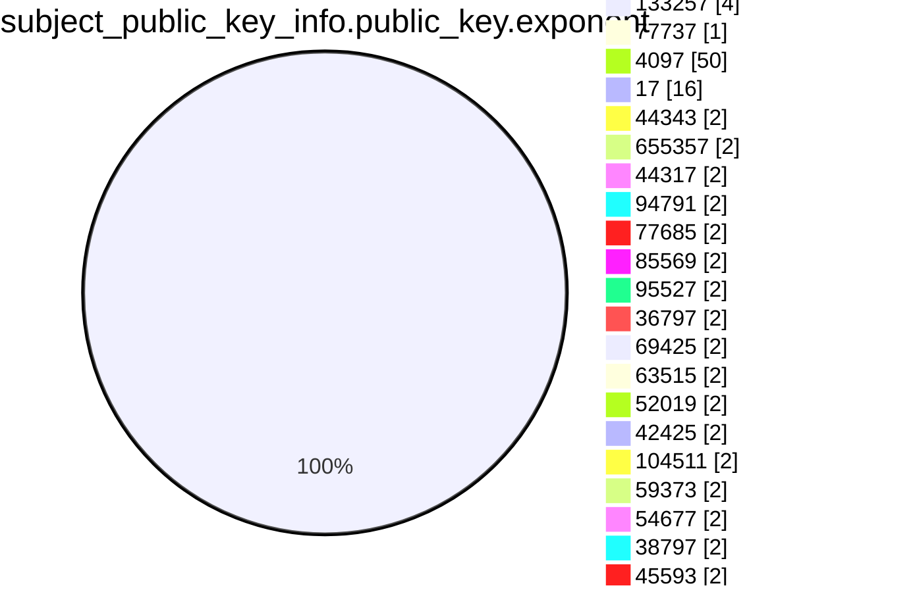
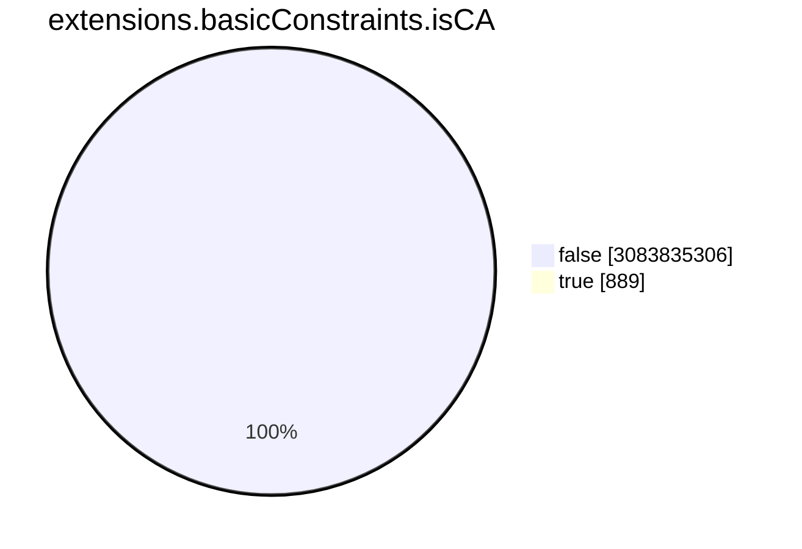
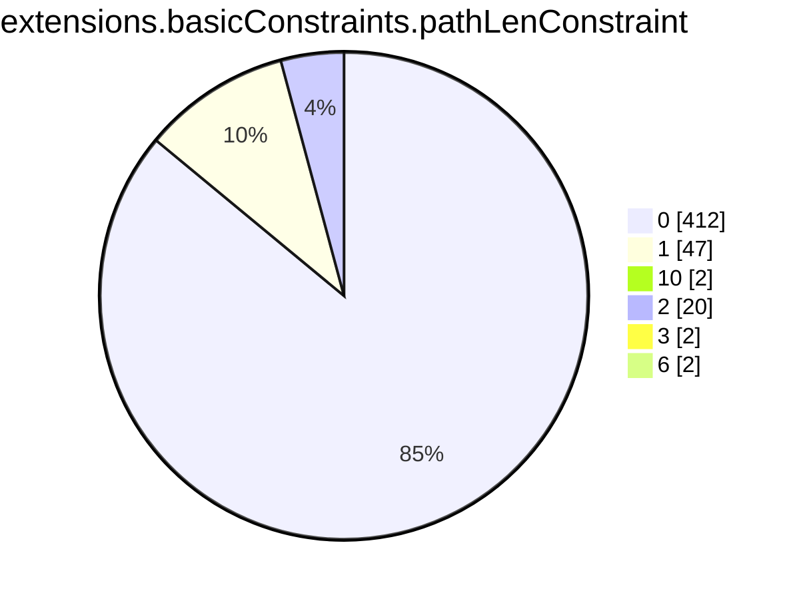

```mermaid
pie showData
title extensions.subjectAlternativeName
"1" :1330559504
"0" :17620
"2" :1331500822
"3" :213986310
"5" :22531711
"4" :40432890
"15" :1696619
"11" :13555407
"6" :16249733
"12" :3438621
"9" :36008973
"14" :1395207
"58" :27379
"8" :42113780
"26" :144119
"10" :12110252
"29" :79974
"89" :17247
"88" :18920
"21" :815768
"18" :1002664
"13" :6001216
"24" :4557524
"7" :13377784
"28" :111150
"16" :977455
"20" :3564931
"66" :30874
"17" :799732
"38" :63715
"22" :4668668
"100" :599848
"19" :771419
"41" :81555
"25" :110658
"87" :15875
"96" :23595
"60" :55207
"64" :30890
"86" :19371
"125" :1322
"42" :70911
"79" :15363
"27" :106439
"30" :114912
"62" :33330
"697" :11
"314" :41
"101" :2823
"33" :61838
"23" :2730456
"76" :22817
"34" :86129
"56" :30806
"215" :260
"77" :16348
"31" :62184
"106" :1189
"49" :129186
"107" :1145
"97" :13323
"35" :59506
"93" :15235
"45" :63331
"116" :1405
"48" :99990
"47" :73652
"69" :22850
"55" :26281
"627" :10
"356" :42
"52" :133272
"153" :495
"99" :44125
"67" :25382
"98" :36435
"32" :230880
"83" :15173
"91" :13663
"78" :20175
"579" :22
"65" :23543
"85" :15862
"82" :18471
"180" :605
"61" :22047
"36" :94766
"81" :20710
"68" :25630
"80" :23224
"40" :83281
"94" :15917
"39" :48693
"43" :45829
"37" :47565
"74" :19326
"44" :59950
"46" :70226
"231" :146
"53" :202045
"51" :920853
"50" :313364
"57" :22509
"59" :21302
"54" :80233
"75" :19626
"84" :22819
"95" :12780
"105" :1235
"70" :25504
"63" :20683
"184" :506
"263" :89
"182" :375
"186" :368
"183" :271
"90" :26675
"72" :22693
"136" :1044
"137" :1535
"104" :1458
"73" :21433
"160" :469
"357" :59
"176" :631
"110" :1235
"124" :1079
"313" :50
"119" :1198
"378" :57
"92" :18701
"71" :19156
"310" :53
"295" :50
"453" :21
"258" :158
"581" :10
"228" :247
"296" :92
"242" :189
"154" :486
"108" :1490
"139" :1617
"129" :1351
"134" :1049
"133" :1286
"631" :10
"122" :1094
"109" :1027
"147" :911
"102" :62229
"165" :377
"166" :349
"676" :10
"261" :499
"143" :1248
"217" :166
"287" :67
"616" :4
"617" :18
"503" :8
"199" :220
"144" :813
"146" :654
"123" :1289
"299" :74
"325" :48
"135" :1474
"103" :1138
"112" :1628
"246" :244
"118" :1202
"235" :222
"177" :316
"151" :532
"150" :665
"170" :376
"636" :12
"315" :175
"822" :26
"345" :48
"259" :82
"111" :1140
"128" :1286
"164" :436
"301" :56
"225" :212
"618" :52
"421" :18
"302" :89
"582" :32
"126" :1244
"131" :1239
"113" :1124
"114" :1336
"200" :1874
"149" :755
"243" :174
"167" :398
"234" :224
"115" :1176
"638" :8
"266" :89
"216" :231
"230" :166
"120" :1789
"196" :972
"202" :273
"218" :202
"117" :1265
"214" :178
"155" :495
"316" :75
"366" :41
"162" :498
"223" :165
"174" :559
"161" :374
"252" :170
"141" :1470
"168" :640
"181" :234
"130" :1102
"178" :268
"238" :138
"173" :383
"250" :526
"145" :964
"188" :610
"156" :586
"219" :191
"206" :299
"175" :211
"195" :251
"264" :83
"222" :181
"248" :222
"158" :372
"309" :62
"367" :42
"204" :289
"265" :43
"140" :1022
"232" :177
"253" :85
"244" :133
"292" :64
"190" :216
"347" :40
"256" :116
"209" :440
"194" :256
"368" :39
"312" :104
"207" :291
"152" :520
"148" :607
"169" :369
"396" :96
"121" :1235
"269" :78
"127" :1418
"159" :340
"172" :514
"381" :43
"163" :310
"251" :277
"257" :94
"233" :191
"278" :71
"237" :176
"241" :170
"201" :226
"319" :70
"236" :129
"641" :6
"198" :340
"208" :344
"229" :116
"247" :148
"185" :327
"192" :714
"157" :259
"240" :183
"193" :200
"343" :45
"142" :701
"639" :2
"369" :91
"245" :159
"859" :2
"179" :323
"187" :262
"293" :113
"239" :144
"205" :185
"210" :590
"584" :81
"703" :8
"279" :77
"298" :81
"272" :54
"583" :21
"452" :22
"546" :35
"262" :57
"586" :50
"288" :134
"335" :66
"500" :23
"213" :203
"619" :4
"197" :197
"294" :79
"274" :51
"370" :26
"268" :58
"679" :6
"249" :286
"191" :199
"291" :107
"493" :17
"589" :9
"307" :47
"132" :1046
"138" :890
"171" :379
"189" :202
"203" :226
"211" :475
"212" :173
"220" :162
"221" :173
"224" :294
"226" :158
"227" :186
"445" :16
"371" :32
"422" :20
"320" :59
"306" :78
"707" :23
"387" :41
"681" :12
"593" :8
"348" :52
"336" :74
"322" :63
"682" :10
"359" :43
"361" :42
"414" :37
"805" :4
"825" :18
"365" :28
"297" :86
"415" :27
"455" :16
"303" :69
"622" :2
"323" :48
"814" :4
"285" :69
"870" :22
"457" :22
"623" :12
"595" :14
"594" :5
"337" :35
"543" :72
"484" :21
"585" :18
"816" :16
"254" :110
"392" :70
"290" :75
"270" :89
"372" :48
"458" :14
"390" :34
"400" :45
"374" :36
"393" :63
"363" :86
"304" :46
"459" :26
"352" :37
"380" :32
"391" :41
"683" :18
"321" :79
"684" :10
"462" :29
"395" :53
"625" :2
"389" :73
"489" :21
"394" :49
"317" :52
"401" :29
"384" :24
"385" :23
"281" :138
"405" :45
"300" :117
"283" :39
"461" :32
"277" :53
"501" :15
"255" :108
"420" :35
"271" :62
"430" :20
"373" :30
"408" :34
"326" :50
"267" :113
"874" :4
"463" :22
"628" :5
"690" :14
"342" :57
"481" :18
"464" :21
"435" :22
"629" :10
"340" :50
"260" :88
"334" :38
"750" :7
"468" :23
"466" :24
"276" :96
"397" :68
"375" :30
"587" :22
"327" :33
"467" :16
"344" :49
"339" :45
"308" :67
"417" :29
"282" :97
"280" :94
"1131" :2
"376" :25
"692" :16
"488" :36
"284" :64
"286" :59
"338" :52
"329" :59
"377" :36
"331" :29
"346" :34
"878" :16
"419" :37
"333" :60
"632" :10
"470" :19
"693" :16
"289" :43
"471" :18
"694" :11
"492" :11
"495" :105
"439" :22
"812" :2
"473" :19
"431" :37
"429" :20
"433" :20
"360" :26
"364" :35
"634" :4
"386" :36
"410" :32
"440" :32
"480" :48
"362" :30
"483" :14
"479" :14
"441" :42
"880" :5
"442" :19
"781" :5
"516" :18
"353" :47
"318" :97
"474" :12
"486" :20
"982" :5
"485" :17
"412" :38
"438" :41
"496" :6
"940" :2
"350" :49
"695" :13
"418" :20
"829" :6
"273" :90
"497" :19
"502" :14
"517" :11
"341" :59
"518" :18
"504" :23
"505" :47
"564" :61
"568" :73
"576" :129
"575" :51
"482" :16
"701" :21
"423" :32
"406" :135
"2228" :2
"2230" :2
"2231" :2
"2240" :2
"2241" :2
"2242" :2
"2243" :2
"540" :20
"2244" :2
"2252" :2
"555" :14
"2254" :2
"2255" :2
"358" :38
"542" :18
"556" :16
"2257" :2
"670" :6
"311" :49
"557" :10
"544" :10
"590" :12
"751" :4
"2260" :2
"704" :15
"424" :20
"753" :6
"2266" :2
"653" :6
"937" :4
"2267" :2
"2269" :2
"2270" :2
"399" :44
"2273" :2
"2275" :10
"1971" :6
"1972" :4
"426" :24
"407" :40
"788" :4
"1973" :2
"828" :18
"427" :16
"755" :6
"1974" :2
"721" :7
"953" :2
"785" :4
"671" :8
"472" :17
"565" :8
"672" :18
"791" :8
"567" :10
"571" :12
"444" :33
"563" :14
"743" :9
"475" :10
"324" :91
"906" :6
"665" :13
"477" :18
"605" :10
"275" :60
"330" :66
"793" :4
"675" :14
"712" :8
"572" :23
"398" :46
"382" :25
"574" :8
"884" :6
"714" :6
"383" :29
"949" :2
"449" :16
"566" :24
"630" :12
"451" :11
"795" :8
"469" :15
"450" :24
"332" :59
"796" :8
"596" :14
"513" :10
"789" :8
"515" :9
"606" :24
"507" :18
"799" :4
"454" :24
"699" :16
"977" :4
"577" :10
"643" :7
"648" :79
"305" :71
"456" :27
"569" :12
"570" :21
"661" :9
"772" :4
"801" :22
"941" :8
"519" :28
"685" :4
"821" :4
"652" :4
"790" :6
"656" :11
"797" :8
"942" :10
"657" :9
"659" :16
"525" :54
"460" :17
"803" :4
"667" :4
"673" :8
"531" :24
"573" :16
"689" :21
"669" :12
"535" :11
"534" :29
"800" :8
"702" :26
"802" :2
"536" :12
"637" :8
"804" :42
"509" :20
"550" :9
"539" :16
"650" :2
"846" :4
"521" :10
"662" :10
"1139" :2
"678" :10
"549" :12
"807" :10
"404" :38
"411" :35
"552" :11
"691" :4
"409" :31
"1800" :3
"995" :2
"1000" :942
"696" :8
"823" :4
"837" :10
"526" :12
"510" :11
"554" :8
"854" :9
"511" :9
"416" :27
"813" :8
"558" :78
"478" :13
"402" :17
"354" :46
"843" :6
"1132" :3
"1133" :6
"1135" :6
"494" :15
"597" :13
"847" :2
"848" :4
"1136" :3
"1124" :3
"560" :20
"1123" :3
"1122" :3
"849" :2
"853" :4
"855" :14
"861" :14
"328" :27
"1116" :6
"864" :222
"713" :4
"865" :4
"562" :12
"866" :6
"824" :2
"1112" :6
"1097" :3
"1073" :3
"1071" :3
"872" :6
"1035" :3
"603" :17
"991" :5
"935" :7
"607" :16
"875" :6
"826" :6
"351" :33
"877" :6
"355" :26
"447" :30
"1004" :2
"403" :21
"886" :2
"889" :4
"890" :8
"379" :16
"810" :12
"388" :101
"1008" :2
"858" :2
"894" :6
"633" :50
"476" :22
"413" :32
"792" :54
"794" :6
"901" :4
"425" :20
"700" :3
"428" :30
"903" :14
"432" :41
"599" :12
"434" :18
"601" :8
"443" :24
"698" :13
"774" :10
"862" :6
"705" :23
"798" :14
"578" :10
"465" :32
"609" :86
"902" :6
"833" :6
"613" :2
"820" :2
"835" :2
"532" :8
"834" :26
"838" :2
"839" :6
"1013" :2
"818" :8
"612" :16
"614" :14
"1212" :2
"349" :27
"806" :6
"621" :4
"674" :8
"808" :2
"437" :22
"893" :8
"827" :2
"658" :6
"446" :14
"831" :82
"448" :6
"524" :16
"580" :14
"561" :10
"490" :10
"588" :18
"591" :14
"598" :4
"436" :6
"602" :12
"604" :4
"487" :4
"491" :15
"592" :6
"640" :9
"779" :3
"923" :13
"499" :3
"514" :4
"925" :5
"764" :5
"545" :5
"651" :25
"1127" :1
"615" :3
"529" :8
"624" :9
"933" :7
"547" :3
"520" :19
"709" :5
"522" :95
"717" :17
"723" :5
"527" :7
"530" :13
"782" :5
"727" :5
"553" :9
"533" :11
"537" :9
"538" :5
"664" :7
"1026" :1
"856" :2
"891" :4
"928" :6
"962" :2
"972" :4
"718" :2
"725" :6
"736" :6
"756" :16
"996" :10
"974" :4
"976" :2
"742" :6
"1249" :1
"1190" :2
"645" :8
"780" :10
"840" :2
"819" :10
"754" :2
"844" :2
"686" :16
"885" :30
"950" :4
"663" :10
"998" :8
"857" :4
"957" :24
"934" :2
"897" :6
"997" :6
"973" :2
"920" :6
"860" :6
"911" :14
"899" :4
"506" :8
"512" :10
"905" :6
"908" :12
"914" :4
"710" :4
"917" :6
"600" :92
"938" :2
"895" :2
"668" :10
"765" :4
"867" :8
"999" :28
"548" :14
"978" :4
"931" :2
"900" :8
"944" :4
"677" :8
"551" :8
"680" :6
"528" :16
"993" :2
"852" :8
"888" :18
"608" :6
"724" :2
"610" :10
"649" :6
"932" :4
"646" :2
"647" :4
"541" :2
"626" :14
"929" :4
"716" :4
"611" :22
"731" :6
"882" :16
"983" :6
"744" :8
"921" :10
"873" :8
"746" :4
"876" :6
"809" :6
"879" :12
"708" :8
"926" :8
"887" :2
"896" :2
"989" :2
"748" :2
"523" :4
"719" :2
"722" :2
"728" :4
"734" :6
"737" :6
"740" :4
"559" :12
"508" :4
"752" :2
"758" :2
"761" :2
"767" :6
"776" :4
"985" :8
"654" :6
"768" :20
"951" :14
"948" :10
"771" :10
"954" :18
"966" :92
"969" :6
"915" :62
"759" :6
"963" :50
"845" :4
"971" :2
"817" :2
"620" :2
"842" :6
"960" :26
"927" :16
"851" :4
"687" :4
"747" :10
"945" :6
"869" :6
"836" :2
"913" :2
"644" :2
"883" :2
"711" :4
"760" :4
"910" :2
"763" :2
"666" :6
"655" :2
"729" :16
"980" :2
"965" :2
"706" :2
"715" :2
"730" :2
"904" :2
"745" :2
"720" :10
"984" :2
"907" :2
"918" :18
"635" :6
"841" :2
"936" :4
"939" :12
"773" :2
"909" :2
"811" :4
"498" :12
"777" :2
"726" :8
"770" :2
"863" :4
"783" :6
"786" :6
"642" :4
"741" :8
"660" :12
"992" :4
"832" :2
"956" :4
"959" :6
"912" :6
"769" :2
"732" :4
"924" :2
"762" :2
"735" :2
"987" :2
```

```mermaid
pie showData
title subject.cn.tld
"tw" :2737937
"si" :1428740
"com" :1296489071
"in" :17146894
"IN" :453
"at" :10774753
"ru" :50126999
"br" :44376440
"org" :76031102
"net" :114468753
"jp" :15585177
"uk" :56707992
"ph" :872188
"today" :546437
"nz" :5504935
"biz" :6727495
"studio" :1092638
"us" :9676964
"ca" :18932148
"solutions" :554102
"cc" :3910276
"au" :24150644
"online" :13032037
"shop" :8858497
"domains" :178804
"media" :721910
"kr" :3456881
"finance" :384022
"mx" :7128215
"directory" :70358
"life" :3556734
"bz" :238449
"xyz" :26278421
"co" :29942394
"info" :15265310
"estate" :58921
"club" :5154117
"my" :2124065
"pg" :21162
"site" :9358736
"me" :27105649
"eu" :17970918
"cn" :13401727
"live" :3224737
"io" :57683572
"de" :103269073
"ws" :459364
"press" :105269
"center" :445252
"store" :6283109
"education" :240726
"it" :20875927
"cl" :6484848
"rocks" :838290
"xn--p1ai" :3460942
"art" :1490731
"space" :4179642
"global" :318456
"asia" :1236464
"th" :850386
"care" :246025
"hk" :1210910
"sg" :1635685
"fr" :34506597
"beer" :80944
"cloud" :7017311
"tech" :6324800
"work" :2421400
"tr" :3462206
"wedding" :150760
"healthcare" :34958
"health" :173913
"ie" :2037885
"pro" :5142642
"ltd" :569749
"dk" :8300595
"id" :9487719
"es" :10509352
"consulting" :196915
"ro" :6460065
"nl" :38390311
"vn" :5147206
"pl" :21795993
"edu" :3262006
"no" :7649049
"dev" :16511316
"se" :12735331
"tv" :2359120
"mobi" :758957
"gov" :508144
"il" :2920549
"be" :13251923
"su" :1201781
"cz" :12157442
"world" :1093371
"click" :912568
"uno" :202798
"community" :143726
"faith" :30457
"pt" :3750252
"city" :436264
"za" :13817759
"aero" :208564
"lv" :1096387
"lu" :715925
"amsterdam" :189434
"company" :462505
"lundbeck" :10
"gs" :52911
"events" :228836
"gal" :45528
"wine" :85910
"army" :31443
"expert" :226140
"ch" :24942735
"bzh" :99520
"exchange" :101702
"farm" :162829
"coop" :159794
"app" :8814311
"support" :203507
"team" :767889
"uy" :534515
"london" :179320
"design" :1308212
"business" :198767
"gl" :50878
"sv" :62465
"lk" :488191
"xn--80asehdb" :19092
"hu" :8633095
"ai" :1780547
"ac" :120869
"cyou" :470231
"pet" :70549
"cy" :161459
"travel" :185776
"agency" :930028
"direct" :8770736
"int" :33944
"capital" :148494
"law" :92002
"ae" :837873
"py" :285140
"digital" :1542039
"bmw" :22200
"cards" :56157
"reit" :195
"church" :338389
"energy" :121658
"ar" :6327596
"la" :440114
"bet" :204410
"cr" :170743
"pub" :165920
"bank" :49371
"xn--80aswg" :14183
"pw" :1633216
"is" :925865
"tj" :39502
"moscow" :114774
"ag" :159640
"jobs" :68799
"COM" :40306
"marketing" :195918
"academy" :374466
"bm" :25984
"social" :235331
"ci" :129781
"solar" :65836
"ad" :14442
"love" :231580
"re" :348315
"ni" :24498
"school" :204130
"gr" :5233423
"systems" :554070
"software" :205888
"gt" :192988
"gg" :526145
"group" :775297
"fun" :2250611
"aw" :3752
"best" :384481
"land" :162230
"fit" :305497
"tokyo" :798587
"pe" :1307953
"ec" :476614
"photography" :387451
"games" :334826
"eco" :66447
"link" :3304305
"Nu" :4
"tools" :390741
"nyc" :325957
"je" :50865
"website" :2065469
"construction" :41371
"fi" :7229027
"rs" :1584345
"rip" :86714
"vision" :83102
"am" :279260
"mn" :196969
"kh" :40094
"plus" :399224
"kim" :60546
"bn" :7603
"coffee" :160194
"plumbing" :10318
"rentals" :59775
"cool" :280008
"guide" :96705
"BZ" :36
"blog" :1045796
"xn--p1acf" :115509
"om" :29493
"quebec" :30830
"kw" :26328
"cba" :1066
"jo" :27910
"sa" :528524
"network" :738845
"fitness" :81047
"bh" :18824
"icu" :891353
"sk" :3145331
"vip" :2763528
"gallery" :139517
"mo" :18818
"ua" :8270739
"email" :478520
"kpn" :276
"ke" :1128178
"gh" :68049
"management" :64446
"nu" :1605889
"fj" :18409
"Com" :682
"eg" :59525
"gi" :11602
"koeln" :78207
"saxo" :256
"video" :218293
"ee" :1967723
"bg" :947569
"pk" :1212401
"scot" :72145
"hr" :1177954
"green" :100144
"uz" :625374
"gmo" :136
"qa" :109309
"vegas" :36796
"ntt" :1476
"clinic" :89904
"kz" :1995427
"miami" :48698
"cymru" :31746
"st" :242733
"one" :1300536
"red" :191825
"ng" :1657997
"ma" :807754
"ve" :168039
"bo" :155704
"dog" :93142
"tz" :295696
"bd" :287127
"services" :446278
"DE" :605
"accountants" :6870
"mv" :41914
"photo" :212515
"mc" :30584
"delivery" :75835
"lt" :1577452
"mu" :80886
"hn" :49811
"tt" :22089
"canon" :1187
"repair" :32433
"news" :454831
"llc" :91590
"BR" :258
"fm" :194006
"training" :117943
"berlin" :181456
"theater" :8759
"do" :268187
"museum" :7564
"ao" :89478
"ps" :66254
"auction" :22426
"ooo" :107675
"legal" :94859
"to" :43446313
"vc" :326350
"graphics" :45054
"ist" :36380
"zone" :596379
"okinawa" :34890
"technology" :195575
"jewelry" :27462
"AU" :862
"black" :47550
"fund" :235101
"xn--3e0b707e" :5194
"top" :6319891
"bio" :158989
"inc" :28533
"JP" :518
"paris" :97223
"study" :65882
"bw" :62488
"ryukyu" :3141
"racing" :18316
"page" :3086495
"help" :169016
"taxi" :49711
"yokohama" :26129
"ge" :404705
"house" :174513
"villas" :7661
"by" :1595853
"ba" :278185
"eus" :116882
"clothing" :57810
"place" :70331
"trade" :138661
"va" :208
"supply" :39562
"cat" :745602
"yoga" :87402
"li" :507544
"HK" :186
"market" :196163
"hsbc" :139
"audio" :31791
"as" :104490
"mz" :87929
"az" :312844
"movie" :13970
"so" :258013
"bi" :32863
"zw" :235701
"earth" :149119
"cw" :6756
"xn--80adxhks" :44219
"ventures" :82262
"apple" :193
"al" :232675
"gmbh" :114557
"name" :678900
"MY" :62
"GOV" :2022
"tours" :60063
"express" :61602
"jll" :66
"works" :303820
"cab" :22003
"jm" :12716
"boutique" :118961
"guru" :404226
"band" :113851
"host" :686420
"dental" :45254
"tc" :40687
"build" :81991
"watch" :92850
"pa" :68695
"win" :759664
"mk" :287556
"ORG" :2616
"toys" :32726
"cd" :21291
"bayern" :91334
"onl" :78350
"menu" :63907
"ml" :2482365
"pics" :46342
"money" :114732
"yt" :38973
"foundation" :114582
"immo" :86153
"alsace" :12768
"enterprises" :27302
"ninja" :463628
"blue" :175308
"pizza" :65363
"tk" :3413833
"bar" :206498
"codes" :217989
"gift" :36477
"ga" :1572987
"markets" :9954
"woodside" :1241
"credit" :32371
"ceo" :131277
"wtf" :281802
"sh" :593729
"aws" :12010
"kg" :130427
"sarl" :10022
"holdings" :27616
"run" :2697684
"im" :449330
"report" :68314
"cm" :189947
"rugby" :2540
"fail" :27413
"fashion" :78681
"BIZ" :161
"cf" :1475869
"gy" :31615
"hamburg" :55515
"ovh" :1049136
"football" :25207
"beauty" :43399
"buzz" :863395
"kyoto" :10697
"statefarm" :23857
"et" :36457
"limited" :33364
"men" :81907
"vet" :72160
"cash" :141347
"science" :103719
"mm" :45368
"mt" :101618
"pictet" :712
"partners" :66041
"audi" :4000
"ms" :106473
"ly" :246382
"international" :95399
"engineering" :89598
"coach" :128314
"infiniti" :74
"gq" :769865
"film" :46031
"lol" :172470
"homes" :67644
"vlaanderen" :36925
"iq" :39210
"tax" :53448
"sx" :31632
"rest" :132671
"fyi" :141406
"man" :1762
"africa" :235148
"tn" :281937
"gold" :203785
"surf" :94797
"ink" :306803
"cam" :154952
"md" :452398
"pr" :10262
"xxx" :60734
"stream" :135856
"amazon" :84
"contact" :38481
"party" :159562
"lc" :35810
"ht" :26172
"careers" :40819
"lb" :25858
"archi" :25762
"dating" :30251
"ky" :37052
"lawyer" :21724
"wien" :73531
"xn--tckwe" :7563
"limo" :7124
"computer" :39061
"nagoya" :30531
"recipes" :19847
"reisen" :15988
"moe" :193280
"show" :152446
"monster" :404713
"lgbt" :21835
"mil" :13530
"realty" :315058
"sport" :7013
"casa" :1511310
"bj" :30027
"tienda" :15377
"np" :513975
"haus" :55647
"bt" :21545
"swiss" :155757
"brussels" :48701
"bbva" :60
"financial" :42560
"bike" :97746
"wales" :53634
"sb" :9641
"cx" :184775
"dance" :65150
"glass" :19004
"radio" :16625
"lat" :40344
"cooking" :11899
"wiki" :157533
"download" :59699
"tf" :58804
"tui" :553
"insure" :29209
"pink" :55266
"sc" :52352
"security" :6955
"deals" :49508
"style" :101971
"vg" :20273
"parts" :26391
"tube" :31438
"forum" :1822
"xn--90ais" :65610
"productions" :67973
"properties" :61234
"realestate" :39203
"reviews" :80764
"car" :2400
"chat" :206645
"shoes" :19617
"tel" :150729
"kpmg" :69
"vote" :25031
"rent" :41500
"fish" :43042
"quest" :147172
"melbourne" :30226
"wang" :106481
"mba" :28003
"sap" :60030
"ax" :53470
"camera" :17423
"kiwi" :61581
"ug" :96517
"loan" :30199
"investments" :21049
"bingo" :10319
"cpa" :16195
"ki" :4264
"INT" :18
"luxe" :6752
"sm" :16272
"family" :206703
"fan" :31885
"game" :28979
"attorney" :9377
"golf" :64033
"gd" :110869
"CL" :78
"bid" :101620
"sn" :69124
"NET" :3419
"dealer" :306
"fo" :60327
"schule" :41422
"holiday" :19223
"casino" :67559
"contractors" :10765
"sr" :18035
"town" :48491
"ruhr" :25228
"institute" :66958
"organic" :11581
"sale" :117196
"fox" :1778
"cafe" :183506
"adult" :4745
"corsica" :13344
"lighting" :22635
"tm" :19174
"voyage" :14192
"weir" :2789
"xn--fiqs8s" :12310
"ne" :6184
"salon" :34378
"hosting" :106240
"poker" :17584
"xn--mgbaam7a8h" :83
"tips" :100447
"pf" :19947
"xin" :42648
"auspost" :503
"na" :94021
"auto" :6945
"moda" :49183
"af" :45412
"nrw" :60523
"PRO" :4
"QA" :84
"NO" :44
"fans" :34321
"UK" :747
"garden" :28761
"pictures" :66055
"bs" :7862
"SE" :121
"flowers" :9071
"zm" :37137
"loans" :18399
"mortgage" :14957
"frl" :61054
"accountant" :6510
"Org" :83
"nc" :82577
"pm" :95403
"xn--ses554g" :739
"restaurant" :39792
"university" :43634
"srl" :76204
"gifts" :36207
"charity" :11927
"dz" :130054
"vi" :2780
"abbott" :2949
"ikano" :672
"photos" :149437
"rw" :96895
"tirol" :53580
"brother" :179
"sz" :11082
"camp" :62737
"clubmed" :1380
"saarland" :16838
"nr" :562
"ngo" :32729
"dentist" :9651
"irish" :20606
"krd" :9757
"promo" :53906
"discount" :9486
"EDU" :1249
"CA" :1589
"actor" :13179
"baby" :24669
"toyota" :340
"tl" :20311
"viajes" :6605
"boston" :9615
"tatar" :4798
"kitchen" :48750
"vin" :33966
"christmas" :6467
"trading" :10847
"review" :98825
"ski" :34851
"navy" :10059
"pharmacy" :1699
"xn--j1amh" :33036
"autos" :18498
"teva" :357
"gives" :13655
"vacations" :11661
"florist" :45373
"tg" :23677
"cleaning" :17070
"doctor" :44109
"suzuki" :198
"porn" :14150
"new" :19897
"gay" :173062
"webcam" :14061
"SA" :188
"KW" :34
"xn--kpry57d" :1745
"ricoh" :550
"afl" :341
"sbi" :587
"sky" :2038
"mw" :14597
"xn--d1acj3b" :4783
"AR" :70
"CN" :57
"NL" :246
"wf" :36835
"bot" :17481
"sexy" :23222
"mg" :66901
"ren" :48883
"physio" :9990
"vu" :159866
"mp" :8160
"cg" :9309
"ls" :16590
"bb" :6725
"hair" :15677
"IT" :204
"Gov" :108
"sncf" :551
"neustar" :1012
"builders" :40721
"cricket" :9092
"pfizer" :136
"sydney" :26448
"associates" :18411
"college" :18128
"US" :409
"fk" :634
"godaddy" :198
"jcb" :85
"abb" :2415
"gn" :3532
"soccer" :12493
"ck" :3530
"globo" :2299
"nissan" :83
"horse" :27495
"xn--mgberp4a5d4ar" :709
"soy" :11808
"xn--c1avg" :2896
"how" :25412
"dm" :4511
"cbs" :53
"date" :43715
"kn" :2891
"diamonds" :9625
"shopping" :42020
"nikon" :4
"rehab" :12196
"temasek" :48
"barcelona" :18537
"skin" :15475
"observer" :9114
"lamborghini" :463
"tickets" :1696
"sony" :100
"gm" :10887
"immobilien" :17296
"jetzt" :63648
"reise" :3032
"kaufen" :15698
"tennis" :8455
"singles" :12553
"xn--mk1bu44c" :2942
"tatamotors" :94
"itau" :150
"SG" :401
"hiphop" :1801
"gp" :9543
"tires" :5600
"ye" :5622
"total" :991
"EU" :180
"barclaycard" :268
"barclays" :1079
"property" :11509
"bnpparibas" :2149
"surgery" :10492
"cv" :24536
"engineer" :39045
"exposed" :12008
"xn--90ae" :6706
"catering" :14354
"MX" :71
"vodka" :6578
"hermes" :403
"taipei" :8297
"ong" :10278
"cologne" :13472
"km" :953
"gratis" :21163
"JM" :4
"claims" :12003
"gucci" :150
"bridgestone" :313
"versicherung" :3370
"istanbul" :16857
"playstation" :37
"goog" :331221
"xn--qxa6a" :246
"xn--e1a4c" :1889
"dj" :16583
"equipment" :13299
"fishing" :6951
"republican" :4279
"industries" :33869
"xn--q9jyb4c" :4362
"Lighting" :2
"SALE" :7
"condos" :8931
"nike" :819
"futbol" :10188
"gop" :6157
"honda" :125
"realtor" :95429
"hospital" :5945
"cfd" :97299
"gdn" :11639
"ONLINE" :12
"sl" :9691
"courses" :18270
"madrid" :7615
"xn--9dbq2a" :1938
"forsale" :22061
"mq" :2832
"AE" :138
"dvag" :12045
"RU" :82
"EMAIL" :7
"supplies" :15049
"apartments" :19404
"PH" :77
"compare" :1362
"xn--h2brj9c" :1691
"desi" :7111
"orange" :3452
"country" :5664
"cheap" :17447
"TR" :14
"dhl" :582
"hockey" :6441
"sex" :14878
"democrat" :4476
"blackfriday" :1451
"sucks" :1997
"diet" :3989
"degree" :3451
"xn--fiq228c5hs" :207
"lease" :10645
"osaka" :5974
"sakura" :30
"capetown" :21960
"bargains" :7326
"joburg" :13249
"xn--ngbc5azd" :648
"flights" :8876
"xn--6qq986b3xl" :9653
"durban" :8214
"sbs" :158990
"rodeo" :13232
"bond" :86213
"cruises" :4893
"mango" :124
"mom" :16875
"coupons" :9770
"abogado" :1596
"xn--qxam" :5627
"vanguard" :311
"tattoo" :39568
"xn--j6w193g" :5681
"airforce" :3583
"gf" :2676
"nf" :57464
"forex" :2384
"sd" :50298
"memorial" :5463
"creditcard" :5020
"broker" :6442
"crs" :3573
"jnj" :2220
"citic" :244
"boats" :4025
"PT" :20
"aeg" :5
"leclerc" :2997
"trust" :30
"ir" :5650034
"LONDON" :6
"lidl" :550
"ltda" :2589
"bf" :14253
"luxury" :5921
"Dk" :4
"insurance" :1921
"furniture" :17714
"yachts" :3256
"next" :983
"sandvik" :394
"Clinic" :2
"basketball" :3129
"Edu" :32
"hiv" :655
"genting" :28
"pioneer" :77
"DK" :277
"OM" :6
"post" :749
"CO" :66
"aquarelle" :91
"makeup" :9191
"Biz" :145
"FR" :151
"schwarz" :3247
"day" :28103
"mr" :9258
"bible" :23993
"NETWORK" :16
"monash" :314
"abudhabi" :1163
"RENTALS" :3
"gent" :51853
"shiksha" :2720
"ES" :318
"hm" :4288
"香港" :24
"maison" :6275
"moi" :463
"xn--6frz82g" :5933
"career" :4265
"jpmorgan" :4
"sy" :21310
"CBA" :48
"toray" :245
"xn--czrs0t" :184
"uol" :182
"td" :4888
"juegos" :971
"bradesco" :576
"storage" :2248
"williamhill" :22
"TH" :83
"scb" :129
"guitars" :2128
"Be" :4
"rich" :1052
"xn--g2xx48c" :101
"Net" :71
"xn--mgbab2bd" :184
"xn--rhqv96g" :493
"select" :695
"erni" :101
"gripe" :1328
"sharp" :539
"CZ" :29
"schaeffler" :2258
"komatsu" :662
"anz" :334
"cars" :2502
"ZA" :120
"FI" :109
"BE" :104
"IE" :58
"philips" :15
"ismaili" :166
"schmidt" :222
"xn--o3cw4h" :1619
"KE" :23
"deloitte" :198
"IO" :35
"showtime" :7
"Co" :2
"nab" :8
"sener" :113
"BANK" :15
"abc" :101
"xn--czr694b" :291
"Za" :8
"HR" :52
"lotto" :184
"CM" :6
"theatre" :152
"uK" :15
"TW" :261
"praxi" :6
"xn--io0a7i" :913
"lr" :4054
"BH" :22
"MU" :10
"RE" :2
"xn--t60b56a" :367
"IL" :46
"DZ" :14
"EC" :12
"COMPANY" :9
"xn--vhquv" :94
"vig" :752
"cfa" :54
"CLOUD" :12
"voto" :1610
"pn" :1731
"aq" :1090
"ss" :1873
"lilly" :57
"azure" :187
"SI" :16
"jio" :49
"RO" :166
"GR" :85
"ID" :45
"voting" :246
"motorcycles" :2500
"axa" :237
"seat" :562
"rio" :9505
"sanofi" :234
"nico" :146
"ipiranga" :40
"xn--3ds443g" :321
"CAFE" :3
"xn--node" :666
"xn--vuq861b" :137
"kred" :1086812
"zuerich" :3122
"shell" :1682
"MD" :4
"NZ" :75
"microsoft" :52
"PY" :12
"xn--3hcrj9c" :85
"xn--90a3ac" :5265
"lego" :96
"goo" :51
"MIL" :51
"City" :18
"fresenius" :22
"xn--fiqz9s" :844
"ifm" :1045
"linde" :11
"cisco" :31
"aaa" :20
"TV" :12
"med" :202
"VN" :33
"smart" :44
"xn--y9a3aq" :2433
"mma" :76
"xn--otu796d" :72
"xn--czru2d" :102
"cuisinella" :46
"EG" :2
"PL" :15
"aig" :29
"panasonic" :51
"cu" :54693
"weber" :1373
"xn--55qx5d" :11810
"In" :8
"MO" :6
"ubs" :4
"NU" :2
"AG" :25
"xn--kput3i" :5996
"itv" :30
"flir" :48
"fage" :100
"mh" :74
"ET" :32
"yandex" :526
"protection" :106
"Zone" :8
"Asia" :8
"CH" :50
"LB" :39
"gw" :6041
"AO" :57
"stockholm" :64
"otsuka" :66
"SBI" :30
"MOBI" :23
"creditunion" :192
"Fr" :42
"ASIA" :24
"ericsson" :13
"kfh" :20
"amex" :4
"BRADESCO" :34
"xn--rvc1e0am3e" :63
"Live" :10
"hisamitsu" :461
"CI" :2
"natura" :13
"xn--54b7fta0cc" :697
"locus" :263
"LAW" :6
"xn--rovu88b" :6
"xn--1ck2e1b" :4
"xn--eckvdtc9d" :4
"qpon" :800
"imdb" :4
"free" :4
"read" :4
"tushu" :4
"xn--jlq480n2rg" :4
"silk" :4
"CD" :4
"LTD" :4
"BS" :2
"BM" :4
"bbc" :50
"edeka" :795
"airbus" :16
"chase" :10
"MADRID" :2
"call" :4
"audible" :4
"xn--unup4y" :99
"AT" :16
"COOP" :10
"NAME" :2
"bauhaus" :252
"WORLD" :4
"EUS" :6
"xn--5tzm5g" :889
"dubai" :59
"adac" :2
"INFO" :31
"arab" :4
"politie" :306
"NYC" :2
"jaguar" :5
"landrover" :5
"sew" :39
"lincoln" :4
"statebank" :68
"lanxess" :52
"TOP" :2
"nec" :61
"WS" :21
"rwe" :8
"DIGITAL" :20
"toshiba" :78
"xn--nqv7f" :203
"jprs" :41
"PE" :20
"frogans" :25
"SZ" :2
"Solutions" :6
"HU" :15
"LA" :14
"xn--fjq720a" :93
"ACADEMY" :8
"farmers" :8
"xfinity" :9
"comcast" :9
"ZM" :6
"TECH" :24
"FARM" :4
"XYZ" :84
"channel" :440
"Software" :4
"xn--2scrj9c" :150
"mutual" :9
"northwesternmutual" :4
"Tech" :3
"CLUB" :16
"JO" :36
"xn--xhq521b" :201
"bosch" :3
"samsung" :6
"nowruz" :82
"xn--hxt814e" :210
"xn--mgbca7dzdo" :6
"booking" :4
"dupont" :12
"CAT" :2
"extraspace" :62
"gu" :300
"MZ" :12
"aco" :1530
"redumbrella" :3
"travelers" :3
"travelersinsurance" :3
"trv" :3
"KR" :10
"BW" :4
"CR" :6
"Bid" :8
"mattel" :861
"HOUSE" :3
"bentley" :50
"xn--wgbh1c" :46
"guardian" :12
"APP" :4
"xn--zfr164b" :14
"xn--imr513n" :6
"LT" :8
"xn--s9brj9c" :105
"mini" :66
"xn--h2breg3eve" :107
"arpa" :12
"AERO" :7
"xn--xkc2dl3a5ee0h" :591
"analytics" :10
"Bank" :12
"Video" :4
"xn--gecrj9c" :102
"foo" :273
"KZ" :6
"Dog" :6
"gea" :134
"Info" :2
"GT" :2
"Uk" :12
"hyundai" :54
"Dev" :4
"xn--45brj9c" :355
"mit" :11
"amica" :4
"Land" :3
"AM" :6
"bms" :4
"xn--fpcrj9c3d" :102
"MT" :44
"RW" :6
"PF" :4
"broadway" :71
"WEIR" :2
"MA" :38
"Eu" :2
"ANZ" :12
"LIFE" :10
"UG" :5
"google" :52821
"ice" :10
"ZONE" :4
"xn--d1alf" :248
"Us" :2
"jmp" :10
"nra" :20
"accenture" :4
"FOX" :5
"bloomberg" :10
"msd" :2
"PK" :5
"icbc" :2
"GG" :16
"sas" :6
"mtr" :5
"UA" :4
"SINGLES" :4
"GL" :6
"KY" :2
"chintai" :25
"feedback" :1642
"Mil" :2
"Store" :2
"COm" :2
"CY" :6
"tW" :2
"Ca" :4
"xbox" :8
"bing" :8
"windows" :8
"hotmail" :8
"skype" :8
"office" :8
"allfinanz" :421
"Social" :8
"SK" :5
"GH" :4
"DO" :8
"NG" :4
"NA" :2
"cern" :75
"BN" :14
"HOST" :14
"ABUDHABI" :2
"VIP" :6
"crown" :3
"ME" :16
"CC" :4
"bR" :2
"SAP" :2
"bcn" :50
"IS" :2
"softbank" :101
"Global" :4
"STUDIO" :4
"SPACE" :8
"XN--P1AI" :28
"BO" :2
"coM" :4
"IQ" :4
"Health" :6
"EE" :2
"xn--fct429k" :2
"GAL" :2
"xn--ngbrx" :3
"La" :2
"cN" :2
"AI" :14
"xn--80ao21a" :648
"BG" :2
"kinder" :15
"walter" :4
"AF" :4
"SITE" :2
"zara" :16
"GLOBAL" :5
"NTT" :6
"Online" :8
"hitachi" :75
"SL" :12
"QUEST" :4
"deV" :2
"WORK" :2
"ford" :4
"able" :8
"STORE" :2
"youtube" :486
"meet" :90
"ECO" :2
"beats" :6
"xn--mgbbh1a71e" :93
"xn--1qqw23a" :10897
"xn--i1b6b1a6a2e" :121
"ggee" :46
"tvs" :42
"xn--pgbs0dh" :24
"chrome" :21
"bugatti" :82
"bostik" :518
"firmdale" :1477
"maif" :239
"gle" :111
"TM" :2
"xn--mgbah1a3hjkrd" :45
"xn--gckr3f0f" :61
"vivo" :50
"xn--nqv7fs00ema" :27
"xn--mix891f" :25
"kosher" :16
"pru" :42
"stc" :46
"One" :3
"xn--ygbi2ammx" :23
"xn--mgbayh7gpa" :164
"mlb" :38
"vuelos" :15
"eurovision" :17
"alstom" :15
"TC" :2
"ieee" :14
"hoteles" :16
"Systems" :8
"wme" :16
"passagens" :17
"omega" :30
"ses" :2
"stada" :200
"SCOT" :8
"xn--4gbrim" :54
"netflix" :19
"CITY" :2
"Show" :2
"xn--mgba3a4f16a" :119
"redstone" :3
"lacaixa" :16
"swatch" :5
"whoswho" :39
"MR" :4
"epson" :47
"yodobashi" :45
"lixil" :30
"mitsubishi" :46
"Cloud" :6
"fujitsu" :49
"dnp" :46
"datsun" :48
"goldpoint" :46
"nhk" :47
"lotte" :49
"kddi" :43
"kia" :50
"arte" :111
"xn--fzc2c9e2c" :44
"dabur" :43
"fairwinds" :68
"firestone" :30
"lexus" :35
"INDUSTRIES" :3
"latrobe" :15
"citi" :15
"java" :52
"csc" :7
"cancerresearch" :16
"reliance" :30
"hdfc" :36
"ril" :32
"er" :48
"LU" :12
"Me" :4
"Space" :2
"oldnavy" :12
"rocher" :16
"athleta" :12
"helsinki" :33
"ferrero" :110
"LV" :2
"xn--45br5cyl" :13
"lplfinancial" :16
"lpl" :16
"ups" :11
"Market" :2
"GE" :3
"Academy" :19
"Jo" :2
"shia" :9
"pars" :9
"tci" :9
"TOKYO" :2
"abbvie" :54
"xn--mgbgu82a" :16
"xn--wgbl6a" :16
"gap" :10
"lancaster" :5
"xn--l1acc" :8
"bananarepublic" :9
"sandvikcoromant" :2
"xn--mgbbh1a" :4
"imamat" :2
"caravan" :2
"xn--kprw13d" :4
"sfr" :1
"Photography" :2
"KH" :25
"рф" :1
"goV" :1
"xn--3bst00m" :2
"ally" :4
"TT" :1
"xerox" :2
"CRS" :1
"Pro" :2
"DEV" :1
"Loan" :4
"Healthcare" :1
"ML" :12
"Tk" :16
"watches" :4
"xn--ogbpf8fl" :130
"safety" :4
"grainger" :2
"TK" :34
"Ltd" :140
"xn--mgbpl2fh" :20
"xn--clchc0ea0b2g2a9gcd" :8
"xn--q7ce6a" :12
"xn--mgbcpq6gpa1a" :6
"xyZ" :4
"XN--5TZM5G" :8
"SCIENCE" :10
"xn--mgbai9azgqp6j" :4
"cLub" :4
"LI" :6
"goodyear" :2
"dunlop" :2
"Xyz" :2
"MONSTER" :10
"KG" :2
"CF" :10
"CLICK" :2
"SHOP" :2
```

```mermaid
pie showData
title issuer
"Google UK Ltd." :132366
"STRAC" :2
"Foundation for Trusted Identity" :2
"TSCP Inc." :3
"Cisco Systems" :2312
"行政院" :12
"KPN B.V." :2
"Actalis S.p.A.-03358520967" :2
"U.S. Government" :19
"CertiPath" :4
"WidePoint" :1
"A-Trust Ges. f. Sicherheitssysteme im elektr. Datenverkehr GmbH" :12
"AC Camerfirma S.A." :402
"ICP-Brasil" :6
"VeriSign, Inc." :19
"行政院" :44
"Baltimore" :32
"U.S. Government" :3
"Microsoft Corporation" :2
"VeriSign, Inc." :49
"A-Trust Ges. f. Sicherheitssysteme im elektr. Datenverkehr GmbH" :10
"FNMT-RCM" :8
"VeriSign, Inc." :6
"AC CAMERFIRMA S.A." :6
"VeriSign, Inc." :4
"Colegio de Registradores de la Propiedad y Mercantiles de España" :4
"thawte, Inc." :4
"行政院" :4
"DigiCert Inc" :10
"Hellenic Academic and Research Institutions Cert. Authority" :10
"Republika Slovenija" :4
"Elektronik Bilgi Guvenligi A.S." :4
"MULTICERT - Serviços de Certificação Electrónica S.A." :2
"E-Tuğra EBG Bilişim Teknolojileri ve Hizmetleri A.Ş." :10
"GeoTrust Inc." :4
"Hellenic Academic and Research Institutions Cert. Authority" :45
"Atos" :14
"Apple Inc." :117
"Apple Inc." :57
"SAFE-Biopharma" :2
"QuoVadis Limited" :10
"Apple Inc." :29
"POSTA" :6
"Secretaria de Economia" :6
"TÜRKTRUST Bilgi İletişim ve Bilişim Güvenliği Hizmetleri A.Ş." :4
"Elektronik Bilgi Guvenligi A.S." :2
"LAWtrust" :6
"AC Camerfirma SA" :2
"SwissSign AG" :2
"British Telecommunications plc" :12
"SAFE Identity" :2
"Certinomis" :2
"HydrantID (Avalanche Cloud Corporation)" :2
"QuoVadis Limited" :12
"GlobalSign" :2
"GlobalSign nv-sa" :5
"Institute for Development and Research in Banking Technology" :89
"U.S. Government" :3
"Actalis S.p.A." :6
"Symantec Corporation" :10
"Trustwave Holdings, Inc." :3
"Apple Inc." :49
"Sectigo Limited" :2
"GlobalSign nv-sa" :12
"WoSign CA Limited" :6
"VeriSign, Inc." :2
"Japanese Government" :2
"Unizeto Technologies S.A." :4
"ANF Autoridad de Certificacion" :4
"SwissSign AG" :2
"Google UK Ltd." :197103
"Hongkong Post" :10
"Vaestorekisterikeskus CA" :4
"QuoVadis Limited" :8
"certSIGN" :4
"DigiCert Inc" :4
"e-commerce monitoring GmbH" :10
"ICP-Brasil" :10
"DigiCert Inc" :4
"MINISTERE INTERIEUR" :2
"DigiCert Inc" :2
"Government Root Certification Authority" :2
"Open Access Technology International Inc" :2
"SECOM Trust Systems CO.,LTD." :10
"E-Tuğra EBG Bilişim Teknolojileri ve Hizmetleri A.Ş." :102
"Elektronik Bilgi Guvenligi A.S." :2
"行政院" :225
"ICP-Brasil" :2
"TÜRKTRUST Bilgi İletişim ve Bilişim Güvenliği Hizmetleri A.Ş." :4
"VeriSign, Inc." :8
"Apple Inc." :47
"Orion Health Inc." :4
"DigiCert Inc" :2
"ACNLB" :2
"QuoVadis Limited" :53847
"Apple Inc." :47
"The USERTRUST Network" :2
"GlobalSign nv-sa" :8
"GAD EG" :4
"VeriSign, Inc." :6
"NISZ Nemzeti Infokommunikációs Szolgáltató Zrt." :24
"QuoVadis Limited" :10
"SECOM Trust.net" :17
"Turkiye Bilimsel ve Teknolojik Arastirma Kurumu - TUBITAK" :2
"SwissSign AG" :5
"Verizon Business" :2
"ICP-Brasil" :2
"Symantec Corporation" :2
"SwissSign AG" :3
"Apple Inc." :2
"GoDaddy.com, Inc." :10137361
"GlobalSign nv-sa" :1189228
"GlobalSign nv-sa" :487515
"GlobalSign nv-sa" :1909057
"Starfield Technologies, Inc." :1153661
"GlobalSign nv-sa" :658174
"GlobalSign nv-sa" :75930
"GlobalSign nv-sa" :52513
"GlobalSign nv-sa" :87378
"Česká pošta, s.p." :3301
"Rede Nacional de Ensino e Pesquisa - RNP" :19446
"GlobalSign nv-sa" :400
"VALID CERTIFICADORA DIGITAL" :1478
"SOLUTI - SOLUCOES EM NEGOCIOS INTELIGENTES S-A" :94
"ATT Services Inc" :26685
"DigiCert Inc" :1757108
"Sectigo Limited" :94286373
"Internet2" :1324826
"SecureCore" :73713
"SECOM Trust Systems CO.,LTD." :85354
"DigiCert Inc" :7637440
"Network Solutions L.L.C." :320528
"DigiCert Inc" :544532
"GoGetSSL" :552008
"SSL Corporation" :294625
"The USERTRUST Network" :191545
"Sectigo Limited" :2456751
"Government of Korea" :2471
"DigiCert Inc" :25579
"DigiCert Inc" :623789
"DigiCert Inc" :2454397
"DigiCert Inc" :407052
"DigiCert Inc" :39190875
"SECOM Trust Systems CO.,LTD." :85186
"DigiCert Inc" :10757
"DigiCert Inc" :962
"DigiCert Inc" :51189
"DigiCert Inc" :89246
"DigiCert Inc" :113720
"UniTrust" :3071
"FUJIFILM" :872
"DigiCert Inc" :2236
"DigiCert Inc" :74824135
"Trust Provider B.V." :71250
"The Trustico Group Ltd" :35500
"DigiCert Inc" :281516
"DigiCert Inc" :7669
"GlobalSign nv-sa" :4985
"SecureCore" :2978
"Aetna Inc" :42945
"DigiCert Inc" :193948
"TrustAsia Technologies, Inc." :3396
"Technische Universitaet Dresden" :3340
"COMODO CA Limited" :757573
"Verein zur Foerderung eines Deutschen Forschungsnetzes e. V." :240254
"EUNETIC GmbH" :22996
"DigiCert Inc" :1214101
"Soluciones Corporativas IP, SL" :117273
"DigiCert Inc" :51134
"Fraunhofer" :18913
"Alpiro s.r.o." :29126
"DigiCert Inc" :676
"Sectigo Limited" :2083
"Network Solutions L.L.C." :90558
"DigiCert Inc" :8660
"DigiCert Inc" :1078
"DigiCert Inc" :8481
"Technische Universitaet Ilmenau" :1030
"DigiCert Inc" :677185
"Karlsruhe Institute of Technology" :5434
"DigiCert Inc" :25797
"Microsec Ltd." :1972
"Gandi" :1625526
"TBS INTERNET" :15737
"Siemens" :4
"Corporation Service Company" :140634
"EUNETIC GmbH" :483
"Max-Planck-Gesellschaft" :10349
"Nijimo K.K." :3111
"DigiCert Inc" :146161
"Sectigo Limited" :23129
"The USERTRUST Network" :6921
"DigiCert Inc" :101284
"Sectigo Limited" :7790082
"Internet2" :33737
"DigiCert Inc" :2948
"GoGetSSL" :961
"Trustwave Holdings, Inc." :34627
"DigiCert Inc" :128575
"Wells Fargo & Company" :13367
"Government of the District of Columbia" :1445
"DigiCert Inc" :2875
"K Software" :1590
"DigiCert Inc" :20568
"TrustAsia Technologies, Inc." :3768188
"WoTrus CA Limited" :31869
"Apple Inc." :7761
"Cybertrust Japan Co., Ltd." :73306
"BitCert" :1543
"CrowdStrike Inc." :324
"TAIWAN-CA" :777
"Cybertrust Japan Co., Ltd." :33683
"SSL Corp" :1493
"GoGetSSL" :3754
"DigiCert Inc" :969486
"DigiCert Inc" :3258
"Deutscher Bundestag" :375
"CentralNic Luxembourg Sàrl" :32290
"IZENPE S.A." :1630
"DigiCert Inc" :4663
"Chunghwa Telecom Co., Ltd." :9808
"SECOM Trust Systems CO.,LTD." :37872
"The Trustico Group Ltd" :411
"Corporation Service Company" :415
"MarketWare - Soluções para Mercados Digitais, Lda." :1176
"VALID CERTIFICADORA DIGITAL" :216
"CERTDATA SERVICOS DE INFORMACAO LTDA" :273
"Open Access Technology International Inc" :3502
"Apple Inc." :7733
"Internet2" :17218
"Amazon" :87266455
"WoTrus CA Limited" :6303
"Disig a.s." :957
"IZENPE S.A." :747
"DHIMYOTIS" :14914
"Aristotle University of Thessaloniki" :2303
"Buypass AS-983163327" :22951
"GEANT Vereniging" :13505
"GlobalSign nv-sa" :512
"Aetna Inc" :218
"SOLUTI - SOLUCOES EM NEGOCIOS INTELIGENTES S-A" :290
"Sectigo (Europe) SL" :13
"Fresenius Kabi AG" :336
"Apple Inc." :3391
"Trustwave Holdings, Inc." :580
"Apple Inc." :3068
"TrustAsia Technologies, Inc." :56975
"OpenTrust" :2
"GeoTrust Inc." :2
"Certinomis" :2
"Certinomis" :18
"SwissSign AG" :32138
"GeoTrust Inc." :2
"SwissSign AG" :2
"SwissSign AG" :8449
"SwissSign AG" :2
"DigiCert Inc" :835
"VI Registru centras - i.k. 124110246" :2
"Inera AB" :14
"Agence Nationale des Titres Sécurisés" :6
"CERTSIGN SA" :2
"CERTSIGN SA" :17
"China Financial Certification Authority" :5771
"China Financial Certification Authority" :1084
"China Financial Certification Authority" :2
"CERTSIGN SA" :2
"Netflix, Inc." :2
"Krajowa Izba Rozliczeniowa S.A." :2
"E-Tuğra EBG Bilişim Teknolojileri ve Hizmetleri A.Ş." :11034
"E-Tuğra EBG Bilişim Teknolojileri ve Hizmetleri A.Ş." :344
"Isimtescil Bilisim Anonim Sirketi" :2
"Isimtescil Bilisim Anonim Sirketi" :33674
"Krajowa Izba Rozliczeniowa S.A." :1922
"Vaestorekisterikeskus CA" :1721
"Vaestorekisterikeskus CA" :5
"Krajowa Izba Rozliczeniowa S.A." :2
"Vaestorekisterikeskus CA" :4
"E-Tuğra EBG Bilişim Teknolojileri ve Hizmetleri A.Ş." :2
"Vaestorekisterikeskus CA" :1764
"COMODO CA Limited" :18428
"Actalis S.p.A." :2452772
"RU-Center (ЗАО Региональный Сетевой Информационный Центр)" :2581
"QuoVadis Limited" :169300
"联通智慧安全科技有限公司" :88
"QuoVadis Trustlink B.V." :29453
"Buypass AS-983163327" :6460
"TeliaSonera" :24398
"CERTDATA SERVICOS DE INFORMACAO LTDA" :296
"MarketWare - Soluções para Mercados Digitais, Lda." :852
"HydrantID (Avalanche Cloud Corporation)" :1681764
"VTB BANK (PJSC)" :265
"sslTrus" :765
"Government of Korea" :332
"sslTrus" :2784
"DigiCert Inc" :802
"GlobalSign nv-sa" :10174
"DigiCert Inc" :36461
"Site Blindado S.A." :2130
"KICA" :12
"IdenTrust" :5981129
"IdenTrust" :12288
"DigiCert Inc" :220
"Corporation Service Company" :16049
"Actalis S.p.A." :23834
"SECOM Trust Systems CO.,LTD." :2257
"DigiCert Inc" :196
"Hongkong Post" :6875
"SSL.com" :769
"Microsec Ltd." :638
"TrustSign Certificadora Dig. & Soluções Segurança da Inf. Ltda." :4269
"Apple Inc." :498
"Apple Inc." :1400
"UniTrust" :2
"UniTrust" :2
"Open Access Technology International Inc" :1286
"Intesa Sanpaolo S.p.A." :9
"InfoCert S.p.A." :125
"InfoCert S.p.A." :58
"QuoVadis Limited" :6
"QuoVadis Limited" :6
"Turkiye Bilimsel ve Teknolojik Arastirma Kurumu - TUBITAK" :501
"HydrantID (Avalanche Cloud Corporation)" :2
"SwissSign AG" :43726
"NAVER BUSINESS PLATFORM Corp." :2
"SwissSign AG" :22554
"Japan Certification Services, Inc." :2
"ZETES SA (VATBE-0408425626)" :4
"QuoVadis Limited" :8
"TAIWAN-CA" :4
"TAIWAN-CA" :2
"SwissSign AG" :13748
"Baidu, Inc." :3162
"QuoVadis Trustlink B.V." :12196
"Turing Crypto GmbH" :366
"TAIWAN-CA" :123938
"Certinomis" :2
"Certinomis" :2
"SwissSign AG" :2
"Siemens" :2
"certSIGN" :2
"Vaestorekisterikeskus CA" :4
"certSIGN" :2
"Capricorn Identity Services Pvt Ltd." :2
"GAD EG" :2
"Abitab S.A." :2
"Disig a.s." :4
"Alpiro s.r.o." :128
"DigiCert Inc" :650
"SECOM Trust Systems CO.,LTD." :4621
"DigiCert Inc" :168508
"Entrust, Inc." :1379711
"WoTrus CA Limited" :232
"Sectigo Limited" :115266
"Turing Crypto GmbH" :16
"Telia Finland Oyj" :16773
"Trustwave Holdings, Inc." :2305
"TI Trust Technologies S.R.L." :6496
"SOLUTI - SOLUCOES EM NEGOCIOS INTELIGENTES S-A" :178
"VALID CERTIFICADORA DIGITAL" :324
"Trust Provider B.V." :2377
"Hellenic Academic and Research Institutions CA" :806
"Deutsche Telekom Security GmbH" :38
"Sectigo Limited" :136
"Hao Quang Viet Software Company Limited" :585
"GlobalSign nv-sa" :18105
"Digi- ja vaestotietovirasto CA" :2000
"GlobalSign nv-sa" :153
"Digi- ja vaestotietovirasto CA" :1510
"COMODO CA Limited" :4578
"Entrust, Inc." :107815
"Entrust, Inc." :5619
"DHIMYOTIS" :6138
"TBS INTERNET" :366
"DigiCert Inc" :450
"UniTrust" :395
"WoTrus CA Limited" :67
"DigiCert Inc" :52
"SECOM Trust Systems CO.,LTD." :342
"Nijimo K.K." :722
"eMudhra Technologies Limited" :13501
"DigiCert Inc" :339
"DigiCert Inc" :172
"Gandi" :2162
"Baidu, Inc." :344
"Beijing Xinchacha Credit Management Co., Ltd." :5627
"ITSO LTD" :247
"Domain The Net Technologies Ltd" :2662
"D-Trust GmbH" :42598
"DigiCert Inc" :504
"One Sign Pte. Ltd." :1725
"DigiCert Inc" :2020
"Microsoft Corporation" :4516780
"Microsoft Corporation" :4503943
"Global Digital Cybersecurity Authority Co., Ltd." :448
"Ziwit" :1147
"Entrust, Inc." :1208
"Staat der Nederlanden" :16
"T-Systems International GmbH" :42612
"DigiCert Inc" :118
"HydrantID (Avalanche Cloud Corporation)" :5016
"DigiCert Inc" :62
"DigiCert Inc" :58
"Ziwit" :38
"DigiCert Inc" :419021
"DigiCert Inc" :76
"Japan Registry Services Co., Ltd." :284786
"Cloudflare, Inc." :150320490
"Cisco Systems, Inc." :1027833
"Cloudflare, Inc." :40464178
"GEANT Vereniging" :937517
"cPanel, Inc." :113581437
"DigiCert Inc" :119207
"ZeroSSL" :15189331
"TrustCor Systems S. de R.L." :39607
"Japan Registry Services Co., Ltd." :6374
"NETLOCK Kft." :2509
"Genious Communications" :8331
"Unizeto Technologies S.A." :236288
"DOMENY.PL sp. z o.o" :35316
"swissns GmbH" :840
"McAfee, Inc." :4490
"GEANT Vereniging" :29692
"Hellenic Academic and Research Institutions Cert. Authority" :1185
"行政院" :37863
"ACCV" :3160
"WISeKey" :3561
"T-Systems International GmbH" :11227
"certSIGN" :1968
"WebSpace-Forum e.K." :62
"NetLock Kft." :1841
"Entrust Datacard Europe S.L." :239
"FNMT-RCM" :3696
"Atos" :6874
"TI Trust Technologies S.R.L." :1691
"Firmaprofesional S.A." :4528
"Financijska agencija" :1133
"LH.pl Sp. z o.o." :13243
"D-Trust GmbH" :3245
"Hellenic Academic and Research Institutions Cert. Authority" :158
"E-SAFER CONSULTORIA EM TECNOLOGIA DA INFORMACAO LTDA" :625
"cPanel, Inc." :563
"DNEncrypt, Inc" :901
"SECOM Trust Systems CO.,LTD." :15221
"SECOM Trust Systems CO.,LTD." :1476
"TrustAsia Technologies, Inc." :3275
"CerSign Technology Limited" :1186
"DigiCert Inc" :569
"eMudhra Technologies Limited" :1927
"Deutsche Post AG" :9261
"NetLock Kft." :1224
"Quantum CA Limited" :6026
"QuoVadis Trustlink B.V." :5466
"DOMENY.PL sp. z o.o" :1216
"cPanel, Inc." :693137
"Hellenic Academic and Research Institutions CA" :178
"Digital Trust L.L.C." :981
"Hellenic Academic and Research Institutions CA" :1218
"Agence Nationale de Certification Electronique" :153
"Quantum CA Limited" :50
"IdenTrust" :180
"WidePoint" :54
"Quantum CA Limited" :76
"Apple Inc." :69
"nazwa.pl sp. z o.o." :616477
"T-Systems International GmbH" :1174
"Comodo Japan, Inc." :3740
"sslTrus" :22
"Staclar, Inc." :298
"FNMT-RCM" :1730
"ICP-Brasil" :3056
"Sectigo Limited" :1241
"Microsoft Corporation" :7537534
"Microsoft Corporation" :7633586
"Anson Network Limited" :122
"Deutsche Kreditbank AG" :764
"DigiCert Inc" :752
"Netflix, Inc." :8
"home.pl S.A." :126702
"AffirmTrust" :222
"sslTrus" :3
"TrustOcean Limited" :439
"Vaestorekisterikeskus CA" :16
"DigiCert Inc" :76
"VISA" :194
"Actalis S.p.A." :2835
"Unizeto Technologies S.A." :2252
"DigiCert Inc" :158
"Hellenic Academic and Research Institutions CA" :496
"Hellenic Academic and Research Institutions CA" :98
"WoTrus CA Limited" :1012
"Hellenic Academic and Research Institutions CA" :88
"Hellenic Academic and Research Institutions CA" :46
"D-Trust GmbH" :342
"KICA" :184
"CertCloud Pte. Ltd." :46664
"eMudhra Technologies Limited" :536
"Alpiro s.r.o." :108
"TRUSTCUBES LIMITED" :28
"GlobalSign nv-sa" :57519
"certSIGN" :48
"GlobalSign nv-sa" :5522
"DigiCert Inc" :62
"GlobalSign nv-sa" :246
"ZeroSSL" :18820053
"Amazon" :6
"Amazon" :6
"Amazon" :6
"Amazon" :8
"Amazon" :7
"TrustAsia Technologies, Inc." :180
"Greek Universities Network (GUnet)" :58
"STCS" :2
"Sistema Nacional de Certificacion Electronica" :4
"Alibaba Cloud Computing Co., Ltd." :12
"A-Trust Ges. f. Sicherheitssysteme im elektr. Datenverkehr GmbH" :247
"NetLock Kft." :124
"Root Networks, LLC" :18047
"Dreamcommerce S.A." :34603
"Telia Finland Oyj" :74
"Telia Finland Oyj" :70
"Apple Inc." :228
"Microsoft Corporation" :9276583
"Microsoft Corporation" :9469584
"NETLOCK Ltd." :57
"FNMT-RCM" :330
"Microsec Ltd." :596
"TrustAsia Technologies, Inc." :29266
"TrustAsia Technologies, Inc." :2054219
"Quantum CA Limited" :1260
"Hellenic Academic and Research Institutions Cert. Authority" :114
"DigiCert, Inc." :158
"Hellenic Academic and Research Institutions CA" :222
"certSIGN" :4
"certSIGN" :4
"DigiCert, Inc." :38
"ZoTrus Technology Limited" :318
"DigiCert Inc" :12
"WebSpace-Forum e.K." :31
"Alibaba Cloud Computing Co., Ltd." :8
"Digi-Sign Limited" :486
"DigiCert, Inc." :12
"COMODO CA Limited" :45
"WISeKey" :4
"WISeKey" :4
"WISeKey" :4
"Hellenic Academic and Research Institutions CA" :92
"{'c': 'BE', 'cn': 'Citizen CA', 'serialnumber': '201409'}" :4
"{'c': 'BE', 'cn': 'Citizen CA', 'serialnumber': '201505'}" :5
"{'c': 'BE', 'cn': 'Citizen CA', 'serialnumber': '201511'}" :4
"{'c': 'BE', 'cn': 'Citizen CA', 'serialnumber': '201509'}" :4
"{'c': 'BE', 'cn': 'Citizen CA', 'serialnumber': '201503'}" :5
"{'c': 'BE', 'cn': 'Citizen CA', 'serialnumber': '201404'}" :4
"{'c': 'BE', 'cn': 'Citizen CA', 'serialnumber': '201507'}" :4
"{'c': 'BE', 'cn': 'Citizen CA', 'serialnumber': '201506'}" :4
"{'c': 'BE', 'cn': 'Citizen CA', 'serialnumber': '201632'}" :4
"{'c': 'BE', 'cn': 'Citizen CA', 'serialnumber': '201610'}" :4
"http:--repository.eid.belgium.be-" :7
"{'c': 'BE', 'cn': 'Citizen CA', 'serialnumber': '201512'}" :4
"{'c': 'BE', 'cn': 'Citizen CA', 'serialnumber': '201510'}" :4
"{'c': 'BE', 'cn': 'Citizen CA', 'serialnumber': '201606'}" :4
"{'c': 'BE', 'cn': 'Citizen CA', 'serialnumber': '201601'}" :4
"{'c': 'BE', 'cn': 'Citizen CA', 'serialnumber': '201625'}" :4
"http:--repository.eid.belgium.be-" :4
"{'c': 'BE', 'cn': 'Citizen CA', 'serialnumber': '201501'}" :5
"{'c': 'BE', 'cn': 'Citizen CA', 'serialnumber': '201406'}" :4
"http:--repository.eid.belgium.be-" :4
"{'c': 'BE', 'cn': 'Citizen CA', 'serialnumber': '201605'}" :4
"{'c': 'BE', 'cn': 'Citizen CA', 'serialnumber': '201602'}" :4
"{'c': 'BE', 'cn': 'Citizen CA', 'serialnumber': '201623'}" :4
"http:--repository.eid.belgium.be-" :4
"http:--repository.eid.belgium.be-" :4
"http:--repository.eid.belgium.be-" :4
"{'c': 'BE', 'cn': 'Citizen CA', 'serialnumber': '201628'}" :4
"{'c': 'BE', 'cn': 'Citizen CA', 'serialnumber': '201508'}" :4
"{'c': 'BE', 'cn': 'Citizen CA', 'serialnumber': '201624'}" :4
"http:--repository.eid.belgium.be-" :4
"{'c': 'BE', 'cn': 'Citizen CA', 'serialnumber': '201627'}" :4
"http:--repository.eid.belgium.be-" :4
"{'c': 'BE', 'cn': 'Foreigner CA', 'serialnumber': '201608'}" :4
"{'c': 'BE', 'cn': 'Citizen CA', 'serialnumber': '201626'}" :4
"{'c': 'BE', 'cn': 'Citizen CA', 'serialnumber': '201609'}" :4
"http:--repository.eid.belgium.be-" :4
"{'c': 'BE', 'cn': 'Citizen CA', 'serialnumber': '201403'}" :4
"{'c': 'BE', 'cn': 'Citizen CA', 'serialnumber': '201622'}" :4
"{'c': 'BE', 'cn': 'Foreigner CA', 'serialnumber': '201606'}" :5
"{'c': 'BE', 'cn': 'Citizen CA', 'serialnumber': '201604'}" :4
"{'c': 'BE', 'cn': 'Citizen CA', 'serialnumber': '201608'}" :4
"TERENA" :77090
"e-commerce monitoring GmbH" :73
"The Trustico Group Ltd" :36
"{'c': 'BE', 'cn': 'Citizen CA', 'serialnumber': '201405'}" :4
"{'c': 'BE', 'cn': 'Citizen CA', 'serialnumber': '201504'}" :4
"http:--repository.eid.belgium.be-" :4
"http:--repository.eid.belgium.be-" :4
"{'c': 'BE', 'cn': 'Citizen CA', 'serialnumber': '201408'}" :4
"{'c': 'BE', 'cn': 'Citizen CA', 'serialnumber': '201634'}" :4
"{'c': 'BE', 'cn': 'Citizen CA', 'serialnumber': '201629'}" :4
"{'c': 'BE', 'cn': 'Belgium Root CA4'}" :4
"{'c': 'BE', 'cn': 'Citizen CA', 'serialnumber': '201502'}" :4
"{'c': 'BE', 'cn': 'Citizen CA', 'serialnumber': '201621'}" :4
"{'c': 'BE', 'cn': 'Citizen CA', 'serialnumber': '201633'}" :4
"{'c': 'BE', 'cn': 'Citizen CA', 'serialnumber': '201631'}" :4
"{'c': 'BE', 'cn': 'Citizen CA', 'serialnumber': '201410'}" :4
"{'c': 'BE', 'cn': 'Citizen CA', 'serialnumber': '201603'}" :4
"TrustAsia Technologies, Inc." :1361
"Digi- ja vaestotietovirasto CA" :32
"{'c': 'BE', 'cn': 'Citizen CA', 'serialnumber': '201407'}" :4
"{'c': 'BE', 'cn': 'Citizen CA', 'serialnumber': '201607'}" :4
"{'c': 'BE', 'cn': 'Citizen CA', 'serialnumber': '201630'}" :4
"GEANT Vereniging" :16776
"GoGetSSL" :460
"GlobalSign nv-sa" :4
"TrustAsia Technologies, Inc." :87
"Global Digital Cybersecurity Authority Co., Ltd." :26
"Hellenic Academic and Research Institutions CA" :40
"QuoVadis Limited" :287
"Digital Trust L.L.C." :57
"TrustAsia Technologies, Inc." :95
"GlobalSign nv-sa" :847
"COMODO CA Limited" :13099
"Amazon" :207
"3CX" :44
"GlobalSign nv-sa" :2909
"GlobalSign nv-sa" :32
"DigiCert Inc" :3239
"DigiCert Inc" :150
"ICP-Brasil" :276
"Hellenic Academic and Research Institutions CA" :48
"Gehirn Inc." :11
"Hellenic Academic and Research Institutions CA" :6
"Hellenic Academic and Research Institutions CA" :6
"Siemens" :6
"SSL Corp" :64
"Global Digital Cybersecurity Authority Co., Ltd." :849
"DigiCert, Inc." :10
"DigiCert, Inc" :12
"DigiCert, Inc" :8
"DigiCert, Inc." :8
"DigiCert, Inc." :56
"DigiCert, Inc." :8
"DigiCert, Inc" :16
"Microsoft Corporation" :6413
"Hongkong Post" :22
"DigiCert Inc" :70
"Public Key Infrastructure Ltd" :14
"Unizeto Technologies S.A." :5065
"DigiCert, Inc." :2
"iTrusChina Co., Ltd." :3515
"DigiCert Inc" :16
"Globalsign nv-sa" :1080
"HydrantID (Avalanche Cloud Corporation)" :60503
"Microsoft Corporation" :6990
"Microsoft Corporation" :7299
"eMudhra Technologies Limited" :5
"TrustCor Systems S. de R.L." :18
"Beijing Xinchacha Credit Management Co., Ltd." :2748
"Beijing Xinchacha Credit Management Co., Ltd." :103
"iTrusChina Co., Ltd." :262
"United SSL Deutschland GmbH" :1544
"Entrust Datacard Deutschland GmbH" :15
"Hao Quang Viet Software Company Limited" :4
"DigiCert, Inc" :16
"EDICOM CAPITAL SL" :48
"Fuji Xerox" :1771
"Apple Inc." :215
"Network Solutions L.L.C." :987
"Hellenic Academic and Research Institutions CA" :10
"Hellenic Academic and Research Institutions CA" :10
"VI Registru centras- i.k. 124110246" :2
"Firmaprofesional S.A." :192
"e-commerce monitoring GmbH" :4
"ARGE DATEN - Austrian Society for Data Protection" :4
"e-commerce monitoring GmbH" :4
"DocuSign France" :4
"Hellenic Academic and Research Institutions CA" :4
"Hellenic Academic and Research Institutions Cert. Authority" :8
"Hellenic Academic and Research Institutions CA" :4
"Firmaprofesional S.A. NIF A-62634068" :4
"{'c': 'ES', 'cn': 'Autoridad de Certificacion Firmaprofesional CIF A62634068'}" :8
"Hellenic Academic and Research Institutions Cert. Authority" :8
"Avalanche Cloud Corporation" :58
"Microsoft Corporation" :6469
"DigiCert Inc" :96
"JoySSL Limited" :2446
"CONSEJO GENERAL DE LA ABOGACIA" :4
"Consejo General de la Abogacia" :4
"Consejo General de la Abogacia" :4
"COMODO CA Limited" :35
"DigiCert Inc" :26
"eMudhra Technologies Limited" :14
"DigiCert Inc" :1930
"CrowdStrike, Inc." :190
"Sectigo Limited" :2557
"ZETES SA (VATBE-0408425626)" :6
"Global Digital Cybersecurity Authority Co., Ltd." :30
"DigiCert, Inc." :16
"DigiCert, Inc." :10
"DigiCert, Inc." :18
"DigiCert, Inc." :22
"Hellenic Academic and Research Institutions CA" :60
"E-TUGRA EBG BILISIM TEKNOLOJILERI VE HIZMETLERI ANONIM SIRKETI" :4033
"AffirmTrust" :293
"VALID CERTIFICADORA DIGITAL" :14
"UniTrust" :16
"DigiCert, Inc." :12
"Gehirn Inc." :190
"GlobalSign nv-sa" :210
"Entrust, Inc." :8
"PSW GROUP GmbH & Co. KG" :7
"AC CAMERFIRMA S.A." :4
"AC Camerfirma S.A." :4
"GoGetSSL" :12
"AC CAMERFIRMA S.A." :4
"Deutsche Telekom Security GmbH" :1988
"Isimtescil Bilisim A.S." :10296
"AC CAMERFIRMA S.A." :7
"Verokey" :6
"DigiCert, Inc." :12
"AC CAMERFIRMA S.A." :4
"AC CAMERFIRMA S.A." :4
"Global Digital Inc." :93
"Firmaprofesional S.A." :58
"E-TUGRA EBG BILISIM TEKNOLOJILERI VE HIZMETLERI ANONIM SIRKETI" :16
"MULTICERT - Serviços de Certificação Electrónica S.A." :1537
"CerSign Technology Limited" :12
"TrustAsia Technologies, Inc." :4
"Agencia Notarial de Certificacion S.L.U. - CIF B83395988" :5
"Agencia Notarial de Certificacion S.L.U. - CIF B83395988" :4
"Agencia Notarial de Certificacion S.L.U. - CIF B83395988" :4
"Agencia Notarial de Certificacion S.L.U. - CIF B83395988" :4
"Agencia Notarial de Certificacion S.L.U. - CIF B83395988" :4
"Agencia Notarial de Certificacion S.L.U. - CIF B83395988" :4
"D-Trust GmbH" :80
"GlobalSign nv-sa" :3
"Isimtescil Bilisim A.S." :2
"DigiCert, Inc." :22
"Digital Trust L.L.C." :107
"SECOM Trust Systems CO.,LTD." :38
"National Infrastructures for Research and Technology" :12
"DigiCert, Inc." :54
"První certifikační autorita, a.s." :451
"Hellenic Academic and Research Institutions CA" :12
"Hellenic Academic and Research Institutions CA" :14
"Hellenic Academic and Research Institutions CA" :12
"e-commerce monitoring GmbH" :67
"Hellenic Academic and Research Institutions CA" :14
"TrustSign Certificadora Dig. & Soluções Segurança da Inf. Ltda." :31
"Hellenic Academic and Research Institutions CA" :76
"Deutsche Telekom Security GmbH" :2
"ZoTrus Technology Limited" :20
"SafeToOpen Ltd" :932
"Digital Trust L.L.C." :438
"Globalsign nv-sa" :5660
"GlobalSign nv-sa" :62496
"AffirmTrust" :741
"GlobalSign nv-sa" :4875
"GlobalSign nv-sa" :263
"GlobalSign nv-sa" :5789
"DigiCert, Inc." :6
"eMudhra Technologies Limited" :14
"DNEncrypt, Inc" :5
"Sectigo Limited" :1421
"Microsoft Corporation" :5105
"ICP-Brasil" :192
"Nyatwork Communication Ltd" :260
"e-commerce monitoring GmbH" :32
"NAVER BUSINESS PLATFORM Corp." :93
"DNSPod, Inc." :1753
"DNSPod, Inc." :18
"Microsoft Corporation" :1226
"WoTrus CA Limited" :143
"ZoTrus Technology Limited" :6
"Network Solutions L.L.C." :6
"GEANT Vereniging" :329
"BitCert" :18
"GEANT Vereniging" :17
"Globalsign nv-sa" :61
"Global Digital Cybersecurity Authority Co., Ltd." :340
"DNSPod, Inc." :141
"TrustSign Certificadora Dig. & Soluções Segurança da Inf. Ltda." :84
"NETLOCK Ltd." :3
"E-SAFER CONSULTORIA EM TECNOLOGIA DA INFORMACAO LTDA" :73
"TrustAsia Technologies, Inc." :32
"Prodrive Technologies B.V." :396
"DigiCert, Inc." :374320
"DigiCert, Inc." :896558
"e-commerce monitoring GmbH" :28
"Genious Communications" :3
"Quantum CA Limited" :6
"Gehirn Inc." :17
"Hellenic Academic and Research Institutions CA" :20
"Hellenic Academic and Research Institutions CA" :139
"Hellenic Academic and Research Institutions CA" :516
"Certinomis" :82
"Hellenic Academic and Research Institutions CA" :153
"The USERTRUST Network" :9
"The USERTRUST Network" :12
"Hellenic Academic and Research Institutions CA" :66
"联通智慧安全科技有限公司" :24
"DigiCert Inc" :6
"Verokey" :10
"Siemens" :6
"Trustwave Holdings, Inc." :10
"Trustwave Holdings, Inc." :10
"Nijimo K.K." :456
"Chunghwa Telecom Co., Ltd." :226
"Verokey" :4
"Trustwave Holdings, Inc." :10
"Trustwave Holdings, Inc." :6
"Trustwave Holdings, Inc." :6
"cnWebTrust Inc" :6
"cnWebTrust Inc" :6
"北京中万网络科技有限责任公司" :39
"DigiCert  Inc" :4
"COMODO CA Limited" :94626
"COMODO CA Limited" :110584
"UniTrust" :14
"Shanghai Ping An Credit Reference Company Limited" :156
"TrustAsia Technologies, Inc." :3
"TK Elevator GmbH" :148
"ICP-Brasil" :6
"TrustCor Systems S. de R.L." :16
"Ziwit" :41
"北京中万网络科技有限责任公司" :12
"Nijimo K.K." :9
"Sectigo (Europe) SL" :63
"Corporation Service Company" :3
"Buypass AS-983163327" :301222
"Abitab S.A." :170
"SwissSign AG" :28
"SwissSign AG" :32
"SwissSign AG" :28
"E-TUGRA EBG BILISIM TEKNOLOJILERI VE HIZMETLERI ANONIM SIRKETI" :2
"Abitab S.A." :207
"Microsec Ltd." :558
"GlobalSign nv-sa" :3336
"GlobalSign nv-sa" :148260
"Globalsign nv-sa" :9456
"GlobalSign nv-sa" :290
"GlobalSign nv-sa" :125
"E-SAFER CONSULTORIA EM TECNOLOGIA DA INFORMACAO LTDA" :12
"Deutsche Telekom Security GmbH" :700
"SSL Corp" :18
"Hellenic Academic and Research Institutions CA" :16
"Beijing Xinchacha Credit Management Co., Ltd." :444
"Beijing Xinchacha Credit Management Co., Ltd." :925
"IdenTrust" :10
"SecureCore" :190
"DigiCert, Inc." :5
"Entrust, Inc." :8
"Shanghai Electronic Certificate Authority Center Co., Ltd." :4
"Shanghai Electronic Certificate Authority Center Co., Ltd." :2
"DigiCert Inc" :126
"Microsec Ltd." :665
"Deutsche Telekom Security GmbH" :18
"Deutsche Telekom Security GmbH" :20
"WoTrus CA Limited" :78
"AffirmTrust" :8
"AffirmTrust" :8
"AffirmTrust" :8
"Entrust EU, S.L." :15
"Kingnet Information Technology Co., Ltd." :61
"Alpiro s.r.o." :53
"Hellenic Academic and Research Institutions CA" :2
"NETLOCK Ltd." :3
"D-Trust GmbH" :2
"D-Trust GmbH" :2
"Xin Net Technology Corp." :21
"Xin Net Technology Corp." :9
"Positiwise Software LLC" :3
"Zhejiang Huluwa Digital Certification Co., Ltd." :3
"GeoTrust Inc." :41
"QuoVadis Trustlink Schweiz AG" :6
"DigiCert Inc" :10
"U.S. Government" :12
"Cisco" :2
"MINISTERE INTERIEUR" :2
"U.S. Government" :456
"U.S. Government" :542
"Carillon Information Security Inc." :12
"COMODO CA Limited" :2
"Symantec Corporation" :13
"Starfield Technologies, Inc." :2
"Amazon" :2
"ComSign Ltd." :2
"GlobalSign nv-sa" :2
"U.S. Government" :8
"U.S. Government" :4
"U.S. Government" :10
"Entrust" :22
"D-Trust GmbH" :2
"Staat der Nederlanden" :7
"Symantec Corporation" :4
"Unizeto Technologies S.A." :7
"ICP-Brasil" :4
"GlobalSign nv-sa" :15
"StartCom Ltd." :17
"QuoVadis Trustlink B.V." :7
"ANSSI" :6
"MINISTERE DES AFFAIRES ETRANGERES" :2
"GlobalSign" :10
"QuoVadis Trustlink BVBA" :7
"MSC Trustgate.com Sdn. Bhd." :2
"Staat der Nederlanden" :20
"Symantec Corporation" :8
"GeoTrust Inc." :4
"ComSign Ltd." :2
"thawte, Inc." :2
"National Center for Digital Certification" :2
"D-Trust GmbH" :2
"Swisscom" :11
"QuoVadis Limited" :8
"VeriSign, Inc." :3
"Comodo CA Limited" :11
"QuoVadis Limited" :4
"QuoVadis Limited" :2
"JIPDEC" :5
"CertiSur S.A." :2
"VeriSign Japan K.K." :4
"IdenTrust" :4
"AC Camerfirma SA CIF A82743287" :4
"Symantec Corporation" :4
"Swisscom" :2
"Bechtel Corporation" :2
"OpenTrust" :3
"DigiCert Inc" :2
"IZENPE S.A." :6
"GlobalSign nv-sa" :2
"A-Trust Ges. f. Sicherheitssysteme im elektr. Datenverkehr GmbH" :2
"GlobalSign nv-sa" :4
"QuoVadis Limited" :2
"COMODO CA Limited" :8
"IZENPE S.A." :8
"Wells Fargo" :2
"Symantec Corporation" :2
"DigiCert Inc" :2
"SECOM Trust Systems CO.,LTD." :2
"Swisscom" :136
"SCEE - Sistema de Certificação Electrónica do Estado" :2
"IdenTrust" :4
"AC Camerfirma S.A." :4
"U.S. Government" :3
"Actalis S.p.A.-03358520967" :2
"Symantec Corporation" :1
"QuoVadis Limited" :3
"SCEE - Sistema de Certificação Electrónica do Estado" :2
"DATEV eG" :3
"GlobalSign nv-sa" :8863
"Symantec Corporation" :5
"IdenTrust" :51
"TERENA" :2827
"U.S. Government" :16
"Republika Slovenija" :7
"Symantec Corporation" :6
"Swiss Government PKI" :1
"Sectigo Limited" :1
"SCEE" :1
"Inera AB" :1533
"Deutsche Post AG" :2612
"Intesa Sanpaolo S.p.A." :185
"ATT Services Inc" :943
"GlobalSign nv-sa" :982
"U.S. Government" :13
"e-commerce monitoring GmbH" :20
"Institute for Development and Research in Banking Technology" :218
"Actalis S.p.A.-03358520967" :915
"Actalis S.p.A.-03358520967" :264
"A-Trust Ges. f. Sicherheitssysteme im elektr. Datenverkehr GmbH" :74
"TrustAsia Technologies, Inc." :560
"DigiCert, Inc." :12
"Microsoft Corporation" :462518
"Microsoft Corporation" :462736
"Microsoft Corporation" :462661
"Microsoft Corporation" :461891
"Japan Registry Services Co., Ltd." :10839
"DigiCert, Inc." :11
"National Institute of Informatics" :9090
"Globe Hosting, Inc." :1113
"Fresenius Kabi AG" :86
"WoTrus CA Limited" :530
"QuoVadis Trustlink BVBA" :338
"HydrantID (Avalanche Cloud Corporation)" :410
"Fiducia & GAD IT AG" :263
"QuoVadis Limited" :4874
"Rede Nacional de Ensino e Pesquisa - RNP" :2093
"QuoVadis Limited" :735
"Hellenic Academic and Research Institutions Cert. Authority" :15
"DigiCert, Inc." :8
"Actalis S.p.A.-03358520967" :53
"Hellenic Academic and Research Institutions Cert. Authority" :22
"Hellenic Academic and Research Institutions Cert. Authority" :10
"TRUSTCUBES LIMITED" :229
"Hellenic Academic and Research Institutions Cert. Authority" :70
"Japan Registry Services Co., Ltd." :361
"AC Camerfirma S.A." :537
"DigiCert, Inc." :8
"{'dc': 'ca', 'cn': 'Posta CA 1'}" :3
"TrustAsia Technologies, Inc." :20
"Institute of Accelerating Systems and Applications" :12
"SwissSign AG" :17367
"Firmaprofesional S.A." :226
"Hellenic Academic and Research Institutions Cert. Authority" :17
"Network Solutions L.L.C." :1153
"WISeKey" :40
"Hellenic Academic and Research Institutions Cert. Authority" :11
"Fuji Xerox" :66
"Dodo Sign Ltd" :9
"DigiCert Inc" :4
"DigiCert Inc" :41
"National Institute of Informatics" :66
"Agenzia per l'Italia Digitale" :34
"TrustCor Systems S. de R.L." :14
"Fiducia & GAD IT AG" :63
"DigiCert Inc" :25
"{'c': 'LV', 'ou': 'Sertifikacijas pakalpojumu dala', 'cn': 'E-ME PSI (PCA)'}" :2
"MarketWare - Soluções para Mercados Digitais, Lda." :277
"成都数证科技有限公司" :4
"NetLock Kft." :968
"Shanghai Ping An Credit Reference Company Limited" :152
"QuoVadis Trustlink B.V." :57
"DigiCert Inc" :6
"DigiCert, Inc." :8
"VALID CERTIFICADORA DIGITAL" :47
"UniTrust" :1171
"GlobalSign nv-sa" :38
"Prodrive Technologies B.V." :10
"Domain The Net Technologies Ltd" :18
"GlobalSign nv-sa" :5071
"VALID CERTIFICADORA DIGITAL" :20
"VALID CERTIFICADORA DIGITAL" :10
"EDICOM" :52
"Hellenic Academic and Research Institutions Cert. Authority" :10
"UniTrust" :146
"SERVICE-PUBLIC GOUV MINISTERE EN CHARGE DE L'AGRICULTURE" :2
"DigiCert Inc" :4
"Aetna Inc" :4
"Apple Inc." :1
"The Trustico Group Ltd" :286
"DigiCert Inc" :4
"Fiducia & GAD IT AG" :344
"Microsec Ltd." :653
"DigiCert, Inc." :189
"TrustAsia Technologies, Inc." :5
"Fiducia & GAD IT AG" :90
"CrowdStrike, Inc." :8
"SOLUTI - SOLUCOES EM NEGOCIOS INTELIGENTES S-A" :2
"VISA" :64
"TrustOcean Ltd." :209
"Root Networks, LLC" :35
"WebNIC" :223
"Entrust, Inc." :3
"SSLs.com" :13
"AC Camerfirma SA" :5
"GlobalSign nv-sa" :33871
"KPN B.V." :22419
"DigiCert Grid" :10
"QuoVadis Trustlink B.V." :16075
"Plex, Inc." :1913479
"FNMT-RCM" :1595
"D-Trust GmbH" :1
"DigiCert Inc" :14
"DigiCert, Inc." :4
"DigiCert, Inc." :4
"DigiCert, Inc." :4
"DigiCert, Inc." :4
"DigiCert, Inc." :4
"DigiCert, Inc." :6
"TrustAsia Technologies, Inc." :8
"Actalis S.p.A.-03358520967" :2
"Unizeto Technologies S.A." :4
"Apple Inc." :52
"DigiCert Inc" :6
"Microsoft Corporation" :77
"Microsoft Corporation" :68
"UniTrust" :10
"DigiCert, Inc." :4
"Quantum CA Limited" :6
"TrustOcean Limited" :2719
"TrustOcean Limited" :21227
"Omit Security, Inc" :9
"VTB BANK (PJSC)" :10
"VTB BANK (PJSC)" :12
"联通智慧安全科技有限公司" :16
"D-Trust GmbH" :4
"D-Trust GmbH" :4
"Hellenic Academic and Research Institutions CA" :10
"Yandex LLC" :2870
"Hellenic Academic and Research Institutions CA" :14
"Hellenic Academic and Research Institutions CA" :14
"Alibaba Cloud Computing Co., Ltd." :196
"ANF Autoridad de Certificacion" :4
"TrustOcean Ltd." :32
"DigiCert Inc" :2
"Microsoft Corporation" :62
"Prodrive Technologies B.V." :10
"eMudhra Inc" :6
"eMudhra Inc" :6
"eMudhra Inc" :6
"eMudhra Technologies Limited" :6
"eMudhra Inc" :7
"eMudhra Technologies Limited" :6
"GlobalSign nv-sa" :8
"GlobalSign nv-sa" :8
"GlobalSign nv-sa" :8
"Bloomberg LP" :4
"INTEGRITY Security Services LLC" :6
"PSW GROUP GmbH & Co. KG" :57
"BitCert" :5
"Google Trust Services LLC" :18030680
"Google Trust Services LLC" :10469320
"Let's Encrypt" :2248150994
"Google Trust Services LLC" :104381
"e-commerce monitoring GmbH" :10
"e-commerce monitoring GmbH" :10
"e-commerce monitoring GmbH" :12
"Let's Encrypt" :76313685
"SECOM Trust Systems CO.,LTD." :10
"SECOM Trust Systems CO.,LTD." :10
"INTEGRITY Security Services LLC" :3
"Alpiro s.r.o." :3
"Google Trust Services LLC" :6
"National Digital Certification Agency" :6
"U.S. Government" :11
"TrustOcean Limited" :30
"Google Trust Services LLC" :18
"Google Trust Services LLC" :10
"Google Trust Services LLC" :10
"Google Trust Services LLC" :8
"Google Trust Services LLC" :8
"CertCloud Pte. Ltd." :3
"Gehirn Inc." :9
"Apple Inc." :46
"ZoTrus Technology Limited" :3
"DigiCert, Inc." :1
"Agenzia per l'Italia Digitale" :35
"Abitab S.A." :16
"AS Sertifitseerimiskeskus" :8
"AS Sertifitseerimiskeskus" :8
"Staat der Nederlanden" :16
"DHIMYOTIS" :2
"Unizeto Technologies S.A." :7
"Asseco Data Systems S.A." :2
"Fuji Xerox" :6
"Asseco Data Systems S.A." :2
"KPN B.V." :8
"T-Systems Enterprise Services GmbH" :4
"DHIMYOTIS" :2
"Cybertrust Japan Co.,Ltd." :2
"Kingnet Information Technology Co., Ltd." :12
"Kingnet Information Technology Co., Ltd." :52
"LuxTrust S.A." :2
"Entrust" :4
"Hongkong Post" :4
"WoSign eCommerce Services Limited" :2
"WoSign CA Limited" :4
"WoSign CA Limited" :2
"Hongkong Post" :4
"GUANG DONG CERTIFICATE AUTHORITY CO.,LTD." :4
"GlobalSign" :4
"WoSign CA Limited" :2
"GlobalSign" :4
"WoSign CA Limited" :2
"ACCV" :2
"AffirmTrust" :2
"AffirmTrust" :2
"AffirmTrust" :2
"AffirmTrust" :2
"ANF Autoridad de Certificacion" :2
"Agence Nationale des Titres Sécurisés" :4
"WoSign CA Limited" :2
"Agence Nationale des Titres Sécurisés" :4
"ANF Autoridad de Certificacion" :2
"Apple Inc." :24
"Republika Slovenija" :4
"AC Camerfirma S.A." :2
"AC CAMERFIRMA S.A." :2
"AC Camerfirma S.A." :2
"DigitalSign Certificadora Digital" :2
"AC Camerfirma S.A." :2
"CONSORCI ADMINISTRACIO OBERTA DE CATALUNYA" :2
"Agencia Catalana de Certificacio (NIF Q-0801176-I)" :2
"GOV" :2
"U.S. Government" :2
"{'c': 'BE', 'cn': 'Foreigner CA', 'serialnumber': '201607'}" :2
"Entrust, Inc." :3
"eMudhra Consumer Services Limited" :2
"Entrust, Inc." :2
"Entrust, Inc." :2
"Entrust, Inc." :2
"eMudhra Inc" :2
"eMudhra Technologies Limited" :2
"eMudhra Inc" :2
"Financijska agencija" :2
"Entrust, Inc." :2
"eMudhra Technologies Limited" :2
"Entrust, Inc." :2
"Trustis Limited" :2
"MULTICERT - Serviços de Certificação Electrónica S.A." :2
"SECOM Trust Systems CO.,LTD." :6
"GlobalSign nv-sa" :4
"GlobalSign nv-sa" :4
"The Go Daddy Group, Inc." :2
"Buypass AS-983163327" :4
"GlobalSign nv-sa" :4
"FNMT-RCM" :2
"GlobalSign nv-sa" :6
"GlobalSign nv-sa" :4
"GlobalSign nv-sa" :4
"První certifikační autorita, a.s." :2
"Hellenic Academic and Research Institutions Cert. Authority" :9
"Hellenic Academic and Research Institutions Cert. Authority" :10
"Hellenic Academic and Research Institutions Cert. Authority" :11
"Hellenic Academic and Research Institutions Cert. Authority" :13
"Keynectis" :2
"GlobalSign nv-sa" :4
"Buypass AS-983163327" :4
"Siemens" :2
"MULTICERT - Serviços de Certificação Electrónica S.A." :2
"První certifikační autorita, a.s." :97
"Symantec Corporation" :4
"Entrust" :24
"Hellenic Academic and Research Institutions Cert. Authority" :10
"National Center for Digital Certification" :2
"Česká pošta, s.p." :4
"Electronic Transactions Development Agency (Public Organization)" :2
"GlobalSign nv-sa" :6
"Siemens" :2
"XRamp Security Services Inc" :2
"První certifikační autorita, a.s." :2
"Verein zur Foerderung eines Deutschen Forschungsnetzes e. V." :2
"Česká pošta, s.p. [IČ 47114983]" :2
"Trustwave Holdings, Inc." :2
"SSL Corporation" :6
"Sistema Nacional de Certificacion Electronica" :2
"SSL Corporation" :6
"Trustwave Holdings, Inc." :2
"Siemens" :2
"SSL Corporation" :6
"První certifikační autorita, a.s." :4
"První certifikační autorita, a.s." :2
"Siemens" :2
"Starfield Technologies, Inc." :2
"Hellenic Academic and Research Institutions Cert. Authority" :9
"FNMT-RCM" :2
"U.S. Government" :2
"SSL Corporation" :4
"Trustwave Holdings, Inc." :2
"Microsoft Corporation" :2
"TeliaSonera" :12
"Shenzhen Digital Certificate Authority Center Co., Ltd" :64
"QuoVadis Trustlink Deutschland GmbH" :2
"SecureTrust Corporation" :2
"Shanghai Ping An Credit Reference Company Limited" :4
"Starfield Technologies, Inc." :2
"SecureTrust Corporation" :2
"T-Systems Enterprise Services GmbH" :4
"Shenzhen Digital Certificate Authority Center Co., Ltd" :98
"Unizeto Sp. z o.o." :2
"Pardazeshgaran Shahr Hooshmand Yekta Co." :9
"Thai Digital ID Company Limited" :2
"thawte, Inc." :5
"thawte, Inc." :4
"DigiCert, Inc." :4
"SECOM Trust Systems CO.,LTD." :6
"Asseco Data Systems S.A." :2
"Shenzhen Digital Certificate Authority Center Co., Ltd" :2
"Telia Finland Oyj" :12
"Hellenic Academic and Research Institutions Cert. Authority" :15
"Asseco Data Systems S.A." :2
"Pardazeshgaran Shahr Hooshmand Yekta Co." :79
"GAD EG" :2
"WoSign CA Limited" :2
"WISeKey" :2
"WoSign CA Limited" :2
"Microsoft Corporation" :2
"QuoVadis Limited" :2
"CONSEJO GENERAL DE LA ABOGACIA" :2
"Cisco" :2
"Symantec Corporation" :4
"WoTrus CA Limited" :17
"DigiCert, Inc." :2
"U.S. Government" :2
"Unizeto Technologies S.A." :2
"U.S. Government" :8
"Google Trust Services LLC" :34411
"3S2N Sp. z o.o." :2
"AS Sertifitseerimiskeskus" :8
"Unizeto Technologies S.A." :2
"Unizeto Technologies S.A." :2
"CrossTrust" :6
"Unizeto Technologies S.A." :2
"CrossTrust" :6
"Japan Registry Services Co., Ltd." :6
"FreeBit Co.,Ltd." :6
"Unizeto Technologies S.A." :2
"FUJIFILM" :6
"FreeBit Co.,Ltd." :6
"Japan Registry Services Co., Ltd." :6
"Fuji Xerox" :6
"GAZINFORMSERVICE Company limited" :2
"EnVers Group SIA" :2
"KDDI Web Communications Inc." :6
"KDDI Web Communications Inc." :6
"INTEC INC." :12
"Nijimo, Inc." :6
"SECOM Trust Systems CO.,LTD." :6
"National Institute of Informatics" :6
"NetArt Spółka Akcyjna S.K.A." :2
"nazwa.pl S.A." :4
"Nijimo, Inc." :6
"Actalis S.p.A.-03358520967" :2
"WoSign CA Limited" :4
"WoSign CA Limited" :4
"Hongkong Post" :12
"WoSign CA Limited" :4
"WoSign CA Limited" :4
"WoSign CA Limited" :4
"Inera AB" :58
"WoSign CA Limited" :4
"WoSign CA Limited" :4
"WoSign CA Limited" :4
"WoSign CA Limited" :4
"WoSign CA Limited" :4
"WoSign CA Limited" :4
"WoSign CA Limited" :4
"WoSign CA Limited" :4
"WoSign CA Limited" :4
"WoSign CA Limited" :4
"WoSign CA Limited" :4
"WoSign CA Limited" :4
"WoSign CA Limited" :4
"WoSign CA Limited" :4
"WoSign CA Limited" :4
"Global Digital Cybersecurity Authority Co., Ltd." :4
"东方新诚信数字认证中心" :4
"WoSign CA Limited" :4
"WoSign CA Limited" :4
"Global Digital Cybersecurity Authority Co., Ltd." :4
"WoSign CA Limited" :4
"{'dc': 'va', 'ou': 'PKI', 'cn': 'Veterans Affairs User CA B1'}" :2
"WoSign CA Limited" :4
"WoSign CA Limited" :4
"WoSign CA Limited" :4
"WoSign CA Limited" :4
"WoSign CA Limited" :4
"WoSign CA Limited" :4
"WoSign CA Limited" :4
"WoSign CA Limited" :4
"Qihoo 360 Technology Limited" :4
"WoSign CA Limited" :4
"WoSign CA Limited" :4
"WoSign CA Limited" :4
"WoSign CA Limited" :4
"WoSign CA Limited" :4
"WoSign CA Limited" :4
"上海凭安征信服务有限公司" :4
"WoSign CA Limited" :4
"WoSign CA Limited" :4
"WoSign CA Limited" :4
"ICP-Brasil" :2
"WoSign CA Limited" :9
"ACCV" :2
"WoSign CA Limited" :4
"Global Digital Cybersecurity Authority Co., Ltd." :4
"广州市电子签名中心" :4
"ANF Autoridad de Certificacion" :2
"ANF Autoridad de Certificacion" :2
"WoSign CA Limited" :4
"AC CAMERFIRMA S.A." :2
"AC Camerfirma S.A." :2
"AC Camerfirma SA" :2
"CONSORCI ADMINISTRACIO OBERTA DE CATALUNYA" :2
"AC Camerfirma S.A." :2
"Unizeto Technologies S.A." :2
"Unizeto Technologies S.A." :2
"Unizeto Technologies S.A." :2
"GOV" :2
"U.S. Government" :10
"U.S. Government" :12
"Unizeto Technologies S.A." :2
"Government of Korea" :9
"Hellenic Academic and Research Institutions Cert. Authority" :8
"Hellenic Academic and Research Institutions Cert. Authority" :10
"Ionian University" :8
"Hellenic Academic and Research Institutions Cert. Authority" :8
"Hellenic Academic and Research Institutions Cert. Authority" :8
"Hellenic Academic and Research Institutions Cert. Authority" :8
"Greek Research and Technology Network" :4
"Hellenic Academic and Research Institutions Cert. Authority" :8
"Hellenic Academic and Research Institutions Cert. Authority" :8
"Hellenic Academic and Research Institutions Cert. Authority" :8
"Hellenic Academic and Research Institutions Cert. Authority" :8
"Hellenic Academic and Research Institutions Cert. Authority" :8
"Hellenic Academic and Research Institutions Cert. Authority" :8
"Hellenic Academic and Research Institutions Cert. Authority" :8
"Hellenic Academic and Research Institutions Cert. Authority" :8
"IZENPE S.A." :2
"IZENPE S.A." :2
"První certifikační autorita, a.s." :4
"První certifikační autorita, a.s." :4
"LAWtrust" :2
"Lawtrust" :2
"Digidentity B.V." :2
"Aristotle University of Thessaloniki" :8
"Unizeto Technologies S.A." :4
"FNMT-RCM" :2
"Digicert Sdn. Bhd." :2
"SeguriData Privada S.A. de C.V." :2
"Swisscom" :46
"AS Sertifitseerimiskeskus" :8
"Swisscom" :132
"Swisscom" :132
"Swisscom" :132
"TÜRKTRUST Bilgi İletişim ve Bilişim Güvenliği Hizmetleri A.Ş." :2
"Verasys Technologies Pvt Ltd." :2
"GAD EG" :2
"TÜRKTRUST Bilgi İletişim ve Bilişim Güvenliği Hizmetleri A.Ş." :2
"CrossTrust" :6
"WoSign eCommerce Services Limited" :9
"WoSign eCommerce Services Limited" :9
"WISeKey" :2
"TÜRKTRUST Bilgi İletişim ve Bilişim Güvenliği Hizmetleri A.Ş." :2
"FNMT-RCM" :4
"Carillon Federal Services Inc." :2
"TrustFactory(Pty)Ltd" :8
"Japan Registry Services Co., Ltd." :6
"SwissSign AG" :2
"WoSign eCommerce Services Limited" :9
"WoSign eCommerce Services Limited" :9
"Japan Registry Services Co., Ltd." :6
"CrossTrust" :6
"TÜRKTRUST Bilgi İletişim ve Bilişim Güvenliği Hizmetleri A.Ş." :2
"Suzhou Qiduo Information Technology Co., Ltd." :2
"Fuji Xerox" :6
"Carillon Federal Services Inc." :2
"WoSign eCommerce Services Limited" :9
"SwissSign AG" :2
"TrustAsia Technologies Inc." :2
"QiaoKr Corporation Limited" :2
"LuxTrust S.A." :2
"TrustAsia Technologies Inc." :2
"LuxTrust S.A." :2
"XiPS" :6
"TrustAsia Technologies Inc." :2
"Fuji Xerox" :6
"WoSign CA Limited" :2
"GUANG DONG CERTIFICATE AUTHORITY CO.,LTD." :4
"GUANG DONG CERTIFICATE AUTHORITY CO.,LTD." :4
"Hao Quang Viet Software Company Limited" :20
"e-commerce monitoring GmbH" :2
"e-commerce monitoring GmbH" :2
"e-commerce monitoring GmbH" :2
"e-commerce monitoring GmbH" :2
"e-commerce monitoring GmbH" :2
"e-commerce monitoring GmbH" :2
"GlobalSign nv-sa" :10
"Apple Inc." :45
"Apple Inc." :45
"Apple Inc." :45
"Apple Inc." :44
"Apple Inc." :45
"Genious Communications" :6
"Atos" :40
"Atos" :40
"Atos" :40
"Atos" :40
"Atos" :40
"VAS Latvijas valsts radio un televīzijas centrs" :14
"CertCloud Pte. Ltd." :41
"Swedish Social Insurance Agency" :25
"{'c': 'LV', 'ou': 'Sertifikacijas pakalpojumu dala', 'cn': 'E-ME SI (CA1)'}" :13
"GlobalSign nv-sa" :39
"GlobalSign nv-sa" :35
"TRUST2408" :90
"TRUST2408" :120
"Chunghwa Telecom Co., Ltd." :225
"Chunghwa Telecom Co., Ltd." :225
"Chunghwa Telecom Co., Ltd." :224
"Chunghwa Telecom Co., Ltd." :98
"NISZ Nemzeti Infokommunikációs Szolgáltató Zrt." :470
"NISZ Nemzeti Infokommunikációs Szolgáltató Zrt." :445
"NISZ Nemzeti Infokommunikációs Szolgáltató Zrt." :438
"Microsec Ltd." :243
"Microsec Ltd." :243
"NISZ Nemzeti Infokommunikációs Szolgáltató Zrt." :466
"NISZ Nemzeti Infokommunikációs Szolgáltató Zrt." :476
"Symantec Corporation" :2
"Microsec Ltd." :259
"Microsec Ltd." :261
"Microsec Ltd." :263
"Microsec Ltd." :587
"Microsec Ltd." :259
"Microsec Ltd." :256
"行政院" :31
"e-commerce monitoring GmbH" :4
"Apple Inc." :1
"RajCOMP Info Services Ltd" :2
"DATEV eG" :3
"Certainly" :17233
"Certainly" :14014
"KBC Group" :1
"GlobalSign" :2
"thawte, Inc." :1
"SSL.com" :26
"Global Digital Inc." :2
"ATHENS STOCK EXCHANGE" :1
"TrustOcean Limited" :8
"DigiCert Inc" :1
"Site Blindado S.A." :32
"Network Solutions L.L.C." :4
"Network Solutions L.L.C." :4
"DOMENY.PL sp. z o.o" :27
"One Sign Pte. Ltd." :13
"eMudhra Technologies Limited" :74
"South African Post Office Limited" :1
"上海锐成信息科技有限公司" :10
"Cisco" :2
"上海锐成信息科技有限公司" :20
"Alpiro s.r.o." :4
"The Trustico Group Ltd" :2
"上海锐成信息科技有限公司" :8
"EUNETIC GmbH" :26
"DigiCert, Inc." :2
"CertCloud Pte. Ltd." :2
"CertCloud Pte. Ltd." :2
"CERTDATA SERVICOS DE INFORMACAO LTDA" :50
"sslTrus (上海锐成信息科技有限公司)" :40
"CentralNic Luxembourg Sàrl" :56
"SSL.com" :8
"COMODO CA Limited" :14
"TrustAsia Technologies, Inc." :16
"Nijimo K.K." :8
"Gehirn Inc." :8
"TrustOcean Ltd." :2
"Digital Trust L.L.C." :2
"Telecom Italia Trust Technologies S.R.L." :10
"Halcom d.d." :1
"CRYPTAS it-Security GmbH" :27
"CRYPTAS it-Security GmbH" :3
"SOLUTI - SOLUCOES EM NEGOCIOS INTELIGENTES S-A" :1
"SwissSign AG" :1
"CerSign Technology Limited" :8
"Sectigo (Europe) SL" :4
"ZoTrus Technology Limited" :6
"Baidu, Inc." :12
"One Sign Pte. Ltd." :4
"GoGetSSL" :6
"ZoTrus Technology Limited" :8
"TrustAsia Technologies, Inc." :10
"TrustAsia Technologies, Inc." :6
"Genious Communications" :4
"北京中万网络科技有限责任公司" :4
"TrustAsia Technologies, Inc." :8
"DNSPod, Inc." :4
"National Agency for Information and Communication Technologies" :2
"Zhejiang Huluwa Digital Certification Co., Ltd." :2
```








```mermaid
pie showData
title validity_range
"1491" :71
"1407" :140
"1405" :117
"1678" :21
"1637" :35
"1661" :33
"1523" :62
"1623" :42
"1616" :70
"1350" :126
"1540" :74
"1324" :108
"1536" :61
"1644" :44
"1439" :109
"1585" :61
"1578" :62
"1456" :102
"1361" :128
"1337" :129
"1441" :76
"1357" :122
"1322" :127
"1428" :90
"1671" :14
"1438" :69
"1390" :113
"1488" :71
"1592" :42
"1365" :129
"1374" :114
"1485" :96
"1615" :43
"1386" :128
"1511" :79
"1569" :60
"1526" :55
"1602" :56
"1552" :72
"1351" :106
"1639" :30
"1510" :92
"1430" :82
"1524" :56
"1352" :87
"1519" :72
"1474" :100
"1506" :91
"1425" :109
"1504" :103
"1403" :103
"1452" :85
"1446" :112
"1517" :94
"1575" :59
"1378" :144
"1481" :75
"1522" :73
"1381" :135
"1420" :117
"1432" :102
"1684" :21
"1601" :54
"1680" :40
"1520" :86
"1611" :58
"1422" :76
"1370" :84
"1554" :54
"1634" :48
"1340" :133
"1512" :70
"1334" :115
"1571" :83
"1476" :73
"1573" :61
"1668" :23
"1610" :63
"1521" :50
"1466" :112
"1331" :120
"1343" :118
"1487" :98
"1603" :35
"1607" :61
"1686" :34
"1649" :54
"1609" :41
"1423" :118
"1348" :136
"1636" :39
"1345" :120
"1495" :81
"1360" :77
"1572" :57
"1414" :125
"1677" :23
"1576" :56
"1376" :109
"1442" :65
"1393" :128
"1646" :47
"1463" :107
"1707" :25
"1675" :29
"1394" :111
"1645" :38
"1539" :50
"1426" :114
"1555" :87
"1688" :21
"1436" :62
"1461" :90
"1608" :52
"1556" :91
"1696" :36
"1508" :78
"1358" :126
"1632" :26
"1468" :71
"1597" :52
"1663" :43
"1490" :86
"1396" :95
"1582" :69
"1418" :99
"1489" :84
"1545" :88
"1323" :132
"1363" :114
"1590" :56
"1469" :86
"1581" :44
"1500" :75
"1347" :110
"1453" :108
"1549" :77
"1570" :63
"1654" :56
"1395" :96
"1409" :102
"1372" :118
"1618" :62
"1579" :62
"1384" :110
"1533" :75
"1669" :33
"1516" :88
"1484" :82
"1497" :80
"1600" :54
"1388" :125
"1550" :39
"1427" :98
"1617" :43
"1440" :83
"1624" :46
"1664" :32
"1562" :70
"1557" :74
"1366" :116
"1354" :105
"1470" :85
"1355" :115
"1419" :103
"1325" :115
"1621" :30
"1503" :79
"1398" :99
"1658" :31
"1431" :121
"1483" :100
"1437" :85
"1633" :25
"1328" :99
"1650" :36
"1543" :62
"1391" :111
"1638" :44
"1606" :42
"1338" :84
"1509" :73
"1369" :91
"1692" :36
"1433" :117
"1400" :99
"1457" :76
"1694" :23
"1332" :120
"1685" :29
"1583" :67
"1591" :61
"1530" :59
"1640" :25
"1687" :31
"1538" :55
"1406" :94
"1544" :70
"1368" :111
"1435" :87
"1346" :119
"1665" :40
"1626" :42
"1619" :39
"1317" :113
"1514" :69
"1635" :42
"1448" :99
"1421" :96
"1531" :80
"1564" :62
"1541" :61
"1551" :76
"1377" :99
"1382" :111
"1653" :20
"1673" :42
"1679" :22
"1473" :103
"1695" :26
"1701" :31
"1380" :82
"1674" :25
"1528" :52
"1399" :94
"1666" :22
"1631" :19
"1598" :32
"1667" :32
"1642" :44
"1410" :103
"1655" :26
"1706" :17
"1434" :95
"1681" :23
"1709" :29
"1492" :81
"1542" :77
"1708" :37
"1387" :121
"1362" :108
"1657" :28
"1465" :87
"1547" :46
"1389" :112
"1641" :27
"1659" :32
"1690" :13
"1513" :65
"1691" :19
"1371" :108
"1648" :46
"1412" :89
"1627" :46
"1529" :74
"1507" :86
"1515" :76
"1612" :37
"1408" :94
"1560" :50
"1662" :37
"1604" :45
"1656" :25
"1486" :80
"1558" :72
"1532" :91
"1593" :45
"1459" :105
"1525" :61
"1449" :90
"1471" :74
"1546" :53
"1595" :56
"1587" :39
"1518" :69
"1455" :84
"1367" :103
"1383" :132
"1462" :89
"1353" :128
"1309" :127
"1359" :88
"1416" :107
"1589" :65
"1385" :99
"1596" :53
"1349" :116
"1464" :102
"1534" :62
"1364" :104
"1480" :77
"1505" :71
"1584" :49
"1629" :33
"1458" :94
"1588" :59
"1553" :65
"1445" :103
"1356" :76
"1580" :50
"1311" :81
"1451" :92
"1326" :112
"1305" :127
"1625" :47
"1499" :80
"1493" :102
"1336" :104
"1467" :69
"1574" :45
"1404" :100
"1454" :97
"1333" :107
"1501" :89
"1565" :72
"1316" :115
"1411" :105
"1295" :132
"1307" :117
"1313" :127
"1494" :79
"1548" :58
"1392" :122
"1429" :111
"1327" :117
"1450" :74
"1630" :38
"1294" :121
"1482" :68
"1321" :112
"1308" :118
"1373" :98
"1417" :89
"1628" :37
"1537" :78
"1563" :70
"1301" :94
"1339" :146
"1312" :135
"1342" :112
"1599" :43
"1293" :147
"1568" :55
"1415" :113
"1401" :104
"1559" :52
"1287" :118
"1314" :95
"1475" :80
"1289" :123
"1285" :138
"1566" :60
"1300" :126
"1341" :114
"1291" :106
"1283" :93
"1303" :95
"1561" :58
"1280" :109
"1478" :114
"1329" :110
"1567" :82
"1379" :96
"1263" :95
"1594" :32
"1296" :88
"1271" :144
"1614" :51
"1282" :130
"1586" :50
"1472" :79
"1306" :127
"1318" :104
"1397" :106
"1298" :122
"1286" :108
"1292" :139
"1273" :113
"1320" :111
"1284" :118
"1424" :92
"1299" :107
"1402" :104
"1269" :151
"1267" :107
"1479" :79
"1275" :106
"1259" :128
"1266" :125
"1577" :37
"1447" :84
"1261" :96
"1502" :79
"1304" :113
"1262" :144
"1272" :100
"1279" :95
"1498" :71
"1252" :118
"1443" :107
"1268" :123
"1444" :76
"1477" :83
"1248" :100
"1310" :131
"1235" :117
"1270" :140
"1460" :87
"1277" :103
"1254" :90
"1319" :126
"1258" :147
"1274" :105
"1247" :130
"1249" :142
"1413" :91
"1253" :95
"1535" :56
"1246" :109
"1232" :130
"1255" :105
"1281" :125
"1344" :95
"1251" :111
"1237" :105
"1228" :104
"1243" :118
"1265" :134
"1230" :137
"1238" :101
"1260" :98
"1226" :126
"1219" :110
"1244" :129
"1496" :67
"1278" :123
"1220" :102
"1218" :124
"1335" :107
"1221" :110
"1330" :100
"1236" :92
"1229" :96
"1227" :141
"1288" :107
"1210" :135
"1276" :102
"1257" :117
"1225" :126
"1206" :123
"1527" :70
"1217" :95
"1223" :120
"1234" :136
"1199" :150
"1241" :137
"1240" :109
"1302" :96
"1212" :128
"1222" :115
"1198" :120
"1191" :123
"1197" :114
"1187" :136
"1214" :138
"1189" :104
"1200" :110
"1192" :113
"1208" :112
"1184" :128
"1195" :129
"1242" :147
"1204" :143
"1315" :133
"1250" :112
"1216" :93
"1290" :106
"1190" :154
"1245" :124
"1264" :119
"1176" :130
"1256" :91
"1231" :102
"1202" :132
"1201" :117
"1224" :110
"1213" :118
"1174" :122
"1375" :114
"1177" :112
"1182" :119
"1211" :129
"1179" :122
"1239" :124
"1215" :104
"1168" :129
"1178" :115
"1166" :94
"1180" :134
"1171" :123
"1196" :153
"1169" :132
"1209" :152
"1233" :114
"1194" :123
"1170" :147
"1141" :145
"1205" :127
"1159" :136
"1186" :140
"1183" :108
"1193" :106
"1175" :111
"1158" :114
"1157" :146
"1161" :104
"1165" :125
"1181" :122
"1188" :133
"1143" :120
"1150" :118
"1140" :110
"1153" :111
"1207" :145
"1173" :118
"1147" :123
"1149" :124
"1144" :124
"1185" :119
"1152" :101
"1138" :116
"1142" :107
"1125" :125
"1154" :144
"1297" :115
"1123" :119
"1163" :109
"1134" :131
"1122" :113
"1160" :98
"1136" :138
"1145" :120
"1167" :115
"1130" :106
"1131" :134
"1112" :110
"1135" :137
"1128" :99
"1129" :129
"1101" :135
"1115" :116
"1121" :148
"1119" :124
"1172" :119
"1155" :106
"1137" :105
"1132" :95
"1203" :128
"1104" :118
"1108" :131
"1100" :113
"1156" :112
"1094" :130
"1162" :81
"1099" :106
"1114" :133
"1148" :111
"1146" :138
"1139" :110
"1133" :113
"1127" :118
"1109" :101
"1096" :1209
"1110" :115
"1095" :225
"1084" :119
"1107" :117
"1120" :121
"1113" :123
"1091" :99
"1079" :123
"1103" :117
"1090" :110
"1126" :138
"1082" :104
"1106" :139
"1151" :120
"1083" :117
"1102" :112
"1067" :123
"1105" :116
"1117" :126
"3652" :1989
"1118" :131
"1065" :120
"1062" :124
"1826" :76
"1080" :136
"2734" :2
"1078" :100
"1059" :142
"1063" :109
"1069" :124
"1116" :124
"1086" :95
"1098" :118
"1073" :107
"3648" :10
"1072" :101
"1076" :113
"1074" :108
"1075" :129
"1060" :117
"1047" :114
"3849" :2
"1041" :114
"1051" :108
"3651" :94
"1066" :106
"1085" :112
"1046" :94
"1068" :107
"1052" :130
"1053" :102
"1032" :116
"1040" :127
"1092" :125
"1045" :126
"1031" :125
"1035" :133
"1034" :117
"1050" :127
"1055" :117
"1042" :119
"1087" :132
"1039" :116
"1164" :92
"1048" :134
"1089" :120
"1025" :115
"1022" :117
"1026" :122
"1071" :127
"1020" :98
"1033" :106
"1017" :92
"1027" :130
"1093" :101
"1013" :120
"1124" :110
"1049" :101
"1000" :122
"997" :125
"1019" :133
"1014" :120
"1054" :137
"1038" :73
"1003" :116
"1097" :103
"5476" :2
"1002" :119
"1037" :110
"999" :147
"1015" :107
"992" :105
"1044" :112
"1061" :98
"1058" :91
"1021" :120
"1088" :88
"1029" :100
"1006" :121
"1043" :117
"7304" :2
"1016" :123
"4383" :18
"996" :110
"986" :111
"1030" :124
"985" :145
"1008" :121
"1009" :132
"987" :111
"1007" :133
"995" :122
"2191" :20
"1057" :127
"1070" :127
"998" :142
"982" :100
"991" :122
"1004" :112
"980" :114
"989" :103
"976" :120
"1012" :93
"1036" :96
"974" :112
"1018" :96
"988" :86
"1024" :111
"975" :105
"1081" :102
"967" :86
"981" :105
"966" :122
"977" :107
"968" :102
"970" :79
"2920" :40
"963" :148
"1005" :102
"959" :96
"965" :122
"983" :128
"984" :121
"1064" :115
"971" :103
"993" :115
"956" :126
"969" :106
"1011" :113
"2848" :2
"947" :117
"990" :97
"958" :122
"2370" :2
"979" :112
"1001" :106
"972" :95
"994" :114
"1028" :133
"946" :149
"1077" :102
"978" :96
"939" :100
"960" :103
"3638" :2
"936" :137
"962" :119
"938" :90
"950" :99
"1056" :123
"964" :106
"1010" :121
"948" :111
"940" :119
"943" :111
"937" :90
"954" :134
"949" :112
"920" :113
"944" :96
"916" :109
"912" :113
"933" :96
"3650" :19
"910" :97
"1827" :78
"932" :134
"2587" :2
"917" :109
"973" :104
"955" :121
"906" :115
"941" :116
"927" :140
"928" :127
"925" :91
"930" :106
"897" :114
"911" :98
"902" :94
"914" :95
"929" :106
"942" :124
"904" :114
"951" :105
"922" :97
"909" :109
"921" :105
"953" :113
"918" :113
"919" :100
"2567" :1
"907" :118
"1111" :87
"945" :102
"891" :106
"961" :118
"885" :118
"886" :93
"952" :117
"890" :108
"895" :70
"900" :105
"898" :100
"934" :100
"1023" :105
"913" :112
"888" :99
"896" :115
"875" :87
"935" :112
"899" :114
"865" :82
"903" :121
"926" :105
"957" :102
"931" :121
"880" :109
"887" :103
"879" :112
"868" :119
"894" :112
"924" :122
"889" :115
"923" :98
"872" :98
"871" :99
"874" :78
"893" :102
"905" :109
"858" :118
"869" :113
"867" :103
"857" :109
"884" :102
"3620" :4
"901" :101
"873" :82
"892" :102
"866" :112
"862" :88
"881" :101
"847" :70
"850" :94
"845" :120
"882" :106
"859" :100
"846" :83
"838" :106
"3612" :2
"3649" :4
"883" :130
"848" :72
"853" :98
"840" :98
"837" :88
"863" :106
"876" :98
"852" :117
"854" :87
"842" :115
"830" :93
"821" :36487
"828" :111
"829" :97
"841" :94
"825" :174437
"856" :101
"824" :226054
"915" :103
"844" :84
"823" :8059
"820" :103738
"836" :86
"851" :100
"7305" :4
"870" :103
"827" :98
"811" :2867
"855" :74
"908" :105
"831" :115
"5478" :10
"817" :4913
"861" :115
"833" :97
"843" :112
"807" :2902
"839" :93
"805" :3584
"849" :85
"819" :9999
"822" :15493
"810" :2544
"835" :90
"799" :4588
"801" :2256
"3036" :2
"3161" :6
"832" :107
"798" :4521
"815" :2574
"812" :3246
"2902" :2
"802" :1858
"809" :2115
"803" :2492
"808" :2289
"816" :2586
"787" :4835
"818" :31477
"792" :3744
"813" :3170
"814" :3335
"797" :3363
"834" :77
"795" :4007
"781" :4274
"778" :4815
"790" :142491
"788" :5006
"864" :89
"1711" :26
"789" :29462
"780" :3636
"782" :3981
"776" :4808
"779" :4856
"783" :5563
"764" :6161
"784" :5118
"786" :4934
"800" :3200
"878" :99
"785" :5955
"791" :10349
"806" :3238
"2289" :2
"757" :10330
"754" :8834
"804" :3083
"763" :7585
"749" :12564
"768" :4958
"771" :5624
"745" :9817
"877" :95
"746" :10370
"773" :4371
"775" :5213
"760" :99836
"777" :6276
"765" :7111
"736" :11856
"740" :12135
"766" :4769
"794" :2479
"767" :5260
"729" :56643
"762" :16048
"752" :7802
"728" :12166
"769" :6231
"774" :4003
"734" :47251
"739" :18134
"741" :17384
"737" :18608
"826" :98
"1825" :67
"4017" :2
"722" :3442
"761" :38517
"732" :16016
"747" :10896
"717" :2569
"753" :9224
"719" :2240
"726" :6032
"711" :1649
"750" :9628
"770" :5660
"707" :1324
"796" :2445
"708" :1526
"721" :2935
"793" :4953
"705" :1148
"758" :10259
"714" :1966
"706" :1312
"744" :11715
"713" :1969
"704" :1028
"715" :2288
"718" :2304
"709" :1684
"699" :1156
"772" :5039
"703" :1081
"755" :10143
"2556" :31
"735" :328792
"738" :24773
"742" :11608
"727" :7948
"2643" :2
"681" :919
"751" :9524
"687" :783
"710" :1407
"689" :719
"692" :879
"723" :4255
"743" :12937
"756" :9170
"733" :14599
"694" :965
"716" :2293
"672" :734
"695" :1080
"680" :867
"693" :900
"667" :615
"678" :711
"677" :610
"686" :1074
"673" :755
"683" :600
"691" :773
"731" :1285634
"690" :790
"2922" :9
"724" :4518
"684" :722
"664" :516
"685" :848
"668" :673
"663" :661
"697" :827
"661" :724
"656" :787
"655" :554
"720" :2853
"725" :4918
"669" :1437
"701" :1212
"712" :1865
"670" :562
"671" :643
"660" :603
"665" :563
"688" :879
"654" :517
"643" :535
"759" :23054
"674" :673
"652" :610
"642" :1251
"696" :857
"658" :659
"675" :678
"651" :669
"748" :10145
"666" :646
"700" :1518
"650" :842
"659" :680
"629" :391
"649" :1286
"657" :661
"624" :515
"648" :510
"625" :642
"653" :508
"645" :472
"613" :331
"623" :502
"630" :489
"612" :472
"638" :543
"610" :400
"622" :407
"644" :518
"615" :415
"627" :509
"730" :6773062
"637" :518
"626" :464
"634" :468
"646" :544
"605" :431
"618" :470
"606" :371
"636" :527
"608" :563
"600" :343
"640" :537
"4033" :6
"602" :405
"621" :440
"698" :952
"647" :393
"599" :283
"595" :697
"633" :442
"594" :415
"679" :665
"603" :440
"676" :529
"583" :331
"619" :556
"632" :496
"607" :393
"609" :446
"631" :459
"597" :391
"1" :237441
"593" :322
"587" :288
"682" :742
"591" :363
"576" :414
"1765" :16
"1613" :47
"581" :336
"604" :416
"620" :580
"1740" :16
"639" :478
"590" :530
"662" :665
"1868" :4
"588" :351
"596" :440
"1647" :33
"1652" :29
"1736" :18
"1705" :31
"702" :1219
"1683" :33
"1724" :16
"1789" :8
"1781" :6
"3088" :2
"1780" :6
"2933" :2
"1776" :14
"1807" :10
"1734" :28
"1735" :10
"3678" :2
"1713" :30
"1700" :16
"1767" :16
"1818" :6
"1742" :20
"1756" :14
"1605" :28
"1651" :46
"1886" :4
"1718" :20
"1670" :32
"1731" :14
"635" :480
"3613" :2
"1758" :10
"570" :184
"1660" :38
"1697" :30
"1831" :4
"1689" :18
"1800" :10
"1717" :16
"1848" :2
"1643" :41
"1741" :24
"1703" :28
"1793" :18
"574" :269
"616" :438
"585" :361
"860" :71
"1704" :18
"1843" :6
"567" :260
"598" :321
"1845" :8
"1729" :24
"1889" :2
"1816" :6
"1746" :14
"1760" :20
"1837" :14
"1720" :26
"3233" :2
"1771" :20
"586" :304
"1762" :12
"1802" :12
"2379" :2
"641" :451
"1750" :16
"1622" :45
"1620" :34
"1790" :12
"1778" :12
"1817" :8
"1784" :10
"1715" :30
"1754" :24
"1737" :20
"1710" :25
"1693" :31
"1676" :34
"617" :465
"1834" :12
"3562" :2
"5477" :6
"565" :252
"582" :343
"1833" :4
"1748" :8
"1861" :4
"1787" :14
"1773" :6
"1805" :8
"1727" :22
"1804" :12
"1702" :20
"1764" :10
"628" :558
"1744" :14
"1759" :16
"614" :373
"1745" :10
"1968" :2
"584" :275
"580" :270
"1840" :6
"1712" :22
"1757" :18
"1772" :10
"575" :278
"1770" :12
"1766" :10
"573" :255
"1795" :10
"1743" :14
"1819" :4
"1753" :8
"563" :275
"1879" :2
"1774" :16
"1752" :8
"1783" :10
"1866" :8
"1763" :12
"3637" :2
"1672" :23
"1699" :26
"561" :210
"1716" :18
"1842" :4
"1698" :23
"558" :265
"1841" :4
"1806" :10
"1836" :4
"1682" :23
"1870" :2
"1864" :4
"2153" :2
"1786" :4
"1732" :18
"1779" :6
"1858" :4
"1738" :16
"568" :230
"589" :551
"3504" :2
"1777" :18
"1747" :26
"2297" :2
"1810" :8
"1739" :18
"1863" :2
"578" :335
"1862" :4
"1846" :4
"1769" :10
"1730" :10
"557" :210
"571" :201
"547" :252
"1768" :14
"1749" :8
"1873" :2
"1828" :10
"1723" :20
"554" :237
"1811" :8
"1725" :10
"1857" :2
"3655" :2
"1878" :2
"611" :390
"556" :195
"546" :262
"592" :264
"564" :409
"1872" :2
"562" :181
"555" :201
"539" :173
"2872" :2
"543" :149
"579" :308
"552" :241
"1775" :8
"601" :424
"541" :265
"1829" :2
"545" :422
"540" :159
"2400" :2
"1788" :10
"1755" :10
"1714" :24
"1839" :2
"524" :116
"536" :311
"569" :239
"2987" :5
"1832" :6
"548" :236
"533" :155
"527" :121
"1823" :5
"566" :265
"1761" :12
"525" :125
"560" :323
"3644" :2
"538" :154
"1813" :6
"1796" :8
"3287" :4
"553" :263
"1799" :4
"526" :141
"534" :123
"535" :260
"577" :322
"4873" :2
"559" :506
"1859" :4
"509" :97
"514" :111
"551" :188
"572" :617
"1847" :4
"512" :160
"523" :127
"530" :136
"531" :233
"515" :103
"522" :103
"1883" :2
"1722" :10
"532" :166
"502" :90
"550" :195
"501" :94
"1721" :16
"508" :94
"549" :655
"495" :76
"1782" :10
"518" :110
"1751" :8
"1867" :2
"529" :122
"491" :77
"1726" :8
"499" :96
"1876" :2
"1733" :10
"488" :52
"1851" :2
"490" :69
"484" :62
"507" :86
"537" :161
"489" :64
"504" :77
"500" :185
"519" :117
"542" :269
"505" :111
"496" :121
"1860" :2
"477" :64
"1835" :6
"1803" :6
"506" :98
"497" :95
"3106" :2
"469" :60
"471" :63
"521" :161
"476" :70
"483" :77
"544" :220
"1824" :4
"458" :64
"528" :137
"513" :98
"473" :54
"461" :66
"482" :61
"459" :54
"1856" :2
"3653" :495
"492" :64
"465" :75
"472" :44
"1814" :2
"1849" :4
"516" :94
"1808" :2
"503" :87
"450" :68
"1877" :2
"498" :109
"452" :49
"464" :51
"1797" :10
"486" :68
"462" :79
"448" :54
"454" :58
"468" :61
"440" :54
"449" :61
"470" :60
"1791" :8
"485" :50
"438" :59
"474" :67
"481" :59
"493" :72
"436" :59
"510" :108
"1812" :6
"439" :57
"511" :99
"520" :251
"430" :52
"478" :72
"431" :54
"479" :64
"434" :69
"445" :54
"466" :51
"416" :62
"437" :49
"494" :68
"427" :57
"447" :48
"451" :51
"475" :64
"443" :74
"420" :64
"428" :61
"424" :62
"432" :60
"426" :52
"442" :66
"397" :6691462
"433" :60
"422" :43
"418" :54
"517" :101
"414" :43
"444" :61
"415" :169
"419" :42
"423" :63
"412" :36
"480" :64
"396" :8974695
"395" :13019754
"457" :59
"403" :58
"394" :76995113
"441" :50
"487" :52
"446" :58
"413" :46
"393" :2392100
"425" :60
"455" :59
"400" :68
"456" :64
"392" :425333
"407" :52
"391" :179963
"411" :57
"390" :193228
"389" :196917
"388" :176821
"3632" :4
"2299" :2
"402" :70
"387" :162766
"386" :240713
"406" :47
"421" :52
"385" :245217
"405" :75
"460" :66
"384" :197267
"383" :151626
"453" :64
"404" :47
"408" :49
"382" :143633
"364" :154087994
"381" :286285
"380" :1920243
"379" :751413
"399" :47
"378" :5030953
"398" :58
"377" :477321
"376" :277755
"375" :237236
"374" :271221
"373" :656268
"372" :698156
"435" :57
"371" :384113
"370" :1435387
"369" :1362896
"467" :79
"410" :60
"401" :50
"368" :906744
"367" :823206
"429" :58
"366" :7956876
"365" :202457322
"363" :507253
"362" :157860
"361" :89915
"360" :19172867
"359" :108377
"358" :64178
"357" :53972
"356" :45262
"355" :42202
"354" :39245
"463" :70
"353" :36784
"352" :38056
"351" :36077
"350" :34767
"349" :33432
"348" :41508
"347" :33269
"346" :29676
"345" :30657
"344" :31008
"343" :31735
"342" :28264
"341" :27734
"340" :27985
"339" :28931
"338" :30678
"337" :38521
"336" :45214
"335" :95095
"334" :105037
"333" :83280
"332" :30602
"331" :22717
"330" :19176
"329" :15988
"328" :13797
"327" :13448
"326" :12933
"417" :52
"324" :12587
"325" :12034
"323" :13490
"322" :12277
"321" :11073
"320" :10967
"409" :52
"319" :10199
"318" :10227
"317" :10949
"316" :10784
"314" :9231
"315" :9810
"313" :8991
"312" :9496
"311" :9112
"310" :9569
"309" :9833
"308" :12638
"307" :9845
"306" :8665
"304" :8009
"305" :8391
"303" :8773
"302" :9092
"300" :8925
"301" :8682
"299" :7518
"298" :7695
"297" :7806
"295" :7912
"296" :7697
"294" :7923
"293" :7018
"292" :6932
"291" :7241
"290" :6991
"289" :12292
"288" :7378
"287" :7450
"286" :6929
"285" :6817
"284" :6903
"283" :6983
"282" :7549
"281" :7354
"280" :6761
"279" :6605
"278" :6644
"277" :6619
"276" :6992
"275" :8143
"274" :8048
"272" :7078
"273" :7762
"271" :7134
"270" :9668
"269" :6289
"268" :6825
"267" :6380
"266" :6429
"265" :5893
"264" :5691
"262" :5706
"263" :5725
"261" :6472
"260" :7839
"259" :7126
"258" :6227
"257" :6350
"256" :5134
"255" :5330
"254" :6425
"253" :5627
"252" :5759
"251" :5617
"250" :5529
"248" :5377
"249" :5048
"247" :6335
"245" :6424
"246" :6207
"244" :5109
"243" :4957
"242" :4919
"241" :5449
"240" :5691
"239" :5473
"238" :5251
"236" :4717
"237" :4826
"235" :4500
"234" :4658
"233" :5143
"232" :5218
"231" :4860
"229" :4590
"230" :4550
"228" :4640
"227" :4357
"226" :4719
"225" :5064
"224" :4706
"223" :4580
"222" :4490
"220" :4389
"221" :4263
"219" :4642
"218" :4670
"217" :9945
"216" :5252
"215" :4590
"214" :7092
"213" :4338
"212" :4560
"211" :4502
"209" :4299
"210" :4828
"208" :4171
"207" :4489
"206" :4118
"205" :4244
"204" :4262
"203" :4374
"201" :4183
"200" :3948
"202" :4530
"199" :4024
"198" :4428
"197" :4200
"196" :4033
"195" :4147
"194" :4104
"193" :3750
"192" :3781
"190" :47465
"189" :9167
"191" :4395
"188" :3947
"187" :4602
"186" :4224
"184" :935805
"185" :4114
"183" :630067
"182" :649177
"181" :958531
"180" :10982257
"179" :415250
"177" :6648
"178" :13093
"176" :18190
"175" :5249
"174" :4397
"173" :3155
"172" :3105
"171" :3422
"170" :3443
"168" :6310
"169" :3505
"167" :3263
"166" :3059
"165" :2953
"164" :3070
"163" :3016
"162" :3183
"161" :3394
"160" :2958
"159" :2921
"158" :2827
"157" :2735
"156" :3113
"155" :3202
"154" :3179
"153" :7712
"152" :3531
"151" :3283
"150" :2729
"148" :2789
"149" :2980
"145" :2700
"146" :2949
"147" :2862
"144" :2693
"143" :2549
"142" :2751
"141" :2915
"140" :3300
"139" :2865
"138" :2712
"137" :2556
"136" :2556
"135" :2743
"132" :2524
"131" :2419
"134" :2918
"133" :2818
"130" :2396
"129" :2325
"128" :2609
"127" :2508
"126" :2722
"125" :2590
"124" :2604
"122" :3350
"123" :2689
"121" :2779
"120" :6834
"119" :3864
"118" :2585
"117" :2577
"116" :2163
"115" :2370
"3118" :2
"5113" :4
"2190" :2
"3501" :2
"1809" :4
"1798" :8
"1830" :2
"1719" :12
"1801" :6
"1820" :6
"1822" :4
"1794" :2
"1785" :4
"1728" :4
"2832" :3
"2236" :2
"2974" :2
"2346" :2
"2741" :4
"4018" :19
"5479" :17
"2811" :6
"2082" :2
"2285" :2
"3204" :2
"8399" :2
"2821" :4
"4980" :2
"4381" :2
"2193" :2
"2468" :2
"3679" :3
"2183" :4
"4049" :4
"2533" :2
"3606" :4
"4380" :2
"2602" :2
"2655" :2
"3680" :2
"6574" :2
"3209" :2
"2577" :2
"2313" :2
"3641" :2
"2895" :3
"3112" :2
"4048" :2
"3640" :2
"4663" :2
"3443" :2
"4302" :2
"2252" :2
"3272" :2
"3825" :2
"4223" :2
"2192" :7
"3500" :1
"2311" :2
"1900" :2
"3014" :1
"4374" :2
"3271" :2
"114" :2547
"113" :2477
"112" :2524
"110" :2620
"111" :2286
"109" :2005
"108" :2361
"107" :2214
"106" :2494
"105" :2523
"103" :82723
"104" :2210
"102" :2038
"101" :2123
"100" :2579
"99" :2847
"97" :2469
"96" :2785
"98" :2430
"95" :14615
"94" :13752
"93" :17005
"92" :66562
"91" :136277
"89" :2354794057
"90" :209485977
"88" :20370
"87" :15763
"86" :16244
"85" :16204
"84" :8280
"83" :62517
"82" :2532
"81" :2400
"79" :2546
"80" :2488
"78" :2456
"77" :2438
"76" :2416
"75" :2357
"74" :2317
"73" :2217
"72" :2367
"71" :2469
"70" :2358
"69" :7588
"68" :2255
"66" :2161
"67" :2278
"65" :2453
"64" :2787
"63" :2588
"61" :4501
"62" :3146
"60" :4978
"59" :4158
"58" :53187
"57" :3560
"56" :2911
"55" :2528
"54" :2410
"53" :2282
"52" :2208
"51" :2393
"50" :2275
"49" :2161
"48" :2289
"47" :2075
"46" :3604
"45" :10075
"44" :36662
"43" :5400
"42" :5207
"41" :4582
"40" :3477
"39" :7718
"38" :3083
"37" :75249
"36" :380811
"35" :345499
"34" :472506
"33" :553833
"32" :386258
"31" :1631790
"30" :1810417
"29" :88242
"28" :242556
"27" :2720
"26" :1880
"25" :2993
"24" :2727
"2550" :4
"23" :2582
"22" :3777
"21" :8264
"19" :18171
"20" :3957
"18" :4111
"17" :2921
"16" :2767
"15" :90987
"14" :58903
"13" :5618
"12" :29385
"11" :146949
"10" :13663
"9" :2524
"8" :1700
"6" :2632
"7" :15217
"4" :1742
"5" :1267
"3" :1969
"2" :5485
"0" :1107653
"3662" :1
"3645" :1
"2235" :1
"2186" :1
"1821" :2
"2184" :1
"2767" :1
```

