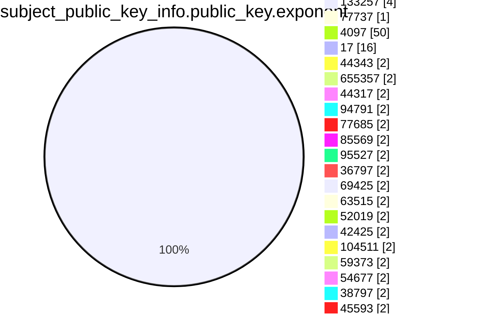
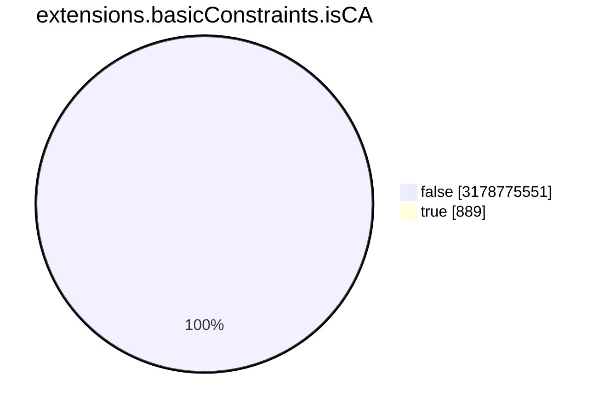
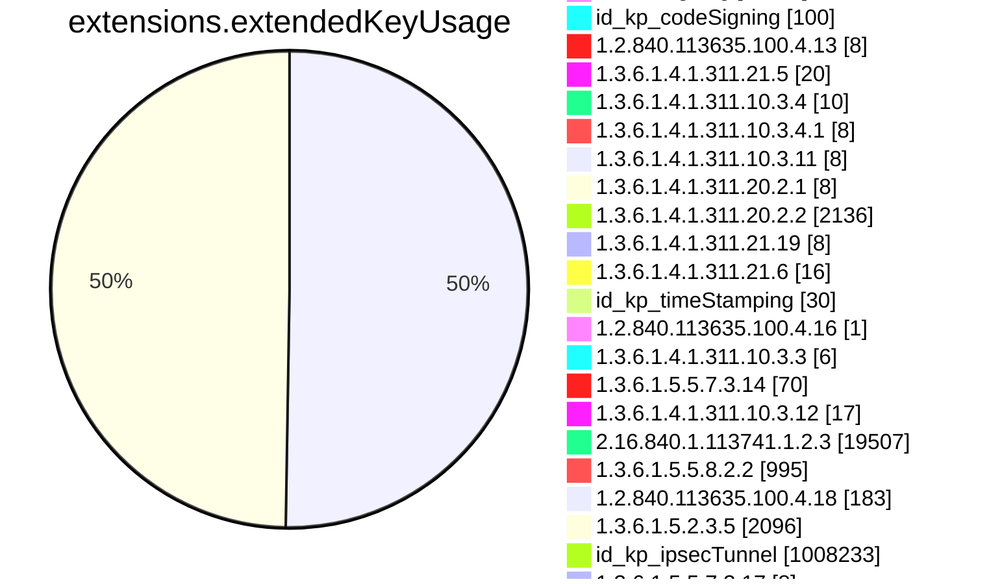
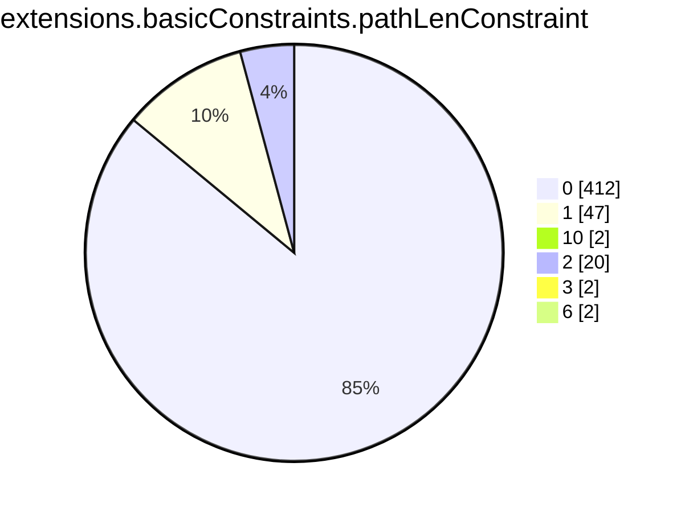
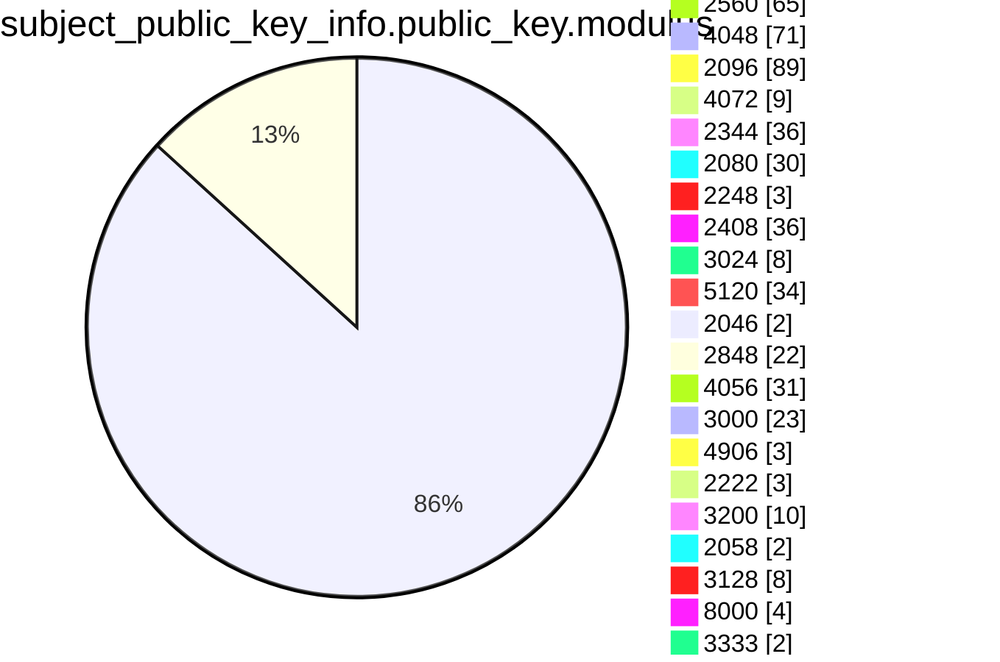

```mermaid
pie showData
title subject.cn.tld
"tw" :2805140
"si" :1469508
"com" :1328564761
"in" :17646454
"IN" :462
"at" :11130573
"ru" :51830785
"br" :45775863
"org" :78287085
"net" :117988148
"jp" :16112776
"uk" :58270564
"ph" :894463
"today" :561330
"nz" :5670787
"biz" :6905364
"studio" :1127292
"us" :10001814
"ca" :19463383
"solutions" :570122
"cc" :4028905
"au" :24772157
"online" :13393955
"shop" :9101107
"domains" :180973
"media" :744829
"kr" :3580870
"finance" :395418
"mx" :7323623
"directory" :71960
"life" :3634199
"bz" :246071
"xyz" :27054676
"co" :30920779
"info" :15678084
"estate" :60575
"club" :5271799
"my" :2171029
"pg" :21524
"site" :9636307
"me" :28091183
"eu" :18523725
"cn" :14018406
"live" :3315348
"io" :60056650
"de" :106510081
"ws" :472570
"press" :107911
"center" :458148
"store" :6468778
"education" :249990
"it" :21484499
"cl" :6715693
"rocks" :868714
"xn--p1ai" :3581069
"art" :1541349
"space" :4295505
"global" :328374
"asia" :1267420
"th" :880254
"care" :253493
"hk" :1246611
"sg" :1676386
"fr" :35617138
"beer" :83236
"cloud" :7253972
"tech" :6492405
"work" :2491677
"tr" :3566284
"wedding" :154811
"healthcare" :35944
"health" :179838
"ie" :2093006
"pro" :5311733
"ltd" :586041
"dk" :8585180
"id" :9816296
"es" :10814887
"consulting" :202985
"ro" :6626333
"nl" :39674573
"vn" :5309352
"pl" :22448189
"edu" :3327328
"no" :7913519
"dev" :16920673
"se" :13137973
"tv" :2423470
"mobi" :776482
"gov" :520562
"il" :3004313
"be" :13684199
"su" :1246438
"cz" :12562611
"world" :1136145
"click" :948906
"uno" :206977
"community" :147789
"faith" :31463
"pt" :3853751
"city" :448760
"za" :14100537
"aero" :213010
"lv" :1132641
"lu" :739179
"amsterdam" :191648
"company" :476090
"lundbeck" :10
"gs" :55065
"events" :236165
"gal" :46919
"wine" :88235
"army" :32656
"expert" :233663
"ch" :25784230
"bzh" :102910
"exchange" :104295
"farm" :167361
"coop" :165046
"app" :9161760
"support" :209844
"team" :791505
"uy" :548381
"london" :182949
"design" :1347728
"business" :205876
"gl" :52627
"sv" :64243
"lk" :499521
"xn--80asehdb" :19583
"hu" :8854155
"ai" :1840753
"ac" :124681
"cyou" :480474
"pet" :72375
"cy" :165946
"travel" :190943
"agency" :959410
"direct" :8909630
"int" :34961
"capital" :154063
"law" :94904
"ae" :862237
"py" :292170
"digital" :1591292
"bmw" :23126
"cards" :57783
"reit" :201
"church" :347711
"energy" :125794
"ar" :6530962
"la" :455198
"bet" :210756
"cr" :175280
"pub" :170280
"bank" :50898
"xn--80aswg" :14613
"pw" :1704479
"is" :949933
"tj" :40892
"moscow" :118689
"ag" :165277
"jobs" :71502
"COM" :40773
"marketing" :201435
"academy" :385642
"bm" :26642
"social" :241834
"ci" :133536
"solar" :68162
"ad" :14855
"love" :239167
"re" :359919
"ni" :25130
"school" :210020
"gr" :5392201
"systems" :571288
"software" :213223
"gt" :198531
"gg" :546153
"group" :801019
"fun" :2310654
"aw" :3817
"best" :392228
"land" :168488
"fit" :314060
"tokyo" :821581
"pe" :1339054
"ec" :487170
"photography" :397617
"games" :346258
"eco" :68606
"link" :3458207
"Nu" :4
"tools" :401898
"nyc" :335078
"je" :52442
"website" :2131124
"construction" :42530
"fi" :7396910
"rs" :1613356
"rip" :90070
"vision" :85704
"am" :287749
"mn" :202733
"kh" :41299
"plus" :411132
"kim" :62304
"bn" :7763
"coffee" :165510
"plumbing" :10565
"rentals" :61868
"cool" :287899
"guide" :99630
"BZ" :36
"blog" :1069188
"xn--p1acf" :119549
"om" :30315
"quebec" :31777
"kw" :26943
"cba" :1082
"jo" :28600
"sa" :540704
"network" :765858
"fitness" :83297
"bh" :19332
"icu" :906331
"sk" :3252025
"vip" :2901008
"gallery" :143846
"mo" :19356
"ua" :8512347
"email" :492395
"kpn" :279
"ke" :1157964
"gh" :69533
"management" :66392
"nu" :1657534
"fj" :18766
"Com" :682
"eg" :61084
"gi" :11948
"koeln" :80131
"saxo" :257
"video" :225715
"ee" :2047587
"bg" :964642
"pk" :1242169
"scot" :74275
"hr" :1198121
"green" :101438
"uz" :646308
"gmo" :139
"qa" :112514
"vegas" :37808
"ntt" :1520
"clinic" :92549
"kz" :2064566
"miami" :49896
"cymru" :32727
"st" :250241
"one" :1345479
"red" :197172
"ng" :1697492
"ma" :827210
"ve" :171534
"bo" :159455
"dog" :96438
"tz" :303571
"bd" :293940
"services" :459910
"DE" :625
"accountants" :7014
"mv" :43504
"photo" :219453
"mc" :31679
"delivery" :78245
"lt" :1628831
"mu" :83147
"hn" :51222
"tt" :22890
"canon" :1219
"repair" :33230
"news" :465303
"llc" :95000
"BR" :258
"fm" :200089
"training" :121397
"berlin" :187513
"theater" :9016
"do" :276495
"museum" :7784
"ao" :92106
"ps" :67773
"auction" :22928
"ooo" :111973
"legal" :97501
"to" :45413420
"vc" :338256
"graphics" :46395
"ist" :37420
"zone" :616330
"okinawa" :36176
"technology" :201154
"jewelry" :28294
"AU" :876
"black" :48986
"fund" :242336
"xn--3e0b707e" :5346
"top" :6514553
"bio" :164198
"inc" :29569
"JP" :522
"paris" :100159
"study" :68870
"bw" :63861
"ryukyu" :3316
"racing" :18878
"page" :3219599
"help" :174385
"taxi" :50724
"yokohama" :27007
"ge" :415008
"house" :180171
"villas" :7924
"by" :1654833
"ba" :284268
"eus" :120690
"clothing" :59399
"place" :73109
"trade" :142077
"va" :208
"supply" :40785
"cat" :767057
"yoga" :89710
"li" :523450
"HK" :186
"market" :202278
"hsbc" :139
"audio" :32896
"as" :107986
"mz" :90328
"az" :323230
"movie" :14340
"so" :264651
"bi" :33854
"zw" :243420
"earth" :154215
"cw" :6984
"xn--80adxhks" :45681
"ventures" :84906
"apple" :193
"al" :238775
"gmbh" :118427
"name" :701707
"MY" :62
"GOV" :2050
"tours" :61699
"express" :63263
"jll" :66
"works" :313909
"cab" :22684
"jm" :13147
"boutique" :122477
"guru" :416716
"band" :117176
"host" :706654
"dental" :46795
"tc" :42062
"build" :84498
"watch" :95735
"pa" :70535
"win" :781548
"mk" :295387
"ORG" :2624
"toys" :33583
"cd" :21939
"bayern" :94416
"onl" :81244
"menu" :65503
"ml" :2576804
"pics" :48982
"money" :119150
"yt" :40139
"foundation" :118626
"immo" :88650
"alsace" :13176
"enterprises" :28177
"ninja" :477518
"blue" :180948
"pizza" :67556
"tk" :3543433
"bar" :211792
"codes" :224635
"gift" :37430
"ga" :1624099
"markets" :10296
"woodside" :1243
"credit" :33517
"ceo" :133166
"wtf" :293182
"sh" :609754
"aws" :12146
"kg" :134982
"sarl" :10390
"holdings" :28438
"run" :2781583
"im" :463378
"report" :70281
"cm" :194679
"rugby" :2639
"fail" :28180
"fashion" :80793
"BIZ" :161
"cf" :1535242
"gy" :32650
"hamburg" :57090
"ovh" :1084858
"football" :25818
"beauty" :47976
"buzz" :883896
"kyoto" :11114
"statefarm" :24121
"et" :37563
"limited" :34319
"men" :83923
"vet" :73848
"cash" :144784
"science" :106530
"mm" :47438
"mt" :104589
"pictet" :765
"partners" :68017
"audi" :4090
"ms" :109746
"ly" :250745
"international" :97881
"engineering" :91930
"coach" :132352
"infiniti" :74
"gq" :797459
"film" :47491
"lol" :181855
"homes" :70749
"vlaanderen" :38258
"iq" :40285
"tax" :54885
"sx" :32377
"rest" :135848
"fyi" :146042
"man" :1785
"africa" :243581
"tn" :290576
"gold" :209213
"surf" :97096
"ink" :317612
"cam" :158180
"md" :468098
"pr" :10585
"xxx" :62310
"stream" :139392
"amazon" :84
"contact" :39511
"party" :164111
"lc" :37020
"ht" :27051
"careers" :42028
"lb" :26690
"archi" :26565
"dating" :31172
"ky" :38010
"lawyer" :22318
"wien" :75804
"xn--tckwe" :7896
"limo" :7358
"computer" :40391
"nagoya" :31513
"recipes" :20274
"reisen" :16483
"moe" :200273
"show" :157065
"monster" :411200
"lgbt" :22543
"mil" :13859
"realty" :318960
"sport" :7304
"casa" :1566419
"bj" :30827
"tienda" :15670
"np" :527991
"haus" :57367
"bt" :22259
"swiss" :160998
"brussels" :50398
"bbva" :60
"financial" :44264
"bike" :100865
"wales" :55128
"sb" :9925
"cx" :191848
"dance" :66916
"glass" :19596
"radio" :17147
"lat" :41777
"cooking" :12262
"wiki" :163187
"download" :61567
"tf" :60519
"tui" :565
"insure" :30437
"pink" :57425
"sc" :54115
"security" :7171
"deals" :50719
"style" :105421
"vg" :20901
"parts" :27260
"tube" :32379
"forum" :1867
"xn--90ais" :68139
"productions" :69965
"properties" :62830
"realestate" :41015
"reviews" :82129
"car" :2481
"chat" :213540
"shoes" :20156
"tel" :153274
"kpmg" :71
"vote" :25760
"rent" :42920
"fish" :44386
"quest" :153802
"melbourne" :30708
"wang" :109261
"mba" :28796
"sap" :61579
"ax" :54856
"camera" :17901
"kiwi" :62783
"ug" :98896
"loan" :30951
"investments" :21673
"bingo" :10588
"cpa" :16760
"ki" :4345
"INT" :18
"luxe" :6929
"sm" :16790
"family" :213228
"fan" :32761
"game" :29812
"attorney" :9536
"golf" :65741
"gd" :112400
"CL" :80
"bid" :104618
"sn" :71466
"NET" :3494
"dealer" :321
"fo" :62201
"schule" :43064
"holiday" :19633
"casino" :69695
"contractors" :11005
"sr" :18545
"town" :49786
"ruhr" :26023
"institute" :68917
"organic" :11826
"sale" :120272
"fox" :1805
"cafe" :190688
"adult" :4867
"corsica" :13756
"lighting" :23354
"tm" :19655
"voyage" :14620
"weir" :2808
"xn--fiqs8s" :12638
"ne" :6361
"salon" :35430
"hosting" :109129
"poker" :17984
"xn--mgbaam7a8h" :85
"tips" :103193
"pf" :20598
"xin" :43324
"auspost" :503
"na" :97598
"auto" :7122
"moda" :50933
"af" :46897
"nrw" :62491
"PRO" :4
"QA" :84
"NO" :44
"fans" :35418
"UK" :757
"garden" :29693
"pictures" :67868
"bs" :8118
"SE" :125
"flowers" :9253
"zm" :37958
"loans" :18888
"mortgage" :15291
"frl" :62343
"accountant" :6818
"Org" :83
"nc" :85077
"pm" :98551
"xn--ses554g" :774
"restaurant" :40973
"university" :44937
"srl" :77322
"gifts" :36941
"charity" :12298
"dz" :132056
"vi" :2898
"abbott" :2981
"ikano" :693
"photos" :153464
"rw" :99287
"tirol" :55390
"brother" :187
"sz" :11313
"camp" :64920
"clubmed" :1422
"saarland" :17404
"nr" :598
"ngo" :33824
"dentist" :9916
"irish" :20907
"krd" :10188
"promo" :55244
"discount" :9805
"EDU" :1269
"CA" :1627
"actor" :13510
"baby" :25461
"toyota" :343
"tl" :21155
"viajes" :6714
"boston" :9878
"tatar" :4965
"kitchen" :49967
"vin" :34737
"christmas" :6563
"trading" :11230
"review" :102698
"ski" :36162
"navy" :10423
"pharmacy" :1764
"xn--j1amh" :34252
"autos" :19866
"teva" :427
"gives" :13923
"vacations" :11971
"florist" :47586
"tg" :24338
"cleaning" :17483
"doctor" :44639
"suzuki" :200
"porn" :14540
"new" :20753
"gay" :176324
"webcam" :14405
"SA" :194
"KW" :34
"xn--kpry57d" :1800
"ricoh" :577
"afl" :354
"sbi" :589
"sky" :2058
"mw" :15072
"xn--d1acj3b" :4973
"AR" :70
"CN" :57
"NL" :246
"wf" :38176
"bot" :17968
"sexy" :23789
"mg" :68948
"ren" :50101
"physio" :10203
"vu" :163586
"mp" :8433
"cg" :9565
"ls" :16914
"bb" :6973
"hair" :16479
"IT" :206
"Gov" :112
"sncf" :559
"neustar" :1018
"builders" :41976
"cricket" :9330
"pfizer" :136
"sydney" :26953
"associates" :18832
"college" :18677
"US" :411
"fk" :649
"godaddy" :200
"jcb" :89
"abb" :2474
"gn" :3624
"soccer" :12801
"ck" :3605
"globo" :2376
"nissan" :83
"horse" :28139
"xn--mgberp4a5d4ar" :716
"soy" :12199
"xn--c1avg" :3009
"how" :26129
"dm" :4626
"cbs" :53
"date" :44957
"kn" :2970
"diamonds" :9898
"shopping" :43082
"nikon" :4
"rehab" :12601
"temasek" :48
"barcelona" :19053
"skin" :16216
"observer" :9632
"lamborghini" :478
"tickets" :1741
"sony" :100
"gm" :11308
"immobilien" :17807
"jetzt" :65513
"reise" :3122
"kaufen" :16060
"tennis" :8679
"singles" :12889
"xn--mk1bu44c" :3032
"tatamotors" :94
"itau" :160
"SG" :401
"hiphop" :1886
"gp" :9893
"tires" :5673
"ye" :5781
"total" :1000
"EU" :187
"barclaycard" :275
"barclays" :1093
"property" :11827
"bnpparibas" :2198
"surgery" :10668
"cv" :25027
"engineer" :40134
"exposed" :12328
"xn--90ae" :6822
"catering" :14719
"MX" :75
"vodka" :6782
"hermes" :411
"taipei" :8484
"ong" :10472
"cologne" :13856
"km" :984
"gratis" :21649
"JM" :4
"claims" :12303
"gucci" :155
"bridgestone" :318
"versicherung" :3476
"istanbul" :17290
"playstation" :37
"goog" :341153
"xn--qxa6a" :252
"xn--e1a4c" :1922
"dj" :16964
"equipment" :13689
"fishing" :7194
"republican" :4364
"industries" :34957
"xn--q9jyb4c" :4503
"Lighting" :2
"SALE" :7
"condos" :9105
"nike" :847
"futbol" :10512
"gop" :6284
"honda" :125
"realtor" :100220
"hospital" :6094
"cfd" :102329
"gdn" :12018
"ONLINE" :12
"sl" :9933
"courses" :18762
"madrid" :7775
"xn--9dbq2a" :1967
"forsale" :22461
"mq" :2913
"AE" :138
"dvag" :12358
"RU" :82
"EMAIL" :7
"supplies" :15423
"apartments" :19732
"PH" :77
"compare" :1374
"xn--h2brj9c" :1758
"desi" :7252
"orange" :3529
"country" :5803
"cheap" :17783
"TR" :14
"dhl" :603
"hockey" :6627
"sex" :15361
"democrat" :4570
"blackfriday" :1488
"sucks" :2051
"diet" :4165
"degree" :3543
"xn--fiq228c5hs" :216
"lease" :10974
"osaka" :6198
"sakura" :30
"capetown" :22339
"bargains" :7474
"joburg" :13501
"xn--ngbc5azd" :658
"flights" :9095
"xn--6qq986b3xl" :9943
"durban" :8421
"sbs" :166156
"rodeo" :13744
"bond" :88220
"cruises" :5042
"mango" :133
"mom" :18172
"coupons" :9958
"abogado" :1653
"xn--qxam" :5750
"vanguard" :317
"tattoo" :41050
"xn--j6w193g" :5833
"airforce" :3662
"gf" :2762
"nf" :59320
"forex" :2479
"sd" :52280
"memorial" :5568
"creditcard" :5170
"broker" :6710
"crs" :3575
"jnj" :2269
"citic" :246
"boats" :4251
"PT" :20
"aeg" :5
"leclerc" :3102
"trust" :30
"ir" :5844316
"LONDON" :6
"lidl" :556
"ltda" :2661
"bf" :14794
"luxury" :6113
"Dk" :4
"insurance" :2005
"furniture" :18240
"yachts" :3619
"next" :998
"sandvik" :400
"Clinic" :2
"basketball" :3248
"Edu" :32
"hiv" :677
"genting" :30
"pioneer" :77
"DK" :277
"OM" :8
"post" :782
"CO" :66
"aquarelle" :92
"makeup" :10192
"Biz" :145
"FR" :151
"schwarz" :3315
"day" :29532
"mr" :9535
"bible" :24715
"NETWORK" :16
"monash" :319
"abudhabi" :1199
"RENTALS" :3
"gent" :53740
"shiksha" :2745
"ES" :320
"hm" :4440
"香港" :24
"maison" :6475
"moi" :478
"xn--6frz82g" :6152
"career" :4355
"jpmorgan" :4
"sy" :21927
"CBA" :48
"toray" :245
"xn--czrs0t" :191
"uol" :183
"td" :5071
"juegos" :995
"bradesco" :581
"storage" :2356
"williamhill" :22
"TH" :83
"scb" :135
"guitars" :2197
"Be" :4
"rich" :1098
"xn--g2xx48c" :101
"Net" :75
"xn--mgbab2bd" :186
"xn--rhqv96g" :517
"select" :739
"erni" :110
"gripe" :1380
"sharp" :552
"CZ" :29
"schaeffler" :2356
"komatsu" :663
"anz" :343
"cars" :2596
"ZA" :120
"FI" :112
"BE" :106
"IE" :58
"philips" :15
"ismaili" :176
"schmidt" :231
"xn--o3cw4h" :1682
"KE" :23
"deloitte" :211
"IO" :35
"showtime" :7
"Co" :2
"nab" :8
"sener" :113
"BANK" :15
"abc" :101
"xn--czr694b" :291
"Za" :8
"HR" :54
"lotto" :212
"CM" :6
"theatre" :159
"uK" :15
"TW" :261
"praxi" :6
"xn--io0a7i" :1113
"lr" :4192
"BH" :22
"MU" :10
"RE" :2
"xn--t60b56a" :396
"IL" :46
"DZ" :14
"EC" :12
"COMPANY" :9
"xn--vhquv" :95
"vig" :778
"cfa" :54
"CLOUD" :12
"voto" :1668
"pn" :1790
"aq" :1134
"ss" :1958
"lilly" :59
"azure" :191
"SI" :16
"jio" :53
"RO" :166
"GR" :113
"ID" :45
"voting" :249
"motorcycles" :2562
"axa" :243
"seat" :576
"rio" :9726
"sanofi" :242
"nico" :148
"ipiranga" :40
"xn--3ds443g" :330
"CAFE" :3
"xn--node" :670
"xn--vuq861b" :143
"kred" :1114969
"zuerich" :3293
"shell" :1779
"MD" :4
"NZ" :77
"microsoft" :52
"PY" :12
"xn--3hcrj9c" :89
"xn--90a3ac" :5348
"lego" :100
"goo" :51
"MIL" :51
"City" :18
"fresenius" :22
"xn--fiqz9s" :875
"ifm" :1096
"linde" :11
"cisco" :31
"aaa" :22
"TV" :12
"med" :314
"VN" :33
"smart" :44
"xn--y9a3aq" :2478
"mma" :76
"xn--otu796d" :76
"xn--czru2d" :102
"cuisinella" :46
"EG" :2
"PL" :17
"aig" :29
"panasonic" :51
"cu" :56336
"weber" :1395
"xn--55qx5d" :12024
"In" :8
"MO" :6
"ubs" :4
"NU" :2
"AG" :29
"xn--kput3i" :6154
"itv" :30
"flir" :51
"fage" :101
"mh" :75
"ET" :32
"yandex" :544
"protection" :110
"Zone" :8
"Asia" :8
"CH" :50
"LB" :39
"gw" :6178
"AO" :57
"stockholm" :65
"otsuka" :66
"SBI" :30
"MOBI" :23
"creditunion" :195
"Fr" :44
"ASIA" :24
"ericsson" :13
"kfh" :20
"amex" :4
"BRADESCO" :34
"xn--rvc1e0am3e" :66
"Live" :10
"hisamitsu" :467
"CI" :2
"natura" :13
"xn--54b7fta0cc" :709
"locus" :263
"LAW" :6
"xn--rovu88b" :6
"xn--1ck2e1b" :4
"xn--eckvdtc9d" :4
"qpon" :826
"imdb" :4
"free" :4
"read" :4
"tushu" :4
"xn--jlq480n2rg" :4
"silk" :4
"CD" :4
"LTD" :4
"BS" :2
"BM" :4
"bbc" :53
"edeka" :824
"airbus" :16
"chase" :10
"MADRID" :2
"call" :4
"audible" :4
"xn--unup4y" :103
"AT" :16
"COOP" :10
"NAME" :2
"bauhaus" :267
"WORLD" :4
"EUS" :6
"xn--5tzm5g" :925
"dubai" :59
"adac" :2
"INFO" :31
"arab" :4
"politie" :310
"NYC" :2
"jaguar" :5
"landrover" :5
"sew" :42
"lincoln" :4
"statebank" :70
"lanxess" :56
"TOP" :2
"nec" :64
"WS" :21
"rwe" :8
"DIGITAL" :20
"toshiba" :78
"xn--nqv7f" :210
"jprs" :41
"PE" :20
"frogans" :25
"SZ" :2
"Solutions" :6
"HU" :15
"LA" :14
"xn--fjq720a" :95
"ACADEMY" :8
"farmers" :8
"xfinity" :9
"comcast" :9
"ZM" :6
"TECH" :24
"FARM" :4
"XYZ" :84
"channel" :461
"Software" :4
"xn--2scrj9c" :155
"mutual" :9
"northwesternmutual" :4
"Tech" :3
"CLUB" :16
"JO" :36
"xn--xhq521b" :201
"bosch" :3
"samsung" :6
"nowruz" :83
"xn--hxt814e" :210
"xn--mgbca7dzdo" :6
"booking" :4
"dupont" :12
"CAT" :2
"extraspace" :62
"gu" :311
"MZ" :12
"aco" :1595
"redumbrella" :3
"travelers" :3
"travelersinsurance" :3
"trv" :3
"KR" :10
"BW" :4
"CR" :6
"Bid" :8
"mattel" :900
"HOUSE" :3
"bentley" :51
"xn--wgbh1c" :46
"guardian" :12
"APP" :4
"xn--zfr164b" :14
"xn--imr513n" :6
"LT" :8
"xn--s9brj9c" :107
"mini" :67
"xn--h2breg3eve" :129
"arpa" :12
"AERO" :7
"xn--xkc2dl3a5ee0h" :597
"analytics" :10
"Bank" :12
"Video" :4
"xn--gecrj9c" :105
"foo" :281
"KZ" :6
"Dog" :6
"gea" :140
"Info" :2
"GT" :2
"Uk" :12
"hyundai" :54
"Dev" :4
"xn--45brj9c" :377
"mit" :11
"amica" :4
"Land" :3
"AM" :6
"bms" :4
"xn--fpcrj9c3d" :104
"MT" :44
"RW" :6
"PF" :4
"broadway" :72
"WEIR" :2
"MA" :38
"Eu" :2
"ANZ" :12
"LIFE" :10
"UG" :5
"google" :53826
"ice" :10
"ZONE" :4
"xn--d1alf" :251
"Us" :2
"jmp" :10
"nra" :22
"accenture" :4
"FOX" :5
"bloomberg" :10
"msd" :2
"PK" :5
"icbc" :2
"GG" :16
"sas" :6
"mtr" :5
"UA" :4
"SINGLES" :4
"GL" :6
"KY" :2
"chintai" :26
"feedback" :1642
"zara" :18
"WORK" :4
"BN" :18
"RS" :4
"ME" :18
"DO" :14
"CC" :7
"SK" :7
"Mil" :2
"Store" :2
"COm" :2
"CY" :6
"tW" :2
"Ca" :4
"xbox" :8
"bing" :8
"windows" :8
"hotmail" :8
"skype" :8
"office" :8
"allfinanz" :421
"Social" :8
"GH" :4
"NG" :4
"NA" :2
"cern" :76
"HOST" :14
"ABUDHABI" :2
"VIP" :6
"crown" :3
"bR" :2
"SAP" :2
"bcn" :54
"IS" :2
"softbank" :101
"Global" :4
"STUDIO" :4
"SPACE" :8
"XN--P1AI" :28
"BO" :2
"coM" :4
"IQ" :4
"Health" :6
"EE" :2
"xn--fct429k" :2
"GAL" :2
"xn--ngbrx" :3
"La" :2
"cN" :2
"AI" :14
"xn--80ao21a" :661
"BG" :2
"kinder" :15
"walter" :4
"AF" :4
"SITE" :2
"GLOBAL" :5
"NTT" :6
"Online" :8
"hitachi" :75
"SL" :12
"QUEST" :4
"deV" :2
"ford" :4
"able" :8
"STORE" :2
"youtube" :499
"meet" :93
"ECO" :2
"beats" :6
"xn--mgbbh1a71e" :93
"xn--1qqw23a" :10897
"xn--i1b6b1a6a2e" :123
"ggee" :46
"tvs" :46
"xn--pgbs0dh" :24
"chrome" :22
"bugatti" :84
"bostik" :538
"firmdale" :1551
"maif" :246
"gle" :116
"TM" :2
"xn--mgbah1a3hjkrd" :45
"xn--gckr3f0f" :63
"vivo" :54
"xn--nqv7fs00ema" :27
"xn--mix891f" :27
"kosher" :18
"pru" :42
"stc" :46
"One" :3
"xn--ygbi2ammx" :23
"xn--mgbayh7gpa" :164
"mlb" :38
"vuelos" :17
"eurovision" :19
"alstom" :16
"TC" :2
"ieee" :14
"hoteles" :18
"Systems" :8
"wme" :18
"passagens" :18
"omega" :32
"ses" :2
"stada" :215
"SCOT" :8
"xn--4gbrim" :54
"netflix" :21
"CITY" :2
"Show" :2
"xn--mgba3a4f16a" :121
"redstone" :3
"lacaixa" :17
"swatch" :6
"whoswho" :40
"MR" :4
"epson" :47
"yodobashi" :45
"lixil" :30
"mitsubishi" :46
"Cloud" :6
"fujitsu" :49
"dnp" :46
"datsun" :48
"goldpoint" :46
"nhk" :47
"lotte" :49
"kddi" :43
"kia" :50
"arte" :113
"xn--fzc2c9e2c" :44
"dabur" :45
"fairwinds" :70
"firestone" :30
"lexus" :35
"INDUSTRIES" :3
"latrobe" :15
"citi" :15
"java" :52
"csc" :7
"cancerresearch" :16
"reliance" :32
"hdfc" :39
"ril" :34
"er" :50
"LU" :12
"Me" :4
"Space" :2
"oldnavy" :12
"rocher" :16
"athleta" :12
"helsinki" :33
"ferrero" :110
"LV" :2
"xn--45br5cyl" :13
"lplfinancial" :16
"lpl" :16
"ups" :11
"Market" :2
"GE" :3
"Academy" :20
"Jo" :2
"shia" :9
"pars" :9
"tci" :9
"TOKYO" :2
"abbvie" :57
"xn--mgbgu82a" :16
"xn--wgbl6a" :16
"gap" :10
"lancaster" :5
"xn--l1acc" :8
"bananarepublic" :9
"sandvikcoromant" :2
"xn--mgbbh1a" :4
"imamat" :2
"caravan" :4
"xn--kprw13d" :4
"xn--mgbpl2fh" :21
"sfr" :1
"Photography" :2
"KH" :25
"рф" :1
"goV" :1
"xn--3bst00m" :2
"ally" :4
"TT" :1
"xerox" :2
"CRS" :1
"Pro" :2
"DEV" :1
"Loan" :4
"Healthcare" :1
"ML" :12
"Tk" :16
"watches" :4
"xn--ogbpf8fl" :130
"safety" :4
"grainger" :2
"TK" :34
"Ltd" :140
"xn--clchc0ea0b2g2a9gcd" :8
"xn--q7ce6a" :12
"xn--mgbcpq6gpa1a" :6
"xyZ" :4
"XN--5TZM5G" :8
"SCIENCE" :10
"xn--mgbai9azgqp6j" :4
"cLub" :4
"LI" :6
"goodyear" :2
"dunlop" :2
"Xyz" :2
"MONSTER" :10
"KG" :2
"CF" :10
"CLICK" :2
"SHOP" :2
```

```mermaid
pie showData
title issuer
"Google UK Ltd." :132770
"STRAC" :2
"Foundation for Trusted Identity" :2
"TSCP Inc." :3
"Cisco Systems" :2312
"行政院" :12
"KPN B.V." :2
"Actalis S.p.A.-03358520967" :2
"U.S. Government" :19
"CertiPath" :4
"WidePoint" :1
"A-Trust Ges. f. Sicherheitssysteme im elektr. Datenverkehr GmbH" :12
"AC Camerfirma S.A." :402
"ICP-Brasil" :6
"VeriSign, Inc." :19
"行政院" :44
"Baltimore" :32
"U.S. Government" :3
"Microsoft Corporation" :2
"VeriSign, Inc." :49
"A-Trust Ges. f. Sicherheitssysteme im elektr. Datenverkehr GmbH" :10
"FNMT-RCM" :8
"VeriSign, Inc." :6
"AC CAMERFIRMA S.A." :6
"VeriSign, Inc." :4
"Colegio de Registradores de la Propiedad y Mercantiles de España" :4
"thawte, Inc." :4
"行政院" :4
"DigiCert Inc" :10
"Hellenic Academic and Research Institutions Cert. Authority" :10
"Republika Slovenija" :4
"Elektronik Bilgi Guvenligi A.S." :4
"MULTICERT - Serviços de Certificação Electrónica S.A." :2
"E-Tuğra EBG Bilişim Teknolojileri ve Hizmetleri A.Ş." :10
"GeoTrust Inc." :4
"Hellenic Academic and Research Institutions Cert. Authority" :45
"Atos" :14
"Apple Inc." :117
"Apple Inc." :57
"SAFE-Biopharma" :2
"QuoVadis Limited" :10
"Apple Inc." :29
"POSTA" :6
"Secretaria de Economia" :6
"TÜRKTRUST Bilgi İletişim ve Bilişim Güvenliği Hizmetleri A.Ş." :4
"Elektronik Bilgi Guvenligi A.S." :2
"LAWtrust" :6
"AC Camerfirma SA" :2
"SwissSign AG" :2
"British Telecommunications plc" :12
"SAFE Identity" :2
"Certinomis" :2
"HydrantID (Avalanche Cloud Corporation)" :2
"QuoVadis Limited" :12
"GlobalSign" :2
"GlobalSign nv-sa" :5
"Institute for Development and Research in Banking Technology" :103
"U.S. Government" :3
"Actalis S.p.A." :6
"Symantec Corporation" :10
"Trustwave Holdings, Inc." :3
"Apple Inc." :49
"Sectigo Limited" :2
"GlobalSign nv-sa" :12
"WoSign CA Limited" :6
"VeriSign, Inc." :2
"Japanese Government" :2
"Unizeto Technologies S.A." :4
"ANF Autoridad de Certificacion" :4
"SwissSign AG" :2
"Google UK Ltd." :197103
"Hongkong Post" :10
"Vaestorekisterikeskus CA" :4
"QuoVadis Limited" :8
"certSIGN" :4
"DigiCert Inc" :4
"e-commerce monitoring GmbH" :10
"ICP-Brasil" :10
"DigiCert Inc" :4
"MINISTERE INTERIEUR" :2
"DigiCert Inc" :2
"Government Root Certification Authority" :2
"Open Access Technology International Inc" :2
"SECOM Trust Systems CO.,LTD." :10
"E-Tuğra EBG Bilişim Teknolojileri ve Hizmetleri A.Ş." :102
"Elektronik Bilgi Guvenligi A.S." :2
"行政院" :225
"ICP-Brasil" :2
"TÜRKTRUST Bilgi İletişim ve Bilişim Güvenliği Hizmetleri A.Ş." :4
"VeriSign, Inc." :8
"Apple Inc." :47
"Orion Health Inc." :4
"DigiCert Inc" :2
"ACNLB" :2
"QuoVadis Limited" :54234
"Apple Inc." :47
"The USERTRUST Network" :2
"GlobalSign nv-sa" :8
"GAD EG" :4
"VeriSign, Inc." :6
"NISZ Nemzeti Infokommunikációs Szolgáltató Zrt." :24
"QuoVadis Limited" :10
"SECOM Trust.net" :17
"Turkiye Bilimsel ve Teknolojik Arastirma Kurumu - TUBITAK" :2
"SwissSign AG" :5
"Verizon Business" :2
"ICP-Brasil" :2
"Symantec Corporation" :2
"SwissSign AG" :3
"Apple Inc." :2
"GoDaddy.com, Inc." :10261166
"GlobalSign nv-sa" :1201079
"GlobalSign nv-sa" :491962
"GlobalSign nv-sa" :1944773
"Starfield Technologies, Inc." :1163576
"GlobalSign nv-sa" :664054
"GlobalSign nv-sa" :76809
"GlobalSign nv-sa" :52974
"GlobalSign nv-sa" :87378
"Česká pošta, s.p." :3313
"Rede Nacional de Ensino e Pesquisa - RNP" :19552
"GlobalSign nv-sa" :400
"VALID CERTIFICADORA DIGITAL" :1490
"SOLUTI - SOLUCOES EM NEGOCIOS INTELIGENTES S-A" :96
"ATT Services Inc" :26968
"DigiCert Inc" :1757114
"Sectigo Limited" :94527996
"Internet2" :1335648
"SecureCore" :74553
"SECOM Trust Systems CO.,LTD." :85574
"DigiCert Inc" :7775763
"Network Solutions L.L.C." :323814
"DigiCert Inc" :548711
"GoGetSSL" :555158
"SSL Corporation" :300881
"The USERTRUST Network" :193457
"Sectigo Limited" :2486635
"Government of Korea" :2487
"DigiCert Inc" :25889
"DigiCert Inc" :628684
"DigiCert Inc" :2454399
"DigiCert Inc" :410230
"DigiCert Inc" :39522354
"SECOM Trust Systems CO.,LTD." :86226
"DigiCert Inc" :10882
"DigiCert Inc" :974
"DigiCert Inc" :51603
"DigiCert Inc" :89528
"DigiCert Inc" :114965
"UniTrust" :3146
"FUJIFILM" :872
"DigiCert Inc" :2269
"DigiCert Inc" :75284461
"Trust Provider B.V." :71774
"The Trustico Group Ltd" :35718
"DigiCert Inc" :287834
"DigiCert Inc" :7771
"GlobalSign nv-sa" :5247
"SecureCore" :3023
"Aetna Inc" :43409
"DigiCert Inc" :195273
"TrustAsia Technologies, Inc." :3402
"Technische Universitaet Dresden" :3424
"COMODO CA Limited" :764677
"Verein zur Foerderung eines Deutschen Forschungsnetzes e. V." :242203
"EUNETIC GmbH" :23211
"DigiCert Inc" :1265849
"Soluciones Corporativas IP, SL" :118431
"DigiCert Inc" :51569
"Fraunhofer" :19073
"Alpiro s.r.o." :29381
"DigiCert Inc" :680
"Sectigo Limited" :2110
"Network Solutions L.L.C." :91434
"DigiCert Inc" :8713
"DigiCert Inc" :1094
"DigiCert Inc" :8538
"Technische Universitaet Ilmenau" :1076
"DigiCert Inc" :696494
"Karlsruhe Institute of Technology" :5476
"DigiCert Inc" :26049
"Microsec Ltd." :1980
"Gandi" :1645144
"TBS INTERNET" :15890
"Siemens" :4
"Corporation Service Company" :142041
"EUNETIC GmbH" :483
"Max-Planck-Gesellschaft" :10377
"Nijimo K.K." :3156
"DigiCert Inc" :147394
"Sectigo Limited" :23419
"The USERTRUST Network" :7013
"DigiCert Inc" :101917
"Sectigo Limited" :8342443
"Internet2" :33926
"DigiCert Inc" :2961
"GoGetSSL" :964
"Trustwave Holdings, Inc." :34944
"DigiCert Inc" :128895
"Wells Fargo & Company" :13475
"Government of the District of Columbia" :1453
"DigiCert Inc" :2959
"K Software" :1596
"DigiCert Inc" :20707
"TrustAsia Technologies, Inc." :3768758
"WoTrus CA Limited" :32058
"Apple Inc." :7809
"Cybertrust Japan Co., Ltd." :73975
"BitCert" :1543
"CrowdStrike Inc." :324
"TAIWAN-CA" :777
"Cybertrust Japan Co., Ltd." :34009
"SSL Corp" :1545
"GoGetSSL" :3793
"DigiCert Inc" :979479
"DigiCert Inc" :3290
"Deutscher Bundestag" :381
"CentralNic Luxembourg Sàrl" :32621
"IZENPE S.A." :1648
"DigiCert Inc" :4738
"Chunghwa Telecom Co., Ltd." :9915
"SECOM Trust Systems CO.,LTD." :38217
"The Trustico Group Ltd" :411
"Corporation Service Company" :415
"MarketWare - Soluções para Mercados Digitais, Lda." :1191
"VALID CERTIFICADORA DIGITAL" :216
"CERTDATA SERVICOS DE INFORMACAO LTDA" :279
"Open Access Technology International Inc" :3524
"Apple Inc." :7753
"Internet2" :17296
"Amazon" :88471772
"WoTrus CA Limited" :6374
"Disig a.s." :965
"IZENPE S.A." :747
"DHIMYOTIS" :15115
"Aristotle University of Thessaloniki" :2325
"Buypass AS-983163327" :23244
"GEANT Vereniging" :13601
"GlobalSign nv-sa" :576
"Aetna Inc" :218
"SOLUTI - SOLUCOES EM NEGOCIOS INTELIGENTES S-A" :292
"Sectigo (Europe) SL" :13
"Fresenius Kabi AG" :338
"Apple Inc." :3395
"Trustwave Holdings, Inc." :580
"Apple Inc." :3264
"TrustAsia Technologies, Inc." :56979
"OpenTrust" :2
"GeoTrust Inc." :2
"Certinomis" :2
"Certinomis" :18
"SwissSign AG" :32138
"GeoTrust Inc." :2
"SwissSign AG" :2
"SwissSign AG" :8449
"SwissSign AG" :2
"DigiCert Inc" :843
"VI Registru centras - i.k. 124110246" :2
"Inera AB" :14
"Agence Nationale des Titres Sécurisés" :6
"CERTSIGN SA" :2
"CERTSIGN SA" :18
"China Financial Certification Authority" :5829
"China Financial Certification Authority" :1101
"China Financial Certification Authority" :2
"CERTSIGN SA" :2
"Netflix, Inc." :2
"Krajowa Izba Rozliczeniowa S.A." :2
"E-Tuğra EBG Bilişim Teknolojileri ve Hizmetleri A.Ş." :11034
"E-Tuğra EBG Bilişim Teknolojileri ve Hizmetleri A.Ş." :344
"Isimtescil Bilisim Anonim Sirketi" :2
"Isimtescil Bilisim Anonim Sirketi" :33674
"Krajowa Izba Rozliczeniowa S.A." :1928
"Vaestorekisterikeskus CA" :1725
"Vaestorekisterikeskus CA" :5
"Krajowa Izba Rozliczeniowa S.A." :2
"Vaestorekisterikeskus CA" :4
"E-Tuğra EBG Bilişim Teknolojileri ve Hizmetleri A.Ş." :2
"Vaestorekisterikeskus CA" :1764
"COMODO CA Limited" :18620
"Actalis S.p.A." :2466732
"RU-Center (ЗАО Региональный Сетевой Информационный Центр)" :2581
"QuoVadis Limited" :170258
"联通智慧安全科技有限公司" :90
"QuoVadis Trustlink B.V." :29565
"Buypass AS-983163327" :6507
"TeliaSonera" :24656
"CERTDATA SERVICOS DE INFORMACAO LTDA" :296
"MarketWare - Soluções para Mercados Digitais, Lda." :873
"HydrantID (Avalanche Cloud Corporation)" :1681921
"VTB BANK (PJSC)" :265
"sslTrus" :777
"Government of Korea" :332
"sslTrus" :2842
"DigiCert Inc" :802
"GlobalSign nv-sa" :10174
"DigiCert Inc" :36531
"Site Blindado S.A." :2154
"KICA" :12
"IdenTrust" :6063842
"IdenTrust" :12428
"DigiCert Inc" :220
"Corporation Service Company" :16244
"Actalis S.p.A." :24148
"SECOM Trust Systems CO.,LTD." :2257
"DigiCert Inc" :196
"Hongkong Post" :6903
"SSL.com" :769
"Microsec Ltd." :639
"TrustSign Certificadora Dig. & Soluções Segurança da Inf. Ltda." :4302
"Apple Inc." :502
"Apple Inc." :1400
"UniTrust" :2
"UniTrust" :2
"Open Access Technology International Inc" :1286
"Intesa Sanpaolo S.p.A." :9
"InfoCert S.p.A." :125
"InfoCert S.p.A." :58
"QuoVadis Limited" :6
"QuoVadis Limited" :6
"Turkiye Bilimsel ve Teknolojik Arastirma Kurumu - TUBITAK" :519
"HydrantID (Avalanche Cloud Corporation)" :2
"SwissSign AG" :44588
"NAVER BUSINESS PLATFORM Corp." :2
"SwissSign AG" :22918
"Japan Certification Services, Inc." :2
"ZETES SA (VATBE-0408425626)" :4
"QuoVadis Limited" :8
"TAIWAN-CA" :4
"TAIWAN-CA" :2
"SwissSign AG" :13980
"Baidu, Inc." :3198
"QuoVadis Trustlink B.V." :12328
"Turing Crypto GmbH" :366
"TAIWAN-CA" :124665
"Certinomis" :2
"Certinomis" :2
"SwissSign AG" :2
"Siemens" :2
"certSIGN" :2
"Vaestorekisterikeskus CA" :4
"certSIGN" :2
"Capricorn Identity Services Pvt Ltd." :2
"GAD EG" :2
"Abitab S.A." :2
"Disig a.s." :4
"Alpiro s.r.o." :128
"DigiCert Inc" :654
"SECOM Trust Systems CO.,LTD." :4648
"DigiCert Inc" :171842
"Entrust, Inc." :1403692
"WoTrus CA Limited" :236
"Sectigo Limited" :116232
"Turing Crypto GmbH" :16
"Telia Finland Oyj" :16954
"Trustwave Holdings, Inc." :2318
"TI Trust Technologies S.R.L." :6614
"SOLUTI - SOLUCOES EM NEGOCIOS INTELIGENTES S-A" :178
"VALID CERTIFICADORA DIGITAL" :326
"Trust Provider B.V." :2425
"Hellenic Academic and Research Institutions CA" :806
"Deutsche Telekom Security GmbH" :38
"Sectigo Limited" :136
"Hao Quang Viet Software Company Limited" :593
"GlobalSign nv-sa" :18109
"Digi- ja vaestotietovirasto CA" :2054
"GlobalSign nv-sa" :153
"Digi- ja vaestotietovirasto CA" :1528
"COMODO CA Limited" :4593
"Entrust, Inc." :109491
"Entrust, Inc." :5829
"DHIMYOTIS" :6196
"TBS INTERNET" :369
"DigiCert Inc" :450
"UniTrust" :398
"WoTrus CA Limited" :67
"DigiCert Inc" :52
"SECOM Trust Systems CO.,LTD." :344
"Nijimo K.K." :737
"eMudhra Technologies Limited" :13556
"DigiCert Inc" :343
"DigiCert Inc" :176
"Gandi" :2189
"Baidu, Inc." :347
"Beijing Xinchacha Credit Management Co., Ltd." :5629
"ITSO LTD" :247
"Domain The Net Technologies Ltd" :2682
"D-Trust GmbH" :42724
"DigiCert Inc" :520
"One Sign Pte. Ltd." :1743
"DigiCert Inc" :2042
"Microsoft Corporation" :4537239
"Microsoft Corporation" :4523359
"Global Digital Cybersecurity Authority Co., Ltd." :452
"Ziwit" :1156
"Entrust, Inc." :1274
"Staat der Nederlanden" :16
"T-Systems International GmbH" :42982
"DigiCert Inc" :120
"HydrantID (Avalanche Cloud Corporation)" :5016
"DigiCert Inc" :62
"DigiCert Inc" :58
"Ziwit" :38
"DigiCert Inc" :422326
"DigiCert Inc" :76
"Japan Registry Services Co., Ltd." :287269
"Cloudflare, Inc." :151561588
"Cisco Systems, Inc." :1047127
"Cloudflare, Inc." :41009056
"GEANT Vereniging" :949891
"cPanel, Inc." :113584374
"DigiCert Inc" :119500
"ZeroSSL" :15191005
"TrustCor Systems S. de R.L." :40267
"Japan Registry Services Co., Ltd." :6410
"NETLOCK Kft." :2522
"Genious Communications" :8505
"Unizeto Technologies S.A." :239138
"DOMENY.PL sp. z o.o" :35616
"swissns GmbH" :844
"McAfee, Inc." :4523
"GEANT Vereniging" :30092
"Hellenic Academic and Research Institutions Cert. Authority" :1189
"行政院" :38317
"ACCV" :3189
"WISeKey" :3581
"T-Systems International GmbH" :11227
"certSIGN" :2107
"WebSpace-Forum e.K." :62
"NetLock Kft." :1862
"Entrust Datacard Europe S.L." :239
"FNMT-RCM" :3716
"Atos" :6932
"TI Trust Technologies S.R.L." :1700
"Firmaprofesional S.A." :4528
"Financijska agencija" :1139
"LH.pl Sp. z o.o." :13373
"D-Trust GmbH" :3263
"Hellenic Academic and Research Institutions Cert. Authority" :158
"E-SAFER CONSULTORIA EM TECNOLOGIA DA INFORMACAO LTDA" :637
"cPanel, Inc." :566
"DNEncrypt, Inc" :901
"SECOM Trust Systems CO.,LTD." :15223
"SECOM Trust Systems CO.,LTD." :1488
"TrustAsia Technologies, Inc." :3275
"CerSign Technology Limited" :1186
"DigiCert Inc" :572
"eMudhra Technologies Limited" :1962
"Deutsche Post AG" :9322
"NetLock Kft." :1232
"Quantum CA Limited" :6186
"QuoVadis Trustlink B.V." :5516
"DOMENY.PL sp. z o.o" :1222
"cPanel, Inc." :693153
"Hellenic Academic and Research Institutions CA" :178
"Digital Trust L.L.C." :984
"Hellenic Academic and Research Institutions CA" :1218
"Agence Nationale de Certification Electronique" :156
"Quantum CA Limited" :50
"IdenTrust" :180
"WidePoint" :54
"Quantum CA Limited" :76
"Apple Inc." :69
"nazwa.pl sp. z o.o." :617824
"T-Systems International GmbH" :1176
"Comodo Japan, Inc." :3773
"sslTrus" :22
"Staclar, Inc." :298
"FNMT-RCM" :1740
"ICP-Brasil" :3086
"Sectigo Limited" :1244
"Microsoft Corporation" :7913277
"Microsoft Corporation" :8008651
"Anson Network Limited" :122
"Deutsche Kreditbank AG" :768
"DigiCert Inc" :756
"Netflix, Inc." :8
"home.pl S.A." :128002
"AffirmTrust" :230
"sslTrus" :3
"TrustOcean Limited" :439
"Vaestorekisterikeskus CA" :16
"DigiCert Inc" :76
"VISA" :196
"Actalis S.p.A." :2849
"Unizeto Technologies S.A." :2273
"DigiCert Inc" :158
"Hellenic Academic and Research Institutions CA" :496
"Hellenic Academic and Research Institutions CA" :98
"WoTrus CA Limited" :1016
"Hellenic Academic and Research Institutions CA" :88
"Hellenic Academic and Research Institutions CA" :46
"D-Trust GmbH" :344
"KICA" :196
"CertCloud Pte. Ltd." :46666
"eMudhra Technologies Limited" :539
"Alpiro s.r.o." :111
"TRUSTCUBES LIMITED" :28
"GlobalSign nv-sa" :57519
"certSIGN" :48
"GlobalSign nv-sa" :5522
"DigiCert Inc" :62
"GlobalSign nv-sa" :246
"ZeroSSL" :18820306
"Amazon" :6
"Amazon" :6
"Amazon" :6
"Amazon" :8
"Amazon" :7
"TrustAsia Technologies, Inc." :210
"Greek Universities Network (GUnet)" :58
"STCS" :2
"Sistema Nacional de Certificacion Electronica" :4
"Alibaba Cloud Computing Co., Ltd." :12
"A-Trust Ges. f. Sicherheitssysteme im elektr. Datenverkehr GmbH" :247
"NetLock Kft." :124
"Root Networks, LLC" :18286
"Dreamcommerce S.A." :34883
"Telia Finland Oyj" :75
"Telia Finland Oyj" :70
"Apple Inc." :228
"Microsoft Corporation" :9423312
"Microsoft Corporation" :9615511
"NETLOCK Ltd." :57
"FNMT-RCM" :332
"Microsec Ltd." :599
"TrustAsia Technologies, Inc." :30645
"TrustAsia Technologies, Inc." :2108912
"Quantum CA Limited" :1262
"Hellenic Academic and Research Institutions Cert. Authority" :114
"DigiCert, Inc." :176
"Hellenic Academic and Research Institutions CA" :222
"certSIGN" :4
"certSIGN" :4
"DigiCert, Inc." :38
"ZoTrus Technology Limited" :318
"DigiCert Inc" :12
"WebSpace-Forum e.K." :31
"Alibaba Cloud Computing Co., Ltd." :8
"Digi-Sign Limited" :486
"DigiCert, Inc." :12
"COMODO CA Limited" :45
"WISeKey" :4
"WISeKey" :4
"WISeKey" :4
"Hellenic Academic and Research Institutions CA" :92
"{'c': 'BE', 'cn': 'Citizen CA', 'serialnumber': '201409'}" :4
"{'c': 'BE', 'cn': 'Citizen CA', 'serialnumber': '201505'}" :5
"{'c': 'BE', 'cn': 'Citizen CA', 'serialnumber': '201511'}" :4
"{'c': 'BE', 'cn': 'Citizen CA', 'serialnumber': '201509'}" :4
"{'c': 'BE', 'cn': 'Citizen CA', 'serialnumber': '201503'}" :5
"{'c': 'BE', 'cn': 'Citizen CA', 'serialnumber': '201404'}" :4
"{'c': 'BE', 'cn': 'Citizen CA', 'serialnumber': '201507'}" :4
"{'c': 'BE', 'cn': 'Citizen CA', 'serialnumber': '201506'}" :4
"{'c': 'BE', 'cn': 'Citizen CA', 'serialnumber': '201632'}" :4
"{'c': 'BE', 'cn': 'Citizen CA', 'serialnumber': '201610'}" :4
"http:--repository.eid.belgium.be-" :7
"{'c': 'BE', 'cn': 'Citizen CA', 'serialnumber': '201512'}" :4
"{'c': 'BE', 'cn': 'Citizen CA', 'serialnumber': '201510'}" :4
"{'c': 'BE', 'cn': 'Citizen CA', 'serialnumber': '201606'}" :4
"{'c': 'BE', 'cn': 'Citizen CA', 'serialnumber': '201601'}" :4
"{'c': 'BE', 'cn': 'Citizen CA', 'serialnumber': '201625'}" :4
"http:--repository.eid.belgium.be-" :4
"{'c': 'BE', 'cn': 'Citizen CA', 'serialnumber': '201501'}" :5
"{'c': 'BE', 'cn': 'Citizen CA', 'serialnumber': '201406'}" :4
"http:--repository.eid.belgium.be-" :4
"{'c': 'BE', 'cn': 'Citizen CA', 'serialnumber': '201605'}" :4
"{'c': 'BE', 'cn': 'Citizen CA', 'serialnumber': '201602'}" :4
"{'c': 'BE', 'cn': 'Citizen CA', 'serialnumber': '201623'}" :4
"http:--repository.eid.belgium.be-" :4
"http:--repository.eid.belgium.be-" :4
"http:--repository.eid.belgium.be-" :4
"{'c': 'BE', 'cn': 'Citizen CA', 'serialnumber': '201628'}" :4
"{'c': 'BE', 'cn': 'Citizen CA', 'serialnumber': '201508'}" :4
"{'c': 'BE', 'cn': 'Citizen CA', 'serialnumber': '201624'}" :4
"http:--repository.eid.belgium.be-" :4
"{'c': 'BE', 'cn': 'Citizen CA', 'serialnumber': '201627'}" :4
"http:--repository.eid.belgium.be-" :4
"{'c': 'BE', 'cn': 'Foreigner CA', 'serialnumber': '201608'}" :4
"{'c': 'BE', 'cn': 'Citizen CA', 'serialnumber': '201626'}" :4
"{'c': 'BE', 'cn': 'Citizen CA', 'serialnumber': '201609'}" :4
"http:--repository.eid.belgium.be-" :4
"{'c': 'BE', 'cn': 'Citizen CA', 'serialnumber': '201403'}" :4
"{'c': 'BE', 'cn': 'Citizen CA', 'serialnumber': '201622'}" :4
"{'c': 'BE', 'cn': 'Foreigner CA', 'serialnumber': '201606'}" :5
"{'c': 'BE', 'cn': 'Citizen CA', 'serialnumber': '201604'}" :4
"{'c': 'BE', 'cn': 'Citizen CA', 'serialnumber': '201608'}" :4
"TERENA" :77090
"e-commerce monitoring GmbH" :73
"The Trustico Group Ltd" :36
"{'c': 'BE', 'cn': 'Citizen CA', 'serialnumber': '201405'}" :4
"{'c': 'BE', 'cn': 'Citizen CA', 'serialnumber': '201504'}" :4
"http:--repository.eid.belgium.be-" :4
"http:--repository.eid.belgium.be-" :4
"{'c': 'BE', 'cn': 'Citizen CA', 'serialnumber': '201408'}" :4
"{'c': 'BE', 'cn': 'Citizen CA', 'serialnumber': '201634'}" :4
"{'c': 'BE', 'cn': 'Citizen CA', 'serialnumber': '201629'}" :4
"{'c': 'BE', 'cn': 'Belgium Root CA4'}" :4
"{'c': 'BE', 'cn': 'Citizen CA', 'serialnumber': '201502'}" :4
"{'c': 'BE', 'cn': 'Citizen CA', 'serialnumber': '201621'}" :4
"{'c': 'BE', 'cn': 'Citizen CA', 'serialnumber': '201633'}" :4
"{'c': 'BE', 'cn': 'Citizen CA', 'serialnumber': '201631'}" :4
"{'c': 'BE', 'cn': 'Citizen CA', 'serialnumber': '201410'}" :4
"{'c': 'BE', 'cn': 'Citizen CA', 'serialnumber': '201603'}" :4
"TrustAsia Technologies, Inc." :1407
"Digi- ja vaestotietovirasto CA" :32
"{'c': 'BE', 'cn': 'Citizen CA', 'serialnumber': '201407'}" :4
"{'c': 'BE', 'cn': 'Citizen CA', 'serialnumber': '201607'}" :4
"{'c': 'BE', 'cn': 'Citizen CA', 'serialnumber': '201630'}" :4
"GEANT Vereniging" :16971
"GoGetSSL" :460
"GlobalSign nv-sa" :4
"TrustAsia Technologies, Inc." :87
"Global Digital Cybersecurity Authority Co., Ltd." :26
"Hellenic Academic and Research Institutions CA" :40
"QuoVadis Limited" :289
"Digital Trust L.L.C." :57
"TrustAsia Technologies, Inc." :98
"GlobalSign nv-sa" :847
"COMODO CA Limited" :13263
"Amazon" :207
"3CX" :44
"GlobalSign nv-sa" :2909
"GlobalSign nv-sa" :32
"DigiCert Inc" :3240
"DigiCert Inc" :150
"ICP-Brasil" :278
"Hellenic Academic and Research Institutions CA" :48
"Gehirn Inc." :11
"Hellenic Academic and Research Institutions CA" :6
"Hellenic Academic and Research Institutions CA" :6
"Siemens" :6
"SSL Corp" :64
"Global Digital Cybersecurity Authority Co., Ltd." :853
"DigiCert, Inc." :10
"DigiCert, Inc" :12
"DigiCert, Inc" :8
"DigiCert, Inc." :8
"DigiCert, Inc." :56
"DigiCert, Inc." :8
"DigiCert, Inc" :16
"Microsoft Corporation" :6485
"Hongkong Post" :22
"DigiCert Inc" :70
"Public Key Infrastructure Ltd" :14
"Unizeto Technologies S.A." :5114
"DigiCert, Inc." :2
"iTrusChina Co., Ltd." :3543
"DigiCert Inc" :16
"Globalsign nv-sa" :1080
"HydrantID (Avalanche Cloud Corporation)" :60503
"Microsoft Corporation" :7326
"Microsoft Corporation" :7611
"eMudhra Technologies Limited" :5
"TrustCor Systems S. de R.L." :18
"Beijing Xinchacha Credit Management Co., Ltd." :2750
"Beijing Xinchacha Credit Management Co., Ltd." :104
"iTrusChina Co., Ltd." :264
"United SSL Deutschland GmbH" :1551
"Entrust Datacard Deutschland GmbH" :15
"Hao Quang Viet Software Company Limited" :4
"DigiCert, Inc" :16
"EDICOM CAPITAL SL" :48
"Fuji Xerox" :1771
"Apple Inc." :215
"Network Solutions L.L.C." :1011
"Hellenic Academic and Research Institutions CA" :10
"Hellenic Academic and Research Institutions CA" :10
"VI Registru centras- i.k. 124110246" :2
"Firmaprofesional S.A." :192
"e-commerce monitoring GmbH" :4
"ARGE DATEN - Austrian Society for Data Protection" :4
"e-commerce monitoring GmbH" :4
"DocuSign France" :4
"Hellenic Academic and Research Institutions CA" :4
"Hellenic Academic and Research Institutions Cert. Authority" :8
"Hellenic Academic and Research Institutions CA" :4
"Firmaprofesional S.A. NIF A-62634068" :4
"{'c': 'ES', 'cn': 'Autoridad de Certificacion Firmaprofesional CIF A62634068'}" :8
"Hellenic Academic and Research Institutions Cert. Authority" :8
"Avalanche Cloud Corporation" :58
"Microsoft Corporation" :6573
"DigiCert Inc" :96
"JoySSL Limited" :2457
"CONSEJO GENERAL DE LA ABOGACIA" :4
"Consejo General de la Abogacia" :4
"Consejo General de la Abogacia" :4
"COMODO CA Limited" :35
"DigiCert Inc" :26
"eMudhra Technologies Limited" :14
"DigiCert Inc" :1941
"CrowdStrike, Inc." :192
"Sectigo Limited" :2577
"ZETES SA (VATBE-0408425626)" :6
"Global Digital Cybersecurity Authority Co., Ltd." :30
"DigiCert, Inc." :16
"DigiCert, Inc." :10
"DigiCert, Inc." :18
"DigiCert, Inc." :22
"Hellenic Academic and Research Institutions CA" :60
"E-TUGRA EBG BILISIM TEKNOLOJILERI VE HIZMETLERI ANONIM SIRKETI" :4159
"AffirmTrust" :297
"VALID CERTIFICADORA DIGITAL" :14
"UniTrust" :16
"DigiCert, Inc." :12
"Gehirn Inc." :190
"GlobalSign nv-sa" :210
"Entrust, Inc." :12
"PSW GROUP GmbH & Co. KG" :7
"AC CAMERFIRMA S.A." :4
"AC Camerfirma S.A." :4
"GoGetSSL" :12
"AC CAMERFIRMA S.A." :4
"Deutsche Telekom Security GmbH" :1988
"Isimtescil Bilisim A.S." :10697
"AC CAMERFIRMA S.A." :7
"Verokey" :6
"DigiCert, Inc." :12
"AC CAMERFIRMA S.A." :4
"AC CAMERFIRMA S.A." :4
"Global Digital Inc." :93
"Firmaprofesional S.A." :102
"E-TUGRA EBG BILISIM TEKNOLOJILERI VE HIZMETLERI ANONIM SIRKETI" :16
"MULTICERT - Serviços de Certificação Electrónica S.A." :1537
"CerSign Technology Limited" :12
"TrustAsia Technologies, Inc." :4
"Agencia Notarial de Certificacion S.L.U. - CIF B83395988" :5
"Agencia Notarial de Certificacion S.L.U. - CIF B83395988" :4
"Agencia Notarial de Certificacion S.L.U. - CIF B83395988" :4
"Agencia Notarial de Certificacion S.L.U. - CIF B83395988" :4
"Agencia Notarial de Certificacion S.L.U. - CIF B83395988" :4
"Agencia Notarial de Certificacion S.L.U. - CIF B83395988" :4
"D-Trust GmbH" :80
"GlobalSign nv-sa" :3
"Isimtescil Bilisim A.S." :2
"DigiCert, Inc." :22
"Digital Trust L.L.C." :107
"SECOM Trust Systems CO.,LTD." :38
"National Infrastructures for Research and Technology" :12
"DigiCert, Inc." :54
"První certifikační autorita, a.s." :454
"Hellenic Academic and Research Institutions CA" :12
"Hellenic Academic and Research Institutions CA" :14
"Hellenic Academic and Research Institutions CA" :12
"e-commerce monitoring GmbH" :67
"Hellenic Academic and Research Institutions CA" :14
"TrustSign Certificadora Dig. & Soluções Segurança da Inf. Ltda." :31
"Hellenic Academic and Research Institutions CA" :76
"Deutsche Telekom Security GmbH" :2
"ZoTrus Technology Limited" :20
"SafeToOpen Ltd" :936
"Digital Trust L.L.C." :438
"Globalsign nv-sa" :5661
"GlobalSign nv-sa" :62507
"AffirmTrust" :741
"GlobalSign nv-sa" :4875
"GlobalSign nv-sa" :263
"GlobalSign nv-sa" :5789
"DigiCert, Inc." :6
"eMudhra Technologies Limited" :14
"DNEncrypt, Inc" :5
"Sectigo Limited" :1430
"Microsoft Corporation" :5277
"ICP-Brasil" :198
"Nyatwork Communication Ltd" :264
"e-commerce monitoring GmbH" :32
"NAVER BUSINESS PLATFORM Corp." :93
"DNSPod, Inc." :1848
"DNSPod, Inc." :21
"Microsoft Corporation" :1312
"WoTrus CA Limited" :143
"ZoTrus Technology Limited" :6
"Network Solutions L.L.C." :6
"GEANT Vereniging" :329
"BitCert" :18
"GEANT Vereniging" :20
"Globalsign nv-sa" :61
"Global Digital Cybersecurity Authority Co., Ltd." :344
"DNSPod, Inc." :147
"TrustSign Certificadora Dig. & Soluções Segurança da Inf. Ltda." :87
"NETLOCK Ltd." :3
"E-SAFER CONSULTORIA EM TECNOLOGIA DA INFORMACAO LTDA" :77
"TrustAsia Technologies, Inc." :32
"Prodrive Technologies B.V." :422
"DigiCert, Inc." :392320
"DigiCert, Inc." :946699
"e-commerce monitoring GmbH" :28
"Genious Communications" :3
"Quantum CA Limited" :6
"Gehirn Inc." :17
"Hellenic Academic and Research Institutions CA" :20
"Hellenic Academic and Research Institutions CA" :139
"Hellenic Academic and Research Institutions CA" :556
"Certinomis" :82
"Hellenic Academic and Research Institutions CA" :163
"The USERTRUST Network" :9
"The USERTRUST Network" :12
"Hellenic Academic and Research Institutions CA" :68
"联通智慧安全科技有限公司" :24
"DigiCert Inc" :6
"Verokey" :10
"Siemens" :6
"Trustwave Holdings, Inc." :10
"Trustwave Holdings, Inc." :10
"Nijimo K.K." :456
"Chunghwa Telecom Co., Ltd." :226
"Verokey" :4
"Trustwave Holdings, Inc." :10
"Trustwave Holdings, Inc." :6
"Trustwave Holdings, Inc." :6
"cnWebTrust Inc" :6
"cnWebTrust Inc" :6
"北京中万网络科技有限责任公司" :42
"DigiCert  Inc" :4
"COMODO CA Limited" :94632
"COMODO CA Limited" :110813
"UniTrust" :14
"Shanghai Ping An Credit Reference Company Limited" :156
"TrustAsia Technologies, Inc." :3
"TK Elevator GmbH" :150
"ICP-Brasil" :6
"TrustCor Systems S. de R.L." :16
"Ziwit" :41
"北京中万网络科技有限责任公司" :12
"Nijimo K.K." :9
"Sectigo (Europe) SL" :65
"Corporation Service Company" :3
"Buypass AS-983163327" :306657
"Abitab S.A." :174
"SwissSign AG" :36
"SwissSign AG" :44
"SwissSign AG" :36
"E-TUGRA EBG BILISIM TEKNOLOJILERI VE HIZMETLERI ANONIM SIRKETI" :2
"Abitab S.A." :208
"Microsec Ltd." :560
"GlobalSign nv-sa" :3657
"GlobalSign nv-sa" :259597
"Globalsign nv-sa" :10508
"GlobalSign nv-sa" :536
"GlobalSign nv-sa" :140
"E-SAFER CONSULTORIA EM TECNOLOGIA DA INFORMACAO LTDA" :15
"Deutsche Telekom Security GmbH" :785
"SSL Corp" :18
"Hellenic Academic and Research Institutions CA" :16
"Beijing Xinchacha Credit Management Co., Ltd." :464
"Beijing Xinchacha Credit Management Co., Ltd." :982
"IdenTrust" :10
"SecureCore" :190
"DigiCert, Inc." :5
"Entrust, Inc." :12
"Shanghai Electronic Certificate Authority Center Co., Ltd." :4
"Shanghai Electronic Certificate Authority Center Co., Ltd." :2
"DigiCert Inc" :126
"Microsec Ltd." :665
"Deutsche Telekom Security GmbH" :18
"Deutsche Telekom Security GmbH" :20
"WoTrus CA Limited" :80
"AffirmTrust" :12
"AffirmTrust" :12
"AffirmTrust" :12
"Entrust EU, S.L." :17
"Kingnet Information Technology Co., Ltd." :61
"Alpiro s.r.o." :55
"Hellenic Academic and Research Institutions CA" :2
"NETLOCK Ltd." :3
"D-Trust GmbH" :2
"D-Trust GmbH" :2
"Xin Net Technology Corp." :24
"Xin Net Technology Corp." :9
"Positiwise Software LLC" :3
"Zhejiang Huluwa Digital Certification Co., Ltd." :6
"Zhejiang Huluwa Digital Certification Co., Ltd." :3
"GeoTrust Inc." :41
"QuoVadis Trustlink Schweiz AG" :6
"DigiCert Inc" :10
"U.S. Government" :12
"Cisco" :2
"MINISTERE INTERIEUR" :2
"U.S. Government" :456
"U.S. Government" :542
"Carillon Information Security Inc." :12
"COMODO CA Limited" :2
"Symantec Corporation" :13
"Starfield Technologies, Inc." :2
"Amazon" :2
"ComSign Ltd." :2
"GlobalSign nv-sa" :2
"U.S. Government" :8
"U.S. Government" :4
"U.S. Government" :10
"Entrust" :22
"D-Trust GmbH" :2
"Staat der Nederlanden" :7
"Symantec Corporation" :4
"Unizeto Technologies S.A." :7
"ICP-Brasil" :4
"GlobalSign nv-sa" :15
"StartCom Ltd." :17
"QuoVadis Trustlink B.V." :7
"ANSSI" :6
"MINISTERE DES AFFAIRES ETRANGERES" :2
"GlobalSign" :10
"QuoVadis Trustlink BVBA" :7
"MSC Trustgate.com Sdn. Bhd." :2
"Staat der Nederlanden" :20
"Symantec Corporation" :8
"GeoTrust Inc." :4
"ComSign Ltd." :2
"thawte, Inc." :2
"National Center for Digital Certification" :2
"D-Trust GmbH" :2
"Swisscom" :11
"QuoVadis Limited" :8
"VeriSign, Inc." :3
"Comodo CA Limited" :11
"QuoVadis Limited" :4
"QuoVadis Limited" :2
"JIPDEC" :5
"CertiSur S.A." :2
"VeriSign Japan K.K." :4
"IdenTrust" :4
"AC Camerfirma SA CIF A82743287" :4
"Symantec Corporation" :4
"Swisscom" :2
"Bechtel Corporation" :2
"OpenTrust" :3
"DigiCert Inc" :2
"IZENPE S.A." :6
"GlobalSign nv-sa" :2
"A-Trust Ges. f. Sicherheitssysteme im elektr. Datenverkehr GmbH" :2
"GlobalSign nv-sa" :4
"QuoVadis Limited" :2
"COMODO CA Limited" :8
"IZENPE S.A." :8
"Wells Fargo" :2
"Symantec Corporation" :2
"DigiCert Inc" :2
"SECOM Trust Systems CO.,LTD." :2
"Swisscom" :136
"SCEE - Sistema de Certificação Electrónica do Estado" :2
"IdenTrust" :4
"AC Camerfirma S.A." :4
"U.S. Government" :3
"Actalis S.p.A.-03358520967" :2
"Symantec Corporation" :1
"QuoVadis Limited" :3
"SCEE - Sistema de Certificação Electrónica do Estado" :2
"DATEV eG" :3
"GlobalSign nv-sa" :8863
"Symantec Corporation" :5
"IdenTrust" :51
"TERENA" :2827
"U.S. Government" :16
"Republika Slovenija" :7
"Symantec Corporation" :6
"Swiss Government PKI" :1
"Sectigo Limited" :1
"SCEE" :1
"Inera AB" :1533
"Deutsche Post AG" :2612
"Intesa Sanpaolo S.p.A." :185
"ATT Services Inc" :943
"GlobalSign nv-sa" :982
"U.S. Government" :13
"e-commerce monitoring GmbH" :20
"Institute for Development and Research in Banking Technology" :218
"Actalis S.p.A.-03358520967" :915
"Actalis S.p.A.-03358520967" :264
"A-Trust Ges. f. Sicherheitssysteme im elektr. Datenverkehr GmbH" :74
"TrustAsia Technologies, Inc." :560
"DigiCert, Inc." :12
"Microsoft Corporation" :462518
"Microsoft Corporation" :462736
"Microsoft Corporation" :462661
"Microsoft Corporation" :461891
"Japan Registry Services Co., Ltd." :10839
"DigiCert, Inc." :11
"National Institute of Informatics" :9090
"Globe Hosting, Inc." :1113
"Fresenius Kabi AG" :86
"WoTrus CA Limited" :530
"QuoVadis Trustlink BVBA" :338
"HydrantID (Avalanche Cloud Corporation)" :410
"Fiducia & GAD IT AG" :263
"QuoVadis Limited" :4874
"Rede Nacional de Ensino e Pesquisa - RNP" :2093
"QuoVadis Limited" :735
"Hellenic Academic and Research Institutions Cert. Authority" :15
"DigiCert, Inc." :8
"Actalis S.p.A.-03358520967" :53
"Hellenic Academic and Research Institutions Cert. Authority" :22
"Hellenic Academic and Research Institutions Cert. Authority" :10
"TRUSTCUBES LIMITED" :229
"Hellenic Academic and Research Institutions Cert. Authority" :70
"Japan Registry Services Co., Ltd." :361
"AC Camerfirma S.A." :537
"DigiCert, Inc." :8
"{'dc': 'ca', 'cn': 'Posta CA 1'}" :3
"TrustAsia Technologies, Inc." :20
"Institute of Accelerating Systems and Applications" :12
"SwissSign AG" :17367
"Firmaprofesional S.A." :226
"Hellenic Academic and Research Institutions Cert. Authority" :17
"Network Solutions L.L.C." :1153
"WISeKey" :40
"Hellenic Academic and Research Institutions Cert. Authority" :11
"Fuji Xerox" :66
"Dodo Sign Ltd" :9
"DigiCert Inc" :4
"DigiCert Inc" :41
"National Institute of Informatics" :66
"Agenzia per l'Italia Digitale" :34
"TrustCor Systems S. de R.L." :14
"Fiducia & GAD IT AG" :63
"DigiCert Inc" :25
"{'c': 'LV', 'ou': 'Sertifikacijas pakalpojumu dala', 'cn': 'E-ME PSI (PCA)'}" :2
"MarketWare - Soluções para Mercados Digitais, Lda." :279
"成都数证科技有限公司" :4
"NetLock Kft." :968
"Shanghai Ping An Credit Reference Company Limited" :152
"QuoVadis Trustlink B.V." :57
"DigiCert Inc" :6
"DigiCert, Inc." :8
"VALID CERTIFICADORA DIGITAL" :47
"UniTrust" :1171
"GlobalSign nv-sa" :38
"Prodrive Technologies B.V." :10
"Domain The Net Technologies Ltd" :18
"GlobalSign nv-sa" :5071
"VALID CERTIFICADORA DIGITAL" :20
"VALID CERTIFICADORA DIGITAL" :10
"EDICOM" :52
"Hellenic Academic and Research Institutions Cert. Authority" :10
"UniTrust" :146
"SERVICE-PUBLIC GOUV MINISTERE EN CHARGE DE L'AGRICULTURE" :2
"DigiCert Inc" :4
"Aetna Inc" :4
"Apple Inc." :1
"The Trustico Group Ltd" :286
"DigiCert Inc" :4
"Fiducia & GAD IT AG" :344
"Microsec Ltd." :653
"DigiCert, Inc." :189
"TrustAsia Technologies, Inc." :5
"Fiducia & GAD IT AG" :90
"CrowdStrike, Inc." :8
"SOLUTI - SOLUCOES EM NEGOCIOS INTELIGENTES S-A" :2
"VISA" :64
"TrustOcean Ltd." :209
"Root Networks, LLC" :35
"WebNIC" :223
"Entrust, Inc." :3
"SSLs.com" :13
"AC Camerfirma SA" :5
"GlobalSign nv-sa" :33871
"KPN B.V." :22456
"DigiCert Grid" :10
"QuoVadis Trustlink B.V." :16158
"Plex, Inc." :1913479
"FNMT-RCM" :1595
"D-Trust GmbH" :1
"DigiCert Inc" :14
"DigiCert, Inc." :4
"DigiCert, Inc." :4
"DigiCert, Inc." :4
"DigiCert, Inc." :4
"DigiCert, Inc." :4
"DigiCert, Inc." :6
"TrustAsia Technologies, Inc." :8
"Actalis S.p.A.-03358520967" :2
"Unizeto Technologies S.A." :4
"Apple Inc." :52
"DigiCert Inc" :6
"Microsoft Corporation" :77
"Microsoft Corporation" :68
"UniTrust" :10
"DigiCert, Inc." :4
"Quantum CA Limited" :6
"TrustOcean Limited" :2719
"TrustOcean Limited" :21227
"Omit Security, Inc" :9
"VTB BANK (PJSC)" :10
"VTB BANK (PJSC)" :12
"联通智慧安全科技有限公司" :16
"D-Trust GmbH" :4
"D-Trust GmbH" :4
"Hellenic Academic and Research Institutions CA" :10
"Yandex LLC" :2870
"Hellenic Academic and Research Institutions CA" :14
"Hellenic Academic and Research Institutions CA" :14
"Alibaba Cloud Computing Co., Ltd." :196
"ANF Autoridad de Certificacion" :4
"TrustOcean Ltd." :32
"DigiCert Inc" :2
"Microsoft Corporation" :62
"Prodrive Technologies B.V." :10
"eMudhra Inc" :6
"eMudhra Inc" :6
"eMudhra Inc" :6
"eMudhra Technologies Limited" :6
"eMudhra Inc" :7
"eMudhra Technologies Limited" :6
"GlobalSign nv-sa" :8
"GlobalSign nv-sa" :8
"GlobalSign nv-sa" :8
"Bloomberg LP" :4
"INTEGRITY Security Services LLC" :6
"PSW GROUP GmbH & Co. KG" :57
"BitCert" :5
"Google Trust Services LLC" :18737331
"Google Trust Services LLC" :12507884
"Let's Encrypt" :2327155652
"Google Trust Services LLC" :108916
"e-commerce monitoring GmbH" :10
"e-commerce monitoring GmbH" :10
"e-commerce monitoring GmbH" :12
"Let's Encrypt" :82921243
"SECOM Trust Systems CO.,LTD." :10
"SECOM Trust Systems CO.,LTD." :10
"INTEGRITY Security Services LLC" :3
"Alpiro s.r.o." :3
"Google Trust Services LLC" :6
"National Digital Certification Agency" :6
"U.S. Government" :11
"TrustOcean Limited" :30
"Google Trust Services LLC" :23
"Google Trust Services LLC" :12
"Google Trust Services LLC" :12
"Google Trust Services LLC" :10
"Google Trust Services LLC" :10
"CertCloud Pte. Ltd." :3
"Gehirn Inc." :9
"Apple Inc." :46
"ZoTrus Technology Limited" :3
"DigiCert, Inc." :1
"Agenzia per l'Italia Digitale" :35
"Abitab S.A." :16
"AS Sertifitseerimiskeskus" :8
"AS Sertifitseerimiskeskus" :8
"Staat der Nederlanden" :16
"DHIMYOTIS" :2
"Unizeto Technologies S.A." :7
"Asseco Data Systems S.A." :2
"Fuji Xerox" :6
"Asseco Data Systems S.A." :2
"KPN B.V." :8
"T-Systems Enterprise Services GmbH" :4
"DHIMYOTIS" :2
"Cybertrust Japan Co.,Ltd." :2
"Kingnet Information Technology Co., Ltd." :12
"Kingnet Information Technology Co., Ltd." :52
"LuxTrust S.A." :2
"Entrust" :4
"Hongkong Post" :4
"WoSign eCommerce Services Limited" :2
"WoSign CA Limited" :4
"WoSign CA Limited" :2
"Hongkong Post" :4
"GUANG DONG CERTIFICATE AUTHORITY CO.,LTD." :4
"GlobalSign" :4
"WoSign CA Limited" :2
"GlobalSign" :4
"WoSign CA Limited" :2
"ACCV" :2
"AffirmTrust" :2
"AffirmTrust" :2
"AffirmTrust" :2
"AffirmTrust" :2
"ANF Autoridad de Certificacion" :2
"Agence Nationale des Titres Sécurisés" :4
"WoSign CA Limited" :2
"Agence Nationale des Titres Sécurisés" :4
"ANF Autoridad de Certificacion" :2
"Apple Inc." :24
"Republika Slovenija" :4
"AC Camerfirma S.A." :2
"AC CAMERFIRMA S.A." :2
"AC Camerfirma S.A." :2
"DigitalSign Certificadora Digital" :2
"AC Camerfirma S.A." :2
"CONSORCI ADMINISTRACIO OBERTA DE CATALUNYA" :2
"Agencia Catalana de Certificacio (NIF Q-0801176-I)" :2
"GOV" :2
"U.S. Government" :2
"{'c': 'BE', 'cn': 'Foreigner CA', 'serialnumber': '201607'}" :2
"Entrust, Inc." :3
"eMudhra Consumer Services Limited" :2
"Entrust, Inc." :2
"Entrust, Inc." :2
"Entrust, Inc." :2
"eMudhra Inc" :2
"eMudhra Technologies Limited" :2
"eMudhra Inc" :2
"Financijska agencija" :2
"Entrust, Inc." :2
"eMudhra Technologies Limited" :2
"Entrust, Inc." :2
"Trustis Limited" :2
"MULTICERT - Serviços de Certificação Electrónica S.A." :2
"SECOM Trust Systems CO.,LTD." :6
"GlobalSign nv-sa" :4
"GlobalSign nv-sa" :4
"The Go Daddy Group, Inc." :2
"Buypass AS-983163327" :4
"GlobalSign nv-sa" :4
"FNMT-RCM" :2
"GlobalSign nv-sa" :6
"GlobalSign nv-sa" :4
"GlobalSign nv-sa" :4
"První certifikační autorita, a.s." :2
"Hellenic Academic and Research Institutions Cert. Authority" :9
"Hellenic Academic and Research Institutions Cert. Authority" :10
"Hellenic Academic and Research Institutions Cert. Authority" :11
"Hellenic Academic and Research Institutions Cert. Authority" :13
"Keynectis" :2
"GlobalSign nv-sa" :4
"Buypass AS-983163327" :4
"Siemens" :2
"MULTICERT - Serviços de Certificação Electrónica S.A." :2
"První certifikační autorita, a.s." :98
"Symantec Corporation" :4
"Entrust" :24
"Hellenic Academic and Research Institutions Cert. Authority" :10
"National Center for Digital Certification" :2
"Česká pošta, s.p." :4
"Electronic Transactions Development Agency (Public Organization)" :2
"GlobalSign nv-sa" :6
"Siemens" :2
"XRamp Security Services Inc" :2
"První certifikační autorita, a.s." :2
"Verein zur Foerderung eines Deutschen Forschungsnetzes e. V." :2
"Česká pošta, s.p. [IČ 47114983]" :2
"Trustwave Holdings, Inc." :2
"SSL Corporation" :6
"Sistema Nacional de Certificacion Electronica" :2
"SSL Corporation" :6
"Trustwave Holdings, Inc." :2
"Siemens" :2
"SSL Corporation" :6
"První certifikační autorita, a.s." :4
"První certifikační autorita, a.s." :2
"Siemens" :2
"Starfield Technologies, Inc." :2
"Hellenic Academic and Research Institutions Cert. Authority" :9
"FNMT-RCM" :2
"U.S. Government" :2
"SSL Corporation" :4
"Trustwave Holdings, Inc." :2
"Microsoft Corporation" :2
"TeliaSonera" :12
"Shenzhen Digital Certificate Authority Center Co., Ltd" :64
"QuoVadis Trustlink Deutschland GmbH" :2
"SecureTrust Corporation" :2
"Shanghai Ping An Credit Reference Company Limited" :4
"Starfield Technologies, Inc." :2
"SecureTrust Corporation" :2
"T-Systems Enterprise Services GmbH" :4
"Shenzhen Digital Certificate Authority Center Co., Ltd" :101
"Unizeto Sp. z o.o." :2
"Pardazeshgaran Shahr Hooshmand Yekta Co." :9
"Thai Digital ID Company Limited" :2
"thawte, Inc." :5
"thawte, Inc." :4
"DigiCert, Inc." :4
"SECOM Trust Systems CO.,LTD." :6
"Asseco Data Systems S.A." :2
"Shenzhen Digital Certificate Authority Center Co., Ltd" :2
"Telia Finland Oyj" :12
"Hellenic Academic and Research Institutions Cert. Authority" :15
"Asseco Data Systems S.A." :2
"Pardazeshgaran Shahr Hooshmand Yekta Co." :79
"GAD EG" :2
"WoSign CA Limited" :2
"WISeKey" :2
"WoSign CA Limited" :2
"Microsoft Corporation" :2
"QuoVadis Limited" :2
"CONSEJO GENERAL DE LA ABOGACIA" :2
"Cisco" :2
"Symantec Corporation" :4
"WoTrus CA Limited" :17
"DigiCert, Inc." :2
"U.S. Government" :2
"Unizeto Technologies S.A." :2
"U.S. Government" :8
"Google Trust Services LLC" :60579
"3S2N Sp. z o.o." :2
"AS Sertifitseerimiskeskus" :8
"Unizeto Technologies S.A." :2
"Unizeto Technologies S.A." :2
"CrossTrust" :6
"Unizeto Technologies S.A." :2
"CrossTrust" :6
"Japan Registry Services Co., Ltd." :6
"FreeBit Co.,Ltd." :6
"Unizeto Technologies S.A." :2
"FUJIFILM" :6
"FreeBit Co.,Ltd." :6
"Japan Registry Services Co., Ltd." :6
"Fuji Xerox" :6
"GAZINFORMSERVICE Company limited" :2
"EnVers Group SIA" :2
"KDDI Web Communications Inc." :6
"KDDI Web Communications Inc." :6
"INTEC INC." :12
"Nijimo, Inc." :6
"SECOM Trust Systems CO.,LTD." :6
"National Institute of Informatics" :6
"NetArt Spółka Akcyjna S.K.A." :2
"nazwa.pl S.A." :4
"Nijimo, Inc." :6
"Actalis S.p.A.-03358520967" :2
"WoSign CA Limited" :4
"WoSign CA Limited" :4
"Hongkong Post" :12
"WoSign CA Limited" :4
"WoSign CA Limited" :4
"WoSign CA Limited" :4
"Inera AB" :58
"WoSign CA Limited" :4
"WoSign CA Limited" :4
"WoSign CA Limited" :4
"WoSign CA Limited" :4
"WoSign CA Limited" :4
"WoSign CA Limited" :4
"WoSign CA Limited" :4
"WoSign CA Limited" :4
"WoSign CA Limited" :4
"WoSign CA Limited" :4
"WoSign CA Limited" :4
"WoSign CA Limited" :4
"WoSign CA Limited" :4
"WoSign CA Limited" :4
"WoSign CA Limited" :4
"Global Digital Cybersecurity Authority Co., Ltd." :4
"东方新诚信数字认证中心" :4
"WoSign CA Limited" :4
"WoSign CA Limited" :4
"Global Digital Cybersecurity Authority Co., Ltd." :4
"WoSign CA Limited" :4
"{'dc': 'va', 'ou': 'PKI', 'cn': 'Veterans Affairs User CA B1'}" :2
"WoSign CA Limited" :4
"WoSign CA Limited" :4
"WoSign CA Limited" :4
"WoSign CA Limited" :4
"WoSign CA Limited" :4
"WoSign CA Limited" :4
"WoSign CA Limited" :4
"WoSign CA Limited" :4
"Qihoo 360 Technology Limited" :4
"WoSign CA Limited" :4
"WoSign CA Limited" :4
"WoSign CA Limited" :4
"WoSign CA Limited" :4
"WoSign CA Limited" :4
"WoSign CA Limited" :4
"上海凭安征信服务有限公司" :4
"WoSign CA Limited" :4
"WoSign CA Limited" :4
"WoSign CA Limited" :4
"ICP-Brasil" :2
"WoSign CA Limited" :9
"ACCV" :2
"WoSign CA Limited" :4
"Global Digital Cybersecurity Authority Co., Ltd." :4
"广州市电子签名中心" :4
"ANF Autoridad de Certificacion" :2
"ANF Autoridad de Certificacion" :2
"WoSign CA Limited" :4
"AC CAMERFIRMA S.A." :2
"AC Camerfirma S.A." :2
"AC Camerfirma SA" :2
"CONSORCI ADMINISTRACIO OBERTA DE CATALUNYA" :2
"AC Camerfirma S.A." :2
"Unizeto Technologies S.A." :2
"Unizeto Technologies S.A." :2
"Unizeto Technologies S.A." :2
"GOV" :2
"U.S. Government" :10
"U.S. Government" :12
"Unizeto Technologies S.A." :2
"Government of Korea" :9
"Hellenic Academic and Research Institutions Cert. Authority" :8
"Hellenic Academic and Research Institutions Cert. Authority" :10
"Ionian University" :8
"Hellenic Academic and Research Institutions Cert. Authority" :8
"Hellenic Academic and Research Institutions Cert. Authority" :8
"Hellenic Academic and Research Institutions Cert. Authority" :8
"Greek Research and Technology Network" :4
"Hellenic Academic and Research Institutions Cert. Authority" :8
"Hellenic Academic and Research Institutions Cert. Authority" :8
"Hellenic Academic and Research Institutions Cert. Authority" :8
"Hellenic Academic and Research Institutions Cert. Authority" :8
"Hellenic Academic and Research Institutions Cert. Authority" :8
"Hellenic Academic and Research Institutions Cert. Authority" :8
"Hellenic Academic and Research Institutions Cert. Authority" :8
"Hellenic Academic and Research Institutions Cert. Authority" :8
"IZENPE S.A." :2
"IZENPE S.A." :2
"První certifikační autorita, a.s." :4
"První certifikační autorita, a.s." :4
"LAWtrust" :2
"Lawtrust" :2
"Digidentity B.V." :2
"Aristotle University of Thessaloniki" :8
"Unizeto Technologies S.A." :4
"FNMT-RCM" :2
"Digicert Sdn. Bhd." :2
"SeguriData Privada S.A. de C.V." :2
"Swisscom" :46
"AS Sertifitseerimiskeskus" :8
"Swisscom" :132
"Swisscom" :132
"Swisscom" :132
"TÜRKTRUST Bilgi İletişim ve Bilişim Güvenliği Hizmetleri A.Ş." :2
"Verasys Technologies Pvt Ltd." :2
"GAD EG" :2
"TÜRKTRUST Bilgi İletişim ve Bilişim Güvenliği Hizmetleri A.Ş." :2
"CrossTrust" :6
"WoSign eCommerce Services Limited" :9
"WoSign eCommerce Services Limited" :9
"WISeKey" :2
"TÜRKTRUST Bilgi İletişim ve Bilişim Güvenliği Hizmetleri A.Ş." :2
"FNMT-RCM" :4
"Carillon Federal Services Inc." :2
"TrustFactory(Pty)Ltd" :8
"Japan Registry Services Co., Ltd." :6
"SwissSign AG" :2
"WoSign eCommerce Services Limited" :9
"WoSign eCommerce Services Limited" :9
"Japan Registry Services Co., Ltd." :6
"CrossTrust" :6
"TÜRKTRUST Bilgi İletişim ve Bilişim Güvenliği Hizmetleri A.Ş." :2
"Suzhou Qiduo Information Technology Co., Ltd." :2
"Fuji Xerox" :6
"Carillon Federal Services Inc." :2
"WoSign eCommerce Services Limited" :9
"SwissSign AG" :2
"TrustAsia Technologies Inc." :2
"QiaoKr Corporation Limited" :2
"LuxTrust S.A." :2
"TrustAsia Technologies Inc." :2
"LuxTrust S.A." :2
"XiPS" :6
"TrustAsia Technologies Inc." :2
"Fuji Xerox" :6
"WoSign CA Limited" :2
"GUANG DONG CERTIFICATE AUTHORITY CO.,LTD." :4
"GUANG DONG CERTIFICATE AUTHORITY CO.,LTD." :4
"Hao Quang Viet Software Company Limited" :20
"e-commerce monitoring GmbH" :2
"e-commerce monitoring GmbH" :2
"e-commerce monitoring GmbH" :2
"e-commerce monitoring GmbH" :2
"e-commerce monitoring GmbH" :2
"e-commerce monitoring GmbH" :2
"GlobalSign nv-sa" :10
"Apple Inc." :45
"Apple Inc." :45
"Apple Inc." :45
"Apple Inc." :44
"Apple Inc." :45
"Genious Communications" :6
"Atos" :40
"Atos" :40
"Atos" :40
"Atos" :40
"Atos" :40
"VAS Latvijas valsts radio un televīzijas centrs" :14
"CertCloud Pte. Ltd." :41
"Swedish Social Insurance Agency" :25
"{'c': 'LV', 'ou': 'Sertifikacijas pakalpojumu dala', 'cn': 'E-ME SI (CA1)'}" :13
"GlobalSign nv-sa" :39
"GlobalSign nv-sa" :35
"TRUST2408" :90
"TRUST2408" :120
"Chunghwa Telecom Co., Ltd." :225
"Chunghwa Telecom Co., Ltd." :225
"Chunghwa Telecom Co., Ltd." :224
"Chunghwa Telecom Co., Ltd." :98
"NISZ Nemzeti Infokommunikációs Szolgáltató Zrt." :470
"NISZ Nemzeti Infokommunikációs Szolgáltató Zrt." :445
"NISZ Nemzeti Infokommunikációs Szolgáltató Zrt." :438
"Microsec Ltd." :243
"Microsec Ltd." :243
"NISZ Nemzeti Infokommunikációs Szolgáltató Zrt." :466
"NISZ Nemzeti Infokommunikációs Szolgáltató Zrt." :476
"Symantec Corporation" :2
"Microsec Ltd." :259
"Microsec Ltd." :261
"Microsec Ltd." :263
"Microsec Ltd." :587
"Microsec Ltd." :259
"Microsec Ltd." :256
"行政院" :31
"e-commerce monitoring GmbH" :4
"Apple Inc." :1
"RajCOMP Info Services Ltd" :2
"DATEV eG" :3
"Certainly" :45251
"Certainly" :40516
"KBC Group" :1
"GlobalSign" :2
"thawte, Inc." :1
"SSL.com" :26
"Global Digital Inc." :2
"ATHENS STOCK EXCHANGE" :1
"TrustOcean Limited" :8
"DigiCert Inc" :1
"Site Blindado S.A." :34
"Network Solutions L.L.C." :4
"Network Solutions L.L.C." :4
"DOMENY.PL sp. z o.o" :27
"One Sign Pte. Ltd." :13
"eMudhra Technologies Limited" :74
"South African Post Office Limited" :1
"上海锐成信息科技有限公司" :10
"Cisco" :2
"上海锐成信息科技有限公司" :20
"Alpiro s.r.o." :4
"The Trustico Group Ltd" :2
"上海锐成信息科技有限公司" :8
"EUNETIC GmbH" :26
"DigiCert, Inc." :2
"CertCloud Pte. Ltd." :2
"CertCloud Pte. Ltd." :2
"CERTDATA SERVICOS DE INFORMACAO LTDA" :54
"sslTrus (上海锐成信息科技有限公司)" :48
"CentralNic Luxembourg Sàrl" :56
"SSL.com" :8
"COMODO CA Limited" :14
"TrustAsia Technologies, Inc." :16
"Nijimo K.K." :8
"Gehirn Inc." :8
"TrustOcean Ltd." :2
"Digital Trust L.L.C." :2
"Telecom Italia Trust Technologies S.R.L." :10
"Halcom d.d." :1
"CRYPTAS it-Security GmbH" :27
"CRYPTAS it-Security GmbH" :3
"SOLUTI - SOLUCOES EM NEGOCIOS INTELIGENTES S-A" :1
"SwissSign AG" :1
"CerSign Technology Limited" :8
"Sectigo (Europe) SL" :4
"ZoTrus Technology Limited" :6
"Baidu, Inc." :12
"One Sign Pte. Ltd." :4
"GoGetSSL" :6
"ZoTrus Technology Limited" :8
"TrustAsia Technologies, Inc." :10
"TrustAsia Technologies, Inc." :6
"Genious Communications" :4
"北京中万网络科技有限责任公司" :4
"TrustAsia Technologies, Inc." :8
"DNSPod, Inc." :4
"National Agency for Information and Communication Technologies" :2
"Zhejiang Huluwa Digital Certification Co., Ltd." :2
```







```mermaid
pie showData
title validity_range
"1491" :71
"1407" :140
"1405" :117
"1678" :21
"1637" :35
"1661" :33
"1523" :62
"1623" :42
"1616" :70
"1350" :126
"1540" :74
"1324" :108
"1536" :61
"1644" :44
"1439" :109
"1585" :61
"1578" :62
"1456" :102
"1361" :128
"1337" :129
"1441" :76
"1357" :122
"1322" :127
"1428" :90
"1671" :14
"1438" :69
"1390" :113
"1488" :71
"1592" :42
"1365" :129
"1374" :114
"1485" :96
"1615" :43
"1386" :128
"1511" :79
"1569" :60
"1526" :55
"1602" :56
"1552" :72
"1351" :106
"1639" :30
"1510" :92
"1430" :82
"1524" :56
"1352" :87
"1519" :72
"1474" :100
"1506" :91
"1425" :109
"1504" :103
"1403" :103
"1452" :85
"1446" :112
"1517" :94
"1575" :59
"1378" :144
"1481" :75
"1522" :73
"1381" :135
"1420" :117
"1432" :102
"1684" :21
"1601" :54
"1680" :40
"1520" :86
"1611" :58
"1422" :76
"1370" :84
"1554" :54
"1634" :48
"1340" :133
"1512" :70
"1334" :115
"1571" :83
"1476" :73
"1573" :61
"1668" :23
"1610" :63
"1521" :50
"1466" :112
"1331" :120
"1343" :118
"1487" :98
"1603" :35
"1607" :61
"1686" :34
"1649" :54
"1609" :41
"1423" :118
"1348" :136
"1636" :39
"1345" :120
"1495" :81
"1360" :77
"1572" :57
"1414" :125
"1677" :23
"1576" :56
"1376" :109
"1442" :65
"1393" :128
"1646" :47
"1463" :107
"1707" :25
"1675" :29
"1394" :111
"1645" :38
"1539" :50
"1426" :114
"1555" :87
"1688" :21
"1436" :62
"1461" :90
"1608" :52
"1556" :91
"1696" :36
"1508" :78
"1358" :126
"1632" :26
"1468" :71
"1597" :52
"1663" :43
"1490" :86
"1396" :95
"1582" :69
"1418" :99
"1489" :84
"1545" :88
"1323" :132
"1363" :114
"1590" :56
"1469" :86
"1581" :44
"1500" :75
"1347" :110
"1453" :108
"1549" :77
"1570" :63
"1654" :56
"1395" :96
"1409" :102
"1372" :118
"1618" :62
"1579" :62
"1384" :110
"1533" :75
"1669" :33
"1516" :88
"1484" :82
"1497" :80
"1600" :54
"1388" :125
"1550" :39
"1427" :98
"1617" :43
"1440" :83
"1624" :46
"1664" :32
"1562" :70
"1557" :74
"1366" :116
"1354" :105
"1470" :85
"1355" :115
"1419" :103
"1325" :115
"1621" :30
"1503" :79
"1398" :99
"1658" :31
"1431" :121
"1483" :100
"1437" :85
"1633" :25
"1328" :99
"1650" :36
"1543" :62
"1391" :111
"1638" :44
"1606" :42
"1338" :84
"1509" :73
"1369" :91
"1692" :36
"1433" :117
"1400" :99
"1457" :76
"1694" :23
"1332" :120
"1685" :29
"1583" :67
"1591" :61
"1530" :59
"1640" :25
"1687" :31
"1538" :55
"1406" :94
"1544" :70
"1368" :111
"1435" :87
"1346" :119
"1665" :40
"1626" :42
"1619" :39
"1317" :113
"1514" :69
"1635" :42
"1448" :99
"1421" :96
"1531" :80
"1564" :62
"1541" :61
"1551" :76
"1377" :99
"1382" :111
"1653" :20
"1673" :42
"1679" :22
"1473" :103
"1695" :26
"1701" :31
"1380" :82
"1674" :25
"1528" :52
"1399" :94
"1666" :22
"1631" :19
"1598" :32
"1667" :32
"1642" :44
"1410" :103
"1655" :26
"1706" :17
"1434" :95
"1681" :23
"1709" :29
"1492" :81
"1542" :77
"1708" :37
"1387" :121
"1362" :108
"1657" :28
"1465" :87
"1547" :46
"1389" :112
"1641" :27
"1659" :32
"1690" :13
"1513" :65
"1691" :19
"1371" :108
"1648" :46
"1412" :89
"1627" :46
"1529" :74
"1507" :86
"1515" :76
"1612" :37
"1408" :94
"1560" :50
"1662" :37
"1604" :45
"1656" :25
"1486" :80
"1558" :72
"1532" :91
"1593" :45
"1459" :105
"1525" :61
"1449" :90
"1471" :74
"1546" :53
"1595" :56
"1587" :39
"1518" :69
"1455" :84
"1367" :103
"1383" :132
"1462" :89
"1353" :128
"1309" :127
"1359" :88
"1416" :107
"1589" :65
"1385" :99
"1596" :53
"1349" :116
"1464" :102
"1534" :62
"1364" :104
"1480" :77
"1505" :71
"1584" :49
"1629" :33
"1458" :94
"1588" :59
"1553" :65
"1445" :103
"1356" :76
"1580" :50
"1311" :81
"1451" :92
"1326" :112
"1305" :127
"1625" :47
"1499" :80
"1493" :102
"1336" :104
"1467" :69
"1574" :45
"1404" :100
"1454" :97
"1333" :107
"1501" :89
"1565" :72
"1316" :115
"1411" :105
"1295" :132
"1307" :117
"1313" :127
"1494" :79
"1548" :58
"1392" :122
"1429" :111
"1327" :117
"1450" :74
"1630" :38
"1294" :121
"1482" :68
"1321" :112
"1308" :118
"1373" :98
"1417" :89
"1628" :37
"1537" :78
"1563" :70
"1301" :94
"1339" :146
"1312" :135
"1342" :112
"1599" :43
"1293" :147
"1568" :55
"1415" :113
"1401" :104
"1559" :52
"1287" :118
"1314" :95
"1475" :80
"1289" :123
"1285" :138
"1566" :60
"1300" :126
"1341" :114
"1291" :106
"1283" :93
"1303" :95
"1561" :58
"1280" :109
"1478" :114
"1329" :110
"1567" :82
"1379" :96
"1263" :95
"1594" :32
"1296" :88
"1271" :144
"1614" :51
"1282" :130
"1586" :50
"1472" :79
"1306" :127
"1318" :104
"1397" :106
"1298" :122
"1286" :108
"1292" :139
"1273" :113
"1320" :111
"1284" :118
"1424" :92
"1299" :107
"1402" :104
"1269" :151
"1267" :107
"1479" :79
"1275" :106
"1259" :128
"1266" :125
"1577" :37
"1447" :84
"1261" :96
"1502" :79
"1304" :113
"1262" :144
"1272" :100
"1279" :95
"1498" :71
"1252" :118
"1443" :107
"1268" :123
"1444" :76
"1477" :83
"1248" :100
"1310" :131
"1235" :117
"1270" :140
"1460" :87
"1277" :103
"1254" :90
"1319" :126
"1258" :147
"1274" :105
"1247" :130
"1249" :142
"1413" :91
"1253" :95
"1535" :56
"1246" :109
"1232" :130
"1255" :105
"1281" :125
"1344" :95
"1251" :111
"1237" :105
"1228" :104
"1243" :118
"1265" :134
"1230" :137
"1238" :101
"1260" :98
"1226" :126
"1219" :110
"1244" :129
"1496" :67
"1278" :123
"1220" :102
"1218" :124
"1335" :107
"1221" :110
"1330" :100
"1236" :92
"1229" :96
"1227" :141
"1288" :107
"1210" :135
"1276" :102
"1257" :117
"1225" :126
"1206" :123
"1527" :70
"1217" :95
"1223" :120
"1234" :136
"1199" :150
"1241" :137
"1240" :109
"1302" :96
"1212" :128
"1222" :115
"1198" :120
"1191" :123
"1197" :114
"1187" :136
"1214" :138
"1189" :104
"1200" :110
"1192" :113
"1208" :112
"1184" :128
"1195" :129
"1242" :147
"1204" :143
"1315" :133
"1250" :112
"1216" :93
"1290" :106
"1190" :154
"1245" :124
"1264" :119
"1176" :130
"1256" :91
"1231" :102
"1202" :132
"1201" :117
"1224" :110
"1213" :118
"1174" :122
"1375" :114
"1177" :112
"1182" :119
"1211" :129
"1179" :122
"1239" :124
"1215" :104
"1168" :129
"1178" :115
"1166" :94
"1180" :134
"1171" :123
"1196" :153
"1169" :132
"1209" :152
"1233" :114
"1194" :123
"1170" :147
"1141" :145
"1205" :127
"1159" :136
"1186" :140
"1183" :108
"1193" :106
"1175" :111
"1158" :114
"1157" :146
"1161" :104
"1165" :125
"1181" :122
"1188" :133
"1143" :120
"1150" :118
"1140" :110
"1153" :111
"1207" :145
"1173" :118
"1147" :123
"1149" :124
"1144" :124
"1185" :119
"1152" :101
"1138" :116
"1142" :107
"1125" :125
"1154" :144
"1297" :115
"1123" :119
"1163" :109
"1134" :131
"1122" :113
"1160" :98
"1136" :138
"1145" :120
"1167" :115
"1130" :106
"1131" :134
"1112" :110
"1135" :137
"1128" :99
"1129" :129
"1101" :135
"1115" :116
"1121" :148
"1119" :124
"1172" :119
"1155" :106
"1137" :105
"1132" :95
"1203" :128
"1104" :118
"1108" :131
"1100" :113
"1156" :112
"1094" :130
"1162" :81
"1099" :106
"1114" :133
"1148" :111
"1146" :138
"1139" :110
"1133" :113
"1127" :118
"1109" :101
"1096" :1209
"1110" :115
"1095" :225
"1084" :119
"1107" :117
"1120" :121
"1113" :123
"1091" :99
"1079" :123
"1103" :117
"1090" :110
"1126" :138
"1082" :104
"1106" :139
"1151" :120
"1083" :117
"1102" :112
"1067" :123
"1105" :116
"1117" :126
"3652" :1989
"1118" :131
"1065" :120
"1062" :124
"1826" :76
"1080" :136
"2734" :2
"1078" :100
"1059" :142
"1063" :109
"1069" :124
"1116" :124
"1086" :95
"1098" :118
"1073" :107
"3648" :10
"1072" :101
"1076" :113
"1074" :108
"1075" :129
"1060" :117
"1047" :114
"3849" :2
"1041" :114
"1051" :108
"3651" :94
"1066" :106
"1085" :112
"1046" :94
"1068" :107
"1052" :130
"1053" :102
"1032" :116
"1040" :127
"1092" :125
"1045" :126
"1031" :125
"1035" :133
"1034" :117
"1050" :127
"1055" :117
"1042" :119
"1087" :132
"1039" :116
"1164" :92
"1048" :134
"1089" :120
"1025" :115
"1022" :117
"1026" :122
"1071" :127
"1020" :98
"1033" :106
"1017" :92
"1027" :130
"1093" :101
"1013" :120
"1124" :110
"1049" :101
"1000" :122
"997" :125
"1019" :133
"1014" :120
"1054" :137
"1038" :73
"1003" :116
"1097" :103
"5476" :2
"1002" :119
"1037" :110
"999" :147
"1015" :107
"992" :105
"1044" :112
"1061" :98
"1058" :91
"1021" :120
"1088" :88
"1029" :100
"1006" :121
"1043" :117
"7304" :2
"1016" :123
"4383" :18
"996" :110
"986" :111
"1030" :124
"985" :145
"1008" :121
"1009" :132
"987" :111
"1007" :133
"995" :122
"2191" :20
"1057" :127
"1070" :127
"998" :142
"982" :100
"991" :122
"1004" :112
"980" :114
"989" :103
"976" :120
"1012" :93
"1036" :96
"974" :112
"1018" :96
"988" :86
"1024" :111
"975" :105
"1081" :102
"967" :86
"981" :105
"966" :122
"977" :107
"968" :102
"970" :79
"2920" :40
"963" :148
"1005" :102
"959" :96
"965" :122
"983" :128
"984" :121
"1064" :115
"971" :103
"993" :115
"956" :126
"969" :106
"1011" :113
"2848" :2
"947" :117
"990" :97
"958" :122
"2370" :2
"979" :112
"1001" :106
"972" :95
"994" :114
"1028" :133
"946" :149
"1077" :102
"978" :96
"939" :100
"960" :103
"3638" :2
"936" :137
"962" :119
"938" :90
"950" :99
"1056" :123
"964" :106
"1010" :121
"948" :111
"940" :119
"943" :111
"937" :90
"954" :134
"949" :112
"920" :113
"944" :96
"916" :109
"912" :113
"933" :96
"3650" :19
"910" :97
"1827" :78
"932" :134
"2587" :2
"917" :109
"973" :104
"955" :121
"906" :115
"941" :116
"927" :140
"928" :127
"925" :91
"930" :106
"897" :114
"911" :98
"902" :94
"914" :95
"929" :106
"942" :124
"904" :114
"951" :105
"922" :97
"909" :109
"921" :105
"953" :113
"918" :113
"919" :100
"2567" :1
"907" :118
"1111" :87
"945" :102
"891" :106
"961" :118
"885" :118
"886" :93
"952" :117
"890" :108
"895" :70
"900" :105
"898" :100
"934" :100
"1023" :105
"913" :112
"888" :99
"896" :115
"875" :87
"935" :112
"899" :114
"865" :82
"903" :121
"926" :105
"957" :102
"931" :121
"880" :109
"887" :103
"879" :112
"868" :119
"894" :112
"924" :122
"889" :115
"923" :98
"872" :98
"871" :99
"874" :78
"893" :102
"905" :109
"858" :118
"869" :113
"867" :103
"857" :109
"884" :102
"3620" :4
"901" :101
"873" :82
"892" :102
"866" :112
"862" :88
"881" :101
"847" :70
"850" :94
"845" :120
"882" :106
"859" :100
"846" :83
"838" :106
"3612" :2
"3649" :4
"883" :130
"848" :72
"853" :98
"840" :98
"837" :88
"863" :106
"876" :98
"852" :117
"854" :87
"842" :115
"830" :93
"821" :36487
"828" :111
"829" :97
"841" :94
"825" :174437
"856" :101
"824" :226054
"915" :103
"844" :84
"823" :8059
"820" :103739
"836" :86
"851" :100
"7305" :4
"870" :103
"827" :98
"811" :2867
"855" :74
"908" :105
"831" :115
"5478" :10
"817" :4913
"861" :115
"833" :97
"843" :112
"807" :2902
"839" :93
"805" :3584
"849" :85
"819" :9999
"822" :15493
"810" :2544
"835" :90
"799" :4588
"801" :2256
"3036" :2
"3161" :6
"832" :107
"798" :4521
"815" :2574
"812" :3246
"2902" :2
"802" :1858
"809" :2115
"803" :2492
"808" :2289
"816" :2586
"787" :4835
"818" :31477
"792" :3744
"813" :3170
"814" :3335
"797" :3363
"834" :77
"795" :4007
"781" :4274
"778" :4815
"790" :142492
"788" :5006
"864" :89
"1711" :26
"789" :29462
"780" :3636
"782" :3981
"776" :4808
"779" :4856
"783" :5563
"764" :6161
"784" :5118
"786" :4934
"800" :3200
"878" :99
"785" :5955
"791" :10349
"806" :3238
"2289" :2
"757" :10330
"754" :8834
"804" :3083
"763" :7585
"749" :12564
"768" :4958
"771" :5624
"745" :9817
"877" :95
"746" :10370
"773" :4371
"775" :5213
"760" :99836
"777" :6276
"765" :7111
"736" :11856
"740" :12135
"766" :4769
"794" :2479
"767" :5260
"729" :56643
"762" :16048
"752" :7802
"728" :12166
"769" :6231
"774" :4003
"734" :47251
"739" :18134
"741" :17384
"737" :18608
"826" :98
"1825" :67
"4017" :2
"722" :3442
"761" :38517
"732" :16016
"747" :10896
"717" :2569
"753" :9224
"719" :2240
"726" :6032
"711" :1649
"750" :9628
"770" :5660
"707" :1324
"796" :2445
"708" :1526
"721" :2935
"793" :4953
"705" :1148
"758" :10259
"714" :1966
"706" :1312
"744" :11715
"713" :1969
"704" :1028
"715" :2288
"718" :2304
"709" :1684
"699" :1156
"772" :5039
"703" :1081
"755" :10143
"2556" :31
"735" :328792
"738" :24773
"742" :11608
"727" :7948
"2643" :2
"681" :919
"751" :9524
"687" :783
"710" :1407
"689" :719
"692" :879
"723" :4255
"743" :12937
"756" :9170
"733" :14599
"694" :965
"716" :2293
"672" :734
"695" :1080
"680" :867
"693" :900
"667" :615
"678" :711
"677" :610
"686" :1074
"673" :755
"683" :600
"691" :773
"731" :1285634
"690" :790
"2922" :9
"724" :4518
"684" :722
"664" :516
"685" :848
"668" :673
"663" :661
"697" :827
"661" :724
"656" :787
"655" :554
"720" :2853
"725" :4918
"669" :1437
"701" :1212
"712" :1865
"670" :562
"671" :643
"660" :603
"665" :563
"688" :879
"654" :517
"643" :535
"759" :23054
"674" :673
"652" :610
"642" :1251
"696" :857
"658" :659
"675" :678
"651" :669
"748" :10145
"666" :646
"700" :1518
"650" :842
"659" :680
"629" :391
"649" :1286
"657" :661
"624" :515
"648" :510
"625" :642
"653" :508
"645" :472
"613" :331
"623" :502
"630" :489
"612" :472
"638" :543
"610" :400
"622" :407
"644" :518
"615" :415
"627" :509
"730" :6773062
"637" :518
"626" :464
"634" :468
"646" :544
"605" :431
"618" :470
"606" :371
"636" :527
"608" :563
"600" :343
"640" :537
"4033" :6
"602" :405
"621" :440
"698" :952
"647" :393
"599" :283
"595" :697
"633" :442
"594" :415
"679" :665
"603" :440
"676" :529
"583" :331
"619" :556
"632" :496
"607" :393
"609" :446
"631" :459
"597" :391
"1" :262474
"593" :322
"587" :288
"682" :742
"591" :363
"576" :414
"1765" :16
"1613" :47
"581" :336
"604" :416
"620" :580
"1740" :16
"639" :478
"590" :530
"662" :665
"1868" :4
"588" :351
"596" :440
"1647" :33
"1652" :29
"1736" :18
"1705" :31
"702" :1219
"1683" :33
"1724" :16
"1789" :8
"1781" :6
"3088" :2
"1780" :6
"2933" :2
"1776" :14
"1807" :10
"1734" :28
"1735" :10
"3678" :2
"1713" :30
"1700" :16
"1767" :16
"1818" :6
"1742" :20
"1756" :14
"1605" :28
"1651" :46
"1886" :4
"1718" :20
"1670" :32
"1731" :14
"635" :480
"3613" :2
"1758" :10
"570" :184
"1660" :38
"1697" :30
"1831" :4
"1689" :18
"1800" :10
"1717" :16
"1848" :2
"1643" :41
"1741" :24
"1703" :28
"1793" :18
"574" :269
"616" :438
"585" :361
"860" :71
"1704" :18
"1843" :6
"567" :260
"598" :321
"1845" :8
"1729" :24
"1889" :2
"1816" :6
"1746" :14
"1760" :20
"1837" :14
"1720" :26
"3233" :2
"1771" :20
"586" :304
"1762" :12
"1802" :12
"2379" :2
"641" :451
"1750" :16
"1622" :45
"1620" :34
"1790" :12
"1778" :12
"1817" :8
"1784" :10
"1715" :30
"1754" :24
"1737" :20
"1710" :25
"1693" :31
"1676" :34
"617" :465
"1834" :12
"3562" :2
"5477" :6
"565" :252
"582" :343
"1833" :4
"1748" :8
"1861" :4
"1787" :14
"1773" :6
"1805" :8
"1727" :22
"1804" :12
"1702" :20
"1764" :10
"628" :558
"1744" :14
"1759" :16
"614" :373
"1745" :10
"1968" :2
"584" :275
"580" :270
"1840" :6
"1712" :22
"1757" :18
"1772" :10
"575" :278
"1770" :12
"1766" :10
"573" :255
"1795" :10
"1743" :14
"1819" :4
"1753" :8
"563" :275
"1879" :2
"1774" :16
"1752" :8
"1783" :10
"1866" :8
"1763" :12
"3637" :2
"1672" :23
"1699" :26
"561" :210
"1716" :18
"1842" :4
"1698" :23
"558" :265
"1841" :4
"1806" :10
"1836" :4
"1682" :23
"1870" :2
"1864" :4
"2153" :2
"1786" :4
"1732" :18
"1779" :6
"1858" :4
"1738" :16
"568" :230
"589" :551
"3504" :2
"1777" :18
"1747" :26
"2297" :2
"1810" :8
"1739" :18
"1863" :2
"578" :335
"1862" :4
"1846" :4
"1769" :10
"1730" :10
"557" :210
"571" :201
"547" :252
"1768" :14
"1749" :8
"1873" :2
"1828" :10
"1723" :20
"554" :237
"1811" :8
"1725" :10
"1857" :2
"3655" :2
"1878" :2
"611" :390
"556" :195
"546" :262
"592" :264
"564" :409
"1872" :2
"562" :181
"555" :201
"539" :173
"2872" :2
"543" :149
"579" :308
"552" :241
"1775" :8
"601" :424
"541" :265
"1829" :2
"545" :422
"540" :159
"2400" :2
"1788" :10
"1755" :10
"1714" :24
"1839" :2
"524" :116
"536" :311
"569" :239
"2987" :5
"1832" :6
"548" :236
"533" :155
"527" :121
"1823" :5
"566" :265
"1761" :12
"525" :125
"560" :323
"3644" :2
"538" :154
"1813" :6
"1796" :8
"3287" :4
"553" :263
"1799" :4
"526" :141
"534" :123
"535" :260
"577" :322
"4873" :2
"559" :506
"1859" :4
"509" :97
"514" :111
"551" :188
"572" :617
"1847" :4
"512" :160
"523" :127
"530" :136
"531" :233
"515" :103
"522" :103
"1883" :2
"1722" :10
"532" :166
"502" :90
"550" :195
"501" :94
"1721" :16
"508" :94
"549" :655
"495" :76
"1782" :10
"518" :110
"1751" :8
"1867" :2
"529" :122
"491" :77
"1726" :8
"499" :96
"1876" :2
"1733" :10
"488" :52
"1851" :2
"490" :69
"484" :62
"507" :86
"537" :161
"489" :64
"504" :77
"500" :185
"519" :117
"542" :269
"505" :111
"496" :121
"1860" :2
"477" :64
"1835" :6
"1803" :6
"506" :98
"497" :95
"3106" :2
"469" :60
"471" :63
"521" :161
"476" :71
"483" :77
"544" :220
"1824" :4
"458" :65
"528" :137
"513" :98
"473" :55
"461" :67
"482" :61
"459" :55
"1856" :2
"3653" :495
"492" :64
"465" :75
"472" :44
"1814" :2
"1849" :4
"516" :94
"1808" :2
"503" :87
"450" :68
"1877" :2
"498" :109
"452" :51
"464" :51
"1797" :10
"486" :68
"462" :79
"448" :54
"454" :58
"468" :61
"440" :54
"449" :62
"470" :60
"1791" :8
"485" :50
"438" :59
"474" :67
"481" :59
"493" :72
"436" :59
"510" :108
"1812" :6
"439" :57
"511" :99
"520" :251
"430" :53
"478" :72
"431" :55
"479" :64
"434" :69
"445" :55
"466" :52
"416" :62
"437" :50
"494" :68
"427" :58
"447" :48
"451" :51
"475" :64
"443" :75
"420" :64
"428" :61
"424" :63
"432" :60
"426" :52
"442" :66
"397" :6757138
"433" :60
"422" :43
"418" :54
"517" :101
"414" :44
"444" :61
"415" :170
"419" :42
"423" :63
"412" :37
"480" :64
"396" :9065716
"395" :13299002
"457" :59
"403" :58
"394" :77896813
"441" :50
"487" :52
"446" :58
"413" :47
"393" :2463642
"425" :61
"455" :61
"400" :69
"456" :65
"392" :437950
"407" :52
"391" :181918
"411" :58
"390" :194923
"389" :199285
"388" :180226
"3632" :4
"2299" :2
"402" :70
"387" :164770
"386" :243624
"406" :47
"421" :52
"385" :247828
"405" :76
"460" :66
"384" :199093
"383" :154015
"453" :64
"404" :47
"408" :49
"382" :146080
"364" :154818334
"381" :292458
"380" :1976781
"379" :754623
"399" :47
"378" :5045589
"398" :60
"377" :480551
"376" :281099
"375" :241842
"374" :274625
"373" :658548
"372" :702150
"435" :57
"371" :386780
"370" :1437753
"369" :1366275
"467" :79
"410" :60
"401" :50
"368" :925501
"367" :831923
"429" :59
"366" :8114233
"365" :205025409
"363" :511528
"362" :159298
"361" :91028
"360" :19712587
"359" :109189
"358" :64808
"357" :54430
"356" :45623
"355" :42624
"354" :39764
"463" :70
"353" :37237
"352" :38505
"351" :36494
"350" :35131
"349" :33828
"348" :41842
"347" :33809
"346" :30055
"345" :30956
"344" :31375
"343" :32075
"342" :28561
"341" :27997
"340" :28290
"339" :29265
"338" :31040
"337" :39007
"336" :45740
"335" :95930
"334" :105976
"333" :84310
"332" :31003
"331" :22995
"330" :19375
"329" :16160
"328" :13929
"327" :13579
"326" :13103
"417" :52
"324" :12729
"325" :12179
"323" :13652
"322" :12398
"321" :11235
"320" :11049
"409" :52
"319" :10328
"318" :10319
"317" :11057
"316" :10898
"314" :9337
"315" :9918
"313" :9090
"312" :9592
"311" :9218
"310" :9657
"309" :9920
"308" :12729
"307" :9997
"306" :8761
"304" :8107
"305" :8467
"303" :8881
"302" :9159
"300" :8989
"301" :8775
"299" :7581
"298" :7770
"297" :7904
"295" :7999
"296" :7782
"294" :7979
"293" :7063
"292" :7012
"291" :7319
"290" :7098
"289" :12364
"288" :7462
"287" :7513
"286" :6983
"285" :6914
"284" :7012
"283" :7099
"282" :7662
"281" :7453
"280" :6878
"279" :6671
"278" :6750
"277" :6741
"276" :7098
"275" :8238
"274" :8127
"272" :7300
"273" :7846
"271" :7222
"270" :9755
"269" :6358
"268" :6943
"267" :6454
"266" :6513
"265" :5932
"264" :5741
"262" :5753
"263" :5775
"261" :6547
"260" :7889
"259" :7191
"258" :6280
"257" :6398
"256" :5213
"255" :5390
"254" :6495
"253" :5705
"252" :5804
"251" :5665
"250" :5561
"248" :5425
"249" :5089
"247" :6389
"245" :6481
"246" :6253
"244" :5184
"243" :5000
"242" :4959
"241" :5506
"240" :5745
"239" :5554
"238" :5292
"236" :4781
"237" :4891
"235" :4579
"234" :4686
"233" :5194
"232" :5302
"231" :4927
"229" :4631
"230" :4615
"228" :4678
"227" :4422
"226" :4748
"225" :5096
"224" :4785
"223" :4618
"222" :4541
"220" :4438
"221" :4336
"219" :4702
"218" :4726
"217" :9996
"216" :5295
"215" :4658
"214" :7216
"213" :4367
"212" :4629
"211" :4552
"209" :4381
"210" :4898
"208" :4207
"207" :4524
"206" :4163
"205" :4327
"204" :4340
"203" :4437
"201" :4241
"200" :4020
"202" :4575
"199" :4068
"198" :4467
"197" :4237
"196" :4085
"195" :4194
"194" :4147
"193" :3782
"192" :3844
"190" :47504
"189" :9210
"191" :4451
"188" :4011
"187" :4662
"186" :4250
"184" :935839
"185" :4155
"183" :630115
"182" :649220
"181" :1000614
"180" :11240163
"179" :421657
"177" :6764
"178" :13625
"176" :18455
"175" :5345
"174" :4472
"173" :3189
"172" :3146
"171" :3471
"170" :3465
"168" :6345
"169" :3555
"167" :3296
"166" :3098
"165" :2981
"164" :3134
"163" :3050
"162" :3216
"161" :3429
"160" :2991
"159" :2971
"158" :2862
"157" :2803
"156" :3183
"155" :3277
"154" :3216
"153" :7943
"152" :3570
"151" :3321
"150" :2751
"148" :2804
"149" :3004
"145" :2740
"146" :2991
"147" :2893
"144" :2743
"143" :2603
"142" :2799
"141" :2974
"140" :3347
"139" :2920
"138" :2763
"137" :2611
"136" :2590
"135" :2809
"132" :2570
"131" :2499
"134" :2959
"133" :2894
"130" :2460
"129" :2396
"128" :2670
"127" :2556
"126" :2795
"125" :2662
"124" :2684
"122" :3517
"123" :2789
"121" :2872
"120" :7106
"119" :4080
"118" :2707
"117" :2666
"116" :2272
"115" :2456
"114" :2659
"113" :2581
"112" :2595
"111" :2352
"110" :2693
"109" :2079
"108" :2444
"3118" :2
"5113" :4
"2190" :2
"3501" :2
"1809" :4
"1798" :8
"1830" :2
"1719" :12
"1801" :6
"1820" :6
"1822" :4
"1794" :2
"1785" :4
"1728" :4
"2832" :3
"2236" :2
"2974" :2
"2346" :2
"2741" :4
"4018" :19
"5479" :17
"2811" :6
"2082" :2
"2285" :2
"3204" :2
"8399" :2
"2821" :4
"4980" :2
"4381" :2
"2193" :2
"2468" :2
"3679" :3
"2183" :4
"4049" :4
"2533" :2
"3606" :4
"4380" :2
"2602" :2
"2655" :2
"3680" :2
"6574" :2
"3209" :2
"2577" :2
"2313" :2
"3641" :2
"2895" :3
"3112" :2
"4048" :2
"3640" :2
"4663" :2
"3443" :2
"4302" :2
"2252" :2
"3272" :2
"3825" :2
"4223" :2
"2192" :7
"3500" :1
"2311" :2
"1900" :2
"3014" :1
"4374" :2
"3271" :2
"107" :2287
"106" :2572
"105" :2584
"103" :85653
"104" :2261
"102" :2089
"101" :2179
"100" :2647
"99" :2914
"97" :2532
"96" :2995
"98" :2503
"95" :15312
"94" :14455
"93" :17721
"92" :67774
"91" :137935
"89" :2443198888
"90" :209759566
"88" :21221
"87" :16617
"86" :17150
"85" :17069
"84" :8600
"83" :64947
"82" :2816
"81" :2639
"79" :2764
"80" :2711
"78" :2676
"77" :2647
"76" :2611
"75" :2473
"74" :2422
"73" :2290
"72" :2435
"71" :2543
"70" :2411
"69" :7874
"68" :2341
"66" :2234
"67" :2367
"65" :2539
"64" :2887
"63" :2664
"61" :4665
"62" :3230
"60" :5149
"59" :4397
"58" :57001
"57" :3711
"56" :3010
"55" :2639
"54" :2479
"53" :2347
"52" :2291
"51" :2477
"50" :2344
"49" :2239
"48" :2366
"47" :2141
"46" :3725
"45" :10440
"44" :62900
"43" :6256
"42" :5971
"41" :4723
"40" :3545
"39" :7796
"38" :3162
"37" :79562
"36" :397976
"35" :360903
"34" :491317
"33" :577552
"32" :402530
"31" :1691645
"30" :1840757
"29" :144636
"28" :242693
"27" :2851
"26" :1947
"25" :3047
"24" :2786
"2550" :4
"23" :2636
"22" :3889
"21" :9115
"19" :18505
"20" :4216
"18" :4150
"17" :2952
"16" :2809
"15" :91136
"14" :60890
"13" :5860
"12" :30177
"11" :152503
"10" :16044
"9" :2574
"8" :1743
"6" :2702
"7" :15278
"4" :1798
"5" :1299
"3" :2018
"2" :5546
"0" :1244535
"3662" :1
"3645" :1
"2235" :1
"2186" :1
"1821" :2
"2184" :1
"2767" :1
```

