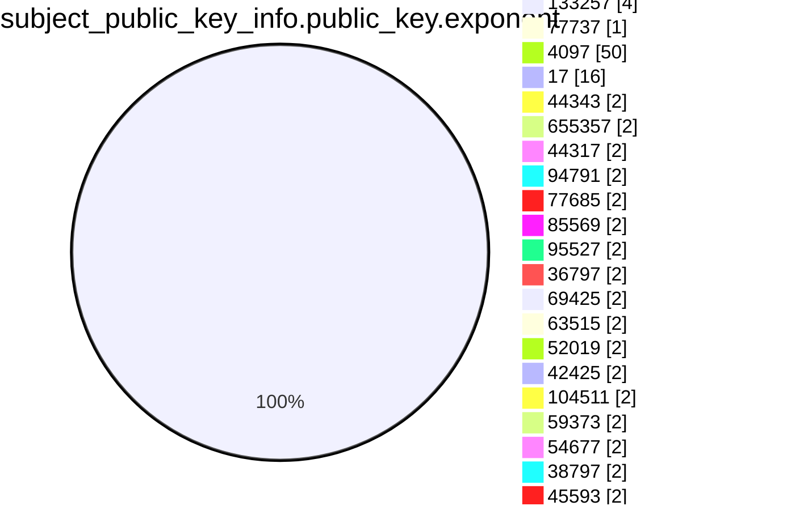
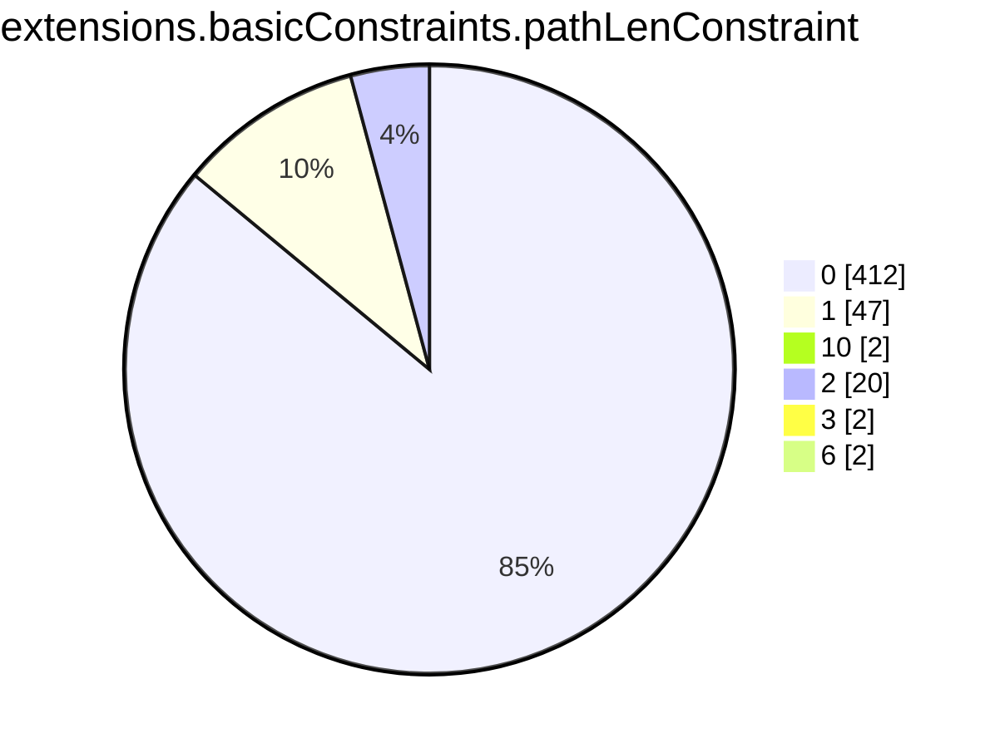

```mermaid
pie showData
title subject.cn.tld
"tw" :2695128
"si" :1400662
"com" :1276614395
"in" :16832015
"IN" :453
"at" :10535983
"ru" :48948363
"br" :43399772
"org" :74621006
"net" :112266346
"jp" :15257617
"uk" :55581718
"ph" :857602
"today" :538516
"nz" :5381728
"biz" :6611331
"studio" :1069915
"us" :9535380
"ca" :18600830
"solutions" :544119
"cc" :3835389
"au" :23705049
"online" :12797499
"shop" :8707680
"domains" :177297
"media" :706926
"kr" :3382597
"finance" :377291
"mx" :7013479
"directory" :69304
"life" :3515130
"bz" :233538
"xyz" :25772970
"co" :29359486
"info" :14988335
"estate" :57951
"club" :5080959
"my" :2095284
"pg" :20922
"site" :9176524
"me" :26480414
"eu" :17592048
"cn" :13133260
"live" :3168507
"io" :56302872
"de" :101215189
"ws" :451851
"press" :103439
"center" :438086
"store" :6164581
"education" :236625
"it" :20450054
"cl" :6315046
"rocks" :821402
"xn--p1ai" :3375920
"art" :1457225
"space" :4100860
"global" :312537
"asia" :1218571
"th" :831406
"care" :241181
"hk" :1188571
"sg" :1608981
"fr" :33755606
"beer" :79423
"cloud" :6876283
"tech" :6230033
"work" :2375844
"tr" :3391933
"wedding" :147983
"healthcare" :34349
"health" :170325
"ie" :2001584
"pro" :5036097
"ltd" :560735
"dk" :8118144
"id" :9265664
"es" :10294972
"consulting" :193217
"ro" :6347363
"nl" :37597345
"vn" :5036625
"pl" :21435977
"edu" :3225167
"no" :7486550
"dev" :16353789
"se" :12523662
"tv" :2307878
"mobi" :747341
"gov" :502164
"il" :2865262
"be" :12976173
"su" :1170845
"cz" :11904364
"world" :1072808
"click" :888906
"uno" :200003
"community" :140747
"faith" :29939
"pt" :3661855
"city" :428116
"za" :13591310
"aero" :205836
"lv" :1073041
"lu" :701333
"amsterdam" :186305
"company" :455281
"lundbeck" :10
"gs" :51794
"events" :224676
"gal" :44501
"wine" :84147
"army" :30771
"expert" :221285
"ch" :24384774
"bzh" :97361
"exchange" :99932
"farm" :159867
"coop" :156367
"app" :8585544
"support" :199230
"team" :754427
"uy" :525570
"london" :176400
"design" :1283948
"business" :195623
"gl" :49763
"sv" :61399
"lk" :480386
"xn--80asehdb" :18778
"hu" :8481792
"ai" :1742119
"ac" :118389
"cyou" :464532
"pet" :69344
"cy" :158708
"travel" :181851
"agency" :911577
"direct" :8671607
"int" :33484
"capital" :145251
"law" :90196
"ae" :822504
"py" :280137
"digital" :1505588
"bmw" :21337
"cards" :54928
"reit" :195
"church" :329218
"energy" :119342
"ar" :6214219
"la" :430957
"bet" :200201
"cr" :167974
"pub" :163111
"bank" :48471
"xn--80aswg" :13877
"pw" :1604032
"is" :907468
"tj" :38605
"moscow" :112017
"ag" :155970
"jobs" :67713
"COM" :40303
"marketing" :192411
"academy" :366993
"bm" :25526
"social" :231529
"ci" :127685
"solar" :64720
"ad" :14127
"love" :226832
"re" :340887
"ni" :24063
"school" :200271
"gr" :5137619
"systems" :542809
"software" :201036
"gt" :189777
"gg" :514201
"group" :761508
"fun" :2215328
"aw" :3701
"best" :379552
"land" :157704
"fit" :300750
"tokyo" :783955
"pe" :1286613
"ec" :469266
"photography" :380153
"games" :328520
"eco" :65153
"link" :3157215
"Nu" :4
"tools" :382605
"nyc" :316866
"je" :49812
"website" :2017170
"construction" :40649
"fi" :7111912
"rs" :1562796
"rip" :84641
"vision" :81429
"am" :273552
"mn" :193376
"kh" :39240
"plus" :394689
"kim" :59265
"bn" :7507
"coffee" :156809
"plumbing" :10170
"rentals" :58333
"cool" :275363
"guide" :94871
"BZ" :36
"blog" :1030229
"xn--p1acf" :113346
"om" :28955
"quebec" :30329
"kw" :25694
"cba" :1060
"jo" :27511
"sa" :520387
"network" :722736
"fitness" :79455
"bh" :18537
"icu" :882825
"sk" :3077437
"vip" :2681388
"gallery" :136674
"mo" :18417
"ua" :8099356
"email" :464379
"kpn" :276
"ke" :1107654
"gh" :67045
"management" :63091
"nu" :1576811
"fj" :18005
"Com" :682
"eg" :58626
"gi" :11438
"koeln" :75791
"saxo" :256
"video" :214114
"ee" :1912434
"bg" :934774
"pk" :1191571
"scot" :70749
"hr" :1163889
"green" :99311
"uz" :611911
"gmo" :127
"qa" :107332
"vegas" :36258
"ntt" :1451
"clinic" :88113
"kz" :1947238
"miami" :47686
"cymru" :31133
"st" :237626
"one" :1274218
"red" :188515
"ng" :1633273
"ma" :794574
"ve" :165771
"bo" :152854
"dog" :91414
"tz" :290094
"bd" :282751
"services" :437162
"DE" :605
"accountants" :6759
"mv" :41091
"photo" :208009
"mc" :29900
"delivery" :74436
"lt" :1540526
"mu" :79636
"hn" :48963
"tt" :21655
"canon" :1170
"repair" :31829
"news" :448168
"llc" :89488
"BR" :258
"fm" :190325
"training" :115640
"berlin" :177529
"theater" :8622
"do" :263449
"museum" :7442
"ao" :87558
"ps" :65231
"auction" :21975
"ooo" :105234
"legal" :93105
"to" :42322109
"vc" :318000
"graphics" :44095
"ist" :35741
"zone" :585810
"okinawa" :34120
"technology" :192504
"jewelry" :26880
"AU" :862
"black" :46724
"fund" :232321
"xn--3e0b707e" :5147
"top" :6211832
"bio" :155639
"inc" :27815
"JP" :518
"paris" :95305
"study" :64409
"bw" :61396
"ryukyu" :3070
"racing" :17932
"page" :3000929
"help" :165603
"taxi" :48692
"yokohama" :25548
"ge" :397461
"house" :170799
"villas" :7538
"by" :1554514
"ba" :274531
"eus" :114471
"clothing" :56445
"place" :68778
"trade" :136312
"va" :208
"supply" :38717
"cat" :728774
"yoga" :85736
"li" :497169
"HK" :186
"market" :192622
"hsbc" :139
"audio" :31184
"as" :102247
"mz" :86361
"az" :306000
"movie" :13773
"so" :253917
"bi" :32256
"zw" :229333
"earth" :145833
"cw" :6645
"xn--80adxhks" :43168
"ventures" :80425
"apple" :193
"al" :228860
"gmbh" :112108
"name" :663414
"MY" :62
"GOV" :2022
"tours" :58981
"express" :60501
"jll" :66
"works" :297399
"cab" :21635
"jm" :12488
"boutique" :113635
"guru" :397472
"band" :111431
"host" :673361
"dental" :44361
"tc" :39884
"build" :80594
"watch" :91053
"pa" :67545
"win" :745443
"mk" :282787
"ORG" :2616
"toys" :32144
"cd" :20845
"bayern" :89502
"onl" :76278
"menu" :62833
"ml" :2430202
"pics" :44705
"money" :112462
"yt" :37899
"foundation" :111867
"immo" :84520
"alsace" :12493
"enterprises" :26780
"ninja" :454973
"blue" :171732
"pizza" :64218
"tk" :3341866
"bar" :201799
"codes" :213547
"gift" :35755
"ga" :1543974
"markets" :9773
"woodside" :1241
"credit" :31679
"ceo" :130739
"wtf" :273851
"sh" :583889
"aws" :11978
"kg" :127476
"sarl" :9796
"holdings" :27052
"run" :2598160
"im" :439564
"report" :67068
"cm" :187764
"rugby" :2492
"fail" :26872
"fashion" :77443
"BIZ" :161
"cf" :1445343
"gy" :30965
"hamburg" :54366
"ovh" :1026692
"football" :24646
"beauty" :41077
"buzz" :846337
"kyoto" :10485
"statefarm" :23857
"et" :35765
"limited" :32764
"men" :80403
"vet" :71041
"cash" :138644
"science" :101902
"mm" :44010
"mt" :99999
"pictet" :709
"partners" :64686
"audi" :3957
"ms" :104348
"ly" :243351
"international" :93702
"engineering" :87648
"coach" :125818
"infiniti" :72
"gq" :754416
"film" :45155
"lol" :165220
"homes" :66128
"vlaanderen" :36279
"iq" :38546
"tax" :52401
"sx" :30866
"rest" :130224
"fyi" :138094
"man" :1754
"africa" :230665
"tn" :276315
"gold" :201411
"surf" :93671
"ink" :300826
"cam" :153125
"md" :440888
"pr" :10098
"xxx" :59779
"stream" :133271
"amazon" :84
"contact" :37857
"party" :156417
"lc" :35163
"ht" :25753
"careers" :40118
"lb" :25281
"archi" :25254
"dating" :29576
"ky" :36429
"lawyer" :21380
"wien" :72006
"xn--tckwe" :7379
"limo" :6977
"computer" :38352
"nagoya" :29946
"recipes" :19579
"reisen" :15677
"moe" :188866
"show" :150359
"monster" :400162
"lgbt" :21066
"mil" :13311
"realty" :312330
"sport" :6886
"casa" :1476688
"bj" :29592
"tienda" :15197
"np" :504227
"haus" :54171
"bt" :21218
"swiss" :151330
"brussels" :47769
"bbva" :58
"financial" :41726
"bike" :95904
"wales" :52610
"sb" :9462
"cx" :180425
"dance" :64049
"glass" :18651
"radio" :16142
"lat" :39521
"cooking" :11672
"wiki" :154210
"download" :58939
"tf" :57840
"tui" :553
"insure" :28354
"pink" :54472
"sc" :51233
"security" :6788
"deals" :48426
"style" :99968
"vg" :19810
"parts" :25710
"tube" :30713
"forum" :1812
"xn--90ais" :63820
"productions" :66556
"properties" :60317
"realestate" :38051
"reviews" :79793
"car" :2367
"chat" :202863
"shoes" :19280
"tel" :149312
"kpmg" :69
"vote" :24562
"rent" :40783
"fish" :42131
"quest" :143542
"melbourne" :29831
"wang" :104951
"mba" :27614
"sap" :58747
"ax" :52437
"camera" :17073
"kiwi" :60677
"ug" :95083
"loan" :29847
"investments" :20464
"bingo" :10149
"cpa" :15783
"ki" :4192
"INT" :18
"luxe" :6619
"sm" :15891
"family" :202061
"fan" :31283
"game" :28371
"attorney" :9265
"golf" :62869
"gd" :109920
"CL" :78
"bid" :99884
"sn" :67784
"NET" :3419
"dealer" :306
"fo" :59252
"schule" :40285
"holiday" :18934
"casino" :66364
"contractors" :10589
"sr" :17686
"town" :47591
"ruhr" :24592
"institute" :65776
"organic" :11427
"sale" :115311
"fox" :1767
"cafe" :178901
"adult" :4710
"corsica" :13071
"lighting" :22144
"tm" :18829
"voyage" :13929
"weir" :2785
"xn--fiqs8s" :11995
"ne" :6023
"salon" :33797
"hosting" :104205
"poker" :17354
"xn--mgbaam7a8h" :81
"tips" :98854
"pf" :19447
"xin" :42131
"auspost" :503
"na" :91505
"auto" :6839
"moda" :48172
"af" :44404
"nrw" :59016
"PRO" :4
"QA" :84
"NO" :44
"fans" :33659
"UK" :747
"garden" :28101
"pictures" :64882
"bs" :7712
"SE" :121
"flowers" :8969
"zm" :36508
"loans" :18063
"mortgage" :14733
"frl" :60323
"accountant" :6415
"Org" :83
"nc" :80382
"pm" :92660
"xn--ses554g" :737
"restaurant" :39011
"university" :42927
"srl" :75174
"gifts" :35735
"charity" :11739
"dz" :127780
"vi" :2735
"abbott" :2934
"ikano" :670
"photos" :146670
"rw" :95403
"tirol" :52340
"brother" :177
"sz" :10894
"camp" :61408
"clubmed" :1378
"saarland" :16385
"nr" :552
"ngo" :32014
"dentist" :9502
"irish" :20325
"krd" :9571
"promo" :52860
"discount" :9267
"EDU" :1249
"CA" :1589
"actor" :12981
"baby" :24313
"toyota" :338
"tl" :19818
"viajes" :6535
"boston" :9469
"tatar" :4692
"kitchen" :47762
"vin" :33372
"christmas" :6385
"trading" :10619
"review" :96593
"ski" :33958
"navy" :9832
"pharmacy" :1656
"xn--j1amh" :32365
"autos" :16595
"teva" :354
"gives" :13510
"vacations" :11445
"florist" :44395
"tg" :23246
"cleaning" :16721
"doctor" :43585
"suzuki" :195
"porn" :13908
"new" :19575
"gay" :169507
"webcam" :13817
"SA" :188
"KW" :34
"xn--kpry57d" :1695
"ricoh" :543
"afl" :328
"sbi" :586
"sky" :2025
"mw" :14296
"xn--d1acj3b" :4693
"AR" :70
"CN" :57
"NL" :246
"wf" :35969
"bot" :17198
"sexy" :22794
"mg" :65385
"ren" :48059
"physio" :9851
"vu" :157972
"mp" :7956
"cg" :9114
"ls" :16393
"bb" :6632
"hair" :15210
"IT" :204
"Gov" :108
"sncf" :544
"neustar" :1010
"builders" :39628
"cricket" :8884
"pfizer" :136
"sydney" :26111
"associates" :18049
"college" :17831
"US" :409
"fk" :629
"godaddy" :198
"jcb" :83
"abb" :2345
"gn" :3475
"soccer" :12307
"ck" :3459
"globo" :2247
"nissan" :81
"horse" :26890
"xn--mgberp4a5d4ar" :705
"soy" :11412
"xn--c1avg" :2851
"how" :24898
"dm" :4395
"cbs" :51
"date" :43019
"kn" :2818
"diamonds" :9470
"shopping" :40966
"nikon" :4
"rehab" :11872
"temasek" :48
"barcelona" :18091
"skin" :14542
"observer" :8758
"lamborghini" :456
"tickets" :1678
"sony" :99
"gm" :10662
"immobilien" :17006
"jetzt" :62280
"reise" :2967
"kaufen" :15406
"tennis" :8291
"singles" :12361
"xn--mk1bu44c" :2882
"tatamotors" :94
"itau" :150
"SG" :401
"hiphop" :1758
"gp" :9393
"tires" :5555
"ye" :5522
"total" :987
"EU" :180
"barclaycard" :268
"barclays" :1077
"property" :11302
"bnpparibas" :2131
"surgery" :10134
"cv" :23955
"engineer" :38310
"exposed" :11812
"xn--90ae" :6654
"catering" :14074
"MX" :71
"vodka" :6378
"hermes" :397
"taipei" :8165
"ong" :10099
"cologne" :13000
"km" :944
"gratis" :20764
"JM" :4
"claims" :11766
"gucci" :150
"bridgestone" :305
"versicherung" :3328
"istanbul" :16510
"playstation" :36
"goog" :324674
"xn--qxa6a" :235
"xn--e1a4c" :1869
"dj" :16392
"equipment" :13021
"fishing" :6812
"republican" :4230
"industries" :33137
"xn--q9jyb4c" :4301
"Lighting" :2
"SALE" :7
"condos" :8845
"nike" :819
"futbol" :10085
"gop" :6060
"honda" :121
"realtor" :92474
"hospital" :5840
"cfd" :94088
"gdn" :11430
"ONLINE" :12
"sl" :9545
"courses" :17893
"madrid" :7408
"xn--9dbq2a" :1922
"forsale" :21626
"mq" :2773
"AE" :138
"dvag" :11710
"RU" :82
"EMAIL" :7
"supplies" :14815
"apartments" :18912
"PH" :77
"compare" :1356
"xn--h2brj9c" :1652
"desi" :6921
"orange" :3370
"country" :5548
"cheap" :17082
"TR" :14
"dhl" :573
"hockey" :6299
"sex" :14484
"democrat" :4427
"blackfriday" :1430
"sucks" :1968
"diet" :3890
"degree" :3354
"xn--fiq228c5hs" :206
"lease" :10425
"osaka" :5847
"sakura" :30
"capetown" :21605
"bargains" :7206
"joburg" :12922
"xn--ngbc5azd" :630
"flights" :8734
"xn--6qq986b3xl" :9482
"durban" :8090
"sbs" :154667
"rodeo" :12975
"bond" :84493
"cruises" :4823
"mango" :123
"mom" :16143
"coupons" :9641
"abogado" :1552
"xn--qxam" :5477
"vanguard" :307
"tattoo" :38392
"xn--j6w193g" :5620
"airforce" :3513
"gf" :2626
"nf" :56486
"forex" :2339
"sd" :48687
"memorial" :5373
"creditcard" :4847
"broker" :6277
"crs" :3571
"jnj" :2189
"citic" :244
"boats" :3902
"PT" :20
"aeg" :5
"leclerc" :2951
"trust" :30
"ir" :5511258
"LONDON" :6
"lidl" :550
"ltda" :2530
"bf" :13822
"luxury" :5778
"Dk" :4
"insurance" :1888
"furniture" :17389
"yachts" :3210
"next" :975
"sandvik" :392
"Clinic" :2
"basketball" :3082
"Edu" :32
"hiv" :638
"genting" :28
"pioneer" :73
"DK" :277
"OM" :6
"post" :739
"CO" :66
"aquarelle" :91
"makeup" :8722
"Biz" :145
"FR" :151
"schwarz" :3213
"day" :26928
"mr" :9081
"bible" :23564
"NETWORK" :16
"monash" :312
"abudhabi" :1144
"RENTALS" :3
"gent" :50962
"shiksha" :2708
"ES" :318
"hm" :4211
"香港" :24
"maison" :6144
"moi" :460
"xn--6frz82g" :5694
"career" :4144
"jpmorgan" :4
"sy" :20743
"CBA" :48
"toray" :242
"xn--czrs0t" :184
"uol" :179
"td" :4731
"juegos" :947
"bradesco" :576
"storage" :2176
"williamhill" :22
"TH" :83
"scb" :129
"guitars" :2085
"Be" :4
"rich" :986
"xn--g2xx48c" :101
"Net" :71
"xn--mgbab2bd" :184
"xn--rhqv96g" :476
"select" :681
"erni" :101
"gripe" :1309
"sharp" :521
"CZ" :29
"schaeffler" :2202
"komatsu" :656
"anz" :330
"cars" :2473
"ZA" :120
"FI" :109
"BE" :104
"IE" :58
"philips" :15
"ismaili" :161
"schmidt" :214
"xn--o3cw4h" :1582
"KE" :23
"deloitte" :196
"IO" :35
"showtime" :7
"Co" :2
"nab" :8
"sener" :109
"BANK" :15
"abc" :100
"xn--czr694b" :291
"Za" :8
"HR" :52
"lotto" :177
"CM" :6
"theatre" :152
"uK" :15
"TW" :261
"praxi" :6
"xn--io0a7i" :867
"lr" :3916
"BH" :22
"MU" :10
"RE" :2
"xn--t60b56a" :357
"IL" :46
"DZ" :14
"EC" :12
"COMPANY" :9
"xn--vhquv" :92
"vig" :738
"cfa" :52
"CLOUD" :12
"voto" :1595
"pn" :1702
"aq" :1071
"ss" :1831
"lilly" :57
"azure" :187
"SI" :16
"jio" :48
"RO" :166
"GR" :85
"ID" :45
"voting" :246
"motorcycles" :2434
"axa" :237
"seat" :561
"rio" :9140
"sanofi" :234
"nico" :142
"ipiranga" :38
"xn--3ds443g" :318
"CAFE" :3
"xn--node" :654
"xn--vuq861b" :134
"kred" :1059450
"zuerich" :3019
"shell" :1607
"MD" :4
"NZ" :75
"microsoft" :52
"PY" :12
"xn--3hcrj9c" :81
"xn--90a3ac" :5211
"lego" :96
"goo" :47
"MIL" :51
"City" :18
"fresenius" :21
"xn--fiqz9s" :835
"ifm" :1033
"linde" :11
"cisco" :31
"aaa" :20
"TV" :12
"med" :202
"VN" :33
"smart" :44
"xn--y9a3aq" :2407
"mma" :74
"xn--otu796d" :70
"xn--czru2d" :100
"cuisinella" :46
"EG" :2
"PL" :15
"aig" :29
"panasonic" :48
"cu" :53558
"weber" :1362
"xn--55qx5d" :11748
"In" :8
"MO" :6
"ubs" :4
"NU" :2
"AG" :25
"xn--kput3i" :5663
"itv" :30
"flir" :48
"fage" :100
"mh" :71
"ET" :32
"yandex" :520
"protection" :106
"Zone" :8
"Asia" :8
"CH" :50
"LB" :39
"gw" :5918
"AO" :57
"stockholm" :64
"otsuka" :63
"SBI" :30
"MOBI" :23
"creditunion" :192
"Fr" :42
"ASIA" :24
"ericsson" :13
"kfh" :20
"amex" :4
"BRADESCO" :34
"xn--rvc1e0am3e" :63
"Live" :10
"hisamitsu" :433
"CI" :2
"natura" :13
"xn--54b7fta0cc" :691
"locus" :263
"LAW" :6
"xn--rovu88b" :6
"xn--1ck2e1b" :4
"xn--eckvdtc9d" :4
"qpon" :795
"imdb" :4
"free" :4
"read" :4
"tushu" :4
"xn--jlq480n2rg" :4
"silk" :4
"CD" :4
"LTD" :4
"BS" :2
"BM" :4
"bbc" :49
"edeka" :782
"airbus" :16
"chase" :10
"MADRID" :2
"call" :4
"audible" :4
"xn--unup4y" :96
"AT" :16
"COOP" :10
"NAME" :2
"bauhaus" :248
"WORLD" :4
"EUS" :6
"xn--5tzm5g" :859
"dubai" :59
"adac" :2
"INFO" :31
"arab" :4
"politie" :306
"NYC" :2
"jaguar" :5
"landrover" :5
"sew" :38
"lincoln" :4
"statebank" :66
"lanxess" :52
"TOP" :2
"nec" :57
"WS" :21
"rwe" :8
"DIGITAL" :20
"toshiba" :76
"xn--nqv7f" :198
"jprs" :41
"PE" :20
"frogans" :25
"SZ" :2
"Solutions" :6
"HU" :15
"LA" :14
"xn--fjq720a" :90
"ACADEMY" :8
"farmers" :8
"xfinity" :9
"comcast" :9
"ZM" :6
"TECH" :24
"FARM" :4
"XYZ" :84
"channel" :426
"Software" :4
"xn--2scrj9c" :150
"mutual" :9
"northwesternmutual" :4
"Tech" :3
"CLUB" :16
"JO" :36
"xn--xhq521b" :200
"bosch" :3
"samsung" :6
"nowruz" :80
"xn--hxt814e" :204
"xn--mgbca7dzdo" :6
"booking" :4
"dupont" :12
"CAT" :2
"extraspace" :62
"gu" :291
"MZ" :12
"aco" :1503
"redumbrella" :3
"travelers" :3
"travelersinsurance" :3
"trv" :3
"KR" :10
"BW" :4
"CR" :6
"Bid" :8
"mattel" :847
"HOUSE" :3
"bentley" :50
"xn--wgbh1c" :46
"guardian" :12
"APP" :4
"xn--zfr164b" :14
"xn--imr513n" :6
"LT" :8
"xn--s9brj9c" :103
"mini" :66
"xn--h2breg3eve" :107
"arpa" :12
"AERO" :7
"xn--xkc2dl3a5ee0h" :589
"analytics" :10
"Bank" :12
"Video" :4
"xn--gecrj9c" :98
"foo" :263
"KZ" :6
"Dog" :6
"gea" :134
"Info" :2
"GT" :2
"Uk" :12
"hyundai" :51
"Dev" :4
"xn--45brj9c" :351
"mit" :11
"amica" :4
"Land" :3
"AM" :6
"bms" :4
"xn--fpcrj9c3d" :100
"MT" :44
"RW" :6
"PF" :4
"broadway" :68
"WEIR" :2
"MA" :38
"Eu" :2
"ANZ" :12
"LIFE" :10
"UG" :5
"google" :52172
"ice" :10
"ZONE" :4
"xn--d1alf" :246
"Us" :2
"jmp" :10
"nra" :20
"accenture" :4
"FOX" :5
"bloomberg" :10
"msd" :2
"PK" :5
"icbc" :2
"GG" :16
"sas" :6
"mtr" :5
"UA" :4
"SINGLES" :4
"GL" :6
"KY" :2
"chintai" :24
"feedback" :1642
"Mil" :2
"Store" :2
"COm" :2
"CY" :6
"tW" :2
"Ca" :4
"xbox" :8
"bing" :8
"windows" :8
"hotmail" :8
"skype" :8
"office" :8
"allfinanz" :411
"Social" :8
"SK" :5
"GH" :4
"DO" :8
"NG" :4
"NA" :2
"cern" :75
"BN" :14
"HOST" :14
"ABUDHABI" :2
"VIP" :6
"crown" :3
"ME" :16
"CC" :4
"bR" :2
"SAP" :2
"bcn" :50
"IS" :2
"softbank" :94
"Global" :4
"STUDIO" :4
"SPACE" :8
"XN--P1AI" :28
"BO" :2
"coM" :4
"IQ" :4
"Health" :6
"EE" :2
"xn--fct429k" :2
"GAL" :2
"xn--ngbrx" :3
"La" :2
"cN" :2
"AI" :14
"xn--80ao21a" :632
"BG" :2
"kinder" :15
"walter" :4
"AF" :4
"SITE" :2
"zara" :16
"GLOBAL" :5
"NTT" :6
"Online" :8
"hitachi" :71
"SL" :12
"QUEST" :4
"deV" :2
"WORK" :2
"ford" :4
"able" :8
"STORE" :2
"youtube" :476
"meet" :88
"ECO" :2
"beats" :6
"xn--mgbbh1a71e" :89
"xn--1qqw23a" :10897
"xn--i1b6b1a6a2e" :115
"ggee" :44
"tvs" :42
"xn--pgbs0dh" :24
"chrome" :21
"bugatti" :82
"bostik" :511
"firmdale" :1477
"maif" :237
"gle" :108
"TM" :2
"xn--mgbah1a3hjkrd" :44
"xn--gckr3f0f" :61
"vivo" :46
"xn--nqv7fs00ema" :27
"xn--mix891f" :24
"kosher" :16
"pru" :42
"stc" :43
"One" :3
"xn--ygbi2ammx" :23
"xn--mgbayh7gpa" :162
"mlb" :38
"vuelos" :15
"eurovision" :17
"alstom" :15
"TC" :2
"ieee" :14
"hoteles" :16
"Systems" :8
"wme" :16
"passagens" :17
"omega" :30
"ses" :2
"stada" :199
"SCOT" :8
"xn--4gbrim" :52
"netflix" :19
"CITY" :2
"Show" :2
"xn--mgba3a4f16a" :113
"redstone" :3
"lacaixa" :16
"swatch" :5
"whoswho" :35
"MR" :4
"epson" :44
"yodobashi" :42
"lixil" :30
"mitsubishi" :43
"Cloud" :6
"fujitsu" :47
"dnp" :42
"datsun" :46
"goldpoint" :43
"nhk" :43
"lotte" :45
"kddi" :41
"kia" :46
"arte" :111
"xn--fzc2c9e2c" :40
"dabur" :41
"fairwinds" :65
"firestone" :29
"lexus" :33
"INDUSTRIES" :3
"latrobe" :13
"citi" :13
"java" :52
"csc" :7
"cancerresearch" :16
"reliance" :29
"hdfc" :36
"ril" :30
"er" :47
"LU" :12
"Me" :4
"Space" :2
"oldnavy" :12
"rocher" :16
"athleta" :12
"helsinki" :33
"ferrero" :110
"LV" :2
"xn--45br5cyl" :13
"lplfinancial" :14
"lpl" :14
"ups" :11
"Market" :2
"GE" :3
"Academy" :18
"Jo" :2
"shia" :9
"pars" :9
"tci" :9
"TOKYO" :2
"abbvie" :54
"xn--mgbgu82a" :16
"xn--wgbl6a" :16
"gap" :10
"lancaster" :5
"xn--l1acc" :8
"bananarepublic" :9
"sandvikcoromant" :2
"xn--mgbbh1a" :4
"imamat" :2
"caravan" :2
"sfr" :1
"Photography" :2
"KH" :25
"рф" :1
"goV" :1
"xn--3bst00m" :2
"ally" :4
"TT" :1
"xerox" :2
"CRS" :1
"Pro" :2
"DEV" :1
"Loan" :4
"Healthcare" :1
"ML" :12
"Tk" :16
"watches" :4
"xn--ogbpf8fl" :130
"safety" :4
"grainger" :2
"TK" :34
"Ltd" :140
"xn--mgbpl2fh" :20
"xn--clchc0ea0b2g2a9gcd" :8
"xn--q7ce6a" :12
"xn--mgbcpq6gpa1a" :6
"xyZ" :4
"XN--5TZM5G" :8
"SCIENCE" :10
"xn--mgbai9azgqp6j" :4
"cLub" :4
"LI" :6
"goodyear" :2
"dunlop" :2
"Xyz" :2
"MONSTER" :10
"KG" :2
"CF" :10
"CLICK" :2
"SHOP" :2
```

```mermaid
pie showData
title issuer
"Google UK Ltd." :132200
"STRAC" :2
"Foundation for Trusted Identity" :2
"TSCP Inc." :3
"Cisco Systems" :2312
"行政院" :12
"KPN B.V." :2
"Actalis S.p.A.-03358520967" :2
"U.S. Government" :19
"CertiPath" :4
"WidePoint" :1
"A-Trust Ges. f. Sicherheitssysteme im elektr. Datenverkehr GmbH" :12
"AC Camerfirma S.A." :402
"ICP-Brasil" :6
"VeriSign, Inc." :19
"行政院" :44
"Baltimore" :32
"U.S. Government" :3
"Microsoft Corporation" :2
"VeriSign, Inc." :49
"A-Trust Ges. f. Sicherheitssysteme im elektr. Datenverkehr GmbH" :10
"FNMT-RCM" :8
"VeriSign, Inc." :6
"AC CAMERFIRMA S.A." :6
"VeriSign, Inc." :4
"Colegio de Registradores de la Propiedad y Mercantiles de España" :4
"thawte, Inc." :4
"行政院" :4
"DigiCert Inc" :10
"Hellenic Academic and Research Institutions Cert. Authority" :10
"Republika Slovenija" :4
"Elektronik Bilgi Guvenligi A.S." :4
"MULTICERT - Serviços de Certificação Electrónica S.A." :2
"E-Tuğra EBG Bilişim Teknolojileri ve Hizmetleri A.Ş." :10
"GeoTrust Inc." :4
"Hellenic Academic and Research Institutions Cert. Authority" :45
"Atos" :14
"Apple Inc." :117
"Apple Inc." :57
"SAFE-Biopharma" :2
"QuoVadis Limited" :10
"Apple Inc." :29
"POSTA" :6
"Secretaria de Economia" :6
"TÜRKTRUST Bilgi İletişim ve Bilişim Güvenliği Hizmetleri A.Ş." :4
"Elektronik Bilgi Guvenligi A.S." :2
"LAWtrust" :6
"AC Camerfirma SA" :2
"SwissSign AG" :2
"British Telecommunications plc" :12
"SAFE Identity" :2
"Certinomis" :2
"HydrantID (Avalanche Cloud Corporation)" :2
"QuoVadis Limited" :12
"GlobalSign" :2
"GlobalSign nv-sa" :5
"Institute for Development and Research in Banking Technology" :89
"U.S. Government" :3
"Actalis S.p.A." :6
"Symantec Corporation" :10
"Trustwave Holdings, Inc." :3
"Apple Inc." :49
"Sectigo Limited" :2
"GlobalSign nv-sa" :12
"WoSign CA Limited" :6
"VeriSign, Inc." :2
"Japanese Government" :2
"Unizeto Technologies S.A." :4
"ANF Autoridad de Certificacion" :4
"SwissSign AG" :2
"Google UK Ltd." :197103
"Hongkong Post" :10
"Vaestorekisterikeskus CA" :4
"QuoVadis Limited" :8
"certSIGN" :4
"DigiCert Inc" :4
"e-commerce monitoring GmbH" :10
"ICP-Brasil" :10
"DigiCert Inc" :4
"MINISTERE INTERIEUR" :2
"DigiCert Inc" :2
"Government Root Certification Authority" :2
"Open Access Technology International Inc" :2
"SECOM Trust Systems CO.,LTD." :10
"E-Tuğra EBG Bilişim Teknolojileri ve Hizmetleri A.Ş." :102
"Elektronik Bilgi Guvenligi A.S." :2
"行政院" :225
"ICP-Brasil" :2
"TÜRKTRUST Bilgi İletişim ve Bilişim Güvenliği Hizmetleri A.Ş." :4
"VeriSign, Inc." :8
"Apple Inc." :47
"Orion Health Inc." :4
"DigiCert Inc" :2
"ACNLB" :2
"QuoVadis Limited" :53845
"Apple Inc." :47
"The USERTRUST Network" :2
"GlobalSign nv-sa" :8
"GAD EG" :4
"VeriSign, Inc." :6
"NISZ Nemzeti Infokommunikációs Szolgáltató Zrt." :24
"QuoVadis Limited" :10
"SECOM Trust.net" :17
"Turkiye Bilimsel ve Teknolojik Arastirma Kurumu - TUBITAK" :2
"SwissSign AG" :5
"Verizon Business" :2
"ICP-Brasil" :2
"Symantec Corporation" :2
"SwissSign AG" :3
"Apple Inc." :2
"GoDaddy.com, Inc." :10131793
"GlobalSign nv-sa" :1187435
"GlobalSign nv-sa" :487515
"GlobalSign nv-sa" :1892160
"Starfield Technologies, Inc." :1153112
"GlobalSign nv-sa" :658088
"GlobalSign nv-sa" :75920
"GlobalSign nv-sa" :52506
"GlobalSign nv-sa" :87378
"Česká pošta, s.p." :3301
"Rede Nacional de Ensino e Pesquisa - RNP" :19445
"GlobalSign nv-sa" :400
"VALID CERTIFICADORA DIGITAL" :1478
"SOLUTI - SOLUCOES EM NEGOCIOS INTELIGENTES S-A" :94
"ATT Services Inc" :26530
"DigiCert Inc" :1757103
"Sectigo Limited" :94285732
"Internet2" :1324819
"SecureCore" :73711
"SECOM Trust Systems CO.,LTD." :85354
"DigiCert Inc" :7590199
"Network Solutions L.L.C." :320526
"DigiCert Inc" :544499
"GoGetSSL" :552003
"SSL Corporation" :291417
"The USERTRUST Network" :191545
"Sectigo Limited" :2456734
"Government of Korea" :2471
"DigiCert Inc" :25579
"DigiCert Inc" :623733
"DigiCert Inc" :2454397
"DigiCert Inc" :406958
"DigiCert Inc" :39190771
"SECOM Trust Systems CO.,LTD." :85186
"DigiCert Inc" :10755
"DigiCert Inc" :962
"DigiCert Inc" :51186
"DigiCert Inc" :89246
"DigiCert Inc" :113705
"UniTrust" :3069
"FUJIFILM" :872
"DigiCert Inc" :2236
"DigiCert Inc" :74823395
"Trust Provider B.V." :71244
"The Trustico Group Ltd" :35500
"DigiCert Inc" :281412
"DigiCert Inc" :7669
"GlobalSign nv-sa" :4980
"SecureCore" :2978
"Aetna Inc" :42945
"DigiCert Inc" :193939
"TrustAsia Technologies, Inc." :3394
"Technische Universitaet Dresden" :3340
"COMODO CA Limited" :757571
"Verein zur Foerderung eines Deutschen Forschungsnetzes e. V." :240254
"EUNETIC GmbH" :22996
"DigiCert Inc" :1182348
"Soluciones Corporativas IP, SL" :117273
"DigiCert Inc" :51120
"Fraunhofer" :18913
"Alpiro s.r.o." :29126
"DigiCert Inc" :676
"Sectigo Limited" :2083
"Network Solutions L.L.C." :90558
"DigiCert Inc" :8659
"DigiCert Inc" :1078
"DigiCert Inc" :8481
"Technische Universitaet Ilmenau" :1030
"DigiCert Inc" :666483
"Karlsruhe Institute of Technology" :5434
"DigiCert Inc" :25793
"Microsec Ltd." :1972
"Gandi" :1625522
"TBS INTERNET" :15737
"Siemens" :4
"Corporation Service Company" :140633
"EUNETIC GmbH" :483
"Max-Planck-Gesellschaft" :10349
"Nijimo K.K." :3111
"DigiCert Inc" :146152
"Sectigo Limited" :23129
"The USERTRUST Network" :6921
"DigiCert Inc" :101277
"Sectigo Limited" :7790082
"Internet2" :33737
"DigiCert Inc" :2945
"GoGetSSL" :961
"Trustwave Holdings, Inc." :34618
"DigiCert Inc" :128575
"Wells Fargo & Company" :13350
"Government of the District of Columbia" :1445
"DigiCert Inc" :2853
"K Software" :1590
"DigiCert Inc" :20568
"TrustAsia Technologies, Inc." :3768111
"WoTrus CA Limited" :31869
"Apple Inc." :7759
"Cybertrust Japan Co., Ltd." :73304
"BitCert" :1543
"CrowdStrike Inc." :324
"TAIWAN-CA" :777
"Cybertrust Japan Co., Ltd." :33682
"SSL Corp" :1483
"GoGetSSL" :3754
"DigiCert Inc" :968829
"DigiCert Inc" :3258
"Deutscher Bundestag" :375
"CentralNic Luxembourg Sàrl" :32289
"IZENPE S.A." :1630
"DigiCert Inc" :4662
"Chunghwa Telecom Co., Ltd." :9807
"SECOM Trust Systems CO.,LTD." :37868
"The Trustico Group Ltd" :411
"Corporation Service Company" :415
"MarketWare - Soluções para Mercados Digitais, Lda." :1176
"VALID CERTIFICADORA DIGITAL" :216
"CERTDATA SERVICOS DE INFORMACAO LTDA" :273
"Open Access Technology International Inc" :3502
"Apple Inc." :7733
"Internet2" :17217
"Amazon" :87266455
"WoTrus CA Limited" :6303
"Disig a.s." :957
"IZENPE S.A." :747
"DHIMYOTIS" :14914
"Aristotle University of Thessaloniki" :2303
"Buypass AS-983163327" :22949
"GEANT Vereniging" :13504
"GlobalSign nv-sa" :512
"Aetna Inc" :218
"SOLUTI - SOLUCOES EM NEGOCIOS INTELIGENTES S-A" :290
"Sectigo (Europe) SL" :13
"Fresenius Kabi AG" :336
"Apple Inc." :3390
"Trustwave Holdings, Inc." :580
"Apple Inc." :3063
"TrustAsia Technologies, Inc." :56974
"OpenTrust" :2
"GeoTrust Inc." :2
"Certinomis" :2
"Certinomis" :18
"SwissSign AG" :32138
"GeoTrust Inc." :2
"SwissSign AG" :2
"SwissSign AG" :8449
"SwissSign AG" :2
"DigiCert Inc" :835
"VI Registru centras - i.k. 124110246" :2
"Inera AB" :14
"Agence Nationale des Titres Sécurisés" :6
"CERTSIGN SA" :2
"CERTSIGN SA" :17
"China Financial Certification Authority" :5769
"China Financial Certification Authority" :1083
"China Financial Certification Authority" :2
"CERTSIGN SA" :2
"Netflix, Inc." :2
"Krajowa Izba Rozliczeniowa S.A." :2
"E-Tuğra EBG Bilişim Teknolojileri ve Hizmetleri A.Ş." :11033
"E-Tuğra EBG Bilişim Teknolojileri ve Hizmetleri A.Ş." :344
"Isimtescil Bilisim Anonim Sirketi" :2
"Isimtescil Bilisim Anonim Sirketi" :33673
"Krajowa Izba Rozliczeniowa S.A." :1922
"Vaestorekisterikeskus CA" :1721
"Vaestorekisterikeskus CA" :5
"Krajowa Izba Rozliczeniowa S.A." :2
"Vaestorekisterikeskus CA" :4
"E-Tuğra EBG Bilişim Teknolojileri ve Hizmetleri A.Ş." :2
"Vaestorekisterikeskus CA" :1764
"COMODO CA Limited" :18428
"Actalis S.p.A." :2452771
"RU-Center (ЗАО Региональный Сетевой Информационный Центр)" :2581
"QuoVadis Limited" :169298
"联通智慧安全科技有限公司" :88
"QuoVadis Trustlink B.V." :29432
"Buypass AS-983163327" :6460
"TeliaSonera" :24398
"CERTDATA SERVICOS DE INFORMACAO LTDA" :296
"MarketWare - Soluções para Mercados Digitais, Lda." :852
"HydrantID (Avalanche Cloud Corporation)" :1681659
"VTB BANK (PJSC)" :265
"sslTrus" :765
"Government of Korea" :332
"sslTrus" :2784
"DigiCert Inc" :802
"GlobalSign nv-sa" :10174
"DigiCert Inc" :36459
"Site Blindado S.A." :2130
"KICA" :12
"IdenTrust" :5946940
"IdenTrust" :12288
"DigiCert Inc" :220
"Corporation Service Company" :16049
"Actalis S.p.A." :23834
"SECOM Trust Systems CO.,LTD." :2257
"DigiCert Inc" :196
"Hongkong Post" :6875
"SSL.com" :769
"Microsec Ltd." :638
"TrustSign Certificadora Dig. & Soluções Segurança da Inf. Ltda." :4269
"Apple Inc." :497
"Apple Inc." :1399
"UniTrust" :2
"UniTrust" :2
"Open Access Technology International Inc" :1286
"Intesa Sanpaolo S.p.A." :9
"InfoCert S.p.A." :125
"InfoCert S.p.A." :58
"QuoVadis Limited" :6
"QuoVadis Limited" :6
"Turkiye Bilimsel ve Teknolojik Arastirma Kurumu - TUBITAK" :501
"HydrantID (Avalanche Cloud Corporation)" :2
"SwissSign AG" :43726
"NAVER BUSINESS PLATFORM Corp." :2
"SwissSign AG" :22548
"Japan Certification Services, Inc." :2
"ZETES SA (VATBE-0408425626)" :4
"QuoVadis Limited" :8
"TAIWAN-CA" :4
"TAIWAN-CA" :2
"SwissSign AG" :13748
"Baidu, Inc." :3162
"QuoVadis Trustlink B.V." :12194
"Turing Crypto GmbH" :366
"TAIWAN-CA" :123887
"Certinomis" :2
"Certinomis" :2
"SwissSign AG" :2
"Siemens" :2
"certSIGN" :2
"Vaestorekisterikeskus CA" :4
"certSIGN" :2
"Capricorn Identity Services Pvt Ltd." :2
"GAD EG" :2
"Abitab S.A." :2
"Disig a.s." :4
"Alpiro s.r.o." :128
"DigiCert Inc" :650
"SECOM Trust Systems CO.,LTD." :4621
"DigiCert Inc" :168508
"Entrust, Inc." :1373327
"WoTrus CA Limited" :232
"Sectigo Limited" :115266
"Turing Crypto GmbH" :16
"Telia Finland Oyj" :16765
"Trustwave Holdings, Inc." :2304
"TI Trust Technologies S.R.L." :6496
"SOLUTI - SOLUCOES EM NEGOCIOS INTELIGENTES S-A" :178
"VALID CERTIFICADORA DIGITAL" :324
"Trust Provider B.V." :2376
"Hellenic Academic and Research Institutions CA" :806
"Deutsche Telekom Security GmbH" :38
"Sectigo Limited" :136
"Hao Quang Viet Software Company Limited" :585
"GlobalSign nv-sa" :18105
"Digi- ja vaestotietovirasto CA" :2000
"GlobalSign nv-sa" :153
"Digi- ja vaestotietovirasto CA" :1510
"COMODO CA Limited" :4578
"Entrust, Inc." :107789
"Entrust, Inc." :5617
"DHIMYOTIS" :6138
"TBS INTERNET" :366
"DigiCert Inc" :450
"UniTrust" :395
"WoTrus CA Limited" :67
"DigiCert Inc" :52
"SECOM Trust Systems CO.,LTD." :342
"Nijimo K.K." :722
"eMudhra Technologies Limited" :13501
"DigiCert Inc" :338
"DigiCert Inc" :172
"Gandi" :2162
"Baidu, Inc." :344
"Beijing Xinchacha Credit Management Co., Ltd." :5627
"ITSO LTD" :247
"Domain The Net Technologies Ltd" :2662
"D-Trust GmbH" :42598
"DigiCert Inc" :504
"One Sign Pte. Ltd." :1725
"DigiCert Inc" :2020
"Microsoft Corporation" :4507903
"Microsoft Corporation" :4494691
"Global Digital Cybersecurity Authority Co., Ltd." :448
"Ziwit" :1147
"Entrust, Inc." :1208
"Staat der Nederlanden" :16
"T-Systems International GmbH" :42611
"DigiCert Inc" :118
"HydrantID (Avalanche Cloud Corporation)" :5016
"DigiCert Inc" :62
"DigiCert Inc" :58
"Ziwit" :38
"DigiCert Inc" :419021
"DigiCert Inc" :76
"Japan Registry Services Co., Ltd." :284763
"Cloudflare, Inc." :150287553
"Cisco Systems, Inc." :1027833
"Cloudflare, Inc." :40458356
"GEANT Vereniging" :937515
"cPanel, Inc." :113580603
"DigiCert Inc" :119204
"ZeroSSL" :15189188
"TrustCor Systems S. de R.L." :39589
"Japan Registry Services Co., Ltd." :6374
"NETLOCK Kft." :2509
"Genious Communications" :8331
"Unizeto Technologies S.A." :236288
"DOMENY.PL sp. z o.o" :35316
"swissns GmbH" :840
"McAfee, Inc." :4490
"GEANT Vereniging" :29692
"Hellenic Academic and Research Institutions Cert. Authority" :1185
"行政院" :37863
"ACCV" :3160
"WISeKey" :3561
"T-Systems International GmbH" :11227
"certSIGN" :1968
"WebSpace-Forum e.K." :62
"NetLock Kft." :1841
"Entrust Datacard Europe S.L." :239
"FNMT-RCM" :3696
"Atos" :6853
"TI Trust Technologies S.R.L." :1691
"Firmaprofesional S.A." :4528
"Financijska agencija" :1133
"LH.pl Sp. z o.o." :13243
"D-Trust GmbH" :3245
"Hellenic Academic and Research Institutions Cert. Authority" :158
"E-SAFER CONSULTORIA EM TECNOLOGIA DA INFORMACAO LTDA" :625
"cPanel, Inc." :563
"DNEncrypt, Inc" :901
"SECOM Trust Systems CO.,LTD." :15221
"SECOM Trust Systems CO.,LTD." :1476
"TrustAsia Technologies, Inc." :3275
"CerSign Technology Limited" :1186
"DigiCert Inc" :569
"eMudhra Technologies Limited" :1927
"Deutsche Post AG" :9261
"NetLock Kft." :1224
"Quantum CA Limited" :6026
"QuoVadis Trustlink B.V." :5466
"DOMENY.PL sp. z o.o" :1216
"cPanel, Inc." :693130
"Hellenic Academic and Research Institutions CA" :178
"Digital Trust L.L.C." :981
"Hellenic Academic and Research Institutions CA" :1218
"Agence Nationale de Certification Electronique" :153
"Quantum CA Limited" :50
"IdenTrust" :180
"WidePoint" :54
"Quantum CA Limited" :76
"Apple Inc." :69
"nazwa.pl sp. z o.o." :616477
"T-Systems International GmbH" :1174
"Comodo Japan, Inc." :3740
"sslTrus" :22
"Staclar, Inc." :298
"FNMT-RCM" :1730
"ICP-Brasil" :3056
"Sectigo Limited" :1241
"Microsoft Corporation" :7514103
"Microsoft Corporation" :7610475
"Anson Network Limited" :122
"Deutsche Kreditbank AG" :764
"DigiCert Inc" :752
"Netflix, Inc." :8
"home.pl S.A." :126702
"AffirmTrust" :222
"sslTrus" :3
"TrustOcean Limited" :439
"Vaestorekisterikeskus CA" :16
"DigiCert Inc" :76
"VISA" :194
"Actalis S.p.A." :2835
"Unizeto Technologies S.A." :2252
"DigiCert Inc" :158
"Hellenic Academic and Research Institutions CA" :496
"Hellenic Academic and Research Institutions CA" :98
"WoTrus CA Limited" :1012
"Hellenic Academic and Research Institutions CA" :88
"Hellenic Academic and Research Institutions CA" :46
"D-Trust GmbH" :342
"KICA" :184
"CertCloud Pte. Ltd." :46664
"eMudhra Technologies Limited" :536
"Alpiro s.r.o." :108
"TRUSTCUBES LIMITED" :28
"GlobalSign nv-sa" :57519
"certSIGN" :48
"GlobalSign nv-sa" :5522
"DigiCert Inc" :62
"GlobalSign nv-sa" :246
"ZeroSSL" :18819887
"Amazon" :6
"Amazon" :6
"Amazon" :6
"Amazon" :8
"Amazon" :7
"TrustAsia Technologies, Inc." :180
"Greek Universities Network (GUnet)" :58
"STCS" :2
"Sistema Nacional de Certificacion Electronica" :4
"Alibaba Cloud Computing Co., Ltd." :12
"A-Trust Ges. f. Sicherheitssysteme im elektr. Datenverkehr GmbH" :247
"NetLock Kft." :124
"Root Networks, LLC" :18047
"Dreamcommerce S.A." :34603
"Telia Finland Oyj" :74
"Telia Finland Oyj" :70
"Apple Inc." :228
"Microsoft Corporation" :9220035
"Microsoft Corporation" :9412716
"NETLOCK Ltd." :57
"FNMT-RCM" :330
"Microsec Ltd." :596
"TrustAsia Technologies, Inc." :29266
"TrustAsia Technologies, Inc." :2054216
"Quantum CA Limited" :1260
"Hellenic Academic and Research Institutions Cert. Authority" :114
"DigiCert, Inc." :158
"Hellenic Academic and Research Institutions CA" :222
"certSIGN" :4
"certSIGN" :4
"DigiCert, Inc." :38
"ZoTrus Technology Limited" :318
"DigiCert Inc" :12
"WebSpace-Forum e.K." :31
"Alibaba Cloud Computing Co., Ltd." :8
"Digi-Sign Limited" :486
"DigiCert, Inc." :12
"COMODO CA Limited" :45
"WISeKey" :4
"WISeKey" :4
"WISeKey" :4
"Hellenic Academic and Research Institutions CA" :92
"{'c': 'BE', 'cn': 'Citizen CA', 'serialnumber': '201409'}" :4
"{'c': 'BE', 'cn': 'Citizen CA', 'serialnumber': '201505'}" :5
"{'c': 'BE', 'cn': 'Citizen CA', 'serialnumber': '201511'}" :4
"{'c': 'BE', 'cn': 'Citizen CA', 'serialnumber': '201509'}" :4
"{'c': 'BE', 'cn': 'Citizen CA', 'serialnumber': '201503'}" :5
"{'c': 'BE', 'cn': 'Citizen CA', 'serialnumber': '201404'}" :4
"{'c': 'BE', 'cn': 'Citizen CA', 'serialnumber': '201507'}" :4
"{'c': 'BE', 'cn': 'Citizen CA', 'serialnumber': '201506'}" :4
"{'c': 'BE', 'cn': 'Citizen CA', 'serialnumber': '201632'}" :4
"{'c': 'BE', 'cn': 'Citizen CA', 'serialnumber': '201610'}" :4
"http:--repository.eid.belgium.be-" :7
"{'c': 'BE', 'cn': 'Citizen CA', 'serialnumber': '201512'}" :4
"{'c': 'BE', 'cn': 'Citizen CA', 'serialnumber': '201510'}" :4
"{'c': 'BE', 'cn': 'Citizen CA', 'serialnumber': '201606'}" :4
"{'c': 'BE', 'cn': 'Citizen CA', 'serialnumber': '201601'}" :4
"{'c': 'BE', 'cn': 'Citizen CA', 'serialnumber': '201625'}" :4
"http:--repository.eid.belgium.be-" :4
"{'c': 'BE', 'cn': 'Citizen CA', 'serialnumber': '201501'}" :5
"{'c': 'BE', 'cn': 'Citizen CA', 'serialnumber': '201406'}" :4
"http:--repository.eid.belgium.be-" :4
"{'c': 'BE', 'cn': 'Citizen CA', 'serialnumber': '201605'}" :4
"{'c': 'BE', 'cn': 'Citizen CA', 'serialnumber': '201602'}" :4
"{'c': 'BE', 'cn': 'Citizen CA', 'serialnumber': '201623'}" :4
"http:--repository.eid.belgium.be-" :4
"http:--repository.eid.belgium.be-" :4
"http:--repository.eid.belgium.be-" :4
"{'c': 'BE', 'cn': 'Citizen CA', 'serialnumber': '201628'}" :4
"{'c': 'BE', 'cn': 'Citizen CA', 'serialnumber': '201508'}" :4
"{'c': 'BE', 'cn': 'Citizen CA', 'serialnumber': '201624'}" :4
"http:--repository.eid.belgium.be-" :4
"{'c': 'BE', 'cn': 'Citizen CA', 'serialnumber': '201627'}" :4
"http:--repository.eid.belgium.be-" :4
"{'c': 'BE', 'cn': 'Foreigner CA', 'serialnumber': '201608'}" :4
"{'c': 'BE', 'cn': 'Citizen CA', 'serialnumber': '201626'}" :4
"{'c': 'BE', 'cn': 'Citizen CA', 'serialnumber': '201609'}" :4
"http:--repository.eid.belgium.be-" :4
"{'c': 'BE', 'cn': 'Citizen CA', 'serialnumber': '201403'}" :4
"{'c': 'BE', 'cn': 'Citizen CA', 'serialnumber': '201622'}" :4
"{'c': 'BE', 'cn': 'Foreigner CA', 'serialnumber': '201606'}" :5
"{'c': 'BE', 'cn': 'Citizen CA', 'serialnumber': '201604'}" :4
"{'c': 'BE', 'cn': 'Citizen CA', 'serialnumber': '201608'}" :4
"TERENA" :77090
"e-commerce monitoring GmbH" :73
"The Trustico Group Ltd" :36
"{'c': 'BE', 'cn': 'Citizen CA', 'serialnumber': '201405'}" :4
"{'c': 'BE', 'cn': 'Citizen CA', 'serialnumber': '201504'}" :4
"http:--repository.eid.belgium.be-" :4
"http:--repository.eid.belgium.be-" :4
"{'c': 'BE', 'cn': 'Citizen CA', 'serialnumber': '201408'}" :4
"{'c': 'BE', 'cn': 'Citizen CA', 'serialnumber': '201634'}" :4
"{'c': 'BE', 'cn': 'Citizen CA', 'serialnumber': '201629'}" :4
"{'c': 'BE', 'cn': 'Belgium Root CA4'}" :4
"{'c': 'BE', 'cn': 'Citizen CA', 'serialnumber': '201502'}" :4
"{'c': 'BE', 'cn': 'Citizen CA', 'serialnumber': '201621'}" :4
"{'c': 'BE', 'cn': 'Citizen CA', 'serialnumber': '201633'}" :4
"{'c': 'BE', 'cn': 'Citizen CA', 'serialnumber': '201631'}" :4
"{'c': 'BE', 'cn': 'Citizen CA', 'serialnumber': '201410'}" :4
"{'c': 'BE', 'cn': 'Citizen CA', 'serialnumber': '201603'}" :4
"TrustAsia Technologies, Inc." :1361
"Digi- ja vaestotietovirasto CA" :32
"{'c': 'BE', 'cn': 'Citizen CA', 'serialnumber': '201407'}" :4
"{'c': 'BE', 'cn': 'Citizen CA', 'serialnumber': '201607'}" :4
"{'c': 'BE', 'cn': 'Citizen CA', 'serialnumber': '201630'}" :4
"GEANT Vereniging" :16776
"GoGetSSL" :460
"GlobalSign nv-sa" :4
"TrustAsia Technologies, Inc." :87
"Global Digital Cybersecurity Authority Co., Ltd." :26
"Hellenic Academic and Research Institutions CA" :40
"QuoVadis Limited" :287
"Digital Trust L.L.C." :57
"TrustAsia Technologies, Inc." :94
"GlobalSign nv-sa" :847
"COMODO CA Limited" :13099
"Amazon" :207
"3CX" :44
"GlobalSign nv-sa" :2909
"GlobalSign nv-sa" :32
"DigiCert Inc" :3239
"DigiCert Inc" :150
"ICP-Brasil" :276
"Hellenic Academic and Research Institutions CA" :48
"Gehirn Inc." :11
"Hellenic Academic and Research Institutions CA" :6
"Hellenic Academic and Research Institutions CA" :6
"Siemens" :6
"SSL Corp" :64
"Global Digital Cybersecurity Authority Co., Ltd." :849
"DigiCert, Inc." :10
"DigiCert, Inc" :12
"DigiCert, Inc" :8
"DigiCert, Inc." :8
"DigiCert, Inc." :56
"DigiCert, Inc." :8
"DigiCert, Inc" :16
"Microsoft Corporation" :6357
"Hongkong Post" :22
"DigiCert Inc" :70
"Public Key Infrastructure Ltd" :14
"Unizeto Technologies S.A." :5065
"DigiCert, Inc." :2
"iTrusChina Co., Ltd." :3515
"DigiCert Inc" :16
"Globalsign nv-sa" :1080
"HydrantID (Avalanche Cloud Corporation)" :60503
"Microsoft Corporation" :6750
"Microsoft Corporation" :7061
"eMudhra Technologies Limited" :5
"TrustCor Systems S. de R.L." :18
"Beijing Xinchacha Credit Management Co., Ltd." :2748
"Beijing Xinchacha Credit Management Co., Ltd." :103
"iTrusChina Co., Ltd." :262
"United SSL Deutschland GmbH" :1544
"Entrust Datacard Deutschland GmbH" :15
"Hao Quang Viet Software Company Limited" :4
"DigiCert, Inc" :16
"EDICOM CAPITAL SL" :48
"Fuji Xerox" :1771
"Apple Inc." :215
"Network Solutions L.L.C." :987
"Hellenic Academic and Research Institutions CA" :10
"Hellenic Academic and Research Institutions CA" :10
"VI Registru centras- i.k. 124110246" :2
"Firmaprofesional S.A." :192
"e-commerce monitoring GmbH" :4
"ARGE DATEN - Austrian Society for Data Protection" :4
"e-commerce monitoring GmbH" :4
"DocuSign France" :4
"Hellenic Academic and Research Institutions CA" :4
"Hellenic Academic and Research Institutions Cert. Authority" :8
"Hellenic Academic and Research Institutions CA" :4
"Firmaprofesional S.A. NIF A-62634068" :4
"{'c': 'ES', 'cn': 'Autoridad de Certificacion Firmaprofesional CIF A62634068'}" :8
"Hellenic Academic and Research Institutions Cert. Authority" :8
"Avalanche Cloud Corporation" :58
"Microsoft Corporation" :6421
"DigiCert Inc" :96
"JoySSL Limited" :2446
"CONSEJO GENERAL DE LA ABOGACIA" :4
"Consejo General de la Abogacia" :4
"Consejo General de la Abogacia" :4
"COMODO CA Limited" :35
"DigiCert Inc" :26
"eMudhra Technologies Limited" :14
"DigiCert Inc" :1926
"CrowdStrike, Inc." :190
"Sectigo Limited" :2557
"ZETES SA (VATBE-0408425626)" :6
"Global Digital Cybersecurity Authority Co., Ltd." :30
"DigiCert, Inc." :16
"DigiCert, Inc." :10
"DigiCert, Inc." :18
"DigiCert, Inc." :22
"Hellenic Academic and Research Institutions CA" :60
"E-TUGRA EBG BILISIM TEKNOLOJILERI VE HIZMETLERI ANONIM SIRKETI" :4033
"AffirmTrust" :293
"VALID CERTIFICADORA DIGITAL" :14
"UniTrust" :16
"DigiCert, Inc." :12
"Gehirn Inc." :190
"GlobalSign nv-sa" :210
"Entrust, Inc." :8
"PSW GROUP GmbH & Co. KG" :7
"AC CAMERFIRMA S.A." :4
"AC Camerfirma S.A." :4
"GoGetSSL" :12
"AC CAMERFIRMA S.A." :4
"Deutsche Telekom Security GmbH" :1988
"Isimtescil Bilisim A.S." :10296
"AC CAMERFIRMA S.A." :7
"Verokey" :6
"DigiCert, Inc." :12
"AC CAMERFIRMA S.A." :4
"AC CAMERFIRMA S.A." :4
"Global Digital Inc." :93
"Firmaprofesional S.A." :58
"E-TUGRA EBG BILISIM TEKNOLOJILERI VE HIZMETLERI ANONIM SIRKETI" :16
"MULTICERT - Serviços de Certificação Electrónica S.A." :1537
"CerSign Technology Limited" :12
"TrustAsia Technologies, Inc." :4
"Agencia Notarial de Certificacion S.L.U. - CIF B83395988" :5
"Agencia Notarial de Certificacion S.L.U. - CIF B83395988" :4
"Agencia Notarial de Certificacion S.L.U. - CIF B83395988" :4
"Agencia Notarial de Certificacion S.L.U. - CIF B83395988" :4
"Agencia Notarial de Certificacion S.L.U. - CIF B83395988" :4
"Agencia Notarial de Certificacion S.L.U. - CIF B83395988" :4
"D-Trust GmbH" :80
"GlobalSign nv-sa" :3
"Isimtescil Bilisim A.S." :2
"DigiCert, Inc." :22
"Digital Trust L.L.C." :107
"SECOM Trust Systems CO.,LTD." :38
"National Infrastructures for Research and Technology" :12
"DigiCert, Inc." :54
"První certifikační autorita, a.s." :451
"Hellenic Academic and Research Institutions CA" :12
"Hellenic Academic and Research Institutions CA" :14
"Hellenic Academic and Research Institutions CA" :12
"e-commerce monitoring GmbH" :67
"Hellenic Academic and Research Institutions CA" :14
"TrustSign Certificadora Dig. & Soluções Segurança da Inf. Ltda." :31
"Hellenic Academic and Research Institutions CA" :76
"Deutsche Telekom Security GmbH" :2
"ZoTrus Technology Limited" :20
"SafeToOpen Ltd" :930
"Digital Trust L.L.C." :438
"Globalsign nv-sa" :5660
"GlobalSign nv-sa" :62496
"AffirmTrust" :741
"GlobalSign nv-sa" :4875
"GlobalSign nv-sa" :263
"GlobalSign nv-sa" :5789
"DigiCert, Inc." :6
"eMudhra Technologies Limited" :14
"DNEncrypt, Inc" :5
"Sectigo Limited" :1421
"Microsoft Corporation" :5078
"ICP-Brasil" :192
"Nyatwork Communication Ltd" :260
"e-commerce monitoring GmbH" :32
"NAVER BUSINESS PLATFORM Corp." :93
"DNSPod, Inc." :1753
"DNSPod, Inc." :18
"Microsoft Corporation" :1217
"WoTrus CA Limited" :143
"ZoTrus Technology Limited" :6
"Network Solutions L.L.C." :6
"GEANT Vereniging" :329
"BitCert" :18
"GEANT Vereniging" :17
"Globalsign nv-sa" :61
"Global Digital Cybersecurity Authority Co., Ltd." :340
"DNSPod, Inc." :141
"TrustSign Certificadora Dig. & Soluções Segurança da Inf. Ltda." :84
"NETLOCK Ltd." :3
"E-SAFER CONSULTORIA EM TECNOLOGIA DA INFORMACAO LTDA" :73
"TrustAsia Technologies, Inc." :32
"Prodrive Technologies B.V." :396
"DigiCert, Inc." :374176
"DigiCert, Inc." :896365
"e-commerce monitoring GmbH" :28
"Genious Communications" :3
"Quantum CA Limited" :6
"Gehirn Inc." :17
"Hellenic Academic and Research Institutions CA" :20
"Hellenic Academic and Research Institutions CA" :139
"Hellenic Academic and Research Institutions CA" :516
"Certinomis" :82
"Hellenic Academic and Research Institutions CA" :153
"The USERTRUST Network" :9
"The USERTRUST Network" :12
"Hellenic Academic and Research Institutions CA" :66
"联通智慧安全科技有限公司" :24
"DigiCert Inc" :6
"Verokey" :10
"Siemens" :6
"Trustwave Holdings, Inc." :10
"Trustwave Holdings, Inc." :10
"Nijimo K.K." :456
"Chunghwa Telecom Co., Ltd." :226
"Verokey" :4
"Trustwave Holdings, Inc." :10
"Trustwave Holdings, Inc." :6
"Trustwave Holdings, Inc." :6
"cnWebTrust Inc" :6
"cnWebTrust Inc" :6
"北京中万网络科技有限责任公司" :39
"DigiCert  Inc" :4
"COMODO CA Limited" :94626
"COMODO CA Limited" :110584
"UniTrust" :14
"Shanghai Ping An Credit Reference Company Limited" :156
"TrustAsia Technologies, Inc." :3
"TK Elevator GmbH" :148
"ICP-Brasil" :6
"TrustCor Systems S. de R.L." :16
"Ziwit" :41
"北京中万网络科技有限责任公司" :12
"Nijimo K.K." :9
"Sectigo (Europe) SL" :63
"Corporation Service Company" :3
"Buypass AS-983163327" :301222
"Abitab S.A." :170
"SwissSign AG" :28
"SwissSign AG" :32
"SwissSign AG" :28
"E-TUGRA EBG BILISIM TEKNOLOJILERI VE HIZMETLERI ANONIM SIRKETI" :2
"Abitab S.A." :207
"Microsec Ltd." :558
"GlobalSign nv-sa" :3336
"GlobalSign nv-sa" :97424
"Globalsign nv-sa" :9456
"GlobalSign nv-sa" :246
"GlobalSign nv-sa" :123
"E-SAFER CONSULTORIA EM TECNOLOGIA DA INFORMACAO LTDA" :12
"Deutsche Telekom Security GmbH" :700
"SSL Corp" :18
"Hellenic Academic and Research Institutions CA" :16
"Beijing Xinchacha Credit Management Co., Ltd." :444
"Beijing Xinchacha Credit Management Co., Ltd." :925
"IdenTrust" :10
"SecureCore" :190
"DigiCert, Inc." :4
"Entrust, Inc." :8
"Shanghai Electronic Certificate Authority Center Co., Ltd." :4
"Shanghai Electronic Certificate Authority Center Co., Ltd." :2
"DigiCert Inc" :126
"Microsec Ltd." :665
"Deutsche Telekom Security GmbH" :18
"Deutsche Telekom Security GmbH" :20
"WoTrus CA Limited" :78
"AffirmTrust" :8
"AffirmTrust" :8
"AffirmTrust" :8
"Entrust EU, S.L." :15
"Kingnet Information Technology Co., Ltd." :61
"Alpiro s.r.o." :53
"Hellenic Academic and Research Institutions CA" :2
"NETLOCK Ltd." :3
"D-Trust GmbH" :2
"D-Trust GmbH" :2
"Xin Net Technology Corp." :21
"Xin Net Technology Corp." :9
"Positiwise Software LLC" :3
"Zhejiang Huluwa Digital Certification Co., Ltd." :3
"GeoTrust Inc." :41
"QuoVadis Trustlink Schweiz AG" :6
"DigiCert Inc" :10
"U.S. Government" :12
"Cisco" :2
"MINISTERE INTERIEUR" :2
"U.S. Government" :456
"U.S. Government" :542
"Carillon Information Security Inc." :12
"COMODO CA Limited" :2
"Symantec Corporation" :13
"Starfield Technologies, Inc." :2
"Amazon" :2
"ComSign Ltd." :2
"GlobalSign nv-sa" :2
"U.S. Government" :8
"U.S. Government" :4
"U.S. Government" :10
"Entrust" :22
"D-Trust GmbH" :2
"Staat der Nederlanden" :7
"Symantec Corporation" :4
"Unizeto Technologies S.A." :7
"ICP-Brasil" :4
"GlobalSign nv-sa" :15
"StartCom Ltd." :17
"QuoVadis Trustlink B.V." :7
"ANSSI" :6
"MINISTERE DES AFFAIRES ETRANGERES" :2
"GlobalSign" :10
"QuoVadis Trustlink BVBA" :7
"MSC Trustgate.com Sdn. Bhd." :2
"Staat der Nederlanden" :20
"Symantec Corporation" :8
"GeoTrust Inc." :4
"ComSign Ltd." :2
"thawte, Inc." :2
"National Center for Digital Certification" :2
"D-Trust GmbH" :2
"Swisscom" :11
"QuoVadis Limited" :8
"VeriSign, Inc." :3
"Comodo CA Limited" :11
"QuoVadis Limited" :4
"QuoVadis Limited" :2
"JIPDEC" :5
"CertiSur S.A." :2
"VeriSign Japan K.K." :4
"IdenTrust" :4
"AC Camerfirma SA CIF A82743287" :4
"Symantec Corporation" :4
"Swisscom" :2
"Bechtel Corporation" :2
"OpenTrust" :3
"DigiCert Inc" :2
"IZENPE S.A." :6
"GlobalSign nv-sa" :2
"A-Trust Ges. f. Sicherheitssysteme im elektr. Datenverkehr GmbH" :2
"GlobalSign nv-sa" :4
"QuoVadis Limited" :2
"COMODO CA Limited" :8
"IZENPE S.A." :8
"Wells Fargo" :2
"Symantec Corporation" :2
"DigiCert Inc" :2
"SECOM Trust Systems CO.,LTD." :2
"Swisscom" :136
"SCEE - Sistema de Certificação Electrónica do Estado" :2
"IdenTrust" :4
"AC Camerfirma S.A." :4
"U.S. Government" :3
"Actalis S.p.A.-03358520967" :2
"Symantec Corporation" :1
"QuoVadis Limited" :3
"SCEE - Sistema de Certificação Electrónica do Estado" :2
"DATEV eG" :3
"GlobalSign nv-sa" :8863
"Symantec Corporation" :5
"IdenTrust" :51
"TERENA" :2827
"U.S. Government" :16
"Republika Slovenija" :7
"Symantec Corporation" :6
"Swiss Government PKI" :1
"Sectigo Limited" :1
"SCEE" :1
"Inera AB" :1533
"Deutsche Post AG" :2612
"Intesa Sanpaolo S.p.A." :185
"ATT Services Inc" :943
"GlobalSign nv-sa" :982
"U.S. Government" :13
"e-commerce monitoring GmbH" :20
"Institute for Development and Research in Banking Technology" :218
"Actalis S.p.A.-03358520967" :915
"Actalis S.p.A.-03358520967" :264
"A-Trust Ges. f. Sicherheitssysteme im elektr. Datenverkehr GmbH" :74
"TrustAsia Technologies, Inc." :560
"DigiCert, Inc." :12
"Microsoft Corporation" :462518
"Microsoft Corporation" :462736
"Microsoft Corporation" :462661
"Microsoft Corporation" :461891
"Japan Registry Services Co., Ltd." :10839
"DigiCert, Inc." :11
"National Institute of Informatics" :9090
"Globe Hosting, Inc." :1113
"Fresenius Kabi AG" :86
"WoTrus CA Limited" :530
"QuoVadis Trustlink BVBA" :338
"HydrantID (Avalanche Cloud Corporation)" :410
"Fiducia & GAD IT AG" :263
"QuoVadis Limited" :4874
"Rede Nacional de Ensino e Pesquisa - RNP" :2093
"QuoVadis Limited" :735
"Hellenic Academic and Research Institutions Cert. Authority" :15
"DigiCert, Inc." :8
"Actalis S.p.A.-03358520967" :53
"Hellenic Academic and Research Institutions Cert. Authority" :22
"Hellenic Academic and Research Institutions Cert. Authority" :10
"TRUSTCUBES LIMITED" :229
"Hellenic Academic and Research Institutions Cert. Authority" :70
"Japan Registry Services Co., Ltd." :361
"AC Camerfirma S.A." :537
"DigiCert, Inc." :8
"{'dc': 'ca', 'cn': 'Posta CA 1'}" :3
"TrustAsia Technologies, Inc." :20
"Institute of Accelerating Systems and Applications" :12
"SwissSign AG" :17367
"Firmaprofesional S.A." :226
"Hellenic Academic and Research Institutions Cert. Authority" :17
"Network Solutions L.L.C." :1153
"WISeKey" :40
"Hellenic Academic and Research Institutions Cert. Authority" :11
"Fuji Xerox" :66
"Dodo Sign Ltd" :9
"DigiCert Inc" :4
"DigiCert Inc" :41
"National Institute of Informatics" :66
"Agenzia per l'Italia Digitale" :34
"TrustCor Systems S. de R.L." :14
"Fiducia & GAD IT AG" :63
"DigiCert Inc" :25
"{'c': 'LV', 'ou': 'Sertifikacijas pakalpojumu dala', 'cn': 'E-ME PSI (PCA)'}" :2
"MarketWare - Soluções para Mercados Digitais, Lda." :277
"成都数证科技有限公司" :4
"NetLock Kft." :968
"Shanghai Ping An Credit Reference Company Limited" :152
"QuoVadis Trustlink B.V." :57
"DigiCert Inc" :6
"DigiCert, Inc." :8
"VALID CERTIFICADORA DIGITAL" :47
"UniTrust" :1171
"GlobalSign nv-sa" :38
"Prodrive Technologies B.V." :10
"Domain The Net Technologies Ltd" :18
"GlobalSign nv-sa" :5071
"VALID CERTIFICADORA DIGITAL" :20
"VALID CERTIFICADORA DIGITAL" :10
"EDICOM" :52
"Hellenic Academic and Research Institutions Cert. Authority" :10
"UniTrust" :146
"SERVICE-PUBLIC GOUV MINISTERE EN CHARGE DE L'AGRICULTURE" :2
"DigiCert Inc" :4
"Aetna Inc" :4
"Apple Inc." :1
"The Trustico Group Ltd" :286
"DigiCert Inc" :4
"Fiducia & GAD IT AG" :344
"Microsec Ltd." :653
"DigiCert, Inc." :189
"TrustAsia Technologies, Inc." :5
"Fiducia & GAD IT AG" :90
"CrowdStrike, Inc." :8
"SOLUTI - SOLUCOES EM NEGOCIOS INTELIGENTES S-A" :2
"VISA" :64
"TrustOcean Ltd." :209
"Root Networks, LLC" :35
"WebNIC" :223
"Entrust, Inc." :3
"SSLs.com" :13
"AC Camerfirma SA" :5
"GlobalSign nv-sa" :33871
"KPN B.V." :22407
"DigiCert Grid" :10
"QuoVadis Trustlink B.V." :16004
"Plex, Inc." :1913479
"FNMT-RCM" :1595
"D-Trust GmbH" :1
"DigiCert Inc" :14
"DigiCert, Inc." :4
"DigiCert, Inc." :4
"DigiCert, Inc." :4
"DigiCert, Inc." :4
"DigiCert, Inc." :4
"DigiCert, Inc." :6
"TrustAsia Technologies, Inc." :8
"Actalis S.p.A.-03358520967" :2
"Unizeto Technologies S.A." :4
"Apple Inc." :52
"DigiCert Inc" :6
"Microsoft Corporation" :77
"Microsoft Corporation" :68
"UniTrust" :10
"DigiCert, Inc." :4
"Quantum CA Limited" :6
"TrustOcean Limited" :2719
"TrustOcean Limited" :21227
"Omit Security, Inc" :9
"VTB BANK (PJSC)" :10
"VTB BANK (PJSC)" :12
"联通智慧安全科技有限公司" :16
"D-Trust GmbH" :4
"D-Trust GmbH" :4
"Hellenic Academic and Research Institutions CA" :10
"Yandex LLC" :2870
"Hellenic Academic and Research Institutions CA" :14
"Hellenic Academic and Research Institutions CA" :14
"Alibaba Cloud Computing Co., Ltd." :196
"ANF Autoridad de Certificacion" :4
"TrustOcean Ltd." :32
"DigiCert Inc" :2
"Microsoft Corporation" :62
"Prodrive Technologies B.V." :10
"eMudhra Inc" :6
"eMudhra Inc" :6
"eMudhra Inc" :6
"eMudhra Technologies Limited" :6
"eMudhra Inc" :7
"eMudhra Technologies Limited" :6
"GlobalSign nv-sa" :8
"GlobalSign nv-sa" :8
"GlobalSign nv-sa" :8
"Bloomberg LP" :4
"INTEGRITY Security Services LLC" :6
"PSW GROUP GmbH & Co. KG" :57
"BitCert" :5
"Google Trust Services LLC" :17596050
"Google Trust Services LLC" :8876275
"Let's Encrypt" :2193278518
"Google Trust Services LLC" :101449
"e-commerce monitoring GmbH" :10
"e-commerce monitoring GmbH" :10
"e-commerce monitoring GmbH" :12
"Let's Encrypt" :72463919
"SECOM Trust Systems CO.,LTD." :10
"SECOM Trust Systems CO.,LTD." :10
"INTEGRITY Security Services LLC" :3
"Alpiro s.r.o." :3
"Google Trust Services LLC" :6
"National Digital Certification Agency" :6
"U.S. Government" :11
"TrustOcean Limited" :30
"Google Trust Services LLC" :18
"Google Trust Services LLC" :10
"Google Trust Services LLC" :10
"Google Trust Services LLC" :8
"Google Trust Services LLC" :8
"CertCloud Pte. Ltd." :3
"Gehirn Inc." :9
"Apple Inc." :46
"ZoTrus Technology Limited" :3
"DigiCert, Inc." :1
"Agenzia per l'Italia Digitale" :35
"Abitab S.A." :16
"AS Sertifitseerimiskeskus" :8
"AS Sertifitseerimiskeskus" :8
"Staat der Nederlanden" :16
"DHIMYOTIS" :2
"Unizeto Technologies S.A." :7
"Asseco Data Systems S.A." :2
"Fuji Xerox" :6
"Asseco Data Systems S.A." :2
"KPN B.V." :8
"T-Systems Enterprise Services GmbH" :4
"DHIMYOTIS" :2
"Cybertrust Japan Co.,Ltd." :2
"Kingnet Information Technology Co., Ltd." :12
"Kingnet Information Technology Co., Ltd." :52
"LuxTrust S.A." :2
"Entrust" :4
"Hongkong Post" :4
"WoSign eCommerce Services Limited" :2
"WoSign CA Limited" :4
"WoSign CA Limited" :2
"Hongkong Post" :4
"GUANG DONG CERTIFICATE AUTHORITY CO.,LTD." :4
"GlobalSign" :4
"WoSign CA Limited" :2
"GlobalSign" :4
"WoSign CA Limited" :2
"ACCV" :2
"AffirmTrust" :2
"AffirmTrust" :2
"AffirmTrust" :2
"AffirmTrust" :2
"ANF Autoridad de Certificacion" :2
"Agence Nationale des Titres Sécurisés" :4
"WoSign CA Limited" :2
"Agence Nationale des Titres Sécurisés" :4
"ANF Autoridad de Certificacion" :2
"Apple Inc." :24
"Republika Slovenija" :4
"AC Camerfirma S.A." :2
"AC CAMERFIRMA S.A." :2
"AC Camerfirma S.A." :2
"DigitalSign Certificadora Digital" :2
"AC Camerfirma S.A." :2
"CONSORCI ADMINISTRACIO OBERTA DE CATALUNYA" :2
"Agencia Catalana de Certificacio (NIF Q-0801176-I)" :2
"GOV" :2
"U.S. Government" :2
"{'c': 'BE', 'cn': 'Foreigner CA', 'serialnumber': '201607'}" :2
"Entrust, Inc." :3
"eMudhra Consumer Services Limited" :2
"Entrust, Inc." :2
"Entrust, Inc." :2
"Entrust, Inc." :2
"eMudhra Inc" :2
"eMudhra Technologies Limited" :2
"eMudhra Inc" :2
"Financijska agencija" :2
"Entrust, Inc." :2
"eMudhra Technologies Limited" :2
"Entrust, Inc." :2
"Trustis Limited" :2
"MULTICERT - Serviços de Certificação Electrónica S.A." :2
"SECOM Trust Systems CO.,LTD." :6
"GlobalSign nv-sa" :4
"GlobalSign nv-sa" :4
"The Go Daddy Group, Inc." :2
"Buypass AS-983163327" :4
"GlobalSign nv-sa" :4
"FNMT-RCM" :2
"GlobalSign nv-sa" :6
"GlobalSign nv-sa" :4
"GlobalSign nv-sa" :4
"První certifikační autorita, a.s." :2
"Hellenic Academic and Research Institutions Cert. Authority" :9
"Hellenic Academic and Research Institutions Cert. Authority" :10
"Hellenic Academic and Research Institutions Cert. Authority" :11
"Hellenic Academic and Research Institutions Cert. Authority" :13
"Keynectis" :2
"GlobalSign nv-sa" :4
"Buypass AS-983163327" :4
"Siemens" :2
"MULTICERT - Serviços de Certificação Electrónica S.A." :2
"První certifikační autorita, a.s." :97
"Symantec Corporation" :4
"Entrust" :24
"Hellenic Academic and Research Institutions Cert. Authority" :10
"National Center for Digital Certification" :2
"Česká pošta, s.p." :4
"Electronic Transactions Development Agency (Public Organization)" :2
"GlobalSign nv-sa" :6
"Siemens" :2
"XRamp Security Services Inc" :2
"První certifikační autorita, a.s." :2
"Verein zur Foerderung eines Deutschen Forschungsnetzes e. V." :2
"Česká pošta, s.p. [IČ 47114983]" :2
"Trustwave Holdings, Inc." :2
"SSL Corporation" :6
"Sistema Nacional de Certificacion Electronica" :2
"SSL Corporation" :6
"Trustwave Holdings, Inc." :2
"Siemens" :2
"SSL Corporation" :6
"První certifikační autorita, a.s." :4
"První certifikační autorita, a.s." :2
"Siemens" :2
"Starfield Technologies, Inc." :2
"Hellenic Academic and Research Institutions Cert. Authority" :9
"FNMT-RCM" :2
"U.S. Government" :2
"SSL Corporation" :4
"Trustwave Holdings, Inc." :2
"Microsoft Corporation" :2
"TeliaSonera" :12
"Shenzhen Digital Certificate Authority Center Co., Ltd" :64
"QuoVadis Trustlink Deutschland GmbH" :2
"SecureTrust Corporation" :2
"Shanghai Ping An Credit Reference Company Limited" :4
"Starfield Technologies, Inc." :2
"SecureTrust Corporation" :2
"T-Systems Enterprise Services GmbH" :4
"Shenzhen Digital Certificate Authority Center Co., Ltd" :98
"Unizeto Sp. z o.o." :2
"Pardazeshgaran Shahr Hooshmand Yekta Co." :9
"Thai Digital ID Company Limited" :2
"thawte, Inc." :5
"thawte, Inc." :4
"DigiCert, Inc." :4
"SECOM Trust Systems CO.,LTD." :6
"Asseco Data Systems S.A." :2
"Shenzhen Digital Certificate Authority Center Co., Ltd" :2
"Telia Finland Oyj" :12
"Hellenic Academic and Research Institutions Cert. Authority" :15
"Asseco Data Systems S.A." :2
"Pardazeshgaran Shahr Hooshmand Yekta Co." :79
"GAD EG" :2
"WoSign CA Limited" :2
"WISeKey" :2
"WoSign CA Limited" :2
"Microsoft Corporation" :2
"QuoVadis Limited" :2
"CONSEJO GENERAL DE LA ABOGACIA" :2
"Cisco" :2
"Symantec Corporation" :4
"WoTrus CA Limited" :17
"DigiCert, Inc." :2
"U.S. Government" :2
"Unizeto Technologies S.A." :2
"U.S. Government" :8
"Google Trust Services LLC" :25844
"3S2N Sp. z o.o." :2
"AS Sertifitseerimiskeskus" :8
"Unizeto Technologies S.A." :2
"Unizeto Technologies S.A." :2
"CrossTrust" :6
"Unizeto Technologies S.A." :2
"CrossTrust" :6
"Japan Registry Services Co., Ltd." :6
"FreeBit Co.,Ltd." :6
"Unizeto Technologies S.A." :2
"FUJIFILM" :6
"FreeBit Co.,Ltd." :6
"Japan Registry Services Co., Ltd." :6
"Fuji Xerox" :6
"GAZINFORMSERVICE Company limited" :2
"EnVers Group SIA" :2
"KDDI Web Communications Inc." :6
"KDDI Web Communications Inc." :6
"INTEC INC." :12
"Nijimo, Inc." :6
"SECOM Trust Systems CO.,LTD." :6
"National Institute of Informatics" :6
"NetArt Spółka Akcyjna S.K.A." :2
"nazwa.pl S.A." :4
"Nijimo, Inc." :6
"Actalis S.p.A.-03358520967" :2
"WoSign CA Limited" :4
"WoSign CA Limited" :4
"Hongkong Post" :12
"WoSign CA Limited" :4
"WoSign CA Limited" :4
"WoSign CA Limited" :4
"Inera AB" :58
"WoSign CA Limited" :4
"WoSign CA Limited" :4
"WoSign CA Limited" :4
"WoSign CA Limited" :4
"WoSign CA Limited" :4
"WoSign CA Limited" :4
"WoSign CA Limited" :4
"WoSign CA Limited" :4
"WoSign CA Limited" :4
"WoSign CA Limited" :4
"WoSign CA Limited" :4
"WoSign CA Limited" :4
"WoSign CA Limited" :4
"WoSign CA Limited" :4
"WoSign CA Limited" :4
"Global Digital Cybersecurity Authority Co., Ltd." :4
"东方新诚信数字认证中心" :4
"WoSign CA Limited" :4
"WoSign CA Limited" :4
"Global Digital Cybersecurity Authority Co., Ltd." :4
"WoSign CA Limited" :4
"{'dc': 'va', 'ou': 'PKI', 'cn': 'Veterans Affairs User CA B1'}" :2
"WoSign CA Limited" :4
"WoSign CA Limited" :4
"WoSign CA Limited" :4
"WoSign CA Limited" :4
"WoSign CA Limited" :4
"WoSign CA Limited" :4
"WoSign CA Limited" :4
"WoSign CA Limited" :4
"Qihoo 360 Technology Limited" :4
"WoSign CA Limited" :4
"WoSign CA Limited" :4
"WoSign CA Limited" :4
"WoSign CA Limited" :4
"WoSign CA Limited" :4
"WoSign CA Limited" :4
"上海凭安征信服务有限公司" :4
"WoSign CA Limited" :4
"WoSign CA Limited" :4
"WoSign CA Limited" :4
"ICP-Brasil" :2
"WoSign CA Limited" :9
"ACCV" :2
"WoSign CA Limited" :4
"Global Digital Cybersecurity Authority Co., Ltd." :4
"广州市电子签名中心" :4
"ANF Autoridad de Certificacion" :2
"ANF Autoridad de Certificacion" :2
"WoSign CA Limited" :4
"AC CAMERFIRMA S.A." :2
"AC Camerfirma S.A." :2
"AC Camerfirma SA" :2
"CONSORCI ADMINISTRACIO OBERTA DE CATALUNYA" :2
"AC Camerfirma S.A." :2
"Unizeto Technologies S.A." :2
"Unizeto Technologies S.A." :2
"Unizeto Technologies S.A." :2
"GOV" :2
"U.S. Government" :10
"U.S. Government" :12
"Unizeto Technologies S.A." :2
"Government of Korea" :9
"Hellenic Academic and Research Institutions Cert. Authority" :8
"Hellenic Academic and Research Institutions Cert. Authority" :10
"Ionian University" :8
"Hellenic Academic and Research Institutions Cert. Authority" :8
"Hellenic Academic and Research Institutions Cert. Authority" :8
"Hellenic Academic and Research Institutions Cert. Authority" :8
"Greek Research and Technology Network" :4
"Hellenic Academic and Research Institutions Cert. Authority" :8
"Hellenic Academic and Research Institutions Cert. Authority" :8
"Hellenic Academic and Research Institutions Cert. Authority" :8
"Hellenic Academic and Research Institutions Cert. Authority" :8
"Hellenic Academic and Research Institutions Cert. Authority" :8
"Hellenic Academic and Research Institutions Cert. Authority" :8
"Hellenic Academic and Research Institutions Cert. Authority" :8
"Hellenic Academic and Research Institutions Cert. Authority" :8
"IZENPE S.A." :2
"IZENPE S.A." :2
"První certifikační autorita, a.s." :4
"První certifikační autorita, a.s." :4
"LAWtrust" :2
"Lawtrust" :2
"Digidentity B.V." :2
"Aristotle University of Thessaloniki" :8
"Unizeto Technologies S.A." :4
"FNMT-RCM" :2
"Digicert Sdn. Bhd." :2
"SeguriData Privada S.A. de C.V." :2
"Swisscom" :46
"AS Sertifitseerimiskeskus" :8
"Swisscom" :132
"Swisscom" :132
"Swisscom" :132
"TÜRKTRUST Bilgi İletişim ve Bilişim Güvenliği Hizmetleri A.Ş." :2
"Verasys Technologies Pvt Ltd." :2
"GAD EG" :2
"TÜRKTRUST Bilgi İletişim ve Bilişim Güvenliği Hizmetleri A.Ş." :2
"CrossTrust" :6
"WoSign eCommerce Services Limited" :9
"WoSign eCommerce Services Limited" :9
"WISeKey" :2
"TÜRKTRUST Bilgi İletişim ve Bilişim Güvenliği Hizmetleri A.Ş." :2
"FNMT-RCM" :4
"Carillon Federal Services Inc." :2
"TrustFactory(Pty)Ltd" :8
"Japan Registry Services Co., Ltd." :6
"SwissSign AG" :2
"WoSign eCommerce Services Limited" :9
"WoSign eCommerce Services Limited" :9
"Japan Registry Services Co., Ltd." :6
"CrossTrust" :6
"TÜRKTRUST Bilgi İletişim ve Bilişim Güvenliği Hizmetleri A.Ş." :2
"Suzhou Qiduo Information Technology Co., Ltd." :2
"Fuji Xerox" :6
"Carillon Federal Services Inc." :2
"WoSign eCommerce Services Limited" :9
"SwissSign AG" :2
"TrustAsia Technologies Inc." :2
"QiaoKr Corporation Limited" :2
"LuxTrust S.A." :2
"TrustAsia Technologies Inc." :2
"LuxTrust S.A." :2
"XiPS" :6
"TrustAsia Technologies Inc." :2
"Fuji Xerox" :6
"WoSign CA Limited" :2
"GUANG DONG CERTIFICATE AUTHORITY CO.,LTD." :4
"GUANG DONG CERTIFICATE AUTHORITY CO.,LTD." :4
"Hao Quang Viet Software Company Limited" :20
"e-commerce monitoring GmbH" :2
"e-commerce monitoring GmbH" :2
"e-commerce monitoring GmbH" :2
"e-commerce monitoring GmbH" :2
"e-commerce monitoring GmbH" :2
"e-commerce monitoring GmbH" :2
"GlobalSign nv-sa" :10
"Apple Inc." :45
"Apple Inc." :45
"Apple Inc." :45
"Apple Inc." :44
"Apple Inc." :45
"Genious Communications" :6
"Atos" :40
"Atos" :40
"Atos" :40
"Atos" :40
"Atos" :40
"VAS Latvijas valsts radio un televīzijas centrs" :14
"CertCloud Pte. Ltd." :41
"Swedish Social Insurance Agency" :25
"{'c': 'LV', 'ou': 'Sertifikacijas pakalpojumu dala', 'cn': 'E-ME SI (CA1)'}" :13
"GlobalSign nv-sa" :39
"GlobalSign nv-sa" :35
"TRUST2408" :90
"TRUST2408" :120
"Chunghwa Telecom Co., Ltd." :225
"Chunghwa Telecom Co., Ltd." :225
"Chunghwa Telecom Co., Ltd." :224
"Chunghwa Telecom Co., Ltd." :98
"NISZ Nemzeti Infokommunikációs Szolgáltató Zrt." :470
"NISZ Nemzeti Infokommunikációs Szolgáltató Zrt." :445
"NISZ Nemzeti Infokommunikációs Szolgáltató Zrt." :438
"Microsec Ltd." :243
"Microsec Ltd." :243
"NISZ Nemzeti Infokommunikációs Szolgáltató Zrt." :466
"NISZ Nemzeti Infokommunikációs Szolgáltató Zrt." :476
"Symantec Corporation" :2
"Microsec Ltd." :259
"Microsec Ltd." :261
"Microsec Ltd." :263
"Microsec Ltd." :587
"Microsec Ltd." :259
"Microsec Ltd." :256
"行政院" :31
"e-commerce monitoring GmbH" :4
"Apple Inc." :1
"RajCOMP Info Services Ltd" :2
"DATEV eG" :3
"Certainly" :2070
"Certainly" :1849
"KBC Group" :1
"GlobalSign" :2
"thawte, Inc." :1
"SSL.com" :26
"Global Digital Inc." :2
"ATHENS STOCK EXCHANGE" :1
"TrustOcean Limited" :8
"DigiCert Inc" :1
"Site Blindado S.A." :32
"Network Solutions L.L.C." :4
"Network Solutions L.L.C." :4
"DOMENY.PL sp. z o.o" :27
"One Sign Pte. Ltd." :13
"eMudhra Technologies Limited" :74
"South African Post Office Limited" :1
"上海锐成信息科技有限公司" :10
"Cisco" :2
"上海锐成信息科技有限公司" :20
"Alpiro s.r.o." :4
"The Trustico Group Ltd" :2
"上海锐成信息科技有限公司" :8
"EUNETIC GmbH" :26
"DigiCert, Inc." :2
"CertCloud Pte. Ltd." :2
"CertCloud Pte. Ltd." :2
"CERTDATA SERVICOS DE INFORMACAO LTDA" :50
"sslTrus (上海锐成信息科技有限公司)" :40
"CentralNic Luxembourg Sàrl" :56
"SSL.com" :8
"COMODO CA Limited" :14
"TrustAsia Technologies, Inc." :16
"Nijimo K.K." :8
"Gehirn Inc." :8
"TrustOcean Ltd." :2
"Digital Trust L.L.C." :2
"Telecom Italia Trust Technologies S.R.L." :10
"Halcom d.d." :1
"CRYPTAS it-Security GmbH" :27
"CRYPTAS it-Security GmbH" :3
"SOLUTI - SOLUCOES EM NEGOCIOS INTELIGENTES S-A" :1
"SwissSign AG" :1
"CerSign Technology Limited" :8
"Sectigo (Europe) SL" :4
"ZoTrus Technology Limited" :6
"Baidu, Inc." :12
"One Sign Pte. Ltd." :4
"GoGetSSL" :6
"ZoTrus Technology Limited" :8
"TrustAsia Technologies, Inc." :10
"TrustAsia Technologies, Inc." :6
"Genious Communications" :4
"北京中万网络科技有限责任公司" :4
"TrustAsia Technologies, Inc." :8
"DNSPod, Inc." :4
"National Agency for Information and Communication Technologies" :2
"Zhejiang Huluwa Digital Certification Co., Ltd." :2
```




```mermaid
pie showData
title validity_range
"1491" :71
"1407" :140
"1405" :117
"1678" :21
"1637" :35
"1661" :33
"1523" :62
"1623" :42
"1616" :70
"1350" :126
"1540" :74
"1324" :108
"1536" :61
"1644" :44
"1439" :109
"1585" :61
"1578" :62
"1456" :102
"1361" :128
"1337" :129
"1441" :76
"1357" :122
"1322" :127
"1428" :90
"1671" :14
"1438" :69
"1390" :113
"1488" :71
"1592" :42
"1365" :129
"1374" :114
"1485" :96
"1615" :43
"1386" :128
"1511" :79
"1569" :60
"1526" :55
"1602" :56
"1552" :72
"1351" :106
"1639" :30
"1510" :92
"1430" :82
"1524" :56
"1352" :87
"1519" :72
"1474" :100
"1506" :91
"1425" :109
"1504" :103
"1403" :103
"1452" :85
"1446" :112
"1517" :94
"1575" :59
"1378" :144
"1481" :75
"1522" :73
"1381" :135
"1420" :117
"1432" :102
"1684" :21
"1601" :54
"1680" :40
"1520" :86
"1611" :58
"1422" :76
"1370" :84
"1554" :54
"1634" :48
"1340" :133
"1512" :70
"1334" :115
"1571" :83
"1476" :73
"1573" :61
"1668" :23
"1610" :63
"1521" :50
"1466" :112
"1331" :120
"1343" :118
"1487" :98
"1603" :35
"1607" :61
"1686" :34
"1649" :54
"1609" :41
"1423" :118
"1348" :136
"1636" :39
"1345" :120
"1495" :81
"1360" :77
"1572" :57
"1414" :125
"1677" :23
"1576" :56
"1376" :109
"1442" :65
"1393" :128
"1646" :47
"1463" :107
"1707" :25
"1675" :29
"1394" :111
"1645" :38
"1539" :50
"1426" :114
"1555" :87
"1688" :21
"1436" :62
"1461" :90
"1608" :52
"1556" :91
"1696" :36
"1508" :78
"1358" :126
"1632" :26
"1468" :71
"1597" :52
"1663" :43
"1490" :86
"1396" :95
"1582" :69
"1418" :99
"1489" :84
"1545" :88
"1323" :132
"1363" :114
"1590" :56
"1469" :86
"1581" :44
"1500" :75
"1347" :110
"1453" :108
"1549" :77
"1570" :63
"1654" :56
"1395" :96
"1409" :102
"1372" :118
"1618" :62
"1579" :62
"1384" :110
"1533" :75
"1669" :33
"1516" :88
"1484" :82
"1497" :80
"1600" :54
"1388" :125
"1550" :39
"1427" :98
"1617" :43
"1440" :83
"1624" :46
"1664" :32
"1562" :70
"1557" :74
"1366" :116
"1354" :105
"1470" :85
"1355" :115
"1419" :103
"1325" :115
"1621" :30
"1503" :79
"1398" :99
"1658" :31
"1431" :121
"1483" :100
"1437" :85
"1633" :25
"1328" :99
"1650" :36
"1543" :62
"1391" :111
"1638" :44
"1606" :42
"1338" :84
"1509" :73
"1369" :91
"1692" :36
"1433" :117
"1400" :99
"1457" :76
"1694" :23
"1332" :120
"1685" :29
"1583" :67
"1591" :61
"1530" :59
"1640" :25
"1687" :31
"1538" :55
"1406" :94
"1544" :70
"1368" :111
"1435" :87
"1346" :119
"1665" :40
"1626" :42
"1619" :39
"1317" :113
"1514" :69
"1635" :42
"1448" :99
"1421" :96
"1531" :80
"1564" :62
"1541" :61
"1551" :76
"1377" :99
"1382" :111
"1653" :20
"1673" :42
"1679" :22
"1473" :103
"1695" :26
"1701" :31
"1380" :82
"1674" :25
"1528" :52
"1399" :94
"1666" :22
"1631" :19
"1598" :32
"1667" :32
"1642" :44
"1410" :103
"1655" :26
"1706" :17
"1434" :95
"1681" :23
"1709" :29
"1492" :81
"1542" :77
"1708" :37
"1387" :121
"1362" :108
"1657" :28
"1465" :87
"1547" :46
"1389" :112
"1641" :27
"1659" :32
"1690" :13
"1513" :65
"1691" :19
"1371" :108
"1648" :46
"1412" :89
"1627" :46
"1529" :74
"1507" :86
"1515" :76
"1612" :37
"1408" :94
"1560" :50
"1662" :37
"1604" :45
"1656" :25
"1486" :80
"1558" :72
"1532" :91
"1593" :45
"1459" :105
"1525" :61
"1449" :90
"1471" :74
"1546" :53
"1595" :56
"1587" :39
"1518" :69
"1455" :84
"1367" :103
"1383" :132
"1462" :89
"1353" :128
"1309" :127
"1359" :88
"1416" :107
"1589" :65
"1385" :99
"1596" :53
"1349" :116
"1464" :102
"1534" :62
"1364" :104
"1480" :77
"1505" :71
"1584" :49
"1629" :33
"1458" :94
"1588" :59
"1553" :65
"1445" :103
"1356" :76
"1580" :50
"1311" :81
"1451" :92
"1326" :112
"1305" :127
"1625" :47
"1499" :80
"1493" :102
"1336" :104
"1467" :69
"1574" :45
"1404" :100
"1454" :97
"1333" :107
"1501" :89
"1565" :72
"1316" :115
"1411" :105
"1295" :132
"1307" :117
"1313" :127
"1494" :79
"1548" :58
"1392" :122
"1429" :111
"1327" :117
"1450" :74
"1630" :38
"1294" :121
"1482" :68
"1321" :112
"1308" :118
"1373" :98
"1417" :89
"1628" :37
"1537" :78
"1563" :70
"1301" :94
"1339" :146
"1312" :135
"1342" :112
"1599" :43
"1293" :147
"1568" :55
"1415" :113
"1401" :104
"1559" :52
"1287" :118
"1314" :95
"1475" :80
"1289" :123
"1285" :138
"1566" :60
"1300" :126
"1341" :114
"1291" :106
"1283" :93
"1303" :95
"1561" :58
"1280" :109
"1478" :114
"1329" :110
"1567" :82
"1379" :96
"1263" :95
"1594" :32
"1296" :88
"1271" :144
"1614" :51
"1282" :130
"1586" :50
"1472" :79
"1306" :127
"1318" :104
"1397" :106
"1298" :122
"1286" :108
"1292" :139
"1273" :113
"1320" :111
"1284" :118
"1424" :92
"1299" :107
"1402" :104
"1269" :151
"1267" :107
"1479" :79
"1275" :106
"1259" :128
"1266" :125
"1577" :37
"1447" :84
"1261" :96
"1502" :79
"1304" :113
"1262" :144
"1272" :100
"1279" :95
"1498" :71
"1252" :118
"1443" :107
"1268" :123
"1444" :76
"1477" :83
"1248" :100
"1310" :131
"1235" :117
"1270" :140
"1460" :87
"1277" :103
"1254" :90
"1319" :126
"1258" :147
"1274" :105
"1247" :130
"1249" :142
"1413" :91
"1253" :95
"1535" :56
"1246" :109
"1232" :130
"1255" :105
"1281" :125
"1344" :95
"1251" :111
"1237" :105
"1228" :104
"1243" :118
"1265" :134
"1230" :137
"1238" :101
"1260" :98
"1226" :126
"1219" :110
"1244" :129
"1496" :67
"1278" :123
"1220" :102
"1218" :124
"1335" :107
"1221" :110
"1330" :100
"1236" :92
"1229" :96
"1227" :141
"1288" :107
"1210" :135
"1276" :102
"1257" :117
"1225" :126
"1206" :123
"1527" :70
"1217" :95
"1223" :120
"1234" :136
"1199" :150
"1241" :137
"1240" :109
"1302" :96
"1212" :128
"1222" :115
"1198" :120
"1191" :123
"1197" :114
"1187" :136
"1214" :138
"1189" :104
"1200" :110
"1192" :113
"1208" :112
"1184" :128
"1195" :129
"1242" :147
"1204" :143
"1315" :133
"1250" :112
"1216" :93
"1290" :106
"1190" :154
"1245" :124
"1264" :119
"1176" :130
"1256" :91
"1231" :102
"1202" :132
"1201" :117
"1224" :110
"1213" :118
"1174" :122
"1375" :114
"1177" :112
"1182" :119
"1211" :129
"1179" :122
"1239" :124
"1215" :104
"1168" :129
"1178" :115
"1166" :94
"1180" :134
"1171" :123
"1196" :153
"1169" :132
"1209" :152
"1233" :114
"1194" :123
"1170" :147
"1141" :145
"1205" :127
"1159" :136
"1186" :140
"1183" :108
"1193" :106
"1175" :111
"1158" :114
"1157" :146
"1161" :104
"1165" :125
"1181" :122
"1188" :133
"1143" :120
"1150" :118
"1140" :110
"1153" :111
"1207" :145
"1173" :118
"1147" :123
"1149" :124
"1144" :124
"1185" :119
"1152" :101
"1138" :116
"1142" :107
"1125" :125
"1154" :144
"1297" :115
"1123" :119
"1163" :109
"1134" :131
"1122" :113
"1160" :98
"1136" :138
"1145" :120
"1167" :115
"1130" :106
"1131" :134
"1112" :110
"1135" :137
"1128" :99
"1129" :129
"1101" :135
"1115" :116
"1121" :148
"1119" :124
"1172" :119
"1155" :106
"1137" :105
"1132" :95
"1203" :128
"1104" :118
"1108" :131
"1100" :113
"1156" :112
"1094" :130
"1162" :81
"1099" :106
"1114" :133
"1148" :111
"1146" :138
"1139" :110
"1133" :113
"1127" :118
"1109" :101
"1096" :1209
"1110" :115
"1095" :225
"1084" :119
"1107" :117
"1120" :121
"1113" :123
"1091" :99
"1079" :123
"1103" :117
"1090" :110
"1126" :138
"1082" :104
"1106" :139
"1151" :120
"1083" :117
"1102" :112
"1067" :123
"1105" :116
"1117" :126
"3652" :1989
"1118" :131
"1065" :120
"1062" :124
"1826" :76
"1080" :136
"2734" :2
"1078" :100
"1059" :142
"1063" :109
"1069" :124
"1116" :124
"1086" :95
"1098" :118
"1073" :107
"3648" :10
"1072" :101
"1076" :113
"1074" :108
"1075" :129
"1060" :117
"1047" :114
"3849" :2
"1041" :114
"1051" :108
"3651" :94
"1066" :106
"1085" :112
"1046" :94
"1068" :107
"1052" :130
"1053" :102
"1032" :116
"1040" :127
"1092" :125
"1045" :126
"1031" :125
"1035" :133
"1034" :117
"1050" :127
"1055" :117
"1042" :119
"1087" :132
"1039" :116
"1164" :92
"1048" :134
"1089" :120
"1025" :115
"1022" :117
"1026" :122
"1071" :127
"1020" :98
"1033" :106
"1017" :92
"1027" :130
"1093" :101
"1013" :120
"1124" :110
"1049" :101
"1000" :122
"997" :125
"1019" :133
"1014" :120
"1054" :137
"1038" :73
"1003" :116
"1097" :103
"5476" :2
"1002" :119
"1037" :110
"999" :147
"1015" :107
"992" :105
"1044" :112
"1061" :98
"1058" :91
"1021" :120
"1088" :88
"1029" :100
"1006" :121
"1043" :117
"7304" :2
"1016" :123
"4383" :18
"996" :110
"986" :111
"1030" :124
"985" :145
"1008" :121
"1009" :132
"987" :111
"1007" :133
"995" :122
"2191" :20
"1057" :127
"1070" :127
"998" :142
"982" :100
"991" :122
"1004" :112
"980" :114
"989" :103
"976" :120
"1012" :93
"1036" :96
"974" :112
"1018" :96
"988" :86
"1024" :111
"975" :105
"1081" :102
"967" :86
"981" :105
"966" :122
"977" :107
"968" :102
"970" :79
"2920" :40
"963" :148
"1005" :102
"959" :96
"965" :122
"983" :128
"984" :121
"1064" :115
"971" :103
"993" :115
"956" :126
"969" :106
"1011" :113
"2848" :2
"947" :117
"990" :97
"958" :122
"2370" :2
"979" :112
"1001" :106
"972" :95
"994" :114
"1028" :133
"946" :149
"1077" :102
"978" :96
"939" :100
"960" :103
"3638" :2
"936" :137
"962" :119
"938" :90
"950" :99
"1056" :123
"964" :106
"1010" :121
"948" :111
"940" :119
"943" :111
"937" :90
"954" :134
"949" :112
"920" :113
"944" :96
"916" :109
"912" :113
"933" :96
"3650" :19
"910" :97
"1827" :78
"932" :134
"2587" :2
"917" :109
"973" :104
"955" :121
"906" :115
"941" :116
"927" :140
"928" :127
"925" :91
"930" :106
"897" :114
"911" :98
"902" :94
"914" :95
"929" :106
"942" :124
"904" :114
"951" :105
"922" :97
"909" :109
"921" :105
"953" :113
"918" :113
"919" :100
"2567" :1
"907" :118
"1111" :87
"945" :102
"891" :106
"961" :118
"885" :118
"886" :93
"952" :117
"890" :108
"895" :70
"900" :105
"898" :100
"934" :100
"1023" :105
"913" :112
"888" :99
"896" :115
"875" :87
"935" :112
"899" :114
"865" :82
"903" :121
"926" :105
"957" :102
"931" :121
"880" :109
"887" :103
"879" :112
"868" :119
"894" :112
"924" :122
"889" :115
"923" :98
"872" :98
"871" :99
"874" :78
"893" :102
"905" :109
"858" :118
"869" :113
"867" :103
"857" :109
"884" :102
"3620" :4
"901" :101
"873" :82
"892" :102
"866" :112
"862" :88
"881" :101
"847" :70
"850" :94
"845" :120
"882" :106
"859" :100
"846" :83
"838" :106
"3612" :2
"3649" :4
"883" :130
"848" :72
"853" :98
"840" :98
"837" :88
"863" :106
"876" :98
"852" :117
"854" :87
"842" :115
"830" :93
"821" :36487
"828" :111
"829" :97
"841" :94
"825" :174437
"856" :101
"824" :226054
"915" :103
"844" :84
"823" :8059
"820" :103737
"836" :86
"851" :100
"7305" :4
"870" :103
"827" :98
"811" :2867
"855" :74
"908" :105
"831" :115
"5478" :10
"817" :4913
"861" :115
"833" :97
"843" :112
"807" :2902
"839" :93
"805" :3584
"849" :85
"819" :9999
"822" :15493
"810" :2544
"835" :90
"799" :4588
"801" :2256
"3036" :2
"3161" :6
"832" :107
"798" :4521
"815" :2574
"812" :3246
"2902" :2
"802" :1858
"809" :2115
"803" :2492
"808" :2289
"816" :2586
"787" :4835
"818" :31477
"792" :3744
"813" :3170
"814" :3335
"797" :3363
"834" :77
"795" :4007
"781" :4274
"778" :4815
"790" :142490
"788" :5006
"864" :89
"1711" :26
"789" :29462
"780" :3636
"782" :3981
"776" :4808
"779" :4856
"783" :5563
"764" :6161
"784" :5118
"786" :4934
"800" :3200
"878" :99
"785" :5955
"791" :10349
"806" :3238
"2289" :2
"757" :10330
"754" :8834
"804" :3083
"763" :7585
"749" :12564
"768" :4958
"771" :5624
"745" :9817
"877" :95
"746" :10370
"773" :4371
"775" :5213
"760" :99836
"777" :6276
"765" :7111
"736" :11856
"740" :12135
"766" :4769
"794" :2479
"767" :5260
"729" :56643
"762" :16048
"752" :7802
"728" :12166
"769" :6231
"774" :4003
"734" :47251
"739" :18134
"741" :17384
"737" :18608
"826" :98
"1825" :67
"4017" :2
"722" :3442
"761" :38517
"732" :16016
"747" :10896
"717" :2569
"753" :9224
"719" :2240
"726" :6032
"711" :1649
"750" :9628
"770" :5660
"707" :1324
"796" :2445
"708" :1526
"721" :2935
"793" :4953
"705" :1148
"758" :10259
"714" :1966
"706" :1312
"744" :11715
"713" :1969
"704" :1028
"715" :2288
"718" :2304
"709" :1684
"699" :1156
"772" :5039
"703" :1081
"755" :10143
"2556" :31
"735" :328792
"738" :24773
"742" :11608
"727" :7948
"2643" :2
"681" :919
"751" :9524
"687" :783
"710" :1407
"689" :719
"692" :879
"723" :4255
"743" :12937
"756" :9170
"733" :14599
"694" :965
"716" :2293
"672" :734
"695" :1080
"680" :867
"693" :900
"667" :615
"678" :711
"677" :610
"686" :1074
"673" :755
"683" :600
"691" :773
"731" :1285634
"690" :790
"2922" :9
"724" :4518
"684" :722
"664" :516
"685" :848
"668" :673
"663" :661
"697" :827
"661" :724
"656" :787
"655" :554
"720" :2853
"725" :4918
"669" :1437
"701" :1212
"712" :1865
"670" :562
"671" :643
"660" :603
"665" :563
"688" :879
"654" :517
"643" :535
"759" :23054
"674" :673
"652" :610
"642" :1251
"696" :857
"658" :659
"675" :678
"651" :669
"748" :10145
"666" :646
"700" :1518
"650" :842
"659" :680
"629" :391
"649" :1286
"657" :661
"624" :515
"648" :510
"625" :642
"653" :508
"645" :472
"613" :331
"623" :502
"630" :489
"612" :472
"638" :543
"610" :400
"622" :407
"644" :518
"615" :415
"627" :509
"730" :6773059
"637" :518
"626" :464
"634" :468
"646" :544
"605" :431
"618" :470
"606" :371
"636" :527
"608" :563
"600" :343
"640" :537
"4033" :6
"602" :405
"621" :440
"698" :952
"647" :393
"599" :283
"595" :697
"633" :442
"594" :415
"679" :665
"603" :440
"676" :529
"583" :331
"619" :556
"632" :496
"607" :393
"609" :446
"631" :459
"597" :391
"1" :219867
"593" :322
"587" :288
"682" :742
"591" :363
"576" :414
"1765" :16
"1613" :47
"581" :336
"604" :416
"620" :580
"1740" :16
"639" :478
"590" :530
"662" :665
"1868" :4
"588" :351
"596" :440
"1647" :33
"1652" :29
"1736" :18
"1705" :31
"702" :1219
"1683" :33
"1724" :16
"1789" :8
"1781" :6
"3088" :2
"1780" :6
"2933" :2
"1776" :14
"1807" :10
"1734" :28
"1735" :10
"3678" :2
"1713" :30
"1700" :16
"1767" :16
"1818" :6
"1742" :20
"1756" :14
"1605" :28
"1651" :46
"1886" :4
"1718" :20
"1670" :32
"1731" :14
"635" :480
"3613" :2
"1758" :10
"570" :184
"1660" :38
"1697" :30
"1831" :4
"1689" :18
"1800" :10
"1717" :16
"1848" :2
"1643" :41
"1741" :24
"1703" :28
"1793" :18
"574" :269
"616" :438
"585" :361
"860" :71
"1704" :18
"1843" :6
"567" :260
"598" :321
"1845" :8
"1729" :24
"1889" :2
"1816" :6
"1746" :14
"1760" :20
"1837" :14
"1720" :26
"3233" :2
"1771" :20
"586" :304
"1762" :12
"1802" :12
"2379" :2
"641" :451
"1750" :16
"1622" :45
"1620" :34
"1790" :12
"1778" :12
"1817" :8
"1784" :10
"1715" :30
"1754" :24
"1737" :20
"1710" :25
"1693" :31
"1676" :34
"617" :465
"1834" :12
"3562" :2
"5477" :6
"565" :252
"582" :343
"1833" :4
"1748" :8
"1861" :4
"1787" :14
"1773" :6
"1805" :8
"1727" :22
"1804" :12
"1702" :20
"1764" :10
"628" :558
"1744" :14
"1759" :16
"614" :373
"1745" :10
"1968" :2
"584" :275
"580" :270
"1840" :6
"1712" :22
"1757" :18
"1772" :10
"575" :278
"1770" :12
"1766" :10
"573" :255
"1795" :10
"1743" :14
"1819" :4
"1753" :8
"563" :275
"1879" :2
"1774" :16
"1752" :8
"1783" :10
"1866" :8
"1763" :12
"3637" :2
"1672" :23
"1699" :26
"561" :210
"1716" :18
"1842" :4
"1698" :23
"558" :265
"1841" :4
"1806" :10
"1836" :4
"1682" :23
"1870" :2
"1864" :4
"2153" :2
"1786" :4
"1732" :18
"1779" :6
"1858" :4
"1738" :16
"568" :230
"589" :551
"3504" :2
"1777" :18
"1747" :26
"2297" :2
"1810" :8
"1739" :18
"1863" :2
"578" :335
"1862" :4
"1846" :4
"1769" :10
"1730" :10
"557" :210
"571" :201
"547" :252
"1768" :14
"1749" :8
"1873" :2
"1828" :10
"1723" :20
"554" :237
"1811" :8
"1725" :10
"1857" :2
"3655" :2
"1878" :2
"611" :390
"556" :195
"546" :262
"592" :264
"564" :409
"1872" :2
"562" :181
"555" :201
"539" :173
"2872" :2
"543" :149
"579" :308
"552" :241
"1775" :8
"601" :424
"541" :265
"1829" :2
"545" :422
"540" :159
"2400" :2
"1788" :10
"1755" :10
"1714" :24
"1839" :2
"524" :116
"536" :311
"569" :239
"2987" :5
"1832" :6
"548" :236
"533" :155
"527" :121
"1823" :5
"566" :265
"1761" :12
"525" :125
"560" :323
"3644" :2
"538" :154
"1813" :6
"1796" :8
"3287" :4
"553" :263
"1799" :4
"526" :141
"534" :123
"535" :260
"577" :322
"4873" :2
"559" :506
"1859" :4
"509" :97
"514" :111
"551" :188
"572" :617
"1847" :4
"512" :160
"523" :127
"530" :136
"531" :233
"515" :103
"522" :103
"1883" :2
"1722" :10
"532" :166
"502" :90
"550" :195
"501" :94
"1721" :16
"508" :94
"549" :655
"495" :76
"1782" :10
"518" :110
"1751" :8
"1867" :2
"529" :122
"491" :77
"1726" :8
"499" :96
"1876" :2
"1733" :10
"488" :52
"1851" :2
"490" :69
"484" :62
"507" :86
"537" :161
"489" :64
"504" :77
"500" :185
"519" :117
"542" :269
"505" :111
"496" :121
"1860" :2
"477" :64
"1835" :6
"1803" :6
"506" :98
"497" :95
"3106" :2
"469" :60
"471" :63
"521" :161
"476" :70
"483" :77
"544" :220
"1824" :4
"458" :64
"528" :137
"513" :98
"473" :54
"461" :66
"482" :61
"459" :54
"1856" :2
"3653" :495
"492" :64
"465" :75
"472" :44
"1814" :2
"1849" :4
"516" :94
"1808" :2
"503" :87
"450" :68
"1877" :2
"498" :109
"452" :49
"464" :51
"1797" :10
"486" :68
"462" :79
"448" :54
"454" :58
"468" :61
"440" :54
"449" :61
"470" :60
"1791" :8
"485" :50
"438" :59
"474" :67
"481" :59
"493" :72
"436" :59
"510" :108
"1812" :6
"439" :57
"511" :99
"520" :251
"430" :52
"478" :72
"431" :54
"479" :64
"434" :69
"445" :54
"466" :51
"416" :62
"437" :49
"494" :68
"427" :57
"447" :48
"451" :51
"475" :64
"443" :74
"420" :64
"428" :61
"424" :62
"432" :60
"426" :52
"442" :66
"397" :6691462
"433" :60
"422" :43
"418" :54
"517" :101
"414" :43
"444" :61
"415" :169
"419" :42
"423" :63
"412" :36
"480" :64
"396" :8974682
"395" :13019749
"457" :59
"403" :58
"394" :76995110
"441" :50
"487" :52
"446" :58
"413" :46
"393" :2392100
"425" :60
"455" :59
"400" :68
"456" :64
"392" :425333
"407" :52
"391" :179963
"411" :57
"390" :193228
"389" :196917
"388" :176821
"3632" :4
"2299" :2
"402" :70
"387" :162766
"386" :240712
"406" :47
"421" :52
"385" :245217
"405" :75
"460" :66
"384" :197267
"383" :151626
"453" :64
"404" :47
"408" :49
"382" :143633
"364" :154087992
"381" :286285
"380" :1920243
"379" :751412
"399" :47
"378" :5030953
"398" :58
"377" :477320
"376" :277755
"375" :237236
"374" :271221
"373" :656267
"372" :698156
"435" :57
"371" :384113
"370" :1435387
"369" :1362895
"467" :79
"410" :60
"401" :50
"368" :906744
"367" :823204
"429" :58
"366" :7956876
"365" :202457174
"363" :507253
"362" :157860
"361" :89915
"360" :19172867
"359" :108377
"358" :64178
"357" :53972
"356" :45262
"355" :42202
"354" :39245
"463" :70
"353" :36783
"352" :38056
"351" :36077
"350" :34766
"349" :33432
"348" :41507
"347" :33269
"346" :29676
"345" :30657
"344" :31008
"343" :31735
"342" :28264
"341" :27734
"340" :27985
"339" :28931
"338" :30678
"337" :38521
"336" :45214
"335" :95094
"334" :105037
"333" :83280
"332" :30602
"331" :22717
"330" :19176
"329" :15988
"328" :13797
"327" :13448
"326" :12933
"417" :52
"324" :12587
"325" :12034
"323" :13490
"322" :12277
"321" :11073
"320" :10967
"409" :52
"319" :10199
"318" :10227
"317" :10949
"316" :10784
"314" :9231
"315" :9810
"313" :8991
"312" :9496
"311" :9112
"310" :9569
"309" :9833
"308" :12638
"307" :9845
"306" :8665
"304" :8009
"305" :8391
"303" :8773
"302" :9092
"300" :8925
"301" :8682
"299" :7518
"298" :7695
"297" :7806
"295" :7912
"296" :7697
"294" :7923
"293" :7018
"292" :6932
"291" :7240
"290" :6991
"289" :12292
"288" :7378
"287" :7450
"286" :6929
"285" :6817
"284" :6903
"283" :6983
"282" :7549
"281" :7354
"280" :6761
"279" :6605
"278" :6644
"277" :6619
"276" :6992
"275" :8143
"274" :8048
"272" :7078
"273" :7762
"271" :7134
"270" :9668
"269" :6289
"268" :6825
"267" :6380
"266" :6428
"265" :5893
"264" :5691
"262" :5706
"263" :5725
"261" :6472
"260" :7839
"259" :7126
"258" :6227
"257" :6350
"256" :5134
"255" :5330
"254" :6425
"253" :5627
"252" :5759
"251" :5617
"250" :5529
"248" :5377
"249" :5048
"247" :6335
"245" :6424
"246" :6207
"244" :5109
"243" :4957
"242" :4919
"241" :5449
"240" :5691
"239" :5473
"238" :5251
"236" :4717
"237" :4826
"235" :4500
"234" :4658
"233" :5143
"232" :5218
"231" :4860
"229" :4590
"230" :4550
"228" :4640
"227" :4357
"226" :4719
"225" :5064
"224" :4706
"223" :4580
"222" :4490
"220" :4389
"221" :4263
"219" :4642
"218" :4670
"217" :9945
"216" :5252
"215" :4590
"214" :7092
"213" :4338
"212" :4560
"211" :4502
"209" :4299
"210" :4828
"208" :4171
"207" :4489
"206" :4118
"205" :4244
"204" :4262
"203" :4374
"201" :4183
"200" :3948
"202" :4530
"199" :4024
"198" :4428
"197" :4200
"196" :4033
"195" :4147
"194" :4104
"193" :3750
"192" :3781
"190" :47465
"189" :9167
"191" :4395
"188" :3947
"187" :4602
"186" :4224
"184" :935805
"185" :4114
"183" :630067
"182" :649177
"181" :958531
"180" :10982256
"179" :415250
"177" :6648
"178" :13093
"176" :18190
"175" :5249
"174" :4397
"173" :3155
"172" :3105
"171" :3422
"170" :3443
"168" :6310
"169" :3505
"167" :3263
"166" :3059
"165" :2953
"164" :3070
"163" :3016
"162" :3183
"161" :3394
"160" :2958
"159" :2921
"158" :2827
"157" :2735
"156" :3113
"155" :3202
"154" :3177
"153" :7676
"152" :3527
"151" :3280
"150" :2714
"148" :2780
"149" :2954
"145" :2682
"146" :2923
"147" :2849
"144" :2678
"143" :2536
"142" :2728
"141" :2893
"140" :3283
"139" :2842
"138" :2685
"137" :2517
"136" :2530
"135" :2722
"132" :2498
"131" :2380
"134" :2882
"133" :2781
"130" :2374
"129" :2294
"128" :2574
"127" :2474
"126" :2670
"125" :2555
"124" :2556
"122" :3255
"123" :2636
"121" :2729
"120" :6749
"119" :3820
"118" :2536
"117" :2520
"116" :2117
"115" :2344
"3118" :2
"5113" :4
"2190" :2
"3501" :2
"1809" :4
"1798" :8
"1830" :2
"1719" :12
"1801" :6
"1820" :6
"1822" :4
"1794" :2
"1785" :4
"1728" :4
"2832" :3
"2236" :2
"2974" :2
"2346" :2
"2741" :4
"4018" :19
"5479" :17
"2811" :6
"2082" :2
"2285" :2
"3204" :2
"8399" :2
"2821" :4
"4980" :2
"4381" :2
"2193" :2
"2468" :2
"3679" :3
"2183" :4
"4049" :4
"2533" :2
"3606" :4
"4380" :2
"2602" :2
"2655" :2
"3680" :2
"6574" :2
"3209" :2
"2577" :2
"2313" :2
"3641" :2
"2895" :3
"3112" :2
"4048" :2
"3640" :2
"4663" :2
"3443" :2
"4302" :2
"2252" :2
"3272" :2
"3825" :2
"4223" :2
"2192" :7
"3500" :1
"2311" :2
"1900" :2
"3014" :1
"4374" :2
"3271" :2
"114" :2503
"113" :2450
"112" :2494
"110" :2585
"111" :2255
"109" :1975
"108" :2324
"107" :2183
"106" :2454
"105" :2498
"103" :80550
"104" :2176
"102" :2006
"101" :2103
"100" :2546
"99" :2810
"97" :2434
"96" :2732
"98" :2395
"95" :14238
"94" :13339
"93" :16586
"92" :65373
"91" :135134
"89" :2294013071
"90" :209310455
"88" :19912
"87" :15349
"86" :15824
"85" :15830
"84" :8246
"83" :61054
"82" :2491
"81" :2341
"79" :2506
"80" :2451
"78" :2422
"77" :2377
"76" :2386
"75" :2312
"74" :2283
"73" :2184
"72" :2301
"71" :2417
"70" :2322
"69" :7418
"68" :2209
"66" :2125
"67" :2240
"65" :2412
"64" :2745
"63" :2538
"61" :4396
"62" :3084
"60" :4862
"59" :4048
"58" :50865
"57" :3473
"56" :2841
"55" :2476
"54" :2360
"53" :2233
"52" :2166
"51" :2331
"50" :2233
"49" :2113
"48" :2246
"47" :2038
"46" :3527
"45" :9728
"44" :28032
"43" :4933
"42" :4914
"41" :4527
"40" :3441
"39" :7679
"38" :3029
"37" :72779
"36" :369523
"35" :336638
"34" :459133
"33" :537204
"32" :377674
"31" :1592963
"30" :1793597
"29" :59719
"28" :242435
"27" :2643
"26" :1845
"25" :2961
"24" :2672
"2550" :4
"23" :2552
"22" :3725
"21" :7819
"19" :17936
"20" :3831
"18" :4102
"17" :2908
"16" :2739
"15" :90873
"14" :57382
"13" :5536
"12" :28924
"11" :143387
"10" :12258
"9" :2491
"8" :1678
"6" :2587
"7" :15194
"4" :1700
"5" :1241
"3" :1939
"2" :5433
"0" :1040626
"3662" :1
"3645" :1
"2235" :1
"2186" :1
"1821" :2
"2184" :1
"2767" :1
```

