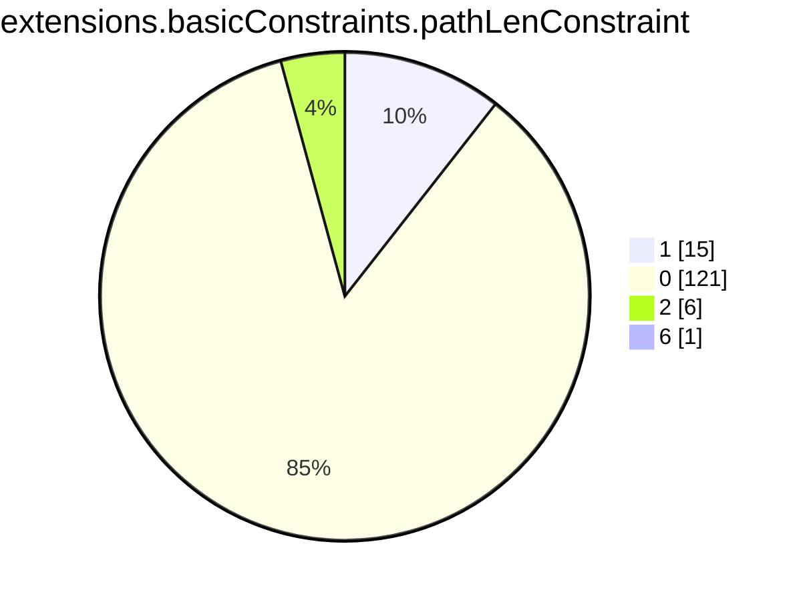
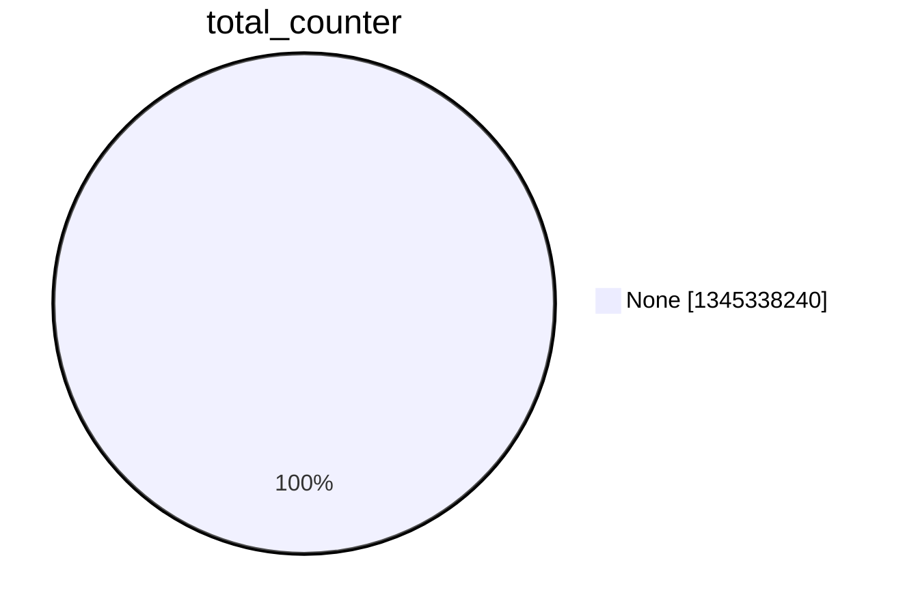
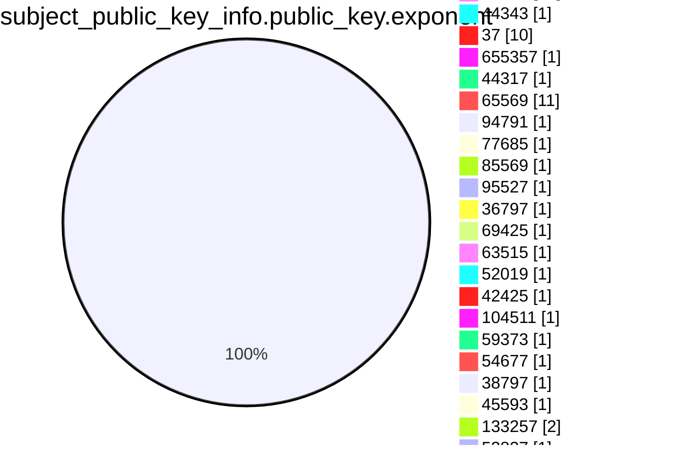
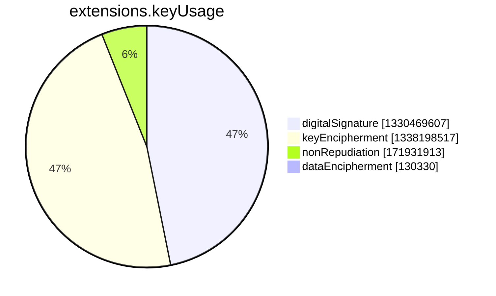
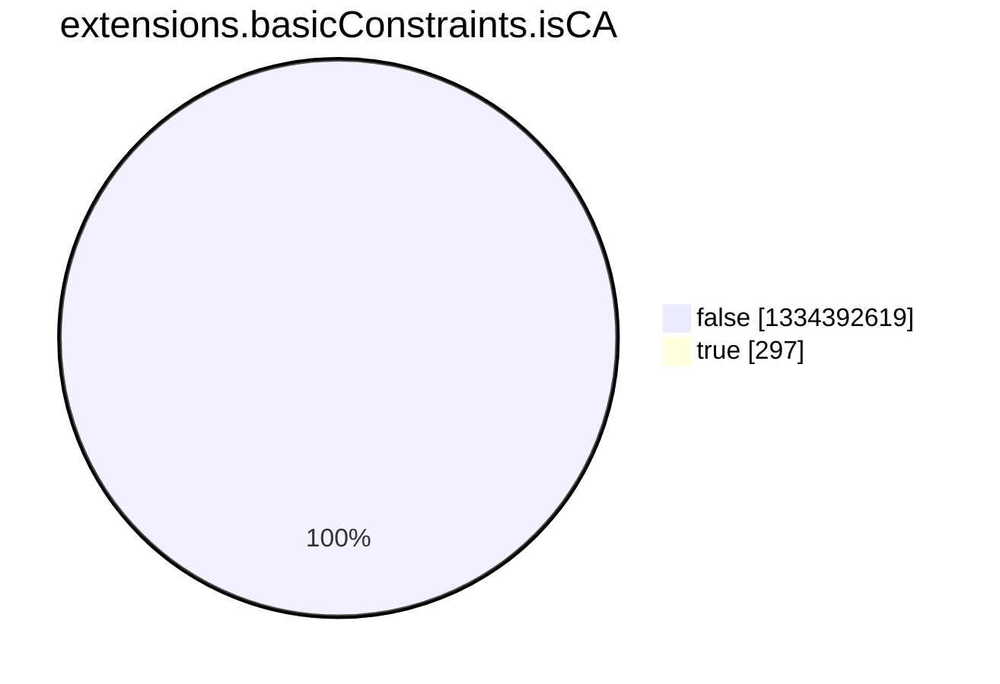
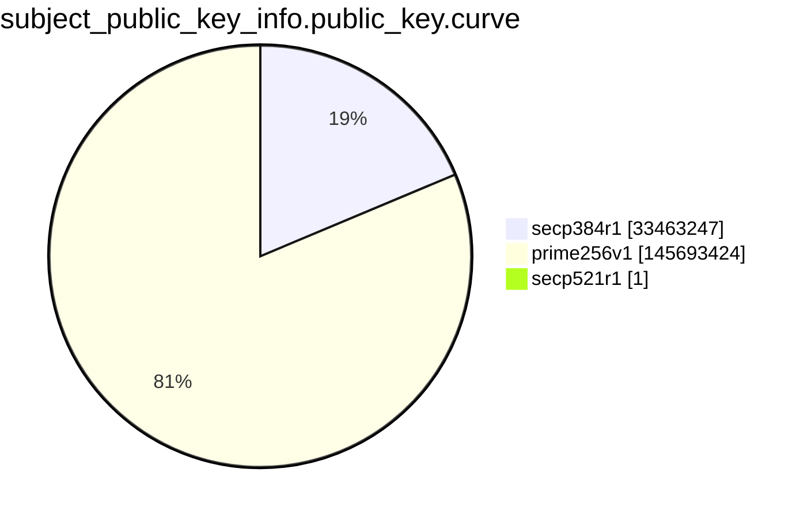
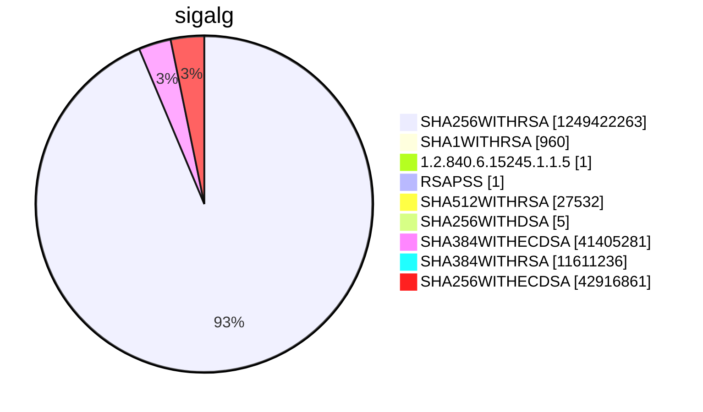

```mermaid
pie showData
title subject.cn.tld
"com" :532322425
"fr" :16480191
"mil" :4690
"gov" :161659
"ca" :7962328
"il" :1199369
"net" :50064792
"edu" :907305
"au" :9318919
"MIL" :16
"org" :31934231
"tw" :993535
"fi" :2416778
"at" :5187847
"nl" :18015575
"Mil" :1
"ORG" :628
"cc" :1635788
"ae" :319567
"sk" :1541029
"uk" :24794519
"in" :7409933
"es" :4721995
"vn" :2203999
"jp" :7155349
"lu" :329905
"no" :3442647
"dk" :3876534
"tr" :1569811
"br" :18997078
"it" :9514968
"de" :47133285
"COM" :10398
"se" :6066484
"pl" :9831131
"ru" :24817155
"li" :238233
"biz" :2826268
"co" :13866675
"be" :6266014
"eu" :8106401
"info" :6538496
"tv" :1008353
"cz" :5995141
"mx" :2711947
"cn" :5740341
"hu" :3638514
"cloud" :3099776
"si" :554021
"za" :5321971
"sa" :203870
"ro" :2382776
"us" :3513811
"ar" :2653507
"uy" :193036
"ch" :11998546
"EDU" :257
"pt" :1600572
"by" :771387
"ie" :820711
"sg" :562898
"nz" :2447300
"hk" :505140
"kr" :1546195
"ke" :420148
"AU" :224
"bn" :2561
"hr" :293361
"cat" :334720
"cw" :2880
"swiss" :75497
"gal" :21594
"berlin" :86328
"gr" :2159166
"coop" :72985
"nu" :763973
"io" :28006846
"ua" :3918093
"qa" :44341
"pe" :455080
"vc" :156307
"tools" :187659
"ee" :931588
"tech" :2970935
"CA" :146
"my" :665038
"law" :41046
"me" :13336606
"ni" :10013
"th" :396849
"np" :192870
"mo" :8308
"pro" :2472188
"cy" :63963
"digital" :706661
"ng" :617134
"rs" :531582
"one" :603937
"MY" :13
"su" :601605
"network" :345096
"cl" :2380090
"Gov" :16
"bm" :11175
"center" :208169
"int" :12618
"travel" :83253
"vip" :1227535
"science" :47678
"technology" :81520
"re" :165064
"bg" :239172
"ec" :158397
"pw" :559966
"xn--p1ai" :1728877
"gmbh" :55497
"xyz" :11933187
"dev" :4248666
"id" :3606442
"is" :435703
"ge" :142684
"ma" :287700
"blog" :329857
"bank" :21397
"online" :5578585
"club" :2275721
"ph" :347138
"fund" :115322
"sv" :25176
"lt" :737452
"studio" :512023
"ba" :79492
"group" :366726
"as" :48303
"bayern" :44641
"church" :163440
"email" :227799
"host" :297954
"tokyo" :371969
"ci" :47886
"museum" :3126
"work" :1113706
"car" :1051
"app" :4267190
"bz" :108161
"ai" :819949
"haus" :26959
"mu" :31495
"ms" :48139
"aero" :95815
"buzz" :387005
"schule" :20455
"IE" :15
"marketing" :87359
"market" :92161
"care" :113125
"dhl" :266
"rocks" :384672
"bzh" :46927
"ax" :18960
"bio" :73026
"fo" :24333
"mk" :93571
"ag" :75667
"link" :1582012
"gs" :24385
"click" :357478
"store" :2872904
"plus" :183977
"kz" :969304
"ws" :197352
"ps" :19281
"lv" :468732
"industries" :16050
"tz" :112813
"systems" :255204
"enterprises" :12522
"doctor" :9991
"global" :138948
"kw" :9951
"md" :203875
"uz" :256686
"xn--90ais" :31240
"GOV" :354
"chat" :97574
"lb" :10191
"weir" :1217
"bh" :7453
"asia" :474246
"scot" :31568
"NO" :18
"al" :88165
"academy" :165690
"jo" :10418
"film" :21457
"mt" :43927
"je" :23333
"NET" :820
"ht" :11327
"gh" :28215
"jm" :5140
"cologne" :6669
"partners" :30539
"cba" :275
"shop" :3808956
"life" :1411382
"wien" :34769
"zw" :116391
"mobi" :310327
"cm" :86976
"UK" :195
"company" :195149
"education" :94341
"condos" :2462
"name" :322931
"team" :363208
"city" :212569
"hamburg" :26863
"am" :114466
"farm" :75519
"im" :214908
"zone" :278470
"tc" :18394
"business" :92442
"komatsu" :217
"fun" :1018245
"IT" :57
"la" :189420
"mc" :13967
"cool" :133753
"JO" :11
"mg" :28752
"py" :106677
"gg" :251717
"cr" :73283
"neustar" :290
"gt" :73885
"abb" :1169
"trade" :61617
"pf" :9545
"nc" :40039
"lk" :168717
"tirol" :26223
"kh" :16489
"sr" :7354
"NL" :74
"eus" :52760
"dz" :44312
"solutions" :245315
"cd" :7827
"na" :41158
"mm" :21224
"mn" :76772
"agency" :424253
"expert" :105514
"SG" :78
"video" :103491
"HK" :62
"leclerc" :1491
"bike" :45480
"BE" :31
"tt" :8961
"brussels" :22029
"uno" :95442
"ve" :54394
"services" :200623
"training" :52958
"investments" :9653
"insure" :13988
"works" :144389
"site" :4123459
"DE" :223
"pa" :26477
"games" :157726
"do" :109201
"US" :83
"healthcare" :15573
"support" :92560
"fj" :7550
"MZ" :4
"bo" :57775
"tips" :45595
"kitchen" :22981
"ml" :1107478
"nyc" :151710
"ly" :82334
"eg" :20194
"af" :22494
"om" :11061
"house" :83982
"download" :27657
"mr" :3814
"africa" :95827
"computer" :18742
"wales" :23287
"ovh" :504716
"ad" :6310
"MX" :24
"cab" :10243
"to" :22169194
"srl" :18490
"bd" :93433
"finance" :166532
"Com" :158
"aw" :1226
"pg" :6589
"live" :1365531
"pk" :458334
"sn" :31727
"pr" :4372
"Store" :1
"ES" :105
"bt" :9906
"ao" :33037
"koeln" :38317
"news" :203966
"bid" :41273
"design" :611982
"construction" :18701
"exchange" :45169
"bw" :25349
"jobs" :32127
"mw" :5964
"vg" :9324
"ntt" :512
"az" :130070
"ki" :1555
"cfa" :22
"london" :83972
"cv" :9256
"green" :22038
"tk" :1544317
"istanbul" :7440
"mp" :3827
"hn" :20868
"money" :52236
"kg" :64013
"bb" :2987
"yoga" :40968
"software" :97308
"tn" :118181
"mz" :29275
"golf" :29491
"sh" :281023
"audio" :14350
"coffee" :76486
"directory" :29434
"community" :65382
"st" :119736
"xn--90ae" :1701
"EU" :27
"gent" :25740
"tui" :138
"ir" :2745979
"llc" :41470
"consulting" :90254
"promo" :25178
"clinic" :41657
"nrw" :29295
"sap" :21346
"earth" :68762
"sz" :4928
"top" :2752836
"GR" :32
"coach" :58027
"Biz" :33
"express" :27834
"world" :507007
"SE" :30
"ninja" :210561
"ky" :15348
"pub" :74377
"bet" :87064
"politie" :101
"amsterdam" :96521
"vig" :364
"rentals" :28629
"insurance" :872
"tours" :27260
"hockey" :2990
"xn--mgbaam7a8h" :27
"iq" :15551
"dance" :30348
"realtor" :48502
"ne" :2811
"help" :80255
"new" :9438
"ltd" :249526
"bible" :11651
"photos" :65658
"college" :7986
"legal" :43504
"SA" :56
"fm" :90863
"surf" :45759
"website" :933374
"ink" :143725
"gdn" :5473
"wiki" :71278
"MA" :12
"social" :108422
"media" :336589
"vision" :39121
"vegas" :16135
"fitness" :36868
"delivery" :35282
"auto" :3151
"today" :242387
"Net" :22
"JP" :183
"ist" :16749
"space" :1909801
"AE" :42
"date" :19711
"mv" :18899
"pn" :782
"BH" :4
"hosting" :48534
"ls" :5826
"international" :42801
"frl" :30329
"tj" :18428
"ug" :33199
"guru" :189152
"anz" :122
"game" :13093
"band" :53319
"kn" :1316
"zm" :15029
"red" :88798
"health" :78363
"wang" :44216
"moscow" :56730
"taipei" :3239
"LB" :14
"blue" :83977
"Org" :25
"schmidt" :92
"cuisinella" :18
"review" :46019
"school" :96466
"INFO" :3
"restaurant" :18311
"aig" :3
"gl" :23835
"sexy" :10861
"lamborghini" :234
"nf" :23297
"CZ" :8
"lol" :78954
"melbourne" :11852
"CBA" :13
"energy" :55844
"gi" :5240
"casa" :760652
"vu" :69777
"barclays" :61
"university" :19955
"KW" :11
"win" :318388
"careers" :18924
"cash" :67521
"gift" :17013
"yokohama" :12477
"events" :104984
"photo" :100377
"xn--9dbq2a" :827
"TW" :91
"institute" :30384
"COm" :1
"uol" :50
"DZ" :4
"tg" :8816
"ZA" :17
"salon" :16331
"cx" :84767
"vet" :33991
"tattoo" :19489
"deals" :21866
"pet" :32517
"Asia" :3
"family" :98431
"show" :73160
"tl" :9251
"pink" :26032
"repair" :14845
"rw" :39838
"edeka" :346
"bf" :6931
"ski" :16357
"productions" :31849
"xxx" :26740
"sbi" :191
"Fr" :8
"builders" :18896
"axa" :90
"career" :2062
"immo" :40206
"inc" :12471
"AO" :12
"estate" :27667
"cf" :643057
"mortgage" :4820
"stream" :62463
"direct" :4010553
"IN" :113
"capital" :68749
"BM" :1
"foundation" :53039
"aq" :519
"art" :679178
"CN" :14
"dm" :1776
"VN" :8
"sm" :7452
"limited" :15454
"sc" :24828
"glass" :8771
"parts" :11969
"memorial" :2652
"pharmacy" :770
"dental" :20965
"management" :29776
"party" :72717
"icu" :412300
"gq" :347846
"CY" :3
"pizza" :30763
"krd" :4355
"cg" :3603
"ga" :689974
"pics" :21079
"page" :1576453
"loan" :12978
"quebec" :12290
"financial" :20009
"love" :106340
"gold" :100050
"tm" :8586
"vlaanderen" :17928
"soccer" :5472
"xin" :13625
"kaufen" :7500
"apple" :45
"fit" :141252
"photography" :168489
"BANK" :2
"CH" :10
"okinawa" :17049
"ngo" :14278
"fk" :233
"shopping" :19677
"associates" :7834
"tW" :1
"lawyer" :9590
"wf" :18053
"engineering" :39955
"kyoto" :5248
"BIZ" :39
"nagoya" :14086
"microsoft" :7
"cymru" :13967
"land" :75143
"guide" :44456
"toys" :14011
"sy" :10957
"weber" :628
"WS" :5
"schwarz" :1024
"Ca" :2
"pm" :46873
"et" :15206
"fyi" :67898
"watch" :43029
"jprs" :15
"aco" :734
"sb" :4362
"ac" :55931
"onl" :36299
"wtf" :128542
"cisco" :10
"supply" :18625
"sharp" :268
"dvag" :5985
"so" :84204
"tax" :24999
"saarland" :8147
"ASIA" :8
"bs" :3461
"brother" :61
"man" :413
"rodeo" :6271
"black" :23010
"xn--o3cw4h" :774
"build" :31046
"osaka" :2902
"claims" :5414
"sakura" :14
"xbox" :4
"bing" :4
"windows" :4
"azure" :49
"hotmail" :4
"skype" :4
"office" :4
"AM" :2
"lat" :15456
"taxi" :23539
"gy" :14565
"movie" :6426
"bar" :96407
"recipes" :9229
"ice" :4
"ooo" :51207
"boats" :1886
"diamonds" :4538
"eco" :30742
"loans" :8409
"barcelona" :8387
"abudhabi" :355
"report" :31488
"reviews" :32743
"graphics" :21105
"xn--80adxhks" :21973
"bi" :14531
"holiday" :8382
"lighting" :10531
"sydney" :10366
"solar" :30707
"horse" :13251
"menu" :29110
"vi" :1260
"style" :48395
"radio" :7724
"sl" :4677
"moda" :23744
"kiwi" :27601
"archi" :12152
"bot" :8118
"CO" :19
"reisen" :7600
"xn--h2brj9c" :736
"camp" :30053
"cruises" :2184
"properties" :27949
"MU" :3
"cafe" :89378
"sale" :53469
"casino" :30814
"fashion" :37422
"florist" :22274
"vote" :11836
"monash" :85
"holdings" :12655
"ventures" :38565
"AT" :4
"boutique" :60474
"racing" :8317
"paris" :45391
"men" :37791
"realestate" :18074
"ruhr" :12311
"dj" :5827
"lc" :15748
"gallery" :65180
"ET" :13
"forsale" :9756
"observer" :4521
"sx" :14706
"clothing" :27332
"football" :11565
"rent" :19629
"ren" :22282
"allfinanz" :213
"lidl" :200
"run" :1332801
"poker" :8091
"IO" :8
"extraspace" :32
"TH" :27
"gm" :4914
"MT" :17
"bnpparibas" :290
"abbott" :921
"gop" :2682
"kim" :28393
"SBI" :9
"rest" :62747
"nr" :246
"property" :5194
"faith" :13737
"NZ" :19
"discount" :4469
"ye" :1947
"shoes" :9066
"homes" :30710
"town" :20932
"FR" :38
"codes" :103067
"engineer" :18365
"gratis" :9650
"bj" :12488
"broadway" :38
"beer" :38279
"attorney" :4030
"flights" :4067
"goog" :157971
"gn" :1777
"miami" :23118
"garden" :13565
"voyage" :6674
"camera" :8115
"best" :181131
"cleaning" :7804
"place" :32338
"BR" :75
"fan" :14506
"bingo" :4999
"dubai" :26
"study" :32431
"ikano" :239
"immobilien" :7765
"army" :14256
"post" :354
"dating" :14546
"coupons" :4547
"gifts" :15863
"Social" :3
"jewelry" :12998
"xn--80aswg" :6896
"wine" :40088
"rugby" :1093
"canon" :434
"equipment" :5983
"ck" :1291
"mh" :38
"gea" :62
"uK" :3
"tel" :70664
"tube" :15052
"gd" :34002
"catering" :6645
"Dev" :1
"domains" :32812
"seat" :225
"statefarm" :4882
"LA" :3
"PT" :6
"moe" :93229
"sport" :3300
"tienda" :5450
"mq" :1266
"furniture" :8212
"press" :47058
"cricket" :3783
"accenture" :1
"credit" :15505
"fish" :20332
"contractors" :4947
"gp" :4257
"fail" :13044
"dog" :43353
"EC" :2
"motorcycles" :1163
"DK" :79
"ANZ" :5
"cam" :66871
"futbol" :4350
"courses" :8339
"wedding" :69674
"nissan" :37
"XYZ" :4
"SK" :2
"crs" :385
"va" :66
"xfinity" :1
"bentley" :25
"comcast" :1
"xn--j1amh" :15968
"Live" :2
"pictures" :28379
"rip" :42828
"citic" :33
"plumbing" :4291
"jetzt" :31038
"cards" :26243
"FI" :29
"GH" :2
"QA" :12
"lease" :4929
"EUS" :1
"xn--90a3ac" :1996
"td" :2168
"irish" :9827
"DO" :4
"SI" :6
"sandvik" :146
"dentist" :4463
"PY" :4
"hospital" :2688
"NG" :2
"RW" :2
"jnj" :702
"limo" :3107
"madrid" :3489
"xn--ses554g" :254
"total" :253
"auction" :10367
"xn--80asehdb" :9508
"bmw" :10365
"xn--p1acf" :57750
"suzuki" :52
"NA" :1
"broker" :2999
"LONDON" :1
"xn--d1acj3b" :2436
"flowers" :4301
"lgbt" :10517
"tatamotors" :19
"aws" :3441
"cyou" :206550
"tf" :21989
"luxe" :3176
"physio" :3996
"RO" :75
"globo" :987
"rio" :4423
"vanguard" :102
"deloitte" :57
"tennis" :3890
"fans" :15981
"soy" :5564
"markets" :4686
"xn--3e0b707e" :2322
"orange" :1724
"hsbc" :43
"gives" :6324
"sd" :21774
"xn--mk1bu44c" :1338
"boston" :4495
"saxo" :93
"compare" :637
"pictet" :299
"aquarelle" :33
"mba" :13243
"woodside" :340
"nike" :39
"vacations" :5348
"ltda" :1167
"Dk" :1
"sony" :32
"foo" :129
"sucks" :763
"vin" :15210
"fishing" :3146
"singles" :5974
"cheap" :7756
"kpmg" :23
"charity" :5545
"hm" :1958
"itau" :60
"tickets" :842
"bargains" :3439
"TECH" :8
"teva" :110
"toray" :104
"ceo" :40799
"monster" :189291
"cern" :36
"jll" :29
"rehab" :5734
"cpa" :7123
"select" :302
"democrat" :2132
"yachts" :1473
"xn--c1avg" :1413
"hiphop" :811
"versicherung" :1559
"security" :3022
"realty" :155386
"audi" :1137
"TR" :2
"viajes" :3093
"xn--kpry57d" :718
"dealer" :79
"LT" :3
"sncf" :201
"fox" :542
"apartments" :8549
"nico" :62
"toyota" :91
"BN" :7
"ong" :4498
"basketball" :1351
"desi" :3283
"abc" :34
"how" :11794
"locus" :128
"baby" :11822
"contact" :17693
"xn--node" :206
"supplies" :6786
"bradesco" :237
"afl" :110
"accountants" :3198
"temasek" :12
"porn" :6134
"xn--fiqs8s" :4887
"villas" :3512
"xn--q9jyb4c" :2075
"mom" :7916
"vodka" :3093
"reise" :1434
"accountant" :2421
"luxury" :2775
"yt" :18555
"juegos" :469
"xn--6qq986b3xl" :4171
"webcam" :6202
"degree" :1549
"gay" :42462
"forex" :1084
"christmas" :2773
"ryukyu" :1541
"exposed" :5385
"navy" :4878
"republican" :2037
"cooking" :5692
"country" :2603
"tires" :2714
"theater" :4196
"joburg" :5397
"maison" :2828
"HOST" :1
"ABUDHABI" :1
"capetown" :9224
"adult" :1937
"bbva" :21
"diet" :1879
"xn--ngbc5azd" :298
"sex" :6755
"xn--io0a7i" :392
"surgery" :4646
"VIP" :1
"actor" :6112
"organic" :5625
"xn--6frz82g" :2418
"gripe" :590
"creditcard" :2418
"gf" :1143
"durban" :3477
"bond" :41557
"AR" :18
"blackfriday" :646
"xn--fiq228c5hs" :97
"kpn" :76
"crown" :2
"ME" :7
"xn--j6w193g" :2496
"autos" :8094
"voting" :119
"gw" :2963
"香港" :7
"Edu" :7
"Be" :1
"xn--3ds443g" :139
"xn--qxa6a" :103
"guitars" :1004
"tatar" :2336
"RU" :17
"xn--czr694b" :50
"ricoh" :242
"shiksha" :1286
"xn--t60b56a" :137
"abogado" :723
"sky" :255
"xn--tckwe" :3524
"KR" :3
"shell" :829
"xn--g2xx48c" :21
"KE" :7
"sarl" :4944
"nikon" :1
"cars" :1150
"storage" :1087
"honda" :48
"otsuka" :29
"CC" :2
"alsace" :6078
"pfizer" :21
"schaeffler" :1141
"gucci" :53
"lotto" :96
"xn--e1a4c" :488
"trading" :4787
"corsica" :6148
"bR" :1
"mango" :58
"bloomberg" :4
"TV" :3
"lr" :2035
"HR" :12
"airforce" :1671
"theatre" :76
"williamhill" :4
"SAP" :1
"philips" :6
"CL" :18
"bcn" :28
"jio" :27
"ID" :13
"pioneer" :33
"goo" :27
"genting" :12
"hiv" :311
"PL" :3
"cbs" :23
"xn--rhqv96g" :233
"qpon" :335
"xn--unup4y" :45
"WORLD" :1
"arpa" :5
"ismaili" :73
"bridgestone" :140
"mma" :35
"IS" :1
"erni" :49
"jcb" :36
"softbank" :54
"Global" :2
"CLOUD" :4
"STUDIO" :2
"SPACE" :4
"beauty" :19824
"lego" :28
"skin" :7547
"infiniti" :30
"MO" :2
"xn--55qx5d" :5929
"ubs" :1
"APP" :1
"hair" :7547
"quest" :66717
"kfh" :10
"makeup" :4342
"Solutions" :1
"BRADESCO" :16
"xn--fiqz9s" :285
"forum" :854
"ifm" :524
"PE" :3
"reit" :74
"ss" :903
"rich" :542
"sew" :18
"ericsson" :5
"scb" :31
"CM" :1
"lanxess" :26
"xn--fjq720a" :41
"ONLINE" :4
"XN--P1AI" :3
"godaddy" :45
"sanofi" :33
"aaa" :9
"xn--2scrj9c" :70
"next" :195
"med" :86
"BO" :1
"xn--5tzm5g" :421
"coM" :2
"xn--qxam" :2451
"AG" :8
"itv" :5
"moi" :195
"IQ" :2
"voto" :771
"amex" :1
"Health" :3
"hisamitsu" :229
"adac" :1
"EE" :1
"rwe" :2
"xn--fct429k" :1
"GAL" :1
"BZ" :5
"protection" :52
"statebank" :31
"IL" :12
"kred" :349152
"cfd" :46688
"nec" :32
"natura" :7
"gu" :139
"xn--rovu88b" :2
"xn--eckvdtc9d" :1
"xn--1ck2e1b" :1
"arab" :1
"xn--jlq480n2rg" :1
"tushu" :1
"silk" :1
"read" :1
"imdb" :1
"free" :1
"xn--ngbrx" :1
"airbus" :6
"La" :1
"call" :1
"audible" :1
"auspost" :30
"MOBI" :7
"HU" :4
"PK" :1
"SINGLES" :1
"cN" :1
"LIFE" :4
"PH" :4
"AI" :6
"CR" :1
"xn--80ao21a" :299
"BG" :1
"ZM" :2
"bbc" :19
"xn--y9a3aq" :606
"hermes" :114
"fage" :33
"samsung" :1
"creditunion" :73
"km" :386
"smart" :18
"lundbeck" :1
"kinder" :7
"xn--mgbca7dzdo" :2
"Dog" :1
"analytics" :3
"ACADEMY" :1
"City" :7
"Zone" :1
"zuerich" :1450
"sbs" :72363
"stockholm" :16
"lilly" :10
"farmers" :2
"walter" :2
"mini" :35
"JM" :1
"xn--wgbh1c" :18
"AF" :2
"clubmed" :133
"PRO" :1
"sener" :35
"xn--hxt814e" :102
"xn--czru2d" :23
"SITE" :1
"linde" :1
"guardian" :3
"zara" :10
"Video" :1
"GLOBAL" :2
"jmp" :3
"amazon" :14
"NTT" :3
"Online" :1
"GG" :4
"PF" :1
"hitachi" :39
"OM" :2
"booking" :1
"amica" :1
"SL" :4
"mattel" :431
"bms" :1
"DIGITAL" :6
"xn--kput3i" :2881
"barclaycard" :25
"QUEST" :2
"Bank" :2
"INT" :1
"bauhaus" :110
"google" :26996
"mtr" :1
"deV" :1
"GL" :1
"EMAIL" :1
"xn--d1alf" :77
"WORK" :1
"UA" :1
"xn--54b7fta0cc" :245
"KZ" :1
"Bid" :1
"ZONE" :1
"ipiranga" :9
"sas" :2
"ford" :2
"xn--mgberp4a5d4ar" :209
"xn--vuq861b" :57
"able" :4
"STORE" :1
"COOP" :3
"chintai" :12
"feedback" :837
"youtube" :260
"meet" :46
"xn--vhquv" :49
"cu" :27642
"ECO" :1
"xn--czrs0t" :89
"nra" :9
"beats" :2
"xn--mgbbh1a71e" :41
"xn--1qqw23a" :5392
"xn--xhq521b" :92
"xn--i1b6b1a6a2e" :54
"ggee" :25
"tvs" :22
"xn--pgbs0dh" :11
"chrome" :13
"xn--xkc2dl3a5ee0h" :283
"bugatti" :41
"bostik" :266
"firmdale" :777
"xn--otu796d" :27
"maif" :113
"gle" :63
"TM" :1
"xn--mgbah1a3hjkrd" :12
"xn--gckr3f0f" :28
"xn--45brj9c" :177
"xn--mgbab2bd" :39
"vivo" :29
"xn--nqv7f" :98
"xn--nqv7fs00ema" :16
"xn--mix891f" :13
"kosher" :8
"pru" :24
"stc" :23
"One" :1
"xn--ygbi2ammx" :7
"Uk" :2
"xn--mgbayh7gpa" :88
"mlb" :16
"xn--gecrj9c" :56
"xn--fpcrj9c3d" :47
"vuelos" :7
"eurovision" :9
"xn--h2breg3eve" :33
"alstom" :8
"TC" :1
"ieee" :9
"hoteles" :8
"flir" :22
"Systems" :2
"wme" :7
"passagens" :10
"omega" :15
"ses" :1
"stada" :100
"SCOT" :4
"xn--4gbrim" :26
"yandex" :187
"netflix" :8
"nowruz" :38
"CITY" :1
"Show" :1
"xn--mgba3a4f16a" :43
"redstone" :2
"lacaixa" :6
"swatch" :3
"whoswho" :16
"MR" :2
"epson" :26
"yodobashi" :24
"lixil" :11
"mitsubishi" :24
"Cloud" :3
"fujitsu" :25
"dnp" :24
"datsun" :26
"goldpoint" :21
"nhk" :24
"lotte" :27
"hyundai" :23
"panasonic" :25
"gmo" :59
"kddi" :20
"kia" :27
"arte" :52
"channel" :251
"xn--fzc2c9e2c" :23
"dabur" :24
"fairwinds" :34
"toshiba" :37
"firestone" :15
"lexus" :18
"playstation" :14
"INDUSTRIES" :1
"latrobe" :7
"citi" :7
"java" :26
"csc" :4
"xn--3hcrj9c" :39
"cancerresearch" :8
"reliance" :14
"hdfc" :17
"ril" :16
"frogans" :7
"er" :23
"praxi" :2
"xn--rvc1e0am3e" :30
"LU" :6
"Me" :2
"Space" :1
"oldnavy" :4
"rocher" :8
"athleta" :6
"helsinki" :5
"ferrero" :53
"LV" :1
"xn--s9brj9c" :35
"xn--45br5cyl" :7
"lplfinancial" :6
"lpl" :7
"fresenius" :8
"ups" :5
"Market" :1
"GE" :1
"Academy" :10
"Jo" :1
"shia" :5
"pars" :4
"tci" :6
"In" :1
"TOKYO" :1
"day" :13614
"abbvie" :20
"xn--mgbgu82a" :10
"xn--wgbl6a" :3
"gap" :3
"lancaster" :3
"xn--l1acc" :5
"bananarepublic" :1
"sandvikcoromant" :1
"xn--mgbbh1a" :2
"xn--zfr164b" :1
"imamat" :2
"caravan" :2
"xn--kprw13d" :4
```

```mermaid
pie showData
title issuer
"Google UK Ltd." :32621
"Baltimore" :11
"Cisco Systems" :732
"GeoTrust Inc." :20
"QuoVadis Trustlink Schweiz AG" :3
"DigiCert Inc" :5
"U.S. Government" :6
"Cisco" :1
"U.S. Government" :1
"MINISTERE INTERIEUR" :1
"U.S. Government" :243
"U.S. Government" :287
"Apple Inc." :59
"Carillon Information Security Inc." :6
"Starfield Technologies, Inc." :635312
"COMODO CA Limited" :1
"Symantec Corporation" :7
"Starfield Technologies, Inc." :1
"Amazon" :1
"ComSign Ltd." :1
"GlobalSign nv-sa" :1
"GlobalSign nv-sa" :1
"U.S. Government" :4
"U.S. Government" :2
"U.S. Government" :5
"Entrust" :11
"SECOM Trust.net" :7
"D-Trust GmbH" :1
"VeriSign, Inc." :12
"行政院" :7
"VeriSign, Inc." :4
"Staat der Nederlanden" :3
"Symantec Corporation" :2
"VeriSign, Inc." :2
"Inera AB" :1
"Unizeto Technologies S.A." :3
"ICP-Brasil" :2
"Vaestorekisterikeskus CA" :895
"ICP-Brasil" :2
"GlobalSign nv-sa" :7
"StartCom Ltd." :9
"QuoVadis Trustlink B.V." :4
"ANSSI" :3
"DigiCert Inc" :2
"FNMT-RCM" :3
"GlobalSign nv-sa" :3
"MINISTERE DES AFFAIRES ETRANGERES" :1
"GlobalSign" :5
"VeriSign, Inc." :2
"QuoVadis Trustlink BVBA" :3
"{'c': 'ES', 'cn': 'Autoridad de Certificacion Firmaprofesional CIF A62634068'}" :3
"MSC Trustgate.com Sdn. Bhd." :1
"Staat der Nederlanden" :10
"British Telecommunications plc" :1
"Symantec Corporation" :4
"Hellenic Academic and Research Institutions Cert. Authority" :8
"GeoTrust Inc." :2
"ComSign Ltd." :1
"thawte, Inc." :1
"National Center for Digital Certification" :1
"GlobalSign nv-sa" :2
"D-Trust GmbH" :1
"QuoVadis Limited" :57220
"Swisscom" :5
"Agence Nationale des Titres Sécurisés" :1
"QuoVadis Limited" :4
"thawte, Inc." :1
"Secretaria de Economia" :2
"VeriSign, Inc." :1
"Comodo CA Limited" :3
"QuoVadis Limited" :2
"QuoVadis Limited" :1
"JIPDEC" :3
"CertiSur S.A." :1
"VeriSign Japan K.K." :2
"IdenTrust" :2
"AC Camerfirma SA CIF A82743287" :2
"Symantec Corporation" :2
"Swisscom" :1
"Bechtel Corporation" :1
"OpenTrust" :2
"DigiCert Inc" :1
"IZENPE S.A." :3
"GlobalSign nv-sa" :1
"QuoVadis Limited" :2
"A-Trust Ges. f. Sicherheitssysteme im elektr. Datenverkehr GmbH" :1
"GlobalSign nv-sa" :2
"QuoVadis Limited" :1
"COMODO CA Limited" :1
"IZENPE S.A." :3
"Wells Fargo" :1
"LAWtrust" :1
"Symantec Corporation" :2
"Apple Inc." :14
"VeriSign, Inc." :1
"e-commerce monitoring GmbH" :1
"Symantec Corporation" :1
"DigiCert Inc" :1
"Atos" :5
"SECOM Trust Systems CO.,LTD." :1
"Swisscom" :68
"SCEE - Sistema de Certificação Electrónica do Estado" :1
"IdenTrust" :2
"QuoVadis Limited" :4
"AC Camerfirma S.A." :2
"Amazon" :5
"U.S. Government" :2
"Actalis S.p.A.-03358520967" :1
"Symantec Corporation" :1
"GlobalSign nv-sa" :179800
"QuoVadis Limited" :2
"SCEE - Sistema de Certificação Electrónica do Estado" :2
"DATEV eG" :2
"GlobalSign nv-sa" :4157
"GlobalSign nv-sa" :655606
"GlobalSign nv-sa" :14565
"DigiCert Inc" :10898020
"DigiCert Inc" :180641
"GoGetSSL" :46959
"DigiCert Inc" :339509
"TERENA" :37849
"Verein zur Foerderung eines Deutschen Forschungsnetzes e. V." :69056
"TAIWAN-CA" :46464
"Fraunhofer" :4544
"T-Systems International GmbH" :4283
"Entrust, Inc." :148759
"DigiCert Inc" :174661
"Agencia Notarial de Certificacion S.L.U. - CIF B83395988" :2
"Gandi" :181834
"Sectigo Limited" :4766715
"Symantec Corporation" :3
"GlobalSign nv-sa" :1069
"IdenTrust" :26
"GlobalSign nv-sa" :23102
"VISA" :70
"Trust Provider B.V." :21479
"GoDaddy.com, Inc." :5938116
"DigiCert Inc" :80092
"DigiCert Inc" :31222
"Entrust, Inc." :1797
"Max-Planck-Gesellschaft" :3297
"Trustwave Holdings, Inc." :10471
"SSL Corporation" :102667
"Karlsruhe Institute of Technology" :1311
"DigiCert Inc" :131698
"TERENA" :1250
"DigiCert Inc" :29857
"DigiCert Inc" :55950
"SecureCore" :8120
"Deutscher Bundestag" :97
"DigiCert Inc" :38315
"DigiCert Inc" :1288
"DigiCert Inc" :15380
"WoTrus CA Limited" :24
"Trustwave Holdings, Inc." :195
"U.S. Government" :9
"AffirmTrust" :40
"DigiCert Inc" :7921
"SECOM Trust Systems CO.,LTD." :24319
"Government of Korea" :581
"WoTrus CA Limited" :29
"Republika Slovenija" :4
"Technische Universitaet Dresden" :951
"Cisco Systems, Inc." :261763
"Chunghwa Telecom Co., Ltd." :2806
"Symantec Corporation" :3
"Swiss Government PKI" :1
"DHIMYOTIS" :3604
"SECOM Trust Systems CO.,LTD." :1409
"Wells Fargo & Company" :3865
"Sectigo Limited" :1
"Disig a.s." :427
"Trustwave Holdings, Inc." :799
"DigiCert Inc" :558
"Technische Universitaet Ilmenau" :278
"SECOM Trust Systems CO.,LTD." :10741
"SCEE" :1
"MULTICERT - Serviços de Certificação Electrónica S.A." :921
"Česká pošta, s.p." :949
"IdenTrust" :3660
"D-Trust GmbH" :15533
"Hongkong Post" :1930
"Telia Finland Oyj" :6019
"Inera AB" :1445
"TeliaSonera" :8073
"Deutsche Post AG" :1278
"Intesa Sanpaolo S.p.A." :178
"ATT Services Inc" :344
"U.S. Government" :7
"DHIMYOTIS" :1326
"GlobalSign nv-sa" :487
"D-Trust GmbH" :906
"U.S. Government" :7
"InfoCert S.p.A." :112
"Krajowa Izba Rozliczeniowa S.A." :646
"Turkiye Bilimsel ve Teknolojik Arastirma Kurumu - TUBITAK" :156
"e-commerce monitoring GmbH" :12
"Institute for Development and Research in Banking Technology" :110
"Actalis S.p.A.-03358520967" :868
"DigiCert Inc" :49837
"DigiCert Inc" :33564
"Aetna Inc" :12780
"DigiCert Inc" :2814
"DigiCert Inc" :187
"DigiCert Inc" :38
"Certinomis" :39
"Actalis S.p.A.-03358520967" :250
"DigiCert Inc" :15235
"DigiCert Inc" :2407
"A-Trust Ges. f. Sicherheitssysteme im elektr. Datenverkehr GmbH" :36
"TrustAsia Technologies, Inc." :277
"DigiCert, Inc." :6
"Microsoft Corporation" :129527
"Microsoft Corporation" :129522
"Internet2" :126760
"Microsoft Corporation" :129307
"Microsoft Corporation" :129090
"Japan Registry Services Co., Ltd." :5201
"Network Solutions L.L.C." :8909
"Sectigo Limited" :287729
"Unizeto Technologies S.A." :1230
"The Trustico Group Ltd" :3401
"DigiCert, Inc." :6
"National Institute of Informatics" :4435
"MarketWare - Soluções para Mercados Digitais, Lda." :129
"Corporation Service Company" :16640
"Apple Inc." :2207
"COMODO CA Limited" :70770
"SECOM Trust Systems CO.,LTD." :6136
"Network Solutions L.L.C." :34829
"行政院" :10476
"K Software" :163
"Globe Hosting, Inc." :21
"Unizeto Technologies S.A." :17
"Fresenius Kabi AG" :42
"HydrantID (Avalanche Cloud Corporation)" :29791
"Sectigo Limited" :574
"DigiCert Inc" :62
"Cybertrust Japan Co., Ltd." :20800
"EUNETIC GmbH" :2461
"WoTrus CA Limited" :14
"QuoVadis Trustlink BVBA" :166
"HydrantID (Avalanche Cloud Corporation)" :189
"McAfee, Inc." :411
"ACCV" :1437
"Fiducia & GAD IT AG" :130
"Atos" :2174
"Entrust, Inc." :71
"The USERTRUST Network" :23117
"Soluciones Corporativas IP, SL" :13335
"T-Systems International GmbH" :11512
"DigiCert Inc" :799
"QuoVadis Limited" :2362
"Fuji Xerox" :766
"Rede Nacional de Ensino e Pesquisa - RNP" :1003
"QuoVadis Limited" :346
"Internet2" :4065
"InfoCert S.p.A." :56
"Cybertrust Japan Co., Ltd." :9719
"DigiCert Inc" :658
"Intesa Sanpaolo S.p.A." :6
"The USERTRUST Network" :735
"GlobalSign nv-sa" :1422
"COMODO CA Limited" :89
"QuoVadis Limited" :16523
"SwissSign AG" :15560
"WoTrus CA Limited" :74
"Aristotle University of Thessaloniki" :680
"Hellenic Academic and Research Institutions Cert. Authority" :7
"Hellenic Academic and Research Institutions CA" :223
"Buypass AS-983163327" :9075
"DigiCert, Inc." :4
"IdenTrust" :1844372
"Actalis S.p.A.-03358520967" :52
"Hellenic Academic and Research Institutions Cert. Authority" :304
"Digital Trust L.L.C." :61
"NetLock Kft." :1085
"SSL Corp" :640
"Domain The Net Technologies Ltd" :730
"DigiCert Inc" :1149
"China Financial Certification Authority" :2013
"Hellenic Academic and Research Institutions Cert. Authority" :10
"Hellenic Academic and Research Institutions Cert. Authority" :5
"TRUSTCUBES LIMITED" :115
"Buypass AS-983163327" :2681
"DigiCert Inc" :26060965
"cPanel, Inc." :277924
"COMODO CA Limited" :422
"Hellenic Academic and Research Institutions Cert. Authority" :27
"Japan Registry Services Co., Ltd." :172
"AC Camerfirma S.A." :15
"AC Camerfirma S.A." :13
"DigiCert, Inc." :4
"GoGetSSL" :407
"Gandi" :282
"A-Trust Ges. f. Sicherheitssysteme im elektr. Datenverkehr GmbH" :91
"TBS INTERNET" :1723
"DigiCert Inc" :202
"{'dc': 'ca', 'cn': 'Posta CA 1'}" :1
"Corporation Service Company" :1628
"SwissSign AG" :4048
"home.pl S.A." :635
"DigiCert Inc" :289415
"TrustAsia Technologies, Inc." :10
"Institute of Accelerating Systems and Applications" :6
"Isimtescil Bilisim Anonim Sirketi" :13257
"TAIWAN-CA" :228
"Greek Universities Network (GUnet)" :21
"e-commerce monitoring GmbH" :43
"Unizeto Technologies S.A." :41
"AffirmTrust" :12
"SwissSign AG" :8333
"Firmaprofesional S.A." :111
"Sectigo Limited" :19719
"eMudhra Technologies Limited" :2327
"Hellenic Academic and Research Institutions Cert. Authority" :8
"Sectigo Limited" :1890
"Network Solutions L.L.C." :6
"Hellenic Academic and Research Institutions Cert. Authority" :48
"WISeKey" :31
"Hellenic Academic and Research Institutions CA" :29
"TI Trust Technologies S.R.L." :720
"Hellenic Academic and Research Institutions CA" :180
"Government of the District of Columbia" :421
"SECOM Trust Systems CO.,LTD." :17
"Hellenic Academic and Research Institutions Cert. Authority" :5
"DigiCert Inc" :2105
"SECOM Trust Systems CO.,LTD." :458
"SECOM Trust Systems CO.,LTD." :792
"DigiCert Inc" :316
"DigiCert Inc" :40
"DigiCert Inc" :4
"Hellenic Academic and Research Institutions CA" :66
"Netflix, Inc." :3
"D-Trust GmbH" :22
"Digi-Sign Limited" :80
"Fuji Xerox" :33
"DOMENY.PL sp. z o.o" :4428
"Hellenic Academic and Research Institutions CA" :27
"Nijimo K.K." :364
"Dodo Sign Ltd" :4
"Apple Inc." :381
"RU-Center (ЗАО Региональный Сетевой Информационный Центр)" :456
"GEANT Vereniging" :104046
"NetLock Kft." :698
"Hellenic Academic and Research Institutions CA" :5
"DigiCert Inc" :2
"DigiCert Inc" :21
"Hellenic Academic and Research Institutions CA" :27
"Hellenic Academic and Research Institutions CA" :354
"Hellenic Academic and Research Institutions CA" :72
"National Institute of Informatics" :33
"Sectigo Limited" :227
"DigiCert Inc" :59
"Agenzia per l'Italia Digitale" :24
"Hellenic Academic and Research Institutions CA" :6
"FNMT-RCM" :1001
"FUJIFILM" :282
"DigiCert Inc" :20
"TrustCor Systems S. de R.L." :6
"DigiCert Inc" :272
"Baidu, Inc." :379
"WoTrus CA Limited" :694
"Fiducia & GAD IT AG" :28
"T-Systems International GmbH" :367
"DigiCert Inc" :12
"TI Trust Technologies S.R.L." :203
"{'c': 'LV', 'ou': 'Sertifikacijas pakalpojumu dala', 'cn': 'E-ME PSI (PCA)'}" :1
"SafeToOpen Ltd" :465
"Vaestorekisterikeskus CA" :886
"CentralNic Luxembourg Sàrl" :4043
"MarketWare - Soluções para Mercados Digitais, Lda." :5
"Hellenic Academic and Research Institutions CA" :6
"成都数证科技有限公司" :1
"Hellenic Academic and Research Institutions CA" :23
"NetLock Kft." :934
"E-Tuğra EBG Bilişim Teknolojileri ve Hizmetleri A.Ş." :4133
"Shanghai Ping An Credit Reference Company Limited" :3
"Sectigo Limited" :215
"DigiCert Inc" :11
"QuoVadis Limited" :2
"QuoVadis Limited" :3
"QuoVadis Limited" :2
"Amazon" :59
"Open Access Technology International Inc" :634
"Aetna Inc" :50
"WoTrus CA Limited" :3686
"Sectigo Limited" :3
"QuoVadis Trustlink B.V." :28
"DigiCert Inc" :3
"Hongkong Post" :8
"DigiCert, Inc." :4
"China Financial Certification Authority" :425
"One Sign Pte. Ltd." :129
"E-Tuğra EBG Bilişim Teknolojileri ve Hizmetleri A.Ş." :143
"CERTDATA SERVICOS DE INFORMACAO LTDA" :26
"Sectigo Limited" :14
"IZENPE S.A." :74
"VALID CERTIFICADORA DIGITAL" :21
"Site Blindado S.A." :276
"UniTrust" :585
"eMudhra Technologies Limited" :71
"Microsec Ltd." :1008
"Microsec Ltd." :318
"GlobalSign nv-sa" :19
"GlobalSign nv-sa" :176
"Prodrive Technologies B.V." :4
"Hellenic Academic and Research Institutions CA" :17
"Comodo Japan, Inc." :313
"Domain The Net Technologies Ltd" :9
"Trustwave Holdings, Inc." :3
"Trustwave Holdings, Inc." :3
"GlobalSign nv-sa" :8994
"GlobalSign nv-sa" :2476
"LH.pl Sp. z o.o." :56
"E-Tuğra EBG Bilişim Teknolojileri ve Hizmetleri A.Ş." :41
"certSIGN" :32
"GoGetSSL" :143
"NetLock Kft." :69
"certSIGN" :350
"Baidu, Inc." :37
"DigiCert Inc" :6830
"IZENPE S.A." :216
"Global Digital Cybersecurity Authority Co., Ltd." :16
"GEANT Vereniging" :31
"VALID CERTIFICADORA DIGITAL" :9
"Trust Provider B.V." :491
"Hellenic Academic and Research Institutions CA" :17
"SecureCore" :307
"MarketWare - Soluções para Mercados Digitais, Lda." :112
"VALID CERTIFICADORA DIGITAL" :5
"EDICOM" :27
"Hellenic Academic and Research Institutions Cert. Authority" :5
"DigiCert Inc" :36
"DigiCert Inc" :79
"DigiCert Inc" :62
"TrustCor Systems S. de R.L." :5498
"UniTrust" :73
"Agence Nationale de Certification Electronique" :85
"COMODO CA Limited" :7
"WISeKey" :1037
"SERVICE-PUBLIC GOUV MINISTERE EN CHARGE DE L'AGRICULTURE" :1
"DigiCert Inc" :1291
"DigiCert Inc" :5676
"Apple Inc." :30
"DigiCert Inc" :832
"Actalis S.p.A." :640156
"Actalis S.p.A." :7195
"Actalis S.p.A." :817
"BitCert" :150
"Deutsche Post AG" :2445
"Global Digital Cybersecurity Authority Co., Ltd." :224
"TrustOcean Limited" :92
"Government of Korea" :125
"Hellenic Academic and Research Institutions CA" :22
"Certinomis" :5
"Corporation Service Company" :44
"DigiCert Inc" :1072452
"DigiCert Inc" :2
"Aetna Inc" :2
"Apple Inc." :1
"The Trustico Group Ltd" :2
"Japan Registry Services Co., Ltd." :1661
"Japan Registry Services Co., Ltd." :78333
"HydrantID (Avalanche Cloud Corporation)" :2162
"DigiCert Inc" :2
"DigiCert Inc" :591364
"QuoVadis Trustlink B.V." :10511
"QuoVadis Trustlink B.V." :3604
"DigiCert Inc" :127
"TrustSign Certificadora Dig. & Soluções Segurança da Inf. Ltda." :533
"POSTA" :1
"Fiducia & GAD IT AG" :172
"GlobalSign nv-sa" :379682
"Microsec Ltd." :334
"Microsec Ltd." :343
"GEANT Vereniging" :3343
"Beijing Xinchacha Credit Management Co., Ltd." :2
"Microsec Ltd." :333
"Microsec Ltd." :297
"DigiCert, Inc." :4
"DigiCert Inc" :64
"TrustAsia Technologies, Inc." :2
"GlobalSign nv-sa" :103
"Fiducia & GAD IT AG" :45
"CrowdStrike, Inc." :4
"NETLOCK Ltd." :32
"KICA" :17
"SOLUTI - SOLUCOES EM NEGOCIOS INTELIGENTES S-A" :1
"VISA" :33
"TrustOcean Ltd." :13
"Shanghai Ping An Credit Reference Company Limited" :5
"Root Networks, LLC" :3
"WebNIC" :11
"Sectigo Limited" :4
"Entrust, Inc." :2
"SSLs.com" :1
"SSL.com" :84
"GEANT Vereniging" :3
"Ziwit" :1
"Global Digital Cybersecurity Authority Co., Ltd." :4
"AC Camerfirma SA" :2
"GlobalSign nv-sa" :118582
"GlobalSign nv-sa" :14387
"SOLUTI - SOLUCOES EM NEGOCIOS INTELIGENTES S-A" :75
"VALID CERTIFICADORA DIGITAL" :557
"Amazon" :19522341
"DigiCert Inc" :2625131
"DigiCert Inc" :618559
"TrustAsia Technologies, Inc." :1581178
"DigiCert Inc" :70753
"DigiCert Inc" :41679
"ATT Services Inc" :3278
"Rede Nacional de Ensino e Pesquisa - RNP" :2744
"SOLUTI - SOLUCOES EM NEGOCIOS INTELIGENTES S-A" :54
"VALID CERTIFICADORA DIGITAL" :143
"Apple Inc." :809
"Apple Inc." :2160
"DigiCert Inc" :196
"DigiCert Inc" :2951
"KPN B.V." :11226
"swissns GmbH" :247
"Apple Inc." :306
"Apple Inc." :86
"TrustAsia Technologies, Inc." :952
"GlobalSign nv-sa" :93
"CrowdStrike Inc." :132
"DigiCert Inc" :255
"VALID CERTIFICADORA DIGITAL" :77
"Apple Inc." :97
"DigiCert Grid" :5
"DigiCert Inc" :22
"Internet2" :1583
"QuoVadis Limited" :107
"Apple Inc." :30
"DigiCert Inc" :5
"Anson Network Limited" :28
"DigiCert Inc" :17
"QuoVadis Trustlink B.V." :8066
"DigiCert Inc" :10885
"Fresenius Kabi AG" :89
"SECOM Trust Systems CO.,LTD." :21962
"SECOM Trust Systems CO.,LTD." :126
"Alpiro s.r.o." :2813
"HydrantID (Avalanche Cloud Corporation)" :839065
"Microsoft Corporation" :1467379
"Microsoft Corporation" :1473944
"TrustAsia Technologies, Inc." :25792
"Cloudflare, Inc." :42805858
"Plex, Inc." :956757
"Cloudflare, Inc." :8454447
"DigiCert Inc" :295
"FNMT-RCM" :797
"ICP-Brasil" :1505
"nazwa.pl sp. z o.o." :2954
"DigiCert Inc" :11
"Microsoft Corporation" :2814032
"Microsoft Corporation" :2769474
"Microsoft Corporation" :2921639
"Microsoft Corporation" :2974869
"Financijska agencija" :311
"TrustAsia Technologies, Inc." :40
"Firmaprofesional S.A." :95
"CERTSIGN SA" :11
"DigiCert Inc" :6
"QuoVadis Trustlink B.V." :1304
"D-Trust GmbH" :77
"TrustAsia Technologies, Inc." :57
"SOLUTI - SOLUCOES EM NEGOCIOS INTELIGENTES S-A" :25
"Kingnet Information Technology Co., Ltd." :2
"D-Trust GmbH" :1
"DigiCert Inc" :7
"DigiCert, Inc." :2
"DigiCert, Inc." :2
"Hellenic Academic and Research Institutions CA" :17
"DigiCert, Inc." :2
"DigiCert, Inc" :2
"DigiCert, Inc" :3
"DigiCert, Inc" :2
"DigiCert, Inc" :3
"DigiCert, Inc." :2
"DigiCert, Inc." :2
"DigiCert, Inc." :2
"DigiCert, Inc." :2
"DigiCert Inc" :5
"U.S. Government" :1
"SSL Corp" :24
"DigiCert, Inc." :3
"DigiCert, Inc." :20
"DigiCert, Inc." :20
"DigiCert, Inc." :4
"DigiCert, Inc." :13
"DigiCert Inc" :17
"TSCP Inc." :1
"TrustAsia Technologies, Inc." :4
"COMODO CA Limited" :2641
"Gehirn Inc." :24
"DigiCert, Inc." :3
"Apple Inc." :25
"Vaestorekisterikeskus CA" :4
"Deutsche Kreditbank AG" :164
"http:--repository.eid.belgium.be-" :2
"TAIWAN-CA" :1
"Genious Communications" :1052
"Actalis S.p.A.-03358520967" :1
"Unizeto Technologies S.A." :2
"Apple Inc." :26
"Trustwave Holdings, Inc." :1
"ZeroSSL" :18700
"GlobalSign nv-sa" :10
"cPanel, Inc." :70
"VALID CERTIFICADORA DIGITAL" :4
"Dreamcommerce S.A." :168
"Quantum CA Limited" :2890
"Hellenic Academic and Research Institutions Cert. Authority" :45
"CertiPath" :2
"AC CAMERFIRMA S.A." :2
"Quantum CA Limited" :19
"Apple Inc." :31
"DigiCert Inc" :56
"Quantum CA Limited" :30
"e-commerce monitoring GmbH" :15
"Firmaprofesional S.A." :1243
"Amazon" :4
"Amazon" :4
"Amazon" :4
"Amazon" :4
"DigiCert Inc" :13
"Hellenic Academic and Research Institutions CA" :5
"WidePoint" :12
"National Infrastructures for Research and Technology" :5
"Quantum CA Limited" :595
"CrowdStrike, Inc." :17
"DigiCert Inc" :3
"GoGetSSL" :3
"Microsoft Corporation" :42
"Microsoft Corporation" :38
"UniTrust" :5
"TBS INTERNET" :64
"DigiCert, Inc." :2
"První certifikační autorita, a.s." :3
"Beijing Xinchacha Credit Management Co., Ltd." :17
"Root Networks, LLC" :67
"DigiCert Inc" :15
"cPanel, Inc." :283
"CERTDATA SERVICOS DE INFORMACAO LTDA" :27
"Quantum CA Limited" :3
"iTrusChina Co., Ltd." :11
"GEANT Vereniging" :1385
"Abitab S.A." :3
"UniTrust" :2
"DigiCert Inc" :107596
"Quantum CA Limited" :2
"Open Access Technology International Inc" :699
"United SSL Deutschland GmbH" :12
"FNMT-RCM" :49
"FNMT-RCM" :249
"The Trustico Group Ltd" :48
"DOMENY.PL sp. z o.o" :171
"CertCloud Pte. Ltd." :62
"Sectigo (Europe) SL" :1
"Digital Trust L.L.C." :49
"Ziwit" :47
"ITSO LTD" :25
"sslTrus" :136
"DNEncrypt, Inc" :93
"TrustOcean Limited" :77
"DigiCert Inc" :2
"IdenTrust" :32
"WebSpace-Forum e.K." :6
"GEANT Vereniging" :1
"Nijimo K.K." :85
"TrustOcean Limited" :5
"EUNETIC GmbH" :46
"NAVER BUSINESS PLATFORM Corp." :22
"TrustAsia Technologies, Inc." :12
"sslTrus" :72
"Alpiro s.r.o." :6
"Omit Security, Inc" :3
"eMudhra Technologies Limited" :3
"Digital Trust L.L.C." :16
"WebSpace-Forum e.K." :6
"e-commerce monitoring GmbH" :8
"e-commerce monitoring GmbH" :10
"Actalis S.p.A." :2
"Alpiro s.r.o." :6
"Ziwit" :4
"Gehirn Inc." :2
"Beijing Xinchacha Credit Management Co., Ltd." :5
"COMODO CA Limited" :25979
"COMODO CA Limited" :30325
"Staclar, Inc." :87
"SSL Corp" :5
"Turing Crypto GmbH" :7
"Turing Crypto GmbH" :3
"VTB BANK (PJSC)" :5
"联通智慧安全科技有限公司" :12
"VTB BANK (PJSC)" :18
"VTB BANK (PJSC)" :6
"联通智慧安全科技有限公司" :10
"联通智慧安全科技有限公司" :8
"Google UK Ltd." :8
"Nijimo K.K." :2
"ICP-Brasil" :138
"ICP-Brasil" :4
"D-Trust GmbH" :2
"D-Trust GmbH" :2
"Buypass AS-983163327" :243192
"Hellenic Academic and Research Institutions CA" :5
"TrustCor Systems S. de R.L." :5
"Yandex LLC" :14
"ZeroSSL" :2849
"BitCert" :3
"Hellenic Academic and Research Institutions CA" :8
"Hellenic Academic and Research Institutions CA" :8
"Hellenic Academic and Research Institutions CA" :6
"Hellenic Academic and Research Institutions CA" :6
"Microsoft Corporation" :3827
"Microsoft Corporation" :3688
"Alibaba Cloud Computing Co., Ltd." :98
"IdenTrust" :3
"Verokey" :1
"ANF Autoridad de Certificacion" :2
"The USERTRUST Network" :2
"NETLOCK Ltd." :2
"WoTrus CA Limited" :2
"TrustOcean Ltd." :2
"DigiCert Inc" :1
"GlobalSign nv-sa" :35554
"Microsoft Corporation" :34
"Microsoft Corporation" :3237
"Microsoft Corporation" :3212
"The Trustico Group Ltd" :2
"DigiCert, Inc." :5
"DigiCert, Inc." :3
"GlobalSign nv-sa" :4067
"GlobalSign nv-sa" :69
"DigiCert, Inc." :4
"DigiCert, Inc." :4
"Abitab S.A." :2
"Prodrive Technologies B.V." :5
"eMudhra Technologies Limited" :53
"eMudhra Inc" :5
"eMudhra Inc" :5
"eMudhra Technologies Limited" :9
"eMudhra Inc" :5
"eMudhra Technologies Limited" :5
"eMudhra Inc" :6
"eMudhra Technologies Limited" :5
"NETLOCK Kft." :1562
"COMODO CA Limited" :4
"GlobalSign nv-sa" :4
"GlobalSign nv-sa" :4
"GlobalSign nv-sa" :4
"UniTrust" :62
"UniTrust" :415
"Bloomberg LP" :2
"INTEGRITY Security Services LLC" :2
"SwissSign AG" :2194
"SwissSign AG" :1193
"SwissSign AG" :4227
"CerSign Technology Limited" :39
"CerSign Technology Limited" :3
"PSW GROUP GmbH & Co. KG" :1
"Telia Finland Oyj" :34
"Telia Finland Oyj" :37
"BitCert" :1
"Google Trust Services LLC" :9315687
"Google Trust Services LLC" :6345197
"Let's Encrypt" :1137666813
"Deutsche Telekom Security GmbH" :19
"Google Trust Services LLC" :54097
"e-commerce monitoring GmbH" :5
"e-commerce monitoring GmbH" :5
"e-commerce monitoring GmbH" :6
"DigiCert Inc" :11
"Network Solutions L.L.C." :1
"Let's Encrypt" :40734514
"Entrust, Inc." :20
"SECOM Trust Systems CO.,LTD." :5
"SECOM Trust Systems CO.,LTD." :5
"INTEGRITY Security Services LLC" :1
"sslTrus" :2
"Alpiro s.r.o." :1
"EDICOM CAPITAL SL" :3
"Google Trust Services LLC" :6
"National Digital Certification Agency" :5
"U.S. Government" :7
"TrustOcean Limited" :4
"Google Trust Services LLC" :18
"Google Trust Services LLC" :10
"Google Trust Services LLC" :8
"Google Trust Services LLC" :8
"Google Trust Services LLC" :8
"CertCloud Pte. Ltd." :1
"E-SAFER CONSULTORIA EM TECNOLOGIA DA INFORMACAO LTDA" :45
"Gehirn Inc." :3
"Apple Inc." :25
"ZoTrus Technology Limited" :3
"GoGetSSL" :3
"Digital Trust L.L.C." :2
"ZoTrus Technology Limited" :1
"DigiCert, Inc." :1
"Agenzia per l'Italia Digitale" :2
"ICP-Brasil" :5
"Hao Quang Viet Software Company Limited" :105
"Abitab S.A." :1
"AS Sertifitseerimiskeskus" :4
"AS Sertifitseerimiskeskus" :4
"Staat der Nederlanden" :8
"DHIMYOTIS" :1
"Unizeto Technologies S.A." :2
"Asseco Data Systems S.A." :1
"Fuji Xerox" :3
"Asseco Data Systems S.A." :1
"KPN B.V." :4
"Global Digital Cybersecurity Authority Co., Ltd." :2
"Global Digital Cybersecurity Authority Co., Ltd." :1
"T-Systems Enterprise Services GmbH" :2
"DHIMYOTIS" :1
"Cybertrust Japan Co.,Ltd." :1
"Kingnet Information Technology Co., Ltd." :1
"Kingnet Information Technology Co., Ltd." :1
"LuxTrust S.A." :1
"Entrust" :2
"Nyatwork Communication Ltd" :1
"iTrusChina Co., Ltd." :1
"Hongkong Post" :2
"Hongkong Post" :2
"WoSign eCommerce Services Limited" :1
"WoSign CA Limited" :2
"WoSign CA Limited" :2
"WoSign CA Limited" :1
"Hongkong Post" :2
"GUANG DONG CERTIFICATE AUTHORITY CO.,LTD." :2
"GlobalSign" :2
"WoSign CA Limited" :1
"GlobalSign" :2
"WoSign CA Limited" :1
"ACCV" :1
"Agencia Notarial de Certificacion S.L.U. - CIF B83395988" :1
"AffirmTrust" :1
"AffirmTrust" :5
"Agencia Notarial de Certificacion S.L.U. - CIF B83395988" :1
"ANF Autoridad de Certificacion" :1
"AffirmTrust" :1
"AffirmTrust" :1
"AffirmTrust" :1
"AffirmTrust" :1
"AffirmTrust" :1
"AffirmTrust" :1
"ANF Autoridad de Certificacion" :1
"Agence Nationale des Titres Sécurisés" :2
"WoSign CA Limited" :1
"Agence Nationale des Titres Sécurisés" :2
"ANF Autoridad de Certificacion" :1
"Apple Inc." :12
"AC CAMERFIRMA S.A." :1
"Republika Slovenija" :2
"AC Camerfirma S.A." :1
"AC CAMERFIRMA S.A." :1
"AC CAMERFIRMA S.A." :1
"AC Camerfirma S.A." :1
"AC CAMERFIRMA S.A." :1
"DigitalSign Certificadora Digital" :1
"AC Camerfirma S.A." :1
"AC Camerfirma S.A." :1
"AC CAMERFIRMA S.A." :1
"AC CAMERFIRMA S.A." :1
"CONSORCI ADMINISTRACIO OBERTA DE CATALUNYA" :1
"Agencia Catalana de Certificacio (NIF Q-0801176-I)" :1
"ZETES SA (VATBE-0408425626)" :2
"GOV" :1
"U.S. Government" :1
"{'c': 'BE', 'cn': 'Foreigner CA', 'serialnumber': '201607'}" :1
"http:--repository.eid.belgium.be-" :1
"{'c': 'BE', 'cn': 'Foreigner CA', 'serialnumber': '201606'}" :1
"{'c': 'BE', 'cn': 'Citizen CA', 'serialnumber': '201506'}" :1
"{'c': 'BE', 'cn': 'Citizen CA', 'serialnumber': '201606'}" :1
"{'c': 'BE', 'cn': 'Citizen CA', 'serialnumber': '201626'}" :1
"{'c': 'BE', 'cn': 'Citizen CA', 'serialnumber': '201602'}" :1
"{'c': 'BE', 'cn': 'Citizen CA', 'serialnumber': '201510'}" :1
"{'c': 'BE', 'cn': 'Citizen CA', 'serialnumber': '201505'}" :1
"{'c': 'BE', 'cn': 'Citizen CA', 'serialnumber': '201609'}" :1
"http:--repository.eid.belgium.be-" :1
"{'c': 'BE', 'cn': 'Citizen CA', 'serialnumber': '201406'}" :1
"{'c': 'BE', 'cn': 'Citizen CA', 'serialnumber': '201508'}" :1
"{'c': 'BE', 'cn': 'Citizen CA', 'serialnumber': '201607'}" :1
"{'c': 'BE', 'cn': 'Citizen CA', 'serialnumber': '201503'}" :1
"{'c': 'BE', 'cn': 'Citizen CA', 'serialnumber': '201601'}" :1
"{'c': 'BE', 'cn': 'Citizen CA', 'serialnumber': '201608'}" :1
"{'c': 'BE', 'cn': 'Citizen CA', 'serialnumber': '201625'}" :1
"{'c': 'BE', 'cn': 'Citizen CA', 'serialnumber': '201404'}" :1
"{'c': 'BE', 'cn': 'Citizen CA', 'serialnumber': '201624'}" :1
"http:--repository.eid.belgium.be-" :1
"{'c': 'BE', 'cn': 'Citizen CA', 'serialnumber': '201604'}" :1
"{'c': 'BE', 'cn': 'Foreigner CA', 'serialnumber': '201608'}" :1
"{'c': 'BE', 'cn': 'Citizen CA', 'serialnumber': '201507'}" :1
"{'c': 'BE', 'cn': 'Citizen CA', 'serialnumber': '201502'}" :1
"http:--repository.eid.belgium.be-" :1
"{'c': 'BE', 'cn': 'Citizen CA', 'serialnumber': '201403'}" :1
"{'c': 'BE', 'cn': 'Citizen CA', 'serialnumber': '201511'}" :1
"http:--repository.eid.belgium.be-" :1
"{'c': 'BE', 'cn': 'Citizen CA', 'serialnumber': '201512'}" :1
"{'c': 'BE', 'cn': 'Citizen CA', 'serialnumber': '201610'}" :1
"{'c': 'BE', 'cn': 'Citizen CA', 'serialnumber': '201634'}" :1
"{'c': 'BE', 'cn': 'Citizen CA', 'serialnumber': '201405'}" :1
"{'c': 'BE', 'cn': 'Citizen CA', 'serialnumber': '201504'}" :1
"{'c': 'BE', 'cn': 'Citizen CA', 'serialnumber': '201409'}" :1
"Entrust, Inc." :1
"http:--repository.eid.belgium.be-" :1
"{'c': 'BE', 'cn': 'Citizen CA', 'serialnumber': '201632'}" :1
"eMudhra Consumer Services Limited" :1
"http:--repository.eid.belgium.be-" :1
"{'c': 'BE', 'cn': 'Citizen CA', 'serialnumber': '201629'}" :1
"{'c': 'BE', 'cn': 'Citizen CA', 'serialnumber': '201633'}" :1
"Entrust, Inc." :1
"Entrust, Inc." :1
"{'c': 'BE', 'cn': 'Citizen CA', 'serialnumber': '201621'}" :1
"{'c': 'BE', 'cn': 'Citizen CA', 'serialnumber': '201630'}" :1
"{'c': 'BE', 'cn': 'Citizen CA', 'serialnumber': '201623'}" :1
"{'c': 'BE', 'cn': 'Citizen CA', 'serialnumber': '201509'}" :1
"{'c': 'BE', 'cn': 'Belgium Root CA4'}" :1
"{'c': 'BE', 'cn': 'Citizen CA', 'serialnumber': '201407'}" :1
"{'c': 'BE', 'cn': 'Citizen CA', 'serialnumber': '201605'}" :1
"{'c': 'BE', 'cn': 'Citizen CA', 'serialnumber': '201603'}" :1
"Entrust, Inc." :1
"http:--repository.eid.belgium.be-" :1
"eMudhra Inc" :1
"{'c': 'BE', 'cn': 'Citizen CA', 'serialnumber': '201628'}" :1
"{'c': 'BE', 'cn': 'Citizen CA', 'serialnumber': '201410'}" :1
"eMudhra Technologies Limited" :1
"{'c': 'BE', 'cn': 'Citizen CA', 'serialnumber': '201408'}" :1
"http:--repository.eid.belgium.be-" :1
"eMudhra Inc" :1
"{'c': 'BE', 'cn': 'Citizen CA', 'serialnumber': '201627'}" :1
"http:--repository.eid.belgium.be-" :1
"Entrust, Inc." :2
"Financijska agencija" :1
"{'c': 'BE', 'cn': 'Citizen CA', 'serialnumber': '201501'}" :1
"Entrust, Inc." :1
"eMudhra Technologies Limited" :1
"{'c': 'BE', 'cn': 'Citizen CA', 'serialnumber': '201631'}" :1
"{'c': 'BE', 'cn': 'Citizen CA', 'serialnumber': '201622'}" :1
"Entrust, Inc." :1
"Entrust, Inc." :1
"Trustis Limited" :1
"NETLOCK Ltd." :1
"Gehirn Inc." :1
"MULTICERT - Serviços de Certificação Electrónica S.A." :1
"SECOM Trust Systems CO.,LTD." :3
"GlobalSign nv-sa" :2
"GlobalSign nv-sa" :2
"The Go Daddy Group, Inc." :1
"Buypass AS-983163327" :2
"GlobalSign nv-sa" :2
"FNMT-RCM" :1
"GlobalSign nv-sa" :3
"ARGE DATEN - Austrian Society for Data Protection" :1
"GlobalSign nv-sa" :2
"GlobalSign nv-sa" :2
"Hellenic Academic and Research Institutions Cert. Authority" :2
"První certifikační autorita, a.s." :1
"Hellenic Academic and Research Institutions Cert. Authority" :4
"Hellenic Academic and Research Institutions Cert. Authority" :4
"Hellenic Academic and Research Institutions Cert. Authority" :2
"Hellenic Academic and Research Institutions Cert. Authority" :4
"Hellenic Academic and Research Institutions Cert. Authority" :4
"Keynectis" :1
"e-commerce monitoring GmbH" :1
"GlobalSign nv-sa" :2
"Buypass AS-983163327" :2
"Siemens" :1
"MULTICERT - Serviços de Certificação Electrónica S.A." :1
"První certifikační autorita, a.s." :2
"Symantec Corporation" :2
"Entrust" :12
"Hellenic Academic and Research Institutions Cert. Authority" :4
"National Center for Digital Certification" :1
"Česká pošta, s.p." :2
"QuoVadis Limited" :3
"Hellenic Academic and Research Institutions Cert. Authority" :2
"Electronic Transactions Development Agency (Public Organization)" :1
"GlobalSign nv-sa" :3
"Siemens" :1
"XRamp Security Services Inc" :1
"První certifikační autorita, a.s." :1
"Verein zur Foerderung eines Deutschen Forschungsnetzes e. V." :1
"Česká pošta, s.p. [IČ 47114983]" :1
"Trustwave Holdings, Inc." :1
"SSL Corporation" :3
"Sistema Nacional de Certificacion Electronica" :1
"Staat der Nederlanden" :4
"SSL Corporation" :3
"WISeKey" :1
"Trustwave Holdings, Inc." :1
"WISeKey" :1
"Siemens" :1
"SSL Corporation" :3
"První certifikační autorita, a.s." :2
"TÜRKTRUST Bilgi İletişim ve Bilişim Güvenliği Hizmetleri A.Ş." :1
"První certifikační autorita, a.s." :1
"Siemens" :1
"Starfield Technologies, Inc." :1
"QuoVadis Limited" :1
"Hellenic Academic and Research Institutions Cert. Authority" :4
"FNMT-RCM" :1
"U.S. Government" :1
"SSL Corporation" :2
"Trustwave Holdings, Inc." :1
"Microsoft Corporation" :1
"TeliaSonera" :6
"e-commerce monitoring GmbH" :1
"Shenzhen Digital Certificate Authority Center Co., Ltd" :1
"QuoVadis Trustlink Deutschland GmbH" :1
"SecureTrust Corporation" :1
"Shanghai Ping An Credit Reference Company Limited" :1
"Starfield Technologies, Inc." :1
"Siemens" :1
"SecureTrust Corporation" :1
"TÜRKTRUST Bilgi İletişim ve Bilişim Güvenliği Hizmetleri A.Ş." :1
"T-Systems Enterprise Services GmbH" :2
"WISeKey" :1
"Shenzhen Digital Certificate Authority Center Co., Ltd" :1
"Unizeto Sp. z o.o." :1
"Pardazeshgaran Shahr Hooshmand Yekta Co." :1
"Thai Digital ID Company Limited" :1
"thawte, Inc." :2
"thawte, Inc." :2
"DigiCert, Inc." :2
"SECOM Trust Systems CO.,LTD." :3
"SECOM Trust Systems CO.,LTD." :3
"Asseco Data Systems S.A." :1
"Shenzhen Digital Certificate Authority Center Co., Ltd" :1
"Telia Finland Oyj" :6
"Hellenic Academic and Research Institutions Cert. Authority" :4
"Siemens" :1
"Asseco Data Systems S.A." :1
"Pardazeshgaran Shahr Hooshmand Yekta Co." :1
"GAD EG" :1
"WoSign CA Limited" :1
"WISeKey" :1
"WoSign CA Limited" :1
"Microsoft Corporation" :1
"QuoVadis Limited" :1
"CONSEJO GENERAL DE LA ABOGACIA" :1
"Cisco" :1
"Symantec Corporation" :2
"WoTrus CA Limited" :1
"DigiCert, Inc." :1
"U.S. Government" :1
"Unizeto Technologies S.A." :1
"Unizeto Technologies S.A." :1
"U.S. Government" :4
"Google Trust Services LLC" :22212
"3S2N Sp. z o.o." :1
"AS Sertifitseerimiskeskus" :4
"Unizeto Technologies S.A." :1
"Unizeto Technologies S.A." :1
"CrossTrust" :3
"Unizeto Technologies S.A." :1
"CrossTrust" :3
"Japan Registry Services Co., Ltd." :3
"FreeBit Co.,Ltd." :3
"Unizeto Technologies S.A." :1
"FUJIFILM" :3
"FreeBit Co.,Ltd." :3
"Japan Registry Services Co., Ltd." :3
"Fuji Xerox" :3
"GAZINFORMSERVICE Company limited" :1
"EnVers Group SIA" :1
"KDDI Web Communications Inc." :3
"KDDI Web Communications Inc." :3
"INTEC INC." :6
"Nijimo, Inc." :3
"SECOM Trust Systems CO.,LTD." :3
"National Institute of Informatics" :3
"NetArt Spółka Akcyjna S.K.A." :1
"nazwa.pl S.A." :2
"Nijimo, Inc." :3
"Actalis S.p.A.-03358520967" :1
"WoSign CA Limited" :2
"WoSign CA Limited" :2
"Hongkong Post" :6
"WoSign CA Limited" :2
"WoSign CA Limited" :2
"WoSign CA Limited" :2
"Inera AB" :29
"WoSign CA Limited" :2
"WoSign CA Limited" :2
"WoSign CA Limited" :2
"WoSign CA Limited" :2
"WoSign CA Limited" :2
"WoSign CA Limited" :2
"WoSign CA Limited" :2
"WoSign CA Limited" :2
"WoSign CA Limited" :2
"WoSign CA Limited" :2
"WoSign CA Limited" :2
"WoSign CA Limited" :2
"WoSign CA Limited" :2
"WoSign CA Limited" :2
"WoSign CA Limited" :2
"Global Digital Cybersecurity Authority Co., Ltd." :2
"东方新诚信数字认证中心" :2
"WoSign CA Limited" :2
"WoSign CA Limited" :2
"Global Digital Cybersecurity Authority Co., Ltd." :2
"WoSign CA Limited" :2
"{'dc': 'va', 'ou': 'PKI', 'cn': 'Veterans Affairs User CA B1'}" :1
"WoSign CA Limited" :2
"WoSign CA Limited" :2
"WoSign CA Limited" :2
"WoSign CA Limited" :2
"WoSign CA Limited" :2
"WoSign CA Limited" :2
"WoSign CA Limited" :2
"WoSign CA Limited" :2
"Qihoo 360 Technology Limited" :2
"WoSign CA Limited" :2
"WoSign CA Limited" :2
"WoSign CA Limited" :2
"WoSign CA Limited" :2
"WoSign CA Limited" :2
"WoSign CA Limited" :2
"上海凭安征信服务有限公司" :2
"WoSign CA Limited" :2
"Agencia Notarial de Certificacion S.L.U. - CIF B83395988" :1
"WoSign CA Limited" :2
"WoSign CA Limited" :2
"Agencia Notarial de Certificacion S.L.U. - CIF B83395988" :1
"ICP-Brasil" :1
"WoSign CA Limited" :5
"ACCV" :1
"WoSign CA Limited" :2
"Global Digital Cybersecurity Authority Co., Ltd." :2
"广州市电子签名中心" :2
"Agencia Notarial de Certificacion S.L.U. - CIF B83395988" :1
"ANF Autoridad de Certificacion" :1
"ANF Autoridad de Certificacion" :1
"WoSign CA Limited" :2
"AC CAMERFIRMA S.A." :1
"AC Camerfirma S.A." :1
"AC Camerfirma SA" :1
"CONSORCI ADMINISTRACIO OBERTA DE CATALUNYA" :1
"AC Camerfirma S.A." :1
"Unizeto Technologies S.A." :1
"Unizeto Technologies S.A." :1
"Unizeto Technologies S.A." :1
"GOV" :1
"certSIGN" :1
"certSIGN" :1
"U.S. Government" :5
"U.S. Government" :6
"Unizeto Technologies S.A." :1
"DocuSign France" :1
"Government of Korea" :5
"Firmaprofesional S.A. NIF A-62634068" :1
"Hellenic Academic and Research Institutions Cert. Authority" :4
"Hellenic Academic and Research Institutions Cert. Authority" :5
"Ionian University" :4
"Hellenic Academic and Research Institutions Cert. Authority" :4
"Hellenic Academic and Research Institutions Cert. Authority" :4
"Hellenic Academic and Research Institutions Cert. Authority" :4
"Greek Research and Technology Network" :2
"Hellenic Academic and Research Institutions Cert. Authority" :4
"Hellenic Academic and Research Institutions Cert. Authority" :4
"Hellenic Academic and Research Institutions Cert. Authority" :4
"Hellenic Academic and Research Institutions Cert. Authority" :4
"Hellenic Academic and Research Institutions Cert. Authority" :4
"Hellenic Academic and Research Institutions Cert. Authority" :4
"Hellenic Academic and Research Institutions Cert. Authority" :4
"Hellenic Academic and Research Institutions Cert. Authority" :4
"IZENPE S.A." :1
"IZENPE S.A." :1
"První certifikační autorita, a.s." :2
"První certifikační autorita, a.s." :2
"LAWtrust" :1
"Lawtrust" :1
"Digidentity B.V." :1
"Aristotle University of Thessaloniki" :4
"Consejo General de la Abogacia" :1
"Unizeto Technologies S.A." :2
"FNMT-RCM" :1
"Consejo General de la Abogacia" :1
"Digicert Sdn. Bhd." :1
"CONSEJO GENERAL DE LA ABOGACIA" :1
"SeguriData Privada S.A. de C.V." :1
"Swisscom" :23
"AS Sertifitseerimiskeskus" :4
"Swisscom" :66
"Swisscom" :66
"Swisscom" :66
"TÜRKTRUST Bilgi İletişim ve Bilişim Güvenliği Hizmetleri A.Ş." :1
"Verasys Technologies Pvt Ltd." :1
"GAD EG" :1
"TÜRKTRUST Bilgi İletişim ve Bilişim Güvenliği Hizmetleri A.Ş." :1
"CrossTrust" :3
"WoSign eCommerce Services Limited" :5
"WoSign eCommerce Services Limited" :5
"WISeKey" :1
"TÜRKTRUST Bilgi İletişim ve Bilişim Güvenliği Hizmetleri A.Ş." :1
"FNMT-RCM" :2
"Carillon Federal Services Inc." :1
"TrustFactory(Pty)Ltd" :4
"Japan Registry Services Co., Ltd." :3
"SwissSign AG" :1
"WoSign eCommerce Services Limited" :5
"WoSign eCommerce Services Limited" :5
"Japan Registry Services Co., Ltd." :3
"CrossTrust" :3
"TÜRKTRUST Bilgi İletişim ve Bilişim Güvenliği Hizmetleri A.Ş." :1
"Suzhou Qiduo Information Technology Co., Ltd." :1
"Fuji Xerox" :3
"Carillon Federal Services Inc." :1
"WoSign eCommerce Services Limited" :5
"SwissSign AG" :1
"TrustAsia Technologies Inc." :1
"QiaoKr Corporation Limited" :1
"LuxTrust S.A." :1
"TrustAsia Technologies Inc." :1
"LuxTrust S.A." :1
"Sistema Nacional de Certificacion Electronica" :1
"XiPS" :3
"TrustAsia Technologies Inc." :1
"Fuji Xerox" :3
"WoSign CA Limited" :1
"Digi- ja vaestotietovirasto CA" :40
"Digi- ja vaestotietovirasto CA" :33
"GUANG DONG CERTIFICATE AUTHORITY CO.,LTD." :2
"GUANG DONG CERTIFICATE AUTHORITY CO.,LTD." :2
"Hao Quang Viet Software Company Limited" :10
"NISZ Nemzeti Infokommunikációs Szolgáltató Zrt." :12
"e-commerce monitoring GmbH" :1
"e-commerce monitoring GmbH" :1
"e-commerce monitoring GmbH" :1
"e-commerce monitoring GmbH" :1
"e-commerce monitoring GmbH" :1
"e-commerce monitoring GmbH" :1
"GlobalSign nv-sa" :5
"Apple Inc." :24
"Apple Inc." :24
"Apple Inc." :24
"Apple Inc." :24
"Apple Inc." :23
"Apple Inc." :24
"Entrust Datacard Europe S.L." :3
"Genious Communications" :2
"Atos" :22
"Atos" :22
"Atos" :22
"Atos" :22
"Atos" :22
"VAS Latvijas valsts radio un televīzijas centrs" :7
"CertCloud Pte. Ltd." :3
"Swedish Social Insurance Agency" :13
"GlobalSign nv-sa" :1
"GlobalSign nv-sa" :1
"{'c': 'LV', 'ou': 'Sertifikacijas pakalpojumu dala', 'cn': 'E-ME SI (CA1)'}" :7
"GlobalSign nv-sa" :15
"GlobalSign nv-sa" :11
"TK Elevator GmbH" :16
"TRUST2408" :45
"TRUST2408" :63
"行政院" :116
"Chunghwa Telecom Co., Ltd." :118
"Chunghwa Telecom Co., Ltd." :118
"Chunghwa Telecom Co., Ltd." :117
"Chunghwa Telecom Co., Ltd." :49
"NISZ Nemzeti Infokommunikációs Szolgáltató Zrt." :245
"Chunghwa Telecom Co., Ltd." :116
"NISZ Nemzeti Infokommunikációs Szolgáltató Zrt." :233
"NISZ Nemzeti Infokommunikációs Szolgáltató Zrt." :229
"Microsec Ltd." :127
"Microsec Ltd." :127
"NISZ Nemzeti Infokommunikációs Szolgáltató Zrt." :243
"NISZ Nemzeti Infokommunikációs Szolgáltató Zrt." :248
"Symantec Corporation" :1
"Microsec Ltd." :135
"Microsec Ltd." :136
"Microsec Ltd." :137
"Microsec Ltd." :304
"Microsec Ltd." :136
"Microsec Ltd." :133
"行政院" :16
"e-commerce monitoring GmbH" :2
"Apple Inc." :1
"GlobalSign nv-sa" :20302
"行政院" :1
"Alibaba Cloud Computing Co., Ltd." :2
"Alibaba Cloud Computing Co., Ltd." :2
"3CX" :12
"GlobalSign nv-sa" :9
"TrustCor Systems S. de R.L." :3
"GlobalSign nv-sa" :104
"Hellenic Academic and Research Institutions CA" :3
"Hellenic Academic and Research Institutions CA" :3
"Apple Inc." :20
"eMudhra Technologies Limited" :1
"Hellenic Academic and Research Institutions CA" :2
"Hellenic Academic and Research Institutions CA" :2
"RajCOMP Info Services Ltd" :1
"DATEV eG" :1
"Avalanche Cloud Corporation" :3
"Entrust Datacard Deutschland GmbH" :1
"DigiCert, Inc." :2
"Deutsche Telekom Security GmbH" :6
"Firmaprofesional S.A." :4
"GlobalSign nv-sa" :3
"Globalsign nv-sa" :2
"GlobalSign nv-sa" :20952
"GlobalSign nv-sa" :17
"DigiCert, Inc." :1
"DigiCert, Inc." :1
"GlobalSign nv-sa" :2369
"TrustAsia Technologies, Inc." :9
"TrustAsia Technologies, Inc." :1
"Microsoft Corporation" :263
"Microsoft Corporation" :251
"DigiCert, Inc." :128181
"DigiCert, Inc." :769
"Trustwave Holdings, Inc." :1
"Trustwave Holdings, Inc." :1
"Trustwave Holdings, Inc." :1
"UniTrust" :1
"Prodrive Technologies B.V." :1
"GlobalSign nv-sa" :67
"SwissSign AG" :2
"SwissSign AG" :2
"SwissSign AG" :2
"GlobalSign nv-sa" :82897
"JoySSL Limited" :1
"GlobalSign nv-sa" :4
"Certainly" :10776
"Certainly" :9552
"DigiCert, Inc." :1
```





```mermaid
pie showData
title validity_range
"1394" :28
"1545" :20
"1387" :31
"1312" :30
"1406" :21
"1376" :17
"1351" :33
"1310" :32
"1414" :28
"1486" :16
"1341" :28
"1365" :36
"1590" :12
"1488" :12
"1579" :12
"1403" :22
"1346" :33
"1283" :20
"1323" :34
"1566" :17
"1575" :10
"1293" :48
"1395" :18
"1578" :17
"1521" :12
"1446" :32
"1360" :15
"1300" :30
"1459" :27
"1583" :15
"1368" :20
"1364" :36
"1285" :37
"1308" :30
"1571" :17
"1288" :22
"1542" :17
"1324" :41
"1479" :22
"1318" :29
"1611" :12
"1598" :10
"1457" :19
"1261" :28
"1436" :19
"1335" :31
"1405" :35
"1340" :32
"1581" :9
"1370" :25
"1381" :40
"1411" :24
"1564" :15
"1418" :27
"1392" :27
"1500" :15
"1321" :29
"1372" :27
"1560" :13
"1393" :42
"1614" :13
"1417" :22
"1281" :35
"1615" :6
"1464" :28
"1353" :39
"1348" :40
"1472" :28
"1280" :28
"1557" :19
"1339" :35
"1316" :30
"1462" :31
"1258" :35
"1377" :23
"1551" :26
"1345" :40
"1493" :30
"1471" :19
"1517" :23
"1599" :7
"1265" :34
"1264" :31
"1383" :30
"1304" :27
"1538" :16
"1559" :10
"1380" :21
"1586" :12
"1421" :28
"1263" :24
"1306" :31
"1397" :29
"1454" :26
"1301" :25
"1374" :24
"1343" :34
"1469" :26
"1505" :13
"1297" :32
"1499" :20
"1576" :15
"1434" :18
"1594" :7
"1317" :22
"1573" :20
"1476" :16
"1501" :17
"1398" :25
"1385" :27
"1384" :32
"1523" :20
"1389" :30
"1561" :17
"1375" :32
"1485" :30
"1313" :29
"1401" :26
"1552" :18
"1568" :11
"1333" :24
"1433" :28
"1269" :40
"1450" :15
"1494" :21
"1424" :28
"1601" :11
"1255" :21
"1262" :34
"1510" :27
"1278" :37
"1612" :7
"1490" :15
"1328" :27
"1503" :21
"1299" :33
"1562" :21
"1491" :14
"1569" :19
"1515" :18
"1267" :22
"1585" :12
"1407" :28
"1352" :23
"1504" :22
"1275" :22
"1553" :15
"1541" :16
"1610" :17
"1512" :19
"1543" :13
"1431" :31
"1452" :20
"1483" :25
"1302" :26
"1427" :27
"1456" :31
"1303" :21
"1453" :25
"1529" :21
"1277" :25
"1356" :20
"1589" :16
"1330" :24
"1565" :18
"1444" :16
"1555" :18
"1429" :29
"1390" :24
"1250" :31
"1467" :13
"1548" :14
"1354" :26
"1584" :12
"1329" :30
"1252" :27
"1386" :26
"1502" :21
"1540" :16
"1522" :21
"1388" :25
"1463" :30
"1367" :34
"1428" :21
"1580" :12
"1287" :35
"1298" :29
"1273" :29
"1320" :26
"1567" :22
"1311" :22
"1322" :34
"1253" :21
"1592" :5
"1379" :16
"1357" :29
"1514" :17
"1496" :18
"1276" :23
"1349" :33
"1439" :26
"1508" :13
"1489" :21
"1451" :16
"1251" :31
"1591" :15
"1362" :31
"1373" :22
"1497" :19
"1536" :14
"1532" :25
"1588" :16
"1595" :12
"1513" :16
"1602" :11
"1355" :22
"1413" :24
"1315" :31
"1511" :22
"1245" :34
"1438" :19
"1266" :37
"1363" :26
"1325" :28
"1402" :25
"1235" :34
"1337" :34
"1344" :20
"1294" :35
"1482" :15
"1242" :43
"1477" :17
"1531" :20
"1435" :18
"1473" :28
"1442" :17
"1478" :33
"1314" :24
"1342" :29
"1507" :21
"1432" :23
"1481" :17
"1237" :26
"1292" :40
"1416" :23
"1546" :14
"1558" :17
"1233" :29
"1526" :12
"1426" :27
"1409" :25
"1461" :19
"1230" :35
"1309" :26
"1572" :9
"1430" :19
"1244" :37
"1582" :15
"1270" :34
"1307" :24
"1282" :33
"1378" :36
"1519" :15
"1487" :27
"1350" :30
"1331" :25
"1484" :24
"1466" :29
"1371" :22
"1241" :30
"1228" :28
"1227" :32
"1420" :32
"1291" :26
"1509" :17
"1271" :39
"1437" :17
"1327" :27
"1425" :24
"1577" :11
"1547" :11
"1408" :28
"1259" :27
"1358" :31
"1587" :10
"1458" :22
"1404" :24
"1516" :23
"1279" :27
"1506" :18
"1225" :31
"1399" :21
"1366" :26
"1534" :14
"1396" :17
"1218" :30
"1544" :21
"1295" :33
"1332" :34
"1268" :33
"1563" :13
"1537" :19
"1455" :24
"1216" :22
"1249" :32
"1284" :28
"1550" :9
"1443" :30
"1210" :27
"1219" :29
"1495" :16
"1213" :32
"1296" :24
"1338" :18
"1570" :12
"1347" :25
"1243" :23
"1212" :33
"1415" :31
"1260" :22
"1549" :19
"1211" :34
"1539" :9
"1382" :24
"1257" :29
"1474" :25
"1440" :22
"1441" :19
"1527" :17
"1525" :14
"1209" :41
"1480" :22
"1369" :20
"1475" :20
"1528" :10
"1492" :20
"1400" :21
"1391" :29
"1217" :24
"1246" :29
"1326" :26
"1535" :8
"1247" :30
"1289" :32
"1419" :24
"1498" :20
"1319" :32
"1336" :21
"1290" :27
"1199" :33
"1236" :26
"1256" :25
"1204" :33
"1239" :28
"1470" :21
"1221" :23
"1206" :33
"1410" :23
"1198" :28
"1240" :20
"1520" :19
"1226" :29
"1412" :25
"1188" :31
"1203" :35
"1445" :22
"1447" :17
"1215" :26
"1205" :27
"1232" :28
"1422" :20
"1190" :38
"1518" :16
"1185" :31
"1238" :24
"1207" :37
"1448" :17
"1187" :40
"1214" :33
"1176" :28
"1192" :28
"1180" :27
"1183" :19
"1195" :26
"1248" :23
"1191" :31
"1533" :15
"1286" :26
"1208" :28
"1170" :33
"1168" :35
"1172" :22
"1361" :37
"1196" :34
"1173" :25
"1181" :28
"1334" :27
"1254" :24
"1184" :27
"1202" :30
"1231" :23
"1197" :25
"1163" :27
"1174" :30
"1272" :17
"1460" :23
"1222" :30
"1194" :33
"1186" :37
"1166" :17
"1167" :30
"1274" :25
"1161" :19
"1144" :32
"1152" :28
"1220" :22
"1193" :23
"1156" :29
"1169" :30
"1155" :27
"1468" :22
"1223" :26
"1171" :30
"1177" :28
"1234" :40
"1143" :27
"1160" :26
"1158" :30
"1201" :32
"1150" :21
"2556" :12
"1179" :27
"1449" :22
"1157" :33
"1134" :28
"1465" :19
"1148" :31
"1136" :38
"1135" :33
"1224" :29
"1146" :32
"1182" :31
"1120" :26
"1122" :20
"1132" :22
"1129" :24
"1145" :23
"1131" :37
"1130" :24
"1200" :23
"1125" :24
"1423" :23
"1124" :26
"1126" :24
"1162" :21
"1165" :30
"1116" :27
"3652" :521
"3118" :1
"1137" :25
"3653" :250
"1305" :31
"1359" :16
"1123" :22
"1154" :32
"1825" :25
"1118" :22
"1141" :32
"1189" :19
"1164" :18
"5113" :2
"1119" :25
"2190" :1
"1159" :25
"1121" :35
"1178" :22
"1140" :27
"1117" :28
"1229" :22
"1175" :26
"1113" :24
"1114" :26
"1106" :28
"1107" :19
"1098" :30
"1128" :22
"1096" :583
"1153" :21
"1133" :20
"1149" :30
"1097" :20
"1108" :21
"1094" :30
"1109" :20
"1103" :20
"1088" :14
"1102" :22
"1104" :25
"1112" :22
"1110" :22
"1138" :31
"1151" :30
"1079" :19
"1090" :17
"1093" :20
"1091" :18
"1092" :21
"1115" :21
"1074" :17
"3501" :1
"1089" :21
"1078" :30
"1077" :23
"1147" :28
"1111" :25
"1054" :23
"1063" :27
"1080" :28
"1062" :27
"1142" :21
"1060" :22
"1055" :24
"1101" :24
"1083" :25
"1071" :22
"1127" :23
"1051" :19
"1047" :23
"1072" :18
"1049" :23
"1085" :25
"1050" :25
"1064" :17
"1081" :24
"1044" :19
"1040" :20
"1052" :26
"1056" :15
"1070" :28
"1100" :25
"1084" :23
"1031" :25
"1061" :21
"1075" :27
"1057" :26
"1048" :25
"1058" :12
"1039" :21
"1105" :18
"1036" :12
"1034" :15
"1099" :14
"1027" :28
"1046" :16
"1082" :19
"1073" :22
"1066" :17
"1067" :23
"1065" :25
"1076" :19
"1042" :25
"1024" :20
"1016" :22
"1053" :21
"1041" :13
"1029" :22
"1035" :17
"1032" :20
"1043" :24
"1003" :20
"1086" :15
"1023" :16
"1009" :25
"1013" :22
"1010" :24
"1139" :26
"1011" :13
"1030" :28
"1087" :23
"1827" :35
"1069" :21
"1028" :26
"1006" :20
"1000" :14
"992" :19
"995" :24
"1007" :15
"1015" :21
"990" :18
"1037" :22
"983" :17
"999" :26
"1018" :20
"1017" :19
"1004" :20
"997" :20
"1022" :24
"1019" :22
"993" :17
"998" :23
"1025" :15
"975" :15
"1020" :12
"989" :14
"988" :15
"1095" :54
"1002" :15
"1001" :19
"1026" :15
"981" :16
"985" :21
"1045" :17
"969" :15
"984" :14
"974" :16
"1005" :14
"1826" :13
"982" :12
"986" :19
"977" :14
"1008" :15
"987" :17
"958" :17
"976" :15
"1038" :15
"972" :16
"996" :21
"971" :13
"966" :16
"1059" :20
"964" :18
"1021" :19
"1012" :21
"980" :16
"956" :19
"991" :22
"919" :21
"918" :22
"916" :12
"934" :15
"942" :27
"979" :16
"978" :17
"965" :19
"1033" :15
"959" :13
"926" :20
"952" :21
"970" :12
"920" :18
"928" :20
"915" :18
"973" :18
"912" :10
"940" :17
"923" :17
"914" :14
"929" :16
"908" :22
"953" :19
"955" :16
"949" :21
"932" :22
"1014" :27
"951" :21
"921" :16
"968" :14
"935" :16
"962" :22
"994" :15
"946" :15
"957" :15
"961" :17
"967" :13
"896" :17
"905" :16
"924" :18
"950" :13
"907" :12
"902" :19
"945" :13
"960" :14
"944" :19
"963" :20
"936" :25
"948" :19
"943" :19
"930" :16
"938" :15
"939" :7
"904" :16
"1068" :16
"906" :20
"889" :12
"927" :22
"885" :23
"941" :16
"893" :12
"882" :17
"910" :15
"898" :16
"880" :15
"894" :16
"895" :12
"875" :14
"925" :17
"886" :10
"917" :12
"931" :16
"888" :16
"883" :19
"901" :16
"869" :21
"892" :14
"878" :18
"887" :22
"879" :19
"903" :14
"954" :21
"870" :21
"884" :13
"890" :17
"867" :20
"913" :18
"899" :16
"933" :12
"911" :15
"871" :16
"865" :14
"876" :17
"864" :14
"891" :16
"877" :17
"897" :18
"874" :9
"872" :17
"922" :10
"1677" :3
"1689" :5
"1638" :14
"1556" :18
"1622" :14
"1760" :6
"1694" :5
"1727" :6
"1756" :2
"1648" :10
"1747" :4
"1668" :3
"1758" :3
"1670" :8
"1712" :8
"1768" :5
"1775" :2
"1679" :5
"1711" :8
"1835" :2
"1738" :5
"1831" :1
"1664" :1
"1663" :14
"1655" :9
"1649" :14
"1604" :9
"1687" :10
"1774" :4
"1720" :8
"1647" :7
"1713" :8
"909" :14
"1849" :1
"1734" :9
"1667" :7
"1743" :2
"1708" :8
"1716" :4
"1574" :11
"1809" :2
"1837" :2
"1680" :7
"873" :14
"861" :15
"1665" :10
"1755" :2
"1642" :15
"1673" :12
"1607" :17
"1788" :3
"1737" :5
"1645" :8
"1843" :1
"1654" :13
"1621" :7
"1804" :3
"1754" :4
"1674" :4
"1640" :7
"1623" :7
"1840" :2
"1765" :3
"1740" :5
"1613" :11
"1763" :3
"1739" :4
"1617" :7
"1817" :3
"1828" :1
"1682" :7
"1745" :2
"1644" :10
"1824" :1
"1812" :2
"1751" :3
"1833" :1
"1798" :4
"1742" :5
"1605" :7
"1625" :12
"1609" :9
"1616" :18
"1699" :4
"1657" :5
"1707" :9
"1593" :8
"1646" :13
"1797" :4
"1696" :8
"1692" :10
"1693" :8
"1714" :7
"1741" :4
"1688" :2
"1659" :10
"1710" :6
"1632" :4
"1676" :11
"1830" :1
"1697" :11
"1620" :10
"1650" :7
"1724" :5
"1702" :6
"1719" :6
"1635" :9
"1698" :7
"1695" :4
"1678" :6
"1669" :7
"1842" :1
"1811" :3
"1709" :8
"1686" :8
"1691" :5
"1681" :2
"1600" :13
"1652" :7
"1706" :2
"1729" :7
"1764" :2
"1636" :9
"1715" :8
"1624" :11
"1810" :2
"1666" :2
"1726" :2
"1701" :6
"1769" :4
"1630" :9
"1832" :1
"1596" :13
"1834" :2
"1683" :7
"1767" :3
"1554" :9
"1783" :3
"1782" :3
"1732" :5
"1722" :3
"1626" :14
"1651" :15
"1690" :3
"1791" :3
"1818" :1
"1656" :6
"1787" :4
"1801" :3
"1700" :4
"1803" :2
"1684" :2
"1806" :1
"1653" :2
"1748" :1
"1762" :1
"1608" :10
"1759" :4
"1800" :1
"1705" :5
"1634" :13
"1717" :6
"1606" :5
"1704" :5
"1733" :4
"1771" :3
"1628" :10
"1770" :3
"1757" :3
"1820" :3
"1661" :7
"1725" :3
"1672" :7
"1805" :1
"1746" :2
"1660" :7
"1619" :8
"1618" :14
"1721" :7
"1784" :2
"1779" :2
"1685" :6
"1796" :2
"1603" :8
"1776" :3
"1822" :2
"1675" :5
"1629" :4
"1735" :1
"1794" :1
"1658" :6
"1633" :4
"1703" :5
"1761" :3
"1736" :2
"1597" :6
"1778" :2
"1786" :1
"1749" :1
"1753" :2
"1772" :2
"1639" :3
"1777" :2
"1752" :1
"1530" :10
"1631" :6
"1793" :1
"1731" :3
"1524" :11
"1718" :2
"1662" :8
"1723" :5
"1790" :4
"1766" :2
"3651" :19
"1671" :2
"1802" :2
"1627" :8
"1785" :2
"1807" :1
"1728" :2
"2832" :2
"2236" :1
"2974" :1
"1637" :9
"1750" :2
"1730" :2
"3650" :4
"1643" :9
"2346" :1
"1641" :5
"1799" :1
"2741" :2
"4018" :8
"5479" :9
"2811" :3
"4383" :5
"2082" :1
"2285" :1
"3204" :1
"8399" :1
"2920" :7
"2821" :2
"1781" :1
"4980" :1
"4381" :1
"2193" :1
"2191" :5
"2468" :1
"3679" :1
"2183" :2
"4049" :2
"2533" :1
"3606" :2
"2922" :2
"4380" :1
"2602" :1
"2655" :1
"2987" :2
"3680" :1
"6574" :1
"3209" :1
"2577" :1
"2313" :1
"3641" :1
"2895" :1
"3112" :1
"4048" :1
"3640" :1
"4663" :1
"3443" :1
"4302" :1
"2252" :1
"947" :16
"3272" :1
"3825" :1
"937" :17
"881" :16
"4223" :1
"858" :13
"900" :10
"850" :22
"2192" :5
"859" :11
"863" :23
"3500" :1
"2311" :1
"866" :19
"857" :18
"825" :86030
"846" :14
"868" :22
"853" :11
"852" :22
"837" :14
"842" :19
"830" :10
"1900" :2
"854" :14
"829" :16
"3014" :1
"855" :13
"844" :12
"851" :15
"824" :56984
"833" :13
"832" :20
"823" :4118
"821" :14460
"822" :7689
"831" :25
"820" :6246
"817" :2604
"818" :22740
"819" :2091
"816" :1079
"826" :13
"815" :1097
"847" :16
"814" :1423
"839" :16
"813" :1385
"835" :7
"849" :15
"811" :1264
"809" :899
"810" :1091
"812" :1440
"848" :11
"808" :981
"843" :15
"841" :17
"807" :1281
"860" :13
"862" :10
"840" :15
"828" :18
"806" :1488
"803" :1083
"836" :16
"804" :1396
"799" :2095
"796" :1077
"800" :1442
"801" :989
"798" :2093
"792" :1730
"802" :817
"845" :20
"838" :17
"805" :1633
"794" :1105
"797" :1519
"791" :3974
"784" :2305
"793" :2258
"790" :84721
"789" :18552
"788" :2263
"782" :1729
"785" :2676
"786" :2280
"795" :1818
"787" :2257
"827" :17
"856" :15
"783" :2487
"770" :2400
"769" :2611
"778" :2141
"777" :2857
"772" :2179
"764" :2397
"765" :2974
"768" :1924
"773" :1830
"767" :2066
"763" :3158
"779" :2189
"771" :2369
"775" :2265
"781" :1887
"766" :1890
"774" :1654
"776" :2119
"780" :1561
"762" :7106
"759" :8873
"756" :2921
"755" :3365
"753" :3093
"746" :2913
"750" :3274
"752" :2304
"751" :3159
"754" :2817
"749" :4583
"748" :3336
"739" :6494
"745" :3127
"734" :20559
"730" :1656289
"761" :17535
"731" :340919
"735" :160511
"729" :27958
"732" :4621
"760" :39769
"758" :3148
"742" :3536
"737" :6074
"738" :9945
"727" :2924
"741" :6209
"733" :4182
"747" :3807
"743" :3942
"728" :4394
"757" :3399
"725" :1880
"740" :3353
"744" :3427
"736" :3215
"726" :2203
"723" :1643
"724" :1644
"719" :839
"721" :1207
"718" :742
"717" :842
"720" :1184
"715" :916
"722" :1376
"711" :666
"713" :811
"714" :749
"712" :760
"710" :554
"716" :887
"709" :644
"706" :546
"708" :664
"707" :562
"705" :468
"703" :425
"704" :427
"702" :524
"699" :515
"701" :508
"700" :674
"698" :430
"696" :354
"695" :451
"697" :309
"693" :391
"694" :389
"689" :289
"692" :374
"834" :11
"690" :317
"691" :341
"687" :324
"688" :374
"685" :368
"684" :316
"686" :493
"683" :263
"681" :430
"679" :321
"680" :393
"682" :334
"678" :312
"675" :291
"674" :303
"677" :268
"676" :217
"673" :327
"668" :302
"672" :285
"671" :250
"670" :238
"666" :285
"667" :274
"663" :292
"664" :206
"665" :248
"661" :310
"662" :290
"669" :671
"660" :244
"658" :303
"659" :300
"657" :269
"656" :342
"654" :212
"653" :234
"650" :377
"652" :249
"651" :290
"649" :599
"645" :184
"655" :230
"646" :220
"648" :224
"647" :164
"642" :592
"644" :220
"643" :220
"641" :194
"640" :241
"639" :206
"638" :216
"636" :228
"637" :217
"634" :208
"633" :188
"630" :203
"632" :220
"631" :216
"628" :245
"629" :184
"626" :199
"635" :244
"627" :224
"624" :232
"625" :303
"622" :180
"623" :242
"619" :245
"618" :216
"621" :200
"617" :202
"616" :177
"615" :194
"612" :202
"611" :148
"620" :246
"606" :152
"613" :132
"609" :206
"607" :182
"610" :183
"603" :188
"604" :189
"608" :254
"605" :194
"614" :157
"602" :191
"596" :208
"601" :194
"599" :119
"598" :143
"600" :157
"597" :177
"593" :147
"595" :314
"594" :176
"591" :155
"590" :227
"589" :265
"588" :147
"592" :125
"585" :150
"587" :135
"586" :140
"584" :110
"582" :157
"580" :97
"583" :142
"578" :158
"581" :145
"575" :130
"579" :140
"574" :125
"577" :145
"576" :193
"572" :296
"571" :80
"570" :90
"573" :111
"569" :108
"566" :118
"568" :121
"565" :94
"567" :125
"563" :122
"564" :188
"562" :94
"561" :91
"560" :137
"558" :118
"559" :233
"556" :85
"555" :106
"557" :89
"553" :116
"552" :105
"551" :92
"554" :98
"549" :322
"548" :113
"545" :199
"544" :108
"543" :66
"4374" :1
"550" :77
"547" :112
"546" :122
"542" :120
"541" :111
"539" :70
"540" :73
"538" :60
"537" :69
"536" :147
"535" :127
"534" :42
"531" :117
"532" :77
"529" :51
"530" :61
"533" :62
"528" :61
"527" :43
"524" :47
"526" :64
"525" :52
"522" :43
"523" :48
"521" :76
"518" :36
"520" :114
"517" :37
"516" :38
"519" :47
"515" :40
"514" :47
"513" :31
"511" :40
"512" :67
"509" :44
"510" :34
"507" :39
"506" :42
"508" :36
"504" :35
"503" :36
"505" :49
"500" :82
"502" :36
"501" :35
"498" :45
"499" :31
"496" :53
"495" :27
"494" :12
"497" :33
"492" :19
"493" :29
"488" :18
"484" :17
"483" :25
"479" :21
"490" :22
"478" :16
"471" :22
"475" :23
"480" :20
"472" :13
"491" :24
"482" :18
"467" :28
"487" :8
"470" :18
"476" :25
"469" :23
"461" :14
"473" :14
"458" :18
"455" :21
"465" :29
"450" :20
"452" :15
"462" :26
"457" :19
"477" :12
"447" :17
"448" :16
"444" :26
"468" :23
"463" :26
"440" :23
"436" :17
"454" :23
"429" :18
"427" :20
"441" :16
"425" :20
"464" :21
"434" :21
"466" :15
"433" :26
"432" :21
"420" :18
"428" :21
"424" :17
"486" :24
"453" :16
"449" :17
"485" :16
"421" :15
"460" :22
"418" :21
"439" :20
"411" :25
"408" :15
"474" :27
"406" :15
"456" :20
"415" :83
"402" :26
"489" :23
"481" :18
"416" :20
"401" :17
"397" :3247682
"396" :1582173
"395" :495606
"410" :20
"412" :9
"445" :20
"394" :19917244
"393" :728731
"392" :56027
"451" :16
"391" :34916
"390" :41330
"389" :43646
"419" :9
"443" :18
"388" :30037
"387" :29617
"400" :19
"386" :48248
"385" :64273
"384" :54774
"414" :16
"383" :34614
"459" :12
"382" :30270
"403" :14
"381" :36061
"380" :61381
"438" :17
"379" :96242
"378" :1800945
"409" :17
"442" :19
"377" :112363
"376" :89083
"375" :51551
"374" :73724
"373" :259073
"407" :18
"372" :223775
"371" :104211
"417" :15
"370" :636716
"369" :512238
"368" :163739
"367" :167876
"365" :42775671
"364" :54218573
"366" :930325
"363" :138241
"423" :23
"362" :49740
"413" :10
"361" :24211
"360" :5328828
"359" :37911
"435" :16
"358" :17028
"422" :15
"357" :14987
"356" :12467
"355" :11457
"354" :11019
"353" :10154
"399" :16
"352" :9602
"351" :9321
"350" :9692
"349" :8623
"348" :9759
"347" :8301
"346" :7776
"446" :19
"345" :8121
"344" :8413
"404" :16
"343" :10623
"430" :17
"342" :7898
"341" :7658
"340" :7654
"339" :8107
"338" :8704
"398" :16
"337" :10257
"336" :17605
"335" :17868
"431" :21
"334" :19581
"333" :13860
"332" :9283
"331" :6869
"330" :6002
"329" :5067
"328" :4383
"327" :4494
"326" :4473
"325" :4032
"324" :4249
"323" :4681
"322" :4425
"405" :23
"437" :13
"321" :3877
"320" :3729
"319" :3358
"318" :3333
"317" :3485
"316" :3412
"315" :3285
"314" :3193
"313" :3033
"312" :3070
"311" :3044
"310" :3067
"309" :3176
"308" :5845
"307" :3056
"306" :2839
"305" :2794
"304" :2614
"303" :2856
"302" :3076
"301" :2927
"300" :2946
"299" :2495
"298" :2421
"297" :2468
"296" :2515
"426" :15
"294" :2651
"295" :2572
"293" :2352
"291" :2372
"292" :2399
"290" :2315
"289" :2423
"288" :2457
"287" :2526
"286" :2378
"285" :2329
"284" :2433
"283" :2406
"282" :2446
"281" :2398
"280" :2324
"279" :2309
"278" :2277
"277" :2154
"276" :2278
"275" :2725
"274" :2588
"273" :2537
"272" :2301
"271" :2202
"270" :3480
"269" :2118
"268" :2525
"267" :2275
"266" :2219
"264" :2144
"265" :2180
"263" :2083
"262" :2006
"261" :2359
"260" :2761
"258" :2373
"257" :2324
"259" :2629
"256" :1921
"255" :2085
"254" :2336
"253" :2083
"252" :2128
"251" :2213
"250" :2054
"249" :1998
"248" :2116
"247" :2479
"246" :2423
"245" :2612
"243" :1971
"244" :1966
"242" :1964
"241" :2167
"240" :2276
"239" :2154
"238" :2111
"237" :1906
"236" :1855
"235" :1827
"234" :1828
"233" :1991
"232" :2022
"231" :1921
"230" :1830
"229" :1856
"228" :1845
"227" :1792
"226" :1883
"225" :2024
"224" :1914
"223" :1797
"222" :1839
"221" :1686
"220" :1822
"219" :1938
"218" :1945
"217" :3724
"216" :2141
"215" :1932
"214" :2818
"213" :1744
"212" :1900
"211" :1851
"210" :1973
"209" :1842
"208" :1769
"207" :1916
"206" :1686
"205" :1764
"204" :1799
"203" :1828
"202" :1961
"201" :1842
"200" :1749
"199" :1805
"198" :1897
"197" :1743
"195" :1774
"196" :1708
"194" :1799
"193" :1694
"192" :1667
"191" :1901
"190" :15068
"189" :3405
"188" :1748
"186" :1807
"187" :1982
"1" :27641
"185" :1819
"184" :263531
"183" :309592
"182" :307923
"180" :4130150
"181" :439259
"179" :286680
"178" :9024
"177" :2736
"176" :7835
"175" :2263
"174" :1763
"173" :1243
"172" :1198
"171" :1346
"170" :1387
"169" :1366
"168" :2742
"166" :1251
"165" :1220
"167" :1338
"164" :1241
"163" :1187
"162" :1290
"161" :1417
"3271" :1
"160" :1203
"159" :1249
"157" :1143
"158" :1165
"156" :1248
"155" :1287
"154" :1212
"153" :2528
"152" :1556
"151" :1438
"150" :1166
"149" :1247
"147" :1247
"148" :1197
"146" :1279
"144" :1147
"145" :1150
"143" :1142
"142" :1240
"140" :1342
"141" :1254
"138" :1221
"139" :1204
"137" :1169
"136" :1172
"135" :1140
"134" :1305
"133" :1268
"132" :1127
"130" :1090
"131" :1104
"129" :1111
"128" :1167
"127" :1174
"126" :1238
"124" :1277
"125" :1180
"123" :1302
"122" :1593
"121" :1255
"120" :3274
"118" :1330
"117" :1279
"119" :1841
"116" :1043
"115" :1147
"114" :1217
"113" :1190
"112" :1247
"110" :1253
"111" :1136
"109" :957
"108" :1164
"107" :1052
"106" :1216
"105" :1195
"103" :44341
"104" :1049
"102" :954
"101" :1017
"100" :1173
"99" :1342
"97" :1207
"96" :1337
"98" :1194
"95" :5217
"94" :6976
"93" :8616
"92" :33909
"91" :37540
"89" :1195003812
"90" :2448296
"88" :10383
"87" :8023
"86" :8231
"85" :8177
"84" :4073
"83" :32159
"82" :1243
"81" :1124
"79" :1278
"80" :1203
"78" :1196
"77" :1181
"76" :1179
"75" :1198
"74" :1136
"73" :1129
"72" :1152
"71" :1208
"70" :1191
"69" :3852
"68" :1152
"66" :1059
"67" :1106
"65" :1194
"64" :1322
"63" :1270
"61" :2286
"62" :1636
"60" :2949
"59" :2444
"58" :51140
"57" :2284
"56" :1689
"55" :1397
"54" :1332
"53" :1159
"52" :1162
"51" :1259
"50" :1147
"49" :1138
"48" :1160
"47" :1035
"46" :1796
"45" :5073
"44" :23266
"43" :3270
"42" :3267
"41" :2320
"40" :1740
"39" :3884
"38" :1538
"37" :39286
"36" :198283
"35" :178704
"34" :244811
"33" :287150
"32" :199116
"31" :840554
"30" :847843
"29" :48076
"28" :121318
"27" :1407
"26" :883
"25" :820
"24" :751
"2550" :2
"23" :671
"22" :1234
"21" :3319
"19" :8477
"20" :1156
"18" :663
"17" :644
"16" :764
"15" :2422
"14" :21920
"13" :2709
"12" :15043
"11" :75383
"10" :7496
"9" :1176
"8" :681
"6" :1128
"7" :1423
"4" :652
"5" :491
"3" :653
"2" :2337
"0" :599449
```

