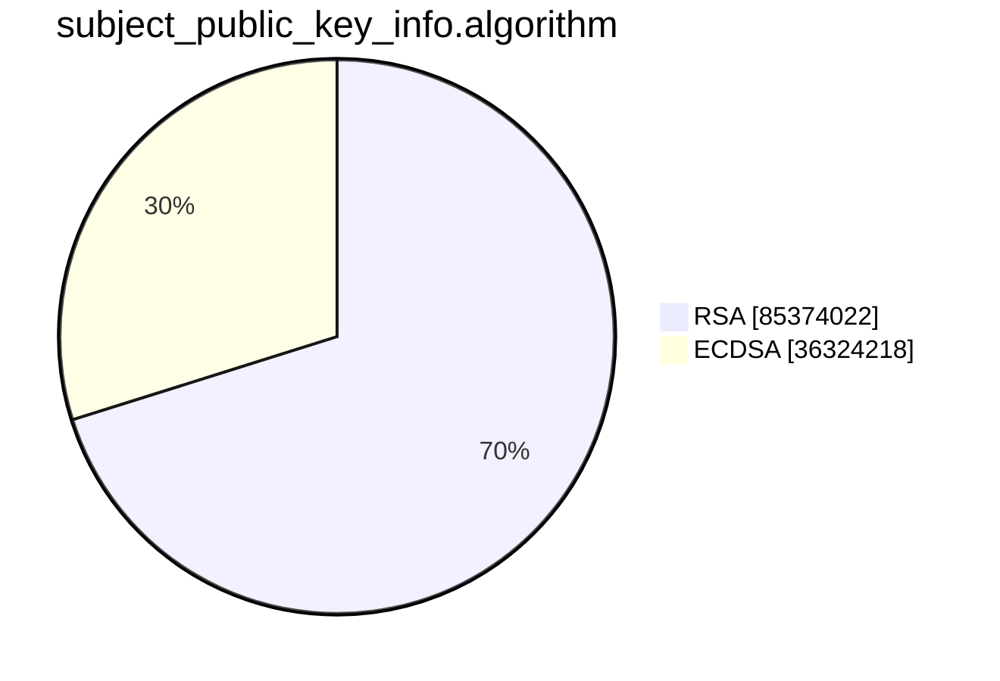
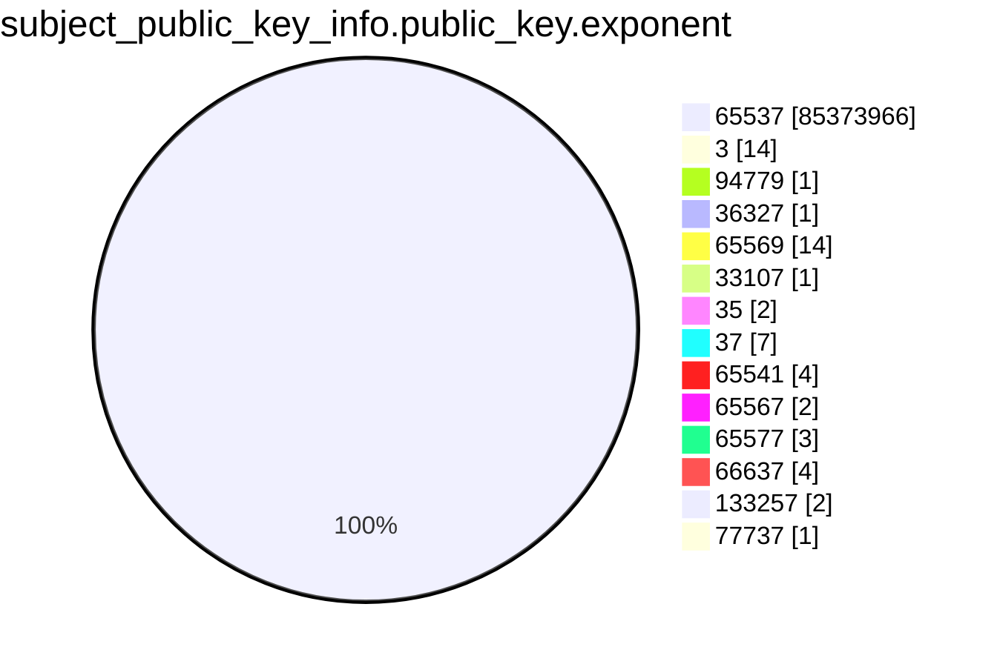
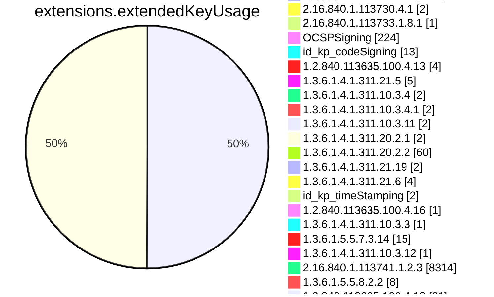
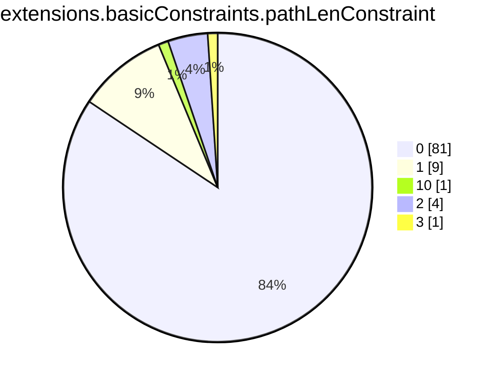
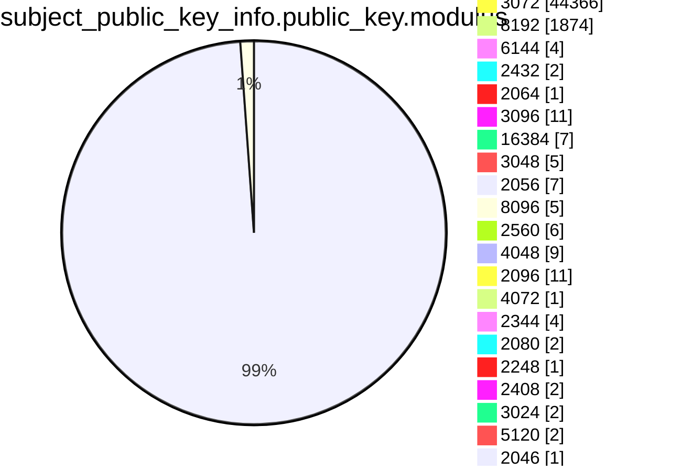

```mermaid
pie showData
title subject.cn.tld
"tw" :38271
"si" :10356
"com" :69644539
"in" :242964
"IN" :103
"at" :93381
"ru" :291670
"br" :298984
"org" :2967239
"net" :4045594
"jp" :330084
"uk" :821084
"ph" :13261
"today" :12566
"nz" :66891
"biz" :218972
"studio" :12852
"us" :998705
"ca" :417161
"solutions" :10324
"cc" :90481
"au" :415175
"online" :318574
"shop" :457181
"domains" :1713
"media" :10155
"kr" :98795
"finance" :17455
"mx" :79365
"directory" :1199
"life" :361721
"bz" :2707
"xyz" :579315
"co" :312970
"info" :236498
"estate" :828
"club" :131087
"my" :14120
"pg" :339
"site" :313184
"me" :160580
"eu" :307325
"cn" :788626
"live" :147837
"io" :993110
"de" :2980261
"ws" :3935
"press" :1679
"center" :4114
"store" :142311
"education" :20375
"it" :145052
"cl" :29407
"rocks" :18510
"xn--p1ai" :13736
"art" :24100
"space" :120952
"global" :9622
"asia" :73771
"th" :7322
"care" :5822
"hk" :20699
"sg" :25275
"fr" :287960
"beer" :897
"cloud" :230255
"tech" :64463
"work" :37256
"tr" :32875
"wedding" :4820
"healthcare" :907
"health" :5888
"ie" :34730
"pro" :44180
"ltd" :19631
"dk" :53952
"id" :25519
"es" :156978
"consulting" :2956
"ro" :20260
"nl" :410427
"vn" :27192
"pl" :74087
"edu" :301997
"no" :56773
"dev" :4025913
"se" :91010
"tv" :69330
"mobi" :10459
"gov" :62916
"il" :18623
"be" :102522
"su" :2820
"cz" :60999
"world" :17235
"click" :80703
"uno" :3287
"community" :2710
"faith" :692
"pt" :29467
"city" :3721
"za" :52601
"aero" :4728
"lv" :5365
"lu" :8097
"amsterdam" :400
"company" :21948
"lundbeck" :3
"gs" :1654
"events" :3486
"gal" :509
"wine" :1472
"army" :524
"expert" :2820
"ch" :137092
"bzh" :1045
"exchange" :4045
"farm" :2805
"coop" :2907
"app" :123989
"support" :3589
"team" :9744
"uy" :3481
"london" :2285
"design" :10065
"business" :3160
"gl" :581
"sv" :923
"lk" :4038
"xn--80asehdb" :113
"hu" :27479
"ai" :51405
"ac" :2246
"cyou" :12761
"pet" :1175
"cy" :2143
"travel" :3485
"agency" :11398
"direct" :560329
"int" :2721
"capital" :2896
"law" :2715
"ae" :15883
"py" :1436
"digital" :23466
"bmw" :658
"cards" :1064
"reit" :31
"church" :2696
"energy" :3357
"ar" :41994
"la" :5128
"bet" :12391
"cr" :1909
"pub" :4650
"bank" :2293
"xn--80aswg" :37
"pw" :251868
"is" :5506
"tj" :314
"moscow" :640
"ag" :2709
"jobs" :1194
"COM" :8757
"marketing" :3341
"academy" :7141
"bm" :662
"social" :5745
"ci" :1309
"solar" :999
"ad" :515
"love" :4522
"re" :3661
"ni" :455
"school" :3005
"gr" :27037
"systems" :17601
"software" :3621
"gt" :2129
"gg" :9386
"group" :10206
"fun" :48086
"aw" :106
"best" :5938
"land" :2537
"fit" :6428
"tokyo" :3381
"pe" :13505
"ec" :4983
"photography" :5748
"games" :6144
"eco" :1112
"link" :60192
"Nu" :2
"tools" :8392
"nyc" :3796
"je" :519
"website" :33878
"construction" :774
"fi" :46311
"rs" :4448
"rip" :751
"vision" :1414
"am" :4322
"mn" :1728
"kh" :677
"plus" :12153
"kim" :1187
"bn" :224
"coffee" :1662
"plumbing" :368
"rentals" :827
"cool" :4577
"guide" :1698
"BZ" :5
"blog" :10468
"xn--p1acf" :457
"om" :999
"quebec" :352
"kw" :879
"cba" :246
"jo" :839
"sa" :8960
"network" :13053
"fitness" :1453
"bh" :939
"icu" :19607
"sk" :14754
"vip" :62905
"gallery" :1781
"mo" :594
"ua" :16209
"email" :8607
"kpn" :38
"ke" :5194
"gh" :973
"management" :1004
"nu" :6485
"fj" :321
"Com" :163
"eg" :1110
"gi" :285
"koeln" :969
"saxo" :33
"video" :3399
"ee" :7668
"bg" :7332
"pk" :8985
"scot" :1465
"hr" :7646
"green" :27243
"uz" :1454
"gmo" :6
"qa" :2326
"vegas" :689
"ntt" :235
"clinic" :1858
"kz" :3952
"miami" :503
"cymru" :463
"st" :1396
"one" :28039
"red" :2846
"ng" :15384
"ma" :5697
"ve" :773
"bo" :1087
"dog" :1973
"tz" :1773
"bd" :2262
"services" :14165
"DE" :85
"accountants" :84
"mv" :381
"photo" :2658
"mc" :339
"delivery" :1212
"lt" :10909
"mu" :1195
"hn" :887
"tt" :412
"canon" :183
"repair" :488
"news" :9420
"llc" :2000
"BR" :38
"fm" :2565
"training" :2372
"berlin" :3484
"theater" :87
"do" :4125
"museum" :200
"ao" :531
"ps" :536
"auction" :341
"ooo" :1212
"legal" :1375
"to" :4955
"vc" :3051
"graphics" :508
"ist" :394
"zone" :12979
"okinawa" :130
"technology" :10862
"jewelry" :378
"AU" :196
"black" :518
"fund" :1771
"xn--3e0b707e" :79
"top" :299108
"bio" :2667
"inc" :1760
"JP" :78
"paris" :1185
"study" :324
"bw" :587
"ryukyu" :21
"racing" :465
"page" :2957
"help" :1583
"taxi" :639
"yokohama" :88
"ge" :2056
"house" :1944
"villas" :110
"by" :3930
"ba" :1294
"eus" :1331
"clothing" :731
"place" :745
"trade" :2675
"va" :36
"supply" :692
"cat" :9184
"yoga" :927
"li" :8687
"HK" :29
"market" :3448
"hsbc" :26
"audio" :656
"as" :660
"mz" :650
"az" :1960
"movie" :477
"so" :3084
"bi" :324
"zw" :678
"earth" :2712
"cw" :119
"xn--80adxhks" :233
"ventures" :1303
"apple" :52
"al" :2170
"gmbh" :1615
"name" :6813
"MY" :17
"GOV" :493
"tours" :1056
"express" :1328
"jll" :5
"works" :4717
"cab" :373
"jm" :282
"boutique" :1212
"guru" :6015
"band" :1368
"host" :5139
"dental" :602
"tc" :399
"build" :3510
"watch" :2918
"pa" :2179
"win" :8383
"mk" :1452
"ORG" :545
"toys" :1398
"cd" :267
"bayern" :1331
"onl" :885
"menu" :1842
"ml" :28881
"pics" :1577
"money" :3784
"yt" :431
"foundation" :1581
"immo" :1360
"alsace" :105
"enterprises" :521
"ninja" :15103
"blue" :2370
"pizza" :766
"tk" :39266
"bar" :3611
"codes" :4509
"gift" :744
"ga" :14912
"markets" :261
"woodside" :265
"credit" :724
"ceo" :435
"wtf" :6526
"sh" :6216
"aws" :2616
"kg" :524
"sarl" :56
"holdings" :447
"run" :9496
"im" :5342
"report" :1400
"cm" :2206
"rugby" :65
"fail" :523
"fashion" :918
"BIZ" :32
"cf" :19355
"gy" :471
"hamburg" :956
"ovh" :2498
"football" :493
"beauty" :3141
"buzz" :36619
"kyoto" :53
"statefarm" :7162
"et" :221
"limited" :480
"men" :1750
"vet" :939
"cash" :2539
"science" :1761
"mm" :456
"mt" :2047
"pictet" :43
"partners" :1125
"audi" :883
"ms" :4759
"ly" :1532
"international" :1720
"engineering" :4356
"coach" :2286
"infiniti" :6
"gq" :6267
"film" :629
"lol" :4593
"homes" :2212
"vlaanderen" :249
"iq" :403
"tax" :913
"sx" :385
"rest" :1420
"fyi" :1785
"man" :467
"africa" :3059
"tn" :992
"gold" :1885
"surf" :712
"ink" :6906
"cam" :6429
"md" :1683
"pr" :248
"xxx" :916
"stream" :1776
"amazon" :29
"contact" :588
"party" :3067
"lc" :345
"ht" :263
"careers" :822
"lb" :700
"archi" :151
"dating" :594
"ky" :699
"lawyer" :612
"wien" :772
"xn--tckwe" :95
"limo" :121
"computer" :609
"nagoya" :85
"recipes" :381
"reisen" :300
"moe" :1993
"show" :1843
"monster" :7375
"lgbt" :223
"mil" :1715
"realty" :297
"sport" :166
"casa" :1303
"bj" :195
"tienda" :211
"np" :1388
"haus" :477
"bt" :104
"swiss" :1043
"brussels" :682
"bbva" :8
"financial" :1074
"bike" :1788
"wales" :919
"sb" :200
"cx" :4293
"dance" :1049
"glass" :393
"radio" :186
"lat" :449
"cooking" :126
"wiki" :4856
"download" :1390
"tf" :6446
"tui" :142
"insure" :698
"pink" :487
"sc" :777
"security" :487
"deals" :1372
"style" :1239
"vg" :269
"parts" :614
"tube" :337
"forum" :5
"xn--90ais" :103
"productions" :687
"properties" :1226
"realestate" :1407
"reviews" :2641
"car" :124
"chat" :2715
"shoes" :362
"tel" :2205
"kpmg" :8
"vote" :461
"rent" :576
"fish" :667
"quest" :5342
"melbourne" :181
"wang" :6266
"mba" :430
"sap" :9460
"ax" :204
"camera" :372
"kiwi" :1009
"ug" :1003
"loan" :1323
"investments" :545
"bingo" :189
"cpa" :250
"ki" :121
"INT" :8
"luxe" :125
"sm" :163
"family" :1921
"fan" :763
"game" :1270
"attorney" :434
"golf" :1136
"gd" :342
"CL" :22
"bid" :6614
"sn" :470
"NET" :720
"dealer" :74
"fo" :722
"schule" :304
"holiday" :296
"casino" :1819
"contractors" :219
"sr" :156
"town" :674
"ruhr" :351
"institute" :1023
"organic" :98
"sale" :2616
"fox" :260
"cafe" :1887
"adult" :149
"corsica" :145
"lighting" :337
"tm" :405
"voyage" :219
"weir" :174
"xn--fiqs8s" :561
"ne" :179
"salon" :473
"hosting" :583
"poker" :311
"xn--mgbaam7a8h" :10
"tips" :2056
"pf" :221
"xin" :5522
"auspost" :214
"na" :512
"auto" :364
"moda" :229
"af" :210
"nrw" :1041
"PRO" :1
"QA" :29
"NO" :6
"fans" :783
"UK" :137
"garden" :417
"pictures" :1847
"bs" :271
"SE" :29
"flowers" :110
"zm" :578
"loans" :405
"mortgage" :367
"frl" :225
"accountant" :772
"Org" :12
"nc" :576
"pm" :604
"xn--ses554g" :51
"restaurant" :511
"university" :878
"srl" :302
"gifts" :1216
"charity" :193
"dz" :433
"vi" :50
"abbott" :560
"ikano" :103
"photos" :2751
"rw" :1275
"tirol" :267
"brother" :32
"sz" :140
"camp" :815
"clubmed" :578
"saarland" :217
"nr" :18
"ngo" :821
"dentist" :225
"irish" :268
"krd" :90
"promo" :376
"discount" :193
"EDU" :293
"CA" :411
"actor" :204
"baby" :219
"toyota" :79
"tl" :182
"viajes" :22
"boston" :111
"tatar" :47
"kitchen" :522
"vin" :1004
"christmas" :260
"trading" :223
"review" :1183
"ski" :436
"navy" :133
"pharmacy" :46
"xn--j1amh" :63
"autos" :644
"teva" :98
"gives" :358
"vacations" :177
"florist" :167
"tg" :167
"cleaning" :277
"doctor" :11773
"suzuki" :46
"porn" :312
"new" :364
"gay" :749
"webcam" :545
"SA" :40
"KW" :6
"xn--kpry57d" :14
"ricoh" :41
"afl" :29
"sbi" :103
"sky" :495
"mw" :247
"xn--d1acj3b" :17
"AR" :17
"CN" :13
"NL" :49
"wf" :141
"bot" :662
"sexy" :346
"mg" :343
"ren" :1854
"physio" :617
"vu" :167
"mp" :92
"cg" :96
"ls" :220
"bb" :131
"hair" :320
"IT" :44
"Gov" :32
"sncf" :34
"neustar" :209
"builders" :519
"cricket" :558
"pfizer" :47
"sydney" :256
"associates" :244
"college" :364
"US" :89
"fk" :23
"godaddy" :21
"jcb" :10
"abb" :93
"gn" :25
"soccer" :224
"ck" :61
"globo" :184
"nissan" :6
"horse" :293
"xn--mgberp4a5d4ar" :1
"soy" :189
"xn--c1avg" :31
"how" :896
"dm" :56
"cbs" :2
"date" :1386
"kn" :113
"diamonds" :206
"shopping" :875
"nikon" :1
"rehab" :260
"temasek" :12
"barcelona" :282
"skin" :453
"observer" :78
"lamborghini" :5
"tickets" :32
"sony" :16
"gm" :62
"immobilien" :457
"jetzt" :783
"reise" :46
"kaufen" :340
"tennis" :124
"singles" :216
"xn--mk1bu44c" :61
"tatamotors" :28
"itau" :18
"SG" :90
"hiphop" :57
"gp" :191
"tires" :54
"ye" :81
"total" :84
"EU" :52
"barclaycard" :70
"barclays" :326
"property" :228
"bnpparibas" :553
"surgery" :95
"cv" :92
"engineer" :915
"exposed" :285
"xn--90ae" :20
"catering" :198
"MX" :11
"vodka" :72
"hermes" :91
"taipei" :462
"ong" :277
"cologne" :109
"km" :21
"gratis" :257
"JM" :1
"claims" :284
"gucci" :17
"bridgestone" :23
"versicherung" :87
"istanbul" :203
"playstation" :2
"goog" :14545
"xn--qxa6a" :7
"xn--e1a4c" :3
"dj" :1149
"equipment" :297
"fishing" :94
"republican" :66
"industries" :391
"xn--q9jyb4c" :52
"Lighting" :1
"SALE" :1
"condos" :135
"nike" :386
"futbol" :554
"gop" :110
"honda" :13
"realtor" :461
"hospital" :136
"cfd" :2825
"gdn" :167
"ONLINE" :1
"sl" :161
"courses" :341
"madrid" :161
"xn--9dbq2a" :23
"forsale" :700
"mq" :70
"AE" :25
"dvag" :192
"RU" :17
"EMAIL" :1
"supplies" :291
"apartments" :617
"PH" :28
"compare" :22
"xn--h2brj9c" :52
"desi" :214
"orange" :62
"country" :103
"cheap" :397
"TR" :5
"dhl" :31
"hockey" :79
"sex" :357
"democrat" :57
"blackfriday" :77
"sucks" :50
"diet" :57
"degree" :94
"xn--fiq228c5hs" :10
"lease" :286
"osaka" :36
"sakura" :1
"capetown" :77
"bargains" :144
"joburg" :59
"xn--ngbc5azd" :17
"flights" :149
"xn--6qq986b3xl" :442
"durban" :63
"sbs" :4251
"rodeo" :311
"bond" :1744
"cruises" :120
"mango" :6
"mom" :357
"coupons" :118
"abogado" :31
"xn--qxam" :6
"vanguard" :43
"tattoo" :208
"xn--j6w193g" :14
"airforce" :89
"gf" :81
"nf" :89
"forex" :22
"sd" :106
"memorial" :42
"creditcard" :98
"broker" :130
"crs" :1377
"jnj" :182
"citic" :89
"boats" :101
"PT" :4
"aeg" :1
"leclerc" :26
"trust" :7
"ir" :718
"LONDON" :2
"lidl" :78
"ltda" :48
"bf" :103
"luxury" :116
"Dk" :1
"insurance" :58
"furniture" :206
"yachts" :99
"next" :187
"sandvik" :52
"Clinic" :1
"basketball" :59
"Edu" :8
"hiv" :8
"genting" :1
"pioneer" :7
"DK" :52
"OM" :2
"post" :23
"CO" :12
"aquarelle" :13
"makeup" :123
"Biz" :39
"FR" :35
"schwarz" :615
"day" :744
"mr" :153
"bible" :79
"NETWORK" :3
"monash" :41
"abudhabi" :80
"RENTALS" :1
"gent" :108
"shiksha" :11
"ES" :53
"hm" :44
"香港" :5
"maison" :118
"moi" :7
"xn--6frz82g" :446
"career" :50
"jpmorgan" :2
"sy" :30
"CBA" :11
"toray" :22
"xn--czrs0t" :1
"uol" :41
"td" :92
"juegos" :7
"bradesco" :55
"storage" :54
"williamhill" :3
"TH" :14
"scb" :31
"guitars" :38
"Be" :1
"rich" :22
"xn--g2xx48c" :17
"Net" :13
"xn--mgbab2bd" :8
"xn--rhqv96g" :11
"select" :9
"erni" :4
"gripe" :41
"sharp" :19
"CZ" :4
"schaeffler" :16
"komatsu" :112
"anz" :46
"cars" :72
"ZA" :31
"FI" :23
"BE" :20
"IE" :11
"philips" :1
"ismaili" :5
"schmidt" :8
"xn--o3cw4h" :6
"KE" :4
"deloitte" :32
"IO" :5
"showtime" :1
"Co" :1
"nab" :2
"sener" :6
"BANK" :5
"abc" :19
"xn--czr694b" :57
"Za" :2
"HR" :15
"lotto" :3
"CM" :2
"theatre" :5
"uK" :4
"TW" :25
"praxi" :1
"xn--io0a7i" :15
"lr" :26
"BH" :5
"MU" :2
"RE" :1
"xn--t60b56a" :18
"IL" :10
"DZ" :3
"EC" :4
"COMPANY" :3
"xn--vhquv" :1
"vig" :15
"cfa" :5
"CLOUD" :2
"voto" :16
"pn" :98
"aq" :9
"ss" :27
"lilly" :16
"azure" :48
"SI" :2
"jio" :3
"RO" :8
"GR" :23
"ID" :6
"voting" :5
"motorcycles" :16
"axa" :25
"seat" :61
"rio" :13
"sanofi" :92
"nico" :10
"ipiranga" :2
"xn--3ds443g" :24
"CAFE" :1
"xn--node" :2
"xn--vuq861b" :5
"kred" :77
"zuerich" :28
"shell" :21
"MD" :2
"NZ" :16
"microsoft" :18
"PY" :2
"xn--3hcrj9c" :4
"xn--90a3ac" :9
"lego" :18
"goo" :1
"MIL" :9
"City" :1
"fresenius" :2
"xn--fiqz9s" :4
"ifm" :3
"linde" :2
"cisco" :5
"aaa" :1
"TV" :2
"med" :7
"VN" :6
"smart" :4
"xn--y9a3aq" :9
"mma" :6
"xn--otu796d" :4
"xn--czru2d" :9
"cuisinella" :6
"EG" :1
"PL" :3
"aig" :8
"panasonic" :2
"cu" :2
"weber" :43
"xn--55qx5d" :9
"In" :3
"MO" :1
"ubs" :1
"NU" :1
"AG" :6
"xn--kput3i" :12
"itv" :10
"flir" :1
"fage" :6
"mh" :3
"ET" :3
"yandex" :42
"protection" :3
"Zone" :1
"Asia" :1
"CH" :13
"LB" :5
"gw" :4
"AO" :16
"stockholm" :7
"otsuka" :4
"SBI" :6
"MOBI" :4
"creditunion" :17
"Fr" :8
"ASIA" :4
"ericsson" :2
"kfh" :1
"amex" :1
"BRADESCO" :1
"xn--rvc1e0am3e" :2
"Live" :1
"hisamitsu" :2
"CI" :1
"natura" :1
"xn--54b7fta0cc" :1
"locus" :7
"LAW" :2
"xn--rovu88b" :1
"xn--1ck2e1b" :1
"xn--eckvdtc9d" :1
"qpon" :4
"imdb" :1
"free" :1
"read" :1
"tushu" :1
"xn--jlq480n2rg" :1
"silk" :1
"CD" :2
"LTD" :1
"BS" :1
"BM" :1
"bbc" :7
"edeka" :40
"airbus" :1
"chase" :3
"MADRID" :1
"call" :1
"audible" :1
"xn--unup4y" :3
"AT" :4
"COOP" :2
"NAME" :1
"bauhaus" :12
"WORLD" :1
"EUS" :2
"xn--5tzm5g" :9
"dubai" :2
"adac" :1
"INFO" :8
"arab" :1
"politie" :46
"NYC" :1
"jaguar" :1
"landrover" :1
"sew" :1
"lincoln" :2
"statebank" :4
"lanxess" :3
"TOP" :1
"nec" :1
"WS" :5
"rwe" :2
"DIGITAL" :4
"toshiba" :1
"xn--nqv7f" :4
"jprs" :4
"PE" :5
"frogans" :6
"SZ" :1
"Solutions" :2
"HU" :3
"LA" :4
"xn--fjq720a" :3
"ACADEMY" :2
"farmers" :2
"xfinity" :2
"comcast" :2
"ZM" :1
"TECH" :4
"FARM" :2
"XYZ" :3
"channel" :1
"Software" :2
"xn--2scrj9c" :10
"mutual" :3
"northwesternmutual" :1
"Tech" :1
"CLUB" :2
"JO" :5
"xn--xhq521b" :1
"bosch" :1
"samsung" :1
"nowruz" :2
"xn--hxt814e" :1
"xn--mgbca7dzdo" :1
"booking" :1
"dupont" :6
"CAT" :1
"extraspace" :1
"gu" :2
"MZ" :2
"aco" :3
"redumbrella" :1
"travelers" :1
"travelersinsurance" :1
"trv" :1
"KR" :1
"BW" :2
"CR" :2
"Bid" :3
"mattel" :8
"HOUSE" :1
"bentley" :1
"xn--wgbh1c" :1
"guardian" :3
"APP" :1
"xn--zfr164b" :4
"xn--imr513n" :2
"LT" :1
"xn--s9brj9c" :4
"mini" :2
"xn--h2breg3eve" :13
"arpa" :1
"AERO" :2
"xn--xkc2dl3a5ee0h" :8
"analytics" :2
"Bank" :3
"Video" :1
"xn--gecrj9c" :2
"foo" :2
"KZ" :1
"Dog" :1
"gea" :1
"Info" :1
"GT" :1
"Uk" :2
"hyundai" :3
"Dev" :1
"xn--45brj9c" :1
"mit" :1
"amica" :1
"Land" :1
"AM" :1
"bms" :1
"xn--fpcrj9c3d" :3
"MT" :5
"RW" :1
"PF" :1
"broadway" :1
"WEIR" :1
"MA" :4
"Eu" :1
"ANZ" :1
"LIFE" :1
"UG" :1
"google" :1
"ice" :1
"ZONE" :1
"xn--d1alf" :1
"Us" :1
"jmp" :2
"nra" :2
"accenture" :1
"FOX" :2
"bloomberg" :1
"msd" :1
"PK" :1
"icbc" :1
"GG" :4
"sas" :1
"mtr" :1
"UA" :1
"SINGLES" :1
"GL" :2
"KY" :1
"chintai" :1
"feedback" :1
"zara" :1
"WORK" :1
"BN" :2
"RS" :2
"ME" :1
"DO" :3
"CC" :1
"SK" :1
```

```mermaid
pie showData
title issuer
"Google UK Ltd." :31634
"STRAC" :2
"Foundation for Trusted Identity" :1
"TSCP Inc." :1
"Cisco Systems" :400
"行政院" :3
"KPN B.V." :1
"Actalis S.p.A.-03358520967" :1
"U.S. Government" :8
"CertiPath" :1
"WidePoint" :1
"A-Trust Ges. f. Sicherheitssysteme im elektr. Datenverkehr GmbH" :6
"AC Camerfirma S.A." :2
"ICP-Brasil" :3
"VeriSign, Inc." :5
"行政院" :14
"Baltimore" :4
"U.S. Government" :1
"Microsoft Corporation" :1
"VeriSign, Inc." :11
"A-Trust Ges. f. Sicherheitssysteme im elektr. Datenverkehr GmbH" :4
"FNMT-RCM" :1
"VeriSign, Inc." :2
"AC CAMERFIRMA S.A." :2
"VeriSign, Inc." :2
"Colegio de Registradores de la Propiedad y Mercantiles de España" :2
"thawte, Inc." :1
"行政院" :1
"DigiCert Inc" :3
"Hellenic Academic and Research Institutions Cert. Authority" :3
"Republika Slovenija" :2
"Elektronik Bilgi Guvenligi A.S." :2
"MULTICERT - Serviços de Certificação Electrónica S.A." :1
"E-Tuğra EBG Bilişim Teknolojileri ve Hizmetleri A.Ş." :5
"GeoTrust Inc." :2
"Hellenic Academic and Research Institutions Cert. Authority" :15
"Atos" :2
"Apple Inc." :12
"Apple Inc." :3
"SAFE-Biopharma" :1
"QuoVadis Limited" :2
"Apple Inc." :1
"POSTA" :2
"Secretaria de Economia" :1
"TÜRKTRUST Bilgi İletişim ve Bilişim Güvenliği Hizmetleri A.Ş." :1
"Elektronik Bilgi Guvenligi A.S." :1
"LAWtrust" :2
"AC Camerfirma SA" :1
"SwissSign AG" :1
"British Telecommunications plc" :5
"SAFE Identity" :1
"Certinomis" :1
"HydrantID (Avalanche Cloud Corporation)" :1
"QuoVadis Limited" :2
"GlobalSign" :1
"GlobalSign nv-sa" :2
"Institute for Development and Research in Banking Technology" :52
"U.S. Government" :1
"Actalis S.p.A." :1
"Symantec Corporation" :3
"Trustwave Holdings, Inc." :1
"Apple Inc." :1
"Sectigo Limited" :1
"GlobalSign nv-sa" :3
"WoSign CA Limited" :1
"VeriSign, Inc." :1
"Japanese Government" :1
"Unizeto Technologies S.A." :1
"ANF Autoridad de Certificacion" :1
"SwissSign AG" :1
"Google UK Ltd." :8456
"Hongkong Post" :3
"Vaestorekisterikeskus CA" :2
"QuoVadis Limited" :3
"certSIGN" :2
"DigiCert Inc" :2
"e-commerce monitoring GmbH" :4
"ICP-Brasil" :3
"DigiCert Inc" :2
"MINISTERE INTERIEUR" :1
"DigiCert Inc" :1
"Government Root Certification Authority" :1
"Open Access Technology International Inc" :1
"SECOM Trust Systems CO.,LTD." :2
"E-Tuğra EBG Bilişim Teknolojileri ve Hizmetleri A.Ş." :10
"Elektronik Bilgi Guvenligi A.S." :1
"行政院" :1
"ICP-Brasil" :1
"TÜRKTRUST Bilgi İletişim ve Bilişim Güvenliği Hizmetleri A.Ş." :1
"VeriSign, Inc." :2
"Apple Inc." :1
"Orion Health Inc." :2
"DigiCert Inc" :1
"ACNLB" :1
"QuoVadis Limited" :10485
"Apple Inc." :1
"The USERTRUST Network" :1
"GlobalSign nv-sa" :2
"GAD EG" :2
"VeriSign, Inc." :1
"NISZ Nemzeti Infokommunikációs Szolgáltató Zrt." :1
"QuoVadis Limited" :3
"SECOM Trust.net" :1
"Turkiye Bilimsel ve Teknolojik Arastirma Kurumu - TUBITAK" :1
"SwissSign AG" :2
"Verizon Business" :1
"ICP-Brasil" :1
"Symantec Corporation" :1
"SwissSign AG" :1
"Apple Inc." :1
"GoDaddy.com, Inc." :4203156
"GlobalSign nv-sa" :220719
"GlobalSign nv-sa" :127401
"GlobalSign nv-sa" :314885
"Starfield Technologies, Inc." :508627
"GlobalSign nv-sa" :151605
"GlobalSign nv-sa" :15200
"GlobalSign nv-sa" :11837
"GlobalSign nv-sa" :1436
"Česká pošta, s.p." :708
"Rede Nacional de Ensino e Pesquisa - RNP" :7032
"GlobalSign nv-sa" :107
"VALID CERTIFICADORA DIGITAL" :188
"SOLUTI - SOLUCOES EM NEGOCIOS INTELIGENTES S-A" :23
"ATT Services Inc" :1408
"DigiCert Inc" :287224
"Sectigo Limited" :5004031
"Internet2" :205310
"SecureCore" :12439
"SECOM Trust Systems CO.,LTD." :20821
"DigiCert Inc" :1253822
"Network Solutions L.L.C." :50027
"DigiCert Inc" :99343
"GoGetSSL" :51961
"SSL Corporation" :49093
"The USERTRUST Network" :28301
"Sectigo Limited" :383820
"Government of Korea" :699
"DigiCert Inc" :6117
"DigiCert Inc" :133134
"DigiCert Inc" :154701
"DigiCert Inc" :72950
"DigiCert Inc" :8859627
"SECOM Trust Systems CO.,LTD." :18708
"DigiCert Inc" :2488
"DigiCert Inc" :233
"DigiCert Inc" :10513
"DigiCert Inc" :6320
"DigiCert Inc" :27514
"UniTrust" :1157
"FUJIFILM" :154
"DigiCert Inc" :472
"DigiCert Inc" :11579988
"Trust Provider B.V." :14330
"The Trustico Group Ltd" :5665
"DigiCert Inc" :73078
"DigiCert Inc" :1771
"GlobalSign nv-sa" :1539
"SecureCore" :556
"Aetna Inc" :8910
"DigiCert Inc" :41411
"TrustAsia Technologies, Inc." :751
"Technische Universitaet Dresden" :660
"COMODO CA Limited" :139629
"Verein zur Foerderung eines Deutschen Forschungsnetzes e. V." :42324
"EUNETIC GmbH" :3628
"DigiCert Inc" :9959
"Soluciones Corporativas IP, SL" :18076
"DigiCert Inc" :10295
"Fraunhofer" :4102
"Alpiro s.r.o." :5478
"DigiCert Inc" :144
"Sectigo Limited" :313
"Network Solutions L.L.C." :13688
"DigiCert Inc" :1530
"DigiCert Inc" :227
"DigiCert Inc" :1842
"Technische Universitaet Ilmenau" :209
"DigiCert Inc" :7309
"Karlsruhe Institute of Technology" :983
"DigiCert Inc" :5036
"Microsec Ltd." :676
"Gandi" :276952
"TBS INTERNET" :2465
"Siemens" :1
"Corporation Service Company" :20701
"EUNETIC GmbH" :77
"Max-Planck-Gesellschaft" :1466
"Nijimo K.K." :518
"DigiCert Inc" :32018
"Sectigo Limited" :5398
"The USERTRUST Network" :1055
"DigiCert Inc" :19577
"Sectigo Limited" :2754471
"Internet2" :5821
"DigiCert Inc" :680
"GoGetSSL" :129
"Trustwave Holdings, Inc." :6995
"DigiCert Inc" :14520
"Wells Fargo & Company" :2846
"Government of the District of Columbia" :303
"DigiCert Inc" :312
"K Software" :237
"DigiCert Inc" :4677
"TrustAsia Technologies, Inc." :303200
"WoTrus CA Limited" :5031
"Apple Inc." :1687
"Cybertrust Japan Co., Ltd." :16228
"BitCert" :125
"CrowdStrike Inc." :30
"TAIWAN-CA" :160
"Cybertrust Japan Co., Ltd." :7263
"SSL Corp" :113
"GoGetSSL" :510
"DigiCert Inc" :200675
"DigiCert Inc" :816
"Deutscher Bundestag" :77
"CentralNic Luxembourg Sàrl" :4743
"IZENPE S.A." :481
"DigiCert Inc" :1082
"Chunghwa Telecom Co., Ltd." :2140
"SECOM Trust Systems CO.,LTD." :8322
"The Trustico Group Ltd" :65
"Corporation Service Company" :75
"MarketWare - Soluções para Mercados Digitais, Lda." :190
"VALID CERTIFICADORA DIGITAL" :31
"CERTDATA SERVICOS DE INFORMACAO LTDA" :40
"Open Access Technology International Inc" :1063
"Apple Inc." :1720
"Internet2" :2924
"Amazon" :24711983
"WoTrus CA Limited" :1026
"Disig a.s." :258
"IZENPE S.A." :220
"DHIMYOTIS" :3647
"Aristotle University of Thessaloniki" :468
"Buypass AS-983163327" :6912
"GEANT Vereniging" :2415
"GlobalSign nv-sa" :111
"Aetna Inc" :58
"SOLUTI - SOLUCOES EM NEGOCIOS INTELIGENTES S-A" :71
"Sectigo (Europe) SL" :2
"Fresenius Kabi AG" :80
"Apple Inc." :890
"Trustwave Holdings, Inc." :94
"Apple Inc." :1254
"TrustAsia Technologies, Inc." :2703
"OpenTrust" :1
"GeoTrust Inc." :1
"Certinomis" :1
"Certinomis" :4
"SwissSign AG" :1
"GeoTrust Inc." :1
"SwissSign AG" :1
"SwissSign AG" :1
"SwissSign AG" :1
"DigiCert Inc" :219
"VI Registru centras - i.k. 124110246" :1
"Inera AB" :6
"Agence Nationale des Titres Sécurisés" :2
"CERTSIGN SA" :1
"CERTSIGN SA" :2
"China Financial Certification Authority" :1810
"China Financial Certification Authority" :326
"China Financial Certification Authority" :1
"CERTSIGN SA" :1
"Netflix, Inc." :1
"Krajowa Izba Rozliczeniowa S.A." :1
"E-Tuğra EBG Bilişim Teknolojileri ve Hizmetleri A.Ş." :1378
"E-Tuğra EBG Bilişim Teknolojileri ve Hizmetleri A.Ş." :29
"Isimtescil Bilisim Anonim Sirketi" :1
"Isimtescil Bilisim Anonim Sirketi" :3565
"Krajowa Izba Rozliczeniowa S.A." :344
"Vaestorekisterikeskus CA" :7
"Vaestorekisterikeskus CA" :2
"Krajowa Izba Rozliczeniowa S.A." :1
"Vaestorekisterikeskus CA" :2
"E-Tuğra EBG Bilişim Teknolojileri ve Hizmetleri A.Ş." :1
"Vaestorekisterikeskus CA" :2
"COMODO CA Limited" :2901
"Actalis S.p.A." :597180
"RU-Center (ЗАО Региональный Сетевой Информационный Центр)" :161
"QuoVadis Limited" :27649
"联通智慧安全科技有限公司" :33
"QuoVadis Trustlink B.V." :4265
"Buypass AS-983163327" :1810
"TeliaSonera" :5372
"CERTDATA SERVICOS DE INFORMACAO LTDA" :50
"MarketWare - Soluções para Mercados Digitais, Lda." :155
"HydrantID (Avalanche Cloud Corporation)" :1891
"VTB BANK (PJSC)" :119
"sslTrus" :169
"Government of Korea" :47
"sslTrus" :754
"DigiCert Inc" :128
"GlobalSign nv-sa" :860
"DigiCert Inc" :7470
"Site Blindado S.A." :280
"KICA" :2
"IdenTrust" :1175741
"IdenTrust" :2550
"DigiCert Inc" :51
"Corporation Service Company" :2779
"Actalis S.p.A." :5631
"SECOM Trust Systems CO.,LTD." :334
"DigiCert Inc" :36
"Hongkong Post" :1517
"SSL.com" :95
"Microsec Ltd." :16
"TrustSign Certificadora Dig. & Soluções Segurança da Inf. Ltda." :648
"Apple Inc." :155
"Apple Inc." :396
"UniTrust" :1
"UniTrust" :1
"Open Access Technology International Inc" :8
"Intesa Sanpaolo S.p.A." :1
"InfoCert S.p.A." :1
"InfoCert S.p.A." :1
"QuoVadis Limited" :1
"QuoVadis Limited" :1
"Turkiye Bilimsel ve Teknolojik Arastirma Kurumu - TUBITAK" :101
"HydrantID (Avalanche Cloud Corporation)" :1
"SwissSign AG" :18064
"NAVER BUSINESS PLATFORM Corp." :1
"SwissSign AG" :9268
"Japan Certification Services, Inc." :1
"ZETES SA (VATBE-0408425626)" :2
"QuoVadis Limited" :1
"TAIWAN-CA" :1
"TAIWAN-CA" :1
"SwissSign AG" :5797
"Baidu, Inc." :538
"QuoVadis Trustlink B.V." :2559
"Turing Crypto GmbH" :176
"TAIWAN-CA" :624
"Certinomis" :1
"Certinomis" :1
"SwissSign AG" :1
"Siemens" :1
"certSIGN" :1
"Vaestorekisterikeskus CA" :2
"certSIGN" :1
"Capricorn Identity Services Pvt Ltd." :1
"GAD EG" :1
"Abitab S.A." :1
"Disig a.s." :2
"Alpiro s.r.o." :32
"DigiCert Inc" :138
"SECOM Trust Systems CO.,LTD." :912
"DigiCert Inc" :4514
"Entrust, Inc." :331348
"WoTrus CA Limited" :44
"Sectigo Limited" :566
"Turing Crypto GmbH" :5
"Telia Finland Oyj" :2662
"Trustwave Holdings, Inc." :357
"TI Trust Technologies S.R.L." :1045
"SOLUTI - SOLUCOES EM NEGOCIOS INTELIGENTES S-A" :35
"VALID CERTIFICADORA DIGITAL" :20
"Trust Provider B.V." :720
"Hellenic Academic and Research Institutions CA" :177
"Deutsche Telekom Security GmbH" :1
"Sectigo Limited" :18
"Hao Quang Viet Software Company Limited" :193
"GlobalSign nv-sa" :62
"Digi- ja vaestotietovirasto CA" :994
"GlobalSign nv-sa" :7
"Digi- ja vaestotietovirasto CA" :724
"COMODO CA Limited" :569
"Entrust, Inc." :32818
"Entrust, Inc." :1914
"DHIMYOTIS" :1550
"TBS INTERNET" :35
"DigiCert Inc" :98
"UniTrust" :138
"WoTrus CA Limited" :10
"DigiCert Inc" :15
"SECOM Trust Systems CO.,LTD." :46
"Nijimo K.K." :124
"eMudhra Technologies Limited" :1517
"DigiCert Inc" :107
"DigiCert Inc" :66
"Gandi" :313
"Baidu, Inc." :62
"Beijing Xinchacha Credit Management Co., Ltd." :79
"ITSO LTD" :31
"Domain The Net Technologies Ltd" :609
"D-Trust GmbH" :5821
"DigiCert Inc" :245
"One Sign Pte. Ltd." :239
"DigiCert Inc" :985
"Microsoft Corporation" :793121
"Microsoft Corporation" :792904
"Global Digital Cybersecurity Authority Co., Ltd." :147
"Ziwit" :87
"Entrust, Inc." :440
"Staat der Nederlanden" :4
"T-Systems International GmbH" :9918
"DigiCert Inc" :47
"HydrantID (Avalanche Cloud Corporation)" :346
"DigiCert Inc" :20
"DigiCert Inc" :12
"Ziwit" :6
"DigiCert Inc" :103574
"DigiCert Inc" :34
"Japan Registry Services Co., Ltd." :65252
"Cloudflare, Inc." :32984556
"Cisco Systems, Inc." :260951
"Cloudflare, Inc." :12050001
"GEANT Vereniging" :165915
"cPanel, Inc." :55965
"DigiCert Inc" :26181
"ZeroSSL" :21676
"TrustCor Systems S. de R.L." :14626
"Japan Registry Services Co., Ltd." :1544
"NETLOCK Kft." :937
"Genious Communications" :1405
"Unizeto Technologies S.A." :2221
"DOMENY.PL sp. z o.o" :4974
"swissns GmbH" :175
"McAfee, Inc." :658
"GEANT Vereniging" :5484
"Hellenic Academic and Research Institutions Cert. Authority" :327
"行政院" :8530
"ACCV" :1619
"WISeKey" :944
"T-Systems International GmbH" :1318
"certSIGN" :306
"WebSpace-Forum e.K." :6
"NetLock Kft." :725
"Entrust Datacard Europe S.L." :94
"FNMT-RCM" :850
"Atos" :1285
"TI Trust Technologies S.R.L." :227
"Firmaprofesional S.A." :1021
"Financijska agencija" :259
"LH.pl Sp. z o.o." :129
"D-Trust GmbH" :724
"Hellenic Academic and Research Institutions Cert. Authority" :44
"E-SAFER CONSULTORIA EM TECNOLOGIA DA INFORMACAO LTDA" :159
"cPanel, Inc." :68
"DNEncrypt, Inc" :146
"SECOM Trust Systems CO.,LTD." :1368
"SECOM Trust Systems CO.,LTD." :283
"TrustAsia Technologies, Inc." :1067
"CerSign Technology Limited" :67
"DigiCert Inc" :172
"eMudhra Technologies Limited" :1889
"Deutsche Post AG" :2110
"NetLock Kft." :502
"Quantum CA Limited" :135
"QuoVadis Trustlink B.V." :1453
"DOMENY.PL sp. z o.o" :155
"cPanel, Inc." :26
"Hellenic Academic and Research Institutions CA" :23
"Digital Trust L.L.C." :265
"Hellenic Academic and Research Institutions CA" :255
"Agence Nationale de Certification Electronique" :64
"Quantum CA Limited" :6
"IdenTrust" :58
"WidePoint" :15
"Quantum CA Limited" :8
"Apple Inc." :6
"nazwa.pl sp. z o.o." :3912
"T-Systems International GmbH" :221
"Comodo Japan, Inc." :570
"sslTrus" :6
"Staclar, Inc." :62
"FNMT-RCM" :619
"ICP-Brasil" :842
"Sectigo Limited" :149
"Microsoft Corporation" :1629419
"Microsoft Corporation" :1651397
"Anson Network Limited" :33
"Deutsche Kreditbank AG" :220
"DigiCert Inc" :83
"Netflix, Inc." :1
"home.pl S.A." :1191
"AffirmTrust" :63
"sslTrus" :1
"TrustOcean Limited" :1
"Vaestorekisterikeskus CA" :4
"DigiCert Inc" :18
"VISA" :30
"Actalis S.p.A." :644
"Unizeto Technologies S.A." :22
"DigiCert Inc" :39
"Hellenic Academic and Research Institutions CA" :68
"Hellenic Academic and Research Institutions CA" :22
"WoTrus CA Limited" :11
"Hellenic Academic and Research Institutions CA" :21
"Hellenic Academic and Research Institutions CA" :6
"D-Trust GmbH" :95
"KICA" :23
"CertCloud Pte. Ltd." :92
"eMudhra Technologies Limited" :56
"Alpiro s.r.o." :27
"TRUSTCUBES LIMITED" :14
"GlobalSign nv-sa" :5260
"certSIGN" :12
"GlobalSign nv-sa" :2675
"DigiCert Inc" :14
"GlobalSign nv-sa" :112
"ZeroSSL" :19
"Amazon" :2
"Amazon" :2
"Amazon" :2
"Amazon" :2
"Amazon" :2
"TrustAsia Technologies, Inc." :48
"Greek Universities Network (GUnet)" :8
"STCS" :1
"Sistema Nacional de Certificacion Electronica" :1
"Alibaba Cloud Computing Co., Ltd." :4
"A-Trust Ges. f. Sicherheitssysteme im elektr. Datenverkehr GmbH" :35
"NetLock Kft." :54
"Root Networks, LLC" :183
"Dreamcommerce S.A." :245
"Telia Finland Oyj" :1
"Telia Finland Oyj" :1
"Apple Inc." :31
"Microsoft Corporation" :2265629
"Microsoft Corporation" :2309549
"NETLOCK Ltd." :24
"FNMT-RCM" :117
"Microsec Ltd." :44
"TrustAsia Technologies, Inc." :10066
"TrustAsia Technologies, Inc." :679600
"Quantum CA Limited" :35
"Hellenic Academic and Research Institutions Cert. Authority" :9
"DigiCert, Inc." :88
"Hellenic Academic and Research Institutions CA" :39
"certSIGN" :1
"certSIGN" :1
"DigiCert, Inc." :6
"ZoTrus Technology Limited" :54
"DigiCert Inc" :1
"WebSpace-Forum e.K." :3
"Alibaba Cloud Computing Co., Ltd." :2
"Digi-Sign Limited" :38
"DigiCert, Inc." :2
"COMODO CA Limited" :6
"WISeKey" :1
"WISeKey" :1
"WISeKey" :1
"Hellenic Academic and Research Institutions CA" :17
"{'c': 'BE', 'cn': 'Citizen CA', 'serialnumber': '201409'}" :1
"{'c': 'BE', 'cn': 'Citizen CA', 'serialnumber': '201505'}" :1
"{'c': 'BE', 'cn': 'Citizen CA', 'serialnumber': '201511'}" :1
"{'c': 'BE', 'cn': 'Citizen CA', 'serialnumber': '201509'}" :1
"{'c': 'BE', 'cn': 'Citizen CA', 'serialnumber': '201503'}" :1
"{'c': 'BE', 'cn': 'Citizen CA', 'serialnumber': '201404'}" :1
"{'c': 'BE', 'cn': 'Citizen CA', 'serialnumber': '201507'}" :1
"{'c': 'BE', 'cn': 'Citizen CA', 'serialnumber': '201506'}" :1
"{'c': 'BE', 'cn': 'Citizen CA', 'serialnumber': '201632'}" :1
"{'c': 'BE', 'cn': 'Citizen CA', 'serialnumber': '201610'}" :1
"http:--repository.eid.belgium.be-" :1
"{'c': 'BE', 'cn': 'Citizen CA', 'serialnumber': '201512'}" :1
"{'c': 'BE', 'cn': 'Citizen CA', 'serialnumber': '201510'}" :1
"{'c': 'BE', 'cn': 'Citizen CA', 'serialnumber': '201606'}" :1
"{'c': 'BE', 'cn': 'Citizen CA', 'serialnumber': '201601'}" :1
"{'c': 'BE', 'cn': 'Citizen CA', 'serialnumber': '201625'}" :1
"http:--repository.eid.belgium.be-" :1
"{'c': 'BE', 'cn': 'Citizen CA', 'serialnumber': '201501'}" :1
"{'c': 'BE', 'cn': 'Citizen CA', 'serialnumber': '201406'}" :1
"http:--repository.eid.belgium.be-" :1
"{'c': 'BE', 'cn': 'Citizen CA', 'serialnumber': '201605'}" :1
"{'c': 'BE', 'cn': 'Citizen CA', 'serialnumber': '201602'}" :1
"{'c': 'BE', 'cn': 'Citizen CA', 'serialnumber': '201623'}" :1
"http:--repository.eid.belgium.be-" :1
"http:--repository.eid.belgium.be-" :1
"http:--repository.eid.belgium.be-" :1
"{'c': 'BE', 'cn': 'Citizen CA', 'serialnumber': '201628'}" :1
"{'c': 'BE', 'cn': 'Citizen CA', 'serialnumber': '201508'}" :1
"{'c': 'BE', 'cn': 'Citizen CA', 'serialnumber': '201624'}" :1
"http:--repository.eid.belgium.be-" :1
"{'c': 'BE', 'cn': 'Citizen CA', 'serialnumber': '201627'}" :1
"http:--repository.eid.belgium.be-" :1
"{'c': 'BE', 'cn': 'Foreigner CA', 'serialnumber': '201608'}" :1
"{'c': 'BE', 'cn': 'Citizen CA', 'serialnumber': '201626'}" :1
"{'c': 'BE', 'cn': 'Citizen CA', 'serialnumber': '201609'}" :1
"http:--repository.eid.belgium.be-" :1
"{'c': 'BE', 'cn': 'Citizen CA', 'serialnumber': '201403'}" :1
"{'c': 'BE', 'cn': 'Citizen CA', 'serialnumber': '201622'}" :1
"{'c': 'BE', 'cn': 'Foreigner CA', 'serialnumber': '201606'}" :1
"{'c': 'BE', 'cn': 'Citizen CA', 'serialnumber': '201604'}" :1
"{'c': 'BE', 'cn': 'Citizen CA', 'serialnumber': '201608'}" :1
"TERENA" :2
"e-commerce monitoring GmbH" :22
"The Trustico Group Ltd" :6
"{'c': 'BE', 'cn': 'Citizen CA', 'serialnumber': '201405'}" :1
"{'c': 'BE', 'cn': 'Citizen CA', 'serialnumber': '201504'}" :1
"http:--repository.eid.belgium.be-" :1
"http:--repository.eid.belgium.be-" :1
"{'c': 'BE', 'cn': 'Citizen CA', 'serialnumber': '201408'}" :1
"{'c': 'BE', 'cn': 'Citizen CA', 'serialnumber': '201634'}" :1
"{'c': 'BE', 'cn': 'Citizen CA', 'serialnumber': '201629'}" :1
"{'c': 'BE', 'cn': 'Belgium Root CA4'}" :1
"{'c': 'BE', 'cn': 'Citizen CA', 'serialnumber': '201502'}" :1
"{'c': 'BE', 'cn': 'Citizen CA', 'serialnumber': '201621'}" :1
"{'c': 'BE', 'cn': 'Citizen CA', 'serialnumber': '201633'}" :1
"{'c': 'BE', 'cn': 'Citizen CA', 'serialnumber': '201631'}" :1
"{'c': 'BE', 'cn': 'Citizen CA', 'serialnumber': '201410'}" :1
"{'c': 'BE', 'cn': 'Citizen CA', 'serialnumber': '201603'}" :1
"TrustAsia Technologies, Inc." :468
"Digi- ja vaestotietovirasto CA" :16
"{'c': 'BE', 'cn': 'Citizen CA', 'serialnumber': '201407'}" :1
"{'c': 'BE', 'cn': 'Citizen CA', 'serialnumber': '201607'}" :1
"{'c': 'BE', 'cn': 'Citizen CA', 'serialnumber': '201630'}" :1
"GEANT Vereniging" :64
"GoGetSSL" :3
"GlobalSign nv-sa" :1
"TrustAsia Technologies, Inc." :29
"Global Digital Cybersecurity Authority Co., Ltd." :6
"Hellenic Academic and Research Institutions CA" :3
"QuoVadis Limited" :37
"Digital Trust L.L.C." :17
"TrustAsia Technologies, Inc." :7
"GlobalSign nv-sa" :203
"COMODO CA Limited" :49
"Amazon" :45
"3CX" :10
"GlobalSign nv-sa" :25
"GlobalSign nv-sa" :6
"DigiCert Inc" :327
"DigiCert Inc" :19
"ICP-Brasil" :138
"Hellenic Academic and Research Institutions CA" :7
"Gehirn Inc." :2
"Hellenic Academic and Research Institutions CA" :1
"Hellenic Academic and Research Institutions CA" :1
"Siemens" :2
"SSL Corp" :8
"Global Digital Cybersecurity Authority Co., Ltd." :11
"DigiCert, Inc." :2
"DigiCert, Inc" :4
"DigiCert, Inc" :2
"DigiCert, Inc." :2
"DigiCert, Inc." :8
"DigiCert, Inc." :2
"DigiCert, Inc" :5
"Microsoft Corporation" :34
"Hongkong Post" :3
"DigiCert Inc" :24
"Public Key Infrastructure Ltd" :7
"Unizeto Technologies S.A." :46
"DigiCert, Inc." :1
"iTrusChina Co., Ltd." :34
"DigiCert Inc" :3
"Globalsign nv-sa" :528
"HydrantID (Avalanche Cloud Corporation)" :1
"Microsoft Corporation" :45
"Microsoft Corporation" :43
"eMudhra Technologies Limited" :3
"TrustCor Systems S. de R.L." :6
"Beijing Xinchacha Credit Management Co., Ltd." :43
"Beijing Xinchacha Credit Management Co., Ltd." :3
"iTrusChina Co., Ltd." :4
"United SSL Deutschland GmbH" :20
"Entrust Datacard Deutschland GmbH" :3
"Hao Quang Viet Software Company Limited" :2
"DigiCert, Inc" :5
"EDICOM CAPITAL SL" :21
"Fuji Xerox" :117
"Apple Inc." :89
"Network Solutions L.L.C." :5
"Hellenic Academic and Research Institutions CA" :2
"Hellenic Academic and Research Institutions CA" :2
"VI Registru centras- i.k. 124110246" :1
"Firmaprofesional S.A." :1
"e-commerce monitoring GmbH" :1
"ARGE DATEN - Austrian Society for Data Protection" :1
"e-commerce monitoring GmbH" :1
"DocuSign France" :1
"Hellenic Academic and Research Institutions CA" :2
"Hellenic Academic and Research Institutions Cert. Authority" :2
"Hellenic Academic and Research Institutions CA" :2
"Firmaprofesional S.A. NIF A-62634068" :1
"{'c': 'ES', 'cn': 'Autoridad de Certificacion Firmaprofesional CIF A62634068'}" :1
"Hellenic Academic and Research Institutions Cert. Authority" :2
"Avalanche Cloud Corporation" :26
"Microsoft Corporation" :37
"DigiCert Inc" :10
"JoySSL Limited" :278
"CONSEJO GENERAL DE LA ABOGACIA" :1
"Consejo General de la Abogacia" :1
"Consejo General de la Abogacia" :1
"COMODO CA Limited" :3
"DigiCert Inc" :7
"eMudhra Technologies Limited" :1
"DigiCert Inc" :407
"CrowdStrike, Inc." :79
"Sectigo Limited" :6
"ZETES SA (VATBE-0408425626)" :1
"Global Digital Cybersecurity Authority Co., Ltd." :1
"DigiCert, Inc." :4
"DigiCert, Inc." :2
"DigiCert, Inc." :4
"DigiCert, Inc." :7
"Hellenic Academic and Research Institutions CA" :8
"E-TUGRA EBG BILISIM TEKNOLOJILERI VE HIZMETLERI ANONIM SIRKETI" :2079
"AffirmTrust" :14
"VALID CERTIFICADORA DIGITAL" :3
"UniTrust" :7
"DigiCert, Inc." :4
"Gehirn Inc." :26
"GlobalSign nv-sa" :2
"Entrust, Inc." :4
"PSW GROUP GmbH & Co. KG" :1
"AC CAMERFIRMA S.A." :1
"AC Camerfirma S.A." :1
"GoGetSSL" :1
"AC CAMERFIRMA S.A." :1
"Deutsche Telekom Security GmbH" :988
"Isimtescil Bilisim A.S." :5347
"AC CAMERFIRMA S.A." :1
"Verokey" :1
"DigiCert, Inc." :5
"AC CAMERFIRMA S.A." :1
"AC CAMERFIRMA S.A." :1
"Global Digital Inc." :25
"Firmaprofesional S.A." :47
"E-TUGRA EBG BILISIM TEKNOLOJILERI VE HIZMETLERI ANONIM SIRKETI" :8
"MULTICERT - Serviços de Certificação Electrónica S.A." :1
"CerSign Technology Limited" :1
"TrustAsia Technologies, Inc." :2
"Agencia Notarial de Certificacion S.L.U. - CIF B83395988" :1
"Agencia Notarial de Certificacion S.L.U. - CIF B83395988" :1
"Agencia Notarial de Certificacion S.L.U. - CIF B83395988" :1
"Agencia Notarial de Certificacion S.L.U. - CIF B83395988" :1
"Agencia Notarial de Certificacion S.L.U. - CIF B83395988" :1
"Agencia Notarial de Certificacion S.L.U. - CIF B83395988" :1
"D-Trust GmbH" :18
"GlobalSign nv-sa" :1
"Isimtescil Bilisim A.S." :1
"DigiCert, Inc." :11
"Digital Trust L.L.C." :1
"SECOM Trust Systems CO.,LTD." :2
"National Infrastructures for Research and Technology" :1
"DigiCert, Inc." :7
"První certifikační autorita, a.s." :7
"Hellenic Academic and Research Institutions CA" :1
"Hellenic Academic and Research Institutions CA" :1
"Hellenic Academic and Research Institutions CA" :1
"e-commerce monitoring GmbH" :4
"Hellenic Academic and Research Institutions CA" :1
"TrustSign Certificadora Dig. & Soluções Segurança da Inf. Ltda." :1
"Hellenic Academic and Research Institutions CA" :11
"Deutsche Telekom Security GmbH" :1
"ZoTrus Technology Limited" :1
"SafeToOpen Ltd" :2
"Digital Trust L.L.C." :11
"Globalsign nv-sa" :2708
"GlobalSign nv-sa" :7091
"AffirmTrust" :2
"GlobalSign nv-sa" :2299
"GlobalSign nv-sa" :109
"GlobalSign nv-sa" :149
"DigiCert, Inc." :2
"eMudhra Technologies Limited" :4
"DNEncrypt, Inc" :1
"Sectigo Limited" :7
"Microsoft Corporation" :2472
"ICP-Brasil" :96
"Nyatwork Communication Ltd" :1
"e-commerce monitoring GmbH" :8
"NAVER BUSINESS PLATFORM Corp." :50
"DNSPod, Inc." :616
"DNSPod, Inc." :7
"Microsoft Corporation" :478
"WoTrus CA Limited" :4
"ZoTrus Technology Limited" :2
"Network Solutions L.L.C." :1
"GEANT Vereniging" :2
"BitCert" :1
"GEANT Vereniging" :5
"Globalsign nv-sa" :30
"Global Digital Cybersecurity Authority Co., Ltd." :2
"DNSPod, Inc." :49
"TrustSign Certificadora Dig. & Soluções Segurança da Inf. Ltda." :29
"NETLOCK Ltd." :1
"E-SAFER CONSULTORIA EM TECNOLOGIA DA INFORMACAO LTDA" :1
"TrustAsia Technologies, Inc." :7
"Prodrive Technologies B.V." :210
"DigiCert, Inc." :195267
"DigiCert, Inc." :344970
"e-commerce monitoring GmbH" :4
"Genious Communications" :1
"Quantum CA Limited" :1
"Gehirn Inc." :1
"Hellenic Academic and Research Institutions CA" :4
"Hellenic Academic and Research Institutions CA" :76
"Hellenic Academic and Research Institutions CA" :278
"Certinomis" :4
"Hellenic Academic and Research Institutions CA" :103
"The USERTRUST Network" :3
"The USERTRUST Network" :2
"Hellenic Academic and Research Institutions CA" :34
"联通智慧安全科技有限公司" :2
"DigiCert Inc" :1
"Verokey" :5
"Siemens" :2
"Trustwave Holdings, Inc." :2
"Trustwave Holdings, Inc." :2
"Nijimo K.K." :3
"Chunghwa Telecom Co., Ltd." :2
"Verokey" :2
"Trustwave Holdings, Inc." :4
"Trustwave Holdings, Inc." :2
"Trustwave Holdings, Inc." :2
"cnWebTrust Inc" :2
"cnWebTrust Inc" :2
"北京中万网络科技有限责任公司" :14
"DigiCert  Inc" :2
"COMODO CA Limited" :5433
"COMODO CA Limited" :6638
"UniTrust" :5
"Shanghai Ping An Credit Reference Company Limited" :1
"TrustAsia Technologies, Inc." :1
"TK Elevator GmbH" :53
"ICP-Brasil" :1
"TrustCor Systems S. de R.L." :3
"Ziwit" :1
"北京中万网络科技有限责任公司" :4
"Nijimo K.K." :1
"Sectigo (Europe) SL" :1
"Corporation Service Company" :1
"Buypass AS-983163327" :59122
"Abitab S.A." :2
"SwissSign AG" :16
"SwissSign AG" :20
"SwissSign AG" :16
"E-TUGRA EBG BILISIM TEKNOLOJILERI VE HIZMETLERI ANONIM SIRKETI" :1
"Abitab S.A." :1
"Microsec Ltd." :4
"GlobalSign nv-sa" :1738
"GlobalSign nv-sa" :23063
"Globalsign nv-sa" :5029
"GlobalSign nv-sa" :136
"GlobalSign nv-sa" :58
"E-SAFER CONSULTORIA EM TECNOLOGIA DA INFORMACAO LTDA" :5
"Deutsche Telekom Security GmbH" :392
"SSL Corp" :4
"Hellenic Academic and Research Institutions CA" :2
"Beijing Xinchacha Credit Management Co., Ltd." :2
"Beijing Xinchacha Credit Management Co., Ltd." :5
"IdenTrust" :2
"SecureCore" :1
"DigiCert, Inc." :2
"Entrust, Inc." :4
"Shanghai Electronic Certificate Authority Center Co., Ltd." :2
"Shanghai Electronic Certificate Authority Center Co., Ltd." :1
"DigiCert Inc" :1
"Microsec Ltd." :1
"Deutsche Telekom Security GmbH" :9
"Deutsche Telekom Security GmbH" :10
"WoTrus CA Limited" :1
"AffirmTrust" :4
"AffirmTrust" :4
"AffirmTrust" :4
"Entrust EU, S.L." :3
"Kingnet Information Technology Co., Ltd." :1
"Alpiro s.r.o." :1
"Hellenic Academic and Research Institutions CA" :1
"NETLOCK Ltd." :1
"D-Trust GmbH" :1
"D-Trust GmbH" :1
"Xin Net Technology Corp." :8
"Xin Net Technology Corp." :3
"Positiwise Software LLC" :1
"Zhejiang Huluwa Digital Certification Co., Ltd." :2
"Zhejiang Huluwa Digital Certification Co., Ltd." :1
```





```mermaid
pie showData
title validity_range
"1491" :18
"1407" :37
"1405" :21
"1678" :3
"1637" :7
"1661" :9
"1523" :12
"1623" :12
"1616" :18
"1350" :27
"1540" :18
"1324" :9
"1536" :17
"1644" :11
"1439" :27
"1585" :15
"1578" :15
"1456" :19
"1361" :28
"1337" :29
"1441" :17
"1357" :30
"1322" :26
"1428" :22
"1671" :4
"1438" :13
"1390" :27
"1488" :22
"1592" :16
"1365" :28
"1374" :34
"1485" :18
"1615" :17
"1386" :36
"1511" :15
"1569" :10
"1526" :16
"1602" :15
"1552" :18
"1351" :20
"1639" :12
"1510" :19
"1430" :20
"1524" :17
"1352" :17
"1519" :19
"1474" :27
"1506" :30
"1425" :28
"1504" :27
"1403" :23
"1452" :19
"1446" :24
"1517" :20
"1575" :21
"1378" :34
"1481" :19
"1522" :12
"1381" :25
"1420" :26
"1432" :28
"1684" :9
"1601" :16
"1680" :13
"1520" :20
"1611" :16
"1422" :16
"1370" :16
"1554" :18
"1634" :11
"1340" :33
"1512" :15
"1334" :28
"1571" :23
"1476" :17
"1573" :9
"1668" :8
"1610" :16
"1521" :14
"1466" :26
"1331" :27
"1343" :24
"1487" :24
"1603" :9
"1607" :13
"1686" :10
"1649" :11
"1609" :11
"1423" :36
"1348" :27
"1636" :10
"1345" :19
"1495" :23
"1360" :21
"1572" :17
"1414" :32
"1677" :9
"1576" :14
"1376" :30
"1442" :13
"1393" :21
"1646" :11
"1463" :24
"1707" :4
"1675" :9
"1394" :20
"1645" :11
"1539" :12
"1426" :24
"1555" :25
"1688" :8
"1436" :10
"1461" :24
"1608" :14
"1556" :26
"1696" :10
"1508" :24
"1358" :31
"1632" :7
"1468" :12
"1597" :19
"1663" :7
"1490" :25
"1396" :28
"1582" :20
"1418" :21
"1489" :19
"1545" :24
"1323" :30
"1363" :26
"1590" :17
"1469" :17
"1581" :14
"1500" :18
"1347" :27
"1453" :27
"1549" :17
"1570" :17
"1654" :15
"1395" :28
"1409" :25
"1372" :28
"1618" :16
"1579" :18
"1384" :21
"1533" :23
"1669" :9
"1516" :22
"1484" :16
"1497" :20
"1600" :14
"1388" :37
"1550" :11
"1427" :21
"1617" :14
"1440" :18
"1624" :11
"1664" :14
"1562" :13
"1557" :17
"1366" :29
"1354" :25
"1470" :23
"1355" :30
"1419" :28
"1325" :25
"1621" :7
"1503" :17
"1398" :23
"1658" :10
"1431" :28
"1483" :23
"1437" :24
"1633" :9
"1328" :21
"1650" :10
"1543" :14
"1391" :23
"1638" :8
"1606" :16
"1338" :20
"1509" :18
"1369" :20
"1692" :9
"1433" :28
"1400" :22
"1457" :18
"1694" :6
"1332" :24
"1685" :9
"1583" :18
"1591" :15
"1530" :20
"1640" :5
"1687" :6
"1538" :12
"1406" :25
"1544" :15
"1368" :31
"1435" :24
"1346" :27
"1665" :10
"1626" :6
"1619" :12
"1317" :28
"1514" :15
"1635" :11
"1448" :28
"1421" :20
"1531" :18
"1564" :17
"1541" :12
"1551" :11
"1377" :21
"1382" :30
"1653" :7
"1673" :7
"1679" :6
"1473" :24
"1695" :9
"1701" :9
"1380" :19
"1674" :9
"1528" :16
"1399" :24
"1666" :9
"1631" :3
"1598" :7
"1667" :8
"1642" :7
"1410" :28
"1655" :4
"1706" :7
"1434" :25
"1681" :8
"1709" :7
"1492" :19
"1542" :22
"1708" :10
"1387" :31
"1362" :23
"1657" :10
"1465" :23
"1547" :12
"1389" :19
"1641" :8
"1659" :6
"1690" :3
"1513" :16
"1691" :4
"1371" :28
"1648" :11
"1412" :19
"1627" :14
"1529" :15
"1507" :21
"1515" :15
"1612" :10
"1408" :20
"1560" :12
"1662" :9
"1604" :11
"1656" :7
"1486" :22
"1558" :20
"1532" :19
"1593" :12
"1459" :25
"1525" :17
"1449" :21
"1471" :19
"1546" :11
"1595" :16
"1587" :8
"1518" :17
"1455" :15
"1367" :17
"1383" :32
"1462" :13
"1353" :22
"1309" :36
"1359" :23
"1416" :27
"1589" :14
"1385" :18
"1596" :14
"1349" :18
"1464" :18
"1534" :19
"1364" :16
"1480" :14
"1505" :21
"1584" :10
"1629" :12
"1458" :25
"1588" :15
"1553" :17
"1445" :27
"1356" :16
"1580" :11
"1311" :16
"1451" :26
"1326" :29
"1305" :29
"1625" :13
"1499" :19
"1493" :20
"1336" :25
"1467" :19
"1574" :10
"1404" :21
"1454" :21
"1333" :26
"1501" :27
"1565" :17
"1316" :26
"1411" :27
"1295" :28
"1307" :29
"1313" :34
"1494" :17
"1548" :14
"1392" :31
"1429" :23
"1327" :31
"1450" :19
"1630" :10
"1294" :24
"1482" :19
"1321" :25
"1308" :28
"1373" :23
"1417" :20
"1628" :8
"1537" :17
"1563" :20
"1301" :21
"1339" :33
"1312" :33
"1342" :27
"1599" :15
"1293" :24
"1568" :16
"1415" :22
"1401" :26
"1559" :13
"1287" :21
"1314" :20
"1475" :17
"1289" :24
"1285" :31
"1566" :13
"1300" :27
"1341" :26
"1291" :22
"1283" :25
"1303" :22
"1561" :10
"1280" :23
"1478" :22
"1329" :21
"1567" :18
"1379" :26
"1263" :24
"1594" :9
"1296" :17
"1271" :31
"1614" :12
"1282" :30
"1586" :12
"1472" :13
"1306" :28
"1318" :24
"1397" :22
"1298" :27
"1286" :22
"1292" :27
"1273" :24
"1320" :27
"1284" :29
"1424" :15
"1299" :23
"1402" :26
"1269" :31
"1267" :29
"1479" :14
"1275" :27
"1259" :33
"1266" :24
"1577" :7
"1447" :23
"1261" :19
"1502" :16
"1304" :25
"1262" :37
"1272" :30
"1279" :12
"1498" :16
"1252" :30
"1443" :20
"1268" :26
"1444" :20
"1477" :23
"1248" :21
"1310" :29
"1235" :23
"1270" :33
"1460" :16
"1277" :28
"1254" :19
"1319" :26
"1258" :32
"1274" :23
"1247" :34
"1249" :37
"1413" :18
"1253" :25
"1535" :16
"1246" :24
"1232" :40
"1255" :27
"1281" :24
"1344" :23
"1251" :23
"1237" :21
"1228" :23
"1243" :33
"1265" :27
"1230" :34
"1238" :22
"1260" :23
"1226" :31
"1219" :22
"1244" :23
"1496" :13
"1278" :24
"1220" :30
"1218" :28
"1335" :20
"1221" :32
"1330" :24
"1236" :17
"1229" :24
"1227" :35
"1288" :27
"1210" :39
"1276" :27
"1257" :26
"1225" :31
"1206" :28
"1527" :16
"1217" :24
"1223" :31
"1234" :27
"1199" :38
"1241" :35
"1240" :29
"1302" :19
"1212" :29
"1222" :24
"1198" :29
"1191" :29
"1197" :27
"1187" :25
"1214" :38
"1189" :31
"1200" :30
"1192" :26
"1208" :22
"1184" :39
"1195" :35
"1242" :28
"1204" :38
"1315" :29
"1250" :24
"1216" :22
"1290" :24
"1190" :39
"1245" :28
"1264" :25
"1176" :34
"1256" :17
"1231" :26
"1202" :34
"1201" :22
"1224" :23
"1213" :27
"1174" :32
"1375" :21
"1177" :27
"1182" :28
"1211" :30
"1179" :30
"1239" :31
"1215" :25
"1168" :29
"1178" :32
"1166" :30
"1180" :35
"1171" :25
"1196" :34
"1169" :34
"1209" :33
"1233" :27
"1194" :27
"1170" :37
"1141" :40
"1205" :31
"1159" :40
"1186" :31
"1183" :31
"1193" :26
"1175" :27
"1158" :27
"1157" :36
"1161" :31
"1165" :29
"1181" :32
"1188" :32
"1143" :33
"1150" :41
"1140" :25
"1153" :32
"1207" :32
"1173" :32
"1147" :31
"1149" :32
"1144" :27
"1185" :24
"1152" :22
"1138" :26
"1142" :32
"1125" :34
"1154" :35
"1297" :21
"1123" :32
"1163" :25
"1134" :33
"1122" :29
"1160" :20
"1136" :33
"1145" :37
"1167" :21
"1130" :27
"1131" :25
"1112" :27
"1135" :32
"1128" :26
"1129" :38
"1101" :44
"1115" :35
"1121" :33
"1119" :34
"1172" :31
"1155" :22
"1137" :24
"1132" :26
"1203" :29
"1104" :33
"1108" :40
"1100" :30
"1156" :19
"1094" :32
"1162" :19
"1099" :38
"1114" :34
"1148" :21
"1146" :36
"1139" :24
"1133" :34
"1127" :33
"1109" :27
"1096" :53
"1110" :32
"1095" :62
"1084" :34
"1107" :37
"1120" :35
"1113" :33
"1091" :30
"1079" :36
"1103" :34
"1090" :33
"1126" :43
"1082" :27
"1106" :39
"1151" :25
"1083" :30
"1102" :31
"1067" :37
"1105" :36
"1117" :31
"3652" :440
"1118" :38
"1065" :29
"1062" :32
"1826" :20
"1080" :36
"2734" :1
"1078" :21
"1059" :48
"1063" :25
"1069" :38
"1116" :35
"1086" :30
"1098" :31
"1073" :25
"3648" :5
"1072" :27
"1076" :34
"1074" :36
"1075" :37
"1060" :30
"1047" :31
"3849" :1
"1041" :36
"1051" :37
"3651" :26
"1066" :37
"1085" :30
"1046" :28
"1068" :36
"1052" :35
"1053" :30
"1032" :34
"1040" :41
"1092" :37
"1045" :42
"1031" :40
"1035" :40
"1034" :42
"1050" :33
"1055" :28
"1042" :28
"1087" :39
"1039" :35
"1164" :20
"1048" :39
"1089" :37
"1025" :37
"1022" :30
"1026" :43
"1071" :39
"1020" :34
"1033" :33
"1017" :24
"1027" :39
"1093" :26
"1013" :41
"1124" :24
"1049" :26
"1000" :40
"997" :41
"1019" :44
"1014" :30
"1054" :43
"1038" :21
"1003" :34
"1097" :29
"5476" :1
"1002" :43
"1037" :32
"999" :45
"1015" :35
"992" :33
"1044" :31
"1061" :21
"1058" :30
"1021" :37
"1088" :29
"1029" :28
"1006" :35
"1043" :32
"7304" :1
"1016" :39
"4383" :4
"996" :34
"986" :37
"1030" :29
"985" :50
"1008" :42
"1009" :40
"987" :34
"1007" :52
"995" :38
"2191" :4
"1057" :35
"1070" :28
"998" :43
"982" :35
"991" :35
"1004" :30
"980" :33
"989" :32
"976" :44
"1012" :26
"1036" :37
"974" :36
"1018" :24
"988" :26
"1024" :32
"975" :32
"1081" :24
"967" :29
"981" :34
"966" :42
"977" :34
"968" :35
"970" :22
"2920" :14
"963" :56
"1005" :32
"959" :31
"965" :35
"983" :42
"984" :40
"1064" :40
"971" :36
"993" :37
"956" :40
"969" :33
"1011" :37
"2848" :1
"947" :37
"990" :30
"958" :41
"2370" :1
"979" :34
"1001" :33
"972" :29
"994" :38
"1028" :38
"946" :53
"1077" :24
"978" :30
"939" :36
"960" :32
"3638" :1
"936" :44
"962" :34
"938" :28
"950" :33
"1056" :38
"964" :37
"1010" :35
"948" :36
"940" :45
"943" :36
"937" :24
"954" :44
"949" :37
"920" :32
"944" :33
"916" :39
"912" :42
"933" :31
"3650" :4
"910" :27
"1827" :15
"932" :45
"2587" :1
"917" :39
"973" :34
"955" :40
"906" :38
"941" :36
"927" :50
"928" :41
"925" :29
"930" :34
"897" :39
"911" :33
"902" :28
"914" :29
"929" :35
"942" :36
"904" :41
"951" :27
"922" :35
"909" :36
"921" :33
"953" :37
"918" :35
"919" :27
"2567" :1
"907" :44
"1111" :16
"945" :39
"891" :35
"961" :37
"885" :39
"886" :30
"952" :41
"890" :31
"895" :20
"900" :37
"898" :35
"934" :31
"1023" :33
"913" :37
"888" :30
"896" :39
"875" :28
"935" :35
"899" :42
"865" :28
"903" :43
"926" :31
"957" :31
"931" :37
"880" :30
"887" :27
"879" :33
"868" :39
"894" :33
"924" :39
"889" :38
"923" :31
"872" :31
"871" :33
"874" :28
"893" :34
"905" :32
"858" :40
"869" :38
"867" :28
"857" :37
"884" :37
"3620" :2
"901" :32
"873" :28
"892" :36
"866" :33
"862" :31
"881" :33
"847" :19
"850" :28
"845" :37
"882" :32
"859" :34
"846" :27
"838" :29
"3612" :1
"3649" :2
"883" :41
"848" :21
"853" :35
"840" :27
"837" :25
"863" :32
"876" :36
"852" :40
"854" :30
"842" :41
"830" :36
"821" :40
"828" :32
"829" :30
"841" :27
"825" :30
"856" :29
"824" :36
"915" :28
"844" :22
"823" :42
"820" :29
"836" :25
"851" :34
"7305" :2
"870" :29
"827" :32
"811" :32
"855" :23
"908" :29
"831" :31
"5478" :4
"817" :23
"861" :42
"833" :33
"843" :41
"807" :21
"839" :30
"805" :25
"849" :25
"819" :28
"822" :22
"810" :28
"835" :30
"799" :33
"801" :22
"3036" :1
"3161" :3
"832" :33
"798" :32
"815" :27
"812" :28
"2902" :1
"802" :22
"809" :25
"803" :30
"808" :29
"816" :27
"787" :29
"818" :28
"792" :24
"813" :23
"814" :26
"797" :32
"834" :26
"795" :19
"781" :26
"778" :22
"790" :26
"788" :32
"864" :26
"1711" :5
"789" :18
"780" :31
"782" :22
"776" :24
"779" :26
"783" :29
"764" :27
"784" :24
"786" :21
"800" :19
"878" :35
"785" :33
"791" :27
"806" :22
"2289" :1
"757" :27
"754" :20
"804" :32
"763" :29
"749" :23
"768" :22
"771" :19
"745" :22
"877" :27
"746" :24
"773" :27
"775" :31
"760" :26
"777" :30
"765" :28
"736" :18
"740" :16
"766" :26
"794" :29
"767" :19
"729" :36
"762" :20
"752" :29
"728" :24
"769" :34
"774" :28
"734" :34
"739" :30
"741" :27
"737" :20
"826" :33
"1825" :7
"4017" :1
"722" :30
"761" :27
"732" :17
"747" :27
"717" :32
"753" :22
"719" :21
"726" :11
"711" :23
"750" :25
"770" :36
"707" :19
"796" :19
"708" :11
"721" :28
"793" :34
"705" :19
"758" :14
"714" :23
"706" :21
"744" :25
"713" :19
"704" :13
"715" :32
"718" :17
"709" :19
"699" :19
"772" :18
"703" :32
"755" :20
"2556" :3
"735" :32
"738" :21
"742" :25
"727" :19
"2643" :1
"681" :18
"751" :19
"687" :20
"710" :21
"689" :16
"692" :25
"723" :20
"743" :21
"756" :20
"733" :33
"694" :20
"716" :19
"672" :27
"695" :31
"680" :13
"693" :21
"667" :11
"678" :21
"677" :15
"686" :23
"673" :24
"683" :35
"691" :30
"731" :25
"690" :20
"2922" :2
"724" :32
"684" :19
"664" :19
"685" :13
"668" :24
"663" :22
"697" :22
"661" :22
"656" :16
"655" :14
"720" :25
"725" :29
"669" :26
"701" :23
"712" :26
"670" :14
"671" :20
"660" :20
"665" :18
"688" :29
"654" :15
"643" :19
"759" :22
"674" :19
"652" :22
"642" :16
"696" :13
"658" :11
"675" :16
"651" :20
"748" :17
"666" :17
"700" :26
"650" :20
"659" :19
"629" :15
"649" :26
"657" :22
"624" :11
"648" :22
"625" :18
"653" :19
"645" :24
"613" :15
"623" :16
"630" :21
"612" :17
"638" :20
"610" :17
"622" :24
"644" :19
"615" :20
"627" :13
"730" :37
"637" :19
"626" :16
"634" :24
"646" :19
"605" :12
"618" :14
"606" :15
"636" :18
"608" :19
"600" :14
"640" :14
"4033" :3
"602" :11
"621" :16
"698" :11
"647" :12
"599" :12
"595" :13
"633" :17
"594" :14
"679" :14
"603" :18
"676" :22
"583" :10
"619" :15
"632" :16
"607" :20
"609" :14
"631" :17
"597" :21
"1" :8456
"593" :12
"587" :14
"682" :22
"591" :8
"576" :13
"1765" :5
"1613" :9
"581" :16
"604" :9
"620" :15
"1740" :3
"639" :15
"590" :23
"662" :14
"1868" :2
"588" :13
"596" :14
"1647" :9
"1652" :7
"1736" :7
"1705" :11
"702" :18
"1683" :9
"1724" :3
"1789" :4
"1781" :2
"3088" :1
"1780" :3
"2933" :1
"1776" :4
"1807" :4
"1734" :5
"1735" :4
"3678" :1
"1713" :7
"1700" :4
"1767" :5
"1818" :2
"1742" :5
"1756" :5
"1605" :6
"1651" :7
"1886" :2
"1718" :8
"1670" :7
"1731" :4
"635" :6
"3613" :1
"1758" :2
"570" :13
"1660" :10
"1697" :4
"1831" :1
"1689" :4
"1800" :4
"1717" :2
"1848" :1
"1643" :12
"1741" :8
"1703" :9
"1793" :8
"574" :7
"616" :18
"585" :22
"860" :17
"1704" :4
"1843" :2
"567" :10
"598" :15
"1845" :4
"1729" :5
"1889" :1
"1816" :3
"1746" :5
"1760" :4
"1837" :5
"1720" :5
"3233" :1
"1771" :7
"586" :16
"1762" :5
"1802" :4
"2379" :1
"641" :11
"1750" :6
"1622" :7
"1620" :6
"1790" :2
"1778" :4
"1817" :1
"1784" :3
"1715" :7
"1754" :8
"1737" :5
"1710" :6
"1693" :7
"1676" :6
"617" :14
"1834" :4
"3562" :1
"5477" :3
"565" :19
"582" :16
"1833" :1
"1748" :3
"1861" :2
"1787" :3
"1773" :3
"1805" :3
"1727" :5
"1804" :3
"1702" :4
"1764" :3
"628" :12
"1744" :7
"1759" :4
"614" :19
"1745" :3
"1968" :1
"584" :20
"580" :17
"1840" :1
"1712" :3
"1757" :6
"1772" :3
"575" :18
"1770" :3
"1766" :3
"573" :13
"1795" :5
"1743" :5
"1819" :2
"1753" :2
"563" :13
"1879" :1
"1774" :4
"1752" :3
"1783" :2
"1866" :4
"1763" :3
"3637" :1
"1672" :3
"1699" :9
"561" :10
"1716" :5
"1842" :1
"1698" :5
"558" :10
"1841" :2
"1806" :4
"1836" :2
"1682" :4
"1870" :1
"1864" :2
"2153" :1
"1786" :1
"1732" :4
"1779" :1
"1858" :2
"1738" :3
"568" :13
"589" :10
"3504" :1
"1777" :7
"1747" :9
"2297" :1
"1810" :2
"1739" :5
"1863" :1
"578" :16
"1862" :2
"1846" :2
"1769" :1
"1730" :3
"557" :14
"571" :17
"547" :13
"1768" :2
"1749" :3
"1873" :1
"1828" :4
"1723" :5
"554" :12
"1811" :1
"1725" :2
"1857" :1
"3655" :1
"1878" :1
"611" :12
"556" :16
"546" :8
"592" :15
"564" :17
"1872" :1
"562" :11
"555" :6
"539" :15
"2872" :1
"543" :12
"579" :16
"552" :13
"1775" :2
"601" :12
"541" :15
"1829" :1
"545" :16
"540" :12
"2400" :1
"1788" :2
"1755" :3
"1714" :5
"1839" :1
"524" :11
"536" :9
"569" :5
"2987" :1
"1832" :2
"548" :9
"533" :20
"527" :20
"1823" :2
"566" :13
"1761" :3
"525" :12
"560" :18
"3644" :1
"538" :14
"1813" :3
"1796" :2
"3287" :2
"553" :9
"1799" :1
"526" :15
"534" :15
"535" :10
"577" :15
"4873" :1
"559" :13
"1859" :2
"509" :10
"514" :12
"551" :12
"572" :11
"1847" :2
"512" :14
"523" :16
"530" :15
"531" :7
"515" :13
"522" :15
"1883" :1
"1722" :2
"532" :10
"502" :15
"550" :13
"501" :17
"1721" :1
"508" :13
"549" :15
"495" :14
"1782" :2
"518" :11
"1751" :1
"1867" :1
"529" :12
"491" :11
"1726" :2
"499" :19
"1876" :1
"1733" :1
"488" :13
"1851" :1
"490" :11
"484" :11
"507" :10
"537" :8
"489" :8
"504" :11
"500" :12
"519" :14
"542" :18
"505" :7
"496" :11
"1860" :1
"477" :17
"1835" :1
"1803" :1
"506" :17
"497" :10
"3106" :1
"469" :8
"471" :8
"521" :13
"476" :12
"483" :16
"544" :11
"1824" :1
"458" :13
"528" :12
"513" :22
"473" :12
"461" :13
"482" :17
"459" :12
"1856" :1
"3653" :1
"492" :16
"465" :9
"472" :4
"1814" :1
"1849" :1
"516" :13
"1808" :1
"503" :13
"450" :10
"1877" :1
"498" :16
"452" :10
"464" :8
"1797" :1
"486" :14
"462" :12
"448" :8
"454" :10
"468" :6
"440" :9
"449" :12
"470" :8
"1791" :1
"485" :10
"438" :16
"474" :10
"481" :10
"493" :8
"436" :10
"510" :14
"1812" :1
"439" :8
"511" :9
"520" :14
"430" :10
"478" :11
"431" :9
"479" :12
"434" :19
"445" :9
"466" :11
"416" :12
"437" :8
"494" :12
"427" :8
"447" :7
"451" :7
"475" :10
"443" :22
"420" :15
"428" :10
"424" :12
"432" :8
"426" :13
"442" :17
"397" :2317166
"433" :12
"422" :14
"418" :10
"517" :15
"414" :10
"444" :3
"415" :10
"419" :7
"423" :13
"412" :7
"480" :13
"396" :2228722
"395" :5999672
"457" :9
"403" :15
"394" :19560003
"441" :12
"487" :9
"446" :10
"413" :10
"393" :508101
"425" :10
"455" :11
"400" :14
"456" :12
"392" :130231
"407" :7
"391" :46328
"411" :9
"390" :48021
"389" :49030
"388" :52713
"3632" :2
"2299" :1
"402" :8
"387" :44678
"386" :56331
"406" :11
"421" :10
"385" :48776
"405" :18
"460" :15
"384" :36541
"383" :34607
"453" :10
"404" :9
"408" :4
"382" :34852
"364" :22899570
"381" :100499
"380" :899504
"379" :267818
"399" :9
"378" :644325
"398" :14
"377" :106409
"376" :41310
"375" :50658
"374" :48868
"373" :56337
"372" :84571
"435" :10
"371" :68554
"370" :63772
"369" :149391
"467" :10
"410" :8
"401" :4
"368" :283378
"367" :173755
"429" :9
"366" :3085652
"365" :52516058
"363" :156406
"362" :30145
"361" :19562
"360" :6300713
"359" :15908
"358" :15101
"357" :12896
"356" :10630
"355" :10237
"354" :9264
"463" :13
"353" :8802
"352" :9493
"351" :9025
"350" :7901
"349" :7896
"348" :9508
"347" :8189
"346" :7482
"345" :7668
"344" :7766
"343" :7528
"342" :7439
"341" :7247
"340" :7168
"339" :7645
"338" :8115
"337" :10844
"336" :11275
"335" :23143
"334" :22944
"333" :20396
"332" :9674
"331" :6128
"330" :4821
"329" :3683
"328" :3196
"327" :3015
"326" :2723
"417" :9
"324" :2704
"325" :2539
"323" :2665
"322" :2339
"321" :2202
"320" :2124
"409" :8
"319" :2123
"318" :2005
"317" :2247
"316" :2141
"314" :1794
"315" :1892
"313" :1767
"312" :1864
"311" :1750
"310" :1849
"309" :1885
"308" :2509
"307" :2891
"306" :1724
"304" :1587
"305" :1644
"303" :1744
"302" :1624
"300" :1592
"301" :1516
"299" :1416
"298" :1489
"297" :1553
"295" :1471
"296" :1388
"294" :1429
"293" :1255
"292" :1214
"291" :1396
"290" :1313
"289" :3804
"288" :1242
"287" :1225
"286" :1216
"285" :1222
"284" :1208
"283" :1392
"282" :1454
"281" :1357
"280" :1188
"279" :1112
"278" :1194
"277" :1244
"276" :1320
"275" :1229
"274" :1427
"272" :1362
"273" :1372
"271" :1295
"270" :1418
"269" :1076
"268" :972
"267" :1009
"266" :1061
"265" :887
"264" :824
"262" :914
"263" :854
"261" :873
"260" :930
"259" :832
"258" :791
"257" :805
"256" :773
"255" :708
"254" :783
"253" :823
"252" :794
"251" :667
"250" :760
"248" :760
"249" :735
"247" :817
"245" :698
"246" :765
"244" :697
"243" :629
"242" :629
"241" :678
"240" :671
"239" :689
"238" :657
"236" :620
"237" :661
"235" :592
"234" :603
"233" :692
"232" :710
"231" :612
"229" :590
"230" :564
"228" :568
"227" :561
"226" :566
"225" :613
"224" :542
"223" :582
"222" :553
"220" :485
"221" :573
"219" :547
"218" :546
"217" :487
"216" :446
"215" :475
"214" :903
"213" :525
"212" :492
"211" :533
"209" :468
"210" :489
"208" :429
"207" :442
"206" :498
"205" :448
"204" :445
"203" :443
"201" :420
"200" :392
"202" :424
"199" :351
"198" :428
"197" :409
"196" :397
"195" :429
"194" :382
"193" :322
"192" :342
"190" :1531
"189" :428
"191" :381
"188" :347
"187" :362
"186" :363
"184" :204456
"185" :361
"183" :5520
"182" :4588
"181" :60040
"180" :1592062
"179" :65336
"177" :429
"178" :844
"176" :1193
"175" :271
"174" :283
"173" :198
"172" :203
"171" :171
"170" :196
"168" :218
"169" :208
"167" :190
"166" :193
"165" :177
"164" :184
"163" :163
"162" :166
"161" :158
"160" :158
"159" :154
"158" :153
"157" :151
"156" :139
"155" :169
"154" :150
"153" :1630
"152" :136
"151" :127
"150" :88
"148" :116
"149" :107
"145" :106
"146" :100
"147" :95
"144" :116
"143" :93
"142" :86
"141" :105
"140" :121
"139" :88
"138" :70
"137" :67
"136" :66
"135" :116
"132" :71
"131" :76
"134" :83
"133" :104
"130" :68
"129" :57
"128" :57
"127" :54
"126" :60
"125" :73
"124" :49
"122" :49
"123" :53
"121" :37
"120" :132
"119" :61
"118" :44
"117" :34
"116" :33
"115" :22
"114" :17
"113" :20
"112" :14
"111" :11
"110" :6
"109" :5
"108" :2
```

