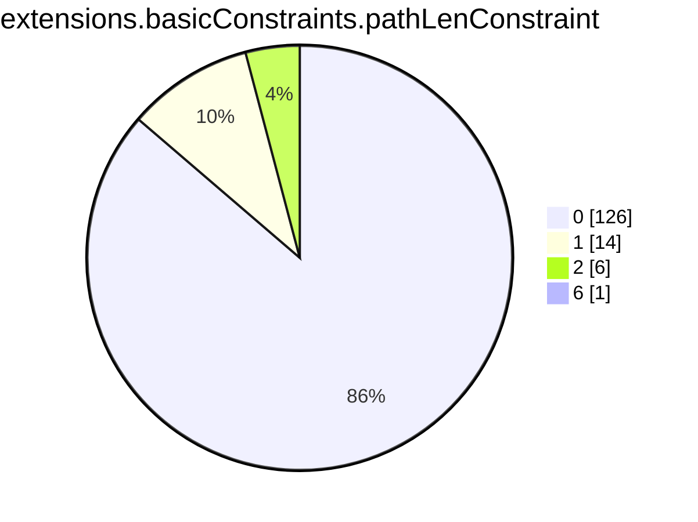
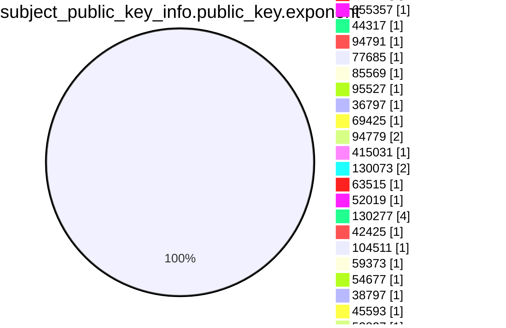
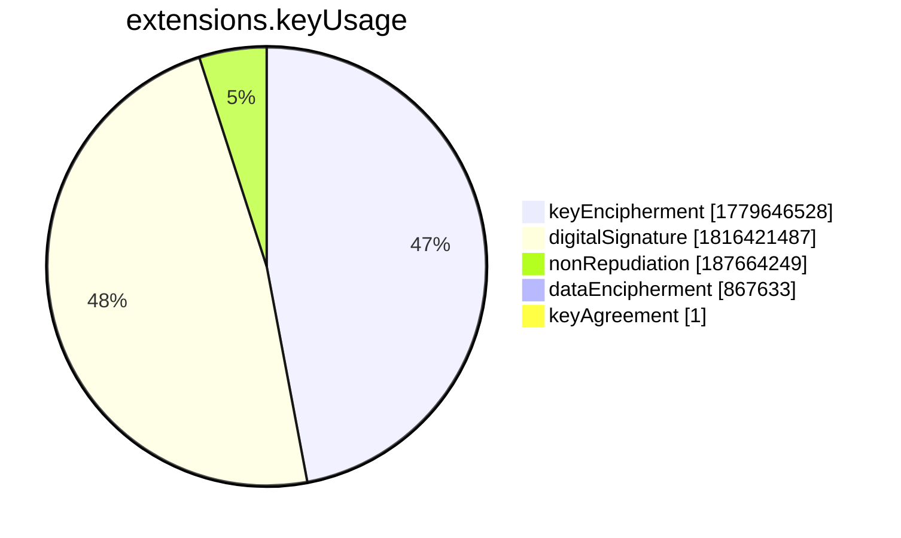
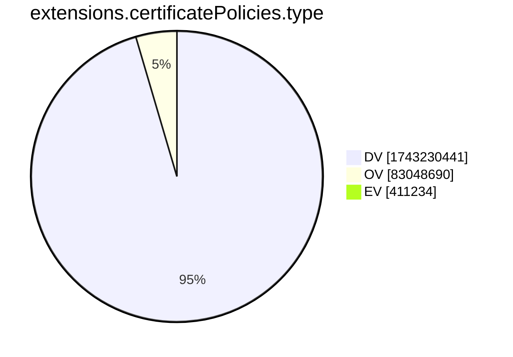
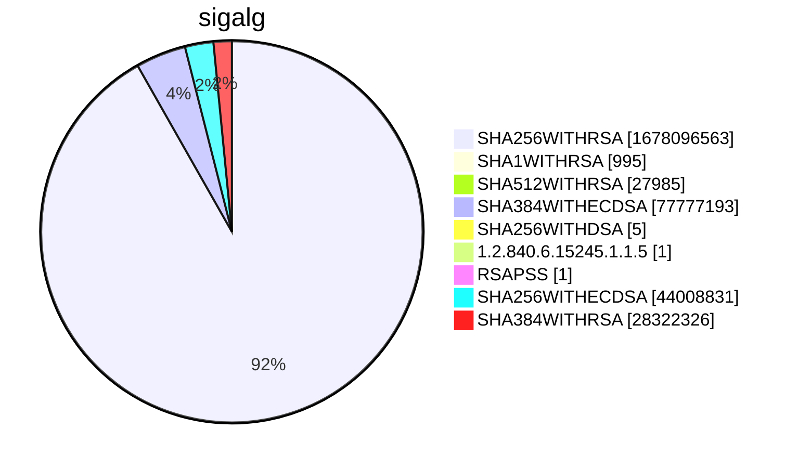

```mermaid
pie showData
title extensions.subjectAlternativeName
"1" :753964631
"2" :809119511
"0" :8086
"3" :97645365
"5" :13833984
"4" :23147958
"25" :64953
"13" :1567876
"15" :782819
"7" :8533104
"6" :10232090
"9" :30238984
"8" :38274540
"11" :11818317
"43" :26858
"41" :52354
"10" :10934153
"20" :1957325
"237" :111
"19" :459907
"12" :2584474
"30" :70833
"42" :42477
"473" :13
"16" :591338
"225" :135
"18" :614952
"157" :145
"423" :24
"266" :64
"71" :11020
"111" :616
"126" :626
"55" :13425
"64" :17560
"268" :40
"640" :11
"235" :115
"128" :627
"75" :11170
"32" :79657
"693" :11
"14" :901793
"74" :11252
"100" :356049
"114" :841
"257" :65
"339" :42
"428" :27
"65" :13329
"48" :61579
"158" :237
"44" :35881
"103" :551
"46" :41619
"188" :363
"50" :178509
"236" :84
"80" :13837
"699" :17
"97" :7292
"115" :556
"154" :243
"26" :89679
"296" :71
"108" :850
"144" :402
"37" :31899
"89" :9699
"104" :765
"22" :2719496
"34" :44373
"53" :57752
"247" :83
"253" :40
"694" :5
"21" :489111
"81" :12587
"49" :75630
"155" :475
"226" :81
"309" :50
"203" :139
"47" :44611
"24" :2526262
"102" :18844
"259" :54
"118" :566
"779" :3
"228" :131
"17" :478669
"28" :66636
"61" :12091
"178" :150
"161" :244
"695" :9
"287" :56
"63" :11545
"342" :36
"208" :164
"263" :58
"147" :461
"261" :70
"240" :134
"415" :18
"165" :231
"531" :25
"170" :235
"493" :7
"66" :18433
"696" :7
"36" :70563
"78" :12270
"429" :18
"29" :48542
"251" :101
"98" :20257
"431" :25
"119" :580
"56" :18047
"648" :77
"176" :445
"923" :13
"60" :33047
"212" :96
"40" :55867
"701" :14
"51" :543737
"153" :358
"39" :29820
"467" :7
"497" :16
"288" :112
"484" :7
"204" :200
"437" :20
"485" :12
"238" :72
"265" :26
"23" :1564994
"156" :365
"702" :20
"183" :171
"38" :38694
"310" :30
"159" :227
"267" :93
"499" :3
"95" :7092
"143" :657
"45" :36436
"146" :309
"31" :36396
"215" :170
"344" :35
"432" :44
"417" :17
"185" :161
"269" :46
"705" :21
"514" :6
"207" :159
"227" :116
"79" :9170
"68" :15037
"395" :38
"174" :392
"698" :10
"52" :59319
"345" :33
"260" :68
"35" :35890
"160" :320
"271" :34
"285" :55
"101" :1089
"707" :10
"90" :16282
"138" :443
"273" :81
"129" :670
"464" :18
"96" :14258
"274" :26
"91" :7677
"311" :38
"107" :558
"83" :9529
"82" :11057
"124" :469
"67" :14818
"76" :12844
"486" :12
"505" :11
"925" :5
"125" :658
"221" :85
"348" :47
"272" :32
"140" :684
"167" :203
"59" :12278
"132" :538
"196" :586
"85" :8966
"54" :30920
"131" :598
"69" :12988
"511" :7
"254" :69
"396" :62
"356" :32
"430" :10
"116" :764
"117" :633
"418" :16
"224" :158
"209" :213
"764" :5
"182" :238
"33" :38781
"216" :157
"419" :32
"241" :97
"488" :30
"316" :35
"191" :133
"275" :53
"120" :983
"258" :105
"361" :36
"276" :82
"489" :10
"88" :10657
"62" :19303
"278" :53
"255" :75
"545" :5
"142" :332
"202" :163
"490" :9
"72" :13516
"77" :8943
"491" :13
"315" :98
"651" :25
"246" :122
"515" :7
"194" :138
"700" :2
"280" :42
"1127" :1
"99" :25479
"58" :15692
"163" :154
"210" :304
"135" :741
"141" :737
"133" :613
"70" :14864
"168" :387
"148" :307
"150" :394
"84" :13733
"87" :9685
"27" :66248
"57" :13289
"233" :131
"145" :497
"239" :94
"172" :316
"139" :803
"516" :10
"277" :34
"112" :646
"121" :576
"86" :10857
"122" :551
"218" :108
"364" :25
"187" :168
"164" :309
"151" :274
"198" :215
"199" :112
"390" :22
"94" :8871
"327" :27
"394" :34
"73" :13326
"492" :8
"615" :3
"149" :392
"220" :97
"123" :667
"494" :13
"256" :61
"230" :100
"162" :380
"130" :502
"312" :74
"195" :160
"106" :620
"169" :185
"281" :70
"529" :8
"495" :102
"192" :436
"232" :107
"166" :183
"366" :36
"152" :335
"110" :641
"572" :23
"546" :34
"134" :530
"93" :9169
"496" :5
"249" :113
"295" :35
"368" :25
"252" :92
"317" :34
"137" :756
"171" :222
"173" :240
"370" :19
"624" :11
"231" :96
"250" :270
"113" :581
"933" :7
"217" :81
"282" :56
"184" :282
"371" :24
"105" :706
"242" :114
"92" :10727
"283" :16
"547" :3
"518" :13
"179" :222
"127" :616
"301" :34
"520" :19
"175" :124
"219" :108
"703" :5
"205" :96
"289" :34
"466" :17
"214" :75
"451" :9
"270" :72
"197" :113
"352" :23
"709" :7
"470" :12
"550" :7
"522" :97
"291" :92
"109" :473
"177" :194
"136" :506
"524" :15
"286" :47
"229" :73
"302" :62
"305" :65
"313" :27
"206" :171
"404" :30
"298" :58
"181" :113
"346" :24
"717" :19
"279" :65
"186" :242
"405" :31
"234" :146
"324" :85
"200" :1057
"721" :5
"223" :106
"704" :16
"526" :9
"293" :82
"211" :99
"326" :27
"201" :137
"453" :21
"193" :132
"284" :47
"628" :3
"294" :72
"328" :18
"303" :56
"637" :7
"723" :5
"406" :73
"330" :60
"350" :38
"527" :9
"407" :31
"656" :9
"657" :11
"180" :357
"781" :4
"552" :10
"332" :47
"854" :8
"472" :11
"336" :55
"697" :5
"2228" :1
"190" :114
"397" :28
"474" :7
"408" :28
"351" :34
"318" :86
"530" :13
"661" :8
"410" :25
"411" :35
"457" :20
"782" :5
"329" :47
"354" :41
"290" :59
"213" :135
"582" :31
"727" :5
"2230" :1
"412" :26
"420" :26
"243" :107
"358" :32
"401" :25
"553" :9
"2231" :1
"292" :45
"532" :7
"2240" :1
"355" :25
"414" :35
"743" :8
"304" :27
"245" :81
"533" :11
"222" :118
"244" :79
"300" :79
"416" :24
"534" :28
"535" :9
"297" :79
"643" :5
"537" :9
"2241" :1
"478" :8
"362" :23
"320" :41
"363" :69
"538" :5
"664" :9
"2242" :1
"665" :14
"1026" :1
"360" :28
"319" :37
"2243" :1
"540" :23
"262" :33
"2244" :1
"2252" :1
"374" :20
"555" :17
"248" :119
"338" :41
"308" :56
"2254" :1
"376" :22
"189" :143
"2255" :1
"459" :21
"542" :18
"378" :45
"556" :9
"2257" :1
"480" :31
"670" :4
"557" :11
"384" :25
"359" :31
"544" :10
"590" :10
"751" :2
"391" :33
"2260" :1
"424" :14
"482" :11
"753" :11
"2266" :1
"653" :4
"937" :3
"2267" :1
"2269" :1
"2270" :1
"399" :42
"2273" :1
"2275" :5
"1971" :3
"1972" :2
"426" :22
"788" :3
"1973" :1
"321" :63
"828" :15
"427" :9
"755" :5
"322" :38
"1974" :1
"953" :1
"785" :3
"503" :7
"353" :36
"671" :7
"565" :7
"377" :32
"442" :10
"672" :17
"791" :5
"567" :8
"568" :8
"571" :10
"444" :24
"563" :13
"475" :9
"906" :5
"323" :35
"325" :22
"623" :7
"1000" :1011
"477" :14
"605" :10
"385" :17
"602" :15
"333" :42
"856" :2
"793" :2
"675" :11
"481" :9
"331" :19
"712" :6
"891" :4
"380" :27
"398" :42
"382" :21
"445" :7
"574" :6
"884" :4
"589" :2
"334" :19
"335" :33
"627" :11
"714" :6
"400" :26
"928" :6
"962" :2
"972" :4
"383" :22
"949" :1
"386" :27
"387" :38
"449" :17
"566" :21
"630" :10
"587" :13
"392" :62
"795" :7
"870" :20
"866" :5
"439" :10
"375" :23
"476" :19
"463" :12
"469" :9
"501" :9
"450" :20
"580" :10
"433" :12
"393" :47
"564" :28
"576" :97
"796" :5
"343" :26
"583" :9
"585" :14
"586" :21
"718" :2
"725" :8
"736" :6
"595" :9
"756" :20
"596" :13
"679" :2
"513" :12
"681" :10
"789" :9
"388" :70
"606" :25
"507" :21
"799" :2
"996" :10
"618" :49
"454" :19
"974" :4
"976" :2
"742" :6
"500" :13
"631" :4
"977" :3
"577" :6
"314" :28
"617" :14
"456" :25
"569" :13
"878" :12
"570" :21
"772" :4
"801" :21
"941" :7
"468" :16
"519" :27
"685" :2
"821" :2
"652" :3
"790" :7
"264" :69
"797" :6
"942" :9
"659" :16
"525" :55
"460" :11
"803" :3
"667" :2
"349" :21
"673" :5
"510" :10
"357" :50
"683" :14
"573" :15
"689" :16
"669" :12
"389" :48
"340" :28
"581" :7
"800" :6
"676" :6
"367" :24
"347" :25
"372" :39
"1249" :1
"802" :1
"634" :1
"536" :11
"804" :41
"509" :19
"539" :17
"650" :3
"684" :7
"461" :26
"846" :3
"521" :9
"1190" :2
"662" :9
"299" :55
"645" :10
"584" :51
"560" :21
"588" :18
"592" :5
"616" :2
"438" :39
"591" :13
"440" :22
"604" :3
"1139" :1
"562" :10
"678" :11
"549" :11
"807" :7
"691" :3
"409" :23
"1800" :2
"995" :1
"306" :58
"823" :2
"837" :8
"307" :38
"554" :9
"829" :4
"373" :18
"337" :18
"813" :8
"558" :79
"632" :7
"402" :20
"365" :18
"843" :5
"1132" :2
"1133" :4
"1135" :4
"597" :9
"579" :21
"847" :1
"848" :3
"1136" :2
"1124" :2
"1123" :2
"1122" :2
"849" :1
"853" :3
"855" :13
"861" :13
"1116" :4
"864" :123
"713" :3
"341" :49
"865" :2
"824" :1
"1112" :4
"381" :44
"1097" :2
"1073" :2
"1071" :2
"593" :4
"872" :5
"1035" :2
"603" :12
"991" :4
"935" :6
"607" :15
"875" :5
"826" :3
"692" :8
"877" :5
"447" :29
"1004" :1
"403" :17
"880" :1
"369" :73
"886" :1
"479" :9
"889" :3
"890" :7
"379" :11
"810" :11
"816" :11
"1008" :1
"858" :1
"894" :5
"633" :51
"413" :31
"792" :53
"794" :4
"901" :3
"422" :22
"425" :19
"903" :13
"599" :10
"434" :18
"601" :6
"435" :14
"441" :46
"443" :22
"774" :9
"862" :5
"780" :12
"840" :2
"825" :16
"819" :12
"822" :18
"831" :80
"446" :11
"798" :13
"452" :15
"754" :2
"458" :11
"471" :20
"844" :2
"578" :8
"465" :27
"686" :16
"885" :30
"950" :4
"663" :12
"998" :8
"614" :13
"857" :4
"957" :26
"934" :2
"897" :6
"997" :6
"973" :2
"920" :6
"860" :6
"911" :16
"806" :5
"899" :6
"902" :5
"506" :8
"512" :10
"905" :6
"908" :14
"914" :4
"710" :6
"917" :6
"600" :92
"938" :4
"895" :2
"668" :10
"765" :4
"834" :22
"867" :8
"999" :36
"674" :7
"548" :14
"978" :4
"931" :2
"900" :8
"944" :4
"677" :8
"551" :8
"680" :6
"528" :20
"575" :17
"609" :88
"993" :4
"852" :8
"888" :20
"608" :6
"833" :3
"724" :2
"893" :7
"641" :4
"638" :6
"610" :10
"649" :6
"932" :4
"646" :2
"647" :6
"541" :2
"613" :1
"626" :16
"629" :8
"421" :14
"502" :8
"929" :4
"716" :6
"820" :1
"835" :1
"611" :22
"731" :6
"882" :18
"983" :6
"750" :10
"744" :8
"921" :10
"873" :8
"746" :4
"436" :4
"876" :6
"483" :6
"598" :3
"619" :2
"809" :6
"612" :15
"879" :14
"708" :8
"926" :8
"887" :2
"896" :2
"989" :2
"838" :1
"839" :5
"748" :2
"523" :6
"690" :14
"517" :8
"543" :78
"462" :26
"455" :12
"719" :2
"722" :6
"728" :4
"734" :6
"737" :6
"740" :4
"559" :12
"508" :4
"752" :2
"1013" :1
"758" :2
"761" :2
"767" :6
"776" :4
"818" :6
"1212" :1
"985" :8
"621" :3
"654" :6
"768" :20
"951" :14
"948" :10
"771" :14
"954" :22
"808" :1
"966" :92
"969" :6
"915" :62
"759" :6
"963" :50
"845" :4
"827" :1
"971" :2
"817" :2
"658" :7
"620" :2
"842" :6
"960" :26
"927" :16
"851" :4
"687" :8
"747" :12
"448" :5
"561" :9
"945" :6
"869" :8
"836" :2
"913" :2
"644" :2
"883" :2
"711" :6
"636" :8
"805" :2
"760" :4
"910" :2
"763" :2
"666" :8
"655" :2
"729" :16
"980" :2
"682" :6
"965" :2
"706" :2
"715" :2
"730" :2
"904" :2
"745" :2
"720" :12
"984" :2
"907" :2
"918" :18
"635" :10
"841" :2
"936" :4
"939" :12
"773" :2
"909" :6
"811" :4
"498" :15
"777" :2
"726" :8
"770" :2
"863" :4
"783" :10
"786" :6
"642" :4
"504" :4
"741" :12
"874" :2
"660" :12
"992" :4
"832" :2
"956" :4
"959" :6
"487" :2
"912" :6
"769" :2
"732" :4
"594" :2
"924" :2
"762" :2
"982" :2
"735" :4
"987" :2
"943" :2
"784" :2
"639" :2
"738" :2
```

```mermaid
pie showData
title subject.cn.tld
"tw" :1950090
"fi" :5299107
"com" :738210973
"at" :6523273
"nl" :23273277
"org" :46063645
"mil" :6207
"MIL" :17
"ORG" :884
"gov" :241058
"Mil" :1
"edu" :1775541
"cc" :2552729
"fr" :20853155
"ca" :12229352
"il" :2011815
"au" :16877716
"net" :67636333
"de" :59207661
"museum" :4760
"zone" :353587
"berlin" :107332
"ru" :29789543
"se" :7837318
"kr" :2019458
"eu" :11026977
"lt" :983860
"uk" :36307765
"si" :1035171
"ua" :5129068
"asia" :726244
"jp" :9409893
"vn" :3472597
"no" :4908350
"ge" :313738
"info" :9872122
"ch" :15332835
"gr" :3629325
"id" :7219761
"be" :8101573
"cl" :5068733
"pro" :3088700
"media" :440499
"ec" :373305
"cz" :7304260
"it" :13168857
"pl" :13665084
"su" :728232
"hu" :5879021
"ag" :95711
"me" :16396241
"br" :30217779
"sk" :1895730
"co" :18624859
"io" :34172615
"my" :1710111
"kz" :1236312
"by" :985284
"digital" :958100
"mobi" :500080
"rs" :1250603
"store" :3724224
"ee" :1251403
"cloud" :4184032
"pt" :2505173
"nrw" :35347
"expert" :138453
"za" :10185897
"biz" :4119650
"tr" :2158248
"team" :461033
"name" :412630
"mx" :5186812
"gmbh" :67514
"la" :295102
"ph" :601429
"es" :6515346
"cn" :7295629
"lv" :741519
"ht" :17261
"nu" :1001535
"ro" :4848804
"world" :672141
"coop" :98549
"hr" :1047830
"global" :192350
"nz" :3518182
"am" :187766
"ma" :609239
"company" :266791
"us" :5139190
"sg" :1224725
"solutions" :347499
"ie" :1358405
"bz" :149073
"tv" :1454796
"fm" :117768
"ky" :24515
"pa" :45249
"men" :47801
"dk" :5206432
"sa" :363554
"ar" :4275589
"top" :3519059
"group" :464366
"ai" :1050250
"gg" :315242
"bid" :54474
"schule" :25153
"xn--p1ai" :2071727
"az" :217469
"cm" :115624
"xyz" :15534083
"games" :197828
"online" :8134424
"tech" :3783171
"app" :5309890
"in" :11225177
"ga" :1027244
"cat" :462367
"bot" :9336
"sh" :360161
"melbourne" :20430
"one" :778389
"im" :267819
"hk" :790629
"london" :109535
"cy" :111791
"do" :183715
"aero" :121834
"pk" :870479
"family" :126136
"express" :36237
"bg" :849776
"club" :3006795
"vip" :1674578
"pe" :994549
"ng" :1177354
"to" :26599258
"COM" :12876
"works" :181352
"ski" :21318
"xn--3e0b707e" :3275
"limo" :5068
"CA" :634
"bd" :224166
"network" :447895
"attorney" :5408
"jo" :18850
"life" :1641530
"ae" :596114
"sc" :31706
"shop" :4903505
"mu" :56799
"services" :260951
"nc" :49552
"fj" :12418
"bayern" :53073
"ve" :133879
"casino" :39472
"space" :2414241
"lu" :439816
"ke" :845712
"tirol" :32125
"forex" :1563
"eus" :73952
"ug" :73531
"physio" :5481
"int" :17791
"th" :535989
"rest" :80804
"wiki" :92707
"uy" :405064
"bi" :21324
"is" :573189
"re" :211024
"tz" :216273
"institute" :41365
"bh" :11477
"ninja" :263680
"gt" :139736
"events" :140556
"moe" :116249
"tokyo" :498004
"art" :929833
"tools" :222280
"news" :273465
"li" :296356
"red" :115338
"host" :445790
"shoes" :11440
"farm" :96609
"today" :332455
"cr" :111997
"jm" :8474
"site" :5503924
"gl" :30968
"dz" :99615
"academy" :232620
"studio" :669647
"xn--j1amh" :20167
"ws" :306870
"ly" :195811
"video" :130198
"gallery" :85048
"bet" :110642
"cheap" :10389
"kg" :79087
"blue" :103379
"bzh" :59750
"dev" :5129745
"pet" :42487
"church" :207085
"mt" :64844
"AU" :253
"guru" :242745
"icu" :481681
"social" :136988
"email" :288463
"vc" :205309
"lk" :370899
"black" :27763
"ac" :71927
"NET" :1244
"tf" :28505
"qa" :72747
"work" :1450401
"tg" :17794
"university" :26176
"technology" :109732
"holdings" :16658
"watch" :52224
"eg" :44821
"software" :123605
"report" :40591
"earth" :91738
"mz" :70100
"md" :299927
"live" :1865927
"page" :1886442
"st" :151291
"py" :211515
"fun" :1316366
"website" :1278441
"pf" :11849
"ps" :55952
"xn--qxam" :3785
"bank" :26479
"limited" :20250
"travel" :112819
"rocks" :501019
"casa" :906725
"tk" :2193130
"international" :58412
"immobilien" :10404
"as" :66007
"observer" :5963
"school" :122001
"saarland" :9841
"cab" :13116
"systems" :318032
"training" :72314
"plus" :223112
"swiss" :94241
"link" :2079599
"law" :55549
"al" :169038
"uz" :444181
"gifts" :20482
"blog" :864665
"bike" :58520
"education" :129547
"press" :63589
"ms" :58728
"parts" :15904
"ngo" :20165
"ong" :6080
"supplies" :9327
"np" :385806
"mk" :231436
"amsterdam" :114630
"fyi" :86828
"ba" :237246
"city" :260671
"coach" :79198
"codes" :124525
"sv" :42719
"post" :423
"vg" :12724
"hosting" :67322
"design" :804402
"tn" :195991
"ovh" :648105
"jobs" :40902
"science" :61496
"agency" :578148
"lb" :17008
"fit" :178156
"click" :518818
"film" :28195
"scot" :45119
"wien" :44092
"paris" :58221
"cw" :4507
"om" :19326
"EMAIL" :3
"tips" :59858
"consulting" :120915
"archi" :15920
"kitchen" :29250
"run" :1587985
"help" :102324
"chat" :124354
"pics" :30193
"ltd" :329640
"africa" :213586
"love" :140849
"vacations" :6916
"monster" :221650
"DK" :94
"glass" :11496
"business" :119057
"gh" :43699
"mp" :5084
"boutique" :72737
"tours" :36404
"US" :146
"coffee" :96331
"immo" :51209
"wf" :22268
"healthcare" :21082
"community" :87754
"care" :146855
"ad" :8320
"bio" :98842
"sport" :4214
"mo" :10998
"legal" :57387
"BR" :112
"vision" :49444
"leclerc" :1749
"support" :123575
"repair" :19715
"pw" :726867
"xn--80adxhks" :26391
"srl" :65167
"vet" :41817
"estate" :34888
"lawyer" :13102
"total" :533
"wtf" :173426
"weir" :1257
"ci" :95443
"party" :95361
"partners" :40001
"guide" :57954
"rw" :63650
"ni" :16346
"photo" :128494
"health" :102389
"stream" :82798
"deals" :29183
"place" :44732
"fund" :138407
"direct" :4279861
"energy" :71864
"solar" :39669
"car" :1267
"lighting" :13758
"koeln" :45281
"bj" :20534
"haus" :33776
"pub" :95634
"tickets" :966
"sx" :18477
"buzz" :473282
"market" :115271
"IE" :20
"marketing" :121427
"foundation" :71800
"dhl" :308
"ax" :38251
"fo" :41770
"nyc" :199798
"sydney" :18045
"house" :104205
"center" :269440
"rent" :25290
"bible" :14335
"hockey" :3967
"bo" :114734
"flights" :5123
"gs" :31739
"krd" :6424
"gy" :19460
"directory" :47393
"ck" :2418
"kh" :26770
"miami" :29197
"IN" :141
"so" :189401
"tj" :24453
"industries" :20460
"bnpparibas" :829
"barclays" :373
"EU" :51
"IT" :58
"dental" :27962
"enterprises" :16509
"doctor" :12585
"mn" :141678
"photography" :251191
"football" :14846
"bm" :16035
"cafe" :112741
"woodside" :368
"eco" :40347
"xn--90ais" :41148
"delivery" :45235
"kw" :17548
"crs" :418
"GOV" :705
"tl" :13098
"gal" :27921
"NO" :14
"best" :216567
"je" :31644
"frl" :36716
"EDU" :416
"ao" :68088
"cologne" :7893
"cba" :316
"ir" :3424720
"zw" :141388
"brussels" :29608
"gd" :89753
"xn--80aswg" :8561
"xn--80asehdb" :10927
"sfr" :1
"UK" :277
"ooo" :67248
"condos" :7622
"cx" :108434
"hamburg" :32267
"tc" :26079
"komatsu" :234
"mm" :28773
"sy" :12739
"moscow" :68202
"mc" :19047
"ruhr" :14999
"cool" :160631
"JO" :13
"mg" :45506
"sn" :44528
"Uk" :6
"bs" :4664
"neustar" :348
"abb" :1302
"trade" :83746
"sr" :12571
"NL" :74
"cd" :16085
"trust" :16
"finance" :216052
"na" :63992
"SG" :141
"HK" :66
"hn" :32518
"et" :25604
"cash" :83441
"BE" :36
"taipei" :4942
"tt" :15228
"uno" :116310
"investments" :12449
"insure" :19102
"fitness" :49381
"clinic" :53318
"DE" :231
"mw" :9960
"garden" :17755
"xxx" :37444
"tax" :31619
"pizza" :41051
"MZ" :4
"land" :101404
"golf" :38265
"bn" :5292
"date" :24879
"cf" :978761
"ml" :1621665
"pictet" :402
"af" :26722
"Net" :26
"download" :33775
"mr" :6037
"beer" :48678
"productions" :41410
"aw" :2811
"zm" :24978
"computer" :23173
"wales" :33957
"exchange" :57382
"MX" :29
"barclaycard" :103
"win" :486169
"pm" :57969
"xn--o3cw4h" :1005
"mom" :11975
"band" :69668
"Com" :190
"pg" :16865
"jetzt" :37496
"green" :27910
"sm" :10136
"kiwi" :35877
"pr" :6651
"Store" :1
"ES" :107
"restaurant" :24326
"bt" :13632
"soy" :7104
"money" :66797
"dentist" :5651
"construction" :25635
"charity" :7213
"irish" :11309
"bw" :43063
"realty" :181053
"ntt" :580
"llc" :59247
"cfa" :23
"ki" :2906
"cv" :18022
"istanbul" :10513
"careers" :24261
"graphics" :27191
"yoga" :53239
"shopping" :24242
"bb" :4219
"claims" :6998
"accountants" :4095
"wang" :53803
"audio" :19490
"sb" :5785
"xn--90ae" :6137
"sex" :8993
"gent" :31360
"tui" :142
"yt" :23380
"Photography" :2
"tm" :11178
"ink" :179343
"xn--p1acf" :69166
"capital" :91004
"promo" :33148
"management" :38668
"reviews" :48672
"dance" :38738
"gi" :7144
"new" :11554
"tel" :83637
"sap" :29588
"sz" :7122
"wedding" :84762
"GR" :35
"Biz" :34
"SE" :37
"fk" :407
"review" :60957
"politie" :110
"alsace" :7638
"vig" :417
"rentals" :36489
"fish" :25736
"style" :61638
"xn--mgbaam7a8h" :43
"iq" :27502
"xn--mk1bu44c" :1793
"photos" :93721
"gift" :21104
"realtor" :60583
"ne" :3707
"cooking" :7086
"college" :11092
"SA" :58
"boats" :2629
"cg" :6897
"surf" :53565
"onl" :49043
"gdn" :6860
"fan" :19017
"bar" :122101
"MA" :18
"builders" :24404
"dog" :55537
"lc" :23851
"vegas" :22824
"engineering" :48063
"afl" :207
"auto" :3690
"JP" :184
"camera" :10216
"ist" :22273
"AE" :46
"mv" :27334
"pn" :948
"BH" :8
"ls" :12499
"career" :2542
"jnj" :1096
"gold" :117120
"forsale" :12505
"sale" :69188
"anz" :126
"game" :16020
"kn" :1688
"lat" :29821
"fage" :56
"exposed" :7134
"gq" :501377
"dating" :17674
"LB" :15
"loan" :16716
"Org" :34
"cuisinella" :19
"schmidt" :130
"INFO" :12
"quebec" :21481
"pictures" :40781
"sncf" :314
"aig" :10
"sexy" :13657
"lamborghini" :276
"nf" :39229
"sucks" :1442
"CZ" :12
"ipiranga" :27
"lol" :112089
"CBA" :13
"tires" :3040
"taxi" :29167
"vu" :105726
"rip" :52027
"KW" :10
"yokohama" :16233
"kpn" :112
"xn--9dbq2a" :1196
"TW" :99
"sew" :26
"COm" :1
"uol" :62
"DZ" :4
"ZA" :40
"salon" :20624
"tattoo" :24023
"surgery" :6965
"cards" :33213
"faith" :18562
"Asia" :3
"desi" :4078
"inc" :15699
"properties" :35883
"show" :89924
"pink" :33333
"fashion" :46490
"cars" :1454
"edeka" :464
"bf" :9036
"stockholm" :29
"menu" :37303
"tube" :18867
"sbi" :193
"Fr" :20
"memorial" :3188
"vi" :1764
"domains" :175367
"army" :19711
"fox" :842
"xn--otu796d" :39
"axa" :107
"sener" :62
"CH" :14
"webcam" :7765
"wine" :50394
"villas" :4668
"AO" :12
"monash" :125
"hospital" :3515
"xn--czr694b" :74
"radio" :10369
"mortgage" :10785
"lgbt" :12962
"poker" :10073
"coupons" :5595
"luxury" :3634
"BM" :1
"camp" :37695
"xin" :16822
"furniture" :10648
"CN" :19
"rodeo" :7547
"dm" :3151
"VN" :13
"vin" :19621
"pharmacy" :1001
"NETWORK" :8
"racing" :10873
"gm" :7281
"CY" :3
"statefarm" :4926
"CAFE" :1
"homes" :44519
"financial" :24824
"gratis" :12663
"microsoft" :9
"moda" :29937
"lanxess" :28
"vlaanderen" :22016
"soccer" :7841
"xn--ses554g" :417
"kaufen" :8745
"apple" :44
"schwarz" :1152
"aq" :639
"BANK" :2
"okinawa" :21498
"build" :54186
"associates" :11953
"tW" :1
"kyoto" :6545
"KH" :25
"corsica" :8080
"BIZ" :53
"nagoya" :19658
"cymru" :20166
"trading" :6756
"toys" :18553
"reise" :1783
"weber" :791
"WS" :6
"deloitte" :93
"loans" :10889
"auspost" :45
"MOBI" :8
"Ca" :2
"rugby" :1563
"credit" :18770
"accountant" :3124
"jprs" :18
"PH" :15
"cisco" :11
"supply" :23323
"sharp" :295
"dvag" :6935
"ASIA" :8
"brother" :68
"man" :459
"comcast" :5
"xfinity" :5
"apartments" :11331
"osaka" :3638
"moi" :297
"sakura" :14
"office" :4
"azure" :46
"windows" :4
"skype" :4
"hotmail" :4
"xbox" :4
"bing" :4
"AM" :2
"cam" :83556
"horse" :15975
"movie" :7964
"godaddy" :156
"рф" :1
"recipes" :11231
"ice" :4
"ventures" :50027
"diamonds" :5463
"catering" :8635
"auction" :13377
"Bank" :4
"property" :6944
"fail" :15754
"Gov" :31
"barcelona" :11305
"abudhabi" :801
"td" :3060
"cricket" :4749
"lidl" :201
"holiday" :11915
"voyage" :8229
"CO" :23
"xn--h2brj9c" :1006
"MU" :3
"AT" :4
"statebank" :34
"how" :14271
"dj" :8881
"ET" :13
"FI" :37
"allfinanz" :228
"IO" :17
"mq" :1713
"extraspace" :33
"AERO" :2
"TH" :30
"ID" :20
"MT" :17
"cleaning" :10171
"abbott" :977
"SBI" :9
"FR" :45
"NZ" :26
"MY" :15
"kim" :35449
"sl" :5657
"goog" :177972
"gn" :1937
"canon" :481
"dubai" :33
"ikano" :247
"gop" :3843
"gp" :5923
"engineer" :22478
"Social" :5
"florist" :27800
"jewelry" :16276
"insurance" :1096
"study" :39964
"mh" :43
"gea" :82
"uK" :4
"ye" :4113
"Dev" :1
"seat" :248
"LA" :3
"PT" :6
"madrid" :4478
"accenture" :1
"yachts" :2530
"tienda" :11383
"med" :215
"mit" :8
"realestate" :23724
"gives" :7859
"Edu" :9
"EC" :2
"motorcycles" :1617
"ANZ" :5
"futbol" :5524
"nissan" :38
"goV" :1
"XYZ" :78
"SK" :3
"town" :30848
"va" :73
"bentley" :31
"Live" :6
"xn--90a3ac" :3859
"citic" :37
"plumbing" :6339
"GH" :2
"porn" :9050
"QA" :12
"equipment" :8139
"RU" :30
"EUS" :1
"DO" :4
"SI" :6
"sandvik" :159
"PY" :4
"NG" :2
"RW" :2
"lundbeck" :3
"vote" :14666
"bmw" :12430
"suzuki" :63
"NA" :1
"broker" :3955
"LONDON" :1
"xn--d1acj3b" :2882
"flowers" :5080
"tatamotors" :19
"aws" :3561
"cyou" :269637
"AG" :9
"sarl" :6138
"luxe" :3896
"RO" :75
"bingo" :5876
"globo" :1136
"rio" :6062
"vanguard" :135
"tennis" :5049
"fans" :20002
"markets" :5655
"orange" :1959
"hsbc" :44
"sd" :35626
"contractors" :6310
"saxo" :108
"aquarelle" :34
"clothing" :34276
"nike" :40
"ltda" :1614
"viajes" :3815
"mba" :16230
"Dk" :1
"sony" :40
"foo" :157
"fishing" :4292
"xn--vhquv" :49
"xn--3bst00m" :2
"sky" :601
"kpmg" :33
"hm" :2636
"itau" :71
"bargains" :4091
"TECH" :8
"xn--vuq861b" :77
"teva" :129
"lease" :6242
"toray" :118
"ceo" :97871
"diet" :2488
"cern" :49
"jll" :34
"broadway" :40
"singles" :7159
"democrat" :2514
"cpa" :10663
"xn--c1avg" :1753
"xn--tckwe" :4731
"hiphop" :1125
"versicherung" :1917
"security" :3710
"xn--g2xx48c" :35
"audi" :1293
"TR" :2
"dealer" :102
"xn--kpry57d" :1178
"reisen" :9077
"LT" :3
"nico" :71
"toyota" :97
"SALE" :4
"BN" :7
"basketball" :2035
"xn--czru2d" :51
"abc" :35
"locus" :148
"baby" :14541
"contact" :22819
"xn--node" :546
"gay" :141113
"gu" :180
"bradesco" :237
"discount" :5514
"rehab" :7225
"temasek" :12
"xn--fiqs8s" :7080
"xn--q9jyb4c" :2529
"courses" :10930
"vodka" :3974
"ren" :26520
"juegos" :556
"xn--6qq986b3xl" :5292
"degree" :1990
"christmas" :3555
"ryukyu" :1958
"PL" :8
"navy" :6070
"republican" :2358
"country" :3342
"cruises" :2917
"theater" :5188
"joburg" :9414
"adult" :2913
"maison" :3890
"HOST" :15
"ABUDHABI" :1
"capetown" :15223
"actor" :7779
"bbva" :25
"xn--ngbc5azd" :361
"xn--io0a7i" :872
"ally" :4
"VIP" :7
"organic" :6657
"airforce" :1983
"boston" :5832
"xn--6frz82g" :3305
"hitachi" :42
"gripe" :758
"creditcard" :2890
"gf" :1739
"durban" :5625
"bond" :48218
"AR" :18
"blackfriday" :769
"xn--fiq228c5hs" :102
"ME" :9
"xn--j6w193g" :4171
"voting" :128
"gw" :3841
"香港" :7
"Be" :1
"xn--3ds443g" :154
"xn--qxa6a" :153
"guitars" :1230
"tatar" :2912
"ricoh" :275
"shiksha" :1516
"xn--t60b56a" :272
"scb" :49
"abogado" :980
"TT" :1
"next" :289
"KR" :5
"shell" :1019
"KE" :8
"gucci" :72
"nikon" :1
"nr" :373
"storage" :1343
"honda" :54
"otsuka" :34
"CC" :2
"pfizer" :21
"showtime" :4
"cbs" :29
"Za" :4
"schaeffler" :1369
"xn--unup4y" :63
"lotto" :137
"xn--e1a4c" :1719
"voto" :937
"bR" :1
"mango" :65
"bloomberg" :4
"TV" :4
"lr" :2349
"HR" :12
"autos" :13592
"nab" :4
"compare" :734
"theatre" :80
"ss" :1133
"williamhill" :12
"SAP" :1
"select" :514
"philips" :9
"CL" :18
"bcn" :28
"pioneer" :34
"goo" :25
"genting" :18
"hiv" :386
"xn--rhqv96g" :294
"qpon" :578
"WORLD" :1
"arpa" :6
"ismaili" :100
"bridgestone" :162
"mma" :38
"IS" :1
"erni" :59
"jcb" :39
"Global" :2
"CLOUD" :4
"STUDIO" :2
"xn--54b7fta0cc" :519
"SPACE" :4
"beauty" :28667
"xerox" :2
"lego" :34
"skin" :9853
"infiniti" :37
"MO" :2
"xn--55qx5d" :6346
"Zone" :5
"ubs" :1
"APP" :1
"hair" :9730
"quest" :88117
"kfh" :10
"linde" :4
"makeup" :6423
"forum" :1031
"Solutions" :1
"BRADESCO" :16
"xn--fiqz9s" :716
"ifm" :620
"PE" :4
"ericsson" :7
"CM" :1
"xn--fjq720a" :53
"CRS" :1
"ONLINE" :6
"XN--P1AI" :29
"sanofi" :28
"aaa" :11
"xn--2scrj9c" :71
"reit" :83
"BO" :1
"xn--5tzm5g" :521
"coM" :2
"bauhaus" :147
"itv" :5
"IQ" :2
"amex" :1
"xn--mgbbh1a71e" :55
"Health" :3
"hisamitsu" :274
"EE" :1
"rwe" :2
"xn--fct429k" :1
"GAL" :1
"BZ" :27
"protection" :56
"xn--mgberp4a5d4ar" :552
"IL" :13
"xn--mgbab2bd" :184
"kred" :942726
"jaguar" :2
"landrover" :2
"cfd" :58601
"UG" :2
"LAW" :2
"nec" :37
"natura" :4
"xn--rovu88b" :2
"xn--eckvdtc9d" :1
"xn--1ck2e1b" :1
"arab" :1
"xn--jlq480n2rg" :1
"tushu" :1
"silk" :1
"read" :1
"imdb" :1
"free" :1
"xn--rvc1e0am3e" :36
"xn--ngbrx" :1
"stada" :122
"airbus" :8
"La" :1
"call" :1
"audible" :1
"Systems" :6
"HU" :5
"PK" :2
"SINGLES" :1
"GLOBAL" :3
"cN" :1
"LIFE" :4
"AI" :6
"CR" :1
"xn--80ao21a" :419
"BG" :1
"ZM" :2
"bbc" :24
"xn--y9a3aq" :2335
"hermes" :119
"samsung" :2
"creditunion" :117
"lilly" :16
"bosch" :1
"km" :635
"smart" :22
"kinder" :10
"xn--mgbca7dzdo" :2
"Dog" :2
"analytics" :3
"ACADEMY" :2
"City" :9
"zuerich" :2083
"sbs" :97509
"redumbrella" :1
"travelers" :1
"travelersinsurance" :1
"trv" :1
"Pro" :2
"farmers" :2
"walter" :2
"Online" :15
"chase" :4
"mini" :31
"JM" :1
"xn--wgbh1c" :35
"DEV" :1
"AF" :2
"clubmed" :133
"PRO" :1
"xn--hxt814e" :119
"SITE" :1
"guardian" :3
"zara" :8
"Video" :1
"aco" :964
"mutual" :3
"northwesternmutual" :2
"amazon" :15
"yandex" :302
"jmp" :3
"NTT" :3
"GG" :4
"PF" :1
"OM" :2
"booking" :1
"amica" :1
"SL" :8
"mattel" :511
"bms" :1
"DIGITAL" :6
"xn--kput3i" :3363
"QUEST" :2
"INT" :1
"google" :28863
"mtr" :1
"deV" :1
"rich" :623
"GL" :1
"xn--d1alf" :204
"WORK" :1
"UA" :1
"FOX" :1
"softbank" :60
"Loan" :4
"KZ" :2
"Bid" :1
"ZONE" :1
"sas" :2
"ford" :2
"able" :4
"Healthcare" :1
"cu" :32059
"xn--mgbah1a3hjkrd" :35
"er" :27
"lplfinancial" :11
"xn--mgbayh7gpa" :88
"nowruz" :47
"xn--i1b6b1a6a2e" :79
"xn--xkc2dl3a5ee0h" :309
"ML" :14
"xn--xhq521b" :108
"toshiba" :48
"yodobashi" :27
"firestone" :19
"stc" :24
"lotte" :27
"gmo" :80
"nhk" :29
"goldpoint" :30
"epson" :26
"dnp" :26
"kddi" :29
"fujitsu" :28
"playstation" :23
"datsun" :26
"kia" :26
"lexus" :21
"panasonic" :27
"mitsubishi" :26
"hyundai" :31
"lixil" :19
"STORE" :1
"xn--mgba3a4f16a" :81
"bugatti" :54
"COOP" :3
"lpl" :11
"feedback" :803
"fresenius" :10
"chintai" :14
"bostik" :306
"maif" :148
"whoswho" :28
"beats" :4
"xn--nqv7f" :110
"ferrero" :67
"youtube" :293
"meet" :52
"xn--wgbl6a" :15
"gle" :60
"xn--1qqw23a" :5505
"Tk" :16
"xn--czrs0t" :108
"watches" :4
"abbvie" :36
"aeg" :2
"ECO" :1
"xn--s9brj9c" :69
"nra" :11
"ggee" :26
"tvs" :23
"xn--pgbs0dh" :13
"jio" :22
"firmdale" :884
"ups" :7
"TM" :1
"xn--gckr3f0f" :34
"helsinki" :32
"xn--45brj9c" :215
"vivo" :25
"xn--nqv7fs00ema" :13
"xn--mix891f" :16
"kosher" :10
"pru" :23
"One" :2
"xn--ygbi2ammx" :18
"xn--gecrj9c" :49
"xn--fpcrj9c3d" :53
"vuelos" :10
"eurovision" :9
"xn--h2breg3eve" :60
"alstom" :9
"TC" :1
"ieee" :7
"hoteles" :10
"xn--ogbpf8fl" :154
"flir" :29
"wme" :10
"passagens" :9
"omega" :18
"ses" :1
"safety" :4
"grainger" :2
"chrome" :12
"TK" :38
"SCOT" :4
"xn--4gbrim" :30
"netflix" :12
"CITY" :1
"Show" :1
"xn--fzc2c9e2c" :24
"redstone" :1
"lacaixa" :12
"MR" :2
"Cloud" :3
"Ltd" :140
"arte" :70
"channel" :266
"dabur" :26
"fairwinds" :40
"INDUSTRIES" :2
"latrobe" :7
"xn--mgbpl2fh" :28
"citi" :8
"java" :31
"csc" :3
"xn--3hcrj9c" :48
"cancerresearch" :10
"reliance" :19
"ril" :18
"hdfc" :22
"frogans" :6
"xn--clchc0ea0b2g2a9gcd" :10
"praxi" :2
"LU" :6
"mlb" :24
"xn--q7ce6a" :12
"Me" :2
"Space" :1
"xn--mgbcpq6gpa1a" :8
"CLUB" :18
"oldnavy" :10
"rocher" :9
"bananarepublic" :10
"athleta" :8
"xyZ" :4
"XN--5TZM5G" :10
"LV" :1
"gap" :9
"xn--45br5cyl" :6
"crown" :1
"SCIENCE" :12
"Market" :1
"GE" :2
"Academy" :11
"xn--mgbai9azgqp6j" :4
"Jo" :1
"pars" :5
"tci" :3
"shia" :4
"In" :1
"TOKYO" :1
"cLub" :4
"swatch" :2
"day" :17440
"LTD" :2
"LI" :6
"goodyear" :2
"dunlop" :2
"Xyz" :2
"xn--mgbgu82a" :6
"MONSTER" :12
"KG" :2
"lancaster" :3
"CF" :16
"xn--l1acc" :5
"sandvikcoromant" :1
"CLICK" :2
"SHOP" :2
"xn--mgbbh1a" :2
"xn--zfr164b" :2
"TOP" :4
"akdn" :2
"imamat" :1
"caravan" :3
"xn--kprw13d" :6
"tK" :8
"BUZZ" :2
"GA" :2
"WIN" :2
"Homes" :2
```

```mermaid
pie showData
title issuer
"Google UK Ltd." :33036
"Cisco Systems" :763
"D-Trust GmbH" :1
"SECOM Trust.net" :8
"行政院" :9
"VeriSign, Inc." :15
"Inera AB" :1
"Unizeto Technologies S.A." :4
"ICP-Brasil" :2
"Staat der Nederlanden" :4
"GeoTrust Inc." :21
"Symantec Corporation" :2
"Baltimore" :12
"VeriSign, Inc." :5
"VeriSign, Inc." :2
"DigiCert Inc" :2
"ICP-Brasil" :2
"Vaestorekisterikeskus CA" :865
"MSC Trustgate.com Sdn. Bhd." :1
"FNMT-RCM" :3
"GlobalSign nv-sa" :8
"GlobalSign" :5
"StartCom Ltd." :8
"British Telecommunications plc" :1
"{'c': 'ES', 'cn': 'Autoridad de Certificacion Firmaprofesional CIF A62634068'}" :3
"DigiCert Inc" :5
"Agence Nationale des Titres Sécurisés" :1
"QuoVadis Limited" :4
"thawte, Inc." :1
"Comodo CA Limited" :8
"Secretaria de Economia" :2
"VeriSign, Inc." :2
"GeoTrust Inc." :2
"thawte, Inc." :1
"ComSign Ltd." :1
"QuoVadis Limited" :2
"Staat der Nederlanden" :10
"ANSSI" :3
"VeriSign, Inc." :2
"Apple Inc." :40
"QuoVadis Trustlink B.V." :3
"MINISTERE DES AFFAIRES ETRANGERES" :1
"GlobalSign nv-sa" :3
"QuoVadis Trustlink BVBA" :4
"Symantec Corporation" :4
"Hellenic Academic and Research Institutions Cert. Authority" :7
"D-Trust GmbH" :1
"GlobalSign nv-sa" :2
"National Center for Digital Certification" :1
"QuoVadis Limited" :57734
"IdenTrust" :2
"QuoVadis Limited" :1
"CertiSur S.A." :1
"Swisscom" :6
"JIPDEC" :2
"VeriSign Japan K.K." :2
"Symantec Corporation" :2
"OpenTrust" :1
"DigiCert Inc" :1
"GlobalSign nv-sa" :2
"QuoVadis Limited" :1
"Wells Fargo" :1
"LAWtrust" :1
"QuoVadis Limited" :2
"A-Trust Ges. f. Sicherheitssysteme im elektr. Datenverkehr GmbH" :1
"COMODO CA Limited" :7
"Bechtel Corporation" :1
"Swisscom" :1
"IZENPE S.A." :3
"IZENPE S.A." :5
"AC Camerfirma SA CIF A82743287" :2
"GlobalSign nv-sa" :1
"Symantec Corporation" :2
"Apple Inc." :14
"Symantec Corporation" :1
"VeriSign, Inc." :1
"Atos" :5
"DigiCert Inc" :1
"U.S. Government" :213
"U.S. Government" :255
"e-commerce monitoring GmbH" :1
"SECOM Trust Systems CO.,LTD." :1
"QuoVadis Limited" :4
"Starfield Technologies, Inc." :1
"Amazon" :1
"SCEE - Sistema de Certificação Electrónica do Estado" :1
"Starfield Technologies, Inc." :15594
"COMODO CA Limited" :1
"Amazon" :1
"Swisscom" :68
"IdenTrust" :2
"AC Camerfirma S.A." :2
"QuoVadis Trustlink Schweiz AG" :3
"U.S. Government" :6
"Cisco" :1
"U.S. Government" :1
"MINISTERE INTERIEUR" :1
"GlobalSign nv-sa" :1
"Carillon Information Security Inc." :6
"Symantec Corporation" :6
"GlobalSign nv-sa" :1
"ComSign Ltd." :1
"U.S. Government" :5
"U.S. Government" :4
"Entrust" :11
"KBC Group" :1
"U.S. Government" :2
"GlobalSign" :2
"Verein zur Foerderung eines Deutschen Forschungsnetzes e. V." :88480
"Fraunhofer" :6323
"Max-Planck-Gesellschaft" :4148
"Technische Universitaet Dresden" :1153
"Karlsruhe Institute of Technology" :2199
"Technische Universitaet Ilmenau" :380
"GoGetSSL" :383944
"Sectigo Limited" :88321108
"Gandi" :634643
"Cisco Systems, Inc." :263393
"Sectigo Limited" :1058649
"TERENA" :39237
"Network Solutions L.L.C." :41725
"Network Solutions L.L.C." :139824
"The USERTRUST Network" :85600
"The Trustico Group Ltd" :15345
"TAIWAN-CA" :46331
"EUNETIC GmbH" :9905
"COMODO CA Limited" :2472
"SecureCore" :29215
"GoDaddy.com, Inc." :83214
"GlobalSign nv-sa" :4706
"Deutscher Bundestag" :130
"Sectigo Limited" :64259
"Entrust, Inc." :605138
"TrustOcean Ltd." :196
"SSL.com" :400
"SSL Corporation" :114399
"TBS INTERNET" :6804
"GlobalSign nv-sa" :181193
"EUNETIC GmbH" :206
"DigiCert Inc" :378208
"IdenTrust" :25
"GoGetSSL" :1902
"Sectigo Limited" :5502
"Sectigo Limited" :946
"VISA" :66
"DigiCert Inc" :10903562
"DigiCert Inc" :50024
"GlobalSign nv-sa" :705537
"DigiCert Inc" :56512
"MarketWare - Soluções para Mercados Digitais, Lda." :492
"TrustOcean Ltd." :30
"COMODO CA Limited" :275711
"T-Systems International GmbH" :4308
"DigiCert Inc" :82585
"DigiCert Inc" :132811
"DigiCert Inc" :181916
"DigiCert Inc" :30126
"Government of Korea" :113
"Soluciones Corporativas IP, SL" :51863
"SSLs.com" :12
"DigiCert Inc" :15618
"Entrust, Inc." :41721
"Cybertrust Japan Co., Ltd." :20740
"DigiCert Inc" :175444
"GoGetSSL" :440
"TERENA" :1577
"Gandi" :968
"DigiCert Inc" :31542
"DigiCert Inc" :15344
"Government of Korea" :511
"Sectigo Limited" :66506
"SECOM Trust Systems CO.,LTD." :1415
"Comodo Japan, Inc." :1762
"Aetna Inc" :12813
"K Software" :724
"DigiCert Inc" :2444
"The USERTRUST Network" :3128
"DigiCert Inc" :38574
"Wells Fargo & Company" :3933
"Trust Provider B.V." :21658
"MarketWare - Soluções para Mercados Digitais, Lda." :134
"SECOM Trust Systems CO.,LTD." :24481
"Globe Hosting, Inc." :1092
"GlobalSign nv-sa" :23221
"BitCert" :4
"GlobalSign nv-sa" :14752
"BitCert" :1058
"Chunghwa Telecom Co., Ltd." :2833
"Buypass AS-983163327" :3724
"Entrust, Inc." :374
"Corporation Service Company" :6304
"WoTrus CA Limited" :516
"DigiCert Inc" :8064
"MarketWare - Soluções para Mercados Digitais, Lda." :296
"BitCert" :12
"National Institute of Informatics" :4655
"Site Blindado S.A." :1040
"RU-Center (ЗАО Региональный Сетевой Информационный Центр)" :1648
"COMODO CA Limited" :7298
"Japan Registry Services Co., Ltd." :5638
"SECOM Trust Systems CO.,LTD." :10836
"DOMENY.PL sp. z o.o" :16522
"AffirmTrust" :697
"thawte, Inc." :1
"Dodo Sign Ltd" :5
"WoTrus CA Limited" :563
"Česká pošta, s.p." :947
"Trustwave Holdings, Inc." :10494
"DigiCert Inc" :668
"The Trustico Group Ltd" :16
"Aetna Inc" :52
"TI Trust Technologies S.R.L." :2772
"IdenTrust" :3669
"Cybertrust Japan Co., Ltd." :9746
"Apple Inc." :2231
"TAIWAN-CA" :230
"Trustwave Holdings, Inc." :197
"Microsoft Corporation" :333354
"Microsoft Corporation" :332991
"Microsoft Corporation" :332801
"Microsoft Corporation" :333214
"DigiCert Inc" :2119
"D-Trust GmbH" :15541
"TrustAsia Technologies, Inc." :3
"Hongkong Post" :1939
"Internet2" :601778
"Corporation Service Company" :63476
"Trustwave Holdings, Inc." :805
"DOMENY.PL sp. z o.o" :588
"Deutsche Post AG" :1334
"eMudhra Technologies Limited" :6692
"cPanel, Inc." :134913938
"TrustSign Certificadora Dig. & Soluções Segurança da Inf. Ltda." :1838
"McAfee, Inc." :2140
"cPanel, Inc." :292
"ATT Services Inc" :599
"eMudhra Technologies Limited" :302
"Internet2" :12440
"DHIMYOTIS" :4228
"GlobalSign nv-sa" :1437
"Nijimo K.K." :1240
"D-Trust GmbH" :908
"GlobalSign nv-sa" :495
"DigiCert Inc" :324
"WebSpace-Forum e.K." :38
"SSL.com" :26
"Nijimo K.K." :284
"SecureCore" :1052
"Aristotle University of Thessaloniki" :709
"Hellenic Academic and Research Institutions Cert. Authority" :11
"Hellenic Academic and Research Institutions Cert. Authority" :9
"Hellenic Academic and Research Institutions Cert. Authority" :12
"Genious Communications" :3256
"行政院" :10768
"SECOM Trust Systems CO.,LTD." :6351
"HydrantID (Avalanche Cloud Corporation)" :30710
"Hellenic Academic and Research Institutions Cert. Authority" :7
"QuoVadis Limited" :2512
"Hellenic Academic and Research Institutions Cert. Authority" :5
"Hellenic Academic and Research Institutions Cert. Authority" :8
"Hellenic Academic and Research Institutions Cert. Authority" :278
"Turkiye Bilimsel ve Teknolojik Arastirma Kurumu - TUBITAK" :161
"DNEncrypt, Inc" :372
"WebNIC" :212
"WoTrus CA Limited" :13323
"Global Digital Inc." :2
"Rede Nacional de Ensino e Pesquisa - RNP" :1090
"Global Digital Inc." :18
"Hellenic Academic and Research Institutions Cert. Authority" :9
"Unizeto Technologies S.A." :124355
"Isimtescil Bilisim Anonim Sirketi" :13291
"SwissSign AG" :16576
"Inera AB" :88
"HydrantID (Avalanche Cloud Corporation)" :221
"Fiducia & GAD IT AG" :35
"SwissSign AG" :9034
"QuoVadis Limited" :16744
"QuoVadis Limited" :389
"Institute for Development and Research in Banking Technology" :108
"AffirmTrust" :258
"DigiCert Inc" :26062494
"Buypass AS-983163327" :1094
"Entrust, Inc." :1925
"Hellenic Academic and Research Institutions Cert. Authority" :43
"DigiCert Inc" :33579
"DigiCert Inc" :1296
"DigiCert Inc" :2836
"DigiCert Inc" :191
"Digi-Sign Limited" :292
"DigiCert Inc" :38
"Certinomis" :39
"COMODO CA Limited" :20
"Domain The Net Technologies Ltd" :734
"T-Systems International GmbH" :11632
"Atos" :2224
"Hellenic Academic and Research Institutions Cert. Authority" :6
"Unizeto Technologies S.A." :1315
"Gehirn Inc." :88
"AC Camerfirma S.A." :383
"Hellenic Academic and Research Institutions Cert. Authority" :5
"Hellenic Academic and Research Institutions CA" :229
"WISeKey" :9
"TI Trust Technologies S.R.L." :816
"A-Trust Ges. f. Sicherheitssysteme im elektr. Datenverkehr GmbH" :38
"One Sign Pte. Ltd." :993
"Vaestorekisterikeskus CA" :825
"DHIMYOTIS" :1774
"TrustAsia Technologies, Inc." :283
"Hellenic Academic and Research Institutions Cert. Authority" :6
"DigiCert, Inc." :6
"Actalis S.p.A.-03358520967" :47
"Fresenius Kabi AG" :44
"Institute of Accelerating Systems and Applications" :6
"DigiCert Inc" :62
"TBS INTERNET" :200
"QuoVadis Trustlink BVBA" :172
"Republika Slovenija" :3
"DATEV eG" :2
"Japan Registry Services Co., Ltd." :189
"ACCV" :79
"Fiducia & GAD IT AG" :133
"Digital Trust L.L.C." :344
"DigiCert Inc" :804
"Fuji Xerox" :771
"Hellenic Academic and Research Institutions Cert. Authority" :6
"Corporation Service Company" :148
"TeliaSonera" :5830
"SECOM Trust Systems CO.,LTD." :464
"DigiCert Inc" :572
"行政院" :15
"Disig a.s." :22
"WoTrus CA Limited" :74
"Ziwit" :938
"SwissSign AG" :4399
"DigiCert, Inc." :4
"IdenTrust" :1984573
"DigiCert, Inc." :5
"NetLock Kft." :18
"SSL Corp" :741
"Unizeto Technologies S.A." :2
"InfoCert S.p.A." :11
"DigiCert Inc" :1248
"China Financial Certification Authority" :200
"Hellenic Academic and Research Institutions Cert. Authority" :5
"TRUSTCUBES LIMITED" :114
"TrustAsia Technologies, Inc." :86
"Telia Finland Oyj" :5634
"AC Camerfirma S.A." :524
"Vaestorekisterikeskus CA" :1
"E-Tuğra EBG Bilişim Teknolojileri ve Hizmetleri A.Ş." :4145
"Symantec Corporation" :3
"Digital Trust L.L.C." :88
"GEANT Vereniging" :349120
"Digital Trust L.L.C." :140
"DigiCert, Inc." :4
"Gehirn Inc." :4
"A-Trust Ges. f. Sicherheitssysteme im elektr. Datenverkehr GmbH" :89
"DigiCert Inc" :205
"{'dc': 'ca', 'cn': 'Posta CA 1'}" :2
"Prodrive Technologies B.V." :6
"home.pl S.A." :71959
"IZENPE S.A." :233
"COMODO CA Limited" :7294
"DigiCert Inc" :290663
"WoTrus CA Limited" :2602
"TrustAsia Technologies, Inc." :10
"Network Solutions L.L.C." :1143
"Actalis S.p.A.-03358520967" :14
"Greek Universities Network (GUnet)" :21
"NetLock Kft." :34
"Unizeto Technologies S.A." :2831
"Shanghai Ping An Credit Reference Company Limited" :141
"Firmaprofesional S.A." :115
"QuoVadis Limited" :108
"Hellenic Academic and Research Institutions Cert. Authority" :48
"ATHENS STOCK EXCHANGE" :1
"CentralNic Luxembourg Sàrl" :14418
"GlobalSign nv-sa" :1105
"A-Trust Ges. f. Sicherheitssysteme im elektr. Datenverkehr GmbH" :2
"Hellenic Academic and Research Institutions CA" :29
"GEANT Vereniging" :10348
"Hellenic Academic and Research Institutions CA" :180
"NetLock Kft." :12
"Government of the District of Columbia" :426
"SECOM Trust Systems CO.,LTD." :17
"CERTDATA SERVICOS DE INFORMACAO LTDA" :120
"SECOM Trust Systems CO.,LTD." :797
"CERTDATA SERVICOS DE INFORMACAO LTDA" :132
"DigiCert Inc" :40
"DigiCert Inc" :4
"Hellenic Academic and Research Institutions CA" :66
"Netflix, Inc." :3
"D-Trust GmbH" :22
"Fuji Xerox" :33
"Sectigo Limited" :798
"MULTICERT - Serviços de Certificação Electrónica S.A." :614
"Hellenic Academic and Research Institutions CA" :27
"Krajowa Izba Rozliczeniowa S.A." :594
"Intesa Sanpaolo S.p.A." :7
"Apple Inc." :388
"TrustOcean Limited" :2642
"WebSpace-Forum e.K." :16
"Hellenic Academic and Research Institutions CA" :5
"DigiCert Inc" :2
"DigiCert Inc" :20
"Hellenic Academic and Research Institutions CA" :27
"Hellenic Academic and Research Institutions CA" :354
"Hellenic Academic and Research Institutions CA" :72
"Sectigo Limited" :584
"National Institute of Informatics" :33
"DigiCert Inc" :59
"Agenzia per l'Italia Digitale" :10
"Hellenic Academic and Research Institutions CA" :6
"FNMT-RCM" :1009
"FUJIFILM" :282
"DigiCert Inc" :20
"TrustCor Systems S. de R.L." :8
"DigiCert Inc" :274
"Baidu, Inc." :1208
"T-Systems International GmbH" :367
"DigiCert Inc" :13
"{'c': 'LV', 'ou': 'Sertifikacijas pakalpojumu dala', 'cn': 'E-ME PSI (PCA)'}" :1
"AffirmTrust" :99
"SafeToOpen Ltd" :472
"Baidu, Inc." :124
"Hellenic Academic and Research Institutions CA" :6
"Abitab S.A." :44
"Sectigo Limited" :68
"成都数证科技有限公司" :3
"TrustOcean Limited" :344
"TrustOcean Limited" :8
"Hellenic Academic and Research Institutions CA" :23
"COMODO CA Limited" :22
"Shanghai Ping An Credit Reference Company Limited" :144
"GEANT Vereniging" :10913
"GoGetSSL" :262
"DigiCert Inc" :11
"Sectigo Limited" :1246
"QuoVadis Limited" :3
"QuoVadis Limited" :2
"QuoVadis Limited" :2
"Amazon" :59
"VALID CERTIFICADORA DIGITAL" :11
"The Trustico Group Ltd" :170
"Open Access Technology International Inc" :636
"GEANT Vereniging" :251
"QuoVadis Trustlink B.V." :29
"DigiCert Inc" :3
"Shenzhen Digital Certificate Authority Center Co., Ltd" :38
"LH.pl Sp. z o.o." :7548
"Hongkong Post" :8
"Global Digital Cybersecurity Authority Co., Ltd." :182
"行政院" :6
"Gehirn Inc." :12
"Global Digital Cybersecurity Authority Co., Ltd." :515
"DigiCert, Inc." :4
"WoTrus CA Limited" :106
"Root Networks, LLC" :32
"E-Tuğra EBG Bilişim Teknolojileri ve Hizmetleri A.Ş." :143
"Abitab S.A." :49
"Global Digital Cybersecurity Authority Co., Ltd." :16
"Actalis S.p.A.-03358520967" :1
"WoTrus CA Limited" :57
"AffirmTrust" :4
"AffirmTrust" :4
"AffirmTrust" :4
"Entrust, Inc." :4
"DigiCert Inc" :1
"Ziwit" :25
"AC CAMERFIRMA S.A." :3
"AC Camerfirma SA" :3
"VALID CERTIFICADORA DIGITAL" :26
"UniTrust" :586
"Shenzhen Digital Certificate Authority Center Co., Ltd" :38
"IZENPE S.A." :470
"GlobalSign nv-sa" :19
"Site Blindado S.A." :24
"GlobalSign nv-sa" :179
"Hellenic Academic and Research Institutions CA" :17
"Kingnet Information Technology Co., Ltd." :35
"Intesa Sanpaolo S.p.A." :1
"Nijimo K.K." :241
"Domain The Net Technologies Ltd" :9
"Trustwave Holdings, Inc." :3
"Trustwave Holdings, Inc." :3
"GlobalSign nv-sa" :8994
"GlobalSign nv-sa" :2595
"E-Tuğra EBG Bilişim Teknolojileri ve Hizmetleri A.Ş." :41
"Network Solutions L.L.C." :4
"Beijing Xinchacha Credit Management Co., Ltd." :2344
"Network Solutions L.L.C." :4
"DigiCert Inc" :6826
"Beijing Xinchacha Credit Management Co., Ltd." :50
"SecureCore" :105
"Trust Provider B.V." :495
"Microsec Ltd." :292
"Beijing Xinchacha Credit Management Co., Ltd." :1189
"Hellenic Academic and Research Institutions CA" :17
"DOMENY.PL sp. z o.o" :15
"One Sign Pte. Ltd." :11
"VALID CERTIFICADORA DIGITAL" :5
"iTrusChina Co., Ltd." :136
"KICA" :6
"Hellenic Academic and Research Institutions Cert. Authority" :5
"{'c': 'BE', 'cn': 'Citizen CA', 'serialnumber': '201505'}" :2
"DigiCert Inc" :36
"DigiCert Inc" :148
"DigiCert Inc" :62
"TrustCor Systems S. de R.L." :5581
"iTrusChina Co., Ltd." :2025
"UniTrust" :73
"eMudhra Technologies Limited" :54
"Agence Nationale de Certification Electronique" :7
"South African Post Office Limited" :1
"WISeKey" :656
"SERVICE-PUBLIC GOUV MINISTERE EN CHARGE DE L'AGRICULTURE" :1
"DigiCert Inc" :1287
"DigiCert Inc" :5676
"DigiCert Inc" :829
"TrustOcean Limited" :26
"DigiCert, Inc." :185
"Deutsche Post AG" :2580
"KICA" :110
"Hellenic Academic and Research Institutions CA" :22
"Certinomis" :5
"DigiCert Inc" :1072534
"DigiCert Inc" :2
"Aetna Inc" :2
"Microsec Ltd." :237
"Japan Registry Services Co., Ltd." :1661
"Japan Registry Services Co., Ltd." :78474
"HydrantID (Avalanche Cloud Corporation)" :2162
"DigiCert Inc" :2
"WoTrus CA Limited" :12
"DigiCert Inc" :591348
"QuoVadis Trustlink B.V." :10531
"WoTrus CA Limited" :23
"Actalis S.p.A." :5684
"QuoVadis Trustlink B.V." :3606
"DigiCert Inc" :127
"POSTA" :1
"Apple Inc." :2153
"Fiducia & GAD IT AG" :172
"上海锐成信息科技有限公司" :10
"GlobalSign nv-sa" :384591
"行政院" :107
"Microsec Ltd." :259
"Entrust Datacard Europe S.L." :48
"DigiCert Inc" :65
"GlobalSign nv-sa" :103
"Fiducia & GAD IT AG" :45
"CrowdStrike, Inc." :4
"SOLUTI - SOLUCOES EM NEGOCIOS INTELIGENTES S-A" :1
"VISA" :31
"Actalis S.p.A." :632043
"Entrust, Inc." :2
"Actalis S.p.A." :742
"certSIGN" :7
"Cisco" :2
"e-commerce monitoring GmbH" :16
"NetLock Kft." :1
"GlobalSign nv-sa" :118571
"GlobalSign nv-sa" :19484
"SOLUTI - SOLUCOES EM NEGOCIOS INTELIGENTES S-A" :75
"VALID CERTIFICADORA DIGITAL" :557
"Amazon" :19521270
"DigiCert Inc" :2781043
"Alpiro s.r.o." :10326
"DigiCert Inc" :723595
"TrustAsia Technologies, Inc." :1581474
"DigiCert Inc" :75418
"DigiCert Inc" :41706
"ATT Services Inc" :21691
"Rede Nacional de Ensino e Pesquisa - RNP" :2745
"Dreamcommerce S.A." :22228
"SOLUTI - SOLUCOES EM NEGOCIOS INTELIGENTES S-A" :54
"Google UK Ltd." :94319
"VALID CERTIFICADORA DIGITAL" :143
"Apple Inc." :806
"thawte, Inc." :3
"Internet2" :6952
"DigiCert Inc" :2956
"DigiCert Inc" :196
"GEANT Vereniging" :4978
"KPN B.V." :11289
"swissns GmbH" :247
"ITSO LTD" :130
"Apple Inc." :303
"Apple Inc." :83
"TrustAsia Technologies, Inc." :954
"GlobalSign nv-sa" :93
"China Financial Certification Authority" :26
"CrowdStrike Inc." :132
"DigiCert Inc" :254
"Ziwit" :16
"The Trustico Group Ltd" :168
"VALID CERTIFICADORA DIGITAL" :77
"Apple Inc." :95
"DigiCert Grid" :5
"DigiCert Inc" :22
"上海锐成信息科技有限公司" :20
"Alpiro s.r.o." :4
"U.S. Government" :1
"The Trustico Group Ltd" :2
"Apple Inc." :27
"DigiCert Inc" :5
"Anson Network Limited" :28
"DigiCert Inc" :17
"QuoVadis Trustlink B.V." :8221
"上海锐成信息科技有限公司" :8
"DigiCert Inc" :10890
"Fresenius Kabi AG" :89
"nazwa.pl sp. z o.o." :445819
"SECOM Trust Systems CO.,LTD." :21962
"SECOM Trust Systems CO.,LTD." :126
"HydrantID (Avalanche Cloud Corporation)" :839357
"Microsoft Corporation" :1503155
"Microsoft Corporation" :1496609
"ZeroSSL" :19574805
"TrustAsia Technologies, Inc." :25787
"cPanel, Inc." :840314
"Cloudflare, Inc." :42866451
"Plex, Inc." :956722
"Cloudflare, Inc." :8472895
"DigiCert Inc" :295
"Root Networks, LLC" :6361
"Kingnet Information Technology Co., Ltd." :41
"Alpiro s.r.o." :26
"FNMT-RCM" :798
"CertCloud Pte. Ltd." :52206
"DigiCert Inc" :11
"První certifikační autorita, a.s." :262
"Microsoft Corporation" :2129417
"Microsoft Corporation" :2017288
"Financijska agencija" :310
"TrustAsia Technologies, Inc." :49
"Firmaprofesional S.A." :95
"První certifikační autorita, a.s." :61
"Microsoft Corporation" :2010319
"Sectigo (Europe) SL" :6
"Sectigo (Europe) SL" :26
"DigiCert Inc" :6
"QuoVadis Trustlink B.V." :1304
"D-Trust GmbH" :77
"Microsoft Corporation" :2077416
"TrustAsia Technologies, Inc." :57
"EDICOM" :25
"Abitab S.A." :3
"SOLUTI - SOLUCOES EM NEGOCIOS INTELIGENTES S-A" :25
"CertCloud Pte. Ltd." :40
"EUNETIC GmbH" :14
"DigiCert, Inc." :2
"DigiCert Inc" :7
"CertCloud Pte. Ltd." :2
"CertCloud Pte. Ltd." :2
"DigiCert, Inc." :2
"DigiCert, Inc." :2
"Hellenic Academic and Research Institutions CA" :17
"DigiCert, Inc." :2
"DigiCert, Inc" :2
"DigiCert, Inc" :3
"DigiCert, Inc" :2
"DigiCert, Inc" :3
"DigiCert, Inc." :2
"DigiCert, Inc." :2
"DigiCert, Inc." :2
"DigiCert, Inc." :2
"DigiCert Inc" :5
"sslTrus" :484
"CERTDATA SERVICOS DE INFORMACAO LTDA" :28
"sslTrus (上海锐成信息科技有限公司)" :14
"sslTrus" :198
"GEANT Vereniging" :4
"SSL Corp" :24
"DigiCert, Inc." :3
"DigiCert, Inc." :20
"DigiCert, Inc." :20
"DigiCert, Inc." :4
"DigiCert, Inc." :13
"DigiCert Inc" :17
"TrustAsia Technologies, Inc." :4
"TrustSign Certificadora Dig. & Soluções Segurança da Inf. Ltda." :18
"Pardazeshgaran Shahr Hooshmand Yekta Co." :52
"CentralNic Luxembourg Sàrl" :40
"DNEncrypt, Inc" :2
"DigiCert, Inc." :3
"Alpiro s.r.o." :24
"Vaestorekisterikeskus CA" :4
"PSW GROUP GmbH & Co. KG" :56
"Deutsche Kreditbank AG" :164
"http:--repository.eid.belgium.be-" :3
"TAIWAN-CA" :1
"PSW GROUP GmbH & Co. KG" :4
"{'c': 'BE', 'cn': 'Citizen CA', 'serialnumber': '201503'}" :2
"GlobalSign nv-sa" :10
"VALID CERTIFICADORA DIGITAL" :4
"SSL.com" :4
"Quantum CA Limited" :3034
"Hellenic Academic and Research Institutions Cert. Authority" :35
"Quantum CA Limited" :19
"COMODO CA Limited" :8
"DigiCert Inc" :56
"eMudhra Technologies Limited" :8
"Shanghai Ping An Credit Reference Company Limited" :3
"Quantum CA Limited" :30
"Firmaprofesional S.A." :1243
"DigiCert Inc" :13
"Hellenic Academic and Research Institutions CA" :5
"WidePoint" :12
"National Infrastructures for Research and Technology" :5
"Amazon" :1
"ZeroSSL" :23727566
"TrustAsia Technologies, Inc." :16
"Nijimo K.K." :4
"Quantum CA Limited" :597
"TrustOcean Limited" :21222
"CrowdStrike, Inc." :17
"Alpiro s.r.o." :24
"DigiCert Inc" :3
"UniTrust" :5
"DigiCert, Inc." :2
"Gehirn Inc." :4
"United SSL Deutschland GmbH" :866
"DigiCert Inc" :15
"TrustOcean Ltd." :2
"Quantum CA Limited" :3
"ICP-Brasil" :2
"UniTrust" :2
"{'c': 'BE', 'cn': 'Foreigner CA', 'serialnumber': '201606'}" :2
"Digital Trust L.L.C." :2
"DigiCert Inc" :107602
"Quantum CA Limited" :2
"Telecom Italia Trust Technologies S.R.L." :6
"Open Access Technology International Inc" :699
"FNMT-RCM" :49
"FNMT-RCM" :249
"Entrust Datacard Deutschland GmbH" :8
"DigiCert Inc" :2
"IdenTrust" :32
"Kingnet Information Technology Co., Ltd." :9
"NAVER BUSINESS PLATFORM Corp." :21
"e-commerce monitoring GmbH" :14
"Omit Security, Inc" :6
"e-commerce monitoring GmbH" :8
"e-commerce monitoring GmbH" :10
"Actalis S.p.A." :2
"COMODO CA Limited" :60584
"COMODO CA Limited" :52364
"Staclar, Inc." :87
"SSL Corp" :5
"Turing Crypto GmbH" :7
"Turing Crypto GmbH" :3
"联通智慧安全科技有限公司" :12
"VTB BANK (PJSC)" :5
"VTB BANK (PJSC)" :17
"VTB BANK (PJSC)" :6
"联通智慧安全科技有限公司" :10
"联通智慧安全科技有限公司" :8
"Halcom d.d." :1
"Nijimo K.K." :4
"Yandex LLC" :2856
"ICP-Brasil" :3
"D-Trust GmbH" :2
"D-Trust GmbH" :2
"Buypass AS-983163327" :2412
"CertiPath" :1
"Microsoft Corporation" :35
"Siemens" :2
"Hellenic Academic and Research Institutions CA" :5
"TrustCor Systems S. de R.L." :5
"CRYPTAS it-Security GmbH" :27
"CRYPTAS it-Security GmbH" :3
"SOLUTI - SOLUCOES EM NEGOCIOS INTELIGENTES S-A" :1
"Hellenic Academic and Research Institutions CA" :6
"Hellenic Academic and Research Institutions CA" :6
"Hellenic Academic and Research Institutions CA" :6
"Hellenic Academic and Research Institutions CA" :6
"Alibaba Cloud Computing Co., Ltd." :98
"IdenTrust" :3
"Verokey" :2
"Unizeto Technologies S.A." :4
"ANF Autoridad de Certificacion" :2
"The USERTRUST Network" :4
"Actalis S.p.A.-03358520967" :1
"SwissSign AG" :1
"DigiCert Inc" :1
"GlobalSign nv-sa" :48447
"DigiCert, Inc." :3
"DigiCert, Inc." :5
"GlobalSign nv-sa" :4333
"GlobalSign nv-sa" :70
"DigiCert, Inc." :4
"DigiCert, Inc." :4
"Microsoft Corporation" :4180
"Microsoft Corporation" :3566
"Prodrive Technologies B.V." :5
"eMudhra Technologies Limited" :8
"GlobalSign nv-sa" :4
"GlobalSign nv-sa" :4
"GlobalSign nv-sa" :4
"UniTrust" :66
"UniTrust" :416
"Bloomberg LP" :2
"INTEGRITY Security Services LLC" :4
"SwissSign AG" :2200
"{'c': 'BE', 'cn': 'Citizen CA', 'serialnumber': '201501'}" :2
"SwissSign AG" :1193
"SwissSign AG" :4229
"CerSign Technology Limited" :1350
"Pardazeshgaran Shahr Hooshmand Yekta Co." :2
"CerSign Technology Limited" :6
"CerSign Technology Limited" :6
"Telia Finland Oyj" :34
"Telia Finland Oyj" :35
"Let's Encrypt" :1341926341
"Let's Encrypt" :53201613
"Google Trust Services LLC" :10755823
"Google Trust Services LLC" :10898890
"Deutsche Telekom Security GmbH" :17
"Google Trust Services LLC" :62976
"e-commerce monitoring GmbH" :5
"e-commerce monitoring GmbH" :5
"e-commerce monitoring GmbH" :6
"e-commerce monitoring GmbH" :8
"DigiCert Inc" :11
"Network Solutions L.L.C." :2
"SECOM Trust Systems CO.,LTD." :5
"SECOM Trust Systems CO.,LTD." :5
"Microsoft Corporation" :3617
"Microsoft Corporation" :30
"INTEGRITY Security Services LLC" :2
"sslTrus" :4
"Nyatwork Communication Ltd" :29
"Microsoft Corporation" :4281
"Alpiro s.r.o." :2
"EDICOM CAPITAL SL" :3
"Sectigo (Europe) SL" :4
"CertCloud Pte. Ltd." :2
"E-SAFER CONSULTORIA EM TECNOLOGIA DA INFORMACAO LTDA" :115
"E-SAFER CONSULTORIA EM TECNOLOGIA DA INFORMACAO LTDA" :14
"Gehirn Inc." :6
"Google Trust Services LLC" :2
"NETLOCK Kft." :1
"Network Solutions L.L.C." :140
"ZoTrus Technology Limited" :14
"GoGetSSL" :6
"Digital Trust L.L.C." :4
"ZoTrus Technology Limited" :2
"Entrust EU, S.L." :11
"ZoTrus Technology Limited" :6
"Hao Quang Viet Software Company Limited" :107
"AS Sertifitseerimiskeskus" :4
"AS Sertifitseerimiskeskus" :4
"Staat der Nederlanden" :8
"DHIMYOTIS" :1
"Asseco Data Systems S.A." :1
"Fuji Xerox" :3
"KPN B.V." :4
"Asseco Data Systems S.A." :1
"DHIMYOTIS" :1
"U.S. Government" :7
"T-Systems Enterprise Services GmbH" :2
"Cybertrust Japan Co.,Ltd." :1
"Entrust" :2
"LuxTrust S.A." :1
"Actalis S.p.A.-03358520967" :1
"Hongkong Post" :2
"Hongkong Post" :2
"Hongkong Post" :2
"WoSign CA Limited" :1
"WoSign CA Limited" :1
"WoSign CA Limited" :2
"WoSign eCommerce Services Limited" :1
"WoSign CA Limited" :2
"GUANG DONG CERTIFICATE AUTHORITY CO.,LTD." :2
"GlobalSign" :2
"GlobalSign" :2
"Global Digital Cybersecurity Authority Co., Ltd." :2
"Global Digital Cybersecurity Authority Co., Ltd." :2
"Agencia Notarial de Certificacion S.L.U. - CIF B83395988" :1
"Agencia Notarial de Certificacion S.L.U. - CIF B83395988" :1
"Agencia Notarial de Certificacion S.L.U. - CIF B83395988" :1
"ACCV" :1
"WoSign CA Limited" :1
"WoSign CA Limited" :1
"AffirmTrust" :1
"AffirmTrust" :1
"AffirmTrust" :1
"ANF Autoridad de Certificacion" :1
"AffirmTrust" :1
"ANF Autoridad de Certificacion" :1
"ANF Autoridad de Certificacion" :1
"Agence Nationale des Titres Sécurisés" :2
"Agence Nationale des Titres Sécurisés" :2
"Apple Inc." :12
"Republika Slovenija" :2
"AC CAMERFIRMA S.A." :1
"AC CAMERFIRMA S.A." :1
"AC Camerfirma S.A." :1
"AC CAMERFIRMA S.A." :1
"AC CAMERFIRMA S.A." :1
"AC Camerfirma S.A." :1
"AC Camerfirma S.A." :1
"AC CAMERFIRMA S.A." :1
"AC Camerfirma S.A." :1
"AC CAMERFIRMA S.A." :1
"DigitalSign Certificadora Digital" :1
"CONSORCI ADMINISTRACIO OBERTA DE CATALUNYA" :1
"Agencia Catalana de Certificacio (NIF Q-0801176-I)" :1
"National Digital Certification Agency" :1
"certSIGN" :1
"ZETES SA (VATBE-0408425626)" :2
"GOV" :1
"U.S. Government" :1
"U.S. Government" :6
"{'c': 'BE', 'cn': 'Citizen CA', 'serialnumber': '201506'}" :1
"http:--repository.eid.belgium.be-" :1
"{'c': 'BE', 'cn': 'Citizen CA', 'serialnumber': '201601'}" :1
"{'c': 'BE', 'cn': 'Citizen CA', 'serialnumber': '201405'}" :1
"{'c': 'BE', 'cn': 'Citizen CA', 'serialnumber': '201608'}" :1
"{'c': 'BE', 'cn': 'Citizen CA', 'serialnumber': '201609'}" :1
"{'c': 'BE', 'cn': 'Citizen CA', 'serialnumber': '201603'}" :1
"{'c': 'BE', 'cn': 'Citizen CA', 'serialnumber': '201628'}" :1
"{'c': 'BE', 'cn': 'Citizen CA', 'serialnumber': '201629'}" :1
"{'c': 'BE', 'cn': 'Citizen CA', 'serialnumber': '201602'}" :1
"{'c': 'BE', 'cn': 'Citizen CA', 'serialnumber': '201502'}" :1
"{'c': 'BE', 'cn': 'Citizen CA', 'serialnumber': '201610'}" :1
"{'c': 'BE', 'cn': 'Citizen CA', 'serialnumber': '201512'}" :1
"{'c': 'BE', 'cn': 'Citizen CA', 'serialnumber': '201510'}" :1
"{'c': 'BE', 'cn': 'Citizen CA', 'serialnumber': '201623'}" :1
"{'c': 'BE', 'cn': 'Citizen CA', 'serialnumber': '201630'}" :1
"{'c': 'BE', 'cn': 'Citizen CA', 'serialnumber': '201634'}" :1
"{'c': 'BE', 'cn': 'Citizen CA', 'serialnumber': '201607'}" :1
"{'c': 'BE', 'cn': 'Citizen CA', 'serialnumber': '201408'}" :1
"{'c': 'BE', 'cn': 'Citizen CA', 'serialnumber': '201404'}" :1
"{'c': 'BE', 'cn': 'Foreigner CA', 'serialnumber': '201607'}" :1
"{'c': 'BE', 'cn': 'Citizen CA', 'serialnumber': '201626'}" :1
"{'c': 'BE', 'cn': 'Citizen CA', 'serialnumber': '201403'}" :1
"{'c': 'BE', 'cn': 'Citizen CA', 'serialnumber': '201605'}" :1
"http:--repository.eid.belgium.be-" :1
"http:--repository.eid.belgium.be-" :1
"{'c': 'BE', 'cn': 'Citizen CA', 'serialnumber': '201406'}" :1
"{'c': 'BE', 'cn': 'Citizen CA', 'serialnumber': '201409'}" :1
"{'c': 'BE', 'cn': 'Citizen CA', 'serialnumber': '201633'}" :1
"{'c': 'BE', 'cn': 'Foreigner CA', 'serialnumber': '201608'}" :1
"{'c': 'BE', 'cn': 'Citizen CA', 'serialnumber': '201410'}" :1
"{'c': 'BE', 'cn': 'Citizen CA', 'serialnumber': '201627'}" :1
"{'c': 'BE', 'cn': 'Citizen CA', 'serialnumber': '201511'}" :1
"{'c': 'BE', 'cn': 'Citizen CA', 'serialnumber': '201508'}" :1
"{'c': 'BE', 'cn': 'Citizen CA', 'serialnumber': '201504'}" :1
"http:--repository.eid.belgium.be-" :1
"{'c': 'BE', 'cn': 'Citizen CA', 'serialnumber': '201407'}" :1
"{'c': 'BE', 'cn': 'Citizen CA', 'serialnumber': '201624'}" :1
"{'c': 'BE', 'cn': 'Citizen CA', 'serialnumber': '201604'}" :1
"eMudhra Inc" :1
"http:--repository.eid.belgium.be-" :1
"eMudhra Technologies Limited" :1
"{'c': 'BE', 'cn': 'Citizen CA', 'serialnumber': '201606'}" :1
"http:--repository.eid.belgium.be-" :1
"Entrust, Inc." :3
"Entrust, Inc." :1
"eMudhra Inc" :1
"eMudhra Inc" :1
"eMudhra Technologies Limited" :1
"{'c': 'BE', 'cn': 'Citizen CA', 'serialnumber': '201621'}" :1
"{'c': 'BE', 'cn': 'Citizen CA', 'serialnumber': '201625'}" :1
"http:--repository.eid.belgium.be-" :1
"{'c': 'BE', 'cn': 'Citizen CA', 'serialnumber': '201631'}" :1
"{'c': 'BE', 'cn': 'Belgium Root CA4'}" :1
"http:--repository.eid.belgium.be-" :1
"http:--repository.eid.belgium.be-" :1
"{'c': 'BE', 'cn': 'Citizen CA', 'serialnumber': '201632'}" :1
"eMudhra Technologies Limited" :1
"eMudhra Inc" :1
"Entrust, Inc." :1
"eMudhra Consumer Services Limited" :1
"{'c': 'BE', 'cn': 'Citizen CA', 'serialnumber': '201509'}" :1
"Financijska agencija" :1
"http:--repository.eid.belgium.be-" :1
"eMudhra Inc" :1
"eMudhra Inc" :1
"eMudhra Technologies Limited" :1
"Entrust, Inc." :1
"{'c': 'BE', 'cn': 'Citizen CA', 'serialnumber': '201507'}" :1
"Entrust, Inc." :1
"{'c': 'BE', 'cn': 'Citizen CA', 'serialnumber': '201622'}" :1
"Entrust, Inc." :1
"Entrust, Inc." :1
"eMudhra Technologies Limited" :1
"Trustis Limited" :1
"The Go Daddy Group, Inc." :1
"MULTICERT - Serviços de Certificação Electrónica S.A." :1
"SECOM Trust Systems CO.,LTD." :3
"GlobalSign nv-sa" :2
"GlobalSign nv-sa" :2
"Buypass AS-983163327" :2
"Buypass AS-983163327" :2
"Symantec Corporation" :2
"FNMT-RCM" :1
"GlobalSign nv-sa" :2
"e-commerce monitoring GmbH" :1
"GlobalSign nv-sa" :2
"GlobalSign nv-sa" :2
"První certifikační autorita, a.s." :1
"National Center for Digital Certification" :1
"Hellenic Academic and Research Institutions Cert. Authority" :2
"e-commerce monitoring GmbH" :1
"GlobalSign nv-sa" :2
"Electronic Transactions Development Agency (Public Organization)" :1
"První certifikační autorita, a.s." :1
"GlobalSign nv-sa" :3
"ARGE DATEN - Austrian Society for Data Protection" :1
"První certifikační autorita, a.s." :1
"QuoVadis Limited" :1
"QuoVadis Limited" :3
"Staat der Nederlanden" :4
"MULTICERT - Serviços de Certificação Electrónica S.A." :1
"Česká pošta, s.p." :2
"První certifikační autorita, a.s." :2
"Siemens" :1
"Siemens" :1
"GlobalSign nv-sa" :3
"Keynectis" :1
"Entrust" :12
"CONSEJO GENERAL DE LA ABOGACIA" :1
"Trustwave Holdings, Inc." :1
"QuoVadis Trustlink Deutschland GmbH" :1
"Hellenic Academic and Research Institutions Cert. Authority" :2
"Siemens" :1
"T-Systems Enterprise Services GmbH" :2
"SSL Corporation" :3
"FNMT-RCM" :1
"Hellenic Academic and Research Institutions Cert. Authority" :2
"SSL Corporation" :3
"Starfield Technologies, Inc." :1
"Verein zur Foerderung eines Deutschen Forschungsnetzes e. V." :1
"Česká pošta, s.p. [IČ 47114983]" :1
"WISeKey" :1
"QuoVadis Limited" :1
"WISeKey" :1
"SSL Corporation" :2
"GAD EG" :1
"Siemens" :1
"SecureTrust Corporation" :1
"TÜRKTRUST Bilgi İletişim ve Bilişim Güvenliği Hizmetleri A.Ş." :1
"Sistema Nacional de Certificacion Electronica" :1
"Starfield Technologies, Inc." :1
"SecureTrust Corporation" :1
"U.S. Government" :1
"TeliaSonera" :6
"Telia Finland Oyj" :6
"Microsoft Corporation" :1
"WISeKey" :1
"QuoVadis Limited" :1
"Shenzhen Digital Certificate Authority Center Co., Ltd" :1
"Siemens" :1
"Microsoft Corporation" :1
"TÜRKTRUST Bilgi İletişim ve Bilişim Güvenliği Hizmetleri A.Ş." :1
"XRamp Security Services Inc" :1
"SSL Corporation" :3
"SECOM Trust Systems CO.,LTD." :3
"Unizeto Sp. z o.o." :1
"Siemens" :1
"Trustwave Holdings, Inc." :1
"Asseco Data Systems S.A." :1
"SECOM Trust Systems CO.,LTD." :3
"WISeKey" :1
"Symantec Corporation" :2
"U.S. Government" :1
"DigiCert, Inc." :2
"Unizeto Technologies S.A." :1
"Thai Digital ID Company Limited" :1
"thawte, Inc." :2
"Trustwave Holdings, Inc." :1
"Unizeto Technologies S.A." :1
"WoSign CA Limited" :1
"DigiCert, Inc." :1
"Symantec Corporation" :2
"Asseco Data Systems S.A." :1
"Cisco" :1
"WoSign CA Limited" :1
"U.S. Government" :4
"U.S. Government" :4
"3S2N Sp. z o.o." :1
"AS Sertifitseerimiskeskus" :4
"Unizeto Technologies S.A." :1
"Unizeto Technologies S.A." :1
"Unizeto Technologies S.A." :1
"CrossTrust" :3
"Japan Registry Services Co., Ltd." :3
"CrossTrust" :3
"Japan Registry Services Co., Ltd." :3
"Unizeto Technologies S.A." :1
"FreeBit Co.,Ltd." :3
"Fuji Xerox" :3
"FreeBit Co.,Ltd." :3
"FUJIFILM" :3
"GAZINFORMSERVICE Company limited" :1
"EnVers Group SIA" :1
"KDDI Web Communications Inc." :3
"KDDI Web Communications Inc." :3
"INTEC INC." :6
"SECOM Trust Systems CO.,LTD." :3
"Nijimo, Inc." :3
"National Institute of Informatics" :3
"Nijimo, Inc." :3
"NetArt Spółka Akcyjna S.K.A." :1
"nazwa.pl S.A." :2
"Actalis S.p.A.-03358520967" :1
"Hongkong Post" :6
"WoSign CA Limited" :2
"WoSign CA Limited" :2
"WoSign CA Limited" :2
"WoSign CA Limited" :2
"WoSign CA Limited" :2
"WoSign CA Limited" :2
"WoSign CA Limited" :2
"{'dc': 'va', 'ou': 'PKI', 'cn': 'Veterans Affairs User CA B1'}" :1
"Qihoo 360 Technology Limited" :2
"WoSign CA Limited" :2
"WoSign CA Limited" :2
"WoSign CA Limited" :2
"WoSign CA Limited" :2
"WoSign CA Limited" :2
"WoSign CA Limited" :2
"WoSign CA Limited" :2
"WoSign CA Limited" :2
"WoSign CA Limited" :2
"WoSign CA Limited" :2
"WoSign CA Limited" :2
"WoSign CA Limited" :2
"WoSign CA Limited" :2
"WoSign CA Limited" :2
"WoSign CA Limited" :2
"WoSign CA Limited" :2
"Inera AB" :29
"WoSign CA Limited" :2
"WoSign CA Limited" :2
"Global Digital Cybersecurity Authority Co., Ltd." :2
"WoSign CA Limited" :4
"WoSign CA Limited" :2
"东方新诚信数字认证中心" :2
"WoSign CA Limited" :2
"WoSign CA Limited" :2
"WoSign CA Limited" :2
"WoSign CA Limited" :2
"WoSign CA Limited" :2
"WoSign CA Limited" :2
"上海凭安征信服务有限公司" :2
"WoSign CA Limited" :2
"WoSign CA Limited" :2
"WoSign CA Limited" :2
"WoSign CA Limited" :2
"Global Digital Cybersecurity Authority Co., Ltd." :2
"WoSign CA Limited" :2
"广州市电子签名中心" :2
"Agencia Notarial de Certificacion S.L.U. - CIF B83395988" :1
"ACCV" :1
"WoSign CA Limited" :2
"WoSign CA Limited" :2
"WoSign CA Limited" :2
"Global Digital Cybersecurity Authority Co., Ltd." :2
"WoSign CA Limited" :2
"Agencia Notarial de Certificacion S.L.U. - CIF B83395988" :1
"ICP-Brasil" :1
"Agencia Notarial de Certificacion S.L.U. - CIF B83395988" :1
"WoSign CA Limited" :2
"ANF Autoridad de Certificacion" :1
"ANF Autoridad de Certificacion" :1
"AC CAMERFIRMA S.A." :1
"AC Camerfirma S.A." :1
"AC Camerfirma SA" :1
"AC Camerfirma S.A." :1
"certSIGN" :1
"certSIGN" :1
"Unizeto Technologies S.A." :1
"Unizeto Technologies S.A." :1
"CONSORCI ADMINISTRACIO OBERTA DE CATALUNYA" :1
"Unizeto Technologies S.A." :1
"GOV" :1
"U.S. Government" :5
"Unizeto Technologies S.A." :1
"U.S. Government" :6
"DocuSign France" :1
"Government of Korea" :4
"Firmaprofesional S.A. NIF A-62634068" :1
"Hellenic Academic and Research Institutions Cert. Authority" :4
"Hellenic Academic and Research Institutions Cert. Authority" :4
"Hellenic Academic and Research Institutions Cert. Authority" :4
"Hellenic Academic and Research Institutions Cert. Authority" :4
"Hellenic Academic and Research Institutions Cert. Authority" :5
"Hellenic Academic and Research Institutions Cert. Authority" :4
"Hellenic Academic and Research Institutions Cert. Authority" :4
"Hellenic Academic and Research Institutions Cert. Authority" :4
"Hellenic Academic and Research Institutions Cert. Authority" :4
"Ionian University" :4
"Hellenic Academic and Research Institutions Cert. Authority" :4
"Hellenic Academic and Research Institutions Cert. Authority" :4
"Greek Research and Technology Network" :2
"Hellenic Academic and Research Institutions Cert. Authority" :4
"Hellenic Academic and Research Institutions Cert. Authority" :4
"První certifikační autorita, a.s." :2
"První certifikační autorita, a.s." :2
"IZENPE S.A." :1
"IZENPE S.A." :1
"LAWtrust" :1
"Lawtrust" :1
"Aristotle University of Thessaloniki" :4
"Digidentity B.V." :1
"Digicert Sdn. Bhd." :1
"Consejo General de la Abogacia" :1
"FNMT-RCM" :1
"SeguriData Privada S.A. de C.V." :1
"Unizeto Technologies S.A." :2
"Consejo General de la Abogacia" :1
"AS Sertifitseerimiskeskus" :4
"CONSEJO GENERAL DE LA ABOGACIA" :1
"Swisscom" :66
"Swisscom" :23
"TrustFactory(Pty)Ltd" :4
"Swisscom" :66
"Swisscom" :66
"TÜRKTRUST Bilgi İletişim ve Bilişim Güvenliği Hizmetleri A.Ş." :1
"TÜRKTRUST Bilgi İletişim ve Bilişim Güvenliği Hizmetleri A.Ş." :1
"TÜRKTRUST Bilgi İletişim ve Bilişim Güvenliği Hizmetleri A.Ş." :1
"WoSign eCommerce Services Limited" :4
"WoSign eCommerce Services Limited" :4
"GAD EG" :1
"WoSign eCommerce Services Limited" :4
"WISeKey" :1
"FNMT-RCM" :2
"TÜRKTRUST Bilgi İletişim ve Bilişim Güvenliği Hizmetleri A.Ş." :1
"WoSign eCommerce Services Limited" :4
"CrossTrust" :3
"WoSign eCommerce Services Limited" :4
"Verasys Technologies Pvt Ltd." :1
"Carillon Federal Services Inc." :1
"CrossTrust" :3
"Japan Registry Services Co., Ltd." :3
"Japan Registry Services Co., Ltd." :3
"Fuji Xerox" :3
"SwissSign AG" :1
"Suzhou Qiduo Information Technology Co., Ltd." :1
"Carillon Federal Services Inc." :1
"LuxTrust S.A." :1
"SwissSign AG" :1
"LuxTrust S.A." :1
"TrustAsia Technologies Inc." :1
"QiaoKr Corporation Limited" :1
"TrustAsia Technologies Inc." :1
"TrustAsia Technologies Inc." :1
"Sistema Nacional de Certificacion Electronica" :1
"WoSign CA Limited" :1
"XiPS" :3
"Fuji Xerox" :3
"Digi- ja vaestotietovirasto CA" :40
"Digi- ja vaestotietovirasto CA" :33
"GUANG DONG CERTIFICATE AUTHORITY CO.,LTD." :2
"GUANG DONG CERTIFICATE AUTHORITY CO.,LTD." :2
"Hao Quang Viet Software Company Limited" :10
"Baidu, Inc." :2
"NISZ Nemzeti Infokommunikációs Szolgáltató Zrt." :10
"e-commerce monitoring GmbH" :1
"e-commerce monitoring GmbH" :1
"e-commerce monitoring GmbH" :1
"e-commerce monitoring GmbH" :1
"e-commerce monitoring GmbH" :1
"e-commerce monitoring GmbH" :1
"GlobalSign nv-sa" :5
"Apple Inc." :21
"Apple Inc." :21
"Apple Inc." :21
"Apple Inc." :21
"Apple Inc." :21
"Apple Inc." :21
"Apple Inc." :21
"Apple Inc." :21
"Apple Inc." :21
"Apple Inc." :21
"Apple Inc." :21
"Genious Communications" :4
"Atos" :18
"Atos" :18
"Atos" :18
"Atos" :18
"Atos" :18
"VAS Latvijas valsts radio un televīzijas centrs" :7
"Swedish Social Insurance Agency" :12
"GlobalSign nv-sa" :1
"GlobalSign nv-sa" :1
"{'c': 'LV', 'ou': 'Sertifikacijas pakalpojumu dala', 'cn': 'E-ME SI (CA1)'}" :6
"GlobalSign nv-sa" :24
"TK Elevator GmbH" :24
"GlobalSign nv-sa" :24
"Microsoft Corporation" :28
"TRUST2408" :57
"TRUST2408" :45
"Chunghwa Telecom Co., Ltd." :107
"Chunghwa Telecom Co., Ltd." :107
"Chunghwa Telecom Co., Ltd." :107
"Microsec Ltd." :289
"Chunghwa Telecom Co., Ltd." :49
"Microsec Ltd." :319
"Microsec Ltd." :321
"NISZ Nemzeti Infokommunikációs Szolgáltató Zrt." :223
"NISZ Nemzeti Infokommunikációs Szolgáltató Zrt." :225
"NISZ Nemzeti Infokommunikációs Szolgáltató Zrt." :228
"Chunghwa Telecom Co., Ltd." :106
"NISZ Nemzeti Infokommunikációs Szolgáltató Zrt." :212
"NISZ Nemzeti Infokommunikációs Szolgáltató Zrt." :209
"Microsec Ltd." :116
"Microsec Ltd." :116
"Google Trust Services LLC" :93889
"Symantec Corporation" :1
"Microsec Ltd." :125
"Microsec Ltd." :126
"Microsec Ltd." :124
"Microsec Ltd." :283
"Microsec Ltd." :123
"Microsec Ltd." :123
"e-commerce monitoring GmbH" :2
"GlobalSign nv-sa" :26060
"行政院" :1
"Alibaba Cloud Computing Co., Ltd." :2
"TrustAsia Technologies, Inc." :754
"TrustAsia Technologies, Inc." :128284
"JoySSL Limited" :2572
"Alibaba Cloud Computing Co., Ltd." :2
"ZoTrus Technology Limited" :194
"3CX" :12
"One Sign Pte. Ltd." :4
"GlobalSign nv-sa" :8
"TrustCor Systems S. de R.L." :3
"GlobalSign nv-sa" :103
"Hellenic Academic and Research Institutions CA" :3
"Hellenic Academic and Research Institutions CA" :3
"Apple Inc." :17
"eMudhra Technologies Limited" :1
"Hellenic Academic and Research Institutions CA" :2
"Hellenic Academic and Research Institutions CA" :2
"RajCOMP Info Services Ltd" :1
"DATEV eG" :1
"Avalanche Cloud Corporation" :3
"DigiCert, Inc." :2
"Deutsche Telekom Security GmbH" :6
"Firmaprofesional S.A." :4
"GlobalSign nv-sa" :26455
"GlobalSign nv-sa" :17
"DigiCert, Inc." :1
"DigiCert, Inc." :1
"GlobalSign nv-sa" :2955
"Microsoft Corporation" :264
"Microsoft Corporation" :251
"DigiCert, Inc." :128894
"DigiCert, Inc." :1327
"TrustAsia Technologies, Inc." :11
"Trustwave Holdings, Inc." :1
"Trustwave Holdings, Inc." :1
"Trustwave Holdings, Inc." :1
"UniTrust" :1
"Prodrive Technologies B.V." :1
"GlobalSign nv-sa" :466
"SwissSign AG" :2
"SwissSign AG" :2
"SwissSign AG" :2
"GlobalSign nv-sa" :1493185
"GlobalSign nv-sa" :37
"Certainly" :78585
"Certainly" :74899
"DigiCert, Inc." :1
```







```mermaid
pie showData
title validity_range
"1652" :7
"1589" :16
"1698" :6
"1644" :10
"1756" :2
"1666" :2
"1475" :20
"1775" :2
"1665" :10
"1746" :2
"1508" :13
"1503" :21
"1835" :2
"1624" :11
"1767" :3
"1811" :3
"1616" :17
"1517" :23
"1806" :1
"1476" :16
"1741" :4
"1833" :1
"1810" :2
"1604" :9
"1765" :3
"1720" :8
"1479" :22
"1797" :4
"1622" :14
"1794" :1
"1737" :5
"1523" :19
"1562" :21
"1536" :14
"1563" :13
"1525" :14
"1538" :16
"1619" :8
"1670" :8
"1714" :7
"1692" :10
"1667" :7
"1657" :5
"1779" :2
"1507" :21
"1661" :7
"1614" :13
"1717" :6
"1685" :6
"1697" :11
"1609" :9
"1784" :2
"1646" :13
"1576" :14
"1628" :10
"1809" :2
"1630" :9
"1548" :14
"1740" :5
"1834" :2
"1504" :22
"1537" :19
"1649" :14
"1812" :2
"1608" :10
"1764" :2
"1759" :4
"1769" :4
"1715" :8
"1510" :27
"1762" :1
"1824" :1
"1606" :5
"1635" :9
"1798" :4
"1659" :10
"1587" :10
"1560" :13
"1529" :21
"1751" :3
"1542" :17
"1509" :16
"1673" :12
"1716" :4
"1535" :8
"1478" :33
"1513" :16
"1496" :18
"1770" :3
"1776" :3
"1805" :1
"1545" :20
"1771" :3
"1660" :7
"1565" :17
"1591" :15
"1603" :8
"1822" :2
"1672" :7
"1559" :10
"1561" :17
"1484" :23
"1783" :3
"1803" :2
"1719" :6
"1648" :10
"1760" :6
"1669" :7
"1618" :14
"1623" :7
"1761" :3
"1782" :3
"1732" :5
"1577" :11
"1642" :15
"1521" :12
"1564" :15
"1626" :14
"1497" :19
"1787" :4
"1768" :5
"1651" :15
"1687" :10
"1701" :6
"1796" :2
"1707" :9
"1469" :26
"1516" :23
"1556" :18
"1708" :8
"1546" :14
"1569" :19
"1607" :17
"1658" :6
"1680" :7
"1676" :11
"1595" :11
"1593" :8
"1534" :13
"1733" :4
"1693" :8
"1818" :1
"1702" :6
"1613" :11
"1654" :13
"1830" :1
"1514" :16
"1804" :3
"1547" :11
"1620" :9
"1840" :2
"1842" :1
"1634" :13
"1505" :13
"1532" :25
"1681" :2
"1585" :12
"1489" :21
"1527" :17
"1674" :4
"1710" :6
"1817" :3
"1828" :1
"1682" :7
"1519" :15
"1656" :6
"1757" :3
"1588" :16
"1467" :13
"1791" :3
"1820" :3
"1483" :24
"1736" :2
"1734" :9
"1554" :9
"1580" :12
"1493" :30
"1663" :14
"1482" :15
"1801" :3
"1568" :11
"1691" :5
"1610" :17
"1570" :12
"1640" :7
"1498" :19
"1725" :3
"1763" :3
"1453" :25
"1474" :24
"1790" :4
"1611" :12
"1531" :20
"1643" :8
"1675" :5
"1713" :8
"1632" :4
"1752" :1
"1459" :27
"1778" :2
"1699" :4
"1530" :9
"1749" :1
"1753" :2
"1696" :8
"1695" :4
"1480" :22
"1511" :21
"1499" :20
"1572" :9
"1724" :5
"1468" :21
"1786" :1
"1553" :15
"1567" :20
"1758" :3
"1487" :27
"1754" :4
"1600" :13
"1579" :12
"1739" :4
"1541" :16
"1500" :15
"1800" :1
"1686" :8
"1745" :2
"1837" :2
"1679" :5
"1726" :2
"1832" :1
"1742" :5
"1456" :31
"1465" :19
"1703" :5
"1802" :2
"1584" :12
"1602" :11
"1645" :8
"1462" :30
"1785" :2
"1520" :19
"1494" :21
"1460" :23
"1464" :28
"1721" :7
"1555" :17
"1731" :3
"1463" :30
"1455" :23
"1506" :18
"1755" :2
"1700" :4
"1526" :11
"1472" :27
"1544" :20
"1557" :19
"1571" :17
"1738" :5
"1712" :8
"1664" :1
"1601" :10
"1655" :9
"1831" :1
"1747" :4
"1488" :12
"1711" :8
"1774" :4
"1492" :20
"1849" :1
"1788" :3
"1586" :12
"1441" :19
"1678" :6
"1668" :3
"1639" :3
"1777" :2
"1772" :2
"1709" :8
"1683" :7
"1596" :13
"1477" :16
"1573" :20
"1515" :18
"1495" :16
"1485" :30
"1799" :1
"1627" :8
"1647" :7
"1583" :15
"1486" :16
"1490" :15
"1605" :6
"1843" :1
"1677" :3
"1621" :7
"1540" :16
"1793" :1
"1543" :13
"1704" :5
"1723" :5
"1729" :7
"1524" :11
"1638" :13
"1582" :15
"1457" :19
"1549" :19
"1625" :11
"1718" :2
"1518" :16
"1574" :11
"1473" :25
"1671" :2
"1471" :19
"1533" :14
"1766" :2
"1728" :2
"1662" :8
"1429" :29
"1694" :5
"1722" :3
"1436" :19
"1452" :19
"1501" :17
"1566" :17
"1633" :4
"1512" :18
"1424" :28
"1435" :18
"1551" :25
"1650" :7
"1431" :30
"1612" :7
"1690" :3
"1575" :10
"1598" :8
"1807" :1
"1466" :29
"1528" :10
"1637" :9
"1449" :22
"1631" :6
"1558" :17
"1461" :21
"1427" :27
"1727" :6
"1428" :21
"1430" :18
"1418" :27
"1426" :27
"1470" :20
"1592" :5
"1750" :2
"1481" :17
"1448" :16
"1421" :27
"1730" :2
"1433" :27
"1458" :22
"1446" :32
"1491" :13
"1454" :26
"1447" :17
"1432" :23
"1408" :28
"1411" :23
"1581" :9
"1414" :28
"1402" :25
"1420" :31
"1419" :24
"1522" :21
"1578" :16
"1401" :26
"1399" :21
"1439" :26
"1590" :12
"1442" :17
"1743" :2
"1689" :5
"1423" :23
"1394" :28
"1502" :21
"1617" :6
"1416" :23
"1653" :2
"1415" :31
"1413" :23
"1539" :9
"1705" :4
"1684" :2
"1615" :6
"1641" :5
"1445" :21
"1550" :8
"1748" :1
"1397" :29
"1451" :16
"1706" :2
"1388" :25
"1403" :22
"1636" :9
"1450" :15
"1444" :16
"1735" :1
"1629" :4
"1594" :7
"1443" :30
"1417" :22
"1688" :2
"1393" :42
"1390" :24
"1385" :27
"1440" :21
"1425" :24
"1373" :21
"1378" :35
"1552" :17
"1367" :34
"1396" :17
"1398" :24
"1386" :26
"1404" :24
"1370" :25
"1410" :23
"1377" :22
"1372" :27
"1383" :30
"1409" :25
"1374" :23
"1405" :35
"1381" :39
"1434" :18
"1422" :20
"1407" :27
"1599" :6
"1362" :30
"1438" :19
"1389" :29
"1382" :24
"1437" :17
"1366" :26
"1361" :37
"1363" :25
"1597" :6
"3653" :243
"3652" :572
"1349" :33
"1368" :20
"1371" :22
"1344" :20
"1384" :29
"1375" :31
"3651" :23
"1340" :32
"1356" :20
"1343" :34
"3650" :7
"1412" :24
"2832" :1
"2236" :1
"2974" :1
"1825" :28
"1346" :33
"1347" :25
"1365" :36
"2346" :1
"1337" :34
"1406" :21
"1342" :27
"1379" :16
"1376" :17
"1353" :38
"1358" :31
"1332" :34
"1341" :28
"1352" :23
"2741" :2
"1331" :25
"2811" :3
"1324" :40
"1335" :31
"1395" :16
"1391" :29
"4383" :5
"8399" :1
"1345" :39
"1309" :26
"1318" :27
"1357" :27
"1325" :28
"1315" :31
"1310" :32
"1326" :25
"1327" :26
"4018" :11
"1400" :21
"1354" :26
"1334" :26
"1319" :32
"5479" :8
"1323" :33
"1312" :30
"1351" :33
"2556" :12
"1330" :24
"1322" :34
"1392" :27
"1380" :21
"1303" :21
"1313" :29
"1360" :15
"2821" :2
"1294" :35
"1336" :21
"1290" :27
"1305" :31
"1288" :22
"1285" :37
"1287" :35
"1282" :33
"1300" :30
"1348" :40
"1311" :21
"1369" :20
"1364" :36
"1316" :30
"1329" :30
"1333" :24
"1387" :30
"2191" :7
"1328" :27
"1292" :40
"1295" :33
"1350" :30
"1308" :30
"1306" :31
"1321" :27
"2468" :1
"3679" :2
"1355" :22
"1283" :20
"1284" :28
"1291" :26
"1359" :16
"1301" :25
"1298" :29
"1293" :47
"1339" :35
"3204" :1
"1270" :34
"1314" :24
"1317" :22
"1273" :29
"1289" :32
"1274" :25
"1266" :37
"1271" :39
"1262" :34
"1277" :25
"1261" :28
"2285" :1
"1279" :27
"1256" :25
"1268" :33
"1827" :19
"2082" :1
"1269" :40
"1826" :23
"1297" :32
"1304" :27
"1320" :26
"1255" :21
"1249" :32
"1252" :27
"1276" :22
"1278" :36
"1250" :31
"1307" :24
"1280" :28
"1286" :26
"1302" :26
"1244" :37
"1265" :34
"2920" :5
"1299" :32
"1296" :23
"1241" :30
"1260" :22
"1781" :1
"1259" :27
"1242" :43
"1258" :35
"1253" :21
"1245" :34
"1237" :26
"1264" :31
"1248" :23
"4381" :1
"1240" :20
"1246" :29
"1257" :29
"4980" :1
"1251" :31
"1228" :28
"1239" :28
"1234" :40
"1222" :30
"2193" :1
"1232" :28
"2922" :3
"2183" :2
"1212" :33
"2533" :1
"1263" :23
"3501" :1
"1247" :30
"1243" :23
"4049" :2
"3606" :2
"1227" :32
"1203" :35
"2602" :1
"1231" :22
"1229" :22
"1199" :33
"1272" :17
"1215" :26
"1236" :26
"1206" :33
"1208" :29
"1198" :28
"1207" :37
"1225" :31
"1230" :35
"1195" :26
"1214" :33
"2987" :1
"1211" :34
"1233" :29
"1220" :22
"1221" :23
"1196" :35
"1201" :32
"1235" :34
"1338" :18
"1219" :29
"1275" :22
"1213" :32
"1254" :24
"1209" :41
"1218" :30
"1204" :34
"1202" :29
"1179" :29
"1190" :37
"1184" :24
"2655" :1
"1216" :22
"1185" :33
"1187" :39
"1186" :37
"1224" :29
"1182" :30
"1168" :36
"3641" :1
"1210" :27
"1200" :24
"1281" :35
"1217" :24
"1177" :28
"1191" :32
"1223" :26
"1188" :30
"2577" :1
"1169" :28
"1156" :32
"1174" :28
"1194" :33
"1163" :27
"1189" :20
"1178" :22
"1161" :21
"1226" :29
"1140" :25
"1149" :30
"1181" :28
"1150" :24
"1171" :33
"1267" :22
"1160" :23
"1238" :24
"1146" :30
"1151" :29
"1141" :30
"1180" :28
"1192" :28
"1135" :34
"1205" :26
"1170" :31
"1144" :32
"1175" :25
"1165" :28
"1143" :25
"1152" :26
"1137" :26
"1166" :19
"3680" :1
"1197" :26
"1154" :34
"1128" :23
"1159" :26
"1148" :30
"1158" :26
"1155" :27
"1145" :23
"1133" :18
"1136" :31
"1119" :27
"1130" :23
"4380" :1
"1157" :34
"6574" :1
"1173" :25
"1147" :31
"3209" :1
"1116" :27
"1121" :37
"1124" :26
"1107" :19
"1131" :34
"1104" :25
"1106" :26
"1101" :24
"1115" :20
"1110" :25
"1138" :30
"1193" :22
"1127" :21
"1113" :21
"1176" :27
"1122" :22
"1142" :23
"1100" :24
"1108" :23
"1183" :18
"2313" :1
"1139" :26
"1095" :49
"1123" :23
"1118" :20
"1153" :21
"1132" :21
"1093" :22
"1098" :25
"1092" :21
"1164" :18
"1102" :25
"1094" :29
"1120" :25
"1097" :18
"2895" :2
"1099" :14
"1129" :24
"1162" :18
"1105" :20
"1112" :23
"1076" :20
"1073" :30
"1091" :17
"1083" :29
"1172" :22
"1087" :28
"1067" :26
"1066" :16
"1096" :518
"1082" :22
"1090" :18
"1117" :25
"1080" :26
"1065" :29
"1081" :27
"1079" :23
"1069" :22
"1071" :21
"1126" :23
"1063" :26
"1059" :22
"3112" :1
"1086" :15
"1068" :15
"1084" :21
"1089" :18
"1103" :20
"1070" :25
"1057" :24
"1060" :26
"1075" :23
"1062" :25
"1053" :17
"1061" :24
"4048" :1
"1088" :14
"1074" :19
"3640" :1
"1047" :21
"1048" :25
"1039" :19
"1114" :27
"1038" :17
"1077" :24
"1167" :30
"1033" :21
"1045" :17
"1058" :16
"1051" :18
"1085" :23
"1052" :24
"1072" :19
"1064" :14
"1044" :22
"1134" :30
"1030" :29
"1032" :24
"1025" :20
"1049" :22
"1125" :23
"1031" :20
"1041" :16
"1027" :23
"1036" :14
"1040" :22
"1042" :28
"1013" :17
"1029" :20
"1010" :15
"1022" :26
"1050" :23
"1111" :23
"1028" :26
"1078" :26
"1017" :17
"1037" :15
"998" :25
"1109" :20
"1026" :19
"1014" :21
"1046" :18
"1018" :17
"1055" :27
"1016" :19
"1003" :22
"1043" :23
"994" :17
"1034" :15
"1024" :23
"1004" :23
"1012" :18
"999" :28
"981" :18
"996" :13
"1035" :20
"989" :18
"986" :16
"1011" :18
"4302" :1
"1054" :26
"1006" :24
"983" :18
"969" :28
"1056" :18
"1002" :16
"2252" :1
"1021" :19
"973" :11
"990" :14
"1008" :11
"3272" :1
"1019" :21
"976" :15
"1005" :17
"1009" :26
"965" :21
"979" :14
"984" :15
"963" :19
"995" :22
"977" :18
"991" :18
"968" :17
"956" :19
"980" :20
"966" :15
"960" :18
"955" :15
"961" :21
"978" :15
"1015" :17
"987" :20
"993" :12
"1020" :18
"975" :19
"948" :24
"3825" :1
"974" :17
"985" :17
"953" :15
"952" :13
"1023" :18
"940" :10
"967" :13
"964" :17
"4663" :1
"946" :19
"942" :20
"932" :21
"962" :21
"959" :21
"992" :17
"1007" :17
"944" :10
"943" :18
"1000" :21
"935" :18
"1001" :17
"957" :19
"927" :15
"939" :12
"934" :19
"3443" :1
"988" :13
"958" :21
"949" :16
"947" :17
"926" :20
"912" :12
"931" :19
"928" :17
"919" :18
"904" :18
"930" :13
"917" :16
"908" :16
"970" :18
"901" :15
"911" :12
"906" :15
"929" :16
"4223" :1
"915" :23
"954" :20
"922" :12
"972" :13
"938" :14
"907" :15
"997" :16
"918" :21
"933" :12
"925" :12
"936" :21
"903" :21
"909" :18
"951" :22
"895" :15
"902" :16
"899" :11
"923" :17
"950" :15
"894" :23
"896" :18
"937" :17
"897" :13
"971" :15
"893" :16
"914" :18
"898" :14
"913" :18
"910" :13
"5113" :2
"924" :17
"941" :18
"891" :18
"892" :15
"871" :15
"882" :19
"864" :17
"921" :22
"887" :22
"872" :9
"945" :13
"920" :21
"889" :18
"877" :17
"905" :19
"879" :17
"886" :19
"853" :9
"878" :11
"881" :19
"870" :19
"880" :22
"888" :19
"890" :21
"858" :16
"900" :11
"3118" :1
"2190" :1
"916" :15
"982" :11
"885" :17
"883" :18
"884" :11
"875" :19
"876" :9
"869" :20
"865" :10
"867" :19
"873" :14
"866" :19
"874" :12
"861" :18
"843" :13
"868" :17
"850" :18
"847" :14
"859" :16
"852" :17
"856" :15
"838" :16
"863" :10
"857" :18
"846" :14
"831" :21
"839" :16
"849" :15
"842" :20
"824" :168990
"844" :11
"2311" :1
"835" :17
"837" :15
"836" :18
"845" :20
"826" :15
"821" :21950
"825" :88343
"820" :97434
"819" :7847
"823" :3856
"817" :2270
"828" :27
"818" :8683
"848" :19
"822" :7751
"860" :11
"816" :1447
"815" :1419
"813" :1741
"814" :1851
"811" :1537
"810" :1396
"812" :1753
"809" :1162
"829" :22
"808" :1247
"833" :24
"807" :1575
"804" :1622
"841" :19
"805" :1895
"806" :1703
"801" :1224
"803" :1349
"802" :998
"797" :1776
"851" :13
"798" :2361
"799" :2435
"796" :1329
"800" :1719
"794" :1316
"834" :14
"793" :2629
"790" :57723
"795" :2146
"789" :10864
"791" :6317
"840" :18
"792" :1967
"788" :2676
"787" :2518
"854" :9
"784" :2755
"786" :2601
"783" :3021
"785" :3217
"781" :2336
"782" :2203
"780" :2013
"779" :2608
"830" :9
"827" :14
"778" :2627
"775" :2879
"832" :19
"776" :2643
"777" :3355
"774" :2296
"773" :2484
"771" :3216
"772" :2817
"770" :3197
"769" :3549
"767" :3143
"768" :2984
"766" :2828
"855" :7
"765" :4081
"764" :3706
"761" :20921
"762" :8891
"760" :60009
"763" :4367
"759" :14136
"758" :7084
"757" :6875
"756" :6200
"755" :6736
"754" :5974
"753" :6085
"752" :5432
"751" :6324
"750" :6301
"749" :7930
"748" :6775
"747" :7035
"746" :7408
"745" :6640
"744" :8234
"743" :8946
"742" :8024
"741" :11119
"740" :8745
"739" :11578
"738" :14777
"737" :12490
"736" :8598
"735" :168219
"734" :26624
"733" :10347
"732" :11355
"731" :944666
"730" :5116698
"729" :28611
"728" :7721
"727" :4985
"726" :3803
"725" :2981
"3662" :1
"724" :2804
"723" :2565
"722" :2010
"721" :1672
"720" :1615
"719" :1347
"718" :1527
"717" :1668
"716" :1359
"713" :1121
"715" :1312
"711" :933
"712" :1044
"714" :1167
"709" :1002
"710" :815
"708" :829
"705" :638
"707" :722
"706" :717
"704" :566
"703" :603
"701" :661
"702" :660
"699" :595
"698" :488
"697" :477
"700" :794
"696" :469
"695" :573
"694" :520
"693" :468
"691" :370
"689" :398
"692" :453
"688" :441
"690" :431
"687" :411
"685" :444
"684" :363
"686" :542
"681" :455
"862" :11
"679" :313
"682" :360
"680" :438
"683" :272
"678" :357
"677" :309
"675" :350
"674" :330
"676" :264
"1823" :1
"671" :349
"673" :379
"672" :395
"668" :331
"670" :287
"666" :326
"665" :280
"667" :309
"663" :319
"664" :274
"669" :715
"661" :364
"662" :342
"659" :335
"660" :311
"658" :329
"656" :417
"3645" :1
"657" :348
"653" :244
"654" :275
"652" :320
"655" :290
"648" :245
"647" :198
"650" :423
"651" :340
"649" :629
"646" :287
"642" :622
"645" :245
"644" :252
"641" :226
"640" :264
"643" :277
"639" :234
"637" :255
"638" :287
"634" :214
"636" :262
"635" :215
"633" :223
"631" :207
"632" :244
"630" :240
"628" :284
"629" :176
"626" :236
"625" :304
"627" :260
"624" :255
"622" :185
"620" :302
"621" :209
"619" :278
"623" :227
"617" :230
"618" :225
"614" :178
"615" :181
"616" :227
"613" :161
"612" :236
"608" :279
"610" :187
"611" :212
"606" :185
"609" :217
"607" :174
"604" :201
"603" :213
"605" :207
"600" :155
"602" :190
"601" :205
"598" :150
"597" :175
"596" :210
"599" :136
"593" :148
"594" :203
"595" :355
"592" :112
"590" :263
"591" :191
"589" :262
"588" :179
"587" :131
"585" :169
"586" :138
"584" :130
"581" :156
"582" :164
"580" :139
"583" :163
"579" :134
"578" :149
"577" :149
"575" :117
"573" :119
"576" :196
"572" :297
"574" :123
"571" :98
"569" :116
"566" :119
"565" :125
"568" :88
"570" :70
"567" :116
"564" :189
"562" :61
"563" :127
"561" :96
"559" :251
"558" :126
"560" :152
"556" :82
"555" :81
"554" :117
"552" :111
"553" :128
"551" :70
"2235" :1
"549" :303
"548" :106
"557" :95
"545" :190
"550" :92
"544" :93
"547" :117
"4374" :1
"543" :56
"546" :117
"542" :115
"541" :117
"539" :82
"540" :64
"538" :69
"536" :140
"533" :66
"534" :55
"535" :111
"537" :68
"531" :97
"532" :67
"528" :47
"530" :47
"529" :49
"527" :45
"524" :46
"526" :48
"525" :47
"522" :32
"521" :61
"523" :45
"518" :48
"517" :39
"515" :34
"520" :110
"519" :49
"516" :31
"514" :34
"513" :32
"511" :37
"512" :66
"510" :51
"509" :35
"508" :33
"503" :28
"506" :31
"507" :26
"502" :23
"505" :38
"501" :30
"504" :26
"500" :84
"499" :30
"496" :46
"498" :34
"497" :40
"494" :24
"495" :20
"492" :19
"493" :22
"491" :27
"485" :17
"483" :22
"481" :18
"486" :17
"488" :14
"489" :22
"487" :17
"478" :27
"480" :22
"479" :18
"476" :22
"474" :18
"482" :16
"469" :17
"465" :25
"484" :18
"477" :18
"462" :22
"475" :19
"473" :13
"456" :20
"467" :28
"452" :18
"453" :19
"470" :28
"459" :23
"461" :27
"454" :16
"455" :18
"440" :15
"451" :17
"472" :20
"443" :21
"446" :13
"437" :21
"450" :27
"427" :17
"471" :21
"425" :21
"466" :14
"436" :19
"442" :22
"468" :19
"429" :20
"433" :16
"464" :13
"444" :25
"434" :14
"415" :74
"420" :19
"410" :24
"457" :19
"458" :21
"426" :16
"449" :22
"424" :17
"406" :12
"413" :16
"438" :20
"447" :16
"411" :11
"405" :25
"463" :19
"445" :16
"397" :938486
"396" :2435764
"395" :688947
"365" :50390568
"394" :19149484
"432" :23
"1" :386455
"393" :700545
"402" :27
"421" :17
"401" :20
"392" :99133
"408" :18
"407" :20
"490" :23
"391" :51323
"390" :53631
"389" :54255
"403" :19
"388" :40423
"417" :22
"414" :7
"387" :40860
"386" :71584
"385" :78372
"384" :65894
"383" :45404
"382" :41404
"381" :49922
"412" :12
"380" :96240
"448" :16
"379" :113979
"378" :1902708
"400" :24
"416" :19
"377" :147214
"441" :12
"376" :103786
"439" :17
"375" :75535
"409" :19
"374" :94289
"373" :277174
"372" :278426
"364" :54588185
"460" :18
"371" :132444
"370" :663717
"369" :542382
"368" :187289
"367" :261835
"366" :990962
"363" :120471
"362" :46473
"361" :26899
"360" :1780284
"404" :15
"359" :39341
"358" :18506
"357" :15022
"356" :12577
"430" :15
"423" :18
"355" :11247
"399" :18
"354" :10390
"353" :9739
"352" :10010
"351" :9536
"418" :14
"350" :10138
"349" :9089
"348" :11043
"347" :8243
"346" :7469
"345" :7767
"344" :7751
"343" :7198
"342" :6668
"419" :12
"341" :6507
"340" :6645
"339" :6520
"422" :9
"398" :16
"338" :7104
"337" :7536
"336" :9169
"335" :18902
"334" :26188
"333" :17166
"332" :5469
"331" :5242
"435" :19
"330" :4872
"431" :13
"329" :4448
"328" :3706
"327" :3499
"326" :3533
"325" :3360
"324" :3445
"323" :3926
"322" :3567
"2186" :1
"428" :18
"321" :3234
"320" :3277
"319" :2880
"318" :3153
"317" :3252
"316" :3420
"315" :3025
"314" :2739
"313" :2701
"312" :2879
"311" :2862
"310" :2962
"309" :3075
"308" :2790
"307" :2619
"306" :2572
"305" :2568
"304" :2370
"303" :2708
"302" :2889
"301" :2785
"299" :2253
"300" :2762
"298" :2234
"297" :2329
"296" :2385
"295" :2505
"294" :2511
"293" :2238
"292" :2204
"291" :2258
"290" :2156
"289" :2318
"288" :2455
"287" :2536
"286" :2155
"285" :2085
"284" :2154
"283" :2074
"282" :2464
"281" :2314
"280" :2176
"279" :2137
"278" :2079
"277" :2058
"276" :2091
"275" :2968
"273" :2480
"274" :2488
"272" :2115
"271" :2099
"269" :2023
"270" :3352
"268" :2428
"267" :2126
"266" :2143
"265" :2001
"264" :1934
"263" :1990
"262" :1936
"261" :2435
"260" :3288
"259" :2917
"258" :2395
"257" :2571
"256" :1759
"255" :1937
"1821" :2
"254" :2581
"253" :1971
"252" :2093
"251" :2165
"250" :2020
"249" :1721
"248" :1851
"247" :2382
"246" :2347
"245" :2550
"244" :1855
"243" :1786
"242" :1791
"241" :1987
"240" :2114
"239" :2048
"238" :1917
"236" :1693
"237" :1722
"235" :1614
"234" :1682
"233" :1844
"232" :1824
"231" :1776
"230" :1665
"229" :1630
"228" :1727
"227" :1545
"224" :1759
"226" :1748
"225" :1889
"223" :1672
"221" :1512
"222" :1633
"220" :1680
"219" :1713
"218" :1732
"217" :5304
"216" :2265
"214" :2598
"215" :1766
"213" :1613
"212" :1755
"211" :1678
"210" :1956
"209" :1620
"208" :1605
"207" :1779
"206" :1510
"204" :1624
"205" :1628
"203" :1743
"202" :1780
"201" :1628
"199" :1592
"200" :1510
"198" :1764
"197" :1700
"196" :1585
"195" :1560
"194" :1609
"193" :1463
"192" :1489
"191" :1795
"190" :28209
"189" :4860
"188" :1606
"187" :1956
"186" :1730
"185" :1619
"184" :263420
"183" :309483
"182" :332143
"180" :3923524
"181" :441004
"179" :55975
"178" :2835
"177" :3096
"176" :8175
"175" :2479
"172" :1519
"174" :2055
"173" :1481
"171" :1714
"170" :1662
"169" :1718
"168" :3110
"167" :1544
"166" :1437
"164" :1475
"165" :1400
"163" :1514
"162" :1564
"3271" :1
"161" :1684
"160" :1425
"159" :1477
"158" :1396
"157" :1318
"156" :1644
"155" :1669
"154" :1443
"153" :2622
"152" :1762
"151" :1669
"149" :1581
"150" :1417
"147" :1436
"148" :1443
"146" :1543
"145" :1373
"144" :1409
"143" :1311
"141" :1594
"142" :1441
"140" :1574
"139" :1351
"138" :1465
"137" :1350
"136" :1299
"135" :1477
"134" :1561
"133" :1512
"132" :1361
"131" :1293
"129" :1229
"130" :1302
"128" :1453
"127" :1350
"126" :1486
"125" :1375
"124" :1414
"122" :1954
"123" :1484
"121" :1653
"120" :3811
"119" :2190
"118" :1356
"116" :1256
"117" :1411
"115" :1369
"114" :1589
"113" :1466
"112" :1471
"111" :1314
"110" :1576
"109" :1230
"108" :1437
"107" :1380
"105" :1526
"106" :1519
"104" :1345
"103" :52722
"2184" :1
"102" :1250
"101" :1317
"99" :1746
"100" :1614
"97" :1510
"98" :1498
"96" :1817
"95" :12603
"94" :8606
"93" :10466
"92" :36364
"91" :181121
"90" :252657542
"89" :1417804531
"88" :11951
"87" :9743
"86" :10082
"85" :10097
"84" :4715
"83" :36575
"82" :1745
"80" :1689
"81" :1670
"78" :1679
"79" :1647
"77" :1612
"76" :1584
"75" :1439
"74" :1475
"73" :1311
"72" :1480
"71" :1523
"67" :1427
"69" :4609
"70" :1413
"68" :1321
"66" :1369
"65" :1502
"64" :1750
"63" :1542
"62" :1821
"61" :2598
"60" :2400
"59" :2291
"57" :1503
"58" :1413
"55" :1335
"56" :1461
"54" :1271
"53" :1344
"52" :1250
"51" :1366
"50" :1347
"49" :1240
"48" :1361
"47" :1261
"46" :2169
"45" :10355
"44" :91216
"42" :2051
"41" :2602
"43" :2197
"39" :4098
"40" :1975
"38" :1804
"37" :44932
"36" :234296
"35" :211509
"34" :279792
"33" :333148
"32" :238741
"31" :927223
"30" :1116112
"29" :189602
"28" :121759
"2192" :2
"27" :1575
"26" :1205
"25" :2362
"24" :2221
"23" :2104
"2550" :2
"22" :2931
"21" :7090
"20" :3481
"19" :10825
"18" :3629
"17" :2458
"16" :2254
"15" :91244
"14" :44146
"13" :3460
"12" :16637
"11" :86600
"10" :12333
"9" :1603
"8" :1246
"7" :14680
"6" :1764
"5" :1113
"4" :1348
"3" :1572
"2" :3545
"0" :1862047
```

