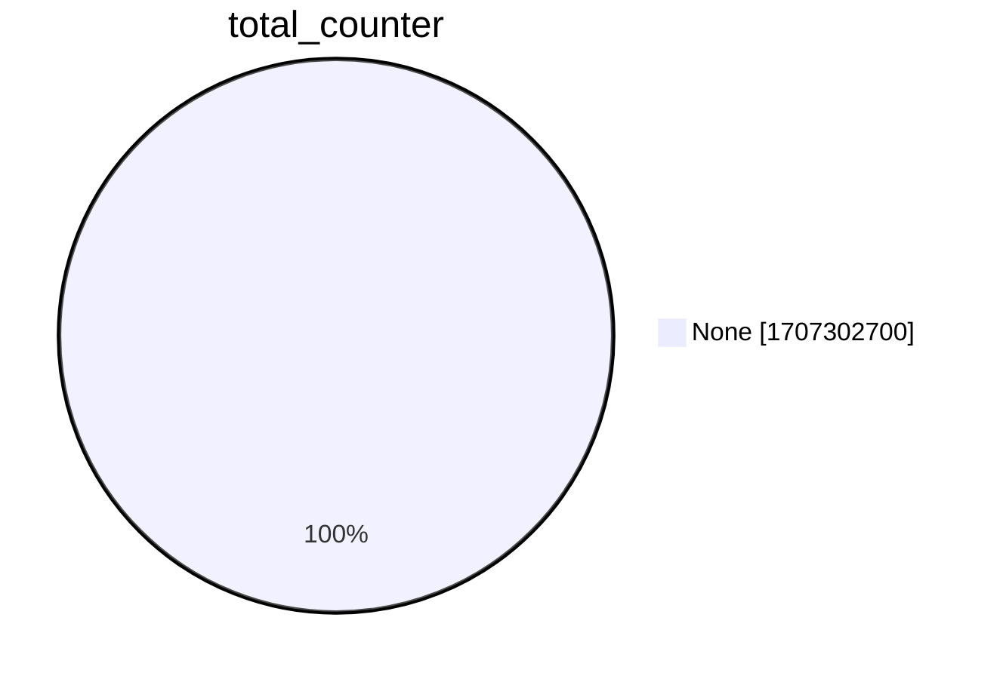
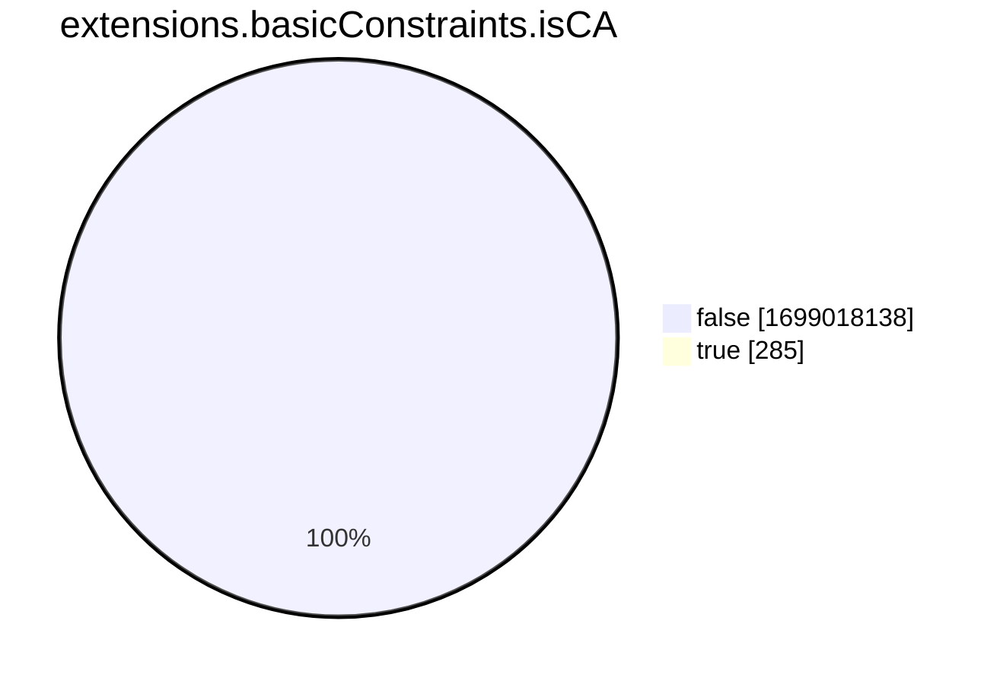
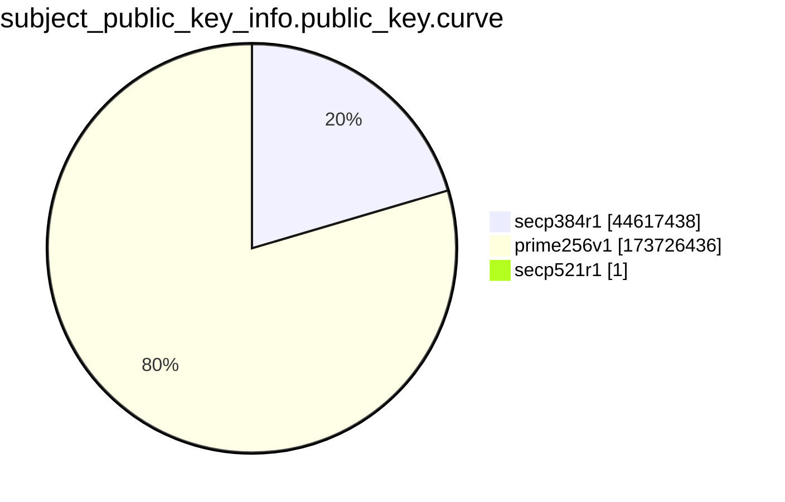
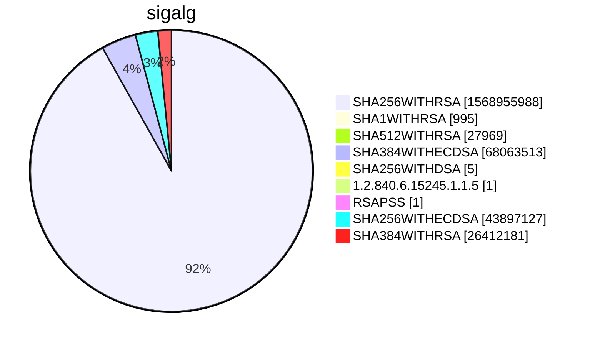

```mermaid
pie showData
title subject.cn.tld
"tw" :1827974
"fi" :5061687
"com" :694795860
"at" :6071294
"nl" :21706536
"org" :43065325
"mil" :5810
"MIL" :17
"ORG" :883
"gov" :228953
"Mil" :1
"edu" :1695395
"cc" :2345984
"fr" :19431829
"ca" :11446640
"il" :1884942
"au" :15715392
"net" :63160578
"de" :55047053
"museum" :4391
"zone" :334583
"berlin" :99824
"ru" :27758522
"se" :7303582
"kr" :1886132
"eu" :10340812
"lt" :917341
"uk" :33977473
"si" :967733
"ua" :4848757
"asia" :687152
"jp" :8727657
"vn" :3259530
"no" :4589659
"ge" :291365
"info" :9213213
"ch" :14286154
"gr" :3367336
"id" :6699532
"be" :7553724
"cl" :4671432
"pro" :2885517
"media" :411114
"ec" :349673
"cz" :6745822
"it" :12319811
"pl" :12812573
"su" :673368
"hu" :5498662
"ag" :88781
"me" :15184779
"br" :28145027
"sk" :1758835
"co" :17383458
"io" :31572470
"my" :1581616
"kz" :1153249
"by" :919679
"digital" :893888
"mobi" :468186
"rs" :1173978
"store" :3504025
"ee" :1158988
"cloud" :3868051
"pt" :2333797
"nrw" :32794
"expert" :129574
"za" :9390540
"biz" :3864693
"tr" :2018399
"team" :432751
"name" :384676
"mx" :4812844
"gmbh" :62868
"la" :272662
"ph" :562436
"es" :6099667
"cn" :6708652
"lv" :692716
"ht" :16168
"nu" :933327
"ro" :4530398
"world" :626649
"coop" :91555
"hr" :976375
"global" :179671
"nz" :3290870
"am" :174665
"ma" :569312
"company" :250664
"us" :4770909
"sg" :1146256
"solutions" :323879
"ie" :1270425
"bz" :139349
"tv" :1362956
"fm" :109550
"ky" :22979
"pa" :42447
"men" :45040
"dk" :4869620
"sa" :341182
"ar" :3967394
"top" :3282233
"group" :434853
"ai" :975377
"gg" :291127
"bid" :51533
"schule" :23226
"xn--p1ai" :1925984
"az" :202081
"cm" :106115
"xyz" :14612973
"games" :184758
"online" :7645384
"tech" :3576829
"app" :4917446
"in" :10482269
"ga" :953176
"cat" :433257
"bot" :8880
"sh" :331854
"melbourne" :19620
"one" :722381
"im" :249339
"hk" :737835
"london" :104109
"cy" :104404
"do" :170259
"aero" :111587
"pk" :818543
"family" :117539
"express" :34092
"bg" :790865
"club" :2856838
"vip" :1556263
"pe" :928108
"ng" :1107372
"to" :24424387
"COM" :12840
"works" :168706
"ski" :19821
"xn--3e0b707e" :2987
"limo" :4527
"CA" :634
"bd" :210742
"network" :415534
"attorney" :5032
"jo" :17590
"life" :1569218
"ae" :553712
"sc" :29185
"shop" :4603164
"mu" :52449
"services" :243550
"nc" :46540
"fj" :11500
"bayern" :49185
"ve" :125412
"casino" :36960
"space" :2274314
"lu" :409083
"ke" :788578
"tirol" :29901
"forex" :1451
"eus" :68634
"ug" :68491
"physio" :5188
"int" :16845
"th" :494624
"rest" :75702
"wiki" :86521
"uy" :377517
"bi" :19779
"is" :536028
"re" :196567
"tz" :202492
"institute" :38494
"bh" :10714
"ninja" :247750
"gt" :129862
"events" :129983
"moe" :108048
"tokyo" :468171
"art" :864490
"tools" :208575
"news" :255834
"li" :277137
"red" :108058
"host" :418822
"shoes" :10822
"farm" :90719
"today" :311750
"cr" :104630
"jm" :7986
"site" :5181764
"gl" :28945
"dz" :95221
"academy" :218154
"studio" :624363
"xn--j1amh" :18817
"ws" :286323
"ly" :182281
"video" :121192
"gallery" :79453
"bet" :103382
"cheap" :9923
"kg" :73211
"blue" :96475
"bzh" :55908
"dev" :4823684
"pet" :39776
"church" :195007
"mt" :60573
"AU" :253
"guru" :228235
"icu" :464024
"social" :127908
"email" :267800
"vc" :186171
"lk" :347648
"black" :26156
"ac" :67628
"NET" :1244
"tf" :26835
"qa" :67967
"work" :1361952
"tg" :16528
"university" :24610
"technology" :102993
"holdings" :15676
"watch" :48862
"eg" :41683
"software" :114705
"report" :37606
"earth" :85154
"mz" :65316
"md" :277984
"live" :1748035
"page" :1726332
"st" :137355
"py" :197668
"fun" :1245583
"website" :1204200
"pf" :11074
"ps" :51835
"xn--qxam" :3526
"bank" :25216
"limited" :18857
"travel" :106112
"rocks" :469243
"casa" :840968
"tk" :2023912
"international" :54774
"immobilien" :9720
"as" :61651
"observer" :5370
"school" :113984
"saarland" :9290
"cab" :12225
"systems" :295713
"training" :67762
"plus" :211619
"swiss" :87810
"link" :1898985
"law" :51689
"al" :158078
"uz" :412199
"gifts" :19506
"blog" :800506
"bike" :54737
"education" :121616
"press" :60008
"ms" :55205
"parts" :14916
"ngo" :18862
"ong" :5767
"supplies" :8709
"np" :359681
"mk" :216632
"amsterdam" :103817
"fyi" :79715
"ba" :219316
"city" :245498
"coach" :73879
"codes" :117132
"sv" :39841
"post" :383
"vg" :11780
"hosting" :62686
"design" :754388
"tn" :181899
"ovh" :604392
"jobs" :38707
"science" :57985
"agency" :542029
"lb" :15860
"fit" :166709
"click" :461877
"film" :26398
"scot" :42196
"wien" :41309
"paris" :54349
"cw" :4127
"om" :18047
"EMAIL" :3
"tips" :56352
"consulting" :112842
"archi" :14811
"kitchen" :27561
"run" :1502932
"help" :95353
"chat" :114733
"pics" :26554
"ltd" :306445
"africa" :192044
"love" :130782
"vacations" :6557
"monster" :213720
"DK" :94
"glass" :10566
"business" :112082
"gh" :41314
"mp" :4608
"boutique" :68190
"tours" :34156
"US" :146
"coffee" :90235
"immo" :47794
"wf" :20681
"healthcare" :19613
"community" :81881
"care" :136856
"ad" :7846
"bio" :92088
"sport" :3938
"mo" :10335
"legal" :54000
"BR" :110
"vision" :46236
"leclerc" :1620
"support" :115820
"repair" :18642
"pw" :688489
"xn--80adxhks" :24538
"srl" :61257
"vet" :39806
"estate" :32847
"lawyer" :12129
"total" :521
"wtf" :159635
"weir" :1241
"ci" :89051
"party" :89646
"partners" :37440
"guide" :54328
"rw" :60199
"ni" :15193
"photo" :119419
"health" :95325
"stream" :77615
"deals" :27550
"place" :41495
"fund" :131559
"direct" :4098499
"energy" :66978
"solar" :36934
"car" :1219
"lighting" :12870
"koeln" :42857
"bj" :19168
"haus" :31543
"pub" :90356
"tickets" :907
"sx" :17549
"buzz" :446379
"market" :108195
"IE" :20
"marketing" :113753
"foundation" :65894
"dhl" :289
"ax" :36559
"fo" :39228
"nyc" :187714
"sydney" :17045
"house" :97493
"center" :254560
"rent" :23616
"bible" :13529
"hockey" :3672
"bo" :107227
"flights" :4891
"gs" :28918
"krd" :5924
"gy" :18101
"directory" :42106
"ck" :2243
"kh" :24828
"miami" :27787
"IN" :141
"so" :180709
"tj" :22875
"industries" :19091
"bnpparibas" :803
"barclays" :373
"EU" :51
"IT" :58
"dental" :26183
"enterprises" :15436
"doctor" :11788
"mn" :131432
"photography" :233379
"football" :13998
"bm" :15092
"cafe" :103993
"woodside" :368
"eco" :37517
"xn--90ais" :38536
"delivery" :42378
"kw" :16553
"crs" :410
"GOV" :705
"tl" :12088
"gal" :25894
"NO" :14
"best" :206393
"je" :29579
"frl" :33802
"EDU" :416
"ao" :63305
"cologne" :7438
"cba" :316
"ir" :3219158
"zw" :132448
"brussels" :27432
"gd" :84531
"xn--80aswg" :7960
"xn--80asehdb" :10422
"sfr" :1
"UK" :277
"ooo" :61982
"condos" :7136
"cx" :100461
"hamburg" :30057
"tc" :24309
"komatsu" :229
"mm" :26319
"sy" :11742
"moscow" :63781
"mc" :17722
"ruhr" :13680
"cool" :151460
"JO" :13
"mg" :42378
"sn" :41287
"Uk" :6
"bs" :4266
"neustar" :321
"abb" :1225
"trade" :78536
"sr" :11677
"NL" :74
"cd" :14811
"trust" :16
"finance" :202326
"na" :59094
"SG" :139
"HK" :66
"hn" :30323
"et" :23696
"cash" :77419
"BE" :36
"taipei" :4631
"tt" :13719
"uno" :109880
"investments" :11697
"insure" :16521
"fitness" :46107
"clinic" :49896
"DE" :231
"mw" :9252
"garden" :16405
"xxx" :35577
"tax" :29583
"pizza" :38260
"MZ" :4
"land" :94589
"golf" :35963
"bn" :5061
"date" :23327
"cf" :895967
"ml" :1488300
"pictet" :352
"af" :25087
"Net" :26
"download" :31900
"mr" :5698
"beer" :45738
"productions" :38955
"aw" :2647
"zm" :23532
"computer" :21511
"wales" :31755
"exchange" :53890
"MX" :29
"barclaycard" :103
"win" :462760
"pm" :54104
"xn--o3cw4h" :940
"mom" :10156
"band" :64836
"Com" :190
"pg" :15759
"jetzt" :34815
"green" :26289
"sm" :9474
"kiwi" :34261
"pr" :6107
"Store" :1
"ES" :107
"restaurant" :22830
"bt" :12538
"soy" :6668
"money" :61453
"dentist" :5336
"construction" :23860
"charity" :6715
"irish" :10890
"bw" :40411
"realty" :170227
"ntt" :571
"llc" :54314
"cfa" :22
"ki" :2697
"cv" :16790
"istanbul" :9907
"careers" :22502
"graphics" :25606
"yoga" :49854
"shopping" :22648
"bb" :3908
"claims" :6608
"accountants" :3879
"wang" :50846
"audio" :18062
"sb" :5418
"xn--90ae" :5765
"sex" :8553
"gent" :29067
"tui" :142
"yt" :21994
"Photography" :2
"tm" :10501
"ink" :167216
"xn--p1acf" :63857
"capital" :84291
"promo" :31109
"management" :36212
"reviews" :46429
"dance" :36285
"gi" :6652
"new" :10737
"tel" :80700
"sap" :28418
"sz" :6501
"wedding" :79405
"GR" :35
"Biz" :34
"SE" :37
"fk" :374
"review" :56594
"politie" :110
"alsace" :7124
"vig" :389
"rentals" :33644
"fish" :23984
"style" :57171
"xn--mgbaam7a8h" :43
"iq" :25770
"xn--mk1bu44c" :1647
"photos" :87657
"gift" :19977
"realtor" :54643
"ne" :3469
"cooking" :6624
"college" :10392
"SA" :58
"boats" :2289
"cg" :6313
"surf" :51176
"onl" :45641
"gdn" :6348
"fan" :17624
"bar" :114987
"MA" :18
"builders" :23088
"dog" :51895
"lc" :22041
"vegas" :21682
"engineering" :45495
"afl" :200
"auto" :3475
"JP" :184
"camera" :9590
"ist" :20983
"AE" :46
"mv" :25410
"pn" :850
"BH" :8
"ls" :11532
"career" :2377
"jnj" :1057
"gold" :111405
"forsale" :11830
"sale" :64259
"anz" :124
"game" :14853
"kn" :1572
"lat" :27455
"fage" :52
"exposed" :6712
"gq" :462475
"dating" :16271
"LB" :15
"loan" :15568
"Org" :34
"cuisinella" :17
"schmidt" :125
"INFO" :12
"quebec" :20144
"pictures" :38200
"sncf" :297
"aig" :10
"sexy" :12845
"lamborghini" :265
"nf" :37111
"sucks" :1340
"CZ" :12
"ipiranga" :27
"lol" :98960
"CBA" :13
"tires" :2934
"taxi" :27590
"vu" :98638
"rip" :48159
"KW" :10
"yokohama" :15049
"kpn" :112
"xn--9dbq2a" :1132
"TW" :99
"sew" :24
"COm" :1
"uol" :56
"DZ" :4
"ZA" :40
"salon" :19297
"tattoo" :22309
"surgery" :6621
"cards" :31189
"faith" :17268
"Asia" :3
"desi" :3826
"inc" :14572
"properties" :33964
"show" :84513
"pink" :30652
"fashion" :43495
"cars" :1343
"edeka" :410
"bf" :8270
"stockholm" :29
"menu" :34644
"tube" :17647
"sbi" :193
"Fr" :20
"memorial" :3053
"vi" :1619
"domains" :156001
"army" :18252
"fox" :778
"xn--otu796d" :35
"axa" :104
"sener" :62
"CH" :14
"webcam" :7459
"wine" :47474
"villas" :4359
"AO" :12
"monash" :119
"hospital" :3333
"xn--czr694b" :72
"radio" :9616
"mortgage" :10231
"lgbt" :12305
"poker" :9724
"coupons" :5364
"luxury" :3334
"BM" :1
"camp" :35129
"xin" :15663
"furniture" :10033
"CN" :17
"rodeo" :7124
"dm" :2975
"VN" :11
"vin" :18301
"pharmacy" :962
"NETWORK" :8
"racing" :10262
"gm" :6752
"CY" :3
"statefarm" :4917
"CAFE" :1
"homes" :37726
"financial" :23175
"gratis" :11991
"microsoft" :9
"moda" :27651
"lanxess" :28
"vlaanderen" :20483
"soccer" :7240
"xn--ses554g" :390
"kaufen" :8301
"apple" :44
"schwarz" :1110
"aq" :612
"BANK" :2
"okinawa" :19729
"build" :49593
"associates" :11222
"tW" :1
"kyoto" :6057
"KH" :25
"corsica" :7532
"BIZ" :53
"nagoya" :18264
"cymru" :18865
"trading" :6316
"toys" :17505
"reise" :1697
"weber" :715
"WS" :6
"deloitte" :88
"loans" :10207
"auspost" :45
"MOBI" :8
"Ca" :2
"rugby" :1462
"credit" :17367
"accountant" :2969
"jprs" :18
"PH" :15
"cisco" :11
"supply" :21830
"sharp" :279
"dvag" :6379
"ASIA" :8
"brother" :66
"man" :446
"comcast" :5
"xfinity" :5
"apartments" :10703
"osaka" :3405
"moi" :279
"sakura" :14
"office" :4
"azure" :46
"windows" :4
"skype" :4
"hotmail" :4
"xbox" :4
"bing" :4
"AM" :2
"cam" :80041
"horse" :15144
"movie" :7479
"godaddy" :137
"рф" :1
"recipes" :10688
"ice" :4
"ventures" :46403
"diamonds" :5155
"catering" :8142
"auction" :12522
"Bank" :4
"property" :6554
"fail" :14831
"Gov" :31
"barcelona" :10620
"abudhabi" :747
"td" :2882
"cricket" :4569
"lidl" :201
"holiday" :11275
"voyage" :7807
"CO" :23
"xn--h2brj9c" :937
"MU" :3
"AT" :4
"statebank" :34
"how" :13442
"dj" :8277
"ET" :13
"FI" :37
"allfinanz" :224
"IO" :17
"mq" :1578
"extraspace" :33
"AERO" :2
"TH" :28
"ID" :20
"MT" :17
"cleaning" :9614
"abbott" :952
"SBI" :9
"FR" :45
"NZ" :26
"MY" :15
"kim" :33136
"sl" :5301
"goog" :166867
"gn" :1871
"canon" :468
"dubai" :29
"ikano" :243
"gop" :3617
"gp" :5490
"engineer" :20966
"Social" :5
"florist" :25635
"jewelry" :15282
"insurance" :1043
"study" :36888
"mh" :41
"gea" :72
"uK" :4
"ye" :3936
"Dev" :1
"seat" :229
"LA" :3
"PT" :6
"madrid" :4238
"accenture" :1
"yachts" :1922
"tienda" :10656
"med" :213
"mit" :8
"realestate" :21674
"gives" :7274
"Edu" :9
"EC" :2
"motorcycles" :1455
"ANZ" :5
"futbol" :5219
"nissan" :37
"goV" :1
"XYZ" :78
"SK" :3
"town" :28974
"va" :70
"bentley" :23
"Live" :6
"xn--90a3ac" :3587
"citic" :37
"plumbing" :5920
"GH" :2
"porn" :8340
"QA" :12
"equipment" :7549
"RU" :30
"EUS" :1
"DO" :4
"SI" :6
"sandvik" :155
"PY" :4
"NG" :2
"RW" :2
"lundbeck" :3
"vote" :13688
"bmw" :11693
"suzuki" :59
"NA" :1
"broker" :3629
"LONDON" :1
"xn--d1acj3b" :2643
"flowers" :4834
"tatamotors" :19
"aws" :3502
"cyou" :255763
"AG" :9
"sarl" :5661
"luxe" :3674
"RO" :75
"bingo" :5617
"globo" :1085
"rio" :5754
"vanguard" :134
"tennis" :4783
"fans" :18614
"markets" :5285
"orange" :1831
"hsbc" :44
"sd" :32679
"contractors" :5935
"saxo" :102
"aquarelle" :34
"clothing" :32480
"nike" :36
"ltda" :1523
"viajes" :3704
"mba" :15213
"Dk" :1
"sony" :38
"foo" :156
"fishing" :4027
"xn--vhquv" :48
"xn--3bst00m" :2
"sky" :593
"kpmg" :30
"hm" :2462
"itau" :68
"bargains" :3890
"TECH" :8
"xn--vuq861b" :74
"teva" :126
"lease" :5774
"toray" :107
"ceo" :94998
"diet" :2307
"cern" :42
"jll" :31
"broadway" :40
"singles" :6777
"democrat" :2400
"cpa" :9948
"xn--c1avg" :1588
"xn--tckwe" :4331
"hiphop" :1065
"versicherung" :1798
"security" :3401
"xn--g2xx48c" :33
"audi" :1214
"TR" :2
"dealer" :97
"xn--kpry57d" :1120
"reisen" :8567
"LT" :3
"nico" :67
"toyota" :95
"SALE" :4
"BN" :7
"basketball" :1896
"xn--czru2d" :51
"abc" :31
"locus" :130
"baby" :13596
"contact" :21433
"xn--node" :514
"gay" :136101
"gu" :173
"bradesco" :237
"discount" :5198
"rehab" :6620
"temasek" :12
"xn--fiqs8s" :6664
"xn--q9jyb4c" :2433
"courses" :10299
"vodka" :3729
"ren" :24867
"juegos" :543
"xn--6qq986b3xl" :4935
"degree" :1875
"christmas" :3384
"ryukyu" :1806
"PL" :8
"navy" :5658
"republican" :2265
"country" :3158
"cruises" :2717
"theater" :4874
"joburg" :8587
"adult" :2719
"maison" :3622
"HOST" :15
"ABUDHABI" :1
"capetown" :13862
"actor" :7308
"bbva" :25
"xn--ngbc5azd" :349
"xn--io0a7i" :626
"ally" :4
"VIP" :7
"organic" :6294
"airforce" :1898
"boston" :5416
"xn--6frz82g" :3018
"hitachi" :40
"gripe" :709
"creditcard" :2761
"gf" :1584
"durban" :5150
"bond" :45043
"AR" :18
"blackfriday" :732
"xn--fiq228c5hs" :101
"ME" :9
"xn--j6w193g" :3644
"voting" :119
"gw" :3547
"香港" :7
"Be" :1
"xn--3ds443g" :143
"xn--qxa6a" :148
"guitars" :1142
"tatar" :2684
"ricoh" :260
"shiksha" :1477
"xn--t60b56a" :248
"scb" :47
"abogado" :919
"TT" :1
"next" :272
"KR" :5
"shell" :952
"KE" :8
"gucci" :68
"nikon" :1
"nr" :327
"storage" :1221
"honda" :53
"otsuka" :33
"CC" :2
"pfizer" :21
"showtime" :4
"cbs" :27
"Za" :4
"schaeffler" :1222
"xn--unup4y" :57
"lotto" :127
"xn--e1a4c" :1616
"voto" :897
"bR" :1
"mango" :61
"bloomberg" :4
"TV" :4
"lr" :2241
"HR" :12
"autos" :11265
"nab" :4
"compare" :716
"theatre" :73
"ss" :1039
"williamhill" :12
"SAP" :1
"select" :470
"philips" :7
"CL" :18
"bcn" :24
"pioneer" :34
"goo" :24
"genting" :16
"hiv" :370
"xn--rhqv96g" :278
"qpon" :500
"WORLD" :1
"arpa" :6
"ismaili" :92
"bridgestone" :157
"mma" :34
"IS" :1
"erni" :55
"jcb" :37
"Global" :2
"CLOUD" :4
"STUDIO" :2
"xn--54b7fta0cc" :482
"SPACE" :4
"beauty" :24635
"xerox" :2
"lego" :32
"skin" :8844
"infiniti" :36
"MO" :2
"xn--55qx5d" :6036
"Zone" :5
"ubs" :1
"APP" :1
"hair" :8831
"quest" :80951
"kfh" :10
"linde" :4
"makeup" :5760
"forum" :986
"Solutions" :1
"BRADESCO" :16
"xn--fiqz9s" :625
"ifm" :575
"PE" :4
"ericsson" :5
"CM" :1
"xn--fjq720a" :52
"CRS" :1
"ONLINE" :6
"XN--P1AI" :27
"sanofi" :28
"aaa" :9
"xn--2scrj9c" :69
"reit" :75
"BO" :1
"xn--5tzm5g" :505
"coM" :2
"bauhaus" :135
"itv" :5
"IQ" :2
"amex" :1
"xn--mgbbh1a71e" :55
"Health" :3
"hisamitsu" :260
"EE" :1
"rwe" :2
"xn--fct429k" :1
"GAL" :1
"BZ" :27
"protection" :52
"xn--mgberp4a5d4ar" :525
"IL" :13
"xn--mgbab2bd" :154
"kred" :878283
"jaguar" :2
"landrover" :2
"cfd" :52761
"UG" :2
"LAW" :2
"nec" :31
"natura" :4
"xn--rovu88b" :2
"xn--eckvdtc9d" :1
"xn--1ck2e1b" :1
"arab" :1
"xn--jlq480n2rg" :1
"tushu" :1
"silk" :1
"read" :1
"imdb" :1
"free" :1
"xn--rvc1e0am3e" :34
"xn--ngbrx" :1
"stada" :109
"airbus" :8
"La" :1
"call" :1
"audible" :1
"Systems" :6
"HU" :5
"PK" :2
"SINGLES" :1
"GLOBAL" :3
"cN" :1
"LIFE" :4
"AI" :6
"CR" :1
"xn--80ao21a" :388
"BG" :1
"ZM" :2
"bbc" :23
"xn--y9a3aq" :2214
"hermes" :118
"samsung" :2
"creditunion" :92
"lilly" :16
"bosch" :1
"km" :569
"smart" :18
"kinder" :10
"xn--mgbca7dzdo" :2
"Dog" :2
"analytics" :3
"ACADEMY" :2
"City" :9
"zuerich" :1885
"sbs" :89120
"redumbrella" :1
"travelers" :1
"travelersinsurance" :1
"trv" :1
"Pro" :2
"farmers" :2
"walter" :2
"Online" :13
"chase" :4
"mini" :31
"JM" :1
"xn--wgbh1c" :32
"DEV" :1
"AF" :2
"clubmed" :132
"PRO" :1
"xn--hxt814e" :108
"SITE" :1
"guardian" :3
"zara" :8
"Video" :1
"aco" :866
"mutual" :3
"northwesternmutual" :2
"amazon" :13
"yandex" :292
"jmp" :3
"NTT" :3
"GG" :4
"PF" :1
"OM" :2
"booking" :1
"amica" :1
"SL" :8
"mattel" :470
"bms" :1
"DIGITAL" :6
"xn--kput3i" :3273
"QUEST" :2
"INT" :1
"google" :27664
"mtr" :1
"deV" :1
"rich" :560
"GL" :1
"xn--d1alf" :193
"WORK" :1
"UA" :1
"FOX" :1
"softbank" :57
"Loan" :4
"KZ" :2
"Bid" :1
"ZONE" :1
"sas" :2
"ford" :2
"able" :4
"Healthcare" :1
"cu" :30275
"xn--mgbah1a3hjkrd" :35
"er" :27
"lplfinancial" :11
"xn--mgbayh7gpa" :82
"nowruz" :43
"xn--i1b6b1a6a2e" :74
"xn--xkc2dl3a5ee0h" :296
"ML" :14
"xn--xhq521b" :108
"toshiba" :45
"yodobashi" :25
"firestone" :17
"stc" :24
"lotte" :25
"gmo" :69
"nhk" :27
"goldpoint" :28
"epson" :24
"dnp" :25
"kddi" :27
"fujitsu" :27
"playstation" :21
"datsun" :25
"kia" :25
"lexus" :19
"panasonic" :26
"mitsubishi" :25
"hyundai" :29
"lixil" :19
"STORE" :1
"xn--mgba3a4f16a" :78
"bugatti" :48
"COOP" :3
"lpl" :11
"feedback" :803
"fresenius" :10
"chintai" :14
"bostik" :275
"maif" :133
"whoswho" :26
"beats" :4
"xn--nqv7f" :108
"ferrero" :61
"youtube" :268
"meet" :49
"xn--wgbl6a" :13
"gle" :54
"xn--1qqw23a" :5505
"Tk" :16
"xn--czrs0t" :98
"watches" :4
"abbvie" :34
"aeg" :2
"ECO" :1
"xn--s9brj9c" :65
"nra" :11
"ggee" :24
"tvs" :23
"xn--pgbs0dh" :13
"jio" :22
"firmdale" :814
"ups" :7
"TM" :1
"xn--gckr3f0f" :33
"helsinki" :30
"xn--45brj9c" :192
"vivo" :24
"xn--nqv7fs00ema" :12
"xn--mix891f" :16
"kosher" :10
"pru" :23
"One" :2
"xn--ygbi2ammx" :16
"xn--gecrj9c" :47
"xn--fpcrj9c3d" :52
"vuelos" :10
"eurovision" :9
"xn--h2breg3eve" :58
"alstom" :9
"TC" :1
"ieee" :7
"hoteles" :10
"xn--ogbpf8fl" :134
"flir" :28
"wme" :10
"passagens" :9
"omega" :16
"ses" :1
"safety" :4
"grainger" :2
"chrome" :11
"TK" :38
"SCOT" :4
"xn--4gbrim" :27
"netflix" :11
"CITY" :1
"Show" :1
"xn--fzc2c9e2c" :22
"redstone" :1
"lacaixa" :10
"MR" :2
"Cloud" :3
"Ltd" :140
"arte" :62
"channel" :233
"dabur" :24
"fairwinds" :38
"INDUSTRIES" :2
"latrobe" :7
"xn--mgbpl2fh" :26
"citi" :8
"java" :26
"csc" :3
"xn--3hcrj9c" :44
"cancerresearch" :10
"reliance" :19
"ril" :18
"hdfc" :22
"frogans" :6
"xn--clchc0ea0b2g2a9gcd" :8
"praxi" :2
"LU" :6
"mlb" :22
"xn--q7ce6a" :12
"Me" :2
"Space" :1
"xn--mgbcpq6gpa1a" :8
"CLUB" :16
"oldnavy" :10
"rocher" :9
"bananarepublic" :10
"athleta" :8
"xyZ" :4
"XN--5TZM5G" :10
"LV" :1
"gap" :9
"xn--45br5cyl" :6
"crown" :1
"SCIENCE" :12
"Market" :1
"GE" :2
"Academy" :10
"xn--mgbai9azgqp6j" :4
"Jo" :1
"pars" :5
"tci" :3
"shia" :4
"In" :1
"TOKYO" :1
"cLub" :4
"swatch" :2
"day" :15674
"LTD" :2
"LI" :6
"goodyear" :2
"dunlop" :2
"Xyz" :2
"xn--mgbgu82a" :6
"MONSTER" :10
"KG" :2
"lancaster" :3
"CF" :16
"xn--l1acc" :5
"sandvikcoromant" :1
"CLICK" :2
"SHOP" :2
"xn--mgbbh1a" :2
"xn--zfr164b" :2
"TOP" :4
"akdn" :2
"imamat" :1
"caravan" :1
"xn--kprw13d" :6
"tK" :8
"BUZZ" :2
"GA" :2
```

```mermaid
pie showData
title issuer
"Google UK Ltd." :32741
"Cisco Systems" :763
"D-Trust GmbH" :1
"SECOM Trust.net" :8
"行政院" :9
"VeriSign, Inc." :15
"Inera AB" :1
"Unizeto Technologies S.A." :4
"ICP-Brasil" :2
"Staat der Nederlanden" :4
"GeoTrust Inc." :21
"Symantec Corporation" :2
"Baltimore" :12
"VeriSign, Inc." :5
"VeriSign, Inc." :2
"DigiCert Inc" :2
"ICP-Brasil" :2
"Vaestorekisterikeskus CA" :865
"MSC Trustgate.com Sdn. Bhd." :1
"FNMT-RCM" :3
"GlobalSign nv-sa" :8
"GlobalSign" :5
"StartCom Ltd." :8
"British Telecommunications plc" :1
"{'c': 'ES', 'cn': 'Autoridad de Certificacion Firmaprofesional CIF A62634068'}" :3
"DigiCert Inc" :5
"Agence Nationale des Titres Sécurisés" :1
"QuoVadis Limited" :4
"thawte, Inc." :1
"Comodo CA Limited" :8
"Secretaria de Economia" :2
"VeriSign, Inc." :2
"GeoTrust Inc." :2
"thawte, Inc." :1
"ComSign Ltd." :1
"QuoVadis Limited" :2
"Staat der Nederlanden" :10
"ANSSI" :3
"VeriSign, Inc." :2
"Apple Inc." :40
"QuoVadis Trustlink B.V." :3
"MINISTERE DES AFFAIRES ETRANGERES" :1
"GlobalSign nv-sa" :3
"QuoVadis Trustlink BVBA" :4
"Symantec Corporation" :4
"Hellenic Academic and Research Institutions Cert. Authority" :7
"D-Trust GmbH" :1
"GlobalSign nv-sa" :2
"National Center for Digital Certification" :1
"QuoVadis Limited" :57732
"IdenTrust" :2
"QuoVadis Limited" :1
"CertiSur S.A." :1
"Swisscom" :6
"JIPDEC" :2
"VeriSign Japan K.K." :2
"Symantec Corporation" :2
"OpenTrust" :1
"DigiCert Inc" :1
"GlobalSign nv-sa" :2
"QuoVadis Limited" :1
"Wells Fargo" :1
"LAWtrust" :1
"QuoVadis Limited" :2
"A-Trust Ges. f. Sicherheitssysteme im elektr. Datenverkehr GmbH" :1
"COMODO CA Limited" :7
"Bechtel Corporation" :1
"Swisscom" :1
"IZENPE S.A." :3
"IZENPE S.A." :5
"AC Camerfirma SA CIF A82743287" :2
"GlobalSign nv-sa" :1
"Symantec Corporation" :2
"Apple Inc." :14
"Symantec Corporation" :1
"VeriSign, Inc." :1
"Atos" :5
"DigiCert Inc" :1
"U.S. Government" :213
"U.S. Government" :255
"e-commerce monitoring GmbH" :1
"SECOM Trust Systems CO.,LTD." :1
"QuoVadis Limited" :4
"Starfield Technologies, Inc." :1
"Amazon" :1
"SCEE - Sistema de Certificação Electrónica do Estado" :1
"Starfield Technologies, Inc." :15592
"COMODO CA Limited" :1
"Amazon" :1
"Swisscom" :68
"IdenTrust" :2
"AC Camerfirma S.A." :2
"QuoVadis Trustlink Schweiz AG" :3
"U.S. Government" :6
"Cisco" :1
"U.S. Government" :1
"MINISTERE INTERIEUR" :1
"GlobalSign nv-sa" :1
"Carillon Information Security Inc." :6
"Symantec Corporation" :6
"GlobalSign nv-sa" :1
"ComSign Ltd." :1
"U.S. Government" :5
"U.S. Government" :4
"Entrust" :11
"KBC Group" :1
"U.S. Government" :2
"GlobalSign" :2
"Verein zur Foerderung eines Deutschen Forschungsnetzes e. V." :88478
"Fraunhofer" :6323
"Max-Planck-Gesellschaft" :4148
"Technische Universitaet Dresden" :1153
"Karlsruhe Institute of Technology" :2199
"Technische Universitaet Ilmenau" :380
"GoGetSSL" :373904
"Sectigo Limited" :83230193
"Gandi" :634461
"Cisco Systems, Inc." :263393
"Sectigo Limited" :1056701
"TERENA" :39237
"Network Solutions L.L.C." :41649
"Network Solutions L.L.C." :139574
"The USERTRUST Network" :85592
"The Trustico Group Ltd" :15345
"TAIWAN-CA" :46259
"EUNETIC GmbH" :9899
"COMODO CA Limited" :2472
"SecureCore" :29211
"GoDaddy.com, Inc." :83185
"GlobalSign nv-sa" :4706
"Deutscher Bundestag" :130
"Sectigo Limited" :64225
"Entrust, Inc." :595600
"TrustOcean Ltd." :196
"SSL.com" :400
"SSL Corporation" :106613
"TBS INTERNET" :6788
"GlobalSign nv-sa" :181075
"EUNETIC GmbH" :206
"DigiCert Inc" :355316
"IdenTrust" :25
"GoGetSSL" :1878
"Sectigo Limited" :5502
"Sectigo Limited" :946
"VISA" :66
"DigiCert Inc" :10903461
"DigiCert Inc" :50023
"GlobalSign nv-sa" :677029
"DigiCert Inc" :56494
"MarketWare - Soluções para Mercados Digitais, Lda." :492
"TrustOcean Ltd." :30
"COMODO CA Limited" :275705
"T-Systems International GmbH" :4308
"DigiCert Inc" :82583
"DigiCert Inc" :132706
"DigiCert Inc" :181860
"DigiCert Inc" :30097
"Government of Korea" :113
"Soluciones Corporativas IP, SL" :51519
"SSLs.com" :12
"DigiCert Inc" :15611
"Entrust, Inc." :41687
"Cybertrust Japan Co., Ltd." :20729
"DigiCert Inc" :175365
"GoGetSSL" :434
"TERENA" :1577
"Gandi" :968
"DigiCert Inc" :31538
"DigiCert Inc" :15333
"Government of Korea" :511
"Sectigo Limited" :66486
"SECOM Trust Systems CO.,LTD." :1412
"Comodo Japan, Inc." :1738
"Aetna Inc" :12812
"K Software" :724
"DigiCert Inc" :2438
"The USERTRUST Network" :3128
"DigiCert Inc" :38571
"Wells Fargo & Company" :3903
"Trust Provider B.V." :21643
"MarketWare - Soluções para Mercados Digitais, Lda." :134
"SECOM Trust Systems CO.,LTD." :24481
"Globe Hosting, Inc." :1092
"GlobalSign nv-sa" :23212
"BitCert" :4
"GlobalSign nv-sa" :14738
"BitCert" :1044
"Chunghwa Telecom Co., Ltd." :2831
"Buypass AS-983163327" :3724
"Entrust, Inc." :373
"Corporation Service Company" :6304
"WoTrus CA Limited" :516
"DigiCert Inc" :8056
"MarketWare - Soluções para Mercados Digitais, Lda." :296
"BitCert" :12
"National Institute of Informatics" :4655
"Site Blindado S.A." :1040
"RU-Center (ЗАО Региональный Сетевой Информационный Центр)" :1648
"COMODO CA Limited" :7296
"Japan Registry Services Co., Ltd." :5638
"SECOM Trust Systems CO.,LTD." :10828
"DOMENY.PL sp. z o.o" :16420
"AffirmTrust" :697
"thawte, Inc." :1
"Dodo Sign Ltd" :5
"WoTrus CA Limited" :563
"Česká pošta, s.p." :947
"Trustwave Holdings, Inc." :10490
"DigiCert Inc" :667
"The Trustico Group Ltd" :16
"Aetna Inc" :52
"TI Trust Technologies S.R.L." :2772
"IdenTrust" :3669
"Cybertrust Japan Co., Ltd." :9744
"Apple Inc." :2231
"TAIWAN-CA" :230
"Trustwave Holdings, Inc." :197
"Microsoft Corporation" :333354
"Microsoft Corporation" :332991
"Microsoft Corporation" :332801
"Microsoft Corporation" :333214
"DigiCert Inc" :2119
"D-Trust GmbH" :15540
"TrustAsia Technologies, Inc." :3
"Hongkong Post" :1939
"Internet2" :599228
"Corporation Service Company" :63468
"Trustwave Holdings, Inc." :805
"DOMENY.PL sp. z o.o" :588
"Deutsche Post AG" :1334
"eMudhra Technologies Limited" :6692
"cPanel, Inc." :126496905
"TrustSign Certificadora Dig. & Soluções Segurança da Inf. Ltda." :1836
"McAfee, Inc." :2140
"cPanel, Inc." :292
"ATT Services Inc" :599
"eMudhra Technologies Limited" :302
"Internet2" :12440
"DHIMYOTIS" :4218
"GlobalSign nv-sa" :1437
"Nijimo K.K." :1240
"D-Trust GmbH" :908
"GlobalSign nv-sa" :495
"DigiCert Inc" :324
"WebSpace-Forum e.K." :38
"SSL.com" :26
"Nijimo K.K." :284
"SecureCore" :1052
"Aristotle University of Thessaloniki" :709
"Hellenic Academic and Research Institutions Cert. Authority" :11
"Hellenic Academic and Research Institutions Cert. Authority" :9
"Hellenic Academic and Research Institutions Cert. Authority" :12
"Genious Communications" :3256
"行政院" :10768
"SECOM Trust Systems CO.,LTD." :6351
"HydrantID (Avalanche Cloud Corporation)" :30710
"Hellenic Academic and Research Institutions Cert. Authority" :7
"QuoVadis Limited" :2512
"Hellenic Academic and Research Institutions Cert. Authority" :5
"Hellenic Academic and Research Institutions Cert. Authority" :8
"Hellenic Academic and Research Institutions Cert. Authority" :278
"Turkiye Bilimsel ve Teknolojik Arastirma Kurumu - TUBITAK" :161
"DNEncrypt, Inc" :372
"WebNIC" :212
"WoTrus CA Limited" :13323
"Global Digital Inc." :2
"Rede Nacional de Ensino e Pesquisa - RNP" :1090
"Global Digital Inc." :18
"Hellenic Academic and Research Institutions Cert. Authority" :9
"Unizeto Technologies S.A." :124281
"Isimtescil Bilisim Anonim Sirketi" :13289
"SwissSign AG" :16576
"Inera AB" :88
"HydrantID (Avalanche Cloud Corporation)" :221
"Fiducia & GAD IT AG" :35
"SwissSign AG" :9034
"QuoVadis Limited" :16744
"QuoVadis Limited" :389
"Institute for Development and Research in Banking Technology" :108
"AffirmTrust" :257
"DigiCert Inc" :26061313
"Buypass AS-983163327" :1094
"Entrust, Inc." :1924
"Hellenic Academic and Research Institutions Cert. Authority" :43
"DigiCert Inc" :33577
"DigiCert Inc" :1296
"DigiCert Inc" :2834
"DigiCert Inc" :191
"Digi-Sign Limited" :292
"DigiCert Inc" :38
"Certinomis" :39
"COMODO CA Limited" :20
"Domain The Net Technologies Ltd" :734
"T-Systems International GmbH" :11631
"Atos" :2201
"Hellenic Academic and Research Institutions Cert. Authority" :6
"Unizeto Technologies S.A." :1315
"Gehirn Inc." :88
"AC Camerfirma S.A." :383
"Hellenic Academic and Research Institutions Cert. Authority" :5
"Hellenic Academic and Research Institutions CA" :229
"WISeKey" :9
"TI Trust Technologies S.R.L." :816
"A-Trust Ges. f. Sicherheitssysteme im elektr. Datenverkehr GmbH" :38
"One Sign Pte. Ltd." :969
"Vaestorekisterikeskus CA" :825
"DHIMYOTIS" :1770
"TrustAsia Technologies, Inc." :283
"Hellenic Academic and Research Institutions Cert. Authority" :6
"DigiCert, Inc." :6
"Actalis S.p.A.-03358520967" :47
"Fresenius Kabi AG" :44
"Institute of Accelerating Systems and Applications" :6
"DigiCert Inc" :62
"TBS INTERNET" :200
"QuoVadis Trustlink BVBA" :172
"Republika Slovenija" :3
"DATEV eG" :2
"Japan Registry Services Co., Ltd." :189
"ACCV" :79
"Fiducia & GAD IT AG" :133
"Digital Trust L.L.C." :344
"DigiCert Inc" :802
"Fuji Xerox" :771
"Hellenic Academic and Research Institutions Cert. Authority" :6
"Corporation Service Company" :148
"TeliaSonera" :5830
"SECOM Trust Systems CO.,LTD." :464
"DigiCert Inc" :571
"行政院" :15
"Disig a.s." :22
"WoTrus CA Limited" :74
"Ziwit" :904
"SwissSign AG" :4399
"DigiCert, Inc." :4
"IdenTrust" :1899635
"DigiCert, Inc." :5
"NetLock Kft." :18
"SSL Corp" :663
"Unizeto Technologies S.A." :2
"InfoCert S.p.A." :11
"DigiCert Inc" :1190
"China Financial Certification Authority" :190
"Hellenic Academic and Research Institutions Cert. Authority" :5
"TRUSTCUBES LIMITED" :114
"TrustAsia Technologies, Inc." :86
"Telia Finland Oyj" :5626
"AC Camerfirma S.A." :524
"Vaestorekisterikeskus CA" :1
"E-Tuğra EBG Bilişim Teknolojileri ve Hizmetleri A.Ş." :4145
"Symantec Corporation" :3
"Digital Trust L.L.C." :88
"GEANT Vereniging" :349020
"Digital Trust L.L.C." :140
"DigiCert, Inc." :4
"Gehirn Inc." :4
"A-Trust Ges. f. Sicherheitssysteme im elektr. Datenverkehr GmbH" :89
"DigiCert Inc" :202
"{'dc': 'ca', 'cn': 'Posta CA 1'}" :2
"Prodrive Technologies B.V." :6
"home.pl S.A." :71959
"IZENPE S.A." :233
"COMODO CA Limited" :7294
"DigiCert Inc" :289805
"WoTrus CA Limited" :2602
"TrustAsia Technologies, Inc." :10
"Network Solutions L.L.C." :1143
"Actalis S.p.A.-03358520967" :14
"Greek Universities Network (GUnet)" :21
"NetLock Kft." :34
"Unizeto Technologies S.A." :2830
"Shanghai Ping An Credit Reference Company Limited" :141
"Firmaprofesional S.A." :115
"QuoVadis Limited" :108
"Hellenic Academic and Research Institutions Cert. Authority" :48
"ATHENS STOCK EXCHANGE" :1
"CentralNic Luxembourg Sàrl" :14400
"GlobalSign nv-sa" :1093
"A-Trust Ges. f. Sicherheitssysteme im elektr. Datenverkehr GmbH" :2
"Hellenic Academic and Research Institutions CA" :29
"GEANT Vereniging" :10348
"Hellenic Academic and Research Institutions CA" :180
"NetLock Kft." :12
"Government of the District of Columbia" :426
"SECOM Trust Systems CO.,LTD." :17
"CERTDATA SERVICOS DE INFORMACAO LTDA" :120
"SECOM Trust Systems CO.,LTD." :797
"CERTDATA SERVICOS DE INFORMACAO LTDA" :132
"DigiCert Inc" :40
"DigiCert Inc" :4
"Hellenic Academic and Research Institutions CA" :66
"Netflix, Inc." :3
"D-Trust GmbH" :22
"Fuji Xerox" :33
"Sectigo Limited" :798
"MULTICERT - Serviços de Certificação Electrónica S.A." :614
"Hellenic Academic and Research Institutions CA" :27
"Krajowa Izba Rozliczeniowa S.A." :594
"Intesa Sanpaolo S.p.A." :7
"Apple Inc." :383
"TrustOcean Limited" :2642
"WebSpace-Forum e.K." :16
"Hellenic Academic and Research Institutions CA" :5
"DigiCert Inc" :2
"DigiCert Inc" :20
"Hellenic Academic and Research Institutions CA" :27
"Hellenic Academic and Research Institutions CA" :354
"Hellenic Academic and Research Institutions CA" :72
"Sectigo Limited" :584
"National Institute of Informatics" :33
"DigiCert Inc" :59
"Agenzia per l'Italia Digitale" :10
"Hellenic Academic and Research Institutions CA" :6
"FNMT-RCM" :1009
"FUJIFILM" :282
"DigiCert Inc" :20
"TrustCor Systems S. de R.L." :8
"DigiCert Inc" :274
"Baidu, Inc." :1208
"T-Systems International GmbH" :367
"DigiCert Inc" :13
"{'c': 'LV', 'ou': 'Sertifikacijas pakalpojumu dala', 'cn': 'E-ME PSI (PCA)'}" :1
"AffirmTrust" :99
"SafeToOpen Ltd" :469
"Baidu, Inc." :124
"Hellenic Academic and Research Institutions CA" :6
"Abitab S.A." :44
"Sectigo Limited" :68
"成都数证科技有限公司" :3
"TrustOcean Limited" :344
"TrustOcean Limited" :8
"Hellenic Academic and Research Institutions CA" :23
"COMODO CA Limited" :22
"Shanghai Ping An Credit Reference Company Limited" :144
"GEANT Vereniging" :10913
"GoGetSSL" :262
"DigiCert Inc" :11
"Sectigo Limited" :1246
"QuoVadis Limited" :3
"QuoVadis Limited" :2
"QuoVadis Limited" :2
"Amazon" :59
"VALID CERTIFICADORA DIGITAL" :11
"The Trustico Group Ltd" :170
"Open Access Technology International Inc" :636
"GEANT Vereniging" :251
"QuoVadis Trustlink B.V." :29
"DigiCert Inc" :3
"Shenzhen Digital Certificate Authority Center Co., Ltd" :38
"LH.pl Sp. z o.o." :7548
"Hongkong Post" :8
"Global Digital Cybersecurity Authority Co., Ltd." :182
"行政院" :6
"Gehirn Inc." :12
"Global Digital Cybersecurity Authority Co., Ltd." :514
"DigiCert, Inc." :4
"WoTrus CA Limited" :106
"Root Networks, LLC" :32
"E-Tuğra EBG Bilişim Teknolojileri ve Hizmetleri A.Ş." :143
"Abitab S.A." :49
"Global Digital Cybersecurity Authority Co., Ltd." :16
"Actalis S.p.A.-03358520967" :1
"WoTrus CA Limited" :57
"AffirmTrust" :3
"AffirmTrust" :3
"AffirmTrust" :3
"Entrust, Inc." :3
"DigiCert Inc" :1
"Ziwit" :25
"AC CAMERFIRMA S.A." :3
"AC Camerfirma SA" :3
"VALID CERTIFICADORA DIGITAL" :26
"UniTrust" :586
"Shenzhen Digital Certificate Authority Center Co., Ltd" :38
"IZENPE S.A." :470
"GlobalSign nv-sa" :19
"Site Blindado S.A." :24
"GlobalSign nv-sa" :178
"Hellenic Academic and Research Institutions CA" :17
"Kingnet Information Technology Co., Ltd." :35
"Intesa Sanpaolo S.p.A." :1
"Nijimo K.K." :241
"Domain The Net Technologies Ltd" :9
"Trustwave Holdings, Inc." :3
"Trustwave Holdings, Inc." :3
"GlobalSign nv-sa" :8994
"GlobalSign nv-sa" :2595
"E-Tuğra EBG Bilişim Teknolojileri ve Hizmetleri A.Ş." :41
"Network Solutions L.L.C." :4
"Beijing Xinchacha Credit Management Co., Ltd." :2344
"Network Solutions L.L.C." :4
"DigiCert Inc" :6824
"Beijing Xinchacha Credit Management Co., Ltd." :50
"SecureCore" :105
"Trust Provider B.V." :495
"Microsec Ltd." :292
"Beijing Xinchacha Credit Management Co., Ltd." :1189
"Hellenic Academic and Research Institutions CA" :17
"DOMENY.PL sp. z o.o" :15
"One Sign Pte. Ltd." :11
"VALID CERTIFICADORA DIGITAL" :5
"iTrusChina Co., Ltd." :136
"KICA" :6
"Hellenic Academic and Research Institutions Cert. Authority" :5
"{'c': 'BE', 'cn': 'Citizen CA', 'serialnumber': '201505'}" :2
"DigiCert Inc" :36
"DigiCert Inc" :148
"DigiCert Inc" :62
"TrustCor Systems S. de R.L." :5532
"iTrusChina Co., Ltd." :2025
"UniTrust" :73
"eMudhra Technologies Limited" :54
"Agence Nationale de Certification Electronique" :7
"South African Post Office Limited" :1
"WISeKey" :656
"SERVICE-PUBLIC GOUV MINISTERE EN CHARGE DE L'AGRICULTURE" :1
"DigiCert Inc" :1287
"DigiCert Inc" :5675
"DigiCert Inc" :828
"TrustOcean Limited" :26
"DigiCert, Inc." :185
"Deutsche Post AG" :2580
"KICA" :110
"Hellenic Academic and Research Institutions CA" :22
"Certinomis" :5
"DigiCert Inc" :1072534
"DigiCert Inc" :2
"Aetna Inc" :2
"Microsec Ltd." :237
"Japan Registry Services Co., Ltd." :1661
"Japan Registry Services Co., Ltd." :78408
"HydrantID (Avalanche Cloud Corporation)" :2162
"DigiCert Inc" :2
"WoTrus CA Limited" :12
"DigiCert Inc" :591337
"QuoVadis Trustlink B.V." :10529
"WoTrus CA Limited" :23
"Actalis S.p.A." :5684
"QuoVadis Trustlink B.V." :3606
"DigiCert Inc" :127
"POSTA" :1
"Apple Inc." :2153
"Fiducia & GAD IT AG" :172
"上海锐成信息科技有限公司" :10
"GlobalSign nv-sa" :381758
"行政院" :107
"Microsec Ltd." :259
"Entrust Datacard Europe S.L." :48
"DigiCert Inc" :65
"GlobalSign nv-sa" :103
"Fiducia & GAD IT AG" :45
"CrowdStrike, Inc." :4
"SOLUTI - SOLUCOES EM NEGOCIOS INTELIGENTES S-A" :1
"VISA" :31
"Actalis S.p.A." :632038
"Entrust, Inc." :2
"Actalis S.p.A." :742
"certSIGN" :7
"Cisco" :2
"e-commerce monitoring GmbH" :16
"NetLock Kft." :1
"GlobalSign nv-sa" :118571
"GlobalSign nv-sa" :19484
"SOLUTI - SOLUCOES EM NEGOCIOS INTELIGENTES S-A" :75
"VALID CERTIFICADORA DIGITAL" :557
"Amazon" :19521270
"DigiCert Inc" :2695543
"Alpiro s.r.o." :10264
"DigiCert Inc" :664289
"TrustAsia Technologies, Inc." :1581336
"DigiCert Inc" :70876
"DigiCert Inc" :41687
"ATT Services Inc" :21684
"Rede Nacional de Ensino e Pesquisa - RNP" :2745
"Dreamcommerce S.A." :22228
"SOLUTI - SOLUCOES EM NEGOCIOS INTELIGENTES S-A" :54
"Google UK Ltd." :94319
"VALID CERTIFICADORA DIGITAL" :143
"Apple Inc." :806
"thawte, Inc." :3
"Internet2" :6952
"DigiCert Inc" :2955
"DigiCert Inc" :196
"GEANT Vereniging" :4978
"KPN B.V." :11258
"swissns GmbH" :247
"ITSO LTD" :130
"Apple Inc." :303
"Apple Inc." :83
"TrustAsia Technologies, Inc." :954
"GlobalSign nv-sa" :93
"China Financial Certification Authority" :19
"CrowdStrike Inc." :132
"DigiCert Inc" :254
"Ziwit" :16
"The Trustico Group Ltd" :168
"VALID CERTIFICADORA DIGITAL" :77
"Apple Inc." :95
"DigiCert Grid" :5
"DigiCert Inc" :22
"上海锐成信息科技有限公司" :20
"Alpiro s.r.o." :4
"U.S. Government" :1
"The Trustico Group Ltd" :2
"Apple Inc." :27
"DigiCert Inc" :5
"Anson Network Limited" :28
"DigiCert Inc" :17
"QuoVadis Trustlink B.V." :8129
"上海锐成信息科技有限公司" :8
"DigiCert Inc" :10890
"Fresenius Kabi AG" :89
"nazwa.pl sp. z o.o." :445057
"SECOM Trust Systems CO.,LTD." :21962
"SECOM Trust Systems CO.,LTD." :126
"HydrantID (Avalanche Cloud Corporation)" :839210
"Microsoft Corporation" :1486394
"Microsoft Corporation" :1479862
"ZeroSSL" :17979203
"TrustAsia Technologies, Inc." :25782
"cPanel, Inc." :799688
"Cloudflare, Inc." :42847788
"Plex, Inc." :956722
"Cloudflare, Inc." :8461201
"DigiCert Inc" :295
"Root Networks, LLC" :6360
"Kingnet Information Technology Co., Ltd." :40
"Alpiro s.r.o." :26
"FNMT-RCM" :798
"CertCloud Pte. Ltd." :50578
"DigiCert Inc" :11
"První certifikační autorita, a.s." :262
"Microsoft Corporation" :2078109
"Microsoft Corporation" :1922426
"Financijska agencija" :310
"TrustAsia Technologies, Inc." :43
"Firmaprofesional S.A." :95
"První certifikační autorita, a.s." :61
"Microsoft Corporation" :1915398
"Sectigo (Europe) SL" :6
"Sectigo (Europe) SL" :26
"DigiCert Inc" :6
"QuoVadis Trustlink B.V." :1304
"D-Trust GmbH" :77
"Microsoft Corporation" :2025823
"TrustAsia Technologies, Inc." :57
"EDICOM" :25
"Abitab S.A." :3
"SOLUTI - SOLUCOES EM NEGOCIOS INTELIGENTES S-A" :25
"CertCloud Pte. Ltd." :40
"EUNETIC GmbH" :14
"DigiCert, Inc." :2
"DigiCert Inc" :7
"CertCloud Pte. Ltd." :2
"CertCloud Pte. Ltd." :2
"DigiCert, Inc." :2
"DigiCert, Inc." :2
"Hellenic Academic and Research Institutions CA" :17
"DigiCert, Inc." :2
"DigiCert, Inc" :2
"DigiCert, Inc" :3
"DigiCert, Inc" :2
"DigiCert, Inc" :3
"DigiCert, Inc." :2
"DigiCert, Inc." :2
"DigiCert, Inc." :2
"DigiCert, Inc." :2
"DigiCert Inc" :5
"sslTrus" :460
"CERTDATA SERVICOS DE INFORMACAO LTDA" :28
"sslTrus (上海锐成信息科技有限公司)" :14
"sslTrus" :198
"GEANT Vereniging" :4
"SSL Corp" :24
"DigiCert, Inc." :3
"DigiCert, Inc." :20
"DigiCert, Inc." :20
"DigiCert, Inc." :4
"DigiCert, Inc." :13
"DigiCert Inc" :17
"TrustAsia Technologies, Inc." :4
"TrustSign Certificadora Dig. & Soluções Segurança da Inf. Ltda." :18
"Pardazeshgaran Shahr Hooshmand Yekta Co." :52
"CentralNic Luxembourg Sàrl" :40
"DNEncrypt, Inc" :2
"DigiCert, Inc." :3
"Alpiro s.r.o." :24
"Vaestorekisterikeskus CA" :4
"PSW GROUP GmbH & Co. KG" :56
"Deutsche Kreditbank AG" :164
"http:--repository.eid.belgium.be-" :3
"TAIWAN-CA" :1
"PSW GROUP GmbH & Co. KG" :4
"{'c': 'BE', 'cn': 'Citizen CA', 'serialnumber': '201503'}" :2
"GlobalSign nv-sa" :10
"VALID CERTIFICADORA DIGITAL" :4
"SSL.com" :4
"Quantum CA Limited" :3021
"Hellenic Academic and Research Institutions Cert. Authority" :35
"Quantum CA Limited" :19
"COMODO CA Limited" :8
"DigiCert Inc" :56
"eMudhra Technologies Limited" :8
"Shanghai Ping An Credit Reference Company Limited" :3
"Quantum CA Limited" :30
"Firmaprofesional S.A." :1243
"DigiCert Inc" :13
"Hellenic Academic and Research Institutions CA" :5
"WidePoint" :12
"National Infrastructures for Research and Technology" :5
"Amazon" :1
"ZeroSSL" :21892766
"TrustAsia Technologies, Inc." :16
"Nijimo K.K." :4
"Quantum CA Limited" :595
"TrustOcean Limited" :21222
"CrowdStrike, Inc." :17
"Alpiro s.r.o." :24
"DigiCert Inc" :3
"UniTrust" :5
"DigiCert, Inc." :2
"Gehirn Inc." :4
"United SSL Deutschland GmbH" :866
"DigiCert Inc" :15
"TrustOcean Ltd." :2
"Quantum CA Limited" :3
"ICP-Brasil" :2
"UniTrust" :2
"{'c': 'BE', 'cn': 'Foreigner CA', 'serialnumber': '201606'}" :2
"Digital Trust L.L.C." :2
"DigiCert Inc" :107602
"Quantum CA Limited" :2
"Telecom Italia Trust Technologies S.R.L." :6
"Open Access Technology International Inc" :699
"FNMT-RCM" :49
"FNMT-RCM" :249
"Entrust Datacard Deutschland GmbH" :8
"DigiCert Inc" :2
"IdenTrust" :32
"Kingnet Information Technology Co., Ltd." :9
"NAVER BUSINESS PLATFORM Corp." :21
"e-commerce monitoring GmbH" :14
"Omit Security, Inc" :6
"e-commerce monitoring GmbH" :8
"e-commerce monitoring GmbH" :10
"Actalis S.p.A." :2
"COMODO CA Limited" :60584
"COMODO CA Limited" :52364
"Staclar, Inc." :87
"SSL Corp" :5
"Turing Crypto GmbH" :7
"Turing Crypto GmbH" :3
"联通智慧安全科技有限公司" :12
"VTB BANK (PJSC)" :5
"VTB BANK (PJSC)" :17
"VTB BANK (PJSC)" :6
"联通智慧安全科技有限公司" :10
"联通智慧安全科技有限公司" :8
"Halcom d.d." :1
"Nijimo K.K." :4
"Yandex LLC" :2856
"ICP-Brasil" :3
"D-Trust GmbH" :2
"D-Trust GmbH" :2
"Buypass AS-983163327" :2410
"CertiPath" :1
"Microsoft Corporation" :35
"Siemens" :2
"Hellenic Academic and Research Institutions CA" :5
"TrustCor Systems S. de R.L." :5
"CRYPTAS it-Security GmbH" :27
"CRYPTAS it-Security GmbH" :3
"SOLUTI - SOLUCOES EM NEGOCIOS INTELIGENTES S-A" :1
"Hellenic Academic and Research Institutions CA" :6
"Hellenic Academic and Research Institutions CA" :6
"Hellenic Academic and Research Institutions CA" :6
"Hellenic Academic and Research Institutions CA" :6
"Alibaba Cloud Computing Co., Ltd." :98
"IdenTrust" :3
"Verokey" :2
"Unizeto Technologies S.A." :4
"ANF Autoridad de Certificacion" :2
"The USERTRUST Network" :4
"Actalis S.p.A.-03358520967" :1
"SwissSign AG" :1
"DigiCert Inc" :1
"GlobalSign nv-sa" :48447
"DigiCert, Inc." :3
"DigiCert, Inc." :5
"GlobalSign nv-sa" :4333
"GlobalSign nv-sa" :70
"DigiCert, Inc." :4
"DigiCert, Inc." :4
"Microsoft Corporation" :3737
"Microsoft Corporation" :3228
"Prodrive Technologies B.V." :5
"eMudhra Technologies Limited" :8
"GlobalSign nv-sa" :4
"GlobalSign nv-sa" :4
"GlobalSign nv-sa" :4
"UniTrust" :63
"UniTrust" :416
"Bloomberg LP" :2
"INTEGRITY Security Services LLC" :4
"SwissSign AG" :2196
"{'c': 'BE', 'cn': 'Citizen CA', 'serialnumber': '201501'}" :2
"SwissSign AG" :1193
"SwissSign AG" :4227
"CerSign Technology Limited" :1192
"Pardazeshgaran Shahr Hooshmand Yekta Co." :2
"CerSign Technology Limited" :6
"CerSign Technology Limited" :6
"Telia Finland Oyj" :34
"Telia Finland Oyj" :35
"Let's Encrypt" :1250974662
"Let's Encrypt" :45433399
"Google Trust Services LLC" :9927992
"Google Trust Services LLC" :8007074
"Deutsche Telekom Security GmbH" :17
"Google Trust Services LLC" :58057
"e-commerce monitoring GmbH" :5
"e-commerce monitoring GmbH" :5
"e-commerce monitoring GmbH" :6
"e-commerce monitoring GmbH" :8
"DigiCert Inc" :11
"Network Solutions L.L.C." :2
"SECOM Trust Systems CO.,LTD." :5
"SECOM Trust Systems CO.,LTD." :5
"Microsoft Corporation" :3260
"Microsoft Corporation" :30
"INTEGRITY Security Services LLC" :2
"sslTrus" :4
"Nyatwork Communication Ltd" :29
"Microsoft Corporation" :3872
"Alpiro s.r.o." :2
"EDICOM CAPITAL SL" :3
"Sectigo (Europe) SL" :4
"CertCloud Pte. Ltd." :2
"E-SAFER CONSULTORIA EM TECNOLOGIA DA INFORMACAO LTDA" :115
"E-SAFER CONSULTORIA EM TECNOLOGIA DA INFORMACAO LTDA" :14
"Gehirn Inc." :6
"Google Trust Services LLC" :2
"NETLOCK Kft." :1
"Network Solutions L.L.C." :140
"ZoTrus Technology Limited" :14
"GoGetSSL" :6
"Digital Trust L.L.C." :4
"ZoTrus Technology Limited" :2
"Entrust EU, S.L." :11
"ZoTrus Technology Limited" :6
"Hao Quang Viet Software Company Limited" :105
"AS Sertifitseerimiskeskus" :4
"AS Sertifitseerimiskeskus" :4
"Staat der Nederlanden" :8
"DHIMYOTIS" :1
"Asseco Data Systems S.A." :1
"Fuji Xerox" :3
"KPN B.V." :4
"Asseco Data Systems S.A." :1
"DHIMYOTIS" :1
"U.S. Government" :7
"T-Systems Enterprise Services GmbH" :2
"Cybertrust Japan Co.,Ltd." :1
"Entrust" :2
"LuxTrust S.A." :1
"Actalis S.p.A.-03358520967" :1
"Hongkong Post" :2
"Hongkong Post" :2
"Hongkong Post" :2
"WoSign CA Limited" :1
"WoSign CA Limited" :1
"WoSign CA Limited" :2
"WoSign eCommerce Services Limited" :1
"WoSign CA Limited" :2
"GUANG DONG CERTIFICATE AUTHORITY CO.,LTD." :2
"GlobalSign" :2
"GlobalSign" :2
"Global Digital Cybersecurity Authority Co., Ltd." :2
"Global Digital Cybersecurity Authority Co., Ltd." :2
"Agencia Notarial de Certificacion S.L.U. - CIF B83395988" :1
"Agencia Notarial de Certificacion S.L.U. - CIF B83395988" :1
"Agencia Notarial de Certificacion S.L.U. - CIF B83395988" :1
"ACCV" :1
"WoSign CA Limited" :1
"WoSign CA Limited" :1
"AffirmTrust" :1
"AffirmTrust" :1
"AffirmTrust" :1
"ANF Autoridad de Certificacion" :1
"AffirmTrust" :1
"ANF Autoridad de Certificacion" :1
"ANF Autoridad de Certificacion" :1
"Agence Nationale des Titres Sécurisés" :2
"Agence Nationale des Titres Sécurisés" :2
"Apple Inc." :12
"Republika Slovenija" :2
"AC CAMERFIRMA S.A." :1
"AC CAMERFIRMA S.A." :1
"AC Camerfirma S.A." :1
"AC CAMERFIRMA S.A." :1
"AC CAMERFIRMA S.A." :1
"AC Camerfirma S.A." :1
"AC Camerfirma S.A." :1
"AC CAMERFIRMA S.A." :1
"AC Camerfirma S.A." :1
"AC CAMERFIRMA S.A." :1
"DigitalSign Certificadora Digital" :1
"CONSORCI ADMINISTRACIO OBERTA DE CATALUNYA" :1
"Agencia Catalana de Certificacio (NIF Q-0801176-I)" :1
"National Digital Certification Agency" :1
"certSIGN" :1
"ZETES SA (VATBE-0408425626)" :2
"GOV" :1
"U.S. Government" :1
"U.S. Government" :6
"{'c': 'BE', 'cn': 'Citizen CA', 'serialnumber': '201506'}" :1
"http:--repository.eid.belgium.be-" :1
"{'c': 'BE', 'cn': 'Citizen CA', 'serialnumber': '201601'}" :1
"{'c': 'BE', 'cn': 'Citizen CA', 'serialnumber': '201405'}" :1
"{'c': 'BE', 'cn': 'Citizen CA', 'serialnumber': '201608'}" :1
"{'c': 'BE', 'cn': 'Citizen CA', 'serialnumber': '201609'}" :1
"{'c': 'BE', 'cn': 'Citizen CA', 'serialnumber': '201603'}" :1
"{'c': 'BE', 'cn': 'Citizen CA', 'serialnumber': '201628'}" :1
"{'c': 'BE', 'cn': 'Citizen CA', 'serialnumber': '201629'}" :1
"{'c': 'BE', 'cn': 'Citizen CA', 'serialnumber': '201602'}" :1
"{'c': 'BE', 'cn': 'Citizen CA', 'serialnumber': '201502'}" :1
"{'c': 'BE', 'cn': 'Citizen CA', 'serialnumber': '201610'}" :1
"{'c': 'BE', 'cn': 'Citizen CA', 'serialnumber': '201512'}" :1
"{'c': 'BE', 'cn': 'Citizen CA', 'serialnumber': '201510'}" :1
"{'c': 'BE', 'cn': 'Citizen CA', 'serialnumber': '201623'}" :1
"{'c': 'BE', 'cn': 'Citizen CA', 'serialnumber': '201630'}" :1
"{'c': 'BE', 'cn': 'Citizen CA', 'serialnumber': '201634'}" :1
"{'c': 'BE', 'cn': 'Citizen CA', 'serialnumber': '201607'}" :1
"{'c': 'BE', 'cn': 'Citizen CA', 'serialnumber': '201408'}" :1
"{'c': 'BE', 'cn': 'Citizen CA', 'serialnumber': '201404'}" :1
"{'c': 'BE', 'cn': 'Foreigner CA', 'serialnumber': '201607'}" :1
"{'c': 'BE', 'cn': 'Citizen CA', 'serialnumber': '201626'}" :1
"{'c': 'BE', 'cn': 'Citizen CA', 'serialnumber': '201403'}" :1
"{'c': 'BE', 'cn': 'Citizen CA', 'serialnumber': '201605'}" :1
"http:--repository.eid.belgium.be-" :1
"http:--repository.eid.belgium.be-" :1
"{'c': 'BE', 'cn': 'Citizen CA', 'serialnumber': '201406'}" :1
"{'c': 'BE', 'cn': 'Citizen CA', 'serialnumber': '201409'}" :1
"{'c': 'BE', 'cn': 'Citizen CA', 'serialnumber': '201633'}" :1
"{'c': 'BE', 'cn': 'Foreigner CA', 'serialnumber': '201608'}" :1
"{'c': 'BE', 'cn': 'Citizen CA', 'serialnumber': '201410'}" :1
"{'c': 'BE', 'cn': 'Citizen CA', 'serialnumber': '201627'}" :1
"{'c': 'BE', 'cn': 'Citizen CA', 'serialnumber': '201511'}" :1
"{'c': 'BE', 'cn': 'Citizen CA', 'serialnumber': '201508'}" :1
"{'c': 'BE', 'cn': 'Citizen CA', 'serialnumber': '201504'}" :1
"http:--repository.eid.belgium.be-" :1
"{'c': 'BE', 'cn': 'Citizen CA', 'serialnumber': '201407'}" :1
"{'c': 'BE', 'cn': 'Citizen CA', 'serialnumber': '201624'}" :1
"{'c': 'BE', 'cn': 'Citizen CA', 'serialnumber': '201604'}" :1
"eMudhra Inc" :1
"http:--repository.eid.belgium.be-" :1
"eMudhra Technologies Limited" :1
"{'c': 'BE', 'cn': 'Citizen CA', 'serialnumber': '201606'}" :1
"http:--repository.eid.belgium.be-" :1
"Entrust, Inc." :2
"Entrust, Inc." :1
"eMudhra Inc" :1
"eMudhra Inc" :1
"eMudhra Technologies Limited" :1
"{'c': 'BE', 'cn': 'Citizen CA', 'serialnumber': '201621'}" :1
"{'c': 'BE', 'cn': 'Citizen CA', 'serialnumber': '201625'}" :1
"http:--repository.eid.belgium.be-" :1
"{'c': 'BE', 'cn': 'Citizen CA', 'serialnumber': '201631'}" :1
"{'c': 'BE', 'cn': 'Belgium Root CA4'}" :1
"http:--repository.eid.belgium.be-" :1
"http:--repository.eid.belgium.be-" :1
"{'c': 'BE', 'cn': 'Citizen CA', 'serialnumber': '201632'}" :1
"eMudhra Technologies Limited" :1
"eMudhra Inc" :1
"Entrust, Inc." :1
"eMudhra Consumer Services Limited" :1
"{'c': 'BE', 'cn': 'Citizen CA', 'serialnumber': '201509'}" :1
"Financijska agencija" :1
"http:--repository.eid.belgium.be-" :1
"eMudhra Inc" :1
"eMudhra Inc" :1
"eMudhra Technologies Limited" :1
"Entrust, Inc." :1
"{'c': 'BE', 'cn': 'Citizen CA', 'serialnumber': '201507'}" :1
"Entrust, Inc." :1
"{'c': 'BE', 'cn': 'Citizen CA', 'serialnumber': '201622'}" :1
"Entrust, Inc." :1
"Entrust, Inc." :1
"eMudhra Technologies Limited" :1
"Trustis Limited" :1
"The Go Daddy Group, Inc." :1
"MULTICERT - Serviços de Certificação Electrónica S.A." :1
"SECOM Trust Systems CO.,LTD." :3
"GlobalSign nv-sa" :2
"GlobalSign nv-sa" :2
"Buypass AS-983163327" :2
"Buypass AS-983163327" :2
"Symantec Corporation" :2
"FNMT-RCM" :1
"GlobalSign nv-sa" :2
"e-commerce monitoring GmbH" :1
"GlobalSign nv-sa" :2
"GlobalSign nv-sa" :2
"První certifikační autorita, a.s." :1
"National Center for Digital Certification" :1
"Hellenic Academic and Research Institutions Cert. Authority" :2
"e-commerce monitoring GmbH" :1
"GlobalSign nv-sa" :2
"Electronic Transactions Development Agency (Public Organization)" :1
"První certifikační autorita, a.s." :1
"GlobalSign nv-sa" :3
"ARGE DATEN - Austrian Society for Data Protection" :1
"První certifikační autorita, a.s." :1
"QuoVadis Limited" :1
"QuoVadis Limited" :3
"Staat der Nederlanden" :4
"MULTICERT - Serviços de Certificação Electrónica S.A." :1
"Česká pošta, s.p." :2
"První certifikační autorita, a.s." :2
"Siemens" :1
"Siemens" :1
"GlobalSign nv-sa" :3
"Keynectis" :1
"Entrust" :12
"CONSEJO GENERAL DE LA ABOGACIA" :1
"Trustwave Holdings, Inc." :1
"QuoVadis Trustlink Deutschland GmbH" :1
"Hellenic Academic and Research Institutions Cert. Authority" :2
"Siemens" :1
"T-Systems Enterprise Services GmbH" :2
"SSL Corporation" :3
"FNMT-RCM" :1
"Hellenic Academic and Research Institutions Cert. Authority" :2
"SSL Corporation" :3
"Starfield Technologies, Inc." :1
"Verein zur Foerderung eines Deutschen Forschungsnetzes e. V." :1
"Česká pošta, s.p. [IČ 47114983]" :1
"WISeKey" :1
"QuoVadis Limited" :1
"WISeKey" :1
"SSL Corporation" :2
"GAD EG" :1
"Siemens" :1
"SecureTrust Corporation" :1
"TÜRKTRUST Bilgi İletişim ve Bilişim Güvenliği Hizmetleri A.Ş." :1
"Sistema Nacional de Certificacion Electronica" :1
"Starfield Technologies, Inc." :1
"SecureTrust Corporation" :1
"U.S. Government" :1
"TeliaSonera" :6
"Telia Finland Oyj" :6
"Microsoft Corporation" :1
"WISeKey" :1
"QuoVadis Limited" :1
"Shenzhen Digital Certificate Authority Center Co., Ltd" :1
"Siemens" :1
"Microsoft Corporation" :1
"TÜRKTRUST Bilgi İletişim ve Bilişim Güvenliği Hizmetleri A.Ş." :1
"XRamp Security Services Inc" :1
"SSL Corporation" :3
"SECOM Trust Systems CO.,LTD." :3
"Unizeto Sp. z o.o." :1
"Siemens" :1
"Trustwave Holdings, Inc." :1
"Asseco Data Systems S.A." :1
"SECOM Trust Systems CO.,LTD." :3
"WISeKey" :1
"Symantec Corporation" :2
"U.S. Government" :1
"DigiCert, Inc." :2
"Unizeto Technologies S.A." :1
"Thai Digital ID Company Limited" :1
"thawte, Inc." :2
"Trustwave Holdings, Inc." :1
"Unizeto Technologies S.A." :1
"WoSign CA Limited" :1
"DigiCert, Inc." :1
"Symantec Corporation" :2
"Asseco Data Systems S.A." :1
"Cisco" :1
"WoSign CA Limited" :1
"U.S. Government" :4
"U.S. Government" :4
"3S2N Sp. z o.o." :1
"AS Sertifitseerimiskeskus" :4
"Unizeto Technologies S.A." :1
"Unizeto Technologies S.A." :1
"Unizeto Technologies S.A." :1
"CrossTrust" :3
"Japan Registry Services Co., Ltd." :3
"CrossTrust" :3
"Japan Registry Services Co., Ltd." :3
"Unizeto Technologies S.A." :1
"FreeBit Co.,Ltd." :3
"Fuji Xerox" :3
"FreeBit Co.,Ltd." :3
"FUJIFILM" :3
"GAZINFORMSERVICE Company limited" :1
"EnVers Group SIA" :1
"KDDI Web Communications Inc." :3
"KDDI Web Communications Inc." :3
"INTEC INC." :6
"SECOM Trust Systems CO.,LTD." :3
"Nijimo, Inc." :3
"National Institute of Informatics" :3
"Nijimo, Inc." :3
"NetArt Spółka Akcyjna S.K.A." :1
"nazwa.pl S.A." :2
"Actalis S.p.A.-03358520967" :1
"Hongkong Post" :6
"WoSign CA Limited" :2
"WoSign CA Limited" :2
"WoSign CA Limited" :2
"WoSign CA Limited" :2
"WoSign CA Limited" :2
"WoSign CA Limited" :2
"WoSign CA Limited" :2
"{'dc': 'va', 'ou': 'PKI', 'cn': 'Veterans Affairs User CA B1'}" :1
"Qihoo 360 Technology Limited" :2
"WoSign CA Limited" :2
"WoSign CA Limited" :2
"WoSign CA Limited" :2
"WoSign CA Limited" :2
"WoSign CA Limited" :2
"WoSign CA Limited" :2
"WoSign CA Limited" :2
"WoSign CA Limited" :2
"WoSign CA Limited" :2
"WoSign CA Limited" :2
"WoSign CA Limited" :2
"WoSign CA Limited" :2
"WoSign CA Limited" :2
"WoSign CA Limited" :2
"WoSign CA Limited" :2
"WoSign CA Limited" :2
"Inera AB" :29
"WoSign CA Limited" :2
"WoSign CA Limited" :2
"Global Digital Cybersecurity Authority Co., Ltd." :2
"WoSign CA Limited" :4
"WoSign CA Limited" :2
"东方新诚信数字认证中心" :2
"WoSign CA Limited" :2
"WoSign CA Limited" :2
"WoSign CA Limited" :2
"WoSign CA Limited" :2
"WoSign CA Limited" :2
"WoSign CA Limited" :2
"上海凭安征信服务有限公司" :2
"WoSign CA Limited" :2
"WoSign CA Limited" :2
"WoSign CA Limited" :2
"WoSign CA Limited" :2
"Global Digital Cybersecurity Authority Co., Ltd." :2
"WoSign CA Limited" :2
"广州市电子签名中心" :2
"Agencia Notarial de Certificacion S.L.U. - CIF B83395988" :1
"ACCV" :1
"WoSign CA Limited" :2
"WoSign CA Limited" :2
"WoSign CA Limited" :2
"Global Digital Cybersecurity Authority Co., Ltd." :2
"WoSign CA Limited" :2
"Agencia Notarial de Certificacion S.L.U. - CIF B83395988" :1
"ICP-Brasil" :1
"Agencia Notarial de Certificacion S.L.U. - CIF B83395988" :1
"WoSign CA Limited" :2
"ANF Autoridad de Certificacion" :1
"ANF Autoridad de Certificacion" :1
"AC CAMERFIRMA S.A." :1
"AC Camerfirma S.A." :1
"AC Camerfirma SA" :1
"AC Camerfirma S.A." :1
"certSIGN" :1
"certSIGN" :1
"Unizeto Technologies S.A." :1
"Unizeto Technologies S.A." :1
"CONSORCI ADMINISTRACIO OBERTA DE CATALUNYA" :1
"Unizeto Technologies S.A." :1
"GOV" :1
"U.S. Government" :5
"Unizeto Technologies S.A." :1
"U.S. Government" :6
"DocuSign France" :1
"Government of Korea" :4
"Firmaprofesional S.A. NIF A-62634068" :1
"Hellenic Academic and Research Institutions Cert. Authority" :4
"Hellenic Academic and Research Institutions Cert. Authority" :4
"Hellenic Academic and Research Institutions Cert. Authority" :4
"Hellenic Academic and Research Institutions Cert. Authority" :4
"Hellenic Academic and Research Institutions Cert. Authority" :5
"Hellenic Academic and Research Institutions Cert. Authority" :4
"Hellenic Academic and Research Institutions Cert. Authority" :4
"Hellenic Academic and Research Institutions Cert. Authority" :4
"Hellenic Academic and Research Institutions Cert. Authority" :4
"Ionian University" :4
"Hellenic Academic and Research Institutions Cert. Authority" :4
"Hellenic Academic and Research Institutions Cert. Authority" :4
"Greek Research and Technology Network" :2
"Hellenic Academic and Research Institutions Cert. Authority" :4
"Hellenic Academic and Research Institutions Cert. Authority" :4
"První certifikační autorita, a.s." :2
"První certifikační autorita, a.s." :2
"IZENPE S.A." :1
"IZENPE S.A." :1
"LAWtrust" :1
"Lawtrust" :1
"Aristotle University of Thessaloniki" :4
"Digidentity B.V." :1
"Digicert Sdn. Bhd." :1
"Consejo General de la Abogacia" :1
"FNMT-RCM" :1
"SeguriData Privada S.A. de C.V." :1
"Unizeto Technologies S.A." :2
"Consejo General de la Abogacia" :1
"AS Sertifitseerimiskeskus" :4
"CONSEJO GENERAL DE LA ABOGACIA" :1
"Swisscom" :66
"Swisscom" :23
"TrustFactory(Pty)Ltd" :4
"Swisscom" :66
"Swisscom" :66
"TÜRKTRUST Bilgi İletişim ve Bilişim Güvenliği Hizmetleri A.Ş." :1
"TÜRKTRUST Bilgi İletişim ve Bilişim Güvenliği Hizmetleri A.Ş." :1
"TÜRKTRUST Bilgi İletişim ve Bilişim Güvenliği Hizmetleri A.Ş." :1
"WoSign eCommerce Services Limited" :4
"WoSign eCommerce Services Limited" :4
"GAD EG" :1
"WoSign eCommerce Services Limited" :4
"WISeKey" :1
"FNMT-RCM" :2
"TÜRKTRUST Bilgi İletişim ve Bilişim Güvenliği Hizmetleri A.Ş." :1
"WoSign eCommerce Services Limited" :4
"CrossTrust" :3
"WoSign eCommerce Services Limited" :4
"Verasys Technologies Pvt Ltd." :1
"Carillon Federal Services Inc." :1
"CrossTrust" :3
"Japan Registry Services Co., Ltd." :3
"Japan Registry Services Co., Ltd." :3
"Fuji Xerox" :3
"SwissSign AG" :1
"Suzhou Qiduo Information Technology Co., Ltd." :1
"Carillon Federal Services Inc." :1
"LuxTrust S.A." :1
"SwissSign AG" :1
"LuxTrust S.A." :1
"TrustAsia Technologies Inc." :1
"QiaoKr Corporation Limited" :1
"TrustAsia Technologies Inc." :1
"TrustAsia Technologies Inc." :1
"Sistema Nacional de Certificacion Electronica" :1
"WoSign CA Limited" :1
"XiPS" :3
"Fuji Xerox" :3
"Digi- ja vaestotietovirasto CA" :40
"Digi- ja vaestotietovirasto CA" :33
"GUANG DONG CERTIFICATE AUTHORITY CO.,LTD." :2
"GUANG DONG CERTIFICATE AUTHORITY CO.,LTD." :2
"Hao Quang Viet Software Company Limited" :10
"Baidu, Inc." :2
"NISZ Nemzeti Infokommunikációs Szolgáltató Zrt." :10
"e-commerce monitoring GmbH" :1
"e-commerce monitoring GmbH" :1
"e-commerce monitoring GmbH" :1
"e-commerce monitoring GmbH" :1
"e-commerce monitoring GmbH" :1
"e-commerce monitoring GmbH" :1
"GlobalSign nv-sa" :5
"Apple Inc." :21
"Apple Inc." :21
"Apple Inc." :21
"Apple Inc." :21
"Apple Inc." :21
"Apple Inc." :21
"Apple Inc." :21
"Apple Inc." :21
"Apple Inc." :21
"Apple Inc." :21
"Apple Inc." :21
"Genious Communications" :4
"Atos" :18
"Atos" :18
"Atos" :18
"Atos" :18
"Atos" :18
"VAS Latvijas valsts radio un televīzijas centrs" :7
"Swedish Social Insurance Agency" :12
"GlobalSign nv-sa" :1
"GlobalSign nv-sa" :1
"{'c': 'LV', 'ou': 'Sertifikacijas pakalpojumu dala', 'cn': 'E-ME SI (CA1)'}" :6
"GlobalSign nv-sa" :24
"TK Elevator GmbH" :24
"GlobalSign nv-sa" :24
"Microsoft Corporation" :28
"TRUST2408" :57
"TRUST2408" :45
"Chunghwa Telecom Co., Ltd." :107
"Chunghwa Telecom Co., Ltd." :107
"Chunghwa Telecom Co., Ltd." :107
"Microsec Ltd." :289
"Chunghwa Telecom Co., Ltd." :49
"Microsec Ltd." :319
"Microsec Ltd." :321
"NISZ Nemzeti Infokommunikációs Szolgáltató Zrt." :223
"NISZ Nemzeti Infokommunikációs Szolgáltató Zrt." :225
"NISZ Nemzeti Infokommunikációs Szolgáltató Zrt." :228
"Chunghwa Telecom Co., Ltd." :106
"NISZ Nemzeti Infokommunikációs Szolgáltató Zrt." :212
"NISZ Nemzeti Infokommunikációs Szolgáltató Zrt." :209
"Microsec Ltd." :116
"Microsec Ltd." :116
"Google Trust Services LLC" :41698
"Symantec Corporation" :1
"Microsec Ltd." :125
"Microsec Ltd." :126
"Microsec Ltd." :124
"Microsec Ltd." :283
"Microsec Ltd." :123
"Microsec Ltd." :123
"e-commerce monitoring GmbH" :2
"GlobalSign nv-sa" :26060
"行政院" :1
"Alibaba Cloud Computing Co., Ltd." :2
"TrustAsia Technologies, Inc." :656
"TrustAsia Technologies, Inc." :106930
"JoySSL Limited" :2126
"Alibaba Cloud Computing Co., Ltd." :2
"ZoTrus Technology Limited" :184
"3CX" :12
"One Sign Pte. Ltd." :4
"GlobalSign nv-sa" :8
"TrustCor Systems S. de R.L." :3
"GlobalSign nv-sa" :103
"Hellenic Academic and Research Institutions CA" :3
"Hellenic Academic and Research Institutions CA" :3
"Apple Inc." :17
"eMudhra Technologies Limited" :1
"Hellenic Academic and Research Institutions CA" :2
"Hellenic Academic and Research Institutions CA" :2
"RajCOMP Info Services Ltd" :1
"DATEV eG" :1
"Avalanche Cloud Corporation" :3
"DigiCert, Inc." :2
"Deutsche Telekom Security GmbH" :6
"Firmaprofesional S.A." :4
"GlobalSign nv-sa" :26455
"GlobalSign nv-sa" :17
"DigiCert, Inc." :1
"DigiCert, Inc." :1
"GlobalSign nv-sa" :2955
"Microsoft Corporation" :264
"Microsoft Corporation" :251
"DigiCert, Inc." :128505
"DigiCert, Inc." :1016
"TrustAsia Technologies, Inc." :11
"Trustwave Holdings, Inc." :1
"Trustwave Holdings, Inc." :1
"Trustwave Holdings, Inc." :1
"UniTrust" :1
"Prodrive Technologies B.V." :1
"GlobalSign nv-sa" :264
"SwissSign AG" :2
"SwissSign AG" :2
"SwissSign AG" :2
"GlobalSign nv-sa" :904228
"GlobalSign nv-sa" :16
"Certainly" :25998
"Certainly" :22188
"DigiCert, Inc." :1
```





```mermaid
pie showData
title validity_range
"1652" :7
"1589" :16
"1698" :6
"1644" :10
"1756" :2
"1666" :2
"1475" :20
"1775" :2
"1665" :10
"1746" :2
"1508" :13
"1503" :21
"1835" :2
"1624" :11
"1767" :3
"1811" :3
"1616" :17
"1517" :23
"1806" :1
"1476" :16
"1741" :4
"1833" :1
"1810" :2
"1604" :9
"1765" :3
"1720" :8
"1479" :22
"1797" :4
"1622" :14
"1794" :1
"1737" :5
"1523" :19
"1562" :21
"1536" :14
"1563" :13
"1525" :14
"1538" :16
"1619" :8
"1670" :8
"1714" :7
"1692" :10
"1667" :7
"1657" :5
"1779" :2
"1507" :21
"1661" :7
"1614" :13
"1717" :6
"1685" :6
"1697" :11
"1609" :9
"1784" :2
"1646" :13
"1576" :14
"1628" :10
"1809" :2
"1630" :9
"1548" :14
"1740" :5
"1834" :2
"1504" :22
"1537" :19
"1649" :14
"1812" :2
"1608" :10
"1764" :2
"1759" :4
"1769" :4
"1715" :8
"1510" :27
"1762" :1
"1824" :1
"1606" :5
"1635" :9
"1798" :4
"1659" :10
"1587" :10
"1560" :13
"1529" :21
"1751" :3
"1542" :17
"1509" :16
"1673" :12
"1716" :4
"1535" :8
"1478" :33
"1513" :16
"1496" :18
"1770" :3
"1776" :3
"1805" :1
"1545" :20
"1771" :3
"1660" :7
"1565" :17
"1591" :15
"1603" :8
"1822" :2
"1672" :7
"1559" :10
"1561" :17
"1484" :23
"1783" :3
"1803" :2
"1719" :6
"1648" :10
"1760" :6
"1669" :7
"1618" :14
"1623" :7
"1761" :3
"1782" :3
"1732" :5
"1577" :11
"1642" :15
"1521" :12
"1564" :15
"1626" :14
"1497" :19
"1787" :4
"1768" :5
"1651" :15
"1687" :10
"1701" :6
"1796" :2
"1707" :9
"1469" :26
"1516" :23
"1556" :18
"1708" :8
"1546" :14
"1569" :19
"1607" :17
"1658" :6
"1680" :7
"1676" :11
"1595" :11
"1593" :8
"1534" :13
"1733" :4
"1693" :8
"1818" :1
"1702" :6
"1613" :11
"1654" :13
"1830" :1
"1514" :16
"1804" :3
"1547" :11
"1620" :9
"1840" :2
"1842" :1
"1634" :13
"1505" :13
"1532" :25
"1681" :2
"1585" :12
"1489" :21
"1527" :17
"1674" :4
"1710" :6
"1817" :3
"1828" :1
"1682" :7
"1519" :15
"1656" :6
"1757" :3
"1588" :16
"1467" :13
"1791" :3
"1820" :3
"1483" :24
"1736" :2
"1734" :9
"1554" :9
"1580" :12
"1493" :30
"1663" :14
"1482" :15
"1801" :3
"1568" :11
"1691" :5
"1610" :17
"1570" :12
"1640" :7
"1498" :19
"1725" :3
"1763" :3
"1453" :25
"1474" :24
"1790" :4
"1611" :12
"1531" :20
"1643" :8
"1675" :5
"1713" :8
"1632" :4
"1752" :1
"1459" :27
"1778" :2
"1699" :4
"1530" :9
"1749" :1
"1753" :2
"1696" :8
"1695" :4
"1480" :22
"1511" :21
"1499" :20
"1572" :9
"1724" :5
"1468" :21
"1786" :1
"1553" :15
"1567" :20
"1758" :3
"1487" :27
"1754" :4
"1600" :13
"1579" :12
"1739" :4
"1541" :16
"1500" :15
"1800" :1
"1686" :8
"1745" :2
"1837" :2
"1679" :5
"1726" :2
"1832" :1
"1742" :5
"1456" :31
"1465" :19
"1703" :5
"1802" :2
"1584" :12
"1602" :11
"1645" :8
"1462" :30
"1785" :2
"1520" :19
"1494" :21
"1460" :23
"1464" :28
"1721" :7
"1555" :17
"1731" :3
"1463" :30
"1455" :23
"1506" :18
"1755" :2
"1700" :4
"1526" :11
"1472" :27
"1544" :20
"1557" :19
"1571" :17
"1738" :5
"1712" :8
"1664" :1
"1601" :10
"1655" :9
"1831" :1
"1747" :4
"1488" :12
"1711" :8
"1774" :4
"1492" :20
"1849" :1
"1788" :3
"1586" :12
"1441" :19
"1678" :6
"1668" :3
"1639" :3
"1777" :2
"1772" :2
"1709" :8
"1683" :7
"1596" :13
"1477" :16
"1573" :20
"1515" :18
"1495" :16
"1485" :30
"1799" :1
"1627" :8
"1647" :7
"1583" :15
"1486" :16
"1490" :15
"1605" :6
"1843" :1
"1677" :3
"1621" :7
"1540" :16
"1793" :1
"1543" :13
"1704" :5
"1723" :5
"1729" :7
"1524" :11
"1638" :13
"1582" :15
"1457" :19
"1549" :19
"1625" :11
"1718" :2
"1518" :16
"1574" :11
"1473" :25
"1671" :2
"1471" :19
"1533" :14
"1766" :2
"1728" :2
"1662" :8
"1429" :29
"1694" :5
"1722" :3
"1436" :19
"1452" :19
"1501" :17
"1566" :17
"1633" :4
"1512" :18
"1424" :28
"1435" :18
"1551" :25
"1650" :7
"1431" :30
"1612" :7
"1690" :3
"1575" :10
"1598" :8
"1807" :1
"1466" :29
"1528" :10
"1637" :9
"1449" :22
"1631" :6
"1558" :17
"1461" :21
"1427" :27
"1727" :6
"1428" :21
"1430" :18
"1418" :27
"1426" :27
"1470" :20
"1592" :5
"1750" :2
"1481" :17
"1448" :16
"1421" :27
"1730" :2
"1433" :27
"1458" :22
"1446" :32
"1491" :13
"1454" :26
"1447" :17
"1432" :23
"1408" :28
"1411" :23
"1581" :9
"1414" :28
"1402" :25
"1420" :31
"1419" :24
"1522" :21
"1578" :16
"1401" :26
"1399" :21
"1439" :26
"1590" :12
"1442" :17
"1743" :2
"1689" :5
"1423" :23
"1394" :28
"1502" :21
"1617" :6
"1416" :23
"1653" :2
"1415" :31
"1413" :23
"1539" :9
"1705" :4
"1684" :2
"1615" :6
"1641" :5
"1445" :21
"1550" :8
"1748" :1
"1397" :29
"1451" :16
"1706" :2
"1388" :25
"1403" :22
"1636" :9
"1450" :15
"1444" :16
"1735" :1
"1629" :4
"1594" :7
"1443" :30
"1417" :22
"1688" :2
"1393" :42
"1390" :24
"1385" :27
"1440" :21
"1425" :24
"1373" :21
"1378" :35
"1552" :17
"1367" :34
"1396" :17
"1398" :24
"1386" :26
"1404" :24
"1370" :25
"1410" :23
"1377" :22
"1372" :27
"1383" :30
"1409" :25
"1374" :23
"1405" :35
"1381" :39
"1434" :18
"1422" :20
"1407" :27
"1599" :6
"1362" :30
"1438" :19
"1389" :29
"1382" :24
"1437" :17
"1366" :26
"1361" :37
"1363" :25
"1597" :6
"3653" :243
"3652" :572
"1349" :33
"1368" :20
"1371" :22
"1344" :20
"1384" :29
"1375" :31
"3651" :23
"1340" :32
"1356" :20
"1343" :34
"3650" :7
"1412" :24
"2832" :1
"2236" :1
"2974" :1
"1825" :28
"1346" :33
"1347" :25
"1365" :36
"2346" :1
"1337" :34
"1406" :21
"1342" :27
"1379" :16
"1376" :17
"1353" :38
"1358" :31
"1332" :34
"1341" :28
"1352" :23
"2741" :2
"1331" :25
"2811" :3
"1324" :40
"1335" :31
"1395" :16
"1391" :29
"4383" :5
"8399" :1
"1345" :39
"1309" :26
"1318" :27
"1357" :27
"1325" :28
"1315" :31
"1310" :32
"1326" :25
"1327" :26
"4018" :11
"1400" :21
"1354" :26
"1334" :26
"1319" :32
"5479" :8
"1323" :33
"1312" :30
"1351" :33
"2556" :12
"1330" :24
"1322" :34
"1392" :27
"1380" :21
"1303" :21
"1313" :29
"1360" :15
"2821" :2
"1294" :35
"1336" :21
"1290" :27
"1305" :31
"1288" :22
"1285" :37
"1287" :35
"1282" :33
"1300" :30
"1348" :40
"1311" :21
"1369" :20
"1364" :36
"1316" :30
"1329" :30
"1333" :24
"1387" :30
"2191" :7
"1328" :27
"1292" :40
"1295" :33
"1350" :30
"1308" :30
"1306" :31
"1321" :27
"2468" :1
"3679" :2
"1355" :22
"1283" :20
"1284" :28
"1291" :26
"1359" :16
"1301" :25
"1298" :29
"1293" :47
"1339" :35
"3204" :1
"1270" :34
"1314" :24
"1317" :22
"1273" :29
"1289" :32
"1274" :25
"1266" :37
"1271" :39
"1262" :34
"1277" :25
"1261" :28
"2285" :1
"1279" :27
"1256" :25
"1268" :33
"1827" :19
"2082" :1
"1269" :40
"1826" :23
"1297" :32
"1304" :27
"1320" :26
"1255" :21
"1249" :32
"1252" :27
"1276" :22
"1278" :36
"1250" :31
"1307" :24
"1280" :28
"1286" :26
"1302" :26
"1244" :37
"1265" :34
"2920" :5
"1299" :32
"1296" :23
"1241" :30
"1260" :22
"1781" :1
"1259" :27
"1242" :43
"1258" :35
"1253" :21
"1245" :34
"1237" :26
"1264" :31
"1248" :23
"4381" :1
"1240" :20
"1246" :29
"1257" :29
"4980" :1
"1251" :31
"1228" :28
"1239" :28
"1234" :40
"1222" :30
"2193" :1
"1232" :28
"2922" :3
"2183" :2
"1212" :33
"2533" :1
"1263" :23
"3501" :1
"1247" :30
"1243" :23
"4049" :2
"3606" :2
"1227" :32
"1203" :35
"2602" :1
"1231" :22
"1229" :22
"1199" :33
"1272" :17
"1215" :26
"1236" :26
"1206" :33
"1208" :29
"1198" :28
"1207" :37
"1225" :31
"1230" :35
"1195" :26
"1214" :33
"2987" :1
"1211" :34
"1233" :29
"1220" :22
"1221" :23
"1196" :35
"1201" :32
"1235" :34
"1338" :18
"1219" :29
"1275" :22
"1213" :32
"1254" :24
"1209" :41
"1218" :30
"1204" :34
"1202" :29
"1179" :29
"1190" :37
"1184" :24
"2655" :1
"1216" :22
"1185" :33
"1187" :39
"1186" :37
"1224" :29
"1182" :30
"1168" :36
"3641" :1
"1210" :27
"1200" :24
"1281" :35
"1217" :24
"1177" :28
"1191" :32
"1223" :26
"1188" :30
"2577" :1
"1169" :28
"1156" :32
"1174" :28
"1194" :33
"1163" :27
"1189" :20
"1178" :22
"1161" :21
"1226" :29
"1140" :25
"1149" :30
"1181" :28
"1150" :24
"1171" :33
"1267" :22
"1160" :23
"1238" :24
"1146" :30
"1151" :29
"1141" :30
"1180" :28
"1192" :28
"1135" :34
"1205" :26
"1170" :31
"1144" :32
"1175" :25
"1165" :28
"1143" :25
"1152" :26
"1137" :26
"1166" :19
"3680" :1
"1197" :26
"1154" :34
"1128" :23
"1159" :26
"1148" :30
"1158" :26
"1155" :27
"1145" :23
"1133" :18
"1136" :31
"1119" :27
"1130" :23
"4380" :1
"1157" :34
"6574" :1
"1173" :25
"1147" :31
"3209" :1
"1116" :27
"1121" :37
"1124" :26
"1107" :19
"1131" :34
"1104" :25
"1106" :26
"1101" :24
"1115" :20
"1110" :25
"1138" :30
"1193" :22
"1127" :21
"1113" :21
"1176" :27
"1122" :22
"1142" :23
"1100" :24
"1108" :23
"1183" :18
"2313" :1
"1139" :26
"1095" :49
"1123" :23
"1118" :20
"1153" :21
"1132" :21
"1093" :22
"1098" :25
"1092" :21
"1164" :18
"1102" :25
"1094" :29
"1120" :25
"1097" :18
"2895" :2
"1099" :14
"1129" :24
"1162" :18
"1105" :20
"1112" :23
"1076" :20
"1073" :30
"1091" :17
"1083" :29
"1172" :22
"1087" :28
"1067" :26
"1066" :16
"1096" :518
"1082" :22
"1090" :18
"1117" :25
"1080" :26
"1065" :29
"1081" :27
"1079" :23
"1069" :22
"1071" :21
"1126" :23
"1063" :26
"1059" :22
"3112" :1
"1086" :15
"1068" :15
"1084" :21
"1089" :18
"1103" :20
"1070" :25
"1057" :24
"1060" :26
"1075" :23
"1062" :25
"1053" :17
"1061" :24
"4048" :1
"1088" :14
"1074" :19
"3640" :1
"1047" :21
"1048" :25
"1039" :19
"1114" :27
"1038" :17
"1077" :24
"1167" :30
"1033" :21
"1045" :17
"1058" :16
"1051" :18
"1085" :23
"1052" :24
"1072" :19
"1064" :14
"1044" :22
"1134" :30
"1030" :29
"1032" :24
"1025" :20
"1049" :22
"1125" :23
"1031" :20
"1041" :16
"1027" :23
"1036" :14
"1040" :22
"1042" :28
"1013" :17
"1029" :20
"1010" :15
"1022" :26
"1050" :23
"1111" :23
"1028" :26
"1078" :26
"1017" :17
"1037" :15
"998" :25
"1109" :20
"1026" :19
"1014" :21
"1046" :18
"1018" :17
"1055" :27
"1016" :19
"1003" :22
"1043" :23
"994" :17
"1034" :15
"1024" :23
"1004" :23
"1012" :18
"999" :28
"981" :18
"996" :13
"1035" :20
"989" :18
"986" :16
"1011" :18
"4302" :1
"1054" :26
"1006" :24
"983" :18
"969" :28
"1056" :18
"1002" :16
"2252" :1
"1021" :19
"973" :11
"990" :14
"1008" :11
"3272" :1
"1019" :21
"976" :15
"1005" :17
"1009" :26
"965" :21
"979" :14
"984" :15
"963" :19
"995" :22
"977" :18
"991" :18
"968" :17
"956" :19
"980" :20
"966" :15
"960" :18
"955" :15
"961" :21
"978" :15
"1015" :17
"987" :20
"993" :12
"1020" :18
"975" :19
"948" :24
"3825" :1
"974" :17
"985" :17
"953" :15
"952" :13
"1023" :18
"940" :10
"967" :13
"964" :17
"4663" :1
"946" :19
"942" :20
"932" :21
"962" :21
"959" :21
"992" :17
"1007" :17
"944" :10
"943" :18
"1000" :21
"935" :18
"1001" :17
"957" :19
"927" :15
"939" :12
"934" :19
"3443" :1
"988" :13
"958" :21
"949" :16
"947" :17
"926" :20
"912" :12
"931" :19
"928" :17
"919" :18
"904" :18
"930" :13
"917" :16
"908" :16
"970" :18
"901" :15
"911" :12
"906" :15
"929" :16
"4223" :1
"915" :23
"954" :20
"922" :12
"972" :13
"938" :14
"907" :15
"997" :16
"918" :21
"933" :12
"925" :12
"936" :21
"903" :21
"909" :18
"951" :22
"895" :15
"902" :16
"899" :11
"923" :17
"950" :15
"894" :23
"896" :18
"937" :17
"897" :13
"971" :15
"893" :16
"914" :18
"898" :14
"913" :18
"910" :13
"5113" :2
"924" :17
"941" :18
"891" :18
"892" :15
"871" :15
"882" :19
"864" :17
"921" :22
"887" :22
"872" :9
"945" :13
"920" :21
"889" :18
"877" :17
"905" :19
"879" :17
"886" :19
"853" :9
"878" :11
"881" :19
"870" :19
"880" :22
"888" :19
"890" :21
"858" :16
"900" :11
"3118" :1
"2190" :1
"916" :15
"982" :11
"885" :17
"883" :18
"884" :11
"875" :19
"876" :9
"869" :20
"865" :10
"867" :19
"873" :14
"866" :19
"874" :12
"861" :18
"843" :13
"868" :17
"850" :18
"847" :14
"859" :16
"852" :17
"856" :15
"838" :16
"863" :10
"857" :18
"846" :14
"831" :21
"839" :16
"849" :15
"842" :20
"824" :168990
"844" :11
"2311" :1
"835" :17
"837" :15
"836" :18
"845" :20
"826" :15
"821" :21950
"825" :88343
"820" :97434
"819" :7847
"823" :3856
"817" :2270
"828" :27
"818" :8683
"848" :19
"822" :7751
"860" :11
"816" :1447
"815" :1419
"813" :1741
"814" :1851
"811" :1537
"810" :1396
"812" :1753
"809" :1162
"829" :22
"808" :1247
"833" :24
"807" :1575
"804" :1622
"841" :19
"805" :1895
"806" :1703
"801" :1224
"803" :1349
"802" :998
"797" :1776
"851" :13
"798" :2361
"799" :2435
"796" :1329
"800" :1719
"794" :1316
"834" :14
"793" :2629
"790" :57722
"795" :2146
"789" :10864
"791" :6317
"840" :18
"792" :1967
"788" :2676
"787" :2518
"854" :9
"784" :2755
"786" :2601
"783" :3021
"785" :3217
"781" :2336
"782" :2203
"780" :2013
"779" :2608
"830" :9
"827" :14
"778" :2627
"775" :2879
"832" :19
"776" :2643
"777" :3355
"774" :2296
"773" :2484
"771" :3216
"772" :2817
"770" :3197
"769" :3549
"767" :3143
"768" :2984
"766" :2828
"855" :7
"765" :4081
"764" :3706
"761" :20921
"762" :8891
"760" :60009
"763" :4367
"759" :14136
"758" :7084
"757" :6875
"756" :6200
"755" :6736
"754" :5974
"753" :6085
"752" :5432
"751" :6324
"750" :6301
"749" :7930
"748" :6775
"747" :7035
"746" :7408
"745" :6640
"744" :8234
"743" :8946
"742" :8024
"741" :11119
"740" :8745
"739" :11578
"738" :14777
"737" :12490
"736" :8598
"735" :168219
"734" :26624
"733" :10347
"732" :11355
"731" :944666
"730" :5116698
"729" :28611
"728" :7721
"727" :4985
"726" :3803
"725" :2981
"3662" :1
"724" :2804
"723" :2565
"722" :2010
"721" :1672
"720" :1615
"719" :1347
"718" :1527
"717" :1668
"716" :1359
"713" :1121
"715" :1312
"711" :933
"712" :1044
"714" :1167
"709" :1002
"710" :815
"708" :829
"705" :638
"707" :722
"706" :717
"704" :566
"703" :603
"701" :661
"702" :660
"699" :595
"698" :488
"697" :477
"700" :794
"696" :469
"695" :573
"694" :520
"693" :468
"691" :370
"689" :398
"692" :453
"688" :441
"690" :431
"687" :411
"685" :444
"684" :363
"686" :542
"681" :455
"862" :11
"679" :313
"682" :360
"680" :438
"683" :272
"678" :357
"677" :309
"675" :350
"674" :330
"676" :264
"1823" :1
"671" :349
"673" :379
"672" :395
"668" :331
"670" :287
"666" :326
"665" :280
"667" :309
"663" :319
"664" :274
"669" :715
"661" :364
"662" :342
"659" :335
"660" :311
"658" :329
"656" :417
"3645" :1
"657" :348
"653" :244
"654" :275
"652" :320
"655" :290
"648" :245
"647" :198
"650" :423
"651" :340
"649" :629
"646" :287
"642" :622
"645" :245
"644" :252
"641" :226
"640" :264
"643" :277
"639" :234
"637" :255
"638" :287
"634" :214
"636" :262
"635" :215
"633" :223
"631" :207
"632" :244
"630" :240
"628" :284
"629" :176
"626" :236
"625" :304
"627" :260
"624" :255
"622" :185
"620" :302
"621" :209
"619" :278
"623" :227
"617" :230
"618" :225
"614" :178
"615" :181
"616" :227
"613" :161
"612" :236
"608" :279
"610" :187
"611" :212
"606" :185
"609" :217
"607" :174
"604" :201
"603" :213
"605" :207
"600" :155
"602" :190
"601" :205
"598" :150
"597" :175
"596" :210
"599" :136
"593" :148
"594" :203
"595" :355
"592" :112
"590" :263
"591" :191
"589" :262
"588" :179
"587" :131
"585" :169
"586" :138
"584" :130
"581" :156
"582" :164
"580" :139
"583" :163
"579" :134
"578" :149
"577" :149
"575" :117
"573" :119
"576" :196
"572" :297
"574" :123
"571" :98
"569" :116
"566" :119
"565" :125
"568" :88
"570" :70
"567" :116
"564" :189
"562" :61
"563" :127
"561" :96
"559" :251
"558" :126
"560" :152
"556" :82
"555" :81
"554" :117
"552" :111
"553" :128
"551" :70
"2235" :1
"549" :303
"548" :106
"557" :95
"545" :190
"550" :92
"544" :93
"547" :117
"4374" :1
"543" :56
"546" :117
"542" :115
"541" :117
"539" :82
"540" :64
"538" :69
"536" :140
"533" :66
"534" :55
"535" :111
"537" :68
"531" :97
"532" :67
"528" :47
"530" :47
"529" :49
"527" :45
"524" :46
"526" :48
"525" :47
"522" :32
"521" :61
"523" :45
"518" :48
"517" :39
"515" :34
"520" :110
"519" :49
"516" :31
"514" :34
"513" :32
"511" :37
"512" :66
"510" :51
"509" :35
"508" :33
"503" :28
"506" :31
"507" :26
"502" :23
"505" :38
"501" :30
"504" :26
"500" :84
"499" :30
"496" :46
"498" :34
"497" :40
"494" :24
"495" :20
"492" :19
"493" :22
"491" :27
"485" :17
"483" :22
"481" :18
"486" :17
"488" :14
"489" :22
"487" :17
"478" :27
"480" :22
"479" :18
"476" :22
"474" :18
"482" :16
"469" :17
"465" :25
"484" :18
"477" :18
"462" :22
"475" :19
"473" :13
"456" :20
"467" :28
"452" :18
"453" :19
"470" :28
"459" :23
"461" :27
"454" :16
"455" :18
"440" :15
"451" :17
"472" :20
"443" :21
"446" :13
"437" :21
"450" :27
"427" :17
"471" :21
"425" :21
"466" :14
"436" :19
"442" :22
"468" :19
"429" :20
"433" :16
"464" :13
"444" :25
"434" :14
"415" :74
"420" :19
"410" :24
"457" :19
"458" :21
"426" :16
"449" :22
"424" :17
"406" :12
"413" :16
"438" :20
"447" :16
"411" :11
"405" :25
"463" :19
"445" :16
"397" :938472
"396" :2435762
"395" :688947
"365" :50390556
"394" :19149481
"432" :23
"1" :290515
"393" :700544
"402" :27
"421" :17
"401" :20
"392" :99133
"408" :18
"407" :20
"490" :23
"391" :51323
"390" :53631
"389" :54255
"403" :19
"388" :40423
"417" :22
"414" :7
"387" :40860
"386" :71584
"385" :78372
"384" :65894
"383" :45404
"382" :41404
"381" :49922
"412" :12
"380" :96240
"448" :16
"379" :113979
"378" :1902708
"400" :24
"416" :19
"377" :147214
"441" :12
"376" :103786
"439" :17
"375" :75535
"409" :19
"374" :94289
"373" :277174
"372" :278426
"364" :54588184
"460" :18
"371" :132444
"370" :663716
"369" :542382
"368" :187289
"367" :261835
"366" :990962
"363" :120469
"362" :46473
"361" :26899
"360" :1780284
"404" :15
"359" :39341
"358" :18506
"357" :15022
"356" :12577
"430" :15
"423" :18
"355" :11247
"399" :18
"354" :10390
"353" :9739
"352" :10010
"351" :9536
"418" :14
"350" :10138
"349" :9089
"348" :11043
"347" :8243
"346" :7469
"345" :7767
"344" :7751
"343" :7198
"342" :6668
"419" :12
"341" :6507
"340" :6645
"339" :6520
"422" :9
"398" :16
"338" :7104
"337" :7536
"336" :9169
"335" :18902
"334" :26188
"333" :17166
"332" :5469
"331" :5242
"435" :19
"330" :4872
"431" :13
"329" :4448
"328" :3706
"327" :3499
"326" :3533
"325" :3360
"324" :3445
"323" :3926
"322" :3567
"2186" :1
"428" :18
"321" :3234
"320" :3277
"319" :2880
"318" :3153
"317" :3252
"316" :3420
"315" :3025
"314" :2739
"313" :2701
"312" :2879
"311" :2862
"310" :2962
"309" :3075
"308" :2790
"307" :2619
"306" :2572
"305" :2568
"304" :2370
"303" :2708
"302" :2889
"301" :2785
"299" :2253
"300" :2762
"298" :2234
"297" :2329
"296" :2385
"295" :2505
"294" :2511
"293" :2237
"292" :2204
"291" :2258
"290" :2156
"289" :2318
"288" :2455
"287" :2536
"286" :2155
"285" :2085
"284" :2154
"283" :2074
"282" :2464
"281" :2314
"280" :2176
"279" :2137
"278" :2079
"277" :2058
"276" :2091
"275" :2968
"273" :2480
"274" :2488
"272" :2115
"271" :2099
"269" :2023
"270" :3352
"268" :2428
"267" :2126
"266" :2143
"265" :2001
"264" :1934
"263" :1990
"262" :1936
"261" :2435
"260" :3288
"259" :2917
"258" :2395
"257" :2571
"256" :1759
"255" :1937
"1821" :2
"254" :2581
"253" :1971
"252" :2093
"251" :2165
"250" :2020
"249" :1721
"248" :1851
"247" :2382
"246" :2347
"245" :2550
"244" :1855
"243" :1786
"242" :1791
"241" :1987
"240" :2114
"239" :2048
"238" :1917
"236" :1693
"237" :1722
"235" :1614
"234" :1682
"233" :1844
"232" :1824
"231" :1776
"230" :1665
"229" :1630
"228" :1727
"227" :1545
"224" :1759
"226" :1748
"225" :1889
"223" :1672
"221" :1512
"222" :1633
"220" :1680
"219" :1713
"218" :1732
"217" :5304
"216" :2265
"214" :2598
"215" :1766
"213" :1613
"212" :1755
"211" :1678
"210" :1956
"209" :1620
"208" :1605
"207" :1779
"206" :1510
"204" :1624
"205" :1628
"203" :1743
"202" :1780
"201" :1628
"199" :1592
"200" :1510
"198" :1764
"197" :1700
"196" :1585
"195" :1560
"194" :1609
"193" :1463
"192" :1489
"191" :1795
"190" :28209
"189" :4860
"188" :1606
"187" :1956
"186" :1730
"185" :1619
"184" :263420
"183" :309483
"182" :332143
"180" :3923524
"181" :441004
"179" :55973
"178" :2835
"177" :3096
"176" :8175
"175" :2479
"172" :1519
"174" :2055
"173" :1481
"171" :1714
"170" :1662
"169" :1718
"168" :3110
"167" :1544
"166" :1437
"164" :1475
"165" :1400
"163" :1514
"162" :1564
"3271" :1
"161" :1684
"160" :1425
"159" :1477
"158" :1396
"157" :1318
"156" :1644
"155" :1669
"154" :1443
"153" :2622
"152" :1762
"151" :1669
"149" :1581
"150" :1417
"147" :1436
"148" :1443
"146" :1543
"145" :1373
"144" :1409
"143" :1311
"141" :1594
"142" :1441
"140" :1574
"139" :1351
"138" :1465
"137" :1350
"136" :1299
"135" :1477
"134" :1561
"133" :1512
"132" :1361
"131" :1293
"129" :1229
"130" :1302
"128" :1452
"127" :1344
"126" :1479
"125" :1359
"124" :1409
"122" :1887
"123" :1476
"121" :1634
"120" :3759
"119" :2159
"118" :1325
"116" :1214
"117" :1384
"115" :1329
"114" :1531
"113" :1408
"112" :1435
"111" :1269
"110" :1518
"109" :1167
"108" :1367
"107" :1319
"105" :1449
"106" :1423
"104" :1273
"103" :46843
"2184" :1
"102" :1178
"101" :1213
"99" :1645
"100" :1536
"97" :1404
"98" :1425
"96" :1670
"95" :11514
"94" :7842
"93" :9587
"92" :35542
"91" :179012
"90" :235333001
"89" :1315330886
"88" :11214
"87" :9001
"86" :9368
"85" :9398
"84" :4594
"83" :34325
"82" :1628
"80" :1598
"81" :1575
"78" :1573
"79" :1535
"77" :1518
"76" :1501
"75" :1326
"74" :1371
"73" :1223
"72" :1386
"71" :1402
"67" :1324
"69" :4256
"70" :1323
"68" :1218
"66" :1260
"65" :1386
"64" :1632
"63" :1451
"62" :1743
"61" :2404
"60" :2233
"59" :2048
"57" :1397
"58" :1327
"55" :1242
"56" :1358
"54" :1199
"53" :1257
"52" :1160
"51" :1267
"50" :1244
"49" :1144
"48" :1272
"47" :1153
"46" :2047
"45" :5809
"44" :43151
"42" :1939
"41" :2434
"43" :2040
"39" :3986
"40" :1907
"38" :1677
"37" :43961
"36" :213100
"35" :191468
"34" :262504
"33" :309106
"32" :211304
"31" :895621
"30" :1030687
"29" :81674
"28" :121493
"2192" :2
"27" :1467
"26" :1123
"25" :2295
"24" :2154
"23" :2024
"2550" :2
"22" :2792
"21" :6351
"20" :3220
"19" :10366
"18" :3566
"17" :2411
"16" :2170
"15" :91042
"14" :41549
"13" :3248
"12" :15931
"11" :80510
"10" :9772
"9" :1507
"8" :1171
"7" :14486
"6" :1673
"5" :1010
"4" :1240
"3" :1449
"2" :3402
"0" :1304850
```

