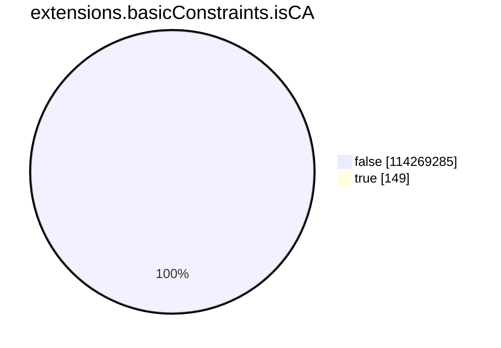
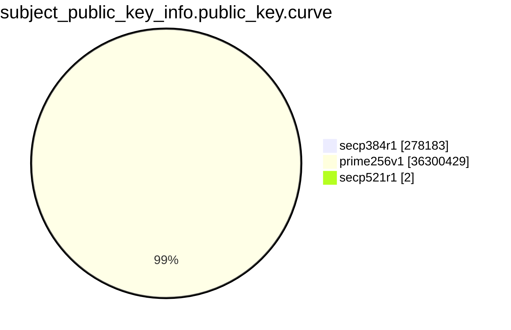
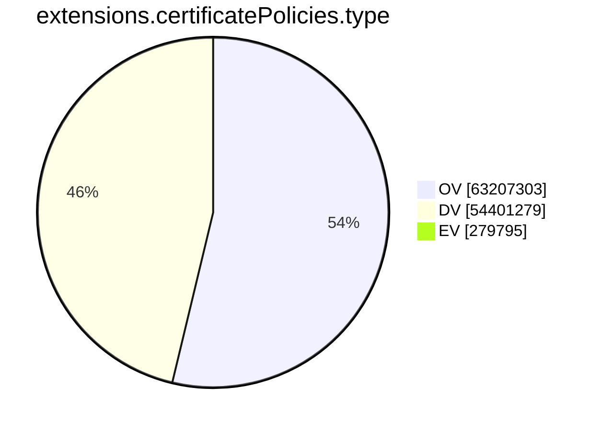
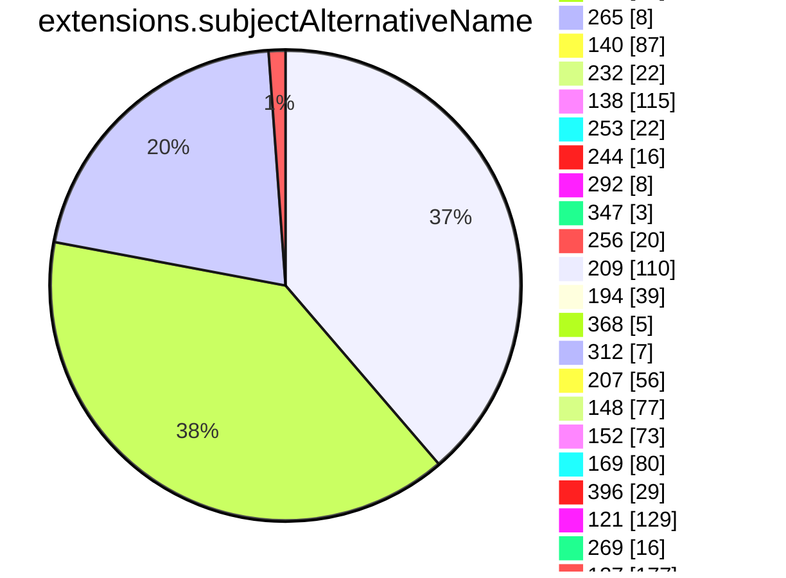
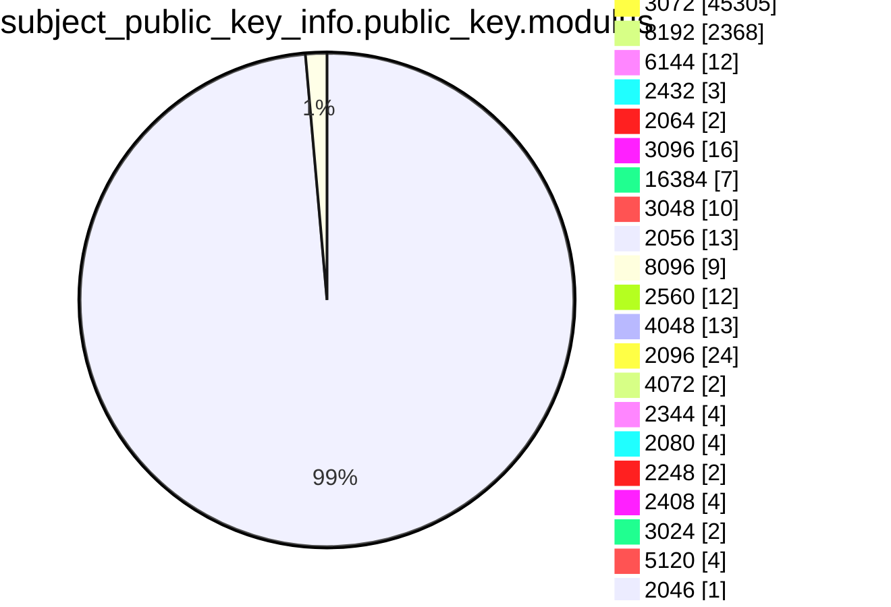

```mermaid
pie showData
title subject.cn.tld
"tw" :47239
"si" :14118
"com" :65599432
"in" :170427
"IN" :97
"at" :103893
"ru" :294359
"jp" :318912
"site" :252954
"kr" :123623
"shop" :443517
"media" :9529
"br" :277406
"org" :2603082
"au" :379711
"cn" :873638
"net" :3758416
"io" :875857
"it" :170199
"online" :308878
"ca" :327588
"co" :285354
"mx" :56600
"bz" :2884
"uk" :716244
"xn--p1ai" :13479
"ws" :3791
"my" :15388
"eu" :287756
"care" :5162
"th" :7906
"fr" :382680
"biz" :204698
"de" :3866216
"cl" :29505
"info" :222823
"cloud" :255539
"sg" :26134
"tech" :69879
"wedding" :4827
"store" :141439
"ie" :45018
"pro" :44527
"dk" :57682
"id" :33907
"es" :168860
"ro" :29529
"nl" :540229
"tr" :39002
"rocks" :15577
"estate" :794
"education" :16094
"be" :125832
"su" :2919
"cz" :71497
"se" :95320
"nz" :65361
"vn" :39302
"pl" :294204
"global" :8945
"hk" :22619
"no" :56940
"pt" :41057
"click" :70536
"aero" :5041
"lu" :10986
"world" :15578
"club" :131518
"gal" :500
"wine" :1430
"xyz" :593743
"expert" :2745
"us" :856462
"bzh" :1766
"edu" :458244
"design" :9762
"ch" :146407
"sv" :881
"lundbeck" :3
"business" :2881
"gl" :606
"cyou" :13464
"int" :3239
"xn--80asehdb" :112
"ac" :2330
"agency" :11784
"py" :1698
"bmw" :629
"cc" :110247
"app" :113155
"mobi" :10390
"direct" :557872
"cards" :1084
"xn--80aswg" :37
"cr" :1674
"team" :9414
"art" :25374
"ai" :48517
"pw" :47855
"live" :153174
"is" :5418
"cy" :2505
"moscow" :620
"COM" :8258
"jobs" :1136
"za" :49864
"school" :2917
"ad" :611
"space" :105713
"games" :6477
"ci" :1316
"pe" :13985
"tokyo" :3162
"gov" :69290
"best" :5999
"center" :4534
"website" :34943
"Nu" :2
"link" :60268
"fi" :50675
"rs" :5817
"ph" :11832
"uy" :3837
"ec" :5654
"am" :4834
"ltd" :23280
"rip" :821
"work" :40593
"uno" :3285
"mn" :2096
"kh" :781
"asia" :68174
"me" :171358
"plus" :11880
"la" :4806
"guide" :1756
"travel" :3368
"BZ" :5
"dev" :3774791
"xn--p1acf" :457
"coffee" :1566
"bn" :227
"om" :1341
"quebec" :331
"life" :328069
"cba" :236
"gr" :38263
"fun" :52499
"jo" :840
"ar" :52882
"lk" :5352
"il" :21471
"vip" :76216
"bh" :889
"sk" :17286
"mo" :570
"ke" :7407
"land" :2723
"ua" :25394
"lv" :7093
"kpn" :53
"ae" :15488
"icu" :21430
"academy" :6755
"gh" :1163
"koeln" :902
"video" :3286
"saxo" :27
"fj" :302
"Com" :167
"eg" :1083
"bank" :2040
"nu" :7639
"ee" :9476
"bg" :8195
"scot" :1381
"pk" :12701
"church" :2236
"uz" :1988
"gmo" :6
"green" :27142
"qa" :2203
"hr" :10191
"kz" :6189
"clinic" :1882
"ntt" :208
"tv" :68582
"hu" :37301
"cymru" :463
"red" :2956
"ma" :8602
"st" :1639
"bo" :1175
"ag" :2606
"ng" :25367
"bd" :3536
"tz" :2466
"network" :13313
"DE" :76
"mv" :415
"mc" :452
"delivery" :1327
"lt" :17504
"mu" :1343
"london" :1906
"hn" :968
"farm" :2641
"tt" :351
"canon" :133
"eco" :1152
"fm" :2603
"BR" :37
"digital" :25337
"theater" :83
"berlin" :3181
"ao" :648
"services" :13233
"ps" :617
"do" :3954
"one" :26170
"ooo" :1244
"to" :5056
"gg" :9604
"blog" :10139
"consulting" :2594
"finance" :18496
"ist" :426
"zone" :12699
"okinawa" :131
"jewelry" :366
"AU" :185
"xn--3e0b707e" :92
"top" :320343
"bet" :11723
"today" :10987
"inc" :1606
"JP" :76
"studio" :12969
"bw" :667
"study" :315
"paris" :1699
"gallery" :1635
"taxi" :669
"page" :2934
"help" :1810
"ryukyu" :26
"yokohama" :90
"ge" :2408
"house" :1812
"by" :4128
"villas" :129
"ba" :1495
"eus" :1534
"coop" :2632
"group" :9413
"clothing" :664
"place" :742
"trade" :3087
"vc" :3103
"va" :36
"cat" :13808
"supply" :648
"li" :12916
"HK" :29
"market" :3467
"sa" :8590
"hsbc" :25
"as" :722
"CA" :405
"mz" :728
"so" :3118
"az" :2391
"bm" :538
"xn--80adxhks" :239
"capital" :2596
"al" :2805
"cw" :98
"apple" :48
"name" :6747
"gmbh" :1564
"support" :3920
"MY" :17
"systems" :16201
"energy" :2735
"GOV" :474
"gt" :2104
"jll" :3
"cab" :492
"jm" :240
"ORG" :544
"kw" :833
"guru" :5438
"marketing" :3165
"host" :6966
"pet" :1022
"company" :19900
"tc" :381
"build" :3053
"pa" :2024
"win" :6426
"mk" :1974
"toys" :1373
"email" :8619
"technology" :10041
"menu" :1800
"bayern" :1229
"social" :5655
"cd" :291
"onl" :921
"ml" :35145
"re" :4406
"dog" :1545
"fit" :6108
"tools" :7567
"yt" :513
"pics" :2007
"money" :3945
"alsace" :178
"immo" :1554
"boutique" :1086
"TW" :45
"blue" :2256
"ninja" :13738
"tk" :45064
"health" :5235
"solutions" :8728
"news" :9490
"bar" :4099
"codes" :4550
"gift" :742
"markets" :262
"ga" :19080
"events" :3258
"woodside" :254
"credit" :739
"ceo" :450
"sh" :6132
"aws" :2500
"healthcare" :865
"kg" :683
"sarl" :60
"holdings" :439
"run" :9693
"im" :5665
"report" :1395
"cm" :2453
"rugby" :70
"fail" :519
"bnpparibas" :500
"fashion" :843
"BIZ" :37
"cf" :24546
"gy" :584
"hamburg" :897
"football" :488
"ovh" :3768
"beauty" :1838
"buzz" :36447
"kyoto" :52
"statefarm" :6741
"et" :263
"science" :1693
"cash" :2663
"management" :962
"mm" :498
"mt" :2033
"pictet" :41
"audi" :811
"ve" :848
"ms" :4531
"ly" :1447
"engineering" :4111
"coach" :2029
"gs" :1637
"construction" :557
"infiniti" :6
"gq" :8122
"film" :574
"lol" :5652
"vlaanderen" :287
"exchange" :4055
"iq" :405
"yoga" :760
"sx" :592
"man" :449
"fyi" :1836
"africa" :3557
"movie" :443
"tn" :1184
"cam" :8151
"md" :1943
"ink" :7897
"vet" :867
"xxx" :889
"stream" :1792
"amazon" :26
"contact" :683
"lc" :490
"works" :4580
"party" :2747
"museum" :243
"bio" :2482
"ht" :283
"careers" :813
"wtf" :7770
"lb" :940
"community" :2539
"wien" :922
"legal" :1244
"xn--tckwe" :136
"ventures" :1079
"tax" :892
"pr" :218
"nagoya" :86
"recipes" :402
"software" :3487
"reisen" :284
"moe" :2150
"show" :1872
"monster" :7674
"nyc" :2827
"lgbt" :203
"mil" :1571
"realty" :293
"bj" :304
"casa" :1350
"np" :1682
"llc" :1065
"vision" :1352
"racing" :384
"solar" :942
"bt" :135
"swiss" :1124
"training" :2178
"limited" :507
"brussels" :1193
"bbva" :8
"financial" :1111
"bike" :1562
"wales" :953
"sb" :241
"cx" :5344
"dance" :912
"cool" :5024
"tours" :971
"glass" :342
"pub" :4938
"city" :4150
"radio" :220
"lat" :493
"photo" :2821
"earth" :2372
"cooking" :137
"wiki" :5180
"download" :1188
"dental" :549
"tui" :121
"tf" :6205
"insure" :575
"pink" :527
"sc" :784
"kim" :1236
"security" :472
"style" :1178
"vg" :253
"tube" :353
"forum" :6
"xn--90ais" :111
"productions" :595
"tj" :369
"parts" :572
"car" :110
"chat" :2919
"shoes" :358
"gold" :1860
"tel" :2285
"international" :1715
"kpmg" :7
"rent" :526
"amsterdam" :512
"vote" :437
"love" :4450
"fish" :588
"pg" :295
"quest" :6126
"melbourne" :200
"wang" :9516
"tienda" :261
"mba" :550
"sap" :8854
"ax" :209
"graphics" :474
"camera" :349
"kiwi" :980
"band" :1189
"ug" :1379
"deals" :1406
"loan" :1569
"investments" :584
"bingo" :180
"cpa" :205
"ki" :122
"rest" :1724
"INT" :8
"luxe" :163
"sm" :185
"family" :1917
"fan" :862
"game" :1332
"gd" :413
"golf" :973
"CL" :21
"bid" :6840
"black" :506
"sn" :529
"reviews" :2641
"attorney" :406
"NET" :663
"dealer" :70
"fo" :737
"schule" :278
"EDU" :284
"holiday" :301
"audio" :651
"casino" :1793
"plumbing" :331
"law" :2268
"town" :680
"computer" :594
"ruhr" :328
"institute" :915
"organic" :91
"sale" :2965
"fox" :245
"express" :1470
"directory" :1326
"corsica" :240
"adult" :176
"lighting" :315
"press" :2182
"tm" :656
"voyage" :240
"weir" :172
"xn--fiqs8s" :764
"ne" :195
"salon" :371
"dating" :567
"hosting" :595
"poker" :307
"faith" :567
"xn--mgbaam7a8h" :6
"fitness" :1269
"tips" :1914
"xin" :8126
"pf" :267
"auspost" :194
"archi" :166
"na" :528
"auto" :334
"moda" :226
"af" :173
"nrw" :987
"homes" :1808
"PRO" :1
"QA" :27
"NO" :6
"watch" :2973
"fans" :867
"UK" :133
"garden" :399
"barclaycard" :72
"pictures" :1734
"bs" :236
"foundation" :1463
"SE" :27
"flowers" :123
"zm" :724
"NETWORK" :5
"mortgage" :310
"frl" :297
"army" :581
"accountant" :620
"Org" :10
"pm" :687
"partners" :1028
"xn--ses554g" :69
"restaurant" :480
"university" :782
"barclays" :322
"beer" :815
"bi" :415
"surf" :695
"srl" :359
"gifts" :1307
"sr" :220
"dz" :526
"vi" :33
"abbott" :497
"Tech" :2
"pizza" :700
"ikano" :94
"photos" :2676
"rw" :1571
"fund" :1812
"tirol" :265
"brother" :28
"loans" :407
"repair" :437
"camp" :837
"clubmed" :500
"nr" :20
"ngo" :867
"dentist" :207
"irish" :270
"krd" :159
"promo" :382
"discount" :199
"domains" :1639
"actor" :193
"baby" :232
"SG" :90
"photography" :5308
"toyota" :76
"tl" :180
"viajes" :23
"tatar" :45
"kitchen" :498
"vin" :1237
"christmas" :254
"trading" :261
"review" :1421
"ski" :489
"navy" :135
"miami" :329
"aw" :80
"pharmacy" :48
"xn--j1amh" :97
"ky" :481
"sky" :691
"cafe" :1806
"teva" :60
"vacations" :178
"florist" :227
"engineer" :905
"tg" :237
"cleaning" :207
"doctor" :11756
"suzuki" :44
"porn" :344
"new" :493
"rentals" :754
"gay" :728
"webcam" :475
"SA" :37
"KW" :7
"xn--kpry57d" :17
"ricoh" :32
"afl" :31
"sbi" :91
"realestate" :1214
"mw" :292
"xn--d1acj3b" :18
"AR" :17
"NL" :47
"CN" :13
"wf" :159
"bot" :398
"sexy" :341
"Gov" :31
"ren" :2221
"mg" :360
"physio" :611
"haus" :472
"vu" :199
"properties" :1098
"mp" :86
"cg" :125
"ls" :156
"je" :547
"bb" :133
"hair" :387
"nc" :750
"ni" :441
"IT" :45
"gm" :58
"sncf" :44
"neustar" :195
"builders" :611
"cricket" :444
"pfizer" :46
"associates" :205
"college" :374
"US" :87
"fk" :32
"jcb" :8
"sydney" :313
"gn" :19
"soccer" :208
"globo" :171
"nissan" :5
"horse" :290
"xn--mgberp4a5d4ar" :1
"soy" :202
"men" :1573
"xn--c1avg" :30
"how" :898
"bf" :110
"dm" :45
"cbs" :3
"date" :1207
"kn" :48
"diamonds" :205
"shopping" :903
"gives" :341
"nikon" :1
"rehab" :248
"temasek" :11
"limo" :99
"barcelona" :309
"skin" :437
"observer" :97
"saarland" :194
"lamborghini" :3
"tickets" :33
"zuerich" :30
"sony" :16
"immobilien" :430
"jetzt" :732
"reise" :52
"kaufen" :351
"tennis" :116
"xn--mk1bu44c" :85
"tatamotors" :22
"itau" :12
"hiphop" :56
"gp" :199
"auction" :343
"ye" :105
"total" :151
"EU" :53
"property" :201
"surgery" :81
"cv" :111
"exposed" :288
"xn--90ae" :22
"sport" :152
"MX" :9
"hermes" :71
"catering" :178
"taipei" :473
"ong" :293
"cologne" :91
"km" :12
"gratis" :278
"JM" :1
"gucci" :15
"bridgestone" :12
"versicherung" :88
"playstation" :2
"goog" :13451
"xn--e1a4c" :3
"xn--qxa6a" :7
"dj" :2176
"singles" :201
"republican" :63
"claims" :343
"gi" :159
"industries" :379
"xn--q9jyb4c" :67
"zw" :456
"Lighting" :1
"SALE" :2
"condos" :148
"nike" :296
"futbol" :428
"gop" :101
"honda" :13
"realtor" :430
"cfd" :3741
"gdn" :205
"ONLINE" :1
"courses" :328
"madrid" :181
"xn--9dbq2a" :27
"hospital" :117
"lawyer" :549
"forsale" :690
"mq" :83
"AE" :24
"dvag" :179
"RU" :18
"EMAIL" :2
"supplies" :275
"apartments" :619
"PH" :27
"compare" :19
"xn--h2brj9c" :73
"desi" :214
"orange" :61
"contractors" :189
"cheap" :413
"TR" :5
"dhl" :30
"sex" :358
"boston" :88
"democrat" :57
"blackfriday" :77
"sucks" :57
"diet" :59
"degree" :101
"xn--fiq228c5hs" :10
"lease" :265
"sl" :165
"vegas" :486
"osaka" :40
"ir" :7995
"sakura" :1
"capetown" :82
"bargains" :147
"joburg" :64
"flights" :199
"xn--ngbc5azd" :19
"xn--6qq986b3xl" :604
"durban" :62
"sbs" :6305
"rodeo" :265
"country" :114
"bond" :2559
"charity" :147
"cruises" :120
"fishing" :72
"mango" :6
"enterprises" :477
"mom" :434
"equipment" :277
"hockey" :69
"coupons" :133
"abogado" :34
"xn--qxam" :8
"vanguard" :43
"tattoo" :231
"xn--j6w193g" :11
"airforce" :90
"nf" :91
"forex" :28
"sd" :142
"memorial" :31
"gf" :85
"creditcard" :110
"broker" :137
"jnj" :350
"crs" :1403
"tires" :45
"citic" :82
"boats" :80
"PT" :4
"aeg" :2
"leclerc" :26
"trust" :7
"LONDON" :2
"lidl" :72
"ltda" :47
"luxury" :87
"Dk" :1
"insurance" :57
"yachts" :61
"next" :340
"sandvik" :51
"Clinic" :1
"basketball" :54
"Edu" :8
"furniture" :198
"hiv" :7
"pioneer" :6
"DK" :49
"istanbul" :239
"OM" :1
"post" :28
"sz" :137
"CO" :12
"aquarelle" :13
"makeup" :125
"autos" :721
"Biz" :39
"FR" :33
"schwarz" :589
"ck" :87
"day" :819
"mr" :208
"bible" :64
"abb" :53
"monash" :80
"abudhabi" :78
"RENTALS" :2
"gent" :166
"shiksha" :12
"ES" :51
"hm" :44
"香港" :5
"maison" :121
"moi" :7
"xn--6frz82g" :678
"career" :56
"jpmorgan" :2
"sy" :29
"CBA" :11
"toray" :22
"xn--czrs0t" :1
"uol" :38
"vodka" :65
"td" :100
"juegos" :7
"bradesco" :54
"storage" :59
"williamhill" :3
"TH" :14
"scb" :28
"guitars" :40
"Be" :1
"rich" :22
"xn--g2xx48c" :30
"Net" :12
"xn--mgbab2bd" :8
"xn--rhqv96g" :13
"select" :10
"erni" :2
"gripe" :41
"sharp" :16
"accountants" :85
"CZ" :5
"schaeffler" :18
"komatsu" :96
"anz" :38
"cars" :69
"ZA" :28
"FI" :15
"BE" :18
"IE" :12
"philips" :1
"ismaili" :6
"schmidt" :8
"xn--o3cw4h" :5
"KE" :4
"deloitte" :28
"IO" :5
"showtime" :2
"Co" :1
"nab" :2
"sener" :11
"BANK" :6
"abc" :19
"xn--czr694b" :112
"Za" :2
"HR" :13
"lotto" :4
"CM" :2
"theatre" :5
"uK" :4
"praxi" :1
"xn--io0a7i" :20
"lr" :21
"BH" :5
"MU" :2
"RE" :1
"xn--t60b56a" :19
"IL" :10
"DZ" :3
"EC" :4
"COMPANY" :6
"xn--vhquv" :1
"vig" :28
"cfa" :5
"CLOUD" :2
"voto" :12
"pn" :96
"aq" :17
"ss" :43
"lilly" :15
"azure" :42
"SI" :2
"RO" :8
"GR" :9
"ID" :6
"voting" :5
"motorcycles" :26
"axa" :23
"seat" :56
"sanofi" :78
"rio" :7
"nico" :10
"ipiranga" :3
"xn--3ds443g" :25
"CAFE" :1
"xn--node" :3
"xn--vuq861b" :8
"kred" :76
"shell" :18
"MD" :2
"NZ" :15
"microsoft" :17
"PY" :2
"xn--3hcrj9c" :4
"xn--90a3ac" :16
"lego" :18
"goo" :1
"MIL" :8
"City" :1
"godaddy" :5
"fresenius" :4
"xn--fiqz9s" :4
"ifm" :3
"linde" :4
"cisco" :4
"aaa" :1
"TV" :3
"med" :8
"VN" :6
"smart" :4
"xn--y9a3aq" :8
"mma" :7
"xn--otu796d" :8
"xn--czru2d" :19
"cuisinella" :6
"EG" :1
"PL" :2
"aig" :8
"reit" :21
"panasonic" :2
"cu" :2
"weber" :42
"xn--55qx5d" :11
"In" :2
"MO" :1
"ubs" :1
"NU" :1
"AG" :4
"xn--kput3i" :21
"itv" :10
"flir" :1
"fage" :12
"ET" :3
"yandex" :35
"protection" :3
"Zone" :1
"Asia" :1
"CH" :13
"LB" :5
"gw" :5
"AO" :16
"stockholm" :12
"otsuka" :4
"SBI" :6
"MOBI" :4
"Fr" :6
"ASIA" :4
"ericsson" :2
"kfh" :1
"amex" :1
"BRADESCO" :1
"xn--rvc1e0am3e" :4
"Live" :1
"hisamitsu" :2
"CI" :1
"natura" :1
"xn--54b7fta0cc" :2
"locus" :7
"LAW" :2
"xn--rovu88b" :1
"xn--1ck2e1b" :1
"xn--eckvdtc9d" :1
"qpon" :2
"imdb" :1
"free" :1
"tushu" :1
"read" :1
"silk" :1
"xn--jlq480n2rg" :1
"CD" :2
"LTD" :1
"BS" :1
"BM" :1
"bbc" :7
"edeka" :39
"airbus" :1
"chase" :3
"MADRID" :1
"call" :1
"audible" :1
"xn--unup4y" :3
"AT" :4
"COOP" :2
"NAME" :1
"bauhaus" :15
"WORLD" :1
"EUS" :2
"xn--5tzm5g" :14
"dubai" :2
"INFO" :8
"arab" :1
"politie" :44
"xn--ngbrx" :1
"NYC" :1
"jaguar" :2
"landrover" :2
"sew" :2
"lincoln" :2
"statebank" :4
"lanxess" :4
"TOP" :1
"creditunion" :14
"nec" :1
"WS" :4
"rwe" :2
"DIGITAL" :4
"toshiba" :1
"xn--nqv7f" :8
"jprs" :4
"PE" :8
"frogans" :6
"SZ" :1
"Solutions" :2
"HU" :3
"LA" :4
"xn--fjq720a" :3
"ACADEMY" :3
"farmers" :2
"xfinity" :3
"comcast" :3
"ZM" :1
"TECH" :4
"FARM" :2
"XYZ" :5
"channel" :1
"Software" :2
"xn--2scrj9c" :10
"mutual" :3
"northwesternmutual" :1
"CLUB" :4
"JO" :7
"xn--xhq521b" :1
"bosch" :1
"samsung" :2
"nowruz" :1
"xn--hxt814e" :2
"xn--mgbca7dzdo" :1
"booking" :1
"dupont" :6
"CAT" :1
"extraspace" :1
"gu" :2
"MZ" :2
"aco" :3
"redumbrella" :1
"travelersinsurance" :1
"travelers" :1
"trv" :1
"KR" :1
"BW" :1
"CR" :2
"Bid" :3
"mattel" :8
"HOUSE" :2
"bentley" :1
"xn--wgbh1c" :1
"guardian" :3
"APP" :1
"xn--zfr164b" :7
"xn--imr513n" :4
"LT" :1
"xn--s9brj9c" :8
"mini" :2
"xn--h2breg3eve" :26
"AERO" :3
"xn--xkc2dl3a5ee0h" :16
"analytics" :2
"Bank" :3
"Video" :1
"xn--gecrj9c" :4
"foo" :2
"KZ" :2
"Dog" :2
"gea" :1
"Info" :1
"AI" :2
"GT" :1
"Uk" :2
"hyundai" :3
"Dev" :1
"xn--45brj9c" :2
"mit" :2
"amica" :1
"Land" :2
"AM" :1
"bms" :1
"xn--fpcrj9c3d" :6
"MT" :4
"RW" :1
"PF" :1
"WEIR" :1
"MA" :4
"Eu" :1
"ANZ" :1
"LIFE" :1
"UG" :2
"google" :1
"ice" :1
"ZONE" :1
"xn--d1alf" :1
"Us" :1
"jmp" :2
"accenture" :1
"FOX" :2
"bloomberg" :1
"msd" :1
"PK" :1
"icbc" :1
"GG" :4
"sas" :1
"mtr" :2
```

```mermaid
pie showData
title issuer
"Google UK Ltd." :35753
"Cisco Systems" :415
"行政院" :3
"KPN B.V." :1
"Actalis S.p.A.-03358520967" :1
"A-Trust Ges. f. Sicherheitssysteme im elektr. Datenverkehr GmbH" :6
"AC Camerfirma S.A." :2
"行政院" :14
"VeriSign, Inc." :5
"Baltimore" :4
"VeriSign, Inc." :11
"Microsoft Corporation" :1
"ICP-Brasil" :3
"VeriSign, Inc." :2
"FNMT-RCM" :1
"VeriSign, Inc." :2
"A-Trust Ges. f. Sicherheitssysteme im elektr. Datenverkehr GmbH" :4
"thawte, Inc." :1
"Colegio de Registradores de la Propiedad y Mercantiles de España" :2
"行政院" :1
"DigiCert Inc" :3
"AC CAMERFIRMA S.A." :2
"Hellenic Academic and Research Institutions Cert. Authority" :3
"Republika Slovenija" :2
"E-Tuğra EBG Bilişim Teknolojileri ve Hizmetleri A.Ş." :5
"Elektronik Bilgi Guvenligi A.S." :2
"GeoTrust Inc." :2
"MULTICERT - Serviços de Certificação Electrónica S.A." :1
"Hellenic Academic and Research Institutions Cert. Authority" :15
"Atos" :2
"QuoVadis Limited" :2
"POSTA" :2
"Secretaria de Economia" :1
"TÜRKTRUST Bilgi İletişim ve Bilişim Güvenliği Hizmetleri A.Ş." :1
"Elektronik Bilgi Guvenligi A.S." :1
"LAWtrust" :2
"AC Camerfirma SA" :1
"SwissSign AG" :1
"British Telecommunications plc" :5
"Google UK Ltd." :94320
"Certinomis" :1
"HydrantID (Avalanche Cloud Corporation)" :1
"QuoVadis Limited" :2
"GlobalSign" :1
"Institute for Development and Research in Banking Technology" :43
"U.S. Government" :4
"Symantec Corporation" :3
"GlobalSign nv-sa" :3
"WoSign CA Limited" :1
"Apple Inc." :6
"VeriSign, Inc." :1
"Japanese Government" :1
"Unizeto Technologies S.A." :1
"ANF Autoridad de Certificacion" :1
"SwissSign AG" :1
"Foundation for Trusted Identity" :1
"Hongkong Post" :3
"Vaestorekisterikeskus CA" :2
"QuoVadis Limited" :3
"certSIGN" :2
"U.S. Government" :1
"DigiCert Inc" :2
"e-commerce monitoring GmbH" :4
"ICP-Brasil" :3
"DigiCert Inc" :2
"MINISTERE INTERIEUR" :1
"DigiCert Inc" :1
"Government Root Certification Authority" :1
"Open Access Technology International Inc" :1
"Apple Inc." :1
"SECOM Trust Systems CO.,LTD." :2
"E-Tuğra EBG Bilişim Teknolojileri ve Hizmetleri A.Ş." :10
"Elektronik Bilgi Guvenligi A.S." :1
"行政院" :1
"ICP-Brasil" :1
"TÜRKTRUST Bilgi İletişim ve Bilişim Güvenliği Hizmetleri A.Ş." :1
"VeriSign, Inc." :2
"Orion Health Inc." :2
"DigiCert Inc" :1
"ACNLB" :1
"QuoVadis Limited" :9800
"Apple Inc." :1
"The USERTRUST Network" :1
"GlobalSign nv-sa" :2
"GAD EG" :2
"SAFE Identity" :1
"GlobalSign nv-sa" :1
"VeriSign, Inc." :1
"NISZ Nemzeti Infokommunikációs Szolgáltató Zrt." :1
"QuoVadis Limited" :3
"SECOM Trust.net" :1
"TSCP Inc." :1
"Actalis S.p.A." :1
"Turkiye Bilimsel ve Teknolojik Arastirma Kurumu - TUBITAK" :1
"SwissSign AG" :3
"Verizon Business" :1
"ICP-Brasil" :1
"Symantec Corporation" :1
"Apple Inc." :3
"Sectigo Limited" :1
"SAFE-Biopharma" :1
"SwissSign AG" :2
"Apple Inc." :1
"Trustwave Holdings, Inc." :1
"GlobalSign nv-sa" :206409
"GlobalSign nv-sa" :296720
"GlobalSign nv-sa" :122093
"GlobalSign nv-sa" :11176
"GlobalSign nv-sa" :14119
"GlobalSign nv-sa" :142577
"GlobalSign nv-sa" :1941
"Česká pošta, s.p." :677
"Rede Nacional de Ensino e Pesquisa - RNP" :6841
"GlobalSign nv-sa" :102
"VALID CERTIFICADORA DIGITAL" :173
"SOLUTI - SOLUCOES EM NEGOCIOS INTELIGENTES S-A" :21
"ATT Services Inc" :2752
"Sectigo Limited" :9435151
"DigiCert Inc" :154708
"DigiCert Inc" :1165315
"SSL Corporation" :46800
"Government of Korea" :655
"DigiCert Inc" :5644
"Internet2" :378646
"DigiCert Inc" :287186
"Network Solutions L.L.C." :93458
"DigiCert Inc" :92641
"DigiCert Inc" :126533
"The USERTRUST Network" :51994
"Sectigo Limited" :704860
"SecureCore" :23070
"SECOM Trust Systems CO.,LTD." :20489
"GoGetSSL" :96866
"DigiCert Inc" :67820
"DigiCert Inc" :9769
"SECOM Trust Systems CO.,LTD." :17226
"DigiCert Inc" :5880
"DigiCert Inc" :25555
"Sectigo Limited" :45928
"FUJIFILM" :153
"DigiCert Inc" :219
"DigiCert Inc" :10621607
"UniTrust" :1009
"DigiCert Inc" :428
"Trust Provider B.V." :13461
"The Trustico Group Ltd" :10680
"DigiCert Inc" :8266891
"DigiCert Inc" :66514
"DigiCert Inc" :2309
"GlobalSign nv-sa" :1269
"TAIWAN-CA" :29333
"SecureCore" :1030
"DigiCert Inc" :39235
"Technische Universitaet Dresden" :574
"TrustAsia Technologies, Inc." :736
"DigiCert Inc" :1638
"Aetna Inc" :8191
"Entrust, Inc." :312636
"COMODO CA Limited" :265434
"Verein zur Foerderung eines Deutschen Forschungsnetzes e. V." :39086
"DigiCert Inc" :9291
"DigiCert Inc" :9651
"Soluciones Corporativas IP, SL" :33707
"EUNETIC GmbH" :6753
"Fraunhofer" :3877
"DigiCert Inc" :126
"Sectigo Limited" :582
"Alpiro s.r.o." :10296
"DigiCert Inc" :1454
"GoDaddy.com, Inc." :23694
"DigiCert Inc" :201
"DigiCert Inc" :1708
"Technische Universitaet Ilmenau" :182
"DigiCert Inc" :6558
"Network Solutions L.L.C." :25577
"Karlsruhe Institute of Technology" :894
"DigiCert Inc" :4700
"Gandi" :511482
"TBS INTERNET" :4556
"Siemens" :1
"Corporation Service Company" :38516
"EUNETIC GmbH" :146
"Max-Planck-Gesellschaft" :1383
"Nijimo K.K." :960
"DigiCert Inc" :29647
"Sectigo Limited" :10141
"Sectigo Limited" :4397675
"DigiCert Inc" :18403
"The USERTRUST Network" :1933
"Internet2" :11108
"DigiCert Inc" :646
"COMODO CA Limited" :5291
"GoGetSSL" :244
"DigiCert Inc" :13984
"Trustwave Holdings, Inc." :6553
"Wells Fargo & Company" :2690
"Government of the District of Columbia" :284
"DigiCert Inc" :284
"DigiCert Inc" :4356
"K Software" :436
"SecureCore" :78
"WoTrus CA Limited" :9487
"TrustAsia Technologies, Inc." :302481
"Apple Inc." :1564
"Cybertrust Japan Co., Ltd." :14939
"BitCert" :250
"CrowdStrike Inc." :30
"Cybertrust Japan Co., Ltd." :6500
"TAIWAN-CA" :153
"SSL Corp" :111
"GoGetSSL" :938
"DigiCert Inc" :186276
"DigiCert Inc" :743
"Entrust, Inc." :30749
"Deutscher Bundestag" :64
"CentralNic Luxembourg Sàrl" :8802
"IZENPE S.A." :457
"DigiCert Inc" :987
"Chunghwa Telecom Co., Ltd." :1975
"SECOM Trust Systems CO.,LTD." :7669
"Unizeto Technologies S.A." :102974
"Beijing Xinchacha Credit Management Co., Ltd." :1511
"The Trustico Group Ltd" :126
"WoTrus CA Limited" :390
"Beijing Xinchacha Credit Management Co., Ltd." :3186
"Corporation Service Company" :148
"MarketWare - Soluções para Mercados Digitais, Lda." :356
"United SSL Deutschland GmbH" :625
"VALID CERTIFICADORA DIGITAL" :31
"CERTDATA SERVICOS DE INFORMACAO LTDA" :76
"Open Access Technology International Inc" :1041
"Apple Inc." :1622
"The Trustico Group Ltd" :112
"Internet2" :5673
"Network Solutions L.L.C." :810
"Amazon" :22894227
"WoTrus CA Limited" :1888
"Disig a.s." :244
"IZENPE S.A." :220
"DHIMYOTIS" :3391
"Aristotle University of Thessaloniki" :451
"Buypass AS-983163327" :3236
"GEANT Vereniging" :4494
"GlobalSign nv-sa" :75
"Aetna Inc" :54
"SOLUTI - SOLUCOES EM NEGOCIOS INTELIGENTES S-A" :69
"Sectigo (Europe) SL" :4
"Fresenius Kabi AG" :70
"GoGetSSL" :6
"Apple Inc." :884
"Trustwave Holdings, Inc." :93
"Apple Inc." :1096
"Nijimo K.K." :204
"TrustAsia Technologies, Inc." :2700
"OpenTrust" :1
"SwissSign AG" :1
"SwissSign AG" :1
"SwissSign AG" :1
"GeoTrust Inc." :1
"Certinomis" :4
"GeoTrust Inc." :1
"SwissSign AG" :1
"Certinomis" :1
"DigiCert Inc" :199
"Inera AB" :6
"VI Registru centras - i.k. 124110246" :1
"Agence Nationale des Titres Sécurisés" :2
"China Financial Certification Authority" :282
"CERTSIGN SA" :4
"China Financial Certification Authority" :1
"China Financial Certification Authority" :1658
"Netflix, Inc." :1
"CERTSIGN SA" :1
"CERTSIGN SA" :1
"Vaestorekisterikeskus CA" :5
"Krajowa Izba Rozliczeniowa S.A." :337
"E-Tuğra EBG Bilişim Teknolojileri ve Hizmetleri A.Ş." :1
"Vaestorekisterikeskus CA" :2
"Krajowa Izba Rozliczeniowa S.A." :1
"E-Tuğra EBG Bilişim Teknolojileri ve Hizmetleri A.Ş." :1378
"E-Tuğra EBG Bilişim Teknolojileri ve Hizmetleri A.Ş." :29
"Isimtescil Bilisim Anonim Sirketi" :3563
"Vaestorekisterikeskus CA" :2
"Vaestorekisterikeskus CA" :2
"Isimtescil Bilisim Anonim Sirketi" :1
"Krajowa Izba Rozliczeniowa S.A." :1
"COMODO CA Limited" :5484
"Actalis S.p.A." :569241
"RU-Center (ЗАО Региональный Сетевой Информационный Центр)" :316
"QuoVadis Limited" :26131
"联通智慧安全科技有限公司" :29
"WoTrus CA Limited" :30
"Starfield Technologies, Inc." :2778
"QuoVadis Trustlink B.V." :4073
"Buypass AS-983163327" :861
"TeliaSonera" :4946
"CERTDATA SERVICOS DE INFORMACAO LTDA" :98
"MarketWare - Soluções para Mercados Digitais, Lda." :282
"Shanghai Ping An Credit Reference Company Limited" :9
"HydrantID (Avalanche Cloud Corporation)" :1860
"VTB BANK (PJSC)" :111
"sslTrus" :300
"Government of Korea" :37
"sslTrus" :1300
"DigiCert Inc" :126
"GlobalSign nv-sa" :914
"DigiCert Inc" :7362
"Site Blindado S.A." :520
"KICA" :4
"IdenTrust" :1155369
"Entrust, Inc." :1728
"IdenTrust" :2348
"DigiCert Inc" :43
"Corporation Service Company" :5053
"Actalis S.p.A." :5079
"SECOM Trust Systems CO.,LTD." :334
"DigiCert Inc" :36
"Hongkong Post" :1428
"SSL.com" :190
"TrustSign Certificadora Dig. & Soluções Segurança da Inf. Ltda." :1209
"Apple Inc." :150
"Apple Inc." :396
"UniTrust" :1
"Intesa Sanpaolo S.p.A." :1
"InfoCert S.p.A." :1
"InfoCert S.p.A." :1
"Open Access Technology International Inc" :8
"QuoVadis Limited" :1
"QuoVadis Limited" :1
"Turkiye Bilimsel ve Teknolojik Arastirma Kurumu - TUBITAK" :88
"QuoVadis Limited" :1
"SwissSign AG" :16884
"NAVER BUSINESS PLATFORM Corp." :1
"HydrantID (Avalanche Cloud Corporation)" :1
"SwissSign AG" :8662
"ZETES SA (VATBE-0408425626)" :2
"TAIWAN-CA" :1
"TAIWAN-CA" :1
"SwissSign AG" :5557
"Japan Certification Services, Inc." :1
"UniTrust" :1
"Beijing Xinchacha Credit Management Co., Ltd." :47
"Baidu, Inc." :972
"QuoVadis Trustlink B.V." :2374
"Turing Crypto GmbH" :176
"Entrust, Inc." :395
"SwissSign AG" :1
"Certinomis" :1
"Certinomis" :1
"Siemens" :1
"Vaestorekisterikeskus CA" :2
"certSIGN" :1
"certSIGN" :1
"Abitab S.A." :1
"GAD EG" :1
"Capricorn Identity Services Pvt Ltd." :1
"Disig a.s." :2
"Alpiro s.r.o." :62
"DigiCert Inc" :127
"SECOM Trust Systems CO.,LTD." :842
"DigiCert Inc" :877
"WoTrus CA Limited" :40
"Turing Crypto GmbH" :5
"WoTrus CA Limited" :4
"Sectigo Limited" :585
"Telia Finland Oyj" :2410
"Trustwave Holdings, Inc." :327
"sslTrus (上海锐成信息科技有限公司)" :22
"TI Trust Technologies S.R.L." :1870
"SOLUTI - SOLUCOES EM NEGOCIOS INTELIGENTES S-A" :32
"VALID CERTIFICADORA DIGITAL" :18
"EUNETIC GmbH" :12
"GoGetSSL" :190
"Trust Provider B.V." :646
"Hellenic Academic and Research Institutions CA" :177
"Deutsche Telekom Security GmbH" :1
"MarketWare - Soluções para Mercados Digitais, Lda." :132
"Sectigo Limited" :36
"Hao Quang Viet Software Company Limited" :178
"GlobalSign nv-sa" :53
"Digi- ja vaestotietovirasto CA" :910
"GlobalSign nv-sa" :7
"Digi- ja vaestotietovirasto CA" :684
"COMODO CA Limited" :1116
"DHIMYOTIS" :1451
"TBS INTERNET" :64
"DigiCert Inc" :93
"UniTrust" :125
"WoTrus CA Limited" :9
"DigiCert Inc" :15
"SECOM Trust Systems CO.,LTD." :44
"Microsec Ltd." :4
"Nijimo K.K." :214
"eMudhra Technologies Limited" :2908
"DigiCert Inc" :98
"DigiCert Inc" :60
"Gandi" :574
"Baidu, Inc." :110
"ITSO LTD" :61
"Domain The Net Technologies Ltd" :575
"D-Trust GmbH" :5555
"DigiCert Inc" :222
"One Sign Pte. Ltd." :408
"DigiCert Inc" :917
"Microsoft Corporation" :778010
"Microsoft Corporation" :777995
"Ziwit" :160
"Staat der Nederlanden" :4
"T-Systems International GmbH" :9274
"DigiCert Inc" :46
"Shanghai Ping An Credit Reference Company Limited" :5
"HydrantID (Avalanche Cloud Corporation)" :345
"DigiCert Inc" :20
"DigiCert Inc" :12
"Ziwit" :10
"DigiCert Inc" :98271
"DigiCert Inc" :34
"Japan Registry Services Co., Ltd." :59825
"Cisco Systems, Inc." :235125
"Cloudflare, Inc." :11198976
"Cloudflare, Inc." :31395894
"nazwa.pl sp. z o.o." :166238
"GEANT Vereniging" :306126
"cPanel, Inc." :107951
"DigiCert Inc" :25634
"ZeroSSL" :40214
"TrustCor Systems S. de R.L." :13676
"Japan Registry Services Co., Ltd." :1412
"Root Networks, LLC" :10869
"home.pl S.A." :50323
"LH.pl Sp. z o.o." :5229
"Unizeto Technologies S.A." :2041
"Genious Communications" :2546
"DOMENY.PL sp. z o.o" :9192
"swissns GmbH" :169
"iTrusChina Co., Ltd." :1338
"Dreamcommerce S.A." :11408
"McAfee, Inc." :1260
"GEANT Vereniging" :9934
"Hellenic Academic and Research Institutions Cert. Authority" :275
"行政院" :7964
"WISeKey" :914
"T-Systems International GmbH" :1318
"WebSpace-Forum e.K." :12
"Unizeto Technologies S.A." :863
"Entrust Datacard Europe S.L." :91
"FNMT-RCM" :814
"Atos" :1217
"TI Trust Technologies S.R.L." :434
"První certifikační autorita, a.s." :33
"Firmaprofesional S.A." :978
"Financijska agencija" :245
"D-Trust GmbH" :700
"Hellenic Academic and Research Institutions Cert. Authority" :34
"E-SAFER CONSULTORIA EM TECNOLOGIA DA INFORMACAO LTDA" :274
"Ziwit" :14
"cPanel, Inc." :132
"DNEncrypt, Inc" :276
"SECOM Trust Systems CO.,LTD." :1366
"SECOM Trust Systems CO.,LTD." :257
"TrustAsia Technologies, Inc." :2110
"CerSign Technology Limited" :130
"Global Digital Cybersecurity Authority Co., Ltd." :308
"DigiCert Inc" :168
"Deutsche Post AG" :2078
"Global Digital Cybersecurity Authority Co., Ltd." :138
"Global Digital Cybersecurity Authority Co., Ltd." :12
"GEANT Vereniging" :5287
"Abitab S.A." :115
"Quantum CA Limited" :124
"QuoVadis Trustlink B.V." :1190
"DOMENY.PL sp. z o.o" :296
"cPanel, Inc." :46
"Hellenic Academic and Research Institutions CA" :23
"Digital Trust L.L.C." :496
"Hellenic Academic and Research Institutions CA" :255
"Quantum CA Limited" :6
"IdenTrust" :57
"WidePoint" :15
"Quantum CA Limited" :8
"Sectigo Limited" :1280
"Apple Inc." :6
"T-Systems International GmbH" :192
"Comodo Japan, Inc." :1064
"sslTrus" :10
"iTrusChina Co., Ltd." :110
"Staclar, Inc." :62
"FNMT-RCM" :610
"Abitab S.A." :148
"Sectigo Limited" :286
"Microsoft Corporation" :1261830
"Microsoft Corporation" :1239676
"Anson Network Limited" :33
"Deutsche Kreditbank AG" :208
"Nyatwork Communication Ltd" :217
"Sectigo (Europe) SL" :36
"DigiCert Inc" :67
"Netflix, Inc." :1
"Baidu, Inc." :10
"AffirmTrust" :55
"Alpiro s.r.o." :26
"sslTrus" :2
"Shenzhen Digital Certificate Authority Center Co., Ltd" :55
"TrustOcean Limited" :2
"Vaestorekisterikeskus CA" :4
"GEANT Vereniging" :71
"Kingnet Information Technology Co., Ltd." :23
"DigiCert Inc" :18
"VISA" :28
"Actalis S.p.A." :570
"DigiCert Inc" :39
"Hellenic Academic and Research Institutions CA" :68
"Hellenic Academic and Research Institutions CA" :22
"Hellenic Academic and Research Institutions CA" :21
"Hellenic Academic and Research Institutions CA" :6
"D-Trust GmbH" :92
"KICA" :38
"TrustSign Certificadora Dig. & Soluções Segurança da Inf. Ltda." :12
"CertCloud Pte. Ltd." :176
"eMudhra Technologies Limited" :108
"První certifikační autorita, a.s." :171
"Alpiro s.r.o." :52
"TRUSTCUBES LIMITED" :14
"GlobalSign nv-sa" :5897
"Shenzhen Digital Certificate Authority Center Co., Ltd" :24
"GlobalSign nv-sa" :2844
"CentralNic Luxembourg Sàrl" :16
"DigiCert Inc" :14
"GlobalSign nv-sa" :117
"COMODO CA Limited" :6
"CERTDATA SERVICOS DE INFORMACAO LTDA" :22
"E-SAFER CONSULTORIA EM TECNOLOGIA DA INFORMACAO LTDA" :54
"ZeroSSL" :36
"TrustAsia Technologies, Inc." :30
"Greek Universities Network (GUnet)" :8
"STCS" :1
"Sistema Nacional de Certificacion Electronica" :1
"Alibaba Cloud Computing Co., Ltd." :4
"A-Trust Ges. f. Sicherheitssysteme im elektr. Datenverkehr GmbH" :32
"NetLock Kft." :34
"Telia Finland Oyj" :1
"Telia Finland Oyj" :1
"Apple Inc." :28
"CerSign Technology Limited" :2
"Microsoft Corporation" :2093624
"Microsoft Corporation" :2138219
"FNMT-RCM" :111
"TrustAsia Technologies, Inc." :18198
"TrustAsia Technologies, Inc." :1229170
"Quantum CA Limited" :35
"Pardazeshgaran Shahr Hooshmand Yekta Co." :25
"Hellenic Academic and Research Institutions Cert. Authority" :9
"DigiCert, Inc." :64
"Hellenic Academic and Research Institutions CA" :39
"certSIGN" :1
"certSIGN" :1
"certSIGN" :1022
"certSIGN" :3
"DigiCert, Inc." :6
"ZoTrus Technology Limited" :100
"DigiCert Inc" :1
"WebSpace-Forum e.K." :6
"Alibaba Cloud Computing Co., Ltd." :2
"Digi-Sign Limited" :70
"DigiCert, Inc." :1
"COMODO CA Limited" :10
"WISeKey" :1
"WISeKey" :1
"WISeKey" :1
"Hellenic Academic and Research Institutions CA" :17
"{'c': 'BE', 'cn': 'Citizen CA', 'serialnumber': '201605'}" :1
"{'c': 'BE', 'cn': 'Citizen CA', 'serialnumber': '201507'}" :1
"{'c': 'BE', 'cn': 'Citizen CA', 'serialnumber': '201505'}" :1
"{'c': 'BE', 'cn': 'Citizen CA', 'serialnumber': '201508'}" :1
"{'c': 'BE', 'cn': 'Citizen CA', 'serialnumber': '201622'}" :1
"{'c': 'BE', 'cn': 'Citizen CA', 'serialnumber': '201503'}" :1
"{'c': 'BE', 'cn': 'Citizen CA', 'serialnumber': '201601'}" :1
"{'c': 'BE', 'cn': 'Citizen CA', 'serialnumber': '201625'}" :1
"http:--repository.eid.belgium.be-" :1
"http:--repository.eid.belgium.be-" :1
"{'c': 'BE', 'cn': 'Citizen CA', 'serialnumber': '201406'}" :1
"{'c': 'BE', 'cn': 'Citizen CA', 'serialnumber': '201501'}" :1
"{'c': 'BE', 'cn': 'Citizen CA', 'serialnumber': '201409'}" :1
"http:--repository.eid.belgium.be-" :1
"http:--repository.eid.belgium.be-" :1
"{'c': 'BE', 'cn': 'Citizen CA', 'serialnumber': '201624'}" :1
"{'c': 'BE', 'cn': 'Citizen CA', 'serialnumber': '201512'}" :1
"{'c': 'BE', 'cn': 'Citizen CA', 'serialnumber': '201511'}" :1
"{'c': 'BE', 'cn': 'Citizen CA', 'serialnumber': '201627'}" :1
"{'c': 'BE', 'cn': 'Citizen CA', 'serialnumber': '201623'}" :1
"{'c': 'BE', 'cn': 'Citizen CA', 'serialnumber': '201606'}" :1
"{'c': 'BE', 'cn': 'Citizen CA', 'serialnumber': '201404'}" :1
"{'c': 'BE', 'cn': 'Citizen CA', 'serialnumber': '201510'}" :1
"http:--repository.eid.belgium.be-" :1
"http:--repository.eid.belgium.be-" :1
"{'c': 'BE', 'cn': 'Citizen CA', 'serialnumber': '201509'}" :1
"{'c': 'BE', 'cn': 'Citizen CA', 'serialnumber': '201609'}" :1
"{'c': 'BE', 'cn': 'Citizen CA', 'serialnumber': '201403'}" :1
"{'c': 'BE', 'cn': 'Citizen CA', 'serialnumber': '201628'}" :1
"http:--repository.eid.belgium.be-" :1
"{'c': 'BE', 'cn': 'Citizen CA', 'serialnumber': '201626'}" :1
"http:--repository.eid.belgium.be-" :1
"{'c': 'BE', 'cn': 'Citizen CA', 'serialnumber': '201602'}" :1
"{'c': 'BE', 'cn': 'Citizen CA', 'serialnumber': '201632'}" :1
"{'c': 'BE', 'cn': 'Citizen CA', 'serialnumber': '201506'}" :1
"http:--repository.eid.belgium.be-" :1
"{'c': 'BE', 'cn': 'Citizen CA', 'serialnumber': '201610'}" :1
"{'c': 'BE', 'cn': 'Foreigner CA', 'serialnumber': '201608'}" :1
"{'c': 'BE', 'cn': 'Foreigner CA', 'serialnumber': '201606'}" :1
"{'c': 'BE', 'cn': 'Citizen CA', 'serialnumber': '201604'}" :1
"{'c': 'BE', 'cn': 'Citizen CA', 'serialnumber': '201608'}" :1
"TERENA" :2
"e-commerce monitoring GmbH" :22
"The Trustico Group Ltd" :12
"{'c': 'BE', 'cn': 'Belgium Root CA4'}" :1
"{'c': 'BE', 'cn': 'Citizen CA', 'serialnumber': '201603'}" :1
"http:--repository.eid.belgium.be-" :1
"{'c': 'BE', 'cn': 'Citizen CA', 'serialnumber': '201629'}" :1
"{'c': 'BE', 'cn': 'Citizen CA', 'serialnumber': '201405'}" :1
"{'c': 'BE', 'cn': 'Citizen CA', 'serialnumber': '201634'}" :1
"{'c': 'BE', 'cn': 'Citizen CA', 'serialnumber': '201504'}" :1
"http:--repository.eid.belgium.be-" :1
"{'c': 'BE', 'cn': 'Citizen CA', 'serialnumber': '201410'}" :1
"{'c': 'BE', 'cn': 'Citizen CA', 'serialnumber': '201502'}" :1
"{'c': 'BE', 'cn': 'Citizen CA', 'serialnumber': '201408'}" :1
"{'c': 'BE', 'cn': 'Citizen CA', 'serialnumber': '201633'}" :1
"{'c': 'BE', 'cn': 'Citizen CA', 'serialnumber': '201631'}" :1
"{'c': 'BE', 'cn': 'Citizen CA', 'serialnumber': '201621'}" :1
"TrustAsia Technologies, Inc." :807
"Digi- ja vaestotietovirasto CA" :16
"{'c': 'BE', 'cn': 'Citizen CA', 'serialnumber': '201607'}" :1
"{'c': 'BE', 'cn': 'Citizen CA', 'serialnumber': '201407'}" :1
"{'c': 'BE', 'cn': 'Citizen CA', 'serialnumber': '201630'}" :1
"GlobalSign nv-sa" :1
"TrustAsia Technologies, Inc." :52
"Hellenic Academic and Research Institutions CA" :3
"QuoVadis Limited" :36
"Digital Trust L.L.C." :34
"DOMENY.PL sp. z o.o" :10
"TrustAsia Technologies, Inc." :7
"GlobalSign nv-sa" :437
"Amazon" :44
"3CX" :10
"GlobalSign nv-sa" :25
"GlobalSign nv-sa" :6
"DigiCert Inc" :328
"DigiCert Inc" :18
"ZoTrus Technology Limited" :8
"Hellenic Academic and Research Institutions CA" :7
"Gehirn Inc." :4
"ICP-Brasil" :2
"Hellenic Academic and Research Institutions CA" :1
"Hellenic Academic and Research Institutions CA" :1
"Siemens" :2
"SSL Corp" :7
"eMudhra Technologies Limited" :11
"DigiCert, Inc." :2
"DigiCert, Inc" :5
"DigiCert, Inc" :4
"DigiCert, Inc." :2
"DigiCert, Inc" :2
"DigiCert, Inc." :2
"DigiCert, Inc." :6
"Microsoft Corporation" :33
"Hongkong Post" :3
"DigiCert Inc" :19
"Public Key Infrastructure Ltd" :7
"DigiCert, Inc." :1
"NETLOCK Kft." :21
"DigiCert Inc" :3
"Globalsign nv-sa" :550
"HydrantID (Avalanche Cloud Corporation)" :1
"Site Blindado S.A." :8
"TrustAsia Technologies, Inc." :10
"Microsoft Corporation" :43
"Microsoft Corporation" :42
"TrustCor Systems S. de R.L." :6
"ACCV" :54
"NetLock Kft." :20
"Abitab S.A." :12
"Entrust Datacard Deutschland GmbH" :3
"Hao Quang Viet Software Company Limited" :2
"DigiCert, Inc" :5
"Agenzia per l'Italia Digitale" :33
"EDICOM CAPITAL SL" :21
"Fuji Xerox" :116
"Apple Inc." :88
"Hellenic Academic and Research Institutions CA" :2
"Hellenic Academic and Research Institutions CA" :2
"TrustAsia Technologies, Inc." :6
"VI Registru centras- i.k. 124110246" :1
"DocuSign France" :1
"e-commerce monitoring GmbH" :1
"e-commerce monitoring GmbH" :1
"Firmaprofesional S.A." :1
"{'c': 'ES', 'cn': 'Autoridad de Certificacion Firmaprofesional CIF A62634068'}" :1
"Firmaprofesional S.A. NIF A-62634068" :1
"Hellenic Academic and Research Institutions CA" :2
"Hellenic Academic and Research Institutions Cert. Authority" :2
"ARGE DATEN - Austrian Society for Data Protection" :1
"Hellenic Academic and Research Institutions Cert. Authority" :2
"Hellenic Academic and Research Institutions CA" :2
"Avalanche Cloud Corporation" :26
"Microsoft Corporation" :35
"DigiCert Inc" :10
"JoySSL Limited" :510
"CONSEJO GENERAL DE LA ABOGACIA" :1
"Consejo General de la Abogacia" :1
"Consejo General de la Abogacia" :1
"COMODO CA Limited" :2
"DigiCert Inc" :6
"Kingnet Information Technology Co., Ltd." :10
"eMudhra Technologies Limited" :2
"DigiCert Inc" :387
"CrowdStrike, Inc." :78
"ZETES SA (VATBE-0408425626)" :1
"ICP-Brasil" :667
"DigiCert, Inc." :4
"DigiCert, Inc." :2
"DigiCert, Inc." :4
"DigiCert, Inc." :7
"Hellenic Academic and Research Institutions CA" :8
"E-TUGRA EBG BILISIM TEKNOLOJILERI VE HIZMETLERI ANONIM SIRKETI" :1865
"AffirmTrust" :4
"VALID CERTIFICADORA DIGITAL" :3
"UniTrust" :7
"WoTrus CA Limited" :20
"DigiCert, Inc." :4
"Gehirn Inc." :52
"GlobalSign nv-sa" :2
"Entrust, Inc." :2
"Nijimo K.K." :4
"PSW GROUP GmbH & Co. KG" :2
"AC Camerfirma S.A." :1
"AC CAMERFIRMA S.A." :1
"GoGetSSL" :2
"AC CAMERFIRMA S.A." :1
"Deutsche Telekom Security GmbH" :988
"Isimtescil Bilisim A.S." :4759
"AC CAMERFIRMA S.A." :1
"Verokey" :2
"DigiCert, Inc." :5
"AC CAMERFIRMA S.A." :1
"AC CAMERFIRMA S.A." :1
"Global Digital Inc." :50
"Firmaprofesional S.A." :10
"E-TUGRA EBG BILISIM TEKNOLOJILERI VE HIZMETLERI ANONIM SIRKETI" :8
"MULTICERT - Serviços de Certificação Electrónica S.A." :1
"CerSign Technology Limited" :2
"TrustAsia Technologies, Inc." :2
"Agencia Notarial de Certificacion S.L.U. - CIF B83395988" :1
"Agencia Notarial de Certificacion S.L.U. - CIF B83395988" :1
"Agencia Notarial de Certificacion S.L.U. - CIF B83395988" :1
"Agencia Notarial de Certificacion S.L.U. - CIF B83395988" :1
"Agencia Notarial de Certificacion S.L.U. - CIF B83395988" :1
"Agencia Notarial de Certificacion S.L.U. - CIF B83395988" :1
"D-Trust GmbH" :18
"Gehirn Inc." :4
"eMudhra Technologies Limited" :20
"Isimtescil Bilisim A.S." :1
"DigiCert, Inc." :9
"Digital Trust L.L.C." :2
"SECOM Trust Systems CO.,LTD." :2
"National Infrastructures for Research and Technology" :1
"Genious Communications" :4
"DigiCert, Inc." :7
"Hellenic Academic and Research Institutions CA" :1
"Hellenic Academic and Research Institutions CA" :1
"Hellenic Academic and Research Institutions CA" :1
"e-commerce monitoring GmbH" :4
"Hellenic Academic and Research Institutions CA" :1
"Hellenic Academic and Research Institutions CA" :11
"Deutsche Telekom Security GmbH" :1
"SSL.com" :4
"ZoTrus Technology Limited" :2
"SafeToOpen Ltd" :2
"Digital Trust L.L.C." :22
"Globalsign nv-sa" :2953
"GlobalSign nv-sa" :8005
"AffirmTrust" :2
"GlobalSign nv-sa" :2576
"GlobalSign nv-sa" :120
"GlobalSign nv-sa" :316
"DigiCert, Inc." :2
"DNEncrypt, Inc" :2
"Microsoft Corporation" :1969
"ICP-Brasil" :89
"e-commerce monitoring GmbH" :8
"Telecom Italia Trust Technologies S.R.L." :4
"DNSPod, Inc." :1010
"DNSPod, Inc." :10
"Microsoft Corporation" :300
"ZoTrus Technology Limited" :4
"Network Solutions L.L.C." :2
"BitCert" :2
"GEANT Vereniging" :8
"Globalsign nv-sa" :31
"Kingnet Information Technology Co., Ltd." :2
"DNSPod, Inc." :72
"TrustSign Certificadora Dig. & Soluções Segurança da Inf. Ltda." :56
"One Sign Pte. Ltd." :2
"NETLOCK Ltd." :1
"NETLOCK Ltd." :1
"TrustAsia Technologies, Inc." :14
"Prodrive Technologies B.V." :192
"DigiCert, Inc." :166767
"DigiCert, Inc." :271403
"e-commerce monitoring GmbH" :4
"Genious Communications" :2
"Quantum CA Limited" :1
"Gehirn Inc." :2
"Hellenic Academic and Research Institutions CA" :4
"Hellenic Academic and Research Institutions CA" :51
"Hellenic Academic and Research Institutions CA" :216
"Hellenic Academic and Research Institutions CA" :48
"The USERTRUST Network" :6
"The USERTRUST Network" :4
"Hellenic Academic and Research Institutions CA" :31
"联通智慧安全科技有限公司" :2
"DigiCert Inc" :1
"Verokey" :5
"Siemens" :2
"Trustwave Holdings, Inc." :2
"Trustwave Holdings, Inc." :2
"Pardazeshgaran Shahr Hooshmand Yekta Co." :5
"Chunghwa Telecom Co., Ltd." :2
"Verokey" :2
"Trustwave Holdings, Inc." :4
"Trustwave Holdings, Inc." :2
"Trustwave Holdings, Inc." :2
"cnWebTrust Inc" :2
"cnWebTrust Inc" :4
"北京中万网络科技有限责任公司" :20
"北京中万网络科技有限责任公司" :4
"DigiCert  Inc" :2
"COMODO CA Limited" :9072
"COMODO CA Limited" :7298
"UniTrust" :4
"TrustAsia Technologies, Inc." :2
"TK Elevator GmbH" :35
"TrustCor Systems S. de R.L." :3
"北京中万网络科技有限责任公司" :4
"Nijimo K.K." :2
"Corporation Service Company" :2
"Buypass AS-983163327" :1396
"SwissSign AG" :12
"SwissSign AG" :14
"SwissSign AG" :12
"E-TUGRA EBG BILISIM TEKNOLOJILERI VE HIZMETLERI ANONIM SIRKETI" :1
"Global Digital Cybersecurity Authority Co., Ltd." :70
"Global Digital Cybersecurity Authority Co., Ltd." :2
"GlobalSign nv-sa" :21592
"GlobalSign nv-sa" :1530
"Globalsign nv-sa" :3693
"GlobalSign nv-sa" :55
"GlobalSign nv-sa" :42
"Beijing Xinchacha Credit Management Co., Ltd." :681
"E-SAFER CONSULTORIA EM TECNOLOGIA DA INFORMACAO LTDA" :8
"TrustAsia Technologies, Inc." :8
"Unizeto Technologies S.A." :1
"Deutsche Telekom Security GmbH" :254
"Beijing Xinchacha Credit Management Co., Ltd." :296
"SSL Corp" :2
"Hellenic Academic and Research Institutions CA" :2
"IdenTrust" :2
"DigiCert, Inc." :2
"DNSPod, Inc." :2
"Entrust, Inc." :2
"Shanghai Electronic Certificate Authority Center Co., Ltd." :2
"Shanghai Electronic Certificate Authority Center Co., Ltd." :1
"DigiCert Inc" :1
"Deutsche Telekom Security GmbH" :9
"Deutsche Telekom Security GmbH" :10
"National Agency for Information and Communication Technologies" :2
"Network Solutions L.L.C." :4
"AffirmTrust" :2
"AffirmTrust" :2
"AffirmTrust" :2
"Entrust EU, S.L." :1
"Hellenic Academic and Research Institutions CA" :1
"D-Trust GmbH" :1
"D-Trust GmbH" :1
```








```mermaid
pie showData
title validity_range
"1531" :22
"1415" :29
"1537" :23
"1688" :9
"1569" :12
"1387" :29
"1398" :27
"1679" :6
"1653" :9
"1515" :25
"1536" :16
"1642" :7
"1361" :26
"1681" :11
"1552" :19
"1603" :10
"1436" :14
"1535" :24
"1599" :15
"1340" :36
"1508" :28
"1640" :6
"1341" :32
"1510" :19
"1482" :19
"1559" :19
"1604" :16
"1390" :38
"1418" :24
"1624" :13
"1363" :37
"1466" :28
"1641" :9
"1351" :20
"1377" :33
"1486" :26
"1675" :10
"1409" :27
"1555" :27
"1438" :18
"1373" :32
"1579" :20
"1551" :14
"1649" :15
"1561" :14
"1527" :20
"1608" :18
"1350" :39
"1470" :21
"1421" :21
"1665" :10
"1693" :8
"1481" :22
"1375" :30
"1475" :23
"1662" :12
"1549" :22
"1347" :33
"1632" :11
"1612" :13
"1468" :16
"1499" :21
"1613" :16
"1518" :20
"1652" :8
"1585" :22
"1403" :36
"1445" :33
"1580" :15
"1404" :31
"1491" :26
"1479" :21
"1426" :36
"1610" :13
"1451" :34
"1543" :22
"1472" :11
"1443" :27
"1525" :16
"1380" :21
"1505" :24
"1396" :33
"1392" :37
"1407" :48
"1637" :10
"1449" :25
"1672" :6
"1400" :35
"1595" :17
"1668" :9
"1462" :15
"1345" :22
"1501" :28
"1602" :19
"1379" :38
"1671" :6
"1522" :19
"1630" :10
"1597" :21
"1526" :16
"1682" :5
"1644" :13
"1439" :30
"1539" :20
"1437" :27
"1339" :43
"1384" :28
"1344" :32
"1583" :19
"1605" :9
"1678" :6
"1456" :21
"1382" :33
"1368" :40
"1488" :25
"1565" :20
"1467" :24
"1533" :23
"1623" :16
"1634" :11
"1621" :9
"1434" :34
"1622" :10
"1495" :26
"1493" :22
"1358" :33
"1554" :18
"1589" :19
"1517" :28
"1441" :21
"1459" :26
"1452" :27
"1516" :20
"1338" :28
"1324" :18
"1416" :34
"1425" :33
"1485" :18
"1424" :21
"1566" :13
"1376" :45
"1494" :20
"1370" :18
"1558" :18
"1670" :9
"1591" :16
"1687" :5
"1550" :11
"1598" :7
"1447" :27
"1611" :18
"1701" :10
"1378" :39
"1545" :24
"1329" :29
"1511" :21
"1620" :9
"1673" :11
"1626" :8
"1530" :20
"1354" :28
"1483" :28
"1369" :31
"1359" :33
"1601" :17
"1651" :9
"1658" :9
"1315" :42
"1423" :36
"1629" :13
"1600" :14
"1667" :10
"1532" :22
"1353" :29
"1356" :20
"1394" :35
"1509" :22
"1529" :17
"1406" :27
"1617" :16
"1563" :24
"1336" :37
"1572" :22
"1496" :18
"1557" :19
"1372" :36
"1417" :25
"1412" :21
"1680" :13
"1627" :16
"1541" :17
"1520" :28
"1457" :20
"1401" :26
"1386" :40
"1574" :13
"1571" :26
"1544" :14
"1663" :8
"1397" :26
"1448" :38
"1335" :25
"1556" :29
"1606" :16
"1460" :25
"1708" :11
"1710" :7
"1431" :32
"1450" :25
"1464" :28
"1584" :15
"1444" :24
"1413" :26
"1524" :17
"1440" :22
"1365" :29
"1385" :27
"1490" :31
"1453" :31
"1573" :12
"1690" :4
"1463" :23
"1586" :14
"1355" :41
"1664" :16
"1507" :23
"1500" :27
"1371" :36
"1694" :7
"1643" :12
"1540" :24
"1593" :17
"1521" :12
"1660" :14
"1405" :26
"1618" :18
"1648" :15
"1635" :13
"1320" :32
"1650" :12
"1362" :24
"1333" :33
"1348" :29
"1389" :34
"1528" :16
"1514" :21
"1388" :38
"1366" :35
"1446" :24
"1512" :18
"1322" :33
"1553" :18
"1307" :40
"1647" :10
"1669" :10
"1411" :31
"1469" :17
"1399" :28
"1433" :34
"1316" :29
"1326" :32
"1654" :15
"1587" :11
"1349" :32
"1562" :15
"1391" :30
"1568" :17
"1645" :11
"1364" :16
"1374" :33
"1498" :16
"1308" :30
"1633" :8
"1683" :10
"1625" :11
"1631" :4
"1432" :28
"1420" :28
"1478" :26
"1661" :10
"1564" :15
"1590" :15
"1567" :22
"1442" :18
"1636" :11
"1305" :36
"1503" :20
"1419" :27
"1489" :23
"1352" :24
"1422" :20
"1638" :9
"1480" :19
"1299" :19
"1454" :24
"1314" :27
"1334" :34
"1607" :14
"1455" :22
"1504" :32
"1476" :24
"1575" :18
"1570" :22
"1674" :8
"1519" :23
"1430" :25
"1477" :27
"1639" :12
"1578" :14
"1581" :12
"1691" :5
"1367" :18
"1304" :34
"1492" :22
"1317" :41
"1306" :37
"1615" :14
"1313" :35
"1395" :34
"1319" :36
"1465" :26
"1327" :33
"1594" :9
"1381" :31
"1300" :39
"1311" :22
"1310" :38
"1628" :9
"1357" :36
"1323" :35
"1393" :23
"1293" :28
"1321" :31
"1619" :11
"1523" :11
"1383" :40
"1546" :14
"1513" :17
"1295" :38
"1360" :26
"1473" :26
"1318" :24
"1548" :16
"1331" :43
"1474" :24
"1296" :24
"1506" :25
"1303" :31
"1281" :31
"1283" :28
"1282" :34
"1325" :34
"1471" :17
"1332" :28
"1289" :35
"1609" :12
"1290" :28
"1614" :13
"1410" :29
"1309" :39
"1458" :25
"1280" :30
"1487" :20
"1588" :12
"1429" :30
"1592" :16
"1346" :26
"1502" :21
"1279" :29
"1276" :30
"1428" :26
"1312" :42
"1298" :37
"1414" :37
"1402" :28
"1484" :19
"1284" :33
"1461" :26
"1343" :26
"1596" :13
"1272" :36
"1292" :32
"1538" :11
"1273" :31
"1274" :32
"1263" :24
"1285" :33
"1262" :39
"1269" :40
"1258" :45
"1254" :23
"1266" :27
"1275" :35
"1435" :27
"1267" :34
"1260" :31
"1582" :19
"1534" :16
"1330" :28
"1497" :22
"1251" :26
"1249" :41
"1238" :31
"1291" :32
"1257" :33
"1243" :39
"1297" :30
"1427" :23
"1576" :13
"1294" :27
"1268" :31
"1241" :42
"1577" :8
"1408" :18
"1256" :24
"1265" :39
"1286" :34
"1253" :28
"1337" :32
"1255" :36
"1270" :39
"1542" :21
"1247" :36
"1236" :23
"1224" :29
"1252" :34
"1277" :25
"1328" :24
"1226" :37
"1230" :33
"1248" :33
"1287" :27
"1264" :32
"1242" :33
"1240" :40
"1271" :35
"1231" :31
"1212" :33
"1560" :12
"1235" :26
"1217" :23
"1237" :32
"1219" :30
"1259" :41
"1227" :42
"1233" :29
"1342" :29
"1302" :25
"1250" :26
"1205" :43
"1223" :37
"1225" :33
"1213" :27
"1220" :28
"1229" :28
"1201" :31
"1196" :50
"1288" :36
"1214" :34
"1204" :38
"1216" :27
"1547" :12
"1198" :35
"1215" :27
"1261" :21
"1301" :23
"1278" :26
"1199" :46
"1208" :33
"1209" :37
"1176" :41
"1197" :36
"1195" :42
"1175" :33
"1188" :40
"1172" :44
"1232" :34
"1187" :32
"1192" :31
"1202" :39
"1207" :39
"1193" :35
"1185" :31
"1180" :44
"1181" :34
"1222" :31
"1162" :23
"1174" :32
"1194" :30
"1173" :36
"1171" :35
"1189" :34
"1210" :42
"1245" :28
"1183" :40
"1161" :33
"1160" :29
"1177" :29
"1167" :34
"1246" :27
"1206" :29
"1179" :36
"1170" :46
"1228" :25
"1190" :40
"1169" :40
"1153" :37
"1182" :30
"1145" :37
"1244" :32
"1178" :39
"1155" :30
"1154" :43
"1164" :36
"1147" :33
"1127" :41
"1136" :36
"1165" :38
"1218" :36
"1163" :30
"1191" :31
"1149" :32
"1148" :29
"1139" :34
"1134" :40
"1128" :28
"1239" :37
"1203" :29
"1141" :43
"1158" :31
"1137" :30
"1144" :33
"1146" :40
"1151" :36
"1143" :35
"1152" :25
"1131" :38
"1200" :33
"1138" :29
"1157" :43
"1123" :42
"1125" :44
"1117" :42
"1130" :32
"1156" :32
"1140" :33
"1186" :35
"1099" :40
"1133" :41
"1114" :46
"1118" :51
"1100" :34
"1105" :42
"1106" :46
"1122" :42
"1221" :32
"1119" :38
"1087" :42
"1097" :36
"1089" :44
"1142" :31
"1116" :35
"1132" :26
"1108" :47
"1095" :60
"1113" :45
"1135" :38
"1115" :40
"1126" :48
"1098" :32
"1094" :39
"1104" :35
"1120" :35
"1107" :42
"1076" :40
"1080" :46
"1084" :41
"1110" :36
"1078" :23
"1083" :33
"1069" :43
"1234" :29
"1166" :28
"1129" :43
"1061" :32
"1159" :45
"3652" :454
"1072" :37
"1079" :45
"1109" :34
"1086" :35
"1091" :34
"1073" :30
"1101" :43
"1121" :43
"1826" :20
"2734" :1
"1211" :31
"1063" :31
"3648" :5
"1059" :52
"1067" :37
"1103" :43
"1030" :38
"1124" :34
"1062" :40
"1045" :50
"1081" :27
"1092" :46
"1035" :56
"1065" :37
"1043" :38
"1111" :23
"1082" :36
"1053" :34
"3651" :26
"1090" :42
"1032" :38
"1071" :45
"1096" :55
"1066" :36
"1036" :33
"1047" :39
"1102" :34
"1034" :45
"1050" :46
"1041" :49
"1085" :34
"1074" :36
"1112" :38
"1027" :40
"1075" :42
"1052" :45
"1184" :38
"1058" :33
"1044" :40
"1093" :33
"1026" :45
"1020" :34
"1054" :45
"1033" :37
"1025" :43
"1014" :42
"1051" :34
"1021" :45
"1055" :38
"1022" :37
"1028" :43
"1015" :34
"1060" :39
"1046" :32
"3849" :1
"1056" :52
"1150" :32
"1057" :42
"1070" :46
"1042" :38
"1023" :38
"1088" :31
"1018" :35
"1005" :39
"1002" :45
"1024" :36
"7304" :1
"1006" :42
"1010" :47
"5476" :1
"1031" :40
"1037" :41
"1077" :31
"996" :42
"1048" :45
"1068" :40
"993" :49
"4383" :4
"1008" :53
"1049" :30
"1029" :30
"1016" :43
"1013" :40
"2191" :4
"1168" :29
"1011" :45
"1040" :44
"994" :44
"979" :48
"988" :32
"978" :34
"977" :41
"981" :37
"1000" :47
"974" :43
"984" :52
"997" :48
"991" :47
"1012" :28
"995" :38
"967" :31
"966" :49
"968" :36
"1004" :39
"986" :39
"954" :49
"1064" :44
"2920" :14
"965" :47
"970" :27
"976" :46
"947" :47
"949" :38
"943" :38
"1017" :32
"948" :32
"1009" :41
"960" :39
"975" :39
"1039" :41
"963" :53
"957" :37
"959" :31
"992" :36
"956" :48
"972" :37
"971" :39
"934" :35
"950" :38
"3638" :1
"944" :34
"990" :35
"989" :39
"973" :41
"2848" :1
"969" :30
"983" :51
"1003" :40
"953" :42
"1019" :46
"1038" :20
"951" :35
"987" :40
"982" :42
"1007" :49
"1001" :37
"946" :62
"2370" :1
"942" :41
"998" :51
"958" :43
"952" :42
"985" :57
"938" :33
"920" :42
"925" :33
"918" :35
"915" :34
"941" :46
"955" :50
"980" :45
"909" :41
"939" :45
"923" :33
"907" :47
"931" :49
"922" :40
"921" :34
"945" :37
"924" :48
"937" :32
"3650" :4
"914" :34
"917" :42
"899" :45
"935" :43
"936" :47
"910" :42
"900" :47
"999" :48
"932" :46
"906" :42
"913" :39
"889" :47
"919" :34
"903" :43
"933" :41
"926" :34
"940" :47
"905" :42
"928" :49
"962" :42
"916" :43
"930" :43
"890" :39
"908" :38
"887" :32
"879" :43
"880" :42
"911" :38
"888" :34
"886" :34
"861" :40
"891" :37
"929" :39
"884" :41
"885" :39
"870" :34
"866" :41
"874" :29
"902" :31
"961" :43
"877" :34
"869" :34
"853" :43
"855" :31
"893" :40
"840" :38
"898" :35
"850" :26
"3620" :2
"868" :41
"856" :42
"857" :36
"881" :33
"883" :52
"875" :26
"912" :49
"904" :39
"895" :23
"894" :40
"3612" :1
"871" :35
"3649" :2
"859" :39
"867" :36
"838" :44
"834" :26
"847" :21
"849" :30
"896" :41
"841" :31
"882" :38
"860" :30
"843" :43
"833" :27
"844" :39
"863" :41
"846" :28
"854" :34
"851" :38
"897" :44
"864" :32
"820" :28
"865" :30
"837" :34
"831" :38
"7305" :2
"827" :35
"858" :49
"839" :31
"845" :43
"5478" :6
"821" :37
"852" :38
"828" :34
"836" :27
"878" :35
"815" :31
"792" :23
"842" :35
"809" :29
"811" :34
"826" :37
"872" :41
"3036" :1
"892" :37
"806" :25
"807" :25
"813" :21
"819" :33
"3161" :3
"2902" :1
"805" :31
"798" :35
"795" :24
"901" :38
"873" :26
"876" :36
"816" :33
"927" :53
"830" :38
"835" :36
"817" :16
"801" :21
"785" :29
"848" :21
"824" :44
"810" :29
"822" :31
"786" :32
"773" :30
"787" :31
"814" :35
"789" :29
"803" :30
"1" :94320
"788" :35
"808" :32
"791" :31
"964" :34
"770" :27
"812" :25
"862" :36
"802" :21
"800" :20
"1711" :5
"778" :25
"769" :37
"784" :34
"771" :20
"765" :28
"768" :28
"782" :27
"763" :31
"794" :29
"780" :31
"772" :25
"2289" :1
"775" :38
"825" :34
"766" :25
"799" :25
"762" :31
"829" :29
"761" :34
"823" :43
"755" :22
"752" :37
"756" :29
"749" :28
"748" :17
"758" :13
"783" :26
"741" :29
"757" :29
"736" :25
"790" :24
"739" :32
"818" :27
"796" :20
"745" :28
"751" :22
"730" :37
"754" :23
"732" :23
"735" :30
"759" :23
"734" :34
"718" :18
"727" :20
"767" :32
"793" :32
"797" :36
"737" :24
"1825" :7
"4017" :1
"716" :28
"776" :22
"712" :35
"729" :38
"721" :28
"719" :33
"720" :29
"743" :28
"722" :26
"717" :27
"731" :24
"760" :32
"709" :19
"724" :38
"726" :15
"725" :28
"832" :35
"740" :21
"728" :27
"699" :27
"704" :22
"777" :34
"744" :29
"711" :27
"2556" :3
"733" :37
"750" :28
"804" :33
"698" :23
"702" :17
"738" :30
"708" :22
"692" :27
"742" :23
"723" :27
"713" :18
"779" :33
"691" :32
"706" :28
"695" :25
"753" :24
"746" :25
"705" :23
"687" :28
"694" :36
"693" :20
"690" :22
"671" :24
"707" :21
"670" :23
"673" :25
"681" :16
"747" :27
"684" :24
"703" :21
"686" :16
"715" :28
"683" :30
"696" :21
"679" :17
"669" :25
"764" :31
"685" :23
"663" :28
"668" :16
"689" :16
"658" :16
"680" :23
"672" :27
"674" :21
"2922" :2
"662" :19
"660" :28
"1827" :9
"656" :12
"659" :26
"650" :22
"714" :27
"678" :21
"688" :35
"710" :17
"657" :22
"661" :28
"649" :32
"700" :24
"655" :20
"781" :25
"666" :18
"638" :20
"667" :21
"701" :20
"675" :21
"631" :19
"697" :19
"637" :27
"664" :17
"648" :19
"644" :27
"646" :18
"625" :17
"633" :14
"636" :19
"619" :18
"677" :18
"632" :16
"639" :23
"647" :19
"618" :15
"774" :25
"654" :15
"627" :12
"614" :19
"630" :25
"628" :17
"676" :26
"605" :18
"609" :9
"623" :17
"651" :19
"612" :17
"4033" :3
"610" :13
"665" :17
"617" :19
"607" :17
"634" :22
"603" :21
"629" :16
"682" :26
"641" :20
"601" :13
"599" :16
"653" :11
"640" :18
"616" :16
"604" :17
"652" :19
"596" :8
"643" :19
"589" :14
"613" :23
"642" :21
"592" :12
"621" :15
"611" :18
"608" :11
"579" :18
"583" :16
"590" :17
"624" :17
"588" :12
"574" :14
"1765" :5
"595" :15
"1646" :10
"1677" :8
"597" :18
"1705" :11
"1736" :7
"1695" :9
"594" :22
"3088" :1
"1780" :3
"1616" :17
"1666" :9
"1740" :3
"1789" :4
"1781" :2
"1724" :3
"1868" :2
"2933" :1
"571" :6
"1776" :4
"1706" :6
"1713" :7
"1734" :5
"1807" :4
"1767" :5
"1656" :6
"578" :12
"1818" :2
"1742" :5
"1700" :4
"1756" :5
"602" :13
"635" :15
"1659" :6
"1886" :2
"1718" :8
"593" :15
"1735" :4
"3678" :1
"1731" :4
"3613" :1
"1697" :4
"1692" :7
"1800" :4
"1758" :2
"584" :15
"1831" :1
"1689" :4
"1717" :2
"580" :17
"1793" :8
"1848" :1
"600" :17
"1741" :8
"1703" :9
"585" :20
"1704" :4
"1843" :2
"1729" :5
"1889" :1
"1845" :4
"598" :13
"1746" :5
"1816" :3
"1696" :10
"1720" :5
"1760" :4
"569" :10
"1837" :5
"1762" :5
"1802" :4
"3233" :1
"1684" :8
"2379" :1
"1771" :7
"1778" :4
"1707" :3
"1784" :3
"1790" :2
"1817" :1
"1709" :6
"1686" :8
"1754" :8
"1737" :5
"1715" :7
"1750" :6
"1676" :6
"1834" :4
"622" :18
"3562" :1
"5477" :3
"576" :12
"1861" :2
"1833" :1
"563" :13
"1748" :3
"570" :11
"1702" :4
"1764" :3
"620" :17
"1773" :3
"1657" :8
"1805" :3
"1727" :5
"1685" :8
"1804" :3
"1787" :3
"582" :6
"1744" :7
"1759" :4
"1968" :1
"1745" :3
"1840" :1
"575" :13
"626" :13
"1712" :3
"1757" :6
"1770" :3
"1766" :3
"606" :19
"1772" :3
"559" :9
"615" :20
"1795" :5
"564" :15
"562" :15
"1743" :5
"567" :9
"1753" :2
"1879" :1
"1774" :4
"1819" :2
"1866" :4
"1783" :2
"1752" :3
"3637" :1
"1763" :3
"1699" :9
"581" :19
"1842" :1
"1716" :5
"645" :19
"1698" :5
"1841" :2
"587" :8
"1806" :4
"1870" :1
"1864" :2
"2153" :1
"1836" :2
"1779" :1
"1786" :1
"1732" :4
"552" :12
"1858" :2
"1738" :3
"554" :10
"1777" :7
"1747" :9
"1739" :5
"3504" :1
"1810" :2
"2297" :1
"1862" :2
"1730" :3
"1846" :2
"1863" :1
"1769" :1
"586" :10
"1768" :2
"1749" :3
"545" :17
"1873" :1
"1655" :4
"1828" :4
"1723" :5
"1811" :1
"1725" :2
"547" :10
"1857" :1
"3655" :1
"551" :14
"1878" :1
"566" :15
"1872" :1
"537" :16
"568" :8
"542" :16
"2872" :1
"543" :15
"565" :14
"558" :11
"535" :12
"544" :8
"1775" :2
"536" :15
"534" :11
"546" :15
"1829" :1
"556" :12
"1788" :2
"2400" :1
"1755" :3
"1714" :5
"555" :8
"572" :13
"2987" :1
"1832" :2
"1839" :1
"525" :14
"1823" :2
"577" :13
"540" :10
"560" :16
"1761" :3
"3644" :1
"527" :13
"533" :7
"538" :11
"1813" :3
"1796" :2
"523" :18
"526" :14
"528" :17
"3287" :2
"1799" :1
"529" :10
"514" :18
"4873" :1
"1859" :2
"513" :13
"557" :12
"520" :13
"1847" :2
"530" :13
"1722" :2
"550" :13
"1883" :1
"522" :13
"561" :13
"512" :13
"553" :10
"508" :12
"591" :9
"505" :17
"498" :14
"502" :16
"1721" :1
"493" :13
"573" :12
"507" :11
"1782" :2
"510" :9
"1751" :1
"506" :8
"1726" :2
"1867" :1
"1876" :1
"1733" :1
"541" :22
"1851" :1
"509" :8
"489" :11
"483" :14
"524" :12
"504" :5
"482" :10
"1860" :1
"517" :10
"515" :16
"539" :6
"518" :15
"495" :15
"548" :8
"501" :12
"490" :13
"531" :12
"484" :16
"1835" :1
"2587" :1
"478" :18
"497" :12
"521" :11
"1803" :1
"3106" :1
"491" :15
"467" :12
"549" :15
"486" :13
"487" :18
"519" :7
"532" :12
"511" :13
"470" :6
"474" :12
"500" :7
"475" :12
"460" :11
"494" :20
"1824" :1
"457" :11
"471" :11
"464" :9
"469" :10
"3653" :1
"516" :12
"480" :9
"1814" :1
"1856" :1
"481" :13
"1849" :1
"473" :15
"472" :7
"1808" :1
"1877" :1
"453" :18
"479" :13
"477" :16
"450" :11
"1797" :1
"449" :10
"462" :19
"458" :13
"2643" :1
"447" :8
"485" :7
"456" :12
"1791" :1
"468" :13
"496" :11
"492" :10
"463" :11
"446" :14
"465" :12
"476" :12
"1812" :1
"441" :10
"448" :14
"461" :12
"432" :8
"428" :10
"419" :14
"422" :5
"488" :7
"443" :12
"503" :10
"425" :10
"430" :9
"499" :16
"451" :11
"466" :12
"424" :14
"403" :10
"444" :7
"435" :11
"455" :10
"397" :252842
"442" :8
"434" :14
"401" :9
"413" :9
"416" :10
"426" :8
"427" :13
"396" :2659144
"405" :8
"395" :5671881
"394" :17887746
"454" :9
"393" :438505
"414" :9
"392" :140376
"438" :5
"423" :8
"391" :46183
"390" :48232
"389" :48245
"452" :8
"388" :52056
"431" :11
"3632" :2
"2299" :1
"406" :8
"387" :46033
"398" :13
"386" :62597
"385" :52327
"429" :12
"400" :11
"384" :39044
"383" :36385
"409" :8
"382" :36672
"364" :21970596
"408" :12
"381" :97986
"380" :847665
"417" :6
"379" :269864
"378" :656732
"377" :110303
"412" :7
"421" :10
"376" :43162
"375" :58815
"411" :12
"402" :9
"374" :53637
"373" :61982
"372" :107894
"371" :76928
"370" :69451
"459" :8
"369" :152402
"368" :269006
"367" :210957
"366" :2801673
"365" :54932618
"363" :91619
"362" :30997
"418" :9
"361" :18851
"360" :5517072
"359" :14810
"358" :13212
"357" :10772
"437" :6
"356" :9312
"355" :9042
"407" :7
"440" :7
"354" :8496
"353" :7973
"352" :8756
"351" :8002
"350" :6850
"410" :8
"349" :7640
"436" :11
"348" :10995
"404" :6
"346" :6805
"347" :8190
"345" :6933
"344" :6928
"343" :6320
"342" :6199
"341" :6112
"340" :6360
"339" :6440
"338" :6618
"337" :9636
"336" :7122
"335" :34090
"334" :35241
"445" :9
"333" :30869
"332" :6125
"331" :4330
"330" :3396
"329" :2708
"328" :2414
"327" :2375
"326" :2152
"420" :12
"324" :2120
"325" :1987
"322" :1873
"323" :2172
"415" :3
"321" :1754
"439" :12
"320" :1806
"319" :1801
"318" :1673
"317" :1907
"316" :1765
"315" :1574
"314" :1416
"313" :1461
"312" :1649
"311" :1405
"310" :1610
"309" :1589
"308" :1457
"307" :1313
"306" :1476
"305" :1304
"304" :1378
"303" :1408
"302" :1444
"300" :1556
"301" :1408
"299" :1286
"298" :1393
"297" :1371
"296" :1347
"295" :1309
"2767" :1
"294" :1275
"293" :1103
"292" :1057
"291" :1166
"433" :6
"290" :1161
"289" :3672
"288" :1165
"287" :1119
"286" :1126
"285" :1142
"284" :1091
"283" :1072
"282" :1140
"281" :1215
"280" :1039
"279" :981
"278" :1031
"277" :1095
"276" :1196
"275" :1159
"272" :1311
"274" :1438
"273" :1334
"271" :1437
"270" :1384
"269" :1016
"268" :883
"267" :930
"266" :962
"264" :747
"263" :763
"265" :776
"262" :796
"261" :787
"260" :796
"259" :708
"258" :656
"256" :649
"257" :629
"255" :578
"254" :706
"253" :728
"252" :685
"251" :543
"250" :655
"249" :563
"247" :632
"248" :636
"246" :642
"245" :544
"244" :582
"243" :530
"240" :605
"241" :573
"242" :486
"399" :3
"239" :533
"237" :510
"238" :540
"236" :527
"234" :502
"235" :458
"233" :570
"232" :620
"231" :537
"229" :467
"230" :476
"227" :429
"228" :448
"226" :481
"225" :503
"224" :456
"223" :480
"222" :439
"220" :389
"221" :456
"219" :422
"217" :412
"218" :421
"216" :377
"215" :401
"214" :728
"213" :397
"212" :384
"211" :414
"209" :365
"210" :376
"208" :349
"207" :311
"206" :379
"204" :356
"203" :332
"205" :380
"201" :268
"200" :278
"202" :322
"199" :253
"198" :295
"197" :283
"195" :329
"196" :300
"194" :301
"193" :239
"192" :257
"190" :2635
"189" :438
"191" :258
"188" :226
"187" :290
"186" :293
"184" :203750
"185" :279
"183" :1699
"182" :493
"181" :3373
"179" :10894
"180" :1247487
"178" :286
"177" :383
"176" :902
"175" :234
"174" :258
"173" :194
"172" :169
"171" :168
"170" :157
"169" :204
"168" :211
"167" :156
"166" :166
"165" :122
"164" :159
"163" :115
"161" :126
"162" :134
"160" :164
"159" :88
"158" :133
"157" :121
"156" :97
"155" :110
"153" :1126
"154" :114
"152" :108
"151" :70
"150" :81
"149" :86
"148" :63
"147" :93
"146" :86
"145" :99
"144" :51
"143" :42
"142" :50
"141" :63
"140" :58
"139" :65
"138" :20
"137" :37
"136" :50
"135" :53
"133" :33
"134" :33
"132" :33
"131" :22
"130" :18
"129" :4
"128" :15
"127" :3
"126" :2
```

