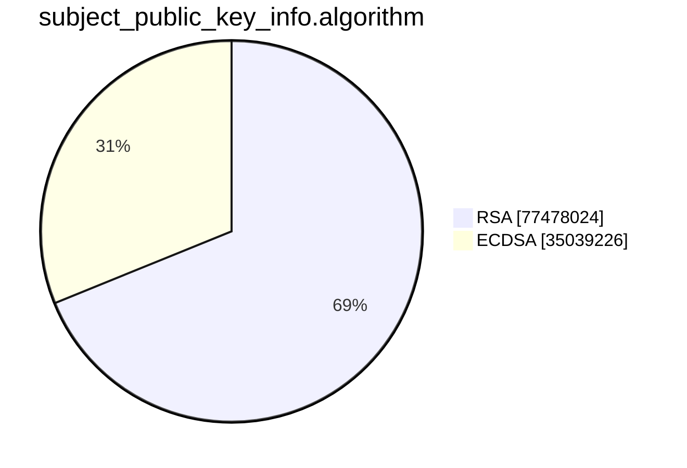
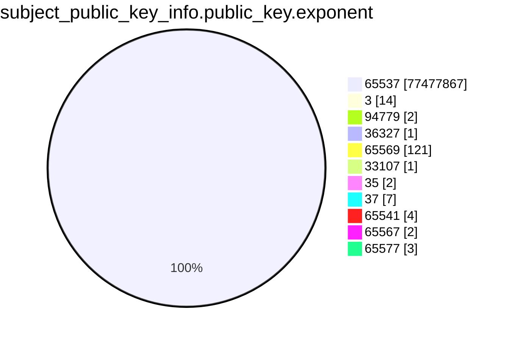
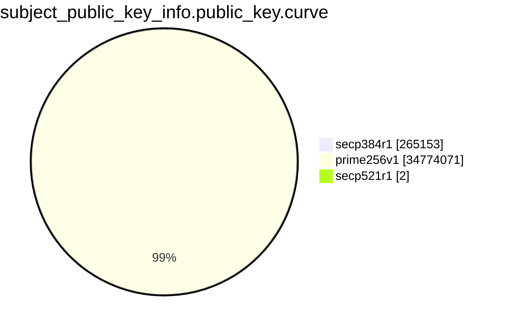
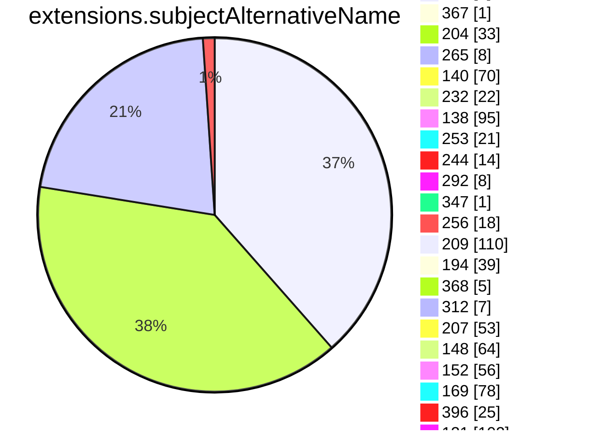

```mermaid
pie showData
title subject.cn.tld
"tw" :45183
"si" :13288
"com" :63201313
"in" :162639
"IN" :88
"at" :99482
"ru" :287971
"jp" :306025
"site" :235685
"kr" :117509
"shop" :426860
"media" :9220
"br" :265241
"org" :2379500
"au" :362476
"cn" :824206
"net" :3524626
"io" :797115
"it" :164833
"online" :290262
"ca" :308897
"co" :273600
"mx" :54334
"bz" :2758
"uk" :691932
"xn--p1ai" :12914
"ws" :3642
"my" :14723
"eu" :280889
"care" :4923
"th" :7493
"fr" :367426
"biz" :196335
"de" :3748766
"cl" :28153
"info" :210286
"cloud" :242399
"sg" :25033
"tech" :66819
"wedding" :4794
"store" :136382
"ie" :43190
"pro" :40504
"dk" :54681
"id" :32493
"es" :161456
"ro" :28251
"nl" :517772
"tr" :37277
"rocks" :15005
"estate" :770
"education" :13353
"be" :120698
"su" :2839
"cz" :68645
"se" :91791
"nz" :61960
"vn" :37564
"pl" :285460
"global" :8534
"hk" :21587
"no" :53684
"pt" :39632
"click" :63907
"aero" :4807
"lu" :10477
"world" :14584
"club" :126872
"gal" :453
"wine" :1389
"xyz" :544427
"expert" :2660
"us" :753118
"bzh" :1711
"edu" :436262
"design" :9427
"ch" :140323
"sv" :828
"lundbeck" :3
"business" :2761
"gl" :593
"cyou" :13241
"int" :3096
"xn--80asehdb" :107
"ac" :2220
"agency" :11209
"py" :1591
"bmw" :613
"cc" :105752
"app" :106491
"mobi" :10009
"direct" :554489
"cards" :1035
"xn--80aswg" :36
"cr" :1570
"team" :8965
"art" :24338
"ai" :45968
"pw" :27235
"live" :147640
"is" :5168
"cy" :2408
"moscow" :605
"COM" :7908
"jobs" :1079
"za" :47763
"school" :2775
"ad" :599
"space" :101137
"games" :6162
"ci" :1219
"pe" :13350
"tokyo" :2963
"gov" :66037
"best" :5807
"center" :4344
"website" :33352
"Nu" :2
"link" :56982
"fi" :48330
"rs" :5637
"ph" :11238
"uy" :3670
"ec" :5358
"am" :4730
"ltd" :22197
"rip" :790
"work" :39159
"uno" :3255
"mn" :2029
"kh" :744
"asia" :64261
"me" :162519
"plus" :11261
"la" :4590
"guide" :1677
"travel" :3192
"BZ" :5
"dev" :3633967
"xn--p1acf" :435
"coffee" :1524
"bn" :224
"om" :1261
"quebec" :329
"life" :306664
"cba" :235
"gr" :36897
"fun" :50035
"jo" :811
"ar" :50311
"lk" :5114
"il" :20608
"vip" :72447
"bh" :818
"sk" :16519
"mo" :538
"ke" :7103
"land" :2635
"ua" :24374
"lv" :6793
"kpn" :43
"ae" :14564
"icu" :20843
"academy" :6430
"gh" :1108
"koeln" :881
"video" :3146
"saxo" :25
"fj" :294
"Com" :158
"eg" :1032
"bank" :1936
"nu" :7355
"ee" :9004
"bg" :7944
"scot" :1283
"pk" :12039
"church" :2172
"uz" :1927
"gmo" :6
"green" :27090
"qa" :2113
"hr" :9776
"kz" :5861
"clinic" :1819
"ntt" :201
"tv" :67138
"hu" :36002
"cymru" :436
"red" :2824
"ma" :8238
"st" :1551
"bo" :1116
"ag" :2509
"ng" :24257
"bd" :3356
"tz" :2370
"network" :12702
"DE" :71
"mv" :400
"mc" :425
"delivery" :1273
"lt" :16954
"mu" :1275
"london" :1837
"hn" :920
"farm" :2566
"tt" :346
"canon" :125
"eco" :1117
"fm" :2465
"BR" :37
"digital" :24278
"theater" :80
"berlin" :3014
"ao" :604
"services" :12608
"ps" :590
"do" :3756
"one" :25213
"ooo" :1202
"to" :4822
"gg" :9195
"blog" :9807
"consulting" :2515
"finance" :17989
"ist" :411
"zone" :12173
"okinawa" :127
"jewelry" :361
"AU" :175
"xn--3e0b707e" :90
"top" :305253
"bet" :11484
"today" :9852
"inc" :1556
"JP" :71
"studio" :12523
"bw" :634
"study" :312
"paris" :1637
"gallery" :1563
"taxi" :635
"page" :2812
"help" :1737
"ryukyu" :26
"yokohama" :84
"ge" :2325
"house" :1760
"by" :3979
"villas" :123
"ba" :1422
"eus" :1476
"coop" :2491
"group" :8954
"clothing" :655
"place" :698
"trade" :3006
"vc" :2978
"va" :31
"cat" :13285
"supply" :629
"li" :12734
"HK" :29
"market" :3330
"sa" :8191
"hsbc" :17
"as" :687
"CA" :388
"mz" :705
"so" :2960
"az" :2300
"bm" :514
"xn--80adxhks" :225
"capital" :2500
"al" :2676
"cw" :92
"apple" :47
"name" :6550
"gmbh" :1494
"support" :3813
"MY" :17
"systems" :15475
"energy" :2525
"GOV" :458
"gt" :2009
"jll" :3
"cab" :471
"jm" :233
"ORG" :514
"kw" :801
"guru" :4889
"marketing" :2983
"host" :6693
"pet" :971
"company" :19734
"tc" :370
"build" :2905
"pa" :1916
"win" :6008
"mk" :1897
"toys" :1325
"email" :8301
"technology" :9623
"menu" :1742
"bayern" :1183
"social" :5540
"cd" :271
"onl" :876
"ml" :33775
"re" :4266
"dog" :1356
"fit" :5848
"tools" :7324
"yt" :504
"pics" :1841
"money" :3800
"alsace" :176
"immo" :1499
"boutique" :1052
"TW" :42
"blue" :2109
"ninja" :13071
"tk" :43209
"health" :4999
"solutions" :8280
"news" :9295
"bar" :4032
"codes" :4429
"gift" :680
"markets" :239
"ga" :18404
"events" :3096
"woodside" :247
"credit" :713
"ceo" :427
"sh" :5905
"aws" :2405
"healthcare" :817
"kg" :653
"sarl" :59
"holdings" :408
"run" :9248
"im" :5489
"report" :1313
"cm" :2391
"rugby" :69
"fail" :501
"bnpparibas" :485
"fashion" :816
"BIZ" :37
"cf" :23591
"gy" :572
"hamburg" :852
"football" :471
"ovh" :3669
"beauty" :1681
"buzz" :35980
"kyoto" :50
"statefarm" :6406
"et" :256
"science" :1657
"cash" :2554
"management" :930
"mm" :464
"mt" :1851
"pictet" :41
"audi" :767
"ve" :818
"ms" :4251
"ly" :1371
"engineering" :3937
"coach" :1952
"gs" :1578
"construction" :544
"infiniti" :6
"gq" :7814
"film" :560
"lol" :5280
"vlaanderen" :279
"exchange" :3890
"iq" :377
"yoga" :736
"sx" :591
"man" :433
"fyi" :1755
"africa" :3370
"movie" :424
"tn" :1131
"cam" :7827
"md" :1875
"ink" :7464
"vet" :833
"xxx" :859
"stream" :1708
"amazon" :24
"contact" :650
"lc" :479
"works" :4375
"party" :2666
"museum" :206
"bio" :2251
"ht" :279
"careers" :790
"wtf" :7471
"lb" :897
"community" :2439
"wien" :889
"legal" :1198
"xn--tckwe" :134
"ventures" :1030
"tax" :854
"pr" :207
"nagoya" :85
"recipes" :393
"software" :3371
"reisen" :272
"moe" :2108
"show" :1797
"monster" :7513
"nyc" :2716
"lgbt" :195
"mil" :1538
"realty" :293
"bj" :282
"casa" :1301
"np" :1612
"llc" :1011
"vision" :1295
"racing" :371
"solar" :905
"bt" :134
"swiss" :1060
"training" :2113
"limited" :483
"brussels" :1148
"bbva" :7
"financial" :1075
"bike" :1515
"wales" :922
"sb" :229
"cx" :4229
"dance" :892
"cool" :4725
"tours" :935
"glass" :326
"pub" :4712
"city" :4012
"radio" :216
"lat" :473
"photo" :2728
"earth" :2270
"cooking" :135
"wiki" :4465
"download" :1174
"dental" :536
"tui" :113
"tf" :5943
"insure" :553
"pink" :498
"sc" :754
"kim" :1198
"security" :451
"style" :1140
"vg" :250
"tube" :342
"forum" :6
"xn--90ais" :105
"productions" :567
"tj" :366
"parts" :559
"car" :107
"chat" :2821
"shoes" :350
"gold" :1757
"tel" :2213
"international" :1654
"kpmg" :7
"rent" :505
"amsterdam" :486
"vote" :429
"love" :4144
"fish" :539
"pg" :284
"quest" :5765
"melbourne" :179
"wang" :9249
"tienda" :256
"mba" :532
"sap" :8161
"ax" :206
"graphics" :458
"camera" :347
"kiwi" :948
"band" :1134
"ug" :1291
"deals" :1312
"loan" :1558
"investments" :567
"bingo" :172
"cpa" :191
"ki" :122
"rest" :1689
"INT" :8
"luxe" :161
"sm" :182
"family" :1861
"fan" :827
"game" :1265
"gd" :396
"golf" :939
"CL" :21
"bid" :6716
"black" :499
"sn" :495
"reviews" :2616
"attorney" :404
"NET" :627
"dealer" :69
"fo" :720
"schule" :268
"EDU" :274
"holiday" :287
"audio" :633
"casino" :1690
"plumbing" :321
"law" :2175
"town" :636
"computer" :570
"ruhr" :322
"institute" :863
"organic" :89
"sale" :2893
"fox" :230
"express" :1385
"directory" :1272
"corsica" :231
"adult" :172
"lighting" :305
"press" :2094
"tm" :633
"voyage" :229
"weir" :171
"xn--fiqs8s" :716
"ne" :189
"salon" :365
"dating" :549
"hosting" :537
"poker" :300
"faith" :520
"xn--mgbaam7a8h" :6
"fitness" :1211
"tips" :1852
"xin" :7800
"pf" :259
"auspost" :153
"archi" :160
"na" :502
"auto" :297
"moda" :219
"af" :161
"nrw" :932
"homes" :1620
"PRO" :1
"QA" :21
"NO" :6
"watch" :2923
"fans" :846
"UK" :130
"garden" :374
"barclaycard" :69
"pictures" :1706
"bs" :231
"foundation" :1425
"SE" :25
"flowers" :113
"zm" :688
"NETWORK" :5
"mortgage" :306
"frl" :275
"army" :564
"accountant" :619
"Org" :10
"pm" :667
"partners" :995
"xn--ses554g" :69
"restaurant" :464
"university" :763
"barclays" :299
"beer" :790
"bi" :379
"surf" :669
"srl" :355
"gifts" :1245
"sr" :212
"dz" :514
"vi" :31
"abbott" :468
"Tech" :2
"pizza" :686
"ikano" :93
"photos" :2598
"rw" :1534
"fund" :1732
"tirol" :250
"brother" :28
"loans" :390
"repair" :419
"camp" :821
"clubmed" :452
"nr" :18
"ngo" :852
"dentist" :205
"irish" :264
"krd" :141
"promo" :373
"discount" :196
"domains" :1586
"actor" :187
"baby" :208
"SG" :90
"photography" :5160
"toyota" :71
"tl" :145
"viajes" :23
"tatar" :31
"kitchen" :483
"vin" :1190
"christmas" :253
"trading" :254
"review" :1373
"ski" :466
"navy" :128
"miami" :322
"aw" :80
"pharmacy" :47
"xn--j1amh" :90
"ky" :423
"sky" :678
"cafe" :1727
"teva" :59
"vacations" :172
"florist" :223
"engineer" :880
"tg" :231
"cleaning" :201
"doctor" :11745
"suzuki" :38
"porn" :331
"new" :479
"rentals" :714
"gay" :694
"webcam" :474
"SA" :37
"KW" :7
"xn--kpry57d" :17
"ricoh" :32
"afl" :31
"sbi" :87
"realestate" :1178
"mw" :281
"xn--d1acj3b" :17
"AR" :16
"NL" :47
"CN" :13
"wf" :159
"bot" :361
"sexy" :340
"Gov" :30
"ren" :2143
"mg" :339
"physio" :609
"haus" :448
"vu" :189
"properties" :1059
"mp" :83
"cg" :121
"ls" :150
"je" :520
"bb" :126
"hair" :364
"nc" :731
"ni" :413
"IT" :45
"gm" :52
"sncf" :44
"neustar" :195
"builders" :596
"cricket" :438
"pfizer" :45
"associates" :193
"college" :362
"US" :86
"fk" :32
"jcb" :8
"sydney" :301
"gn" :15
"soccer" :202
"globo" :167
"nissan" :5
"horse" :288
"xn--mgberp4a5d4ar" :1
"soy" :193
"men" :1509
"xn--c1avg" :30
"how" :753
"bf" :105
"dm" :37
"cbs" :3
"date" :1137
"kn" :48
"diamonds" :194
"shopping" :857
"gives" :340
"nikon" :1
"rehab" :247
"temasek" :11
"limo" :94
"barcelona" :292
"skin" :338
"observer" :94
"saarland" :185
"lamborghini" :3
"tickets" :33
"zuerich" :30
"sony" :16
"immobilien" :420
"jetzt" :678
"reise" :52
"kaufen" :337
"tennis" :111
"xn--mk1bu44c" :85
"tatamotors" :19
"itau" :12
"hiphop" :56
"gp" :194
"auction" :335
"ye" :100
"total" :147
"EU" :51
"property" :156
"surgery" :78
"cv" :107
"exposed" :282
"xn--90ae" :22
"sport" :146
"MX" :9
"hermes" :71
"catering" :170
"taipei" :453
"ong" :291
"cologne" :84
"km" :10
"gratis" :275
"JM" :1
"gucci" :13
"bridgestone" :12
"versicherung" :87
"playstation" :2
"goog" :12673
"xn--e1a4c" :3
"xn--qxa6a" :7
"dj" :2166
"singles" :182
"republican" :62
"claims" :336
"gi" :150
"industries" :357
"xn--q9jyb4c" :63
"zw" :438
"Lighting" :1
"SALE" :2
"condos" :142
"nike" :263
"futbol" :424
"gop" :98
"honda" :13
"realtor" :414
"cfd" :3543
"gdn" :201
"ONLINE" :1
"courses" :320
"madrid" :179
"xn--9dbq2a" :27
"hospital" :110
"lawyer" :549
"forsale" :681
"mq" :81
"AE" :21
"dvag" :173
"RU" :18
"EMAIL" :2
"supplies" :272
"apartments" :604
"PH" :26
"compare" :17
"xn--h2brj9c" :71
"desi" :212
"orange" :61
"contractors" :189
"cheap" :401
"TR" :5
"dhl" :24
"sex" :353
"boston" :86
"democrat" :53
"blackfriday" :77
"sucks" :55
"diet" :57
"degree" :92
"xn--fiq228c5hs" :10
"lease" :233
"sl" :155
"vegas" :466
"osaka" :38
"ir" :7489
"sakura" :1
"capetown" :76
"bargains" :142
"joburg" :64
"flights" :197
"xn--ngbc5azd" :19
"xn--6qq986b3xl" :576
"durban" :62
"sbs" :6005
"rodeo" :243
"country" :111
"bond" :2512
"charity" :146
"cruises" :117
"fishing" :66
"mango" :6
"enterprises" :463
"mom" :419
"equipment" :277
"hockey" :66
"coupons" :131
"abogado" :33
"xn--qxam" :8
"vanguard" :37
"tattoo" :228
"xn--j6w193g" :11
"airforce" :88
"nf" :91
"forex" :28
"sd" :131
"memorial" :29
"gf" :85
"creditcard" :109
"broker" :134
"jnj" :328
"crs" :1402
"tires" :43
"citic" :78
"boats" :69
"PT" :4
"aeg" :2
"leclerc" :25
"trust" :7
"LONDON" :2
"lidl" :71
"ltda" :46
"luxury" :78
"Dk" :1
"insurance" :55
"yachts" :51
"next" :328
"sandvik" :48
"Clinic" :1
"basketball" :45
"Edu" :8
"furniture" :187
"hiv" :7
"pioneer" :6
"DK" :47
"istanbul" :227
"OM" :1
"post" :28
"sz" :136
"CO" :12
"aquarelle" :13
"makeup" :117
"autos" :677
"Biz" :39
"FR" :31
"schwarz" :563
"ck" :85
"day" :792
"mr" :203
"bible" :64
"abb" :48
"monash" :78
"abudhabi" :75
"RENTALS" :2
"gent" :161
"shiksha" :11
"ES" :51
"hm" :44
"香港" :5
"maison" :114
"moi" :7
"xn--6frz82g" :632
"career" :55
"jpmorgan" :2
"sy" :25
"CBA" :10
"toray" :22
"xn--czrs0t" :1
"uol" :37
"vodka" :65
"td" :94
"juegos" :7
"bradesco" :54
"storage" :59
"williamhill" :3
"TH" :14
"scb" :28
"guitars" :40
"Be" :1
"rich" :20
"xn--g2xx48c" :30
"Net" :12
"xn--mgbab2bd" :8
"xn--rhqv96g" :13
"select" :10
"erni" :2
"gripe" :41
"sharp" :16
"accountants" :74
"CZ" :5
"schaeffler" :14
"komatsu" :84
"anz" :37
"cars" :67
"ZA" :28
"FI" :11
"BE" :16
"IE" :12
"philips" :1
"ismaili" :6
"schmidt" :8
"xn--o3cw4h" :5
"KE" :4
"deloitte" :28
"IO" :5
"showtime" :2
"Co" :1
"nab" :2
"sener" :11
"BANK" :6
"abc" :17
"xn--czr694b" :112
"Za" :2
"HR" :13
"lotto" :4
"CM" :2
"theatre" :5
"uK" :4
"praxi" :1
"xn--io0a7i" :20
"lr" :20
"BH" :5
"MU" :2
"RE" :1
"xn--t60b56a" :19
"IL" :9
"DZ" :3
"EC" :4
"COMPANY" :6
"xn--vhquv" :1
"vig" :28
"cfa" :5
"CLOUD" :2
"voto" :12
"pn" :93
"aq" :17
"ss" :42
"lilly" :13
"azure" :40
"SI" :2
"RO" :8
"GR" :9
"ID" :6
"voting" :5
"motorcycles" :24
"axa" :20
"seat" :53
"sanofi" :69
"rio" :7
"nico" :9
"ipiranga" :2
"xn--3ds443g" :23
"CAFE" :1
"xn--node" :3
"xn--vuq861b" :8
"kred" :76
"shell" :14
"MD" :2
"NZ" :15
"microsoft" :15
"PY" :2
"xn--3hcrj9c" :4
"xn--90a3ac" :16
"lego" :18
"goo" :1
"MIL" :8
"City" :1
"godaddy" :5
"fresenius" :4
"xn--fiqz9s" :4
"ifm" :3
"linde" :4
"cisco" :4
"aaa" :1
"TV" :3
"med" :8
"VN" :6
"smart" :3
"xn--y9a3aq" :8
"mma" :7
"xn--otu796d" :8
"xn--czru2d" :19
"cuisinella" :6
"EG" :1
"PL" :2
"aig" :8
"reit" :21
"panasonic" :2
"cu" :2
"weber" :35
"xn--55qx5d" :11
"In" :2
"MO" :1
"ubs" :1
"NU" :1
"AG" :4
"xn--kput3i" :21
"itv" :10
"flir" :1
"fage" :12
"ET" :3
"yandex" :32
"protection" :3
"Zone" :1
"Asia" :1
"CH" :13
"LB" :5
"gw" :5
"AO" :16
"stockholm" :10
"otsuka" :3
"SBI" :6
"MOBI" :4
"Fr" :6
"ASIA" :4
"ericsson" :2
"kfh" :1
"amex" :1
"BRADESCO" :1
"xn--rvc1e0am3e" :4
"Live" :1
"hisamitsu" :2
"CI" :1
"natura" :1
"xn--54b7fta0cc" :2
"locus" :7
"LAW" :2
"xn--rovu88b" :1
"xn--1ck2e1b" :1
"xn--eckvdtc9d" :1
"qpon" :2
"imdb" :1
"free" :1
"tushu" :1
"read" :1
"silk" :1
"xn--jlq480n2rg" :1
"CD" :2
"LTD" :1
"BS" :1
"BM" :1
"bbc" :7
"edeka" :35
"airbus" :1
"chase" :3
"MADRID" :1
"call" :1
"audible" :1
"xn--unup4y" :2
"AT" :4
"COOP" :2
"NAME" :1
"bauhaus" :13
"WORLD" :1
"EUS" :1
"xn--5tzm5g" :14
"dubai" :2
"INFO" :8
"arab" :1
"politie" :44
"xn--ngbrx" :1
"NYC" :1
"jaguar" :2
"landrover" :2
"sew" :2
"lincoln" :2
"statebank" :4
"lanxess" :4
"TOP" :1
"creditunion" :14
"nec" :1
"WS" :4
"rwe" :1
"DIGITAL" :3
"toshiba" :1
"xn--nqv7f" :8
"jprs" :4
"PE" :8
"frogans" :5
"SZ" :1
"Solutions" :2
"HU" :3
"LA" :4
"xn--fjq720a" :1
"ACADEMY" :3
"farmers" :2
"xfinity" :3
"comcast" :3
"ZM" :1
"TECH" :3
"FARM" :2
"XYZ" :5
"channel" :1
"Software" :2
"xn--2scrj9c" :10
"mutual" :3
"northwesternmutual" :1
"CLUB" :4
"JO" :7
"xn--xhq521b" :1
"bosch" :1
"samsung" :2
"nowruz" :1
"xn--hxt814e" :2
"xn--mgbca7dzdo" :1
"booking" :1
"dupont" :6
"CAT" :1
"extraspace" :1
"gu" :2
"MZ" :2
"aco" :3
"redumbrella" :1
"travelersinsurance" :1
"travelers" :1
"trv" :1
"KR" :1
"BW" :1
"CR" :2
"Bid" :2
"mattel" :2
"HOUSE" :2
"bentley" :1
"xn--wgbh1c" :1
"guardian" :3
"APP" :1
"xn--zfr164b" :7
"xn--imr513n" :4
"LT" :1
"xn--s9brj9c" :8
"mini" :2
"xn--h2breg3eve" :26
"AERO" :3
"xn--xkc2dl3a5ee0h" :16
"analytics" :1
"Bank" :2
"Video" :1
"xn--gecrj9c" :4
"foo" :2
"KZ" :2
"Dog" :2
"gea" :1
"Info" :1
"AI" :2
"GT" :1
"Uk" :2
"hyundai" :3
"Dev" :1
"xn--45brj9c" :2
"mit" :2
"amica" :1
"Land" :2
"AM" :1
"bms" :1
"xn--fpcrj9c3d" :6
"MT" :2
"RW" :1
"PF" :1
"WEIR" :1
"MA" :3
"Eu" :1
"ANZ" :1
"LIFE" :1
"UG" :2
"google" :1
"ice" :1
"ZONE" :1
"xn--d1alf" :1
"Us" :1
"jmp" :1
"accenture" :1
```

```mermaid
pie showData
title issuer
"Google UK Ltd." :35603
"Cisco Systems" :414
"行政院" :3
"KPN B.V." :1
"Actalis S.p.A.-03358520967" :1
"A-Trust Ges. f. Sicherheitssysteme im elektr. Datenverkehr GmbH" :6
"AC Camerfirma S.A." :2
"行政院" :14
"VeriSign, Inc." :5
"Baltimore" :4
"VeriSign, Inc." :11
"Microsoft Corporation" :1
"ICP-Brasil" :3
"VeriSign, Inc." :2
"FNMT-RCM" :1
"VeriSign, Inc." :2
"A-Trust Ges. f. Sicherheitssysteme im elektr. Datenverkehr GmbH" :4
"thawte, Inc." :1
"Colegio de Registradores de la Propiedad y Mercantiles de España" :2
"行政院" :1
"DigiCert Inc" :3
"AC CAMERFIRMA S.A." :2
"Hellenic Academic and Research Institutions Cert. Authority" :3
"Republika Slovenija" :2
"E-Tuğra EBG Bilişim Teknolojileri ve Hizmetleri A.Ş." :5
"Elektronik Bilgi Guvenligi A.S." :2
"GeoTrust Inc." :2
"MULTICERT - Serviços de Certificação Electrónica S.A." :1
"Hellenic Academic and Research Institutions Cert. Authority" :15
"Atos" :2
"QuoVadis Limited" :2
"POSTA" :2
"Secretaria de Economia" :1
"TÜRKTRUST Bilgi İletişim ve Bilişim Güvenliği Hizmetleri A.Ş." :1
"Elektronik Bilgi Guvenligi A.S." :1
"LAWtrust" :2
"AC Camerfirma SA" :1
"SwissSign AG" :1
"British Telecommunications plc" :5
"Google UK Ltd." :94320
"Certinomis" :1
"HydrantID (Avalanche Cloud Corporation)" :1
"QuoVadis Limited" :2
"GlobalSign" :1
"Institute for Development and Research in Banking Technology" :41
"U.S. Government" :4
"Symantec Corporation" :3
"GlobalSign nv-sa" :3
"WoSign CA Limited" :1
"Apple Inc." :6
"VeriSign, Inc." :1
"Japanese Government" :1
"Unizeto Technologies S.A." :1
"ANF Autoridad de Certificacion" :1
"SwissSign AG" :1
"Foundation for Trusted Identity" :1
"Hongkong Post" :3
"Vaestorekisterikeskus CA" :2
"QuoVadis Limited" :3
"certSIGN" :2
"U.S. Government" :1
"DigiCert Inc" :2
"e-commerce monitoring GmbH" :4
"ICP-Brasil" :3
"DigiCert Inc" :2
"MINISTERE INTERIEUR" :1
"DigiCert Inc" :1
"Government Root Certification Authority" :1
"Open Access Technology International Inc" :1
"Apple Inc." :1
"SECOM Trust Systems CO.,LTD." :2
"E-Tuğra EBG Bilişim Teknolojileri ve Hizmetleri A.Ş." :10
"Elektronik Bilgi Guvenligi A.S." :1
"行政院" :1
"ICP-Brasil" :1
"TÜRKTRUST Bilgi İletişim ve Bilişim Güvenliği Hizmetleri A.Ş." :1
"VeriSign, Inc." :2
"Orion Health Inc." :2
"DigiCert Inc" :1
"ACNLB" :1
"QuoVadis Limited" :9326
"Apple Inc." :1
"The USERTRUST Network" :1
"GlobalSign nv-sa" :2
"GAD EG" :2
"SAFE Identity" :1
"GlobalSign nv-sa" :1
"VeriSign, Inc." :1
"NISZ Nemzeti Infokommunikációs Szolgáltató Zrt." :1
"QuoVadis Limited" :3
"SECOM Trust.net" :1
"TSCP Inc." :1
"Actalis S.p.A." :1
"Turkiye Bilimsel ve Teknolojik Arastirma Kurumu - TUBITAK" :1
"SwissSign AG" :3
"Verizon Business" :1
"ICP-Brasil" :1
"Symantec Corporation" :1
"Apple Inc." :3
"Sectigo Limited" :1
"SAFE-Biopharma" :1
"SwissSign AG" :2
"Apple Inc." :1
"Trustwave Holdings, Inc." :1
"GlobalSign nv-sa" :197646
"GlobalSign nv-sa" :284376
"GlobalSign nv-sa" :116348
"GlobalSign nv-sa" :10706
"GlobalSign nv-sa" :13245
"GlobalSign nv-sa" :137141
"GlobalSign nv-sa" :1941
"Česká pošta, s.p." :652
"Rede Nacional de Ensino e Pesquisa - RNP" :6702
"GlobalSign nv-sa" :99
"VALID CERTIFICADORA DIGITAL" :160
"SOLUTI - SOLUCOES EM NEGOCIOS INTELIGENTES S-A" :12
"ATT Services Inc" :2416
"Sectigo Limited" :9093121
"DigiCert Inc" :154704
"DigiCert Inc" :1106339
"SSL Corporation" :45118
"Government of Korea" :631
"DigiCert Inc" :5346
"Internet2" :364012
"DigiCert Inc" :287174
"Network Solutions L.L.C." :89416
"DigiCert Inc" :88596
"DigiCert Inc" :121881
"The USERTRUST Network" :49154
"Sectigo Limited" :667291
"SecureCore" :22142
"SECOM Trust Systems CO.,LTD." :20270
"GoGetSSL" :92427
"DigiCert Inc" :64807
"DigiCert Inc" :9519
"SECOM Trust Systems CO.,LTD." :16494
"DigiCert Inc" :5568
"DigiCert Inc" :24320
"Sectigo Limited" :44235
"FUJIFILM" :153
"DigiCert Inc" :208
"DigiCert Inc" :10245618
"UniTrust" :951
"DigiCert Inc" :409
"Trust Provider B.V." :12982
"The Trustico Group Ltd" :10318
"DigiCert Inc" :7877880
"DigiCert Inc" :62509
"DigiCert Inc" :2205
"GlobalSign nv-sa" :1170
"TAIWAN-CA" :28123
"SecureCore" :998
"DigiCert Inc" :37977
"Technische Universitaet Dresden" :540
"TrustAsia Technologies, Inc." :726
"DigiCert Inc" :1548
"Aetna Inc" :7844
"Entrust, Inc." :298002
"COMODO CA Limited" :250504
"Verein zur Foerderung eines Deutschen Forschungsnetzes e. V." :37559
"DigiCert Inc" :8816
"DigiCert Inc" :9283
"Soluciones Corporativas IP, SL" :32549
"EUNETIC GmbH" :6459
"Fraunhofer" :3740
"DigiCert Inc" :120
"Sectigo Limited" :548
"Alpiro s.r.o." :9944
"DigiCert Inc" :1379
"GoDaddy.com, Inc." :22438
"DigiCert Inc" :192
"DigiCert Inc" :1613
"Technische Universitaet Ilmenau" :178
"DigiCert Inc" :6148
"Network Solutions L.L.C." :24429
"Karlsruhe Institute of Technology" :845
"DigiCert Inc" :4492
"Gandi" :487720
"TBS INTERNET" :4442
"Siemens" :1
"Corporation Service Company" :36738
"EUNETIC GmbH" :136
"Max-Planck-Gesellschaft" :1326
"Nijimo K.K." :916
"DigiCert Inc" :28296
"Sectigo Limited" :9727
"Sectigo Limited" :3790641
"DigiCert Inc" :17801
"The USERTRUST Network" :1861
"Internet2" :10614
"DigiCert Inc" :630
"COMODO CA Limited" :5089
"GoGetSSL" :226
"DigiCert Inc" :13605
"Trustwave Holdings, Inc." :6271
"Wells Fargo & Company" :2524
"Government of the District of Columbia" :271
"DigiCert Inc" :272
"DigiCert Inc" :4113
"K Software" :422
"SecureCore" :72
"WoTrus CA Limited" :9139
"TrustAsia Technologies, Inc." :302079
"Apple Inc." :1516
"Cybertrust Japan Co., Ltd." :14224
"BitCert" :244
"CrowdStrike Inc." :30
"Cybertrust Japan Co., Ltd." :6269
"TAIWAN-CA" :151
"SSL Corp" :97
"GoGetSSL" :920
"DigiCert Inc" :177243
"DigiCert Inc" :710
"Entrust, Inc." :29335
"Deutscher Bundestag" :62
"CentralNic Luxembourg Sàrl" :8498
"IZENPE S.A." :440
"DigiCert Inc" :924
"Chunghwa Telecom Co., Ltd." :1877
"SECOM Trust Systems CO.,LTD." :7318
"Unizeto Technologies S.A." :98238
"Beijing Xinchacha Credit Management Co., Ltd." :1509
"The Trustico Group Ltd" :124
"WoTrus CA Limited" :385
"Beijing Xinchacha Credit Management Co., Ltd." :3167
"Corporation Service Company" :144
"MarketWare - Soluções para Mercados Digitais, Lda." :344
"United SSL Deutschland GmbH" :610
"VALID CERTIFICADORA DIGITAL" :28
"CERTDATA SERVICOS DE INFORMACAO LTDA" :58
"Open Access Technology International Inc" :998
"Apple Inc." :1520
"The Trustico Group Ltd" :112
"Internet2" :5567
"Network Solutions L.L.C." :756
"Amazon" :21700033
"WoTrus CA Limited" :1786
"Disig a.s." :244
"IZENPE S.A." :219
"DHIMYOTIS" :3294
"Aristotle University of Thessaloniki" :440
"Buypass AS-983163327" :3006
"GEANT Vereniging" :4368
"GlobalSign nv-sa" :74
"Aetna Inc" :52
"SOLUTI - SOLUCOES EM NEGOCIOS INTELIGENTES S-A" :66
"Sectigo (Europe) SL" :4
"Fresenius Kabi AG" :70
"GoGetSSL" :6
"Apple Inc." :877
"Trustwave Holdings, Inc." :92
"Apple Inc." :1035
"Nijimo K.K." :196
"TrustAsia Technologies, Inc." :2692
"OpenTrust" :1
"SwissSign AG" :1
"SwissSign AG" :1
"SwissSign AG" :1
"GeoTrust Inc." :1
"Certinomis" :4
"GeoTrust Inc." :1
"SwissSign AG" :1
"Certinomis" :1
"DigiCert Inc" :189
"Inera AB" :6
"VI Registru centras - i.k. 124110246" :1
"Agence Nationale des Titres Sécurisés" :2
"China Financial Certification Authority" :264
"CERTSIGN SA" :4
"China Financial Certification Authority" :1
"China Financial Certification Authority" :1550
"Netflix, Inc." :1
"CERTSIGN SA" :1
"CERTSIGN SA" :1
"Vaestorekisterikeskus CA" :5
"Krajowa Izba Rozliczeniowa S.A." :335
"E-Tuğra EBG Bilişim Teknolojileri ve Hizmetleri A.Ş." :1
"Vaestorekisterikeskus CA" :2
"Krajowa Izba Rozliczeniowa S.A." :1
"E-Tuğra EBG Bilişim Teknolojileri ve Hizmetleri A.Ş." :1378
"E-Tuğra EBG Bilişim Teknolojileri ve Hizmetleri A.Ş." :29
"Isimtescil Bilisim Anonim Sirketi" :3562
"Vaestorekisterikeskus CA" :2
"Vaestorekisterikeskus CA" :2
"Isimtescil Bilisim Anonim Sirketi" :1
"Krajowa Izba Rozliczeniowa S.A." :1
"COMODO CA Limited" :5220
"Actalis S.p.A." :555401
"RU-Center (ЗАО Региональный Сетевой Информационный Центр)" :316
"QuoVadis Limited" :24625
"联通智慧安全科技有限公司" :27
"WoTrus CA Limited" :28
"Starfield Technologies, Inc." :2616
"QuoVadis Trustlink B.V." :3916
"Buypass AS-983163327" :813
"TeliaSonera" :4710
"CERTDATA SERVICOS DE INFORMACAO LTDA" :94
"MarketWare - Soluções para Mercados Digitais, Lda." :258
"Shanghai Ping An Credit Reference Company Limited" :9
"HydrantID (Avalanche Cloud Corporation)" :1793
"VTB BANK (PJSC)" :111
"sslTrus" :280
"Government of Korea" :37
"sslTrus" :1108
"DigiCert Inc" :120
"GlobalSign nv-sa" :914
"DigiCert Inc" :7282
"Site Blindado S.A." :490
"KICA" :4
"IdenTrust" :1125468
"Entrust, Inc." :1641
"IdenTrust" :2278
"DigiCert Inc" :40
"Corporation Service Company" :4837
"Actalis S.p.A." :4890
"SECOM Trust Systems CO.,LTD." :334
"DigiCert Inc" :36
"Hongkong Post" :1367
"SSL.com" :180
"TrustSign Certificadora Dig. & Soluções Segurança da Inf. Ltda." :1149
"Apple Inc." :139
"Apple Inc." :380
"UniTrust" :1
"Intesa Sanpaolo S.p.A." :1
"InfoCert S.p.A." :1
"InfoCert S.p.A." :1
"Open Access Technology International Inc" :8
"QuoVadis Limited" :1
"QuoVadis Limited" :1
"Turkiye Bilimsel ve Teknolojik Arastirma Kurumu - TUBITAK" :81
"QuoVadis Limited" :1
"SwissSign AG" :16024
"NAVER BUSINESS PLATFORM Corp." :1
"HydrantID (Avalanche Cloud Corporation)" :1
"SwissSign AG" :8228
"ZETES SA (VATBE-0408425626)" :2
"TAIWAN-CA" :1
"TAIWAN-CA" :1
"SwissSign AG" :5415
"Japan Certification Services, Inc." :1
"UniTrust" :1
"Beijing Xinchacha Credit Management Co., Ltd." :45
"Baidu, Inc." :916
"QuoVadis Trustlink B.V." :2269
"Turing Crypto GmbH" :176
"Entrust, Inc." :374
"SwissSign AG" :1
"Certinomis" :1
"Certinomis" :1
"Siemens" :1
"Vaestorekisterikeskus CA" :2
"certSIGN" :1
"certSIGN" :1
"Abitab S.A." :1
"GAD EG" :1
"Capricorn Identity Services Pvt Ltd." :1
"Disig a.s." :2
"Alpiro s.r.o." :62
"DigiCert Inc" :125
"SECOM Trust Systems CO.,LTD." :782
"DigiCert Inc" :269
"WoTrus CA Limited" :39
"Turing Crypto GmbH" :4
"WoTrus CA Limited" :4
"Sectigo Limited" :551
"Telia Finland Oyj" :2288
"Trustwave Holdings, Inc." :318
"sslTrus (上海锐成信息科技有限公司)" :22
"TI Trust Technologies S.R.L." :1852
"SOLUTI - SOLUCOES EM NEGOCIOS INTELIGENTES S-A" :29
"VALID CERTIFICADORA DIGITAL" :18
"EUNETIC GmbH" :12
"GoGetSSL" :188
"Trust Provider B.V." :618
"Hellenic Academic and Research Institutions CA" :177
"Deutsche Telekom Security GmbH" :1
"MarketWare - Soluções para Mercados Digitais, Lda." :130
"Sectigo Limited" :30
"Hao Quang Viet Software Company Limited" :161
"GlobalSign nv-sa" :49
"Digi- ja vaestotietovirasto CA" :868
"GlobalSign nv-sa" :7
"Digi- ja vaestotietovirasto CA" :643
"COMODO CA Limited" :1112
"DHIMYOTIS" :1395
"TBS INTERNET" :62
"DigiCert Inc" :90
"UniTrust" :113
"WoTrus CA Limited" :9
"DigiCert Inc" :15
"SECOM Trust Systems CO.,LTD." :43
"Microsec Ltd." :4
"Nijimo K.K." :204
"eMudhra Technologies Limited" :2800
"DigiCert Inc" :91
"DigiCert Inc" :59
"Gandi" :562
"Baidu, Inc." :104
"ITSO LTD" :58
"Domain The Net Technologies Ltd" :552
"D-Trust GmbH" :5408
"DigiCert Inc" :213
"One Sign Pte. Ltd." :384
"DigiCert Inc" :675
"Microsoft Corporation" :766731
"Microsoft Corporation" :767103
"Ziwit" :156
"Staat der Nederlanden" :4
"T-Systems International GmbH" :8819
"DigiCert Inc" :46
"Shanghai Ping An Credit Reference Company Limited" :5
"HydrantID (Avalanche Cloud Corporation)" :341
"DigiCert Inc" :18
"DigiCert Inc" :11
"Ziwit" :10
"DigiCert Inc" :94838
"DigiCert Inc" :34
"Japan Registry Services Co., Ltd." :57781
"Cisco Systems, Inc." :224171
"Cloudflare, Inc." :10649254
"Cloudflare, Inc." :30500575
"nazwa.pl sp. z o.o." :163742
"GEANT Vereniging" :293948
"cPanel, Inc." :104986
"DigiCert Inc" :24941
"ZeroSSL" :38370
"TrustCor Systems S. de R.L." :13082
"Japan Registry Services Co., Ltd." :1389
"Root Networks, LLC" :10067
"home.pl S.A." :48082
"LH.pl Sp. z o.o." :4977
"Unizeto Technologies S.A." :1951
"Genious Communications" :2464
"DOMENY.PL sp. z o.o" :8714
"swissns GmbH" :166
"iTrusChina Co., Ltd." :1285
"Dreamcommerce S.A." :10988
"McAfee, Inc." :1166
"GEANT Vereniging" :9562
"Hellenic Academic and Research Institutions Cert. Authority" :270
"行政院" :7641
"WISeKey" :875
"T-Systems International GmbH" :1318
"WebSpace-Forum e.K." :8
"Unizeto Technologies S.A." :807
"Entrust Datacard Europe S.L." :84
"FNMT-RCM" :785
"Atos" :1173
"TI Trust Technologies S.R.L." :432
"První certifikační autorita, a.s." :33
"Firmaprofesional S.A." :950
"Financijska agencija" :240
"D-Trust GmbH" :695
"Hellenic Academic and Research Institutions Cert. Authority" :34
"E-SAFER CONSULTORIA EM TECNOLOGIA DA INFORMACAO LTDA" :266
"Ziwit" :12
"cPanel, Inc." :122
"DNEncrypt, Inc" :250
"SECOM Trust Systems CO.,LTD." :1365
"SECOM Trust Systems CO.,LTD." :247
"TrustAsia Technologies, Inc." :2110
"CerSign Technology Limited" :130
"Global Digital Cybersecurity Authority Co., Ltd." :297
"DigiCert Inc" :165
"Deutsche Post AG" :1969
"Global Digital Cybersecurity Authority Co., Ltd." :134
"Global Digital Cybersecurity Authority Co., Ltd." :12
"GEANT Vereniging" :4987
"Abitab S.A." :102
"Quantum CA Limited" :118
"QuoVadis Trustlink B.V." :984
"DOMENY.PL sp. z o.o" :286
"cPanel, Inc." :44
"Hellenic Academic and Research Institutions CA" :23
"Digital Trust L.L.C." :482
"Hellenic Academic and Research Institutions CA" :254
"Quantum CA Limited" :6
"IdenTrust" :57
"WidePoint" :15
"Quantum CA Limited" :8
"Sectigo Limited" :1226
"Apple Inc." :6
"T-Systems International GmbH" :177
"Comodo Japan, Inc." :990
"sslTrus" :10
"iTrusChina Co., Ltd." :103
"Staclar, Inc." :61
"FNMT-RCM" :596
"Abitab S.A." :143
"Sectigo Limited" :270
"Microsoft Corporation" :1205780
"Microsoft Corporation" :1183188
"Anson Network Limited" :28
"Deutsche Kreditbank AG" :190
"Nyatwork Communication Ltd" :197
"Sectigo (Europe) SL" :32
"DigiCert Inc" :64
"Netflix, Inc." :1
"Baidu, Inc." :10
"AffirmTrust" :54
"Alpiro s.r.o." :26
"sslTrus" :2
"Shenzhen Digital Certificate Authority Center Co., Ltd" :54
"TrustOcean Limited" :2
"Vaestorekisterikeskus CA" :4
"GEANT Vereniging" :67
"Kingnet Information Technology Co., Ltd." :17
"DigiCert Inc" :18
"VISA" :12
"Actalis S.p.A." :514
"DigiCert Inc" :39
"Hellenic Academic and Research Institutions CA" :68
"Hellenic Academic and Research Institutions CA" :22
"Hellenic Academic and Research Institutions CA" :21
"Hellenic Academic and Research Institutions CA" :6
"D-Trust GmbH" :88
"KICA" :38
"TrustSign Certificadora Dig. & Soluções Segurança da Inf. Ltda." :12
"CertCloud Pte. Ltd." :152
"eMudhra Technologies Limited" :100
"První certifikační autorita, a.s." :168
"Alpiro s.r.o." :48
"TRUSTCUBES LIMITED" :14
"GlobalSign nv-sa" :5897
"Shenzhen Digital Certificate Authority Center Co., Ltd" :24
"GlobalSign nv-sa" :2844
"CentralNic Luxembourg Sàrl" :16
"DigiCert Inc" :14
"GlobalSign nv-sa" :117
"COMODO CA Limited" :6
"CERTDATA SERVICOS DE INFORMACAO LTDA" :22
"E-SAFER CONSULTORIA EM TECNOLOGIA DA INFORMACAO LTDA" :54
"ZeroSSL" :36
"TrustAsia Technologies, Inc." :30
"Greek Universities Network (GUnet)" :7
"STCS" :1
"Sistema Nacional de Certificacion Electronica" :1
"Alibaba Cloud Computing Co., Ltd." :4
"A-Trust Ges. f. Sicherheitssysteme im elektr. Datenverkehr GmbH" :28
"NetLock Kft." :32
"Telia Finland Oyj" :1
"Telia Finland Oyj" :1
"Apple Inc." :28
"CerSign Technology Limited" :2
"Microsoft Corporation" :1851829
"Microsoft Corporation" :1896395
"FNMT-RCM" :105
"TrustAsia Technologies, Inc." :17146
"TrustAsia Technologies, Inc." :1141100
"Quantum CA Limited" :35
"Pardazeshgaran Shahr Hooshmand Yekta Co." :25
"Hellenic Academic and Research Institutions Cert. Authority" :9
"DigiCert, Inc." :57
"Hellenic Academic and Research Institutions CA" :39
"certSIGN" :1
"certSIGN" :1
"certSIGN" :867
"certSIGN" :3
"DigiCert, Inc." :6
"ZoTrus Technology Limited" :100
"DigiCert Inc" :1
"WebSpace-Forum e.K." :6
"Alibaba Cloud Computing Co., Ltd." :2
"Digi-Sign Limited" :66
"DigiCert, Inc." :1
"COMODO CA Limited" :10
"WISeKey" :1
"WISeKey" :1
"WISeKey" :1
"Hellenic Academic and Research Institutions CA" :17
"{'c': 'BE', 'cn': 'Citizen CA', 'serialnumber': '201605'}" :1
"{'c': 'BE', 'cn': 'Citizen CA', 'serialnumber': '201507'}" :1
"{'c': 'BE', 'cn': 'Citizen CA', 'serialnumber': '201505'}" :1
"{'c': 'BE', 'cn': 'Citizen CA', 'serialnumber': '201508'}" :1
"{'c': 'BE', 'cn': 'Citizen CA', 'serialnumber': '201622'}" :1
"{'c': 'BE', 'cn': 'Citizen CA', 'serialnumber': '201503'}" :1
"{'c': 'BE', 'cn': 'Citizen CA', 'serialnumber': '201601'}" :1
"{'c': 'BE', 'cn': 'Citizen CA', 'serialnumber': '201625'}" :1
"http:--repository.eid.belgium.be-" :1
"http:--repository.eid.belgium.be-" :1
"{'c': 'BE', 'cn': 'Citizen CA', 'serialnumber': '201406'}" :1
"{'c': 'BE', 'cn': 'Citizen CA', 'serialnumber': '201501'}" :1
"{'c': 'BE', 'cn': 'Citizen CA', 'serialnumber': '201409'}" :1
"http:--repository.eid.belgium.be-" :1
"http:--repository.eid.belgium.be-" :1
"{'c': 'BE', 'cn': 'Citizen CA', 'serialnumber': '201624'}" :1
"{'c': 'BE', 'cn': 'Citizen CA', 'serialnumber': '201512'}" :1
"{'c': 'BE', 'cn': 'Citizen CA', 'serialnumber': '201511'}" :1
"{'c': 'BE', 'cn': 'Citizen CA', 'serialnumber': '201627'}" :1
"{'c': 'BE', 'cn': 'Citizen CA', 'serialnumber': '201623'}" :1
"{'c': 'BE', 'cn': 'Citizen CA', 'serialnumber': '201606'}" :1
"{'c': 'BE', 'cn': 'Citizen CA', 'serialnumber': '201404'}" :1
"{'c': 'BE', 'cn': 'Citizen CA', 'serialnumber': '201510'}" :1
"http:--repository.eid.belgium.be-" :1
"http:--repository.eid.belgium.be-" :1
"{'c': 'BE', 'cn': 'Citizen CA', 'serialnumber': '201509'}" :1
"{'c': 'BE', 'cn': 'Citizen CA', 'serialnumber': '201609'}" :1
"{'c': 'BE', 'cn': 'Citizen CA', 'serialnumber': '201403'}" :1
"{'c': 'BE', 'cn': 'Citizen CA', 'serialnumber': '201628'}" :1
"http:--repository.eid.belgium.be-" :1
"{'c': 'BE', 'cn': 'Citizen CA', 'serialnumber': '201626'}" :1
"http:--repository.eid.belgium.be-" :1
"{'c': 'BE', 'cn': 'Citizen CA', 'serialnumber': '201602'}" :1
"{'c': 'BE', 'cn': 'Citizen CA', 'serialnumber': '201632'}" :1
"{'c': 'BE', 'cn': 'Citizen CA', 'serialnumber': '201506'}" :1
"http:--repository.eid.belgium.be-" :1
"{'c': 'BE', 'cn': 'Citizen CA', 'serialnumber': '201610'}" :1
"{'c': 'BE', 'cn': 'Foreigner CA', 'serialnumber': '201608'}" :1
"{'c': 'BE', 'cn': 'Foreigner CA', 'serialnumber': '201606'}" :1
"{'c': 'BE', 'cn': 'Citizen CA', 'serialnumber': '201604'}" :1
"{'c': 'BE', 'cn': 'Citizen CA', 'serialnumber': '201608'}" :1
"TERENA" :2
"e-commerce monitoring GmbH" :22
"The Trustico Group Ltd" :10
"{'c': 'BE', 'cn': 'Belgium Root CA4'}" :1
"{'c': 'BE', 'cn': 'Citizen CA', 'serialnumber': '201603'}" :1
"http:--repository.eid.belgium.be-" :1
"{'c': 'BE', 'cn': 'Citizen CA', 'serialnumber': '201629'}" :1
"{'c': 'BE', 'cn': 'Citizen CA', 'serialnumber': '201405'}" :1
"{'c': 'BE', 'cn': 'Citizen CA', 'serialnumber': '201634'}" :1
"{'c': 'BE', 'cn': 'Citizen CA', 'serialnumber': '201504'}" :1
"http:--repository.eid.belgium.be-" :1
"{'c': 'BE', 'cn': 'Citizen CA', 'serialnumber': '201410'}" :1
"{'c': 'BE', 'cn': 'Citizen CA', 'serialnumber': '201502'}" :1
"{'c': 'BE', 'cn': 'Citizen CA', 'serialnumber': '201408'}" :1
"{'c': 'BE', 'cn': 'Citizen CA', 'serialnumber': '201633'}" :1
"{'c': 'BE', 'cn': 'Citizen CA', 'serialnumber': '201631'}" :1
"{'c': 'BE', 'cn': 'Citizen CA', 'serialnumber': '201621'}" :1
"TrustAsia Technologies, Inc." :739
"Digi- ja vaestotietovirasto CA" :14
"{'c': 'BE', 'cn': 'Citizen CA', 'serialnumber': '201607'}" :1
"{'c': 'BE', 'cn': 'Citizen CA', 'serialnumber': '201407'}" :1
"{'c': 'BE', 'cn': 'Citizen CA', 'serialnumber': '201630'}" :1
"GlobalSign nv-sa" :1
"TrustAsia Technologies, Inc." :44
"Hellenic Academic and Research Institutions CA" :3
"QuoVadis Limited" :36
"Digital Trust L.L.C." :34
"DOMENY.PL sp. z o.o" :10
"TrustAsia Technologies, Inc." :7
"GlobalSign nv-sa" :437
"Amazon" :43
"3CX" :10
"GlobalSign nv-sa" :24
"GlobalSign nv-sa" :6
"DigiCert Inc" :328
"DigiCert Inc" :18
"ZoTrus Technology Limited" :8
"Hellenic Academic and Research Institutions CA" :7
"Gehirn Inc." :4
"ICP-Brasil" :2
"Hellenic Academic and Research Institutions CA" :1
"Hellenic Academic and Research Institutions CA" :1
"Siemens" :2
"SSL Corp" :6
"eMudhra Technologies Limited" :11
"DigiCert, Inc." :2
"DigiCert, Inc" :5
"DigiCert, Inc" :4
"DigiCert, Inc." :2
"DigiCert, Inc" :2
"DigiCert, Inc." :2
"DigiCert, Inc." :6
"Microsoft Corporation" :32
"Hongkong Post" :3
"DigiCert Inc" :18
"Public Key Infrastructure Ltd" :7
"DigiCert, Inc." :1
"NETLOCK Kft." :21
"DigiCert Inc" :2
"Globalsign nv-sa" :550
"HydrantID (Avalanche Cloud Corporation)" :1
"Site Blindado S.A." :4
"TrustAsia Technologies, Inc." :10
"Microsoft Corporation" :43
"Microsoft Corporation" :42
"TrustCor Systems S. de R.L." :6
"ACCV" :36
"NetLock Kft." :18
"Abitab S.A." :12
"Entrust Datacard Deutschland GmbH" :3
"Hao Quang Viet Software Company Limited" :2
"DigiCert, Inc" :5
"Agenzia per l'Italia Digitale" :33
"EDICOM CAPITAL SL" :21
"Fuji Xerox" :116
"Apple Inc." :88
"Hellenic Academic and Research Institutions CA" :2
"Hellenic Academic and Research Institutions CA" :2
"TrustAsia Technologies, Inc." :6
"VI Registru centras- i.k. 124110246" :1
"DocuSign France" :1
"e-commerce monitoring GmbH" :1
"e-commerce monitoring GmbH" :1
"Firmaprofesional S.A." :1
"{'c': 'ES', 'cn': 'Autoridad de Certificacion Firmaprofesional CIF A62634068'}" :1
"Firmaprofesional S.A. NIF A-62634068" :1
"Hellenic Academic and Research Institutions CA" :2
"Hellenic Academic and Research Institutions Cert. Authority" :2
"ARGE DATEN - Austrian Society for Data Protection" :1
"Hellenic Academic and Research Institutions Cert. Authority" :2
"Hellenic Academic and Research Institutions CA" :2
"Avalanche Cloud Corporation" :26
"Microsoft Corporation" :35
"DigiCert Inc" :10
"JoySSL Limited" :442
"CONSEJO GENERAL DE LA ABOGACIA" :1
"Consejo General de la Abogacia" :1
"Consejo General de la Abogacia" :1
"COMODO CA Limited" :2
"DigiCert Inc" :2
"Kingnet Information Technology Co., Ltd." :10
"eMudhra Technologies Limited" :2
"DigiCert Inc" :375
"CrowdStrike, Inc." :76
"ZETES SA (VATBE-0408425626)" :1
"ICP-Brasil" :488
"DigiCert, Inc." :4
"DigiCert, Inc." :2
"DigiCert, Inc." :4
"DigiCert, Inc." :6
"Hellenic Academic and Research Institutions CA" :8
"E-TUGRA EBG BILISIM TEKNOLOJILERI VE HIZMETLERI ANONIM SIRKETI" :1729
"AffirmTrust" :3
"VALID CERTIFICADORA DIGITAL" :3
"UniTrust" :4
"WoTrus CA Limited" :20
"DigiCert, Inc." :4
"Gehirn Inc." :44
"GlobalSign nv-sa" :2
"Entrust, Inc." :2
"Nijimo K.K." :4
"PSW GROUP GmbH & Co. KG" :2
"AC Camerfirma S.A." :1
"AC CAMERFIRMA S.A." :1
"GoGetSSL" :2
"AC CAMERFIRMA S.A." :1
"Deutsche Telekom Security GmbH" :988
"Isimtescil Bilisim A.S." :4407
"AC CAMERFIRMA S.A." :1
"Verokey" :2
"DigiCert, Inc." :5
"AC CAMERFIRMA S.A." :1
"AC CAMERFIRMA S.A." :1
"Global Digital Inc." :50
"Firmaprofesional S.A." :10
"E-TUGRA EBG BILISIM TEKNOLOJILERI VE HIZMETLERI ANONIM SIRKETI" :8
"MULTICERT - Serviços de Certificação Electrónica S.A." :1
"CerSign Technology Limited" :2
"TrustAsia Technologies, Inc." :1
"Agencia Notarial de Certificacion S.L.U. - CIF B83395988" :1
"Agencia Notarial de Certificacion S.L.U. - CIF B83395988" :1
"Agencia Notarial de Certificacion S.L.U. - CIF B83395988" :1
"Agencia Notarial de Certificacion S.L.U. - CIF B83395988" :1
"Agencia Notarial de Certificacion S.L.U. - CIF B83395988" :1
"Agencia Notarial de Certificacion S.L.U. - CIF B83395988" :1
"D-Trust GmbH" :17
"Gehirn Inc." :4
"eMudhra Technologies Limited" :18
"Isimtescil Bilisim A.S." :1
"DigiCert, Inc." :9
"Digital Trust L.L.C." :2
"SECOM Trust Systems CO.,LTD." :2
"National Infrastructures for Research and Technology" :1
"Genious Communications" :4
"DigiCert, Inc." :7
"Hellenic Academic and Research Institutions CA" :1
"Hellenic Academic and Research Institutions CA" :1
"Hellenic Academic and Research Institutions CA" :1
"e-commerce monitoring GmbH" :4
"Hellenic Academic and Research Institutions CA" :1
"Hellenic Academic and Research Institutions CA" :11
"Deutsche Telekom Security GmbH" :1
"SSL.com" :4
"ZoTrus Technology Limited" :2
"SafeToOpen Ltd" :2
"Digital Trust L.L.C." :20
"Globalsign nv-sa" :2953
"GlobalSign nv-sa" :8005
"AffirmTrust" :2
"GlobalSign nv-sa" :2576
"GlobalSign nv-sa" :120
"GlobalSign nv-sa" :316
"DigiCert, Inc." :2
"DNEncrypt, Inc" :2
"Microsoft Corporation" :1234
"ICP-Brasil" :66
"e-commerce monitoring GmbH" :8
"Telecom Italia Trust Technologies S.R.L." :2
"DNSPod, Inc." :890
"DNSPod, Inc." :10
"Microsoft Corporation" :215
"ZoTrus Technology Limited" :4
"Network Solutions L.L.C." :2
"BitCert" :2
"GEANT Vereniging" :8
"Globalsign nv-sa" :31
"Kingnet Information Technology Co., Ltd." :2
"DNSPod, Inc." :60
"TrustSign Certificadora Dig. & Soluções Segurança da Inf. Ltda." :56
"One Sign Pte. Ltd." :2
"NETLOCK Ltd." :1
"NETLOCK Ltd." :1
"TrustAsia Technologies, Inc." :12
"Prodrive Technologies B.V." :188
"DigiCert, Inc." :148000
"DigiCert, Inc." :220533
"e-commerce monitoring GmbH" :4
"Genious Communications" :2
"Quantum CA Limited" :1
"Gehirn Inc." :2
"Hellenic Academic and Research Institutions CA" :4
"Hellenic Academic and Research Institutions CA" :50
"Hellenic Academic and Research Institutions CA" :184
"Hellenic Academic and Research Institutions CA" :37
"The USERTRUST Network" :4
"The USERTRUST Network" :4
"Hellenic Academic and Research Institutions CA" :29
"联通智慧安全科技有限公司" :2
"DigiCert Inc" :1
"Verokey" :5
"Siemens" :2
"Trustwave Holdings, Inc." :2
"Trustwave Holdings, Inc." :2
"Pardazeshgaran Shahr Hooshmand Yekta Co." :5
"Chunghwa Telecom Co., Ltd." :2
"Verokey" :2
"Trustwave Holdings, Inc." :4
"Trustwave Holdings, Inc." :2
"Trustwave Holdings, Inc." :2
"cnWebTrust Inc" :2
"cnWebTrust Inc" :4
"北京中万网络科技有限责任公司" :16
"北京中万网络科技有限责任公司" :4
"DigiCert  Inc" :2
"COMODO CA Limited" :8716
"COMODO CA Limited" :7288
"UniTrust" :4
"TrustAsia Technologies, Inc." :2
"TK Elevator GmbH" :24
"TrustCor Systems S. de R.L." :3
"北京中万网络科技有限责任公司" :4
"Nijimo K.K." :2
"Corporation Service Company" :2
"Buypass AS-983163327" :1146
"SwissSign AG" :12
"SwissSign AG" :14
"SwissSign AG" :12
"E-TUGRA EBG BILISIM TEKNOLOJILERI VE HIZMETLERI ANONIM SIRKETI" :1
"Global Digital Cybersecurity Authority Co., Ltd." :63
"Global Digital Cybersecurity Authority Co., Ltd." :2
"GlobalSign nv-sa" :17129
"GlobalSign nv-sa" :1033
"Globalsign nv-sa" :2744
"GlobalSign nv-sa" :43
"GlobalSign nv-sa" :37
"Beijing Xinchacha Credit Management Co., Ltd." :513
"E-SAFER CONSULTORIA EM TECNOLOGIA DA INFORMACAO LTDA" :8
"TrustAsia Technologies, Inc." :2
"Unizeto Technologies S.A." :1
"Deutsche Telekom Security GmbH" :157
"Beijing Xinchacha Credit Management Co., Ltd." :200
"SSL Corp" :2
"Hellenic Academic and Research Institutions CA" :2
"IdenTrust" :2
"DigiCert, Inc." :2
"DNSPod, Inc." :2
"Entrust, Inc." :2
"Shanghai Electronic Certificate Authority Center Co., Ltd." :2
"Shanghai Electronic Certificate Authority Center Co., Ltd." :1
"DigiCert Inc" :1
"Deutsche Telekom Security GmbH" :8
"Deutsche Telekom Security GmbH" :10
"National Agency for Information and Communication Technologies" :2
"Network Solutions L.L.C." :4
```







```mermaid
pie showData
title validity_range
"1531" :22
"1415" :29
"1537" :23
"1688" :9
"1569" :12
"1387" :29
"1398" :27
"1679" :6
"1653" :9
"1515" :25
"1536" :16
"1642" :7
"1361" :26
"1681" :11
"1552" :19
"1603" :10
"1436" :14
"1535" :24
"1599" :15
"1340" :36
"1508" :28
"1640" :6
"1341" :32
"1510" :19
"1482" :19
"1559" :19
"1604" :16
"1390" :38
"1418" :24
"1624" :13
"1363" :37
"1466" :28
"1641" :9
"1351" :20
"1377" :33
"1486" :26
"1675" :10
"1409" :27
"1555" :27
"1438" :18
"1373" :32
"1579" :20
"1551" :14
"1649" :15
"1561" :14
"1527" :20
"1608" :18
"1350" :39
"1470" :21
"1421" :21
"1665" :10
"1693" :8
"1481" :22
"1375" :30
"1475" :23
"1662" :12
"1549" :22
"1347" :33
"1632" :11
"1612" :13
"1468" :16
"1499" :21
"1613" :16
"1518" :20
"1652" :8
"1585" :22
"1403" :36
"1445" :33
"1580" :15
"1404" :31
"1491" :26
"1479" :21
"1426" :36
"1610" :13
"1451" :34
"1543" :22
"1472" :11
"1443" :27
"1525" :16
"1380" :21
"1505" :24
"1396" :33
"1392" :37
"1407" :48
"1637" :10
"1449" :25
"1672" :6
"1400" :35
"1595" :17
"1668" :9
"1462" :15
"1345" :22
"1501" :28
"1602" :19
"1379" :38
"1671" :6
"1522" :19
"1630" :10
"1597" :21
"1526" :16
"1682" :5
"1644" :13
"1439" :30
"1539" :20
"1437" :27
"1339" :43
"1384" :28
"1344" :32
"1583" :19
"1605" :9
"1678" :6
"1456" :21
"1382" :33
"1368" :40
"1488" :25
"1565" :20
"1467" :24
"1533" :23
"1623" :16
"1634" :11
"1621" :9
"1434" :34
"1622" :10
"1495" :26
"1493" :22
"1358" :33
"1554" :18
"1589" :19
"1517" :28
"1441" :21
"1459" :26
"1452" :27
"1516" :20
"1338" :28
"1324" :18
"1416" :34
"1425" :33
"1485" :18
"1424" :21
"1566" :13
"1376" :45
"1494" :20
"1370" :18
"1558" :18
"1670" :9
"1591" :16
"1687" :5
"1550" :11
"1598" :7
"1447" :27
"1611" :18
"1701" :10
"1378" :39
"1545" :24
"1329" :29
"1511" :21
"1620" :9
"1673" :11
"1626" :8
"1530" :20
"1354" :28
"1483" :28
"1369" :31
"1359" :33
"1601" :17
"1651" :9
"1658" :9
"1315" :42
"1423" :36
"1629" :13
"1600" :14
"1667" :10
"1532" :22
"1353" :29
"1356" :20
"1394" :35
"1509" :22
"1529" :17
"1406" :27
"1617" :16
"1563" :24
"1336" :37
"1572" :22
"1496" :18
"1557" :19
"1372" :36
"1417" :25
"1412" :21
"1680" :13
"1627" :16
"1541" :17
"1520" :28
"1457" :20
"1401" :26
"1386" :40
"1574" :13
"1571" :26
"1544" :14
"1663" :8
"1397" :26
"1448" :38
"1335" :25
"1556" :29
"1606" :16
"1460" :25
"1708" :11
"1710" :7
"1431" :32
"1450" :25
"1464" :28
"1584" :15
"1444" :24
"1413" :26
"1524" :17
"1440" :22
"1365" :29
"1385" :27
"1490" :31
"1453" :31
"1573" :12
"1690" :4
"1463" :23
"1586" :14
"1355" :41
"1664" :16
"1507" :23
"1500" :27
"1371" :36
"1694" :7
"1643" :12
"1540" :24
"1593" :17
"1521" :12
"1660" :14
"1405" :26
"1618" :18
"1648" :15
"1635" :13
"1320" :32
"1650" :12
"1362" :24
"1333" :33
"1348" :29
"1389" :34
"1528" :16
"1514" :21
"1388" :38
"1366" :35
"1446" :24
"1512" :18
"1322" :33
"1553" :18
"1307" :40
"1647" :10
"1669" :10
"1411" :31
"1469" :17
"1399" :28
"1433" :34
"1316" :29
"1326" :32
"1654" :15
"1587" :11
"1349" :32
"1562" :15
"1391" :30
"1568" :17
"1645" :11
"1364" :16
"1374" :33
"1498" :16
"1308" :30
"1633" :8
"1683" :10
"1625" :11
"1631" :4
"1432" :28
"1420" :28
"1478" :26
"1661" :10
"1564" :15
"1590" :15
"1567" :22
"1442" :18
"1636" :11
"1305" :36
"1503" :20
"1419" :27
"1489" :23
"1352" :24
"1422" :20
"1638" :9
"1480" :19
"1299" :19
"1454" :24
"1314" :27
"1334" :34
"1607" :14
"1455" :22
"1504" :32
"1476" :24
"1575" :18
"1570" :22
"1674" :8
"1519" :23
"1430" :25
"1477" :27
"1639" :12
"1578" :14
"1581" :12
"1691" :5
"1367" :18
"1304" :34
"1492" :22
"1317" :41
"1306" :37
"1615" :14
"1313" :35
"1395" :34
"1319" :36
"1465" :26
"1327" :33
"1594" :9
"1381" :31
"1300" :39
"1311" :22
"1310" :38
"1628" :9
"1357" :36
"1323" :35
"1393" :23
"1293" :28
"1321" :31
"1619" :11
"1523" :11
"1383" :40
"1546" :14
"1513" :17
"1295" :38
"1360" :26
"1473" :26
"1318" :24
"1548" :16
"1331" :43
"1474" :24
"1296" :24
"1506" :25
"1303" :31
"1281" :31
"1283" :28
"1282" :34
"1325" :34
"1471" :17
"1332" :28
"1289" :35
"1609" :12
"1290" :28
"1614" :13
"1410" :29
"1309" :39
"1458" :25
"1280" :30
"1487" :20
"1588" :12
"1429" :30
"1592" :16
"1346" :26
"1502" :21
"1279" :29
"1276" :30
"1428" :26
"1312" :42
"1298" :37
"1414" :37
"1402" :28
"1484" :19
"1284" :33
"1461" :26
"1343" :26
"1596" :13
"1272" :36
"1292" :32
"1538" :11
"1273" :31
"1274" :32
"1263" :24
"1285" :33
"1262" :39
"1269" :40
"1258" :45
"1254" :23
"1266" :27
"1275" :35
"1435" :27
"1267" :34
"1260" :31
"1582" :19
"1534" :16
"1330" :28
"1497" :22
"1251" :26
"1249" :41
"1238" :31
"1291" :32
"1257" :33
"1243" :39
"1297" :30
"1427" :23
"1576" :13
"1294" :27
"1268" :31
"1241" :42
"1577" :8
"1408" :18
"1256" :24
"1265" :39
"1286" :34
"1253" :28
"1337" :32
"1255" :36
"1270" :39
"1542" :21
"1247" :36
"1236" :23
"1224" :29
"1252" :34
"1277" :25
"1328" :24
"1226" :37
"1230" :33
"1248" :33
"1287" :27
"1264" :32
"1242" :33
"1240" :40
"1271" :35
"1231" :31
"1212" :33
"1560" :12
"1235" :26
"1217" :23
"1237" :32
"1219" :30
"1259" :41
"1227" :42
"1233" :29
"1342" :29
"1302" :25
"1250" :26
"1205" :43
"1223" :37
"1225" :33
"1213" :27
"1220" :28
"1229" :28
"1201" :31
"1196" :50
"1288" :36
"1214" :34
"1204" :38
"1216" :27
"1547" :12
"1198" :35
"1215" :27
"1261" :21
"1301" :23
"1278" :26
"1199" :46
"1208" :33
"1209" :37
"1176" :41
"1197" :36
"1195" :42
"1175" :33
"1188" :40
"1172" :44
"1232" :34
"1187" :32
"1192" :31
"1202" :39
"1207" :39
"1193" :35
"1185" :31
"1180" :44
"1181" :34
"1222" :31
"1162" :23
"1174" :32
"1194" :30
"1173" :36
"1171" :35
"1189" :34
"1210" :42
"1245" :28
"1183" :40
"1161" :33
"1160" :29
"1177" :29
"1167" :34
"1246" :27
"1206" :29
"1179" :36
"1170" :46
"1228" :25
"1190" :40
"1169" :40
"1153" :37
"1182" :30
"1145" :37
"1244" :32
"1178" :39
"1155" :30
"1154" :43
"1164" :36
"1147" :33
"1127" :41
"1136" :36
"1165" :38
"1218" :36
"1163" :30
"1191" :31
"1149" :32
"1148" :29
"1139" :34
"1134" :40
"1128" :28
"1239" :37
"1203" :29
"1141" :43
"1158" :31
"1137" :30
"1144" :33
"1146" :40
"1151" :36
"1143" :35
"1152" :25
"1131" :38
"1200" :33
"1138" :29
"1157" :43
"1123" :42
"1125" :44
"1117" :42
"1130" :32
"1156" :32
"1140" :33
"1186" :35
"1099" :40
"1133" :41
"1114" :46
"1118" :51
"1100" :34
"1105" :42
"1106" :46
"1122" :42
"1221" :32
"1119" :38
"1087" :42
"1097" :36
"1089" :44
"1142" :31
"1116" :35
"1132" :26
"1108" :47
"1095" :60
"1113" :45
"1135" :38
"1115" :40
"1126" :48
"1098" :32
"1094" :39
"1104" :35
"1120" :35
"1107" :42
"1076" :40
"1080" :46
"1084" :41
"1110" :36
"1078" :23
"1083" :33
"1069" :43
"1234" :29
"1166" :28
"1129" :43
"1061" :32
"1159" :45
"3652" :453
"1072" :37
"1079" :45
"1109" :34
"1086" :35
"1091" :34
"1073" :30
"1101" :43
"1121" :43
"1826" :20
"2734" :1
"1211" :31
"1063" :31
"3648" :5
"1059" :52
"1067" :37
"1103" :43
"1030" :38
"1124" :34
"1062" :40
"1045" :50
"1081" :27
"1092" :46
"1035" :56
"1065" :37
"1043" :38
"1111" :23
"1082" :36
"1053" :34
"3651" :26
"1090" :42
"1032" :38
"1071" :45
"1096" :55
"1066" :36
"1036" :33
"1047" :39
"1102" :34
"1034" :45
"1050" :46
"1041" :49
"1085" :34
"1074" :36
"1112" :38
"1027" :40
"1075" :42
"1052" :45
"1184" :38
"1058" :33
"1044" :40
"1093" :33
"1026" :45
"1020" :34
"1054" :45
"1033" :37
"1025" :43
"1014" :42
"1051" :34
"1021" :45
"1055" :38
"1022" :37
"1028" :43
"1015" :34
"1060" :39
"1046" :32
"3849" :1
"1056" :52
"1150" :32
"1057" :42
"1070" :46
"1042" :38
"1023" :38
"1088" :31
"1018" :35
"1005" :39
"1002" :45
"1024" :36
"7304" :1
"1006" :42
"1010" :47
"5476" :1
"1031" :40
"1037" :41
"1077" :31
"996" :42
"1048" :45
"1068" :40
"993" :49
"4383" :4
"1008" :53
"1049" :30
"1029" :30
"1016" :43
"1013" :40
"2191" :4
"1168" :29
"1011" :45
"1040" :44
"994" :44
"979" :48
"988" :32
"978" :34
"977" :41
"981" :37
"1000" :47
"974" :43
"984" :52
"997" :48
"991" :47
"1012" :28
"995" :38
"967" :31
"966" :49
"968" :36
"1004" :39
"986" :39
"954" :49
"1064" :44
"2920" :14
"965" :47
"970" :27
"976" :46
"947" :47
"949" :38
"943" :38
"1017" :32
"948" :32
"1009" :41
"960" :39
"975" :39
"1039" :41
"963" :53
"957" :37
"959" :31
"992" :36
"956" :48
"972" :37
"971" :39
"934" :35
"950" :38
"3638" :1
"944" :34
"990" :35
"989" :39
"973" :41
"2848" :1
"969" :30
"983" :51
"1003" :40
"953" :42
"1019" :46
"1038" :20
"951" :35
"987" :40
"982" :42
"1007" :49
"1001" :37
"946" :62
"2370" :1
"942" :41
"998" :51
"958" :43
"952" :42
"985" :57
"938" :33
"920" :42
"925" :33
"918" :35
"915" :34
"941" :46
"955" :50
"980" :45
"909" :41
"939" :45
"923" :33
"907" :47
"931" :49
"922" :40
"921" :34
"945" :37
"924" :48
"937" :32
"3650" :4
"914" :34
"917" :42
"899" :45
"935" :43
"936" :47
"910" :42
"900" :47
"999" :48
"932" :46
"906" :42
"913" :39
"889" :47
"919" :34
"903" :43
"933" :41
"926" :34
"940" :47
"905" :42
"928" :49
"962" :42
"916" :43
"930" :43
"890" :39
"908" :38
"887" :32
"879" :43
"880" :42
"911" :38
"888" :34
"886" :34
"861" :40
"891" :37
"929" :39
"884" :41
"885" :39
"870" :34
"866" :41
"874" :29
"902" :31
"961" :43
"877" :34
"869" :34
"853" :43
"855" :31
"893" :40
"840" :38
"898" :35
"850" :26
"3620" :2
"868" :41
"856" :42
"857" :36
"881" :33
"883" :52
"875" :26
"912" :49
"904" :39
"895" :23
"894" :40
"3612" :1
"871" :35
"3649" :2
"859" :39
"867" :36
"838" :44
"834" :26
"847" :21
"849" :30
"896" :41
"841" :31
"882" :38
"860" :30
"843" :43
"833" :27
"844" :39
"863" :41
"846" :28
"854" :34
"851" :38
"897" :44
"864" :32
"820" :28
"865" :30
"837" :34
"831" :38
"7305" :2
"827" :35
"858" :49
"839" :31
"845" :43
"5478" :6
"821" :37
"852" :38
"828" :34
"836" :27
"878" :35
"815" :31
"792" :23
"842" :35
"809" :29
"811" :34
"826" :37
"872" :41
"3036" :1
"892" :37
"806" :25
"807" :25
"813" :21
"819" :33
"3161" :3
"2902" :1
"805" :31
"798" :35
"795" :24
"901" :38
"873" :26
"876" :36
"816" :33
"927" :53
"830" :38
"835" :36
"817" :16
"801" :21
"785" :29
"848" :21
"824" :44
"810" :29
"822" :31
"786" :32
"773" :30
"787" :31
"814" :35
"789" :29
"803" :30
"1" :94320
"788" :35
"808" :32
"791" :31
"964" :34
"770" :27
"812" :25
"862" :36
"802" :21
"800" :20
"1711" :5
"778" :25
"769" :37
"784" :34
"771" :20
"765" :28
"768" :28
"782" :27
"763" :31
"794" :29
"780" :31
"772" :25
"2289" :1
"775" :38
"825" :34
"766" :25
"799" :25
"762" :31
"829" :29
"761" :34
"823" :43
"755" :22
"752" :37
"756" :29
"749" :28
"748" :17
"758" :13
"783" :26
"741" :29
"757" :29
"736" :25
"790" :24
"739" :32
"818" :27
"796" :20
"745" :28
"751" :22
"730" :37
"754" :23
"732" :23
"735" :30
"759" :23
"734" :34
"718" :18
"727" :20
"767" :32
"793" :32
"797" :36
"737" :24
"1825" :7
"4017" :1
"716" :28
"776" :22
"712" :35
"729" :38
"721" :28
"719" :33
"720" :29
"743" :28
"722" :26
"717" :27
"731" :24
"760" :32
"709" :19
"724" :38
"726" :15
"725" :28
"832" :35
"740" :21
"728" :27
"699" :27
"704" :22
"777" :34
"744" :29
"711" :27
"2556" :3
"733" :37
"750" :28
"804" :33
"698" :23
"702" :17
"738" :30
"708" :22
"692" :27
"742" :23
"723" :27
"713" :18
"779" :33
"691" :32
"706" :28
"695" :25
"753" :24
"746" :25
"705" :23
"687" :28
"694" :36
"693" :20
"690" :22
"671" :24
"707" :21
"670" :23
"673" :25
"681" :16
"747" :27
"684" :24
"703" :21
"686" :16
"715" :28
"683" :30
"696" :21
"679" :17
"669" :25
"764" :31
"685" :23
"663" :28
"668" :16
"689" :16
"658" :16
"680" :23
"672" :27
"674" :21
"2922" :2
"662" :19
"660" :28
"1827" :9
"656" :12
"659" :26
"650" :22
"714" :27
"678" :21
"688" :35
"710" :17
"657" :22
"661" :28
"649" :32
"700" :24
"655" :20
"781" :25
"666" :18
"638" :20
"667" :21
"701" :20
"675" :21
"631" :19
"697" :19
"637" :27
"664" :17
"648" :19
"644" :27
"646" :18
"625" :17
"633" :14
"636" :19
"619" :18
"677" :18
"632" :16
"639" :23
"647" :19
"618" :15
"774" :25
"654" :15
"627" :12
"614" :19
"630" :25
"628" :17
"676" :26
"605" :18
"609" :9
"623" :17
"651" :19
"612" :17
"4033" :3
"610" :13
"665" :17
"617" :19
"607" :17
"634" :22
"603" :21
"629" :16
"682" :26
"641" :20
"601" :13
"599" :16
"653" :11
"640" :18
"616" :16
"604" :17
"652" :19
"596" :8
"643" :19
"589" :14
"613" :23
"642" :21
"592" :12
"621" :15
"611" :18
"608" :11
"579" :18
"583" :16
"590" :17
"624" :17
"588" :12
"574" :14
"1765" :5
"595" :15
"1646" :10
"1677" :8
"597" :18
"1705" :11
"1736" :7
"1695" :9
"594" :22
"3088" :1
"1780" :3
"1616" :17
"1666" :9
"1740" :3
"1789" :4
"1781" :2
"1724" :3
"1868" :2
"2933" :1
"571" :6
"1776" :4
"1706" :6
"1713" :7
"1734" :5
"1807" :4
"1767" :5
"1656" :6
"578" :12
"1818" :2
"1742" :5
"1700" :4
"1756" :5
"602" :13
"635" :15
"1659" :6
"1886" :2
"1718" :8
"593" :15
"1735" :4
"3678" :1
"1731" :4
"3613" :1
"1697" :4
"1692" :7
"1800" :4
"1758" :2
"584" :15
"1831" :1
"1689" :4
"1717" :2
"580" :17
"1793" :8
"1848" :1
"600" :17
"1741" :8
"1703" :9
"585" :20
"1704" :4
"1843" :2
"1729" :5
"1889" :1
"1845" :4
"598" :13
"1746" :5
"1816" :3
"1696" :10
"1720" :5
"1760" :4
"569" :10
"1837" :5
"1762" :5
"1802" :4
"3233" :1
"1684" :8
"2379" :1
"1771" :7
"1778" :4
"1707" :3
"1784" :3
"1790" :2
"1817" :1
"1709" :6
"1686" :8
"1754" :8
"1737" :5
"1715" :7
"1750" :6
"1676" :6
"1834" :4
"622" :18
"3562" :1
"5477" :3
"576" :12
"1861" :2
"1833" :1
"563" :13
"1748" :3
"570" :11
"1702" :4
"1764" :3
"620" :17
"1773" :3
"1657" :8
"1805" :3
"1727" :5
"1685" :8
"1804" :3
"1787" :3
"582" :6
"1744" :7
"1759" :4
"1968" :1
"1745" :3
"1840" :1
"575" :13
"626" :13
"1712" :3
"1757" :6
"1770" :3
"1766" :3
"606" :19
"1772" :3
"559" :9
"615" :20
"1795" :5
"564" :15
"562" :15
"1743" :5
"567" :9
"1753" :2
"1879" :1
"1774" :4
"1819" :2
"1866" :4
"1783" :2
"1752" :3
"3637" :1
"1763" :3
"1699" :9
"581" :19
"1842" :1
"1716" :5
"645" :19
"1698" :5
"1841" :2
"587" :8
"1806" :4
"1870" :1
"1864" :2
"2153" :1
"1836" :2
"1779" :1
"1786" :1
"1732" :4
"552" :12
"1858" :2
"1738" :3
"554" :10
"1777" :7
"1747" :9
"1739" :5
"3504" :1
"1810" :2
"2297" :1
"1862" :2
"1730" :3
"1846" :2
"1863" :1
"1769" :1
"586" :10
"1768" :2
"1749" :3
"545" :17
"1873" :1
"1655" :4
"1828" :4
"1723" :5
"1811" :1
"1725" :2
"547" :10
"1857" :1
"3655" :1
"551" :14
"1878" :1
"566" :15
"1872" :1
"537" :16
"568" :8
"542" :16
"2872" :1
"543" :15
"565" :14
"558" :11
"535" :12
"544" :8
"1775" :2
"536" :15
"534" :11
"546" :15
"1829" :1
"556" :12
"1788" :2
"2400" :1
"1755" :3
"1714" :5
"555" :8
"572" :13
"2987" :1
"1832" :2
"1839" :1
"525" :14
"1823" :2
"577" :13
"540" :10
"560" :16
"1761" :3
"3644" :1
"527" :13
"533" :7
"538" :11
"1813" :3
"1796" :2
"523" :18
"526" :14
"528" :17
"3287" :2
"1799" :1
"529" :10
"514" :18
"4873" :1
"1859" :2
"513" :13
"557" :12
"520" :13
"1847" :2
"530" :13
"1722" :2
"550" :13
"1883" :1
"522" :13
"561" :13
"512" :13
"553" :10
"508" :12
"591" :9
"505" :17
"498" :14
"502" :16
"1721" :1
"493" :13
"573" :12
"507" :11
"1782" :2
"510" :9
"1751" :1
"506" :8
"1726" :2
"1867" :1
"1876" :1
"1733" :1
"541" :22
"1851" :1
"509" :8
"489" :11
"483" :14
"524" :12
"504" :5
"482" :10
"1860" :1
"517" :10
"515" :16
"539" :6
"518" :15
"495" :14
"548" :8
"501" :12
"490" :13
"531" :12
"484" :15
"1835" :1
"2587" :1
"478" :18
"497" :12
"521" :11
"1803" :1
"3106" :1
"491" :15
"467" :12
"549" :15
"486" :12
"487" :18
"519" :7
"532" :12
"511" :13
"470" :6
"474" :12
"500" :7
"475" :12
"460" :11
"494" :20
"1824" :1
"457" :11
"471" :11
"464" :9
"469" :10
"3653" :1
"516" :12
"480" :8
"1814" :1
"1856" :1
"481" :13
"1849" :1
"473" :15
"472" :7
"1808" :1
"1877" :1
"453" :17
"479" :13
"477" :15
"450" :11
"1797" :1
"449" :10
"462" :17
"458" :12
"2643" :1
"447" :8
"485" :7
"456" :12
"1791" :1
"468" :12
"496" :10
"492" :10
"463" :11
"446" :12
"465" :12
"476" :11
"1812" :1
"441" :10
"448" :14
"461" :12
"432" :8
"428" :10
"419" :13
"422" :5
"488" :7
"443" :12
"503" :10
"425" :10
"430" :9
"499" :16
"451" :11
"466" :12
"424" :14
"403" :10
"444" :7
"435" :9
"455" :10
"397" :252172
"442" :8
"434" :14
"401" :8
"413" :8
"416" :9
"426" :5
"427" :12
"396" :2554984
"405" :8
"395" :5386647
"394" :16977983
"454" :8
"393" :386319
"414" :9
"392" :137021
"438" :5
"423" :8
"391" :44325
"390" :46193
"389" :46347
"452" :8
"388" :49526
"431" :10
"3632" :2
"2299" :1
"406" :8
"387" :44124
"398" :13
"386" :59728
"385" :49231
"429" :12
"400" :11
"384" :37314
"383" :34858
"409" :8
"382" :35177
"364" :21196022
"408" :12
"381" :92298
"380" :797454
"417" :6
"379" :265382
"378" :632429
"377" :108194
"412" :7
"421" :9
"376" :41569
"375" :56072
"411" :11
"402" :8
"374" :51182
"373" :59460
"372" :103563
"371" :73956
"370" :66859
"459" :8
"369" :145558
"368" :249777
"367" :199914
"366" :2692380
"365" :52511246
"363" :88317
"362" :29766
"418" :9
"361" :18148
"360" :5138358
"359" :14138
"358" :12485
"357" :10291
"437" :6
"356" :8908
"355" :8682
"407" :7
"440" :7
"354" :8137
"353" :7652
"352" :8368
"351" :7681
"350" :6497
"410" :7
"349" :7308
"436" :11
"348" :10403
"404" :6
"346" :6467
"347" :7842
"345" :6600
"344" :6606
"343" :6003
"342" :5931
"341" :5769
"340" :6099
"339" :6108
"338" :6288
"337" :9127
"336" :6724
"335" :32721
"334" :34042
"445" :9
"333" :29693
"332" :5909
"331" :4125
"330" :3217
"329" :2525
"328" :2256
"327" :2227
"326" :2003
"420" :10
"324" :1996
"325" :1847
"322" :1755
"323" :2040
"415" :3
"321" :1649
"439" :12
"320" :1692
"319" :1681
"318" :1574
"317" :1803
"316" :1683
"315" :1461
"314" :1322
"313" :1346
"312" :1497
"311" :1273
"310" :1507
"309" :1456
"308" :1352
"307" :1240
"306" :1352
"305" :1220
"304" :1247
"303" :1299
"302" :1354
"300" :1456
"301" :1288
"299" :1173
"298" :1313
"297" :1273
"296" :1233
"295" :1226
"2767" :1
"294" :1168
"293" :985
"292" :976
"291" :1085
"433" :6
"290" :1092
"289" :3572
"288" :1052
"287" :1004
"286" :1038
"285" :1038
"284" :1035
"283" :984
"282" :1041
"281" :1126
"280" :957
"279" :913
"278" :950
"277" :1027
"276" :1071
"275" :1077
"272" :1179
"274" :1313
"273" :1226
"271" :1305
"270" :1275
"269" :925
"268" :780
"267" :840
"266" :907
"264" :673
"263" :711
"265" :691
"262" :708
"261" :705
"260" :730
"259" :641
"258" :583
"256" :591
"257" :580
"255" :528
"254" :632
"253" :649
"252" :606
"251" :483
"250" :581
"249" :484
"247" :539
"248" :551
"246" :560
"245" :490
"244" :524
"243" :484
"240" :521
"241" :502
"242" :430
"399" :3
"239" :488
"237" :451
"238" :471
"236" :480
"234" :444
"235" :421
"233" :474
"232" :542
"231" :473
"229" :415
"230" :413
"227" :378
"228" :369
"226" :406
"225" :424
"224" :398
"223" :432
"222" :347
"220" :338
"221" :399
"219" :388
"217" :360
"218" :369
"216" :334
"215" :357
"214" :652
"213" :339
"212" :326
"211" :340
"209" :305
"210" :322
"208" :278
"207" :250
"206" :312
"204" :295
"203" :252
"205" :285
"201" :213
"200" :243
"202" :246
"199" :215
"198" :237
"197" :229
"195" :254
"196" :236
"194" :245
"193" :202
"192" :198
"190" :2579
"189" :383
"191" :212
"188" :193
"187" :243
"186" :239
"184" :160080
"185" :225
"183" :1450
"182" :410
"181" :2614
"179" :9079
"180" :1025958
"178" :232
"177" :327
"176" :782
"175" :168
"174" :181
"173" :152
"172" :139
"171" :110
"170" :123
"169" :143
"168" :152
"167" :113
"166" :124
"165" :75
"164" :109
"163" :78
"161" :85
"162" :89
"160" :131
"159" :72
"158" :101
"157" :80
"156" :56
"155" :55
"153" :740
"154" :70
"152" :55
"151" :38
"150" :33
"149" :35
"148" :23
"147" :45
"146" :46
"145" :31
"144" :20
"143" :19
"142" :14
"141" :12
"140" :13
"139" :8
"138" :1
```

