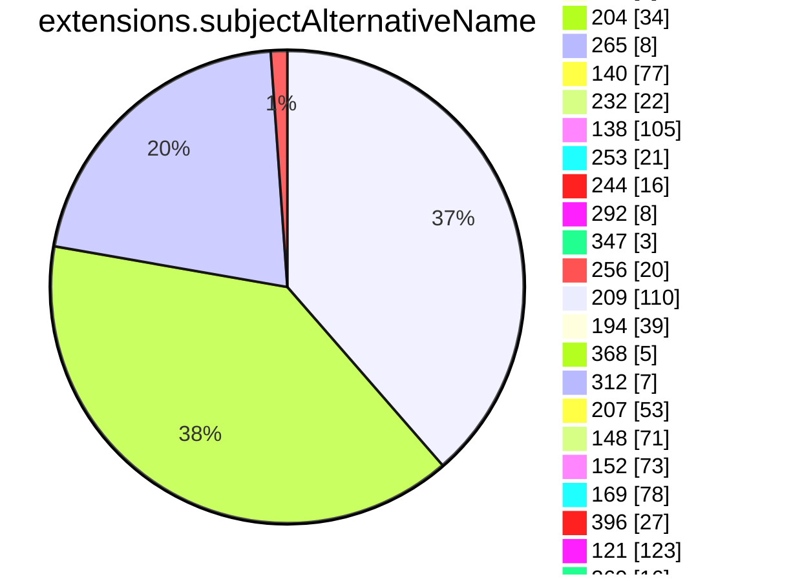

```mermaid
pie showData
title issuer
"Google UK Ltd." :35680
"Cisco Systems" :414
"行政院" :3
"KPN B.V." :1
"Actalis S.p.A.-03358520967" :1
"A-Trust Ges. f. Sicherheitssysteme im elektr. Datenverkehr GmbH" :6
"AC Camerfirma S.A." :2
"行政院" :14
"VeriSign, Inc." :5
"Baltimore" :4
"VeriSign, Inc." :11
"Microsoft Corporation" :1
"ICP-Brasil" :3
"VeriSign, Inc." :2
"FNMT-RCM" :1
"VeriSign, Inc." :2
"A-Trust Ges. f. Sicherheitssysteme im elektr. Datenverkehr GmbH" :4
"thawte, Inc." :1
"Colegio de Registradores de la Propiedad y Mercantiles de España" :2
"行政院" :1
"DigiCert Inc" :3
"AC CAMERFIRMA S.A." :2
"Hellenic Academic and Research Institutions Cert. Authority" :3
"Republika Slovenija" :2
"E-Tuğra EBG Bilişim Teknolojileri ve Hizmetleri A.Ş." :5
"Elektronik Bilgi Guvenligi A.S." :2
"GeoTrust Inc." :2
"MULTICERT - Serviços de Certificação Electrónica S.A." :1
"Hellenic Academic and Research Institutions Cert. Authority" :15
"Atos" :2
"QuoVadis Limited" :2
"POSTA" :2
"Secretaria de Economia" :1
"TÜRKTRUST Bilgi İletişim ve Bilişim Güvenliği Hizmetleri A.Ş." :1
"Elektronik Bilgi Guvenligi A.S." :1
"LAWtrust" :2
"AC Camerfirma SA" :1
"SwissSign AG" :1
"British Telecommunications plc" :5
"Google UK Ltd." :94320
"Certinomis" :1
"HydrantID (Avalanche Cloud Corporation)" :1
"QuoVadis Limited" :2
"GlobalSign" :1
"Institute for Development and Research in Banking Technology" :42
"U.S. Government" :4
"Symantec Corporation" :3
"GlobalSign nv-sa" :3
"WoSign CA Limited" :1
"Apple Inc." :6
"VeriSign, Inc." :1
"Japanese Government" :1
"Unizeto Technologies S.A." :1
"ANF Autoridad de Certificacion" :1
"SwissSign AG" :1
"Foundation for Trusted Identity" :1
"Hongkong Post" :3
"Vaestorekisterikeskus CA" :2
"QuoVadis Limited" :3
"certSIGN" :2
"U.S. Government" :1
"DigiCert Inc" :2
"e-commerce monitoring GmbH" :4
"ICP-Brasil" :3
"DigiCert Inc" :2
"MINISTERE INTERIEUR" :1
"DigiCert Inc" :1
"Government Root Certification Authority" :1
"Open Access Technology International Inc" :1
"Apple Inc." :1
"SECOM Trust Systems CO.,LTD." :2
"E-Tuğra EBG Bilişim Teknolojileri ve Hizmetleri A.Ş." :10
"Elektronik Bilgi Guvenligi A.S." :1
"行政院" :1
"ICP-Brasil" :1
"TÜRKTRUST Bilgi İletişim ve Bilişim Güvenliği Hizmetleri A.Ş." :1
"VeriSign, Inc." :2
"Orion Health Inc." :2
"DigiCert Inc" :1
"ACNLB" :1
"QuoVadis Limited" :9580
"Apple Inc." :1
"The USERTRUST Network" :1
"GlobalSign nv-sa" :2
"GAD EG" :2
"SAFE Identity" :1
"GlobalSign nv-sa" :1
"VeriSign, Inc." :1
"NISZ Nemzeti Infokommunikációs Szolgáltató Zrt." :1
"QuoVadis Limited" :3
"SECOM Trust.net" :1
"TSCP Inc." :1
"Actalis S.p.A." :1
"Turkiye Bilimsel ve Teknolojik Arastirma Kurumu - TUBITAK" :1
"SwissSign AG" :3
"Verizon Business" :1
"ICP-Brasil" :1
"Symantec Corporation" :1
"Apple Inc." :3
"Sectigo Limited" :1
"SAFE-Biopharma" :1
"SwissSign AG" :2
"Apple Inc." :1
"Trustwave Holdings, Inc." :1
"GlobalSign nv-sa" :202213
"GlobalSign nv-sa" :290824
"GlobalSign nv-sa" :119762
"GlobalSign nv-sa" :10969
"GlobalSign nv-sa" :13698
"GlobalSign nv-sa" :139843
"GlobalSign nv-sa" :1941
"Česká pošta, s.p." :671
"Rede Nacional de Ensino e Pesquisa - RNP" :6773
"GlobalSign nv-sa" :100
"VALID CERTIFICADORA DIGITAL" :166
"SOLUTI - SOLUCOES EM NEGOCIOS INTELIGENTES S-A" :20
"ATT Services Inc" :2535
"Sectigo Limited" :9266458
"DigiCert Inc" :154707
"DigiCert Inc" :1137928
"SSL Corporation" :46090
"Government of Korea" :641
"DigiCert Inc" :5496
"Internet2" :371848
"DigiCert Inc" :287180
"Network Solutions L.L.C." :91590
"DigiCert Inc" :90638
"DigiCert Inc" :124399
"The USERTRUST Network" :50596
"Sectigo Limited" :687914
"SecureCore" :22652
"SECOM Trust Systems CO.,LTD." :20371
"GoGetSSL" :94678
"DigiCert Inc" :66293
"DigiCert Inc" :9628
"SECOM Trust Systems CO.,LTD." :16878
"DigiCert Inc" :5737
"DigiCert Inc" :24876
"Sectigo Limited" :45135
"FUJIFILM" :153
"DigiCert Inc" :217
"DigiCert Inc" :10398671
"UniTrust" :987
"DigiCert Inc" :414
"Trust Provider B.V." :13220
"The Trustico Group Ltd" :10486
"DigiCert Inc" :8070188
"DigiCert Inc" :64595
"DigiCert Inc" :2263
"GlobalSign nv-sa" :1216
"TAIWAN-CA" :28716
"SecureCore" :1012
"DigiCert Inc" :38621
"Technische Universitaet Dresden" :562
"TrustAsia Technologies, Inc." :728
"DigiCert Inc" :1601
"Aetna Inc" :8051
"Entrust, Inc." :305875
"COMODO CA Limited" :259760
"Verein zur Foerderung eines Deutschen Forschungsnetzes e. V." :38333
"DigiCert Inc" :9118
"DigiCert Inc" :9494
"Soluciones Corporativas IP, SL" :33191
"EUNETIC GmbH" :6599
"Fraunhofer" :3815
"DigiCert Inc" :124
"Sectigo Limited" :570
"Alpiro s.r.o." :10106
"DigiCert Inc" :1411
"GoDaddy.com, Inc." :23071
"DigiCert Inc" :196
"DigiCert Inc" :1651
"Technische Universitaet Ilmenau" :181
"DigiCert Inc" :6412
"Network Solutions L.L.C." :25007
"Karlsruhe Institute of Technology" :882
"DigiCert Inc" :4595
"Gandi" :500890
"TBS INTERNET" :4514
"Siemens" :1
"Corporation Service Company" :37680
"EUNETIC GmbH" :146
"Max-Planck-Gesellschaft" :1366
"Nijimo K.K." :930
"DigiCert Inc" :29066
"Sectigo Limited" :10009
"Sectigo Limited" :4102631
"DigiCert Inc" :18147
"The USERTRUST Network" :1903
"Internet2" :10880
"DigiCert Inc" :642
"COMODO CA Limited" :5185
"GoGetSSL" :240
"DigiCert Inc" :13835
"Trustwave Holdings, Inc." :6425
"Wells Fargo & Company" :2557
"Government of the District of Columbia" :276
"DigiCert Inc" :280
"DigiCert Inc" :4217
"K Software" :426
"SecureCore" :76
"WoTrus CA Limited" :9335
"TrustAsia Technologies, Inc." :302291
"Apple Inc." :1542
"Cybertrust Japan Co., Ltd." :14568
"BitCert" :250
"CrowdStrike Inc." :30
"Cybertrust Japan Co., Ltd." :6407
"TAIWAN-CA" :153
"SSL Corp" :100
"GoGetSSL" :938
"DigiCert Inc" :181439
"DigiCert Inc" :725
"Entrust, Inc." :30077
"Deutscher Bundestag" :64
"CentralNic Luxembourg Sàrl" :8672
"IZENPE S.A." :449
"DigiCert Inc" :958
"Chunghwa Telecom Co., Ltd." :1918
"SECOM Trust Systems CO.,LTD." :7508
"Unizeto Technologies S.A." :100527
"Beijing Xinchacha Credit Management Co., Ltd." :1510
"The Trustico Group Ltd" :126
"WoTrus CA Limited" :389
"Beijing Xinchacha Credit Management Co., Ltd." :3184
"Corporation Service Company" :144
"MarketWare - Soluções para Mercados Digitais, Lda." :352
"United SSL Deutschland GmbH" :617
"VALID CERTIFICADORA DIGITAL" :30
"CERTDATA SERVICOS DE INFORMACAO LTDA" :62
"Open Access Technology International Inc" :1029
"Apple Inc." :1546
"The Trustico Group Ltd" :112
"Internet2" :5611
"Network Solutions L.L.C." :786
"Amazon" :22322968
"WoTrus CA Limited" :1844
"Disig a.s." :244
"IZENPE S.A." :219
"DHIMYOTIS" :3360
"Aristotle University of Thessaloniki" :447
"Buypass AS-983163327" :3135
"GEANT Vereniging" :4430
"GlobalSign nv-sa" :75
"Aetna Inc" :54
"SOLUTI - SOLUCOES EM NEGOCIOS INTELIGENTES S-A" :69
"Sectigo (Europe) SL" :4
"Fresenius Kabi AG" :70
"GoGetSSL" :6
"Apple Inc." :880
"Trustwave Holdings, Inc." :93
"Apple Inc." :1051
"Nijimo K.K." :198
"TrustAsia Technologies, Inc." :2696
"OpenTrust" :1
"SwissSign AG" :1
"SwissSign AG" :1
"SwissSign AG" :1
"GeoTrust Inc." :1
"Certinomis" :4
"GeoTrust Inc." :1
"SwissSign AG" :1
"Certinomis" :1
"DigiCert Inc" :197
"Inera AB" :6
"VI Registru centras - i.k. 124110246" :1
"Agence Nationale des Titres Sécurisés" :2
"China Financial Certification Authority" :272
"CERTSIGN SA" :4
"China Financial Certification Authority" :1
"China Financial Certification Authority" :1599
"Netflix, Inc." :1
"CERTSIGN SA" :1
"CERTSIGN SA" :1
"Vaestorekisterikeskus CA" :5
"Krajowa Izba Rozliczeniowa S.A." :335
"E-Tuğra EBG Bilişim Teknolojileri ve Hizmetleri A.Ş." :1
"Vaestorekisterikeskus CA" :2
"Krajowa Izba Rozliczeniowa S.A." :1
"E-Tuğra EBG Bilişim Teknolojileri ve Hizmetleri A.Ş." :1378
"E-Tuğra EBG Bilişim Teknolojileri ve Hizmetleri A.Ş." :29
"Isimtescil Bilisim Anonim Sirketi" :3562
"Vaestorekisterikeskus CA" :2
"Vaestorekisterikeskus CA" :2
"Isimtescil Bilisim Anonim Sirketi" :1
"Krajowa Izba Rozliczeniowa S.A." :1
"COMODO CA Limited" :5408
"Actalis S.p.A." :561906
"RU-Center (ЗАО Региональный Сетевой Информационный Центр)" :316
"QuoVadis Limited" :25543
"联通智慧安全科技有限公司" :29
"WoTrus CA Limited" :30
"Starfield Technologies, Inc." :2701
"QuoVadis Trustlink B.V." :4021
"Buypass AS-983163327" :837
"TeliaSonera" :4821
"CERTDATA SERVICOS DE INFORMACAO LTDA" :98
"MarketWare - Soluções para Mercados Digitais, Lda." :272
"Shanghai Ping An Credit Reference Company Limited" :9
"HydrantID (Avalanche Cloud Corporation)" :1829
"VTB BANK (PJSC)" :111
"sslTrus" :290
"Government of Korea" :37
"sslTrus" :1228
"DigiCert Inc" :125
"GlobalSign nv-sa" :914
"DigiCert Inc" :7326
"Site Blindado S.A." :502
"KICA" :4
"IdenTrust" :1150574
"Entrust, Inc." :1707
"IdenTrust" :2303
"DigiCert Inc" :42
"Corporation Service Company" :4957
"Actalis S.p.A." :4981
"SECOM Trust Systems CO.,LTD." :334
"DigiCert Inc" :36
"Hongkong Post" :1397
"SSL.com" :188
"TrustSign Certificadora Dig. & Soluções Segurança da Inf. Ltda." :1169
"Apple Inc." :140
"Apple Inc." :382
"UniTrust" :1
"Intesa Sanpaolo S.p.A." :1
"InfoCert S.p.A." :1
"InfoCert S.p.A." :1
"Open Access Technology International Inc" :8
"QuoVadis Limited" :1
"QuoVadis Limited" :1
"Turkiye Bilimsel ve Teknolojik Arastirma Kurumu - TUBITAK" :87
"QuoVadis Limited" :1
"SwissSign AG" :16480
"NAVER BUSINESS PLATFORM Corp." :1
"HydrantID (Avalanche Cloud Corporation)" :1
"SwissSign AG" :8408
"ZETES SA (VATBE-0408425626)" :2
"TAIWAN-CA" :1
"TAIWAN-CA" :1
"SwissSign AG" :5477
"Japan Certification Services, Inc." :1
"UniTrust" :1
"Beijing Xinchacha Credit Management Co., Ltd." :45
"Baidu, Inc." :944
"QuoVadis Trustlink B.V." :2307
"Turing Crypto GmbH" :176
"Entrust, Inc." :389
"SwissSign AG" :1
"Certinomis" :1
"Certinomis" :1
"Siemens" :1
"Vaestorekisterikeskus CA" :2
"certSIGN" :1
"certSIGN" :1
"Abitab S.A." :1
"GAD EG" :1
"Capricorn Identity Services Pvt Ltd." :1
"Disig a.s." :2
"Alpiro s.r.o." :62
"DigiCert Inc" :126
"SECOM Trust Systems CO.,LTD." :795
"DigiCert Inc" :281
"WoTrus CA Limited" :39
"Turing Crypto GmbH" :4
"WoTrus CA Limited" :4
"Sectigo Limited" :573
"Telia Finland Oyj" :2349
"Trustwave Holdings, Inc." :321
"sslTrus (上海锐成信息科技有限公司)" :22
"TI Trust Technologies S.R.L." :1862
"SOLUTI - SOLUCOES EM NEGOCIOS INTELIGENTES S-A" :30
"VALID CERTIFICADORA DIGITAL" :18
"EUNETIC GmbH" :12
"GoGetSSL" :190
"Trust Provider B.V." :635
"Hellenic Academic and Research Institutions CA" :177
"Deutsche Telekom Security GmbH" :1
"MarketWare - Soluções para Mercados Digitais, Lda." :130
"Sectigo Limited" :36
"Hao Quang Viet Software Company Limited" :168
"GlobalSign nv-sa" :50
"Digi- ja vaestotietovirasto CA" :888
"GlobalSign nv-sa" :7
"Digi- ja vaestotietovirasto CA" :658
"COMODO CA Limited" :1112
"DHIMYOTIS" :1422
"TBS INTERNET" :64
"DigiCert Inc" :90
"UniTrust" :115
"WoTrus CA Limited" :9
"DigiCert Inc" :15
"SECOM Trust Systems CO.,LTD." :44
"Microsec Ltd." :4
"Nijimo K.K." :208
"eMudhra Technologies Limited" :2836
"DigiCert Inc" :95
"DigiCert Inc" :60
"Gandi" :570
"Baidu, Inc." :106
"ITSO LTD" :61
"Domain The Net Technologies Ltd" :559
"D-Trust GmbH" :5468
"DigiCert Inc" :219
"One Sign Pte. Ltd." :396
"DigiCert Inc" :831
"Microsoft Corporation" :772633
"Microsoft Corporation" :772845
"Ziwit" :158
"Staat der Nederlanden" :4
"T-Systems International GmbH" :9045
"DigiCert Inc" :46
"Shanghai Ping An Credit Reference Company Limited" :5
"HydrantID (Avalanche Cloud Corporation)" :345
"DigiCert Inc" :19
"DigiCert Inc" :12
"Ziwit" :10
"DigiCert Inc" :96856
"DigiCert Inc" :34
"Japan Registry Services Co., Ltd." :58967
"Cisco Systems, Inc." :226661
"Cloudflare, Inc." :10916751
"Cloudflare, Inc." :30915010
"nazwa.pl sp. z o.o." :165072
"GEANT Vereniging" :300456
"cPanel, Inc." :106581
"DigiCert Inc" :25323
"ZeroSSL" :39386
"TrustCor Systems S. de R.L." :13404
"Japan Registry Services Co., Ltd." :1405
"Root Networks, LLC" :10615
"home.pl S.A." :49259
"LH.pl Sp. z o.o." :5095
"Unizeto Technologies S.A." :1998
"Genious Communications" :2506
"DOMENY.PL sp. z o.o" :8984
"swissns GmbH" :166
"iTrusChina Co., Ltd." :1306
"Dreamcommerce S.A." :11196
"McAfee, Inc." :1208
"GEANT Vereniging" :9736
"Hellenic Academic and Research Institutions Cert. Authority" :272
"行政院" :7784
"WISeKey" :892
"T-Systems International GmbH" :1318
"WebSpace-Forum e.K." :8
"Unizeto Technologies S.A." :836
"Entrust Datacard Europe S.L." :89
"FNMT-RCM" :798
"Atos" :1192
"TI Trust Technologies S.R.L." :434
"První certifikační autorita, a.s." :33
"Firmaprofesional S.A." :956
"Financijska agencija" :243
"D-Trust GmbH" :697
"Hellenic Academic and Research Institutions Cert. Authority" :34
"E-SAFER CONSULTORIA EM TECNOLOGIA DA INFORMACAO LTDA" :270
"Ziwit" :14
"cPanel, Inc." :126
"DNEncrypt, Inc" :252
"SECOM Trust Systems CO.,LTD." :1365
"SECOM Trust Systems CO.,LTD." :254
"TrustAsia Technologies, Inc." :2110
"CerSign Technology Limited" :130
"Global Digital Cybersecurity Authority Co., Ltd." :300
"DigiCert Inc" :166
"Deutsche Post AG" :2011
"Global Digital Cybersecurity Authority Co., Ltd." :135
"Global Digital Cybersecurity Authority Co., Ltd." :12
"GEANT Vereniging" :5117
"Abitab S.A." :113
"Quantum CA Limited" :120
"QuoVadis Trustlink B.V." :1049
"DOMENY.PL sp. z o.o" :288
"cPanel, Inc." :46
"Hellenic Academic and Research Institutions CA" :23
"Digital Trust L.L.C." :486
"Hellenic Academic and Research Institutions CA" :254
"Quantum CA Limited" :6
"IdenTrust" :57
"WidePoint" :15
"Quantum CA Limited" :8
"Sectigo Limited" :1258
"Apple Inc." :6
"T-Systems International GmbH" :181
"Comodo Japan, Inc." :1042
"sslTrus" :10
"iTrusChina Co., Ltd." :106
"Staclar, Inc." :61
"FNMT-RCM" :597
"Abitab S.A." :145
"Sectigo Limited" :284
"Microsoft Corporation" :1231294
"Microsoft Corporation" :1208711
"Anson Network Limited" :31
"Deutsche Kreditbank AG" :206
"Nyatwork Communication Ltd" :203
"Sectigo (Europe) SL" :32
"DigiCert Inc" :65
"Netflix, Inc." :1
"Baidu, Inc." :10
"AffirmTrust" :54
"Alpiro s.r.o." :26
"sslTrus" :2
"Shenzhen Digital Certificate Authority Center Co., Ltd" :55
"TrustOcean Limited" :2
"Vaestorekisterikeskus CA" :4
"GEANT Vereniging" :67
"Kingnet Information Technology Co., Ltd." :21
"DigiCert Inc" :18
"VISA" :26
"Actalis S.p.A." :564
"DigiCert Inc" :39
"Hellenic Academic and Research Institutions CA" :68
"Hellenic Academic and Research Institutions CA" :22
"Hellenic Academic and Research Institutions CA" :21
"Hellenic Academic and Research Institutions CA" :6
"D-Trust GmbH" :91
"KICA" :38
"TrustSign Certificadora Dig. & Soluções Segurança da Inf. Ltda." :12
"CertCloud Pte. Ltd." :172
"eMudhra Technologies Limited" :102
"První certifikační autorita, a.s." :169
"Alpiro s.r.o." :52
"TRUSTCUBES LIMITED" :14
"GlobalSign nv-sa" :5897
"Shenzhen Digital Certificate Authority Center Co., Ltd" :24
"GlobalSign nv-sa" :2844
"CentralNic Luxembourg Sàrl" :16
"DigiCert Inc" :14
"GlobalSign nv-sa" :117
"COMODO CA Limited" :6
"CERTDATA SERVICOS DE INFORMACAO LTDA" :22
"E-SAFER CONSULTORIA EM TECNOLOGIA DA INFORMACAO LTDA" :54
"ZeroSSL" :36
"TrustAsia Technologies, Inc." :30
"Greek Universities Network (GUnet)" :7
"STCS" :1
"Sistema Nacional de Certificacion Electronica" :1
"Alibaba Cloud Computing Co., Ltd." :4
"A-Trust Ges. f. Sicherheitssysteme im elektr. Datenverkehr GmbH" :30
"NetLock Kft." :34
"Telia Finland Oyj" :1
"Telia Finland Oyj" :1
"Apple Inc." :28
"CerSign Technology Limited" :2
"Microsoft Corporation" :1990374
"Microsoft Corporation" :2035316
"FNMT-RCM" :107
"TrustAsia Technologies, Inc." :17718
"TrustAsia Technologies, Inc." :1184745
"Quantum CA Limited" :35
"Pardazeshgaran Shahr Hooshmand Yekta Co." :25
"Hellenic Academic and Research Institutions Cert. Authority" :9
"DigiCert, Inc." :59
"Hellenic Academic and Research Institutions CA" :39
"certSIGN" :1
"certSIGN" :1
"certSIGN" :928
"certSIGN" :3
"DigiCert, Inc." :6
"ZoTrus Technology Limited" :100
"DigiCert Inc" :1
"WebSpace-Forum e.K." :6
"Alibaba Cloud Computing Co., Ltd." :2
"Digi-Sign Limited" :70
"DigiCert, Inc." :1
"COMODO CA Limited" :10
"WISeKey" :1
"WISeKey" :1
"WISeKey" :1
"Hellenic Academic and Research Institutions CA" :17
"{'c': 'BE', 'cn': 'Citizen CA', 'serialnumber': '201605'}" :1
"{'c': 'BE', 'cn': 'Citizen CA', 'serialnumber': '201507'}" :1
"{'c': 'BE', 'cn': 'Citizen CA', 'serialnumber': '201505'}" :1
"{'c': 'BE', 'cn': 'Citizen CA', 'serialnumber': '201508'}" :1
"{'c': 'BE', 'cn': 'Citizen CA', 'serialnumber': '201622'}" :1
"{'c': 'BE', 'cn': 'Citizen CA', 'serialnumber': '201503'}" :1
"{'c': 'BE', 'cn': 'Citizen CA', 'serialnumber': '201601'}" :1
"{'c': 'BE', 'cn': 'Citizen CA', 'serialnumber': '201625'}" :1
"http:--repository.eid.belgium.be-" :1
"http:--repository.eid.belgium.be-" :1
"{'c': 'BE', 'cn': 'Citizen CA', 'serialnumber': '201406'}" :1
"{'c': 'BE', 'cn': 'Citizen CA', 'serialnumber': '201501'}" :1
"{'c': 'BE', 'cn': 'Citizen CA', 'serialnumber': '201409'}" :1
"http:--repository.eid.belgium.be-" :1
"http:--repository.eid.belgium.be-" :1
"{'c': 'BE', 'cn': 'Citizen CA', 'serialnumber': '201624'}" :1
"{'c': 'BE', 'cn': 'Citizen CA', 'serialnumber': '201512'}" :1
"{'c': 'BE', 'cn': 'Citizen CA', 'serialnumber': '201511'}" :1
"{'c': 'BE', 'cn': 'Citizen CA', 'serialnumber': '201627'}" :1
"{'c': 'BE', 'cn': 'Citizen CA', 'serialnumber': '201623'}" :1
"{'c': 'BE', 'cn': 'Citizen CA', 'serialnumber': '201606'}" :1
"{'c': 'BE', 'cn': 'Citizen CA', 'serialnumber': '201404'}" :1
"{'c': 'BE', 'cn': 'Citizen CA', 'serialnumber': '201510'}" :1
"http:--repository.eid.belgium.be-" :1
"http:--repository.eid.belgium.be-" :1
"{'c': 'BE', 'cn': 'Citizen CA', 'serialnumber': '201509'}" :1
"{'c': 'BE', 'cn': 'Citizen CA', 'serialnumber': '201609'}" :1
"{'c': 'BE', 'cn': 'Citizen CA', 'serialnumber': '201403'}" :1
"{'c': 'BE', 'cn': 'Citizen CA', 'serialnumber': '201628'}" :1
"http:--repository.eid.belgium.be-" :1
"{'c': 'BE', 'cn': 'Citizen CA', 'serialnumber': '201626'}" :1
"http:--repository.eid.belgium.be-" :1
"{'c': 'BE', 'cn': 'Citizen CA', 'serialnumber': '201602'}" :1
"{'c': 'BE', 'cn': 'Citizen CA', 'serialnumber': '201632'}" :1
"{'c': 'BE', 'cn': 'Citizen CA', 'serialnumber': '201506'}" :1
"http:--repository.eid.belgium.be-" :1
"{'c': 'BE', 'cn': 'Citizen CA', 'serialnumber': '201610'}" :1
"{'c': 'BE', 'cn': 'Foreigner CA', 'serialnumber': '201608'}" :1
"{'c': 'BE', 'cn': 'Foreigner CA', 'serialnumber': '201606'}" :1
"{'c': 'BE', 'cn': 'Citizen CA', 'serialnumber': '201604'}" :1
"{'c': 'BE', 'cn': 'Citizen CA', 'serialnumber': '201608'}" :1
"TERENA" :2
"e-commerce monitoring GmbH" :22
"The Trustico Group Ltd" :10
"{'c': 'BE', 'cn': 'Belgium Root CA4'}" :1
"{'c': 'BE', 'cn': 'Citizen CA', 'serialnumber': '201603'}" :1
"http:--repository.eid.belgium.be-" :1
"{'c': 'BE', 'cn': 'Citizen CA', 'serialnumber': '201629'}" :1
"{'c': 'BE', 'cn': 'Citizen CA', 'serialnumber': '201405'}" :1
"{'c': 'BE', 'cn': 'Citizen CA', 'serialnumber': '201634'}" :1
"{'c': 'BE', 'cn': 'Citizen CA', 'serialnumber': '201504'}" :1
"http:--repository.eid.belgium.be-" :1
"{'c': 'BE', 'cn': 'Citizen CA', 'serialnumber': '201410'}" :1
"{'c': 'BE', 'cn': 'Citizen CA', 'serialnumber': '201502'}" :1
"{'c': 'BE', 'cn': 'Citizen CA', 'serialnumber': '201408'}" :1
"{'c': 'BE', 'cn': 'Citizen CA', 'serialnumber': '201633'}" :1
"{'c': 'BE', 'cn': 'Citizen CA', 'serialnumber': '201631'}" :1
"{'c': 'BE', 'cn': 'Citizen CA', 'serialnumber': '201621'}" :1
"TrustAsia Technologies, Inc." :769
"Digi- ja vaestotietovirasto CA" :14
"{'c': 'BE', 'cn': 'Citizen CA', 'serialnumber': '201607'}" :1
"{'c': 'BE', 'cn': 'Citizen CA', 'serialnumber': '201407'}" :1
"{'c': 'BE', 'cn': 'Citizen CA', 'serialnumber': '201630'}" :1
"GlobalSign nv-sa" :1
"TrustAsia Technologies, Inc." :46
"Hellenic Academic and Research Institutions CA" :3
"QuoVadis Limited" :36
"Digital Trust L.L.C." :34
"DOMENY.PL sp. z o.o" :10
"TrustAsia Technologies, Inc." :7
"GlobalSign nv-sa" :437
"Amazon" :44
"3CX" :10
"GlobalSign nv-sa" :25
"GlobalSign nv-sa" :6
"DigiCert Inc" :328
"DigiCert Inc" :18
"ZoTrus Technology Limited" :8
"Hellenic Academic and Research Institutions CA" :7
"Gehirn Inc." :4
"ICP-Brasil" :2
"Hellenic Academic and Research Institutions CA" :1
"Hellenic Academic and Research Institutions CA" :1
"Siemens" :2
"SSL Corp" :7
"eMudhra Technologies Limited" :11
"DigiCert, Inc." :2
"DigiCert, Inc" :5
"DigiCert, Inc" :4
"DigiCert, Inc." :2
"DigiCert, Inc" :2
"DigiCert, Inc." :2
"DigiCert, Inc." :6
"Microsoft Corporation" :32
"Hongkong Post" :3
"DigiCert Inc" :18
"Public Key Infrastructure Ltd" :7
"DigiCert, Inc." :1
"NETLOCK Kft." :21
"DigiCert Inc" :2
"Globalsign nv-sa" :550
"HydrantID (Avalanche Cloud Corporation)" :1
"Site Blindado S.A." :4
"TrustAsia Technologies, Inc." :10
"Microsoft Corporation" :43
"Microsoft Corporation" :42
"TrustCor Systems S. de R.L." :6
"ACCV" :54
"NetLock Kft." :20
"Abitab S.A." :12
"Entrust Datacard Deutschland GmbH" :3
"Hao Quang Viet Software Company Limited" :2
"DigiCert, Inc" :5
"Agenzia per l'Italia Digitale" :33
"EDICOM CAPITAL SL" :21
"Fuji Xerox" :116
"Apple Inc." :88
"Hellenic Academic and Research Institutions CA" :2
"Hellenic Academic and Research Institutions CA" :2
"TrustAsia Technologies, Inc." :6
"VI Registru centras- i.k. 124110246" :1
"DocuSign France" :1
"e-commerce monitoring GmbH" :1
"e-commerce monitoring GmbH" :1
"Firmaprofesional S.A." :1
"{'c': 'ES', 'cn': 'Autoridad de Certificacion Firmaprofesional CIF A62634068'}" :1
"Firmaprofesional S.A. NIF A-62634068" :1
"Hellenic Academic and Research Institutions CA" :2
"Hellenic Academic and Research Institutions Cert. Authority" :2
"ARGE DATEN - Austrian Society for Data Protection" :1
"Hellenic Academic and Research Institutions Cert. Authority" :2
"Hellenic Academic and Research Institutions CA" :2
"Avalanche Cloud Corporation" :26
"Microsoft Corporation" :35
"DigiCert Inc" :10
"JoySSL Limited" :460
"CONSEJO GENERAL DE LA ABOGACIA" :1
"Consejo General de la Abogacia" :1
"Consejo General de la Abogacia" :1
"COMODO CA Limited" :2
"DigiCert Inc" :6
"Kingnet Information Technology Co., Ltd." :10
"eMudhra Technologies Limited" :2
"DigiCert Inc" :381
"CrowdStrike, Inc." :76
"ZETES SA (VATBE-0408425626)" :1
"ICP-Brasil" :633
"DigiCert, Inc." :4
"DigiCert, Inc." :2
"DigiCert, Inc." :4
"DigiCert, Inc." :6
"Hellenic Academic and Research Institutions CA" :8
"E-TUGRA EBG BILISIM TEKNOLOJILERI VE HIZMETLERI ANONIM SIRKETI" :1813
"AffirmTrust" :4
"VALID CERTIFICADORA DIGITAL" :3
"UniTrust" :4
"WoTrus CA Limited" :20
"DigiCert, Inc." :4
"Gehirn Inc." :52
"GlobalSign nv-sa" :2
"Entrust, Inc." :2
"Nijimo K.K." :4
"PSW GROUP GmbH & Co. KG" :2
"AC Camerfirma S.A." :1
"AC CAMERFIRMA S.A." :1
"GoGetSSL" :2
"AC CAMERFIRMA S.A." :1
"Deutsche Telekom Security GmbH" :988
"Isimtescil Bilisim A.S." :4574
"AC CAMERFIRMA S.A." :1
"Verokey" :2
"DigiCert, Inc." :5
"AC CAMERFIRMA S.A." :1
"AC CAMERFIRMA S.A." :1
"Global Digital Inc." :50
"Firmaprofesional S.A." :10
"E-TUGRA EBG BILISIM TEKNOLOJILERI VE HIZMETLERI ANONIM SIRKETI" :8
"MULTICERT - Serviços de Certificação Electrónica S.A." :1
"CerSign Technology Limited" :2
"TrustAsia Technologies, Inc." :2
"Agencia Notarial de Certificacion S.L.U. - CIF B83395988" :1
"Agencia Notarial de Certificacion S.L.U. - CIF B83395988" :1
"Agencia Notarial de Certificacion S.L.U. - CIF B83395988" :1
"Agencia Notarial de Certificacion S.L.U. - CIF B83395988" :1
"Agencia Notarial de Certificacion S.L.U. - CIF B83395988" :1
"Agencia Notarial de Certificacion S.L.U. - CIF B83395988" :1
"D-Trust GmbH" :17
"Gehirn Inc." :4
"eMudhra Technologies Limited" :20
"Isimtescil Bilisim A.S." :1
"DigiCert, Inc." :9
"Digital Trust L.L.C." :2
"SECOM Trust Systems CO.,LTD." :2
"National Infrastructures for Research and Technology" :1
"Genious Communications" :4
"DigiCert, Inc." :7
"Hellenic Academic and Research Institutions CA" :1
"Hellenic Academic and Research Institutions CA" :1
"Hellenic Academic and Research Institutions CA" :1
"e-commerce monitoring GmbH" :4
"Hellenic Academic and Research Institutions CA" :1
"Hellenic Academic and Research Institutions CA" :11
"Deutsche Telekom Security GmbH" :1
"SSL.com" :4
"ZoTrus Technology Limited" :2
"SafeToOpen Ltd" :2
"Digital Trust L.L.C." :22
"Globalsign nv-sa" :2953
"GlobalSign nv-sa" :8005
"AffirmTrust" :2
"GlobalSign nv-sa" :2576
"GlobalSign nv-sa" :120
"GlobalSign nv-sa" :316
"DigiCert, Inc." :2
"DNEncrypt, Inc" :2
"Microsoft Corporation" :1651
"ICP-Brasil" :88
"e-commerce monitoring GmbH" :8
"Telecom Italia Trust Technologies S.R.L." :2
"DNSPod, Inc." :944
"DNSPod, Inc." :10
"Microsoft Corporation" :255
"ZoTrus Technology Limited" :4
"Network Solutions L.L.C." :2
"BitCert" :2
"GEANT Vereniging" :8
"Globalsign nv-sa" :31
"Kingnet Information Technology Co., Ltd." :2
"DNSPod, Inc." :68
"TrustSign Certificadora Dig. & Soluções Segurança da Inf. Ltda." :56
"One Sign Pte. Ltd." :2
"NETLOCK Ltd." :1
"NETLOCK Ltd." :1
"TrustAsia Technologies, Inc." :14
"Prodrive Technologies B.V." :191
"DigiCert, Inc." :157893
"DigiCert, Inc." :246261
"e-commerce monitoring GmbH" :4
"Genious Communications" :2
"Quantum CA Limited" :1
"Gehirn Inc." :2
"Hellenic Academic and Research Institutions CA" :4
"Hellenic Academic and Research Institutions CA" :50
"Hellenic Academic and Research Institutions CA" :193
"Hellenic Academic and Research Institutions CA" :37
"The USERTRUST Network" :4
"The USERTRUST Network" :4
"Hellenic Academic and Research Institutions CA" :29
"联通智慧安全科技有限公司" :2
"DigiCert Inc" :1
"Verokey" :5
"Siemens" :2
"Trustwave Holdings, Inc." :2
"Trustwave Holdings, Inc." :2
"Pardazeshgaran Shahr Hooshmand Yekta Co." :5
"Chunghwa Telecom Co., Ltd." :2
"Verokey" :2
"Trustwave Holdings, Inc." :4
"Trustwave Holdings, Inc." :2
"Trustwave Holdings, Inc." :2
"cnWebTrust Inc" :2
"cnWebTrust Inc" :4
"北京中万网络科技有限责任公司" :16
"北京中万网络科技有限责任公司" :4
"DigiCert  Inc" :2
"COMODO CA Limited" :8898
"COMODO CA Limited" :7298
"UniTrust" :4
"TrustAsia Technologies, Inc." :2
"TK Elevator GmbH" :26
"TrustCor Systems S. de R.L." :3
"北京中万网络科技有限责任公司" :4
"Nijimo K.K." :2
"Corporation Service Company" :2
"Buypass AS-983163327" :1283
"SwissSign AG" :12
"SwissSign AG" :14
"SwissSign AG" :12
"E-TUGRA EBG BILISIM TEKNOLOJILERI VE HIZMETLERI ANONIM SIRKETI" :1
"Global Digital Cybersecurity Authority Co., Ltd." :69
"Global Digital Cybersecurity Authority Co., Ltd." :2
"GlobalSign nv-sa" :19455
"GlobalSign nv-sa" :1258
"Globalsign nv-sa" :3226
"GlobalSign nv-sa" :49
"GlobalSign nv-sa" :41
"Beijing Xinchacha Credit Management Co., Ltd." :599
"E-SAFER CONSULTORIA EM TECNOLOGIA DA INFORMACAO LTDA" :8
"TrustAsia Technologies, Inc." :6
"Unizeto Technologies S.A." :1
"Deutsche Telekom Security GmbH" :231
"Beijing Xinchacha Credit Management Co., Ltd." :246
"SSL Corp" :2
"Hellenic Academic and Research Institutions CA" :2
"IdenTrust" :2
"DigiCert, Inc." :2
"DNSPod, Inc." :2
"Entrust, Inc." :2
"Shanghai Electronic Certificate Authority Center Co., Ltd." :2
"Shanghai Electronic Certificate Authority Center Co., Ltd." :1
"DigiCert Inc" :1
"Deutsche Telekom Security GmbH" :9
"Deutsche Telekom Security GmbH" :10
"National Agency for Information and Communication Technologies" :2
"Network Solutions L.L.C." :4
"AffirmTrust" :2
"AffirmTrust" :2
"AffirmTrust" :2
"Entrust EU, S.L." :1
```





```mermaid
pie showData
title validity_range
"1531" :22
"1415" :29
"1537" :23
"1688" :9
"1569" :12
"1387" :29
"1398" :27
"1679" :6
"1653" :9
"1515" :25
"1536" :16
"1642" :7
"1361" :26
"1681" :11
"1552" :19
"1603" :10
"1436" :14
"1535" :24
"1599" :15
"1340" :36
"1508" :28
"1640" :6
"1341" :32
"1510" :19
"1482" :19
"1559" :19
"1604" :16
"1390" :38
"1418" :24
"1624" :13
"1363" :37
"1466" :28
"1641" :9
"1351" :20
"1377" :33
"1486" :26
"1675" :10
"1409" :27
"1555" :27
"1438" :18
"1373" :32
"1579" :20
"1551" :14
"1649" :15
"1561" :14
"1527" :20
"1608" :18
"1350" :39
"1470" :21
"1421" :21
"1665" :10
"1693" :8
"1481" :22
"1375" :30
"1475" :23
"1662" :12
"1549" :22
"1347" :33
"1632" :11
"1612" :13
"1468" :16
"1499" :21
"1613" :16
"1518" :20
"1652" :8
"1585" :22
"1403" :36
"1445" :33
"1580" :15
"1404" :31
"1491" :26
"1479" :21
"1426" :36
"1610" :13
"1451" :34
"1543" :22
"1472" :11
"1443" :27
"1525" :16
"1380" :21
"1505" :24
"1396" :33
"1392" :37
"1407" :48
"1637" :10
"1449" :25
"1672" :6
"1400" :35
"1595" :17
"1668" :9
"1462" :15
"1345" :22
"1501" :28
"1602" :19
"1379" :38
"1671" :6
"1522" :19
"1630" :10
"1597" :21
"1526" :16
"1682" :5
"1644" :13
"1439" :30
"1539" :20
"1437" :27
"1339" :43
"1384" :28
"1344" :32
"1583" :19
"1605" :9
"1678" :6
"1456" :21
"1382" :33
"1368" :40
"1488" :25
"1565" :20
"1467" :24
"1533" :23
"1623" :16
"1634" :11
"1621" :9
"1434" :34
"1622" :10
"1495" :26
"1493" :22
"1358" :33
"1554" :18
"1589" :19
"1517" :28
"1441" :21
"1459" :26
"1452" :27
"1516" :20
"1338" :28
"1324" :18
"1416" :34
"1425" :33
"1485" :18
"1424" :21
"1566" :13
"1376" :45
"1494" :20
"1370" :18
"1558" :18
"1670" :9
"1591" :16
"1687" :5
"1550" :11
"1598" :7
"1447" :27
"1611" :18
"1701" :10
"1378" :39
"1545" :24
"1329" :29
"1511" :21
"1620" :9
"1673" :11
"1626" :8
"1530" :20
"1354" :28
"1483" :28
"1369" :31
"1359" :33
"1601" :17
"1651" :9
"1658" :9
"1315" :42
"1423" :36
"1629" :13
"1600" :14
"1667" :10
"1532" :22
"1353" :29
"1356" :20
"1394" :35
"1509" :22
"1529" :17
"1406" :27
"1617" :16
"1563" :24
"1336" :37
"1572" :22
"1496" :18
"1557" :19
"1372" :36
"1417" :25
"1412" :21
"1680" :13
"1627" :16
"1541" :17
"1520" :28
"1457" :20
"1401" :26
"1386" :40
"1574" :13
"1571" :26
"1544" :14
"1663" :8
"1397" :26
"1448" :38
"1335" :25
"1556" :29
"1606" :16
"1460" :25
"1708" :11
"1710" :7
"1431" :32
"1450" :25
"1464" :28
"1584" :15
"1444" :24
"1413" :26
"1524" :17
"1440" :22
"1365" :29
"1385" :27
"1490" :31
"1453" :31
"1573" :12
"1690" :4
"1463" :23
"1586" :14
"1355" :41
"1664" :16
"1507" :23
"1500" :27
"1371" :36
"1694" :7
"1643" :12
"1540" :24
"1593" :17
"1521" :12
"1660" :14
"1405" :26
"1618" :18
"1648" :15
"1635" :13
"1320" :32
"1650" :12
"1362" :24
"1333" :33
"1348" :29
"1389" :34
"1528" :16
"1514" :21
"1388" :38
"1366" :35
"1446" :24
"1512" :18
"1322" :33
"1553" :18
"1307" :40
"1647" :10
"1669" :10
"1411" :31
"1469" :17
"1399" :28
"1433" :34
"1316" :29
"1326" :32
"1654" :15
"1587" :11
"1349" :32
"1562" :15
"1391" :30
"1568" :17
"1645" :11
"1364" :16
"1374" :33
"1498" :16
"1308" :30
"1633" :8
"1683" :10
"1625" :11
"1631" :4
"1432" :28
"1420" :28
"1478" :26
"1661" :10
"1564" :15
"1590" :15
"1567" :22
"1442" :18
"1636" :11
"1305" :36
"1503" :20
"1419" :27
"1489" :23
"1352" :24
"1422" :20
"1638" :9
"1480" :19
"1299" :19
"1454" :24
"1314" :27
"1334" :34
"1607" :14
"1455" :22
"1504" :32
"1476" :24
"1575" :18
"1570" :22
"1674" :8
"1519" :23
"1430" :25
"1477" :27
"1639" :12
"1578" :14
"1581" :12
"1691" :5
"1367" :18
"1304" :34
"1492" :22
"1317" :41
"1306" :37
"1615" :14
"1313" :35
"1395" :34
"1319" :36
"1465" :26
"1327" :33
"1594" :9
"1381" :31
"1300" :39
"1311" :22
"1310" :38
"1628" :9
"1357" :36
"1323" :35
"1393" :23
"1293" :28
"1321" :31
"1619" :11
"1523" :11
"1383" :40
"1546" :14
"1513" :17
"1295" :38
"1360" :26
"1473" :26
"1318" :24
"1548" :16
"1331" :43
"1474" :24
"1296" :24
"1506" :25
"1303" :31
"1281" :31
"1283" :28
"1282" :34
"1325" :34
"1471" :17
"1332" :28
"1289" :35
"1609" :12
"1290" :28
"1614" :13
"1410" :29
"1309" :39
"1458" :25
"1280" :30
"1487" :20
"1588" :12
"1429" :30
"1592" :16
"1346" :26
"1502" :21
"1279" :29
"1276" :30
"1428" :26
"1312" :42
"1298" :37
"1414" :37
"1402" :28
"1484" :19
"1284" :33
"1461" :26
"1343" :26
"1596" :13
"1272" :36
"1292" :32
"1538" :11
"1273" :31
"1274" :32
"1263" :24
"1285" :33
"1262" :39
"1269" :40
"1258" :45
"1254" :23
"1266" :27
"1275" :35
"1435" :27
"1267" :34
"1260" :31
"1582" :19
"1534" :16
"1330" :28
"1497" :22
"1251" :26
"1249" :41
"1238" :31
"1291" :32
"1257" :33
"1243" :39
"1297" :30
"1427" :23
"1576" :13
"1294" :27
"1268" :31
"1241" :42
"1577" :8
"1408" :18
"1256" :24
"1265" :39
"1286" :34
"1253" :28
"1337" :32
"1255" :36
"1270" :39
"1542" :21
"1247" :36
"1236" :23
"1224" :29
"1252" :34
"1277" :25
"1328" :24
"1226" :37
"1230" :33
"1248" :33
"1287" :27
"1264" :32
"1242" :33
"1240" :40
"1271" :35
"1231" :31
"1212" :33
"1560" :12
"1235" :26
"1217" :23
"1237" :32
"1219" :30
"1259" :41
"1227" :42
"1233" :29
"1342" :29
"1302" :25
"1250" :26
"1205" :43
"1223" :37
"1225" :33
"1213" :27
"1220" :28
"1229" :28
"1201" :31
"1196" :50
"1288" :36
"1214" :34
"1204" :38
"1216" :27
"1547" :12
"1198" :35
"1215" :27
"1261" :21
"1301" :23
"1278" :26
"1199" :46
"1208" :33
"1209" :37
"1176" :41
"1197" :36
"1195" :42
"1175" :33
"1188" :40
"1172" :44
"1232" :34
"1187" :32
"1192" :31
"1202" :39
"1207" :39
"1193" :35
"1185" :31
"1180" :44
"1181" :34
"1222" :31
"1162" :23
"1174" :32
"1194" :30
"1173" :36
"1171" :35
"1189" :34
"1210" :42
"1245" :28
"1183" :40
"1161" :33
"1160" :29
"1177" :29
"1167" :34
"1246" :27
"1206" :29
"1179" :36
"1170" :46
"1228" :25
"1190" :40
"1169" :40
"1153" :37
"1182" :30
"1145" :37
"1244" :32
"1178" :39
"1155" :30
"1154" :43
"1164" :36
"1147" :33
"1127" :41
"1136" :36
"1165" :38
"1218" :36
"1163" :30
"1191" :31
"1149" :32
"1148" :29
"1139" :34
"1134" :40
"1128" :28
"1239" :37
"1203" :29
"1141" :43
"1158" :31
"1137" :30
"1144" :33
"1146" :40
"1151" :36
"1143" :35
"1152" :25
"1131" :38
"1200" :33
"1138" :29
"1157" :43
"1123" :42
"1125" :44
"1117" :42
"1130" :32
"1156" :32
"1140" :33
"1186" :35
"1099" :40
"1133" :41
"1114" :46
"1118" :51
"1100" :34
"1105" :42
"1106" :46
"1122" :42
"1221" :32
"1119" :38
"1087" :42
"1097" :36
"1089" :44
"1142" :31
"1116" :35
"1132" :26
"1108" :47
"1095" :60
"1113" :45
"1135" :38
"1115" :40
"1126" :48
"1098" :32
"1094" :39
"1104" :35
"1120" :35
"1107" :42
"1076" :40
"1080" :46
"1084" :41
"1110" :36
"1078" :23
"1083" :33
"1069" :43
"1234" :29
"1166" :28
"1129" :43
"1061" :32
"1159" :45
"3652" :453
"1072" :37
"1079" :45
"1109" :34
"1086" :35
"1091" :34
"1073" :30
"1101" :43
"1121" :43
"1826" :20
"2734" :1
"1211" :31
"1063" :31
"3648" :5
"1059" :52
"1067" :37
"1103" :43
"1030" :38
"1124" :34
"1062" :40
"1045" :50
"1081" :27
"1092" :46
"1035" :56
"1065" :37
"1043" :38
"1111" :23
"1082" :36
"1053" :34
"3651" :26
"1090" :42
"1032" :38
"1071" :45
"1096" :55
"1066" :36
"1036" :33
"1047" :39
"1102" :34
"1034" :45
"1050" :46
"1041" :49
"1085" :34
"1074" :36
"1112" :38
"1027" :40
"1075" :42
"1052" :45
"1184" :38
"1058" :33
"1044" :40
"1093" :33
"1026" :45
"1020" :34
"1054" :45
"1033" :37
"1025" :43
"1014" :42
"1051" :34
"1021" :45
"1055" :38
"1022" :37
"1028" :43
"1015" :34
"1060" :39
"1046" :32
"3849" :1
"1056" :52
"1150" :32
"1057" :42
"1070" :46
"1042" :38
"1023" :38
"1088" :31
"1018" :35
"1005" :39
"1002" :45
"1024" :36
"7304" :1
"1006" :42
"1010" :47
"5476" :1
"1031" :40
"1037" :41
"1077" :31
"996" :42
"1048" :45
"1068" :40
"993" :49
"4383" :4
"1008" :53
"1049" :30
"1029" :30
"1016" :43
"1013" :40
"2191" :4
"1168" :29
"1011" :45
"1040" :44
"994" :44
"979" :48
"988" :32
"978" :34
"977" :41
"981" :37
"1000" :47
"974" :43
"984" :52
"997" :48
"991" :47
"1012" :28
"995" :38
"967" :31
"966" :49
"968" :36
"1004" :39
"986" :39
"954" :49
"1064" :44
"2920" :14
"965" :47
"970" :27
"976" :46
"947" :47
"949" :38
"943" :38
"1017" :32
"948" :32
"1009" :41
"960" :39
"975" :39
"1039" :41
"963" :53
"957" :37
"959" :31
"992" :36
"956" :48
"972" :37
"971" :39
"934" :35
"950" :38
"3638" :1
"944" :34
"990" :35
"989" :39
"973" :41
"2848" :1
"969" :30
"983" :51
"1003" :40
"953" :42
"1019" :46
"1038" :20
"951" :35
"987" :40
"982" :42
"1007" :49
"1001" :37
"946" :62
"2370" :1
"942" :41
"998" :51
"958" :43
"952" :42
"985" :57
"938" :33
"920" :42
"925" :33
"918" :35
"915" :34
"941" :46
"955" :50
"980" :45
"909" :41
"939" :45
"923" :33
"907" :47
"931" :49
"922" :40
"921" :34
"945" :37
"924" :48
"937" :32
"3650" :4
"914" :34
"917" :42
"899" :45
"935" :43
"936" :47
"910" :42
"900" :47
"999" :48
"932" :46
"906" :42
"913" :39
"889" :47
"919" :34
"903" :43
"933" :41
"926" :34
"940" :47
"905" :42
"928" :49
"962" :42
"916" :43
"930" :43
"890" :39
"908" :38
"887" :32
"879" :43
"880" :42
"911" :38
"888" :34
"886" :34
"861" :40
"891" :37
"929" :39
"884" :41
"885" :39
"870" :34
"866" :41
"874" :29
"902" :31
"961" :43
"877" :34
"869" :34
"853" :43
"855" :31
"893" :40
"840" :38
"898" :35
"850" :26
"3620" :2
"868" :41
"856" :42
"857" :36
"881" :33
"883" :52
"875" :26
"912" :49
"904" :39
"895" :23
"894" :40
"3612" :1
"871" :35
"3649" :2
"859" :39
"867" :36
"838" :44
"834" :26
"847" :21
"849" :30
"896" :41
"841" :31
"882" :38
"860" :30
"843" :43
"833" :27
"844" :39
"863" :41
"846" :28
"854" :34
"851" :38
"897" :44
"864" :32
"820" :28
"865" :30
"837" :34
"831" :38
"7305" :2
"827" :35
"858" :49
"839" :31
"845" :43
"5478" :6
"821" :37
"852" :38
"828" :34
"836" :27
"878" :35
"815" :31
"792" :23
"842" :35
"809" :29
"811" :34
"826" :37
"872" :41
"3036" :1
"892" :37
"806" :25
"807" :25
"813" :21
"819" :33
"3161" :3
"2902" :1
"805" :31
"798" :35
"795" :24
"901" :38
"873" :26
"876" :36
"816" :33
"927" :53
"830" :38
"835" :36
"817" :16
"801" :21
"785" :29
"848" :21
"824" :44
"810" :29
"822" :31
"786" :32
"773" :30
"787" :31
"814" :35
"789" :29
"803" :30
"1" :94320
"788" :35
"808" :32
"791" :31
"964" :34
"770" :27
"812" :25
"862" :36
"802" :21
"800" :20
"1711" :5
"778" :25
"769" :37
"784" :34
"771" :20
"765" :28
"768" :28
"782" :27
"763" :31
"794" :29
"780" :31
"772" :25
"2289" :1
"775" :38
"825" :34
"766" :25
"799" :25
"762" :31
"829" :29
"761" :34
"823" :43
"755" :22
"752" :37
"756" :29
"749" :28
"748" :17
"758" :13
"783" :26
"741" :29
"757" :29
"736" :25
"790" :24
"739" :32
"818" :27
"796" :20
"745" :28
"751" :22
"730" :37
"754" :23
"732" :23
"735" :30
"759" :23
"734" :34
"718" :18
"727" :20
"767" :32
"793" :32
"797" :36
"737" :24
"1825" :7
"4017" :1
"716" :28
"776" :22
"712" :35
"729" :38
"721" :28
"719" :33
"720" :29
"743" :28
"722" :26
"717" :27
"731" :24
"760" :32
"709" :19
"724" :38
"726" :15
"725" :28
"832" :35
"740" :21
"728" :27
"699" :27
"704" :22
"777" :34
"744" :29
"711" :27
"2556" :3
"733" :37
"750" :28
"804" :33
"698" :23
"702" :17
"738" :30
"708" :22
"692" :27
"742" :23
"723" :27
"713" :18
"779" :33
"691" :32
"706" :28
"695" :25
"753" :24
"746" :25
"705" :23
"687" :28
"694" :36
"693" :20
"690" :22
"671" :24
"707" :21
"670" :23
"673" :25
"681" :16
"747" :27
"684" :24
"703" :21
"686" :16
"715" :28
"683" :30
"696" :21
"679" :17
"669" :25
"764" :31
"685" :23
"663" :28
"668" :16
"689" :16
"658" :16
"680" :23
"672" :27
"674" :21
"2922" :2
"662" :19
"660" :28
"1827" :9
"656" :12
"659" :26
"650" :22
"714" :27
"678" :21
"688" :35
"710" :17
"657" :22
"661" :28
"649" :32
"700" :24
"655" :20
"781" :25
"666" :18
"638" :20
"667" :21
"701" :20
"675" :21
"631" :19
"697" :19
"637" :27
"664" :17
"648" :19
"644" :27
"646" :18
"625" :17
"633" :14
"636" :19
"619" :18
"677" :18
"632" :16
"639" :23
"647" :19
"618" :15
"774" :25
"654" :15
"627" :12
"614" :19
"630" :25
"628" :17
"676" :26
"605" :18
"609" :9
"623" :17
"651" :19
"612" :17
"4033" :3
"610" :13
"665" :17
"617" :19
"607" :17
"634" :22
"603" :21
"629" :16
"682" :26
"641" :20
"601" :13
"599" :16
"653" :11
"640" :18
"616" :16
"604" :17
"652" :19
"596" :8
"643" :19
"589" :14
"613" :23
"642" :21
"592" :12
"621" :15
"611" :18
"608" :11
"579" :18
"583" :16
"590" :17
"624" :17
"588" :12
"574" :14
"1765" :5
"595" :15
"1646" :10
"1677" :8
"597" :18
"1705" :11
"1736" :7
"1695" :9
"594" :22
"3088" :1
"1780" :3
"1616" :17
"1666" :9
"1740" :3
"1789" :4
"1781" :2
"1724" :3
"1868" :2
"2933" :1
"571" :6
"1776" :4
"1706" :6
"1713" :7
"1734" :5
"1807" :4
"1767" :5
"1656" :6
"578" :12
"1818" :2
"1742" :5
"1700" :4
"1756" :5
"602" :13
"635" :15
"1659" :6
"1886" :2
"1718" :8
"593" :15
"1735" :4
"3678" :1
"1731" :4
"3613" :1
"1697" :4
"1692" :7
"1800" :4
"1758" :2
"584" :15
"1831" :1
"1689" :4
"1717" :2
"580" :17
"1793" :8
"1848" :1
"600" :17
"1741" :8
"1703" :9
"585" :20
"1704" :4
"1843" :2
"1729" :5
"1889" :1
"1845" :4
"598" :13
"1746" :5
"1816" :3
"1696" :10
"1720" :5
"1760" :4
"569" :10
"1837" :5
"1762" :5
"1802" :4
"3233" :1
"1684" :8
"2379" :1
"1771" :7
"1778" :4
"1707" :3
"1784" :3
"1790" :2
"1817" :1
"1709" :6
"1686" :8
"1754" :8
"1737" :5
"1715" :7
"1750" :6
"1676" :6
"1834" :4
"622" :18
"3562" :1
"5477" :3
"576" :12
"1861" :2
"1833" :1
"563" :13
"1748" :3
"570" :11
"1702" :4
"1764" :3
"620" :17
"1773" :3
"1657" :8
"1805" :3
"1727" :5
"1685" :8
"1804" :3
"1787" :3
"582" :6
"1744" :7
"1759" :4
"1968" :1
"1745" :3
"1840" :1
"575" :13
"626" :13
"1712" :3
"1757" :6
"1770" :3
"1766" :3
"606" :19
"1772" :3
"559" :9
"615" :20
"1795" :5
"564" :15
"562" :15
"1743" :5
"567" :9
"1753" :2
"1879" :1
"1774" :4
"1819" :2
"1866" :4
"1783" :2
"1752" :3
"3637" :1
"1763" :3
"1699" :9
"581" :19
"1842" :1
"1716" :5
"645" :19
"1698" :5
"1841" :2
"587" :8
"1806" :4
"1870" :1
"1864" :2
"2153" :1
"1836" :2
"1779" :1
"1786" :1
"1732" :4
"552" :12
"1858" :2
"1738" :3
"554" :10
"1777" :7
"1747" :9
"1739" :5
"3504" :1
"1810" :2
"2297" :1
"1862" :2
"1730" :3
"1846" :2
"1863" :1
"1769" :1
"586" :10
"1768" :2
"1749" :3
"545" :17
"1873" :1
"1655" :4
"1828" :4
"1723" :5
"1811" :1
"1725" :2
"547" :10
"1857" :1
"3655" :1
"551" :14
"1878" :1
"566" :15
"1872" :1
"537" :16
"568" :8
"542" :16
"2872" :1
"543" :15
"565" :14
"558" :11
"535" :12
"544" :8
"1775" :2
"536" :15
"534" :11
"546" :15
"1829" :1
"556" :12
"1788" :2
"2400" :1
"1755" :3
"1714" :5
"555" :8
"572" :13
"2987" :1
"1832" :2
"1839" :1
"525" :14
"1823" :2
"577" :13
"540" :10
"560" :16
"1761" :3
"3644" :1
"527" :13
"533" :7
"538" :11
"1813" :3
"1796" :2
"523" :18
"526" :14
"528" :17
"3287" :2
"1799" :1
"529" :10
"514" :18
"4873" :1
"1859" :2
"513" :13
"557" :12
"520" :13
"1847" :2
"530" :13
"1722" :2
"550" :13
"1883" :1
"522" :13
"561" :13
"512" :13
"553" :10
"508" :12
"591" :9
"505" :17
"498" :14
"502" :16
"1721" :1
"493" :13
"573" :12
"507" :11
"1782" :2
"510" :9
"1751" :1
"506" :8
"1726" :2
"1867" :1
"1876" :1
"1733" :1
"541" :22
"1851" :1
"509" :8
"489" :11
"483" :14
"524" :12
"504" :5
"482" :10
"1860" :1
"517" :10
"515" :16
"539" :6
"518" :15
"495" :15
"548" :8
"501" :12
"490" :13
"531" :12
"484" :16
"1835" :1
"2587" :1
"478" :18
"497" :12
"521" :11
"1803" :1
"3106" :1
"491" :15
"467" :12
"549" :15
"486" :13
"487" :18
"519" :7
"532" :12
"511" :13
"470" :6
"474" :12
"500" :7
"475" :12
"460" :11
"494" :20
"1824" :1
"457" :11
"471" :11
"464" :9
"469" :10
"3653" :1
"516" :12
"480" :9
"1814" :1
"1856" :1
"481" :13
"1849" :1
"473" :15
"472" :7
"1808" :1
"1877" :1
"453" :17
"479" :13
"477" :16
"450" :11
"1797" :1
"449" :10
"462" :18
"458" :12
"2643" :1
"447" :8
"485" :7
"456" :12
"1791" :1
"468" :13
"496" :11
"492" :10
"463" :11
"446" :13
"465" :12
"476" :12
"1812" :1
"441" :10
"448" :14
"461" :12
"432" :8
"428" :10
"419" :13
"422" :5
"488" :7
"443" :12
"503" :10
"425" :10
"430" :9
"499" :16
"451" :11
"466" :12
"424" :14
"403" :10
"444" :7
"435" :10
"455" :10
"397" :252518
"442" :8
"434" :14
"401" :9
"413" :9
"416" :10
"426" :6
"427" :12
"396" :2609804
"405" :8
"395" :5534931
"394" :17451546
"454" :8
"393" :415611
"414" :9
"392" :138646
"438" :5
"423" :8
"391" :45368
"390" :47231
"389" :47320
"452" :8
"388" :50273
"431" :10
"3632" :2
"2299" :1
"406" :8
"387" :45144
"398" :13
"386" :61256
"385" :51139
"429" :12
"400" :11
"384" :38224
"383" :35652
"409" :8
"382" :35942
"364" :21601986
"408" :12
"381" :95547
"380" :827445
"417" :6
"379" :267522
"378" :642229
"377" :109601
"412" :7
"421" :10
"376" :42456
"375" :57488
"411" :12
"402" :9
"374" :52643
"373" :60752
"372" :105648
"371" :75241
"370" :68085
"459" :8
"369" :149074
"368" :260551
"367" :206200
"366" :2735023
"365" :53654991
"363" :90096
"362" :30472
"418" :9
"361" :18486
"360" :5344887
"359" :14479
"358" :12919
"357" :10539
"437" :6
"356" :9113
"355" :8854
"407" :7
"440" :7
"354" :8320
"353" :7831
"352" :8591
"351" :7858
"350" :6683
"410" :7
"349" :7482
"436" :11
"348" :10717
"404" :6
"346" :6626
"347" :8030
"345" :6764
"344" :6760
"343" :6167
"342" :6073
"341" :5937
"340" :6215
"339" :6279
"338" :6489
"337" :9407
"336" :6916
"335" :33410
"334" :34643
"445" :9
"333" :30306
"332" :6014
"331" :4243
"330" :3301
"329" :2615
"328" :2339
"327" :2302
"326" :2072
"420" :10
"324" :2058
"325" :1901
"322" :1816
"323" :2104
"415" :3
"321" :1706
"439" :12
"320" :1744
"319" :1728
"318" :1625
"317" :1840
"316" :1732
"315" :1520
"314" :1365
"313" :1424
"312" :1599
"311" :1377
"310" :1576
"309" :1530
"308" :1415
"307" :1295
"306" :1407
"305" :1257
"304" :1272
"303" :1335
"302" :1388
"300" :1501
"301" :1339
"299" :1238
"298" :1363
"297" :1321
"296" :1295
"295" :1278
"2767" :1
"294" :1223
"293" :1056
"292" :1029
"291" :1120
"433" :6
"290" :1125
"289" :3634
"288" :1096
"287" :1041
"286" :1098
"285" :1078
"284" :1058
"283" :1040
"282" :1100
"281" :1170
"280" :1000
"279" :957
"278" :987
"277" :1064
"276" :1139
"275" :1111
"272" :1268
"274" :1373
"273" :1287
"271" :1381
"270" :1315
"269" :970
"268" :862
"267" :892
"266" :938
"264" :718
"263" :735
"265" :726
"262" :739
"261" :744
"260" :770
"259" :664
"258" :619
"256" :611
"257" :601
"255" :558
"254" :656
"253" :705
"252" :638
"251" :509
"250" :615
"249" :520
"247" :591
"248" :591
"246" :590
"245" :515
"244" :560
"243" :516
"240" :565
"241" :530
"242" :462
"399" :3
"239" :520
"237" :471
"238" :514
"236" :502
"234" :480
"235" :446
"233" :501
"232" :565
"231" :508
"229" :443
"230" :447
"227" :408
"228" :414
"226" :468
"225" :474
"224" :430
"223" :461
"222" :374
"220" :359
"221" :426
"219" :404
"217" :391
"218" :405
"216" :361
"215" :379
"214" :690
"213" :382
"212" :347
"211" :376
"209" :340
"210" :347
"208" :309
"207" :264
"206" :344
"204" :322
"203" :284
"205" :323
"201" :233
"200" :258
"202" :284
"199" :226
"198" :272
"197" :251
"195" :273
"196" :260
"194" :270
"193" :218
"192" :226
"190" :2608
"189" :404
"191" :245
"188" :207
"187" :266
"186" :263
"184" :183213
"185" :252
"183" :1563
"182" :443
"181" :3027
"179" :10052
"180" :1149840
"178" :257
"177" :362
"176" :869
"175" :200
"174" :223
"173" :169
"172" :153
"171" :139
"170" :146
"169" :178
"168" :173
"167" :133
"166" :143
"165" :102
"164" :136
"163" :98
"161" :105
"162" :114
"160" :147
"159" :81
"158" :117
"157" :105
"156" :87
"155" :84
"153" :923
"154" :88
"152" :77
"151" :53
"150" :55
"149" :67
"148" :39
"147" :67
"146" :69
"145" :70
"144" :32
"143" :36
"142" :34
"141" :48
"140" :38
"139" :29
"138" :17
"137" :17
"136" :18
"135" :20
"133" :3
"134" :16
"132" :1
"131" :1
```

