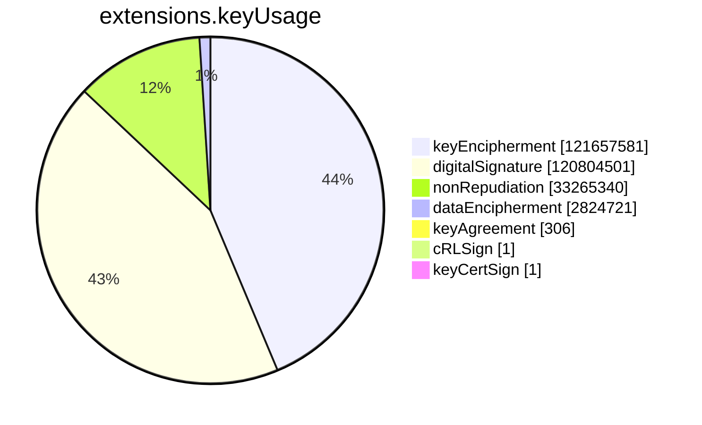
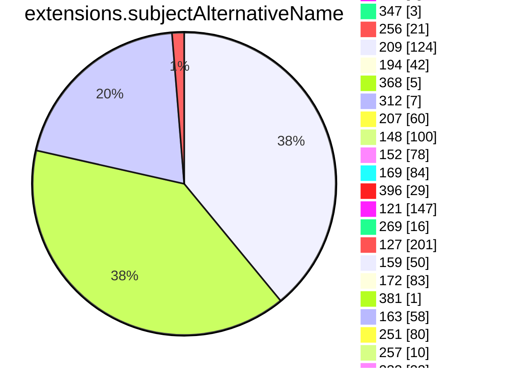
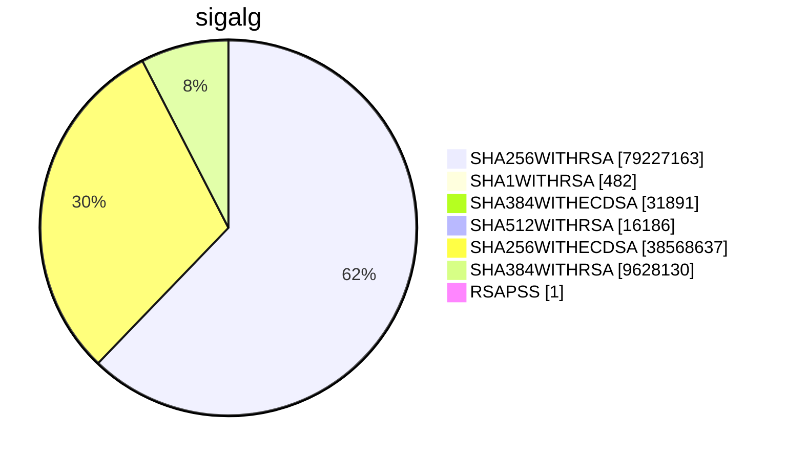

```mermaid
pie showData
title subject.cn.tld
"tw" :51038
"si" :15296
"com" :69575034
"in" :185400
"IN" :105
"at" :110344
"ru" :305002
"jp" :343732
"site" :328268
"kr" :132670
"shop" :470044
"media" :10116
"br" :295528
"org" :2901794
"au" :407571
"cn" :946242
"net" :4139358
"io" :1002791
"it" :182104
"online" :363811
"ca" :350861
"co" :305342
"mx" :61047
"bz" :3149
"uk" :758551
"xn--p1ai" :14368
"ws" :4052
"my" :16565
"eu" :347142
"care" :5471
"th" :8525
"fr" :411363
"biz" :219705
"de" :4073802
"cl" :31564
"info" :239991
"cloud" :277394
"sg" :27923
"tech" :74999
"wedding" :4888
"store" :148967
"ie" :47995
"pro" :48499
"dk" :62869
"id" :36241
"es" :179055
"ro" :31422
"nl" :575218
"tr" :45492
"rocks" :18527
"estate" :850
"education" :20311
"be" :136047
"su" :3071
"cz" :76825
"se" :101735
"nz" :70982
"vn" :42078
"pl" :308997
"global" :9548
"hk" :24318
"no" :61854
"pt" :43872
"click" :86622
"aero" :5599
"lu" :11634
"world" :16932
"club" :140714
"gal" :520
"wine" :1470
"xyz" :674454
"expert" :2906
"us" :1000268
"bzh" :1866
"edu" :498981
"design" :10419
"ch" :155263
"sv" :946
"lundbeck" :3
"business" :3260
"gl" :650
"cyou" :13788
"int" :3461
"xn--80asehdb" :119
"ac" :2493
"agency" :12770
"py" :1841
"bmw" :658
"cc" :117861
"app" :123527
"mobi" :10995
"direct" :560367
"cards" :1153
"xn--80aswg" :40
"cr" :1806
"team" :10103
"art" :27518
"ai" :52536
"pw" :255207
"live" :161042
"is" :5798
"cy" :2695
"moscow" :675
"COM" :8889
"jobs" :1205
"za" :53911
"school" :3116
"ad" :647
"space" :124867
"games" :6935
"ci" :1556
"pe" :15053
"tokyo" :3519
"gov" :74454
"best" :6334
"center" :4812
"website" :40181
"Nu" :2
"link" :63879
"fi" :54972
"rs" :6137
"ph" :12717
"uy" :4095
"ec" :6072
"am" :4994
"ltd" :25066
"rip" :854
"work" :43050
"uno" :3486
"mn" :2347
"kh" :850
"asia" :75642
"me" :190672
"plus" :12964
"la" :5144
"guide" :1800
"travel" :3650
"BZ" :5
"dev" :4030822
"xn--p1acf" :475
"coffee" :1637
"bn" :242
"om" :1448
"quebec" :343
"life" :359690
"cba" :245
"gr" :40902
"fun" :56342
"jo" :895
"ar" :56821
"lk" :5758
"il" :22867
"vip" :82387
"bh" :958
"sk" :18584
"mo" :600
"ke" :7969
"land" :2890
"ua" :27126
"lv" :7575
"kpn" :53
"ae" :17105
"icu" :22472
"academy" :7384
"gh" :1252
"koeln" :936
"video" :3531
"saxo" :33
"fj" :318
"Com" :171
"eg" :1161
"bank" :2184
"nu" :8108
"ee" :10306
"bg" :8631
"scot" :1473
"pk" :13801
"church" :2362
"uz" :2092
"gmo" :6
"green" :27237
"qa" :2448
"hr" :10932
"kz" :6563
"clinic" :1947
"ntt" :235
"tv" :72413
"hu" :40261
"cymru" :491
"red" :3100
"ma" :9258
"st" :1738
"bo" :1272
"ag" :2786
"ng" :27319
"bd" :3898
"tz" :2666
"network" :14041
"DE" :86
"mv" :448
"mc" :485
"delivery" :1408
"lt" :18513
"mu" :1460
"london" :2040
"hn" :1011
"farm" :2825
"tt" :386
"canon" :151
"eco" :1240
"fm" :2759
"BR" :37
"digital" :27210
"theater" :90
"berlin" :3398
"ao" :705
"services" :14178
"ps" :668
"do" :4299
"one" :30271
"ooo" :1323
"to" :5574
"gg" :10178
"blog" :10784
"consulting" :2734
"finance" :19253
"ist" :472
"zone" :13566
"okinawa" :140
"jewelry" :388
"AU" :203
"xn--3e0b707e" :100
"top" :344226
"bet" :13169
"today" :12049
"inc" :1707
"JP" :78
"studio" :13660
"bw" :711
"study" :343
"paris" :1789
"gallery" :1715
"taxi" :699
"page" :3207
"help" :1903
"ryukyu" :28
"yokohama" :94
"ge" :2554
"house" :1906
"by" :4376
"villas" :134
"ba" :1591
"eus" :1614
"coop" :2826
"group" :10224
"clothing" :694
"place" :780
"trade" :3315
"vc" :3360
"va" :36
"cat" :14598
"supply" :677
"li" :13151
"HK" :29
"market" :3617
"sa" :9245
"hsbc" :26
"as" :762
"CA" :436
"mz" :789
"so" :3311
"az" :2542
"bm" :568
"xn--80adxhks" :250
"capital" :2755
"al" :2951
"cw" :105
"apple" :52
"name" :7273
"gmbh" :1674
"support" :4137
"MY" :17
"systems" :17480
"energy" :3211
"GOV" :498
"gt" :2262
"jll" :5
"cab" :512
"jm" :254
"ORG" :572
"kw" :885
"guru" :5934
"marketing" :3303
"host" :7481
"pet" :1066
"company" :21823
"tc" :409
"build" :3380
"pa" :2152
"win" :9380
"mk" :2109
"toys" :1414
"email" :9201
"technology" :10981
"menu" :1851
"bayern" :1291
"social" :5893
"cd" :327
"onl" :985
"ml" :37066
"re" :4641
"dog" :1896
"fit" :6467
"tools" :7923
"yt" :522
"pics" :2325
"money" :4209
"alsace" :187
"immo" :1640
"boutique" :1154
"TW" :46
"blue" :2508
"ninja" :15288
"tk" :47511
"health" :5557
"solutions" :9493
"news" :9910
"bar" :4196
"codes" :4750
"gift" :817
"markets" :281
"ga" :20034
"events" :3431
"woodside" :276
"credit" :765
"ceo" :466
"sh" :6455
"aws" :2613
"healthcare" :931
"kg" :717
"sarl" :65
"holdings" :454
"run" :10297
"im" :5993
"report" :1469
"cm" :2553
"rugby" :72
"fail" :540
"bnpparibas" :560
"fashion" :883
"BIZ" :37
"cf" :25554
"gy" :599
"hamburg" :939
"football" :520
"ovh" :4018
"beauty" :3504
"buzz" :37176
"kyoto" :57
"statefarm" :7163
"et" :274
"science" :1913
"cash" :2831
"management" :1022
"mm" :550
"mt" :2173
"pictet" :45
"audi" :884
"ve" :884
"ms" :4756
"ly" :1564
"engineering" :4488
"coach" :2189
"gs" :1798
"construction" :597
"infiniti" :6
"gq" :8443
"film" :612
"lol" :6459
"vlaanderen" :305
"exchange" :4373
"iq" :425
"yoga" :809
"sx" :597
"man" :468
"fyi" :1956
"africa" :4018
"movie" :471
"tn" :1288
"cam" :8730
"md" :2064
"ink" :8834
"vet" :930
"xxx" :953
"stream" :1907
"amazon" :29
"contact" :734
"lc" :512
"works" :4852
"party" :3136
"museum" :268
"bio" :2685
"ht" :300
"careers" :843
"wtf" :8264
"lb" :982
"community" :2763
"wien" :984
"legal" :1322
"xn--tckwe" :151
"ventures" :1149
"tax" :957
"pr" :264
"nagoya" :93
"recipes" :415
"software" :3735
"reisen" :287
"moe" :2266
"show" :2004
"monster" :7937
"nyc" :2937
"lgbt" :213
"mil" :1718
"realty" :307
"bj" :316
"casa" :1421
"np" :1754
"llc" :1157
"vision" :1426
"racing" :471
"solar" :995
"bt" :142
"swiss" :1195
"training" :2311
"limited" :540
"brussels" :1249
"bbva" :8
"financial" :1161
"bike" :1804
"wales" :985
"sb" :258
"cx" :7593
"dance" :1014
"cool" :5496
"tours" :1057
"glass" :355
"pub" :5200
"city" :4361
"radio" :232
"lat" :532
"photo" :2922
"earth" :2525
"cooking" :141
"wiki" :5601
"download" :1474
"dental" :586
"tui" :142
"tf" :6527
"insure" :625
"pink" :553
"sc" :810
"kim" :1291
"security" :492
"style" :1243
"vg" :272
"tube" :363
"forum" :6
"xn--90ais" :118
"productions" :647
"tj" :387
"parts" :593
"car" :120
"chat" :3102
"shoes" :365
"gold" :2044
"tel" :2361
"international" :1797
"kpmg" :8
"rent" :582
"amsterdam" :549
"vote" :465
"love" :5080
"fish" :650
"pg" :311
"quest" :6717
"melbourne" :220
"wang" :10011
"tienda" :267
"mba" :571
"sap" :9464
"ax" :215
"graphics" :498
"camera" :373
"kiwi" :1042
"band" :1319
"ug" :1495
"deals" :1453
"loan" :1677
"investments" :615
"bingo" :193
"cpa" :223
"ki" :136
"rest" :1755
"INT" :8
"luxe" :165
"sm" :207
"family" :1988
"fan" :903
"game" :1394
"gd" :439
"golf" :1017
"CL" :22
"bid" :7486
"black" :515
"sn" :560
"reviews" :2654
"attorney" :409
"NET" :726
"dealer" :74
"fo" :784
"schule" :296
"EDU" :305
"holiday" :310
"audio" :696
"casino" :1905
"plumbing" :341
"law" :2421
"town" :715
"computer" :620
"ruhr" :354
"institute" :1041
"organic" :104
"sale" :3175
"fox" :259
"express" :1536
"directory" :1378
"corsica" :276
"adult" :176
"lighting" :334
"press" :2360
"tm" :679
"voyage" :254
"weir" :172
"xn--fiqs8s" :857
"ne" :201
"salon" :392
"dating" :593
"hosting" :627
"poker" :323
"faith" :665
"xn--mgbaam7a8h" :10
"fitness" :1349
"tips" :2086
"xin" :9340
"pf" :282
"auspost" :214
"archi" :174
"na" :583
"auto" :379
"moda" :235
"af" :177
"nrw" :1067
"homes" :2407
"PRO" :1
"QA" :31
"NO" :6
"watch" :3027
"fans" :911
"UK" :148
"garden" :421
"barclaycard" :74
"pictures" :1851
"bs" :258
"foundation" :1537
"SE" :29
"flowers" :124
"zm" :788
"NETWORK" :5
"mortgage" :326
"frl" :323
"army" :617
"accountant" :779
"Org" :12
"pm" :700
"partners" :1092
"xn--ses554g" :77
"restaurant" :514
"university" :834
"barclays" :332
"beer" :870
"bi" :447
"surf" :734
"srl" :377
"gifts" :1329
"sr" :229
"dz" :559
"vi" :39
"abbott" :560
"Tech" :2
"pizza" :729
"ikano" :104
"photos" :2829
"rw" :1648
"fund" :1881
"tirol" :275
"brother" :32
"loans" :428
"repair" :450
"camp" :872
"clubmed" :584
"nr" :20
"ngo" :898
"dentist" :212
"irish" :293
"krd" :168
"promo" :400
"discount" :206
"domains" :1719
"actor" :196
"baby" :254
"SG" :94
"photography" :5557
"toyota" :79
"tl" :195
"viajes" :24
"tatar" :46
"kitchen" :522
"vin" :1293
"christmas" :262
"trading" :282
"review" :1545
"ski" :546
"navy" :140
"miami" :345
"aw" :93
"pharmacy" :48
"xn--j1amh" :105
"ky" :513
"sky" :745
"cafe" :1916
"teva" :98
"vacations" :185
"florist" :234
"engineer" :948
"tg" :253
"cleaning" :216
"doctor" :11768
"suzuki" :46
"porn" :355
"new" :514
"rentals" :807
"gay" :740
"webcam" :560
"SA" :40
"KW" :7
"xn--kpry57d" :20
"ricoh" :38
"afl" :34
"sbi" :103
"realestate" :1269
"mw" :310
"xn--d1acj3b" :21
"AR" :17
"NL" :49
"CN" :13
"wf" :168
"bot" :673
"sexy" :364
"Gov" :33
"ren" :2356
"mg" :382
"physio" :627
"haus" :503
"vu" :201
"properties" :1171
"mp" :124
"cg" :126
"ls" :168
"je" :579
"bb" :146
"hair" :441
"nc" :789
"ni" :467
"IT" :47
"gm" :63
"sncf" :50
"neustar" :209
"builders" :623
"cricket" :554
"pfizer" :47
"associates" :224
"college" :395
"US" :93
"fk" :32
"jcb" :10
"sydney" :331
"gn" :19
"soccer" :212
"globo" :184
"nissan" :6
"horse" :316
"xn--mgberp4a5d4ar" :1
"soy" :208
"men" :1816
"xn--c1avg" :31
"how" :917
"bf" :122
"dm" :51
"cbs" :3
"date" :1440
"kn" :64
"diamonds" :211
"shopping" :962
"gives" :348
"nikon" :1
"rehab" :253
"temasek" :12
"limo" :110
"barcelona" :323
"skin" :664
"observer" :99
"saarland" :205
"lamborghini" :5
"tickets" :35
"zuerich" :32
"sony" :16
"immobilien" :450
"jetzt" :780
"reise" :53
"kaufen" :362
"tennis" :128
"xn--mk1bu44c" :87
"tatamotors" :28
"itau" :18
"hiphop" :60
"gp" :213
"auction" :354
"ye" :109
"total" :153
"EU" :57
"property" :225
"surgery" :90
"cv" :111
"exposed" :295
"xn--90ae" :25
"sport" :168
"MX" :11
"hermes" :90
"catering" :187
"taipei" :517
"ong" :300
"cologne" :97
"km" :26
"gratis" :286
"JM" :1
"gucci" :17
"bridgestone" :14
"versicherung" :92
"playstation" :2
"goog" :14570
"xn--e1a4c" :3
"xn--qxa6a" :7
"dj" :2184
"singles" :210
"republican" :64
"claims" :354
"gi" :175
"industries" :411
"xn--q9jyb4c" :71
"zw" :504
"Lighting" :1
"SALE" :2
"condos" :162
"nike" :386
"futbol" :555
"gop" :107
"honda" :13
"realtor" :446
"cfd" :4064
"gdn" :212
"ONLINE" :1
"courses" :364
"madrid" :186
"xn--9dbq2a" :27
"hospital" :124
"lawyer" :562
"forsale" :701
"mq" :92
"AE" :25
"dvag" :192
"RU" :18
"EMAIL" :2
"supplies" :284
"apartments" :634
"PH" :30
"compare" :20
"xn--h2brj9c" :81
"desi" :216
"orange" :62
"contractors" :200
"cheap" :440
"TR" :5
"dhl" :31
"sex" :370
"boston" :91
"democrat" :59
"blackfriday" :77
"sucks" :58
"diet" :60
"degree" :104
"xn--fiq228c5hs" :10
"lease" :284
"sl" :171
"vegas" :508
"osaka" :40
"ir" :8794
"sakura" :1
"capetown" :82
"bargains" :155
"joburg" :64
"flights" :209
"xn--ngbc5azd" :19
"xn--6qq986b3xl" :653
"durban" :62
"sbs" :6841
"rodeo" :336
"country" :117
"bond" :2617
"charity" :161
"cruises" :131
"fishing" :81
"mango" :6
"enterprises" :494
"mom" :476
"equipment" :291
"hockey" :71
"coupons" :145
"abogado" :40
"xn--qxam" :8
"vanguard" :51
"tattoo" :235
"xn--j6w193g" :19
"airforce" :90
"nf" :95
"forex" :30
"sd" :164
"memorial" :34
"gf" :86
"creditcard" :115
"broker" :138
"jnj" :364
"crs" :1405
"tires" :48
"citic" :89
"boats" :144
"PT" :4
"aeg" :2
"leclerc" :26
"trust" :7
"LONDON" :2
"lidl" :78
"ltda" :48
"luxury" :94
"Dk" :1
"insurance" :62
"yachts" :157
"next" :353
"sandvik" :55
"Clinic" :1
"basketball" :64
"Edu" :8
"furniture" :211
"hiv" :7
"pioneer" :7
"DK" :52
"istanbul" :256
"OM" :2
"post" :28
"sz" :151
"CO" :12
"aquarelle" :13
"makeup" :134
"autos" :796
"Biz" :39
"FR" :33
"schwarz" :615
"ck" :91
"day" :896
"mr" :221
"bible" :87
"abb" :57
"monash" :82
"abudhabi" :81
"RENTALS" :2
"gent" :182
"shiksha" :14
"ES" :55
"hm" :47
"香港" :5
"maison" :128
"moi" :7
"xn--6frz82g" :726
"career" :57
"jpmorgan" :2
"sy" :30
"CBA" :11
"toray" :23
"xn--czrs0t" :1
"uol" :41
"vodka" :68
"td" :121
"juegos" :7
"bradesco" :55
"storage" :59
"williamhill" :3
"TH" :14
"scb" :31
"guitars" :40
"Be" :1
"rich" :22
"xn--g2xx48c" :32
"Net" :14
"xn--mgbab2bd" :8
"xn--rhqv96g" :13
"select" :10
"erni" :4
"gripe" :44
"sharp" :17
"accountants" :90
"CZ" :5
"schaeffler" :19
"komatsu" :111
"anz" :46
"cars" :76
"ZA" :32
"FI" :23
"BE" :21
"IE" :12
"philips" :1
"ismaili" :7
"schmidt" :8
"xn--o3cw4h" :6
"KE" :4
"deloitte" :32
"IO" :5
"showtime" :2
"Co" :1
"nab" :2
"sener" :11
"BANK" :6
"abc" :19
"xn--czr694b" :112
"Za" :2
"HR" :15
"lotto" :4
"CM" :2
"theatre" :5
"uK" :4
"praxi" :1
"xn--io0a7i" :20
"lr" :22
"BH" :5
"MU" :2
"RE" :1
"xn--t60b56a" :23
"IL" :11
"DZ" :3
"EC" :4
"COMPANY" :6
"xn--vhquv" :1
"vig" :28
"cfa" :5
"CLOUD" :2
"voto" :17
"pn" :96
"aq" :17
"ss" :49
"lilly" :16
"azure" :48
"SI" :2
"RO" :8
"GR" :23
"ID" :6
"voting" :5
"motorcycles" :26
"axa" :25
"seat" :58
"sanofi" :89
"rio" :10
"nico" :10
"ipiranga" :3
"xn--3ds443g" :27
"CAFE" :1
"xn--node" :3
"xn--vuq861b" :8
"kred" :78
"shell" :21
"MD" :2
"NZ" :16
"microsoft" :18
"PY" :2
"xn--3hcrj9c" :4
"xn--90a3ac" :16
"lego" :18
"goo" :1
"MIL" :9
"City" :1
"godaddy" :5
"fresenius" :4
"xn--fiqz9s" :4
"ifm" :3
"linde" :4
"cisco" :5
"aaa" :1
"TV" :3
"med" :8
"VN" :8
"smart" :4
"xn--y9a3aq" :12
"mma" :7
"xn--otu796d" :8
"xn--czru2d" :19
"cuisinella" :6
"EG" :1
"PL" :3
"aig" :8
"reit" :23
"panasonic" :2
"cu" :2
"weber" :44
"xn--55qx5d" :11
"In" :3
"MO" :1
"ubs" :1
"NU" :1
"AG" :6
"xn--kput3i" :22
"itv" :10
"flir" :1
"fage" :12
"ET" :3
"yandex" :42
"protection" :3
"Zone" :1
"Asia" :1
"CH" :13
"LB" :5
"gw" :5
"AO" :17
"stockholm" :14
"otsuka" :4
"SBI" :6
"MOBI" :4
"Fr" :8
"ASIA" :4
"ericsson" :2
"kfh" :1
"amex" :1
"BRADESCO" :1
"xn--rvc1e0am3e" :4
"Live" :1
"hisamitsu" :2
"CI" :1
"natura" :1
"xn--54b7fta0cc" :2
"locus" :7
"LAW" :2
"xn--rovu88b" :1
"xn--1ck2e1b" :1
"xn--eckvdtc9d" :1
"qpon" :3
"imdb" :1
"free" :1
"tushu" :1
"read" :1
"silk" :1
"xn--jlq480n2rg" :1
"CD" :2
"LTD" :1
"BS" :1
"BM" :1
"bbc" :7
"edeka" :41
"airbus" :1
"chase" :3
"MADRID" :1
"call" :1
"audible" :1
"xn--unup4y" :3
"AT" :4
"COOP" :2
"NAME" :1
"bauhaus" :16
"WORLD" :1
"EUS" :2
"xn--5tzm5g" :14
"dubai" :2
"INFO" :8
"arab" :1
"politie" :53
"xn--ngbrx" :1
"NYC" :1
"jaguar" :2
"landrover" :2
"sew" :2
"lincoln" :2
"statebank" :4
"lanxess" :6
"TOP" :1
"creditunion" :15
"nec" :1
"WS" :5
"rwe" :2
"DIGITAL" :4
"toshiba" :1
"xn--nqv7f" :8
"jprs" :4
"PE" :8
"frogans" :6
"SZ" :1
"Solutions" :2
"HU" :3
"LA" :4
"xn--fjq720a" :3
"ACADEMY" :3
"farmers" :2
"xfinity" :3
"comcast" :3
"ZM" :1
"TECH" :4
"FARM" :2
"XYZ" :5
"channel" :1
"Software" :2
"xn--2scrj9c" :10
"mutual" :3
"northwesternmutual" :1
"CLUB" :4
"JO" :7
"xn--xhq521b" :1
"bosch" :1
"samsung" :2
"nowruz" :1
"xn--hxt814e" :2
"xn--mgbca7dzdo" :1
"booking" :1
"dupont" :6
"CAT" :1
"extraspace" :1
"gu" :2
"MZ" :2
"aco" :3
"redumbrella" :1
"travelersinsurance" :1
"travelers" :1
"trv" :1
"KR" :1
"BW" :2
"CR" :2
"Bid" :3
"mattel" :8
"HOUSE" :2
"bentley" :1
"xn--wgbh1c" :1
"guardian" :3
"APP" :1
"xn--zfr164b" :7
"xn--imr513n" :4
"LT" :1
"xn--s9brj9c" :8
"mini" :2
"xn--h2breg3eve" :26
"AERO" :3
"xn--xkc2dl3a5ee0h" :16
"analytics" :2
"Bank" :3
"Video" :1
"xn--gecrj9c" :4
"foo" :2
"KZ" :2
"Dog" :2
"gea" :1
"Info" :1
"AI" :2
"GT" :1
"Uk" :2
"hyundai" :3
"Dev" :1
"xn--45brj9c" :2
"mit" :2
"amica" :1
"Land" :2
"AM" :1
"bms" :1
"xn--fpcrj9c3d" :6
"MT" :5
"RW" :1
"PF" :1
"WEIR" :1
"MA" :4
"Eu" :1
"ANZ" :1
"LIFE" :1
"UG" :2
"google" :1
"ice" :1
"ZONE" :1
"xn--d1alf" :1
"Us" :1
"jmp" :2
"accenture" :1
"FOX" :2
"bloomberg" :1
"msd" :1
"PK" :1
"icbc" :1
"GG" :4
"sas" :1
"mtr" :2
"UA" :1
"SINGLES" :1
"GL" :2
"KY" :1
"chintai" :1
"feedback" :1
"zara" :1
"WORK" :1
"BN" :2
"RS" :2
"ME" :1
"DO" :3
"CC" :2
"SK" :1
```

```mermaid
pie showData
title issuer
"Google UK Ltd." :35968
"Cisco Systems" :417
"行政院" :3
"KPN B.V." :1
"Actalis S.p.A.-03358520967" :1
"A-Trust Ges. f. Sicherheitssysteme im elektr. Datenverkehr GmbH" :6
"AC Camerfirma S.A." :2
"行政院" :14
"VeriSign, Inc." :5
"Baltimore" :5
"VeriSign, Inc." :11
"Microsoft Corporation" :1
"ICP-Brasil" :3
"VeriSign, Inc." :2
"FNMT-RCM" :1
"VeriSign, Inc." :2
"A-Trust Ges. f. Sicherheitssysteme im elektr. Datenverkehr GmbH" :4
"thawte, Inc." :1
"Colegio de Registradores de la Propiedad y Mercantiles de España" :2
"行政院" :1
"DigiCert Inc" :3
"AC CAMERFIRMA S.A." :2
"Hellenic Academic and Research Institutions Cert. Authority" :3
"Republika Slovenija" :2
"E-Tuğra EBG Bilişim Teknolojileri ve Hizmetleri A.Ş." :5
"Elektronik Bilgi Guvenligi A.S." :2
"GeoTrust Inc." :2
"MULTICERT - Serviços de Certificação Electrónica S.A." :1
"Hellenic Academic and Research Institutions Cert. Authority" :15
"Atos" :2
"QuoVadis Limited" :2
"POSTA" :2
"Secretaria de Economia" :1
"TÜRKTRUST Bilgi İletişim ve Bilişim Güvenliği Hizmetleri A.Ş." :1
"Elektronik Bilgi Guvenligi A.S." :1
"LAWtrust" :2
"AC Camerfirma SA" :1
"SwissSign AG" :1
"British Telecommunications plc" :5
"Google UK Ltd." :94320
"Certinomis" :1
"HydrantID (Avalanche Cloud Corporation)" :1
"QuoVadis Limited" :2
"GlobalSign" :1
"Institute for Development and Research in Banking Technology" :51
"U.S. Government" :4
"Symantec Corporation" :3
"GlobalSign nv-sa" :3
"WoSign CA Limited" :1
"Apple Inc." :6
"VeriSign, Inc." :1
"Japanese Government" :1
"Unizeto Technologies S.A." :1
"ANF Autoridad de Certificacion" :1
"SwissSign AG" :1
"Foundation for Trusted Identity" :1
"Hongkong Post" :3
"Vaestorekisterikeskus CA" :2
"QuoVadis Limited" :3
"certSIGN" :2
"U.S. Government" :1
"DigiCert Inc" :2
"e-commerce monitoring GmbH" :4
"ICP-Brasil" :3
"DigiCert Inc" :2
"MINISTERE INTERIEUR" :1
"DigiCert Inc" :1
"Government Root Certification Authority" :1
"Open Access Technology International Inc" :1
"Apple Inc." :1
"SECOM Trust Systems CO.,LTD." :2
"E-Tuğra EBG Bilişim Teknolojileri ve Hizmetleri A.Ş." :10
"Elektronik Bilgi Guvenligi A.S." :1
"行政院" :1
"ICP-Brasil" :1
"TÜRKTRUST Bilgi İletişim ve Bilişim Güvenliği Hizmetleri A.Ş." :1
"VeriSign, Inc." :2
"Orion Health Inc." :2
"DigiCert Inc" :1
"ACNLB" :1
"QuoVadis Limited" :10486
"Apple Inc." :1
"The USERTRUST Network" :1
"GlobalSign nv-sa" :2
"GAD EG" :2
"SAFE Identity" :1
"GlobalSign nv-sa" :1
"VeriSign, Inc." :1
"NISZ Nemzeti Infokommunikációs Szolgáltató Zrt." :1
"QuoVadis Limited" :3
"SECOM Trust.net" :1
"TSCP Inc." :1
"Actalis S.p.A." :1
"Turkiye Bilimsel ve Teknolojik Arastirma Kurumu - TUBITAK" :1
"SwissSign AG" :3
"Verizon Business" :1
"ICP-Brasil" :1
"Symantec Corporation" :1
"Apple Inc." :3
"Sectigo Limited" :1
"SAFE-Biopharma" :1
"SwissSign AG" :2
"Apple Inc." :1
"Trustwave Holdings, Inc." :1
"GlobalSign nv-sa" :220768
"GlobalSign nv-sa" :314953
"GlobalSign nv-sa" :127408
"GlobalSign nv-sa" :11843
"GlobalSign nv-sa" :15313
"GlobalSign nv-sa" :151704
"GlobalSign nv-sa" :1941
"Česká pošta, s.p." :709
"Rede Nacional de Ensino e Pesquisa - RNP" :7031
"GlobalSign nv-sa" :107
"VALID CERTIFICADORA DIGITAL" :188
"SOLUTI - SOLUCOES EM NEGOCIOS INTELIGENTES S-A" :23
"ATT Services Inc" :3597
"Sectigo Limited" :9977159
"DigiCert Inc" :154712
"DigiCert Inc" :1254089
"SSL Corporation" :49096
"Government of Korea" :699
"DigiCert Inc" :6119
"Internet2" :409222
"DigiCert Inc" :287197
"Network Solutions L.L.C." :99816
"DigiCert Inc" :99384
"DigiCert Inc" :133151
"The USERTRUST Network" :56499
"Sectigo Limited" :765486
"SecureCore" :24796
"SECOM Trust Systems CO.,LTD." :20829
"GoGetSSL" :103664
"DigiCert Inc" :72953
"DigiCert Inc" :10521
"SECOM Trust Systems CO.,LTD." :18718
"DigiCert Inc" :6325
"DigiCert Inc" :27518
"Sectigo Limited" :48644
"FUJIFILM" :154
"DigiCert Inc" :232
"DigiCert Inc" :11582932
"UniTrust" :1160
"DigiCert Inc" :472
"Trust Provider B.V." :14331
"The Trustico Group Ltd" :11306
"DigiCert Inc" :8861431
"DigiCert Inc" :73106
"DigiCert Inc" :2492
"GlobalSign nv-sa" :1545
"TAIWAN-CA" :31409
"SecureCore" :1108
"DigiCert Inc" :41427
"Technische Universitaet Dresden" :660
"TrustAsia Technologies, Inc." :749
"DigiCert Inc" :1776
"Aetna Inc" :8907
"Entrust, Inc." :334962
"COMODO CA Limited" :278582
"Verein zur Foerderung eines Deutschen Forschungsnetzes e. V." :42350
"DigiCert Inc" :9955
"DigiCert Inc" :10302
"Soluciones Corporativas IP, SL" :36019
"EUNETIC GmbH" :7239
"Fraunhofer" :4104
"DigiCert Inc" :144
"Sectigo Limited" :624
"Alpiro s.r.o." :10912
"DigiCert Inc" :1537
"GoDaddy.com, Inc." :25544
"DigiCert Inc" :227
"DigiCert Inc" :1845
"Technische Universitaet Ilmenau" :209
"DigiCert Inc" :7310
"Network Solutions L.L.C." :27293
"Karlsruhe Institute of Technology" :983
"DigiCert Inc" :5036
"Gandi" :552060
"TBS INTERNET" :4916
"Siemens" :1
"Corporation Service Company" :41270
"EUNETIC GmbH" :154
"Max-Planck-Gesellschaft" :1466
"Nijimo K.K." :1034
"DigiCert Inc" :32030
"Sectigo Limited" :10781
"Sectigo Limited" :5504114
"DigiCert Inc" :19587
"The USERTRUST Network" :2099
"Internet2" :11600
"DigiCert Inc" :681
"COMODO CA Limited" :5843
"GoGetSSL" :258
"DigiCert Inc" :14515
"Trustwave Holdings, Inc." :6995
"Wells Fargo & Company" :2847
"Government of the District of Columbia" :303
"DigiCert Inc" :312
"DigiCert Inc" :4684
"K Software" :472
"SecureCore" :84
"WoTrus CA Limited" :10019
"TrustAsia Technologies, Inc." :303170
"Apple Inc." :1687
"Cybertrust Japan Co., Ltd." :16243
"BitCert" :250
"CrowdStrike Inc." :30
"Cybertrust Japan Co., Ltd." :7286
"TAIWAN-CA" :159
"SSL Corp" :113
"GoGetSSL" :1014
"DigiCert Inc" :200744
"DigiCert Inc" :814
"Entrust, Inc." :33205
"Deutscher Bundestag" :77
"CentralNic Luxembourg Sàrl" :9462
"IZENPE S.A." :481
"DigiCert Inc" :1082
"Chunghwa Telecom Co., Ltd." :2141
"SECOM Trust Systems CO.,LTD." :8326
"Unizeto Technologies S.A." :111530
"Beijing Xinchacha Credit Management Co., Ltd." :1513
"The Trustico Group Ltd" :130
"WoTrus CA Limited" :413
"Beijing Xinchacha Credit Management Co., Ltd." :3189
"Corporation Service Company" :148
"MarketWare - Soluções para Mercados Digitais, Lda." :380
"United SSL Deutschland GmbH" :653
"VALID CERTIFICADORA DIGITAL" :31
"CERTDATA SERVICOS DE INFORMACAO LTDA" :80
"Open Access Technology International Inc" :1063
"Apple Inc." :1720
"The Trustico Group Ltd" :114
"Internet2" :5837
"Network Solutions L.L.C." :866
"Amazon" :24716178
"WoTrus CA Limited" :2052
"Disig a.s." :258
"IZENPE S.A." :220
"DHIMYOTIS" :3643
"Aristotle University of Thessaloniki" :468
"Buypass AS-983163327" :3533
"GEANT Vereniging" :4822
"GlobalSign nv-sa" :111
"Aetna Inc" :58
"SOLUTI - SOLUCOES EM NEGOCIOS INTELIGENTES S-A" :71
"Sectigo (Europe) SL" :4
"Fresenius Kabi AG" :80
"GoGetSSL" :6
"Apple Inc." :891
"Trustwave Holdings, Inc." :94
"Apple Inc." :1253
"Nijimo K.K." :212
"TrustAsia Technologies, Inc." :2707
"OpenTrust" :1
"SwissSign AG" :1
"SwissSign AG" :1
"SwissSign AG" :1
"GeoTrust Inc." :1
"Certinomis" :4
"GeoTrust Inc." :1
"SwissSign AG" :1
"Certinomis" :1
"DigiCert Inc" :219
"Inera AB" :6
"VI Registru centras - i.k. 124110246" :1
"Agence Nationale des Titres Sécurisés" :2
"China Financial Certification Authority" :326
"CERTSIGN SA" :5
"China Financial Certification Authority" :1
"China Financial Certification Authority" :1811
"Netflix, Inc." :1
"CERTSIGN SA" :1
"CERTSIGN SA" :1
"Vaestorekisterikeskus CA" :7
"Krajowa Izba Rozliczeniowa S.A." :344
"E-Tuğra EBG Bilişim Teknolojileri ve Hizmetleri A.Ş." :1
"Vaestorekisterikeskus CA" :2
"Krajowa Izba Rozliczeniowa S.A." :1
"E-Tuğra EBG Bilişim Teknolojileri ve Hizmetleri A.Ş." :1378
"E-Tuğra EBG Bilişim Teknolojileri ve Hizmetleri A.Ş." :29
"Isimtescil Bilisim Anonim Sirketi" :3565
"Vaestorekisterikeskus CA" :2
"Vaestorekisterikeskus CA" :2
"Isimtescil Bilisim Anonim Sirketi" :1
"Krajowa Izba Rozliczeniowa S.A." :1
"COMODO CA Limited" :5784
"Actalis S.p.A." :597361
"RU-Center (ЗАО Региональный Сетевой Информационный Центр)" :316
"QuoVadis Limited" :27659
"联通智慧安全科技有限公司" :33
"WoTrus CA Limited" :31
"Starfield Technologies, Inc." :3016
"QuoVadis Trustlink B.V." :4265
"Buypass AS-983163327" :922
"TeliaSonera" :5381
"CERTDATA SERVICOS DE INFORMACAO LTDA" :100
"MarketWare - Soluções para Mercados Digitais, Lda." :310
"Shanghai Ping An Credit Reference Company Limited" :9
"HydrantID (Avalanche Cloud Corporation)" :1891
"VTB BANK (PJSC)" :111
"sslTrus" :338
"Government of Korea" :47
"sslTrus" :1512
"DigiCert Inc" :128
"GlobalSign nv-sa" :914
"DigiCert Inc" :7476
"Site Blindado S.A." :560
"KICA" :4
"IdenTrust" :1175778
"Entrust, Inc." :1919
"IdenTrust" :2550
"DigiCert Inc" :51
"Corporation Service Company" :5533
"Actalis S.p.A." :5638
"SECOM Trust Systems CO.,LTD." :334
"DigiCert Inc" :36
"Hongkong Post" :1517
"SSL.com" :190
"TrustSign Certificadora Dig. & Soluções Segurança da Inf. Ltda." :1287
"Apple Inc." :156
"Apple Inc." :396
"UniTrust" :1
"Intesa Sanpaolo S.p.A." :1
"InfoCert S.p.A." :1
"InfoCert S.p.A." :1
"Open Access Technology International Inc" :8
"QuoVadis Limited" :1
"QuoVadis Limited" :1
"Turkiye Bilimsel ve Teknolojik Arastirma Kurumu - TUBITAK" :101
"QuoVadis Limited" :1
"SwissSign AG" :18070
"NAVER BUSINESS PLATFORM Corp." :1
"HydrantID (Avalanche Cloud Corporation)" :1
"SwissSign AG" :9270
"ZETES SA (VATBE-0408425626)" :2
"TAIWAN-CA" :1
"TAIWAN-CA" :1
"SwissSign AG" :5797
"Japan Certification Services, Inc." :1
"UniTrust" :1
"Beijing Xinchacha Credit Management Co., Ltd." :49
"Baidu, Inc." :1073
"QuoVadis Trustlink B.V." :2559
"Turing Crypto GmbH" :176
"Entrust, Inc." :441
"SwissSign AG" :1
"Certinomis" :1
"Certinomis" :1
"Siemens" :1
"Vaestorekisterikeskus CA" :2
"certSIGN" :1
"certSIGN" :1
"Abitab S.A." :1
"GAD EG" :1
"Capricorn Identity Services Pvt Ltd." :1
"Disig a.s." :2
"Alpiro s.r.o." :64
"DigiCert Inc" :138
"SECOM Trust Systems CO.,LTD." :912
"DigiCert Inc" :4653
"WoTrus CA Limited" :44
"Turing Crypto GmbH" :5
"WoTrus CA Limited" :4
"Sectigo Limited" :623
"Telia Finland Oyj" :2666
"Trustwave Holdings, Inc." :357
"sslTrus (上海锐成信息科技有限公司)" :34
"TI Trust Technologies S.R.L." :2076
"SOLUTI - SOLUCOES EM NEGOCIOS INTELIGENTES S-A" :35
"VALID CERTIFICADORA DIGITAL" :20
"EUNETIC GmbH" :12
"GoGetSSL" :192
"Trust Provider B.V." :720
"Hellenic Academic and Research Institutions CA" :177
"Deutsche Telekom Security GmbH" :1
"MarketWare - Soluções para Mercados Digitais, Lda." :140
"Sectigo Limited" :36
"Hao Quang Viet Software Company Limited" :193
"GlobalSign nv-sa" :62
"Digi- ja vaestotietovirasto CA" :994
"GlobalSign nv-sa" :7
"Digi- ja vaestotietovirasto CA" :724
"COMODO CA Limited" :1130
"DHIMYOTIS" :1550
"TBS INTERNET" :70
"DigiCert Inc" :98
"UniTrust" :138
"WoTrus CA Limited" :10
"DigiCert Inc" :15
"SECOM Trust Systems CO.,LTD." :46
"Microsec Ltd." :4
"Nijimo K.K." :244
"eMudhra Technologies Limited" :3024
"DigiCert Inc" :107
"DigiCert Inc" :66
"Gandi" :626
"Baidu, Inc." :124
"ITSO LTD" :61
"Domain The Net Technologies Ltd" :609
"D-Trust GmbH" :5829
"DigiCert Inc" :245
"One Sign Pte. Ltd." :472
"DigiCert Inc" :985
"Microsoft Corporation" :793122
"Microsoft Corporation" :792905
"Ziwit" :174
"Staat der Nederlanden" :4
"T-Systems International GmbH" :9922
"DigiCert Inc" :47
"Shanghai Ping An Credit Reference Company Limited" :5
"HydrantID (Avalanche Cloud Corporation)" :346
"DigiCert Inc" :20
"DigiCert Inc" :12
"Ziwit" :12
"DigiCert Inc" :103554
"DigiCert Inc" :34
"Japan Registry Services Co., Ltd." :65287
"Cisco Systems, Inc." :261020
"Cloudflare, Inc." :12051619
"Cloudflare, Inc." :32986013
"nazwa.pl sp. z o.o." :170154
"GEANT Vereniging" :330922
"cPanel, Inc." :111531
"DigiCert Inc" :26181
"ZeroSSL" :43228
"TrustCor Systems S. de R.L." :14627
"Japan Registry Services Co., Ltd." :1544
"Root Networks, LLC" :11680
"home.pl S.A." :54217
"LH.pl Sp. z o.o." :5642
"Unizeto Technologies S.A." :2198
"Genious Communications" :2802
"DOMENY.PL sp. z o.o" :9922
"swissns GmbH" :175
"iTrusChina Co., Ltd." :1473
"Dreamcommerce S.A." :12242
"McAfee, Inc." :1314
"GEANT Vereniging" :10916
"Hellenic Academic and Research Institutions Cert. Authority" :280
"行政院" :8543
"WISeKey" :944
"T-Systems International GmbH" :1318
"WebSpace-Forum e.K." :12
"Unizeto Technologies S.A." :920
"Entrust Datacard Europe S.L." :94
"FNMT-RCM" :856
"Atos" :1284
"TI Trust Technologies S.R.L." :454
"První certifikační autorita, a.s." :35
"Firmaprofesional S.A." :1021
"Financijska agencija" :259
"D-Trust GmbH" :725
"Hellenic Academic and Research Institutions Cert. Authority" :34
"E-SAFER CONSULTORIA EM TECNOLOGIA DA INFORMACAO LTDA" :318
"Ziwit" :14
"cPanel, Inc." :136
"DNEncrypt, Inc" :292
"SECOM Trust Systems CO.,LTD." :1368
"SECOM Trust Systems CO.,LTD." :283
"TrustAsia Technologies, Inc." :2110
"CerSign Technology Limited" :132
"Global Digital Cybersecurity Authority Co., Ltd." :326
"DigiCert Inc" :173
"Deutsche Post AG" :2187
"Global Digital Cybersecurity Authority Co., Ltd." :156
"Global Digital Cybersecurity Authority Co., Ltd." :12
"GEANT Vereniging" :5963
"Abitab S.A." :125
"Quantum CA Limited" :135
"QuoVadis Trustlink B.V." :1455
"DOMENY.PL sp. z o.o" :308
"cPanel, Inc." :52
"Hellenic Academic and Research Institutions CA" :23
"Digital Trust L.L.C." :530
"Hellenic Academic and Research Institutions CA" :255
"Quantum CA Limited" :6
"IdenTrust" :58
"WidePoint" :15
"Quantum CA Limited" :8
"Sectigo Limited" :1322
"Apple Inc." :6
"T-Systems International GmbH" :221
"Comodo Japan, Inc." :1166
"sslTrus" :10
"iTrusChina Co., Ltd." :123
"Staclar, Inc." :62
"FNMT-RCM" :623
"Abitab S.A." :156
"Sectigo Limited" :296
"Microsoft Corporation" :1651395
"Microsoft Corporation" :1629419
"Anson Network Limited" :33
"Deutsche Kreditbank AG" :220
"Nyatwork Communication Ltd" :233
"Sectigo (Europe) SL" :38
"DigiCert Inc" :83
"Netflix, Inc." :1
"Baidu, Inc." :10
"AffirmTrust" :63
"Alpiro s.r.o." :30
"sslTrus" :2
"Shenzhen Digital Certificate Authority Center Co., Ltd" :62
"TrustOcean Limited" :2
"Vaestorekisterikeskus CA" :4
"GEANT Vereniging" :73
"Kingnet Information Technology Co., Ltd." :23
"DigiCert Inc" :18
"VISA" :30
"Actalis S.p.A." :646
"DigiCert Inc" :39
"Hellenic Academic and Research Institutions CA" :68
"Hellenic Academic and Research Institutions CA" :22
"Hellenic Academic and Research Institutions CA" :21
"Hellenic Academic and Research Institutions CA" :6
"D-Trust GmbH" :95
"KICA" :46
"TrustSign Certificadora Dig. & Soluções Segurança da Inf. Ltda." :12
"CertCloud Pte. Ltd." :184
"eMudhra Technologies Limited" :112
"První certifikační autorita, a.s." :182
"Alpiro s.r.o." :54
"TRUSTCUBES LIMITED" :14
"GlobalSign nv-sa" :5897
"Shenzhen Digital Certificate Authority Center Co., Ltd" :25
"GlobalSign nv-sa" :2844
"CentralNic Luxembourg Sàrl" :16
"DigiCert Inc" :14
"GlobalSign nv-sa" :117
"COMODO CA Limited" :6
"CERTDATA SERVICOS DE INFORMACAO LTDA" :26
"E-SAFER CONSULTORIA EM TECNOLOGIA DA INFORMACAO LTDA" :62
"ZeroSSL" :36
"TrustAsia Technologies, Inc." :48
"Greek Universities Network (GUnet)" :8
"STCS" :1
"Sistema Nacional de Certificacion Electronica" :1
"Alibaba Cloud Computing Co., Ltd." :4
"A-Trust Ges. f. Sicherheitssysteme im elektr. Datenverkehr GmbH" :32
"NetLock Kft." :34
"Telia Finland Oyj" :2
"Telia Finland Oyj" :1
"Apple Inc." :28
"CerSign Technology Limited" :2
"Microsoft Corporation" :2267273
"Microsoft Corporation" :2311336
"FNMT-RCM" :117
"TrustAsia Technologies, Inc." :20162
"TrustAsia Technologies, Inc." :1357444
"Quantum CA Limited" :35
"Pardazeshgaran Shahr Hooshmand Yekta Co." :26
"Hellenic Academic and Research Institutions Cert. Authority" :9
"DigiCert, Inc." :88
"Hellenic Academic and Research Institutions CA" :39
"certSIGN" :1
"certSIGN" :1
"certSIGN" :1444
"certSIGN" :3
"DigiCert, Inc." :6
"ZoTrus Technology Limited" :106
"DigiCert Inc" :1
"WebSpace-Forum e.K." :6
"Alibaba Cloud Computing Co., Ltd." :2
"Digi-Sign Limited" :76
"DigiCert, Inc." :2
"COMODO CA Limited" :12
"WISeKey" :1
"WISeKey" :1
"WISeKey" :1
"Hellenic Academic and Research Institutions CA" :17
"{'c': 'BE', 'cn': 'Citizen CA', 'serialnumber': '201605'}" :1
"{'c': 'BE', 'cn': 'Citizen CA', 'serialnumber': '201507'}" :1
"{'c': 'BE', 'cn': 'Citizen CA', 'serialnumber': '201505'}" :1
"{'c': 'BE', 'cn': 'Citizen CA', 'serialnumber': '201508'}" :1
"{'c': 'BE', 'cn': 'Citizen CA', 'serialnumber': '201622'}" :1
"{'c': 'BE', 'cn': 'Citizen CA', 'serialnumber': '201503'}" :1
"{'c': 'BE', 'cn': 'Citizen CA', 'serialnumber': '201601'}" :1
"{'c': 'BE', 'cn': 'Citizen CA', 'serialnumber': '201625'}" :1
"http:--repository.eid.belgium.be-" :1
"http:--repository.eid.belgium.be-" :1
"{'c': 'BE', 'cn': 'Citizen CA', 'serialnumber': '201406'}" :1
"{'c': 'BE', 'cn': 'Citizen CA', 'serialnumber': '201501'}" :1
"{'c': 'BE', 'cn': 'Citizen CA', 'serialnumber': '201409'}" :1
"http:--repository.eid.belgium.be-" :1
"http:--repository.eid.belgium.be-" :1
"{'c': 'BE', 'cn': 'Citizen CA', 'serialnumber': '201624'}" :1
"{'c': 'BE', 'cn': 'Citizen CA', 'serialnumber': '201512'}" :1
"{'c': 'BE', 'cn': 'Citizen CA', 'serialnumber': '201511'}" :1
"{'c': 'BE', 'cn': 'Citizen CA', 'serialnumber': '201627'}" :1
"{'c': 'BE', 'cn': 'Citizen CA', 'serialnumber': '201623'}" :1
"{'c': 'BE', 'cn': 'Citizen CA', 'serialnumber': '201606'}" :1
"{'c': 'BE', 'cn': 'Citizen CA', 'serialnumber': '201404'}" :1
"{'c': 'BE', 'cn': 'Citizen CA', 'serialnumber': '201510'}" :1
"http:--repository.eid.belgium.be-" :1
"http:--repository.eid.belgium.be-" :1
"{'c': 'BE', 'cn': 'Citizen CA', 'serialnumber': '201509'}" :1
"{'c': 'BE', 'cn': 'Citizen CA', 'serialnumber': '201609'}" :1
"{'c': 'BE', 'cn': 'Citizen CA', 'serialnumber': '201403'}" :1
"{'c': 'BE', 'cn': 'Citizen CA', 'serialnumber': '201628'}" :1
"http:--repository.eid.belgium.be-" :1
"{'c': 'BE', 'cn': 'Citizen CA', 'serialnumber': '201626'}" :1
"http:--repository.eid.belgium.be-" :1
"{'c': 'BE', 'cn': 'Citizen CA', 'serialnumber': '201602'}" :1
"{'c': 'BE', 'cn': 'Citizen CA', 'serialnumber': '201632'}" :1
"{'c': 'BE', 'cn': 'Citizen CA', 'serialnumber': '201506'}" :1
"http:--repository.eid.belgium.be-" :1
"{'c': 'BE', 'cn': 'Citizen CA', 'serialnumber': '201610'}" :1
"{'c': 'BE', 'cn': 'Foreigner CA', 'serialnumber': '201608'}" :1
"{'c': 'BE', 'cn': 'Foreigner CA', 'serialnumber': '201606'}" :1
"{'c': 'BE', 'cn': 'Citizen CA', 'serialnumber': '201604'}" :1
"{'c': 'BE', 'cn': 'Citizen CA', 'serialnumber': '201608'}" :1
"TERENA" :2
"e-commerce monitoring GmbH" :22
"The Trustico Group Ltd" :12
"{'c': 'BE', 'cn': 'Belgium Root CA4'}" :1
"{'c': 'BE', 'cn': 'Citizen CA', 'serialnumber': '201603'}" :1
"http:--repository.eid.belgium.be-" :1
"{'c': 'BE', 'cn': 'Citizen CA', 'serialnumber': '201629'}" :1
"{'c': 'BE', 'cn': 'Citizen CA', 'serialnumber': '201405'}" :1
"{'c': 'BE', 'cn': 'Citizen CA', 'serialnumber': '201634'}" :1
"{'c': 'BE', 'cn': 'Citizen CA', 'serialnumber': '201504'}" :1
"http:--repository.eid.belgium.be-" :1
"{'c': 'BE', 'cn': 'Citizen CA', 'serialnumber': '201410'}" :1
"{'c': 'BE', 'cn': 'Citizen CA', 'serialnumber': '201502'}" :1
"{'c': 'BE', 'cn': 'Citizen CA', 'serialnumber': '201408'}" :1
"{'c': 'BE', 'cn': 'Citizen CA', 'serialnumber': '201633'}" :1
"{'c': 'BE', 'cn': 'Citizen CA', 'serialnumber': '201631'}" :1
"{'c': 'BE', 'cn': 'Citizen CA', 'serialnumber': '201621'}" :1
"TrustAsia Technologies, Inc." :939
"Digi- ja vaestotietovirasto CA" :16
"{'c': 'BE', 'cn': 'Citizen CA', 'serialnumber': '201607'}" :1
"{'c': 'BE', 'cn': 'Citizen CA', 'serialnumber': '201407'}" :1
"{'c': 'BE', 'cn': 'Citizen CA', 'serialnumber': '201630'}" :1
"GlobalSign nv-sa" :1
"TrustAsia Technologies, Inc." :58
"Hellenic Academic and Research Institutions CA" :3
"QuoVadis Limited" :37
"Digital Trust L.L.C." :34
"DOMENY.PL sp. z o.o" :12
"TrustAsia Technologies, Inc." :7
"GlobalSign nv-sa" :437
"Amazon" :44
"3CX" :10
"GlobalSign nv-sa" :25
"GlobalSign nv-sa" :6
"DigiCert Inc" :329
"DigiCert Inc" :19
"ZoTrus Technology Limited" :8
"Hellenic Academic and Research Institutions CA" :7
"Gehirn Inc." :4
"ICP-Brasil" :2
"Hellenic Academic and Research Institutions CA" :1
"Hellenic Academic and Research Institutions CA" :1
"Siemens" :2
"SSL Corp" :8
"eMudhra Technologies Limited" :12
"DigiCert, Inc." :2
"DigiCert, Inc" :5
"DigiCert, Inc" :4
"DigiCert, Inc." :2
"DigiCert, Inc" :2
"DigiCert, Inc." :2
"DigiCert, Inc." :8
"Microsoft Corporation" :34
"Hongkong Post" :3
"DigiCert Inc" :24
"Public Key Infrastructure Ltd" :7
"DigiCert, Inc." :1
"NETLOCK Kft." :22
"DigiCert Inc" :3
"Globalsign nv-sa" :550
"HydrantID (Avalanche Cloud Corporation)" :1
"Site Blindado S.A." :10
"TrustAsia Technologies, Inc." :10
"Microsoft Corporation" :45
"Microsoft Corporation" :43
"TrustCor Systems S. de R.L." :6
"ACCV" :54
"NetLock Kft." :20
"Abitab S.A." :12
"Entrust Datacard Deutschland GmbH" :3
"Hao Quang Viet Software Company Limited" :2
"DigiCert, Inc" :5
"Agenzia per l'Italia Digitale" :33
"EDICOM CAPITAL SL" :21
"Fuji Xerox" :117
"Apple Inc." :89
"Hellenic Academic and Research Institutions CA" :2
"Hellenic Academic and Research Institutions CA" :2
"TrustAsia Technologies, Inc." :6
"VI Registru centras- i.k. 124110246" :1
"DocuSign France" :1
"e-commerce monitoring GmbH" :1
"e-commerce monitoring GmbH" :1
"Firmaprofesional S.A." :1
"{'c': 'ES', 'cn': 'Autoridad de Certificacion Firmaprofesional CIF A62634068'}" :1
"Firmaprofesional S.A. NIF A-62634068" :1
"Hellenic Academic and Research Institutions CA" :2
"Hellenic Academic and Research Institutions Cert. Authority" :2
"ARGE DATEN - Austrian Society for Data Protection" :1
"Hellenic Academic and Research Institutions Cert. Authority" :2
"Hellenic Academic and Research Institutions CA" :2
"Avalanche Cloud Corporation" :26
"Microsoft Corporation" :37
"DigiCert Inc" :10
"JoySSL Limited" :558
"CONSEJO GENERAL DE LA ABOGACIA" :1
"Consejo General de la Abogacia" :1
"Consejo General de la Abogacia" :1
"COMODO CA Limited" :6
"DigiCert Inc" :7
"Kingnet Information Technology Co., Ltd." :11
"eMudhra Technologies Limited" :2
"DigiCert Inc" :407
"CrowdStrike, Inc." :79
"ZETES SA (VATBE-0408425626)" :1
"ICP-Brasil" :737
"DigiCert, Inc." :4
"DigiCert, Inc." :2
"DigiCert, Inc." :4
"DigiCert, Inc." :7
"Hellenic Academic and Research Institutions CA" :8
"E-TUGRA EBG BILISIM TEKNOLOJILERI VE HIZMETLERI ANONIM SIRKETI" :2080
"AffirmTrust" :14
"VALID CERTIFICADORA DIGITAL" :3
"UniTrust" :7
"WoTrus CA Limited" :22
"DigiCert, Inc." :4
"Gehirn Inc." :52
"GlobalSign nv-sa" :2
"Entrust, Inc." :4
"Nijimo K.K." :4
"PSW GROUP GmbH & Co. KG" :2
"AC Camerfirma S.A." :1
"AC CAMERFIRMA S.A." :1
"GoGetSSL" :2
"AC CAMERFIRMA S.A." :1
"Deutsche Telekom Security GmbH" :988
"Isimtescil Bilisim A.S." :5350
"AC CAMERFIRMA S.A." :1
"Verokey" :2
"DigiCert, Inc." :5
"AC CAMERFIRMA S.A." :1
"AC CAMERFIRMA S.A." :1
"Global Digital Inc." :50
"Firmaprofesional S.A." :47
"E-TUGRA EBG BILISIM TEKNOLOJILERI VE HIZMETLERI ANONIM SIRKETI" :8
"MULTICERT - Serviços de Certificação Electrónica S.A." :1
"CerSign Technology Limited" :2
"TrustAsia Technologies, Inc." :2
"Agencia Notarial de Certificacion S.L.U. - CIF B83395988" :1
"Agencia Notarial de Certificacion S.L.U. - CIF B83395988" :1
"Agencia Notarial de Certificacion S.L.U. - CIF B83395988" :1
"Agencia Notarial de Certificacion S.L.U. - CIF B83395988" :1
"Agencia Notarial de Certificacion S.L.U. - CIF B83395988" :1
"Agencia Notarial de Certificacion S.L.U. - CIF B83395988" :1
"D-Trust GmbH" :18
"Gehirn Inc." :4
"eMudhra Technologies Limited" :20
"Isimtescil Bilisim A.S." :1
"DigiCert, Inc." :11
"Digital Trust L.L.C." :2
"SECOM Trust Systems CO.,LTD." :2
"National Infrastructures for Research and Technology" :1
"Genious Communications" :4
"DigiCert, Inc." :7
"Hellenic Academic and Research Institutions CA" :1
"Hellenic Academic and Research Institutions CA" :1
"Hellenic Academic and Research Institutions CA" :1
"e-commerce monitoring GmbH" :4
"Hellenic Academic and Research Institutions CA" :1
"Hellenic Academic and Research Institutions CA" :11
"Deutsche Telekom Security GmbH" :1
"SSL.com" :4
"ZoTrus Technology Limited" :2
"SafeToOpen Ltd" :2
"Digital Trust L.L.C." :22
"Globalsign nv-sa" :2953
"GlobalSign nv-sa" :8009
"AffirmTrust" :2
"GlobalSign nv-sa" :2576
"GlobalSign nv-sa" :120
"GlobalSign nv-sa" :316
"DigiCert, Inc." :2
"DNEncrypt, Inc" :2
"Microsoft Corporation" :2473
"ICP-Brasil" :95
"e-commerce monitoring GmbH" :8
"Telecom Italia Trust Technologies S.R.L." :4
"DNSPod, Inc." :1232
"DNSPod, Inc." :14
"Microsoft Corporation" :478
"ZoTrus Technology Limited" :4
"Network Solutions L.L.C." :2
"BitCert" :2
"GEANT Vereniging" :10
"Globalsign nv-sa" :31
"Kingnet Information Technology Co., Ltd." :2
"DNSPod, Inc." :98
"TrustSign Certificadora Dig. & Soluções Segurança da Inf. Ltda." :58
"One Sign Pte. Ltd." :2
"NETLOCK Ltd." :1
"NETLOCK Ltd." :1
"TrustAsia Technologies, Inc." :14
"Prodrive Technologies B.V." :210
"DigiCert, Inc." :195388
"DigiCert, Inc." :345176
"e-commerce monitoring GmbH" :4
"Genious Communications" :2
"Quantum CA Limited" :1
"Gehirn Inc." :2
"Hellenic Academic and Research Institutions CA" :4
"Hellenic Academic and Research Institutions CA" :63
"Hellenic Academic and Research Institutions CA" :278
"Hellenic Academic and Research Institutions CA" :60
"The USERTRUST Network" :6
"The USERTRUST Network" :4
"Hellenic Academic and Research Institutions CA" :34
"联通智慧安全科技有限公司" :2
"DigiCert Inc" :1
"Verokey" :5
"Siemens" :2
"Trustwave Holdings, Inc." :2
"Trustwave Holdings, Inc." :2
"Pardazeshgaran Shahr Hooshmand Yekta Co." :6
"Chunghwa Telecom Co., Ltd." :2
"Verokey" :2
"Trustwave Holdings, Inc." :4
"Trustwave Holdings, Inc." :2
"Trustwave Holdings, Inc." :2
"cnWebTrust Inc" :4
"cnWebTrust Inc" :4
"北京中万网络科技有限责任公司" :28
"北京中万网络科技有限责任公司" :4
"DigiCert  Inc" :2
"COMODO CA Limited" :13272
"COMODO CA Limited" :10856
"UniTrust" :5
"TrustAsia Technologies, Inc." :2
"TK Elevator GmbH" :57
"TrustCor Systems S. de R.L." :3
"北京中万网络科技有限责任公司" :8
"Nijimo K.K." :2
"Corporation Service Company" :2
"Buypass AS-983163327" :1937
"SwissSign AG" :16
"SwissSign AG" :20
"SwissSign AG" :16
"E-TUGRA EBG BILISIM TEKNOLOJILERI VE HIZMETLERI ANONIM SIRKETI" :1
"Global Digital Cybersecurity Authority Co., Ltd." :79
"Global Digital Cybersecurity Authority Co., Ltd." :2
"GlobalSign nv-sa" :28143
"GlobalSign nv-sa" :1919
"Globalsign nv-sa" :5479
"GlobalSign nv-sa" :201
"GlobalSign nv-sa" :64
"Beijing Xinchacha Credit Management Co., Ltd." :977
"E-SAFER CONSULTORIA EM TECNOLOGIA DA INFORMACAO LTDA" :10
"TrustAsia Technologies, Inc." :8
"Unizeto Technologies S.A." :1
"Deutsche Telekom Security GmbH" :393
"Beijing Xinchacha Credit Management Co., Ltd." :462
"SSL Corp" :4
"Hellenic Academic and Research Institutions CA" :2
"IdenTrust" :2
"DigiCert, Inc." :2
"DNSPod, Inc." :4
"Entrust, Inc." :4
"Shanghai Electronic Certificate Authority Center Co., Ltd." :2
"Shanghai Electronic Certificate Authority Center Co., Ltd." :1
"DigiCert Inc" :1
"Deutsche Telekom Security GmbH" :9
"Deutsche Telekom Security GmbH" :10
"National Agency for Information and Communication Technologies" :2
"Network Solutions L.L.C." :4
"AffirmTrust" :4
"AffirmTrust" :4
"AffirmTrust" :4
"Entrust EU, S.L." :3
"Hellenic Academic and Research Institutions CA" :1
"D-Trust GmbH" :1
"D-Trust GmbH" :1
"Xin Net Technology Corp." :16
"Xin Net Technology Corp." :6
"Positiwise Software LLC" :2
"Zhejiang Huluwa Digital Certification Co., Ltd." :2
"Zhejiang Huluwa Digital Certification Co., Ltd." :4
"Zhejiang Huluwa Digital Certification Co., Ltd." :2
```






```mermaid
pie showData
title validity_range
"1531" :22
"1415" :29
"1537" :23
"1688" :9
"1569" :12
"1387" :29
"1398" :27
"1679" :6
"1653" :9
"1515" :25
"1536" :16
"1642" :7
"1361" :26
"1681" :11
"1552" :19
"1603" :10
"1436" :14
"1535" :24
"1599" :15
"1340" :36
"1508" :28
"1640" :6
"1341" :32
"1510" :19
"1482" :19
"1559" :19
"1604" :16
"1390" :38
"1418" :24
"1624" :13
"1363" :37
"1466" :28
"1641" :9
"1351" :20
"1377" :33
"1486" :26
"1675" :10
"1409" :27
"1555" :27
"1438" :18
"1373" :32
"1579" :20
"1551" :14
"1649" :15
"1561" :14
"1527" :20
"1608" :18
"1350" :39
"1470" :21
"1421" :21
"1665" :10
"1693" :8
"1481" :22
"1375" :30
"1475" :23
"1662" :12
"1549" :22
"1347" :33
"1632" :11
"1612" :13
"1468" :16
"1499" :21
"1613" :16
"1518" :20
"1652" :8
"1585" :22
"1403" :36
"1445" :33
"1580" :15
"1404" :31
"1491" :26
"1479" :21
"1426" :36
"1610" :13
"1451" :34
"1543" :22
"1472" :11
"1443" :27
"1525" :16
"1380" :21
"1505" :24
"1396" :33
"1392" :37
"1407" :48
"1637" :10
"1449" :25
"1672" :6
"1400" :35
"1595" :17
"1668" :9
"1462" :15
"1345" :22
"1501" :28
"1602" :19
"1379" :38
"1671" :6
"1522" :19
"1630" :10
"1597" :21
"1526" :16
"1682" :5
"1644" :13
"1439" :30
"1539" :20
"1437" :27
"1339" :43
"1384" :28
"1344" :32
"1583" :19
"1605" :9
"1678" :6
"1456" :21
"1382" :33
"1368" :40
"1488" :25
"1565" :20
"1467" :24
"1533" :23
"1623" :16
"1634" :11
"1621" :9
"1434" :34
"1622" :10
"1495" :26
"1493" :22
"1358" :33
"1554" :18
"1589" :19
"1517" :28
"1441" :21
"1459" :26
"1452" :27
"1516" :20
"1338" :28
"1324" :18
"1416" :34
"1425" :33
"1485" :18
"1424" :21
"1566" :13
"1376" :45
"1494" :20
"1370" :18
"1558" :18
"1670" :9
"1591" :16
"1687" :5
"1550" :11
"1598" :7
"1447" :27
"1611" :18
"1701" :10
"1378" :39
"1545" :24
"1329" :29
"1511" :21
"1620" :9
"1673" :11
"1626" :8
"1530" :20
"1354" :28
"1483" :28
"1369" :31
"1359" :33
"1601" :17
"1651" :9
"1658" :9
"1315" :42
"1423" :36
"1629" :13
"1600" :14
"1667" :10
"1532" :22
"1353" :29
"1356" :20
"1394" :35
"1509" :22
"1529" :17
"1406" :27
"1617" :16
"1563" :24
"1336" :37
"1572" :22
"1496" :18
"1557" :19
"1372" :36
"1417" :25
"1412" :21
"1680" :13
"1627" :16
"1541" :17
"1520" :28
"1457" :20
"1401" :26
"1386" :40
"1574" :13
"1571" :26
"1544" :14
"1663" :8
"1397" :26
"1448" :38
"1335" :25
"1556" :29
"1606" :16
"1460" :25
"1708" :11
"1710" :7
"1431" :32
"1450" :25
"1464" :28
"1584" :15
"1444" :24
"1413" :26
"1524" :17
"1440" :22
"1365" :29
"1385" :27
"1490" :31
"1453" :31
"1573" :12
"1690" :4
"1463" :23
"1586" :14
"1355" :41
"1664" :16
"1507" :23
"1500" :27
"1371" :36
"1694" :7
"1643" :12
"1540" :24
"1593" :17
"1521" :12
"1660" :14
"1405" :26
"1618" :18
"1648" :15
"1635" :13
"1320" :32
"1650" :12
"1362" :24
"1333" :33
"1348" :29
"1389" :34
"1528" :16
"1514" :21
"1388" :38
"1366" :35
"1446" :24
"1512" :18
"1322" :33
"1553" :18
"1307" :40
"1647" :10
"1669" :10
"1411" :31
"1469" :17
"1399" :28
"1433" :34
"1316" :29
"1326" :32
"1654" :15
"1587" :11
"1349" :32
"1562" :15
"1391" :30
"1568" :17
"1645" :11
"1364" :16
"1374" :33
"1498" :16
"1308" :30
"1633" :8
"1683" :10
"1625" :11
"1631" :4
"1432" :28
"1420" :28
"1478" :26
"1661" :10
"1564" :15
"1590" :15
"1567" :22
"1442" :18
"1636" :11
"1305" :36
"1503" :20
"1419" :27
"1489" :23
"1352" :24
"1422" :20
"1638" :9
"1480" :19
"1299" :19
"1454" :24
"1314" :27
"1334" :34
"1607" :14
"1455" :22
"1504" :32
"1476" :24
"1575" :18
"1570" :22
"1674" :8
"1519" :23
"1430" :25
"1477" :27
"1639" :12
"1578" :14
"1581" :12
"1691" :5
"1367" :18
"1304" :34
"1492" :22
"1317" :41
"1306" :37
"1615" :14
"1313" :35
"1395" :34
"1319" :36
"1465" :26
"1327" :33
"1594" :9
"1381" :31
"1300" :39
"1311" :22
"1310" :38
"1628" :9
"1357" :36
"1323" :35
"1393" :23
"1293" :28
"1321" :31
"1619" :11
"1523" :11
"1383" :40
"1546" :14
"1513" :17
"1295" :38
"1360" :26
"1473" :26
"1318" :24
"1548" :16
"1331" :43
"1474" :24
"1296" :24
"1506" :25
"1303" :31
"1281" :31
"1283" :28
"1282" :34
"1325" :34
"1471" :17
"1332" :28
"1289" :35
"1609" :12
"1290" :28
"1614" :13
"1410" :29
"1309" :39
"1458" :25
"1280" :30
"1487" :20
"1588" :12
"1429" :30
"1592" :16
"1346" :26
"1502" :21
"1279" :29
"1276" :30
"1428" :26
"1312" :42
"1298" :37
"1414" :37
"1402" :28
"1484" :19
"1284" :33
"1461" :26
"1343" :26
"1596" :13
"1272" :36
"1292" :32
"1538" :11
"1273" :31
"1274" :32
"1263" :24
"1285" :33
"1262" :39
"1269" :40
"1258" :45
"1254" :23
"1266" :27
"1275" :35
"1435" :27
"1267" :34
"1260" :31
"1582" :19
"1534" :16
"1330" :28
"1497" :22
"1251" :26
"1249" :41
"1238" :31
"1291" :32
"1257" :33
"1243" :39
"1297" :30
"1427" :23
"1576" :13
"1294" :27
"1268" :31
"1241" :42
"1577" :8
"1408" :18
"1256" :24
"1265" :39
"1286" :34
"1253" :28
"1337" :32
"1255" :36
"1270" :39
"1542" :21
"1247" :36
"1236" :23
"1224" :29
"1252" :34
"1277" :25
"1328" :24
"1226" :37
"1230" :33
"1248" :33
"1287" :27
"1264" :32
"1242" :33
"1240" :40
"1271" :35
"1231" :31
"1212" :33
"1560" :12
"1235" :26
"1217" :23
"1237" :32
"1219" :30
"1259" :41
"1227" :42
"1233" :29
"1342" :29
"1302" :25
"1250" :26
"1205" :43
"1223" :37
"1225" :33
"1213" :27
"1220" :28
"1229" :28
"1201" :31
"1196" :50
"1288" :36
"1214" :34
"1204" :38
"1216" :27
"1547" :12
"1198" :35
"1215" :27
"1261" :21
"1301" :23
"1278" :26
"1199" :46
"1208" :33
"1209" :37
"1176" :41
"1197" :36
"1195" :42
"1175" :33
"1188" :40
"1172" :44
"1232" :34
"1187" :32
"1192" :31
"1202" :39
"1207" :39
"1193" :35
"1185" :31
"1180" :44
"1181" :34
"1222" :31
"1162" :23
"1174" :32
"1194" :30
"1173" :36
"1171" :35
"1189" :34
"1210" :42
"1245" :28
"1183" :40
"1161" :33
"1160" :29
"1177" :29
"1167" :34
"1246" :27
"1206" :29
"1179" :36
"1170" :46
"1228" :25
"1190" :40
"1169" :40
"1153" :37
"1182" :30
"1145" :37
"1244" :32
"1178" :39
"1155" :30
"1154" :43
"1164" :36
"1147" :33
"1127" :41
"1136" :36
"1165" :38
"1218" :36
"1163" :30
"1191" :31
"1149" :32
"1148" :29
"1139" :34
"1134" :40
"1128" :28
"1239" :37
"1203" :29
"1141" :43
"1158" :31
"1137" :30
"1144" :33
"1146" :40
"1151" :36
"1143" :35
"1152" :25
"1131" :38
"1200" :33
"1138" :29
"1157" :43
"1123" :42
"1125" :44
"1117" :42
"1130" :32
"1156" :32
"1140" :33
"1186" :35
"1099" :40
"1133" :41
"1114" :46
"1118" :51
"1100" :34
"1105" :42
"1106" :46
"1122" :42
"1221" :32
"1119" :38
"1087" :42
"1097" :36
"1089" :44
"1142" :31
"1116" :35
"1132" :26
"1108" :47
"1095" :60
"1113" :45
"1135" :38
"1115" :40
"1126" :48
"1098" :32
"1094" :39
"1104" :35
"1120" :35
"1107" :42
"1076" :40
"1080" :46
"1084" :41
"1110" :36
"1078" :23
"1083" :33
"1069" :43
"1234" :29
"1166" :28
"1129" :43
"1061" :32
"1159" :45
"3652" :456
"1072" :37
"1079" :45
"1109" :34
"1086" :35
"1091" :34
"1073" :30
"1101" :43
"1121" :43
"1826" :20
"2734" :1
"1211" :31
"1063" :31
"3648" :5
"1059" :52
"1067" :37
"1103" :43
"1030" :38
"1124" :34
"1062" :40
"1045" :50
"1081" :27
"1092" :46
"1035" :56
"1065" :37
"1043" :38
"1111" :23
"1082" :36
"1053" :34
"3651" :26
"1090" :42
"1032" :38
"1071" :45
"1096" :55
"1066" :36
"1036" :33
"1047" :39
"1102" :34
"1034" :45
"1050" :46
"1041" :49
"1085" :34
"1074" :36
"1112" :38
"1027" :40
"1075" :42
"1052" :45
"1184" :38
"1058" :33
"1044" :40
"1093" :33
"1026" :45
"1020" :34
"1054" :45
"1033" :37
"1025" :43
"1014" :42
"1051" :34
"1021" :45
"1055" :38
"1022" :37
"1028" :43
"1015" :34
"1060" :39
"1046" :32
"3849" :1
"1056" :52
"1150" :32
"1057" :42
"1070" :46
"1042" :38
"1023" :38
"1088" :31
"1018" :35
"1005" :39
"1002" :45
"1024" :36
"7304" :1
"1006" :42
"1010" :47
"5476" :1
"1031" :40
"1037" :41
"1077" :31
"996" :42
"1048" :45
"1068" :40
"993" :49
"4383" :4
"1008" :53
"1049" :30
"1029" :30
"1016" :43
"1013" :40
"2191" :4
"1168" :29
"1011" :45
"1040" :44
"994" :44
"979" :48
"988" :32
"978" :34
"977" :41
"981" :37
"1000" :47
"974" :43
"984" :52
"997" :48
"991" :47
"1012" :28
"995" :38
"967" :31
"966" :49
"968" :36
"1004" :39
"986" :39
"954" :49
"1064" :44
"2920" :14
"965" :47
"970" :27
"976" :46
"947" :47
"949" :38
"943" :38
"1017" :32
"948" :32
"1009" :41
"960" :39
"975" :39
"1039" :41
"963" :53
"957" :37
"959" :31
"992" :36
"956" :48
"972" :37
"971" :39
"934" :35
"950" :38
"3638" :1
"944" :34
"990" :35
"989" :39
"973" :41
"2848" :1
"969" :30
"983" :51
"1003" :40
"953" :42
"1019" :46
"1038" :20
"951" :35
"987" :40
"982" :42
"1007" :49
"1001" :37
"946" :62
"2370" :1
"942" :41
"998" :51
"958" :43
"952" :42
"985" :57
"938" :33
"920" :42
"925" :33
"918" :35
"915" :34
"941" :46
"955" :50
"980" :45
"909" :41
"939" :45
"923" :33
"907" :47
"931" :49
"922" :40
"921" :34
"945" :37
"924" :48
"937" :32
"3650" :4
"914" :34
"917" :42
"899" :45
"935" :43
"936" :47
"910" :42
"900" :47
"999" :48
"932" :46
"906" :42
"913" :39
"889" :47
"919" :34
"903" :43
"933" :41
"926" :34
"940" :47
"905" :42
"928" :49
"962" :42
"916" :43
"930" :43
"890" :39
"908" :38
"887" :32
"879" :43
"880" :42
"911" :38
"888" :34
"886" :34
"861" :40
"891" :37
"929" :39
"884" :41
"885" :39
"870" :34
"866" :41
"874" :29
"902" :31
"961" :43
"877" :34
"869" :34
"853" :43
"855" :31
"893" :40
"840" :38
"898" :35
"850" :26
"3620" :2
"868" :41
"856" :42
"857" :36
"881" :33
"883" :52
"875" :26
"912" :49
"904" :39
"895" :23
"894" :40
"3612" :1
"871" :35
"3649" :2
"859" :39
"867" :36
"838" :44
"834" :26
"847" :21
"849" :30
"896" :41
"841" :31
"882" :38
"860" :30
"843" :43
"833" :27
"844" :39
"863" :41
"846" :28
"854" :34
"851" :38
"897" :44
"864" :32
"820" :28
"865" :30
"837" :34
"831" :38
"7305" :2
"827" :35
"858" :49
"839" :31
"845" :43
"5478" :6
"821" :37
"852" :38
"828" :34
"836" :27
"878" :35
"815" :31
"792" :23
"842" :35
"809" :29
"811" :34
"826" :37
"872" :41
"3036" :1
"892" :37
"806" :25
"807" :25
"813" :21
"819" :33
"3161" :3
"2902" :1
"805" :31
"798" :35
"795" :24
"901" :38
"873" :26
"876" :36
"816" :33
"927" :53
"830" :38
"835" :36
"817" :16
"801" :21
"785" :29
"848" :21
"824" :44
"810" :29
"822" :31
"786" :32
"773" :30
"787" :31
"814" :35
"789" :29
"803" :30
"1" :94320
"788" :35
"808" :32
"791" :31
"964" :34
"770" :27
"812" :25
"862" :36
"802" :21
"800" :20
"1711" :5
"778" :25
"769" :37
"784" :34
"771" :20
"765" :28
"768" :28
"782" :27
"763" :31
"794" :29
"780" :31
"772" :25
"2289" :1
"775" :38
"825" :34
"766" :25
"799" :25
"762" :31
"829" :29
"761" :34
"823" :43
"755" :22
"752" :37
"756" :29
"749" :28
"748" :17
"758" :13
"783" :26
"741" :29
"757" :29
"736" :25
"790" :24
"739" :32
"818" :27
"796" :20
"745" :28
"751" :22
"730" :37
"754" :23
"732" :23
"735" :30
"759" :23
"734" :34
"718" :18
"727" :20
"767" :32
"793" :32
"797" :36
"737" :24
"1825" :7
"4017" :1
"716" :28
"776" :22
"712" :35
"729" :38
"721" :28
"719" :33
"720" :29
"743" :28
"722" :26
"717" :27
"731" :24
"760" :32
"709" :19
"724" :38
"726" :15
"725" :28
"832" :35
"740" :21
"728" :27
"699" :27
"704" :22
"777" :34
"744" :29
"711" :27
"2556" :4
"733" :37
"750" :28
"804" :33
"698" :23
"702" :17
"738" :30
"708" :22
"692" :27
"742" :23
"723" :27
"713" :18
"779" :33
"691" :32
"706" :28
"695" :25
"753" :24
"746" :25
"705" :23
"687" :28
"694" :36
"693" :20
"690" :22
"671" :24
"707" :21
"670" :23
"673" :25
"681" :16
"747" :27
"684" :24
"703" :21
"686" :16
"715" :28
"683" :30
"696" :21
"679" :17
"669" :25
"764" :31
"685" :23
"663" :28
"668" :16
"689" :16
"658" :16
"680" :23
"672" :27
"674" :21
"2922" :2
"662" :19
"660" :28
"1827" :9
"656" :12
"659" :26
"650" :22
"714" :27
"678" :21
"688" :35
"710" :17
"657" :22
"661" :28
"649" :32
"700" :24
"655" :20
"781" :25
"666" :18
"638" :20
"667" :21
"701" :20
"675" :21
"631" :19
"697" :19
"637" :27
"664" :17
"648" :19
"644" :27
"646" :18
"625" :17
"633" :14
"636" :19
"619" :18
"677" :18
"632" :16
"639" :23
"647" :19
"618" :15
"774" :25
"654" :15
"627" :12
"614" :19
"630" :25
"628" :17
"676" :26
"605" :18
"609" :9
"623" :17
"651" :19
"612" :17
"4033" :3
"610" :13
"665" :17
"617" :19
"607" :17
"634" :22
"603" :21
"629" :16
"682" :26
"641" :20
"601" :13
"599" :16
"653" :11
"640" :18
"616" :16
"604" :17
"652" :19
"596" :8
"643" :19
"589" :14
"613" :23
"642" :21
"592" :12
"621" :15
"611" :18
"608" :11
"579" :18
"583" :16
"590" :17
"624" :17
"588" :12
"574" :14
"1765" :5
"595" :15
"1646" :10
"1677" :8
"597" :18
"1705" :11
"1736" :7
"1695" :9
"594" :22
"3088" :1
"1780" :3
"1616" :17
"1666" :9
"1740" :3
"1789" :4
"1781" :2
"1724" :3
"1868" :2
"2933" :1
"571" :6
"1776" :4
"1706" :6
"1713" :7
"1734" :5
"1807" :4
"1767" :5
"1656" :6
"578" :12
"1818" :2
"1742" :5
"1700" :4
"1756" :5
"602" :13
"635" :15
"1659" :6
"1886" :2
"1718" :8
"593" :15
"1735" :4
"3678" :1
"1731" :4
"3613" :1
"1697" :4
"1692" :7
"1800" :4
"1758" :2
"584" :15
"1831" :1
"1689" :4
"1717" :2
"580" :17
"1793" :8
"1848" :1
"600" :17
"1741" :8
"1703" :9
"585" :20
"1704" :4
"1843" :2
"1729" :5
"1889" :1
"1845" :4
"598" :13
"1746" :5
"1816" :3
"1696" :10
"1720" :5
"1760" :4
"569" :10
"1837" :5
"1762" :5
"1802" :4
"3233" :1
"1684" :8
"2379" :1
"1771" :7
"1778" :4
"1707" :3
"1784" :3
"1790" :2
"1817" :1
"1709" :6
"1686" :8
"1754" :8
"1737" :5
"1715" :7
"1750" :6
"1676" :6
"1834" :4
"622" :18
"3562" :1
"5477" :3
"576" :12
"1861" :2
"1833" :1
"563" :13
"1748" :3
"570" :11
"1702" :4
"1764" :3
"620" :17
"1773" :3
"1657" :8
"1805" :3
"1727" :5
"1685" :8
"1804" :3
"1787" :3
"582" :6
"1744" :7
"1759" :4
"1968" :1
"1745" :3
"1840" :1
"575" :13
"626" :13
"1712" :3
"1757" :6
"1770" :3
"1766" :3
"606" :19
"1772" :3
"559" :9
"615" :20
"1795" :5
"564" :15
"562" :15
"1743" :5
"567" :9
"1753" :2
"1879" :1
"1774" :4
"1819" :2
"1866" :4
"1783" :2
"1752" :3
"3637" :1
"1763" :3
"1699" :9
"581" :19
"1842" :1
"1716" :5
"645" :19
"1698" :5
"1841" :2
"587" :8
"1806" :4
"1870" :1
"1864" :2
"2153" :1
"1836" :2
"1779" :1
"1786" :1
"1732" :4
"552" :12
"1858" :2
"1738" :3
"554" :10
"1777" :7
"1747" :9
"1739" :5
"3504" :1
"1810" :2
"2297" :1
"1862" :2
"1730" :3
"1846" :2
"1863" :1
"1769" :1
"586" :10
"1768" :2
"1749" :3
"545" :17
"1873" :1
"1655" :4
"1828" :4
"1723" :5
"1811" :1
"1725" :2
"547" :10
"1857" :1
"3655" :1
"551" :14
"1878" :1
"566" :15
"1872" :1
"537" :16
"568" :8
"542" :16
"2872" :1
"543" :15
"565" :14
"558" :11
"535" :12
"544" :8
"1775" :2
"536" :15
"534" :11
"546" :15
"1829" :1
"556" :12
"1788" :2
"2400" :1
"1755" :3
"1714" :5
"555" :8
"572" :13
"2987" :1
"1832" :2
"1839" :1
"525" :14
"1823" :2
"577" :13
"540" :10
"560" :16
"1761" :3
"3644" :1
"527" :13
"533" :7
"538" :11
"1813" :3
"1796" :2
"523" :18
"526" :14
"528" :17
"3287" :2
"1799" :1
"529" :10
"514" :18
"4873" :1
"1859" :2
"513" :13
"557" :12
"520" :13
"1847" :2
"530" :13
"1722" :2
"550" :13
"1883" :1
"522" :13
"561" :13
"512" :13
"553" :10
"508" :12
"591" :9
"505" :17
"498" :14
"502" :16
"1721" :1
"493" :13
"573" :12
"507" :11
"1782" :2
"510" :9
"1751" :1
"506" :8
"1726" :2
"1867" :1
"1876" :1
"1733" :1
"541" :22
"1851" :1
"509" :8
"489" :11
"483" :14
"524" :12
"504" :5
"482" :10
"1860" :1
"517" :10
"515" :16
"539" :6
"518" :15
"495" :15
"548" :8
"501" :12
"490" :13
"531" :12
"484" :16
"1835" :1
"2587" :1
"478" :18
"497" :12
"521" :11
"1803" :1
"3106" :1
"491" :15
"467" :13
"549" :15
"486" :13
"487" :18
"519" :7
"532" :12
"511" :13
"470" :6
"474" :12
"500" :7
"475" :12
"460" :11
"494" :20
"1824" :1
"457" :12
"471" :12
"464" :9
"469" :12
"3653" :1
"516" :12
"480" :9
"1814" :1
"1856" :1
"481" :13
"1849" :1
"473" :16
"472" :7
"1808" :1
"1877" :1
"453" :19
"479" :13
"477" :17
"450" :11
"1797" :1
"449" :11
"462" :19
"458" :13
"2643" :1
"447" :8
"485" :7
"456" :13
"1791" :1
"468" :13
"496" :11
"492" :10
"463" :12
"446" :16
"465" :12
"476" :12
"1812" :1
"441" :10
"448" :14
"461" :13
"432" :8
"428" :12
"419" :14
"422" :5
"488" :7
"443" :14
"503" :10
"425" :10
"430" :11
"499" :16
"451" :11
"466" :12
"424" :17
"403" :10
"444" :7
"435" :12
"455" :11
"397" :253838
"442" :8
"434" :15
"401" :9
"413" :11
"416" :11
"426" :8
"427" :13
"396" :2819028
"405" :10
"395" :6114771
"394" :19270087
"454" :9
"393" :526265
"414" :11
"392" :152558
"438" :6
"423" :9
"391" :49351
"390" :51940
"389" :52354
"452" :8
"388" :57053
"431" :12
"3632" :2
"2299" :1
"406" :9
"387" :49614
"398" :14
"386" :67461
"385" :56405
"429" :12
"400" :12
"384" :41883
"383" :39390
"409" :8
"382" :39554
"364" :23112006
"408" :12
"381" :105974
"380" :919656
"417" :6
"379" :276583
"378" :697607
"377" :114564
"412" :9
"421" :10
"376" :46920
"375" :64098
"411" :13
"402" :9
"374" :57744
"373" :65962
"372" :115378
"371" :81571
"370" :73549
"459" :8
"369" :162263
"368" :291093
"367" :228453
"366" :3107294
"365" :59342859
"363" :96411
"362" :32939
"418" :9
"361" :20355
"360" :6302764
"359" :16030
"358" :14173
"357" :11525
"437" :8
"356" :9949
"355" :9683
"407" :7
"440" :7
"354" :9091
"353" :8541
"352" :9399
"351" :8612
"350" :7400
"410" :8
"349" :8220
"436" :13
"348" :11532
"404" :7
"346" :7328
"347" :9077
"345" :7400
"344" :7444
"343" :6726
"342" :6556
"341" :6585
"340" :6824
"339" :6993
"338" :7117
"337" :10370
"336" :7690
"335" :36016
"334" :37262
"445" :10
"333" :32888
"332" :6577
"331" :4756
"330" :3680
"329" :2962
"328" :2644
"327" :2571
"326" :2374
"420" :12
"324" :2331
"325" :2248
"322" :2067
"323" :2380
"415" :3
"321" :1922
"439" :12
"320" :1919
"319" :1967
"318" :1828
"317" :2073
"316" :1925
"315" :1716
"314" :1611
"313" :1589
"312" :1779
"311" :1562
"310" :1779
"309" :1783
"308" :1585
"307" :1431
"306" :1626
"305" :1461
"304" :1536
"303" :1573
"302" :1570
"300" :1689
"301" :1547
"299" :1417
"298" :1626
"297" :1554
"296" :1494
"295" :1451
"2767" :1
"294" :1387
"293" :1219
"292" :1195
"291" :1293
"433" :6
"290" :1314
"289" :3819
"288" :1308
"287" :1226
"286" :1234
"285" :1278
"284" :1217
"283" :1227
"282" :1298
"281" :1384
"280" :1190
"279" :1113
"278" :1200
"277" :1285
"276" :1409
"275" :1316
"272" :1522
"274" :1624
"273" :1457
"271" :1626
"270" :1505
"269" :1141
"268" :1018
"267" :1044
"266" :1090
"264" :839
"263" :848
"265" :864
"262" :897
"261" :880
"260" :910
"259" :813
"258" :721
"256" :760
"257" :698
"255" :660
"254" :795
"253" :828
"252" :789
"251" :620
"250" :727
"249" :635
"247" :711
"248" :698
"246" :718
"245" :621
"244" :666
"243" :614
"240" :684
"241" :674
"242" :575
"399" :4
"239" :663
"237" :602
"238" :607
"236" :613
"234" :573
"235" :546
"233" :667
"232" :746
"231" :618
"229" :555
"230" :556
"227" :524
"228" :538
"226" :551
"225" :570
"224" :570
"223" :567
"222" :516
"220" :451
"221" :565
"219" :504
"217" :481
"218" :503
"216" :443
"215" :485
"214" :897
"213" :485
"212" :482
"211" :490
"209" :451
"210" :480
"208" :404
"207" :387
"206" :469
"204" :472
"203" :423
"205" :487
"201" :351
"200" :369
"202" :410
"199" :320
"198" :378
"197" :385
"195" :431
"196" :394
"194" :357
"193" :303
"192" :346
"190" :2696
"189" :517
"191" :374
"188" :310
"187" :362
"186" :350
"184" :204432
"185" :356
"183" :5520
"182" :4566
"181" :60311
"179" :13672
"180" :1594426
"178" :922
"177" :503
"176" :1252
"175" :332
"174" :371
"173" :267
"172" :226
"171" :240
"170" :220
"169" :263
"168" :284
"167" :230
"166" :226
"165" :198
"164" :248
"163" :215
"161" :185
"162" :208
"160" :218
"159" :141
"158" :196
"157" :216
"156" :174
"155" :205
"153" :1660
"154" :463
"152" :169
"151" :148
"150" :132
"149" :159
"148" :124
"147" :170
"146" :160
"145" :174
"144" :136
"143" :135
"142" :125
"141" :131
"140" :408
"139" :375
"138" :101
"137" :115
"136" :114
"135" :157
"133" :87
"134" :102
"132" :102
"131" :97
"130" :74
"129" :71
"128" :104
"127" :62
"126" :82
"125" :87
"124" :55
"123" :66
"122" :65
"121" :71
"119" :83
"120" :126
"118" :40
"116" :56
"115" :24
"117" :36
"114" :25
"113" :25
"111" :8
"112" :10
"110" :11
"109" :1
```

